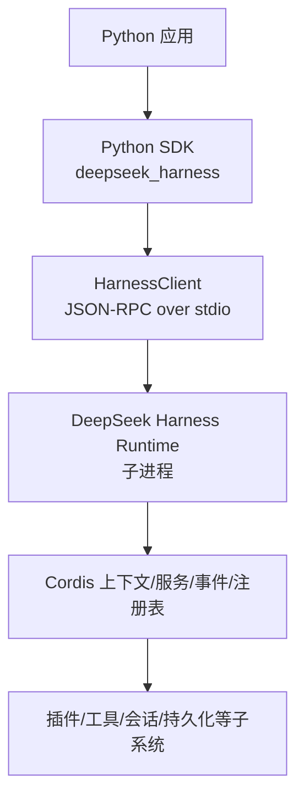
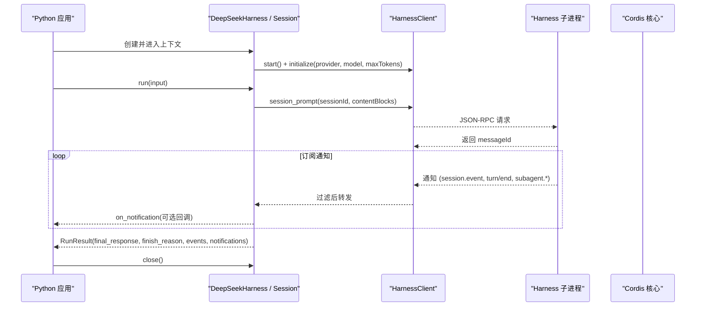
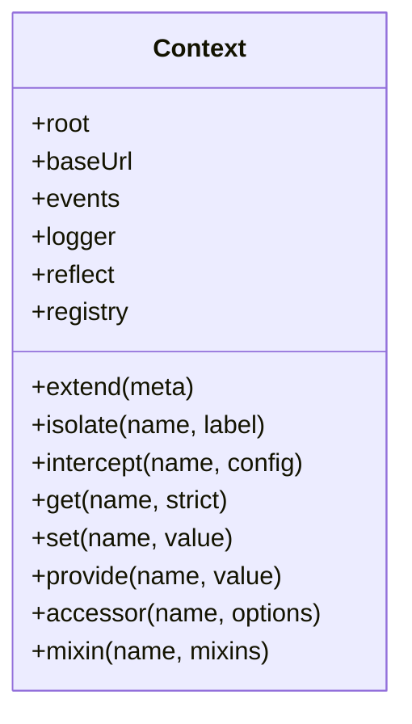
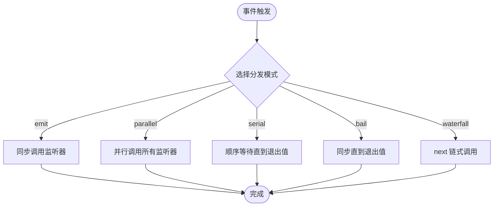
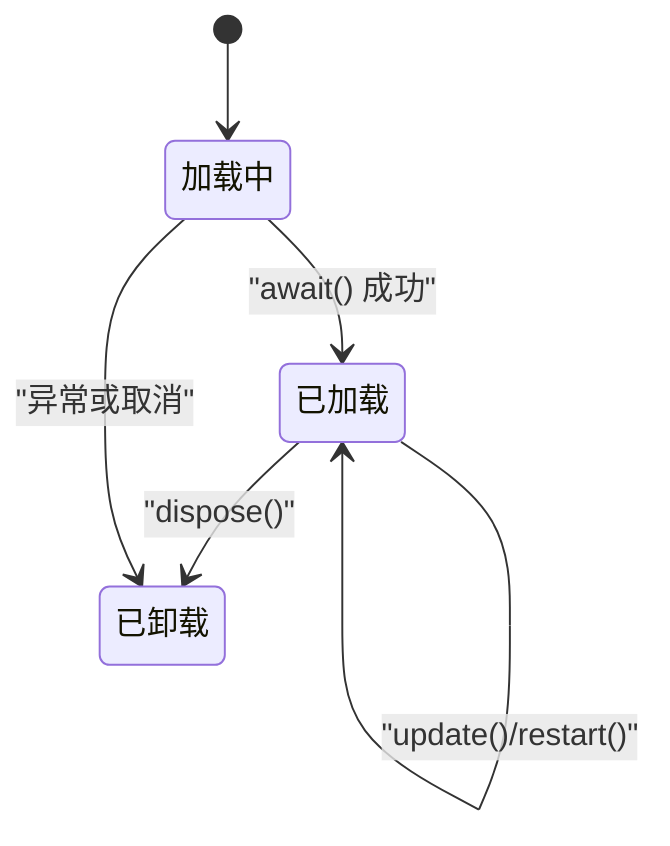
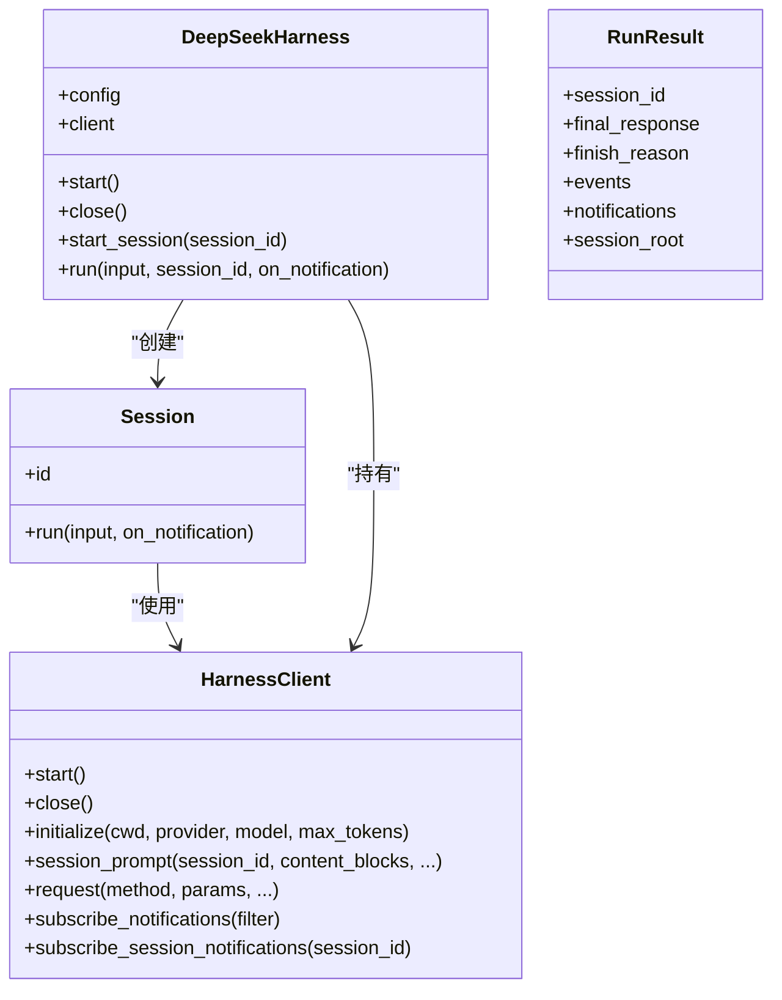
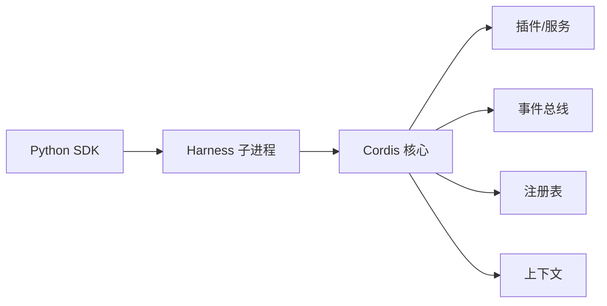

# API 参考

<cite>
**本文引用的文件**
- [docs/cordis-api/context.md](file://docs/cordis-api/context.md)
- [docs/cordis-api/events.md](file://docs/cordis-api/events.md)
- [docs/cordis-api/fiber.md](file://docs/cordis-api/fiber.md)
- [docs/cordis-api/registry.md](file://docs/cordis-api/registry.md)
- [docs/cordis-api/service.md](file://docs/cordis-api/service.md)
- [python/sdk/src/deepseek_harness/__init__.py](file://python/sdk/src/deepseek_harness/__init__.py)
- [python/sdk/src/deepseek_harness/api.py](file://python/sdk/src/deepseek_harness/api.py)
- [python/sdk/src/deepseek_harness/client.py](file://python/sdk/src/deepseek_harness/client.py)
- [python/sdk/src/deepseek_harness/models.py](file://python/sdk/src/deepseek_harness/models.py)
- [python/sdk/src/deepseek_harness/errors.py](file://python/sdk/src/deepseek_harness/errors.py)
- [python/sdk/README.md](file://python/sdk/README.md)
- [examples/jsonrpc-agent/README.md](file://examples/jsonrpc-agent/README.md)
</cite>

## 目录
1. [简介](#简介)
2. [项目结构](#项目结构)
3. [核心组件](#核心组件)
4. [架构总览](#架构总览)
5. [详细组件分析](#详细组件分析)
6. [依赖关系分析](#依赖关系分析)
7. [性能与可靠性](#性能与可靠性)
8. [故障排除指南](#故障排除指南)
9. [版本兼容性与迁移](#版本兼容性与迁移)
10. [结论](#结论)
11. [附录：公共接口规格与示例](#附录：公共接口规格与示例)

## 简介
本参考文档面向使用 DeepSeek Harness 的开发者，覆盖以下目标：
- Cordis API 的服务接口定义、事件类型规范与上下文使用方法
- Python SDK 的安装配置、核心类与方法
- 所有公共接口的参数、返回值与错误处理说明
- 丰富的代码示例与使用模式
- 版本兼容性与迁移建议
- API 调试与故障排除方法

## 项目结构
DeepSeek Harness 由两部分组成：
- Cordis 运行时与插件体系（TypeScript）：提供 Context、Fiber、Service、Registry、Events 等核心能力
- Python SDK：通过 JSON-RPC over stdio 启动并驱动本地 Harness 子进程，暴露高层 API 供 Python 调用

图表来源
- [python/sdk/src/deepseek_harness/client.py:37-116](file://python/sdk/src/deepseek_harness/client.py#L37-L116)
- [python/sdk/src/deepseek_harness/api.py:48-124](file://python/sdk/src/deepseek_harness/api.py#L48-L124)
- [docs/cordis-api/context.md:4-12](file://docs/cordis-api/context.md#L4-L12)

章节来源
- [python/sdk/README.md:1-52](file://python/sdk/README.md#L1-L52)
- [examples/jsonrpc-agent/README.md:1-41](file://examples/jsonrpc-agent/README.md#L1-L41)

## 核心组件
- Cordis 上下文（Context）：插件加载、服务解析、事件总线、反射层、隔离与作用域控制
- Fiber：插件实例的生命周期、配置、效果与清理
- Service：基于名称的服务注册与访问
- Registry：插件加载与依赖注入
- Events：事件分发模式（emit/parallel/serial/bail/waterfall）与监听器管理

章节来源
- [docs/cordis-api/context.md:4-163](file://docs/cordis-api/context.md#L4-L163)
- [docs/cordis-api/fiber.md:4-112](file://docs/cordis-api/fiber.md#L4-L112)
- [docs/cordis-api/service.md:4-103](file://docs/cordis-api/service.md#L4-L103)
- [docs/cordis-api/registry.md:4-153](file://docs/cordis-api/registry.md#L4-L153)
- [docs/cordis-api/events.md:4-208](file://docs/cordis-api/events.md#L4-L208)

## 架构总览
Python SDK 通过 JSON-RPC 与本地 Harness 子进程通信。SDK 负责：
- 启动/关闭子进程
- 初始化（provider/model/maxTokens）
- 发送 session/prompt 请求
- 订阅并过滤通知（session.event、turn/end、subagent.*）
- 组装结果（最终响应、结束原因、事件列表、通知列表）

图表来源
- [python/sdk/src/deepseek_harness/api.py:97-124](file://python/sdk/src/deepseek_harness/api.py#L97-L124)
- [python/sdk/src/deepseek_harness/api.py:127-183](file://python/sdk/src/deepseek_harness/api.py#L127-L183)
- [python/sdk/src/deepseek_harness/client.py:117-155](file://python/sdk/src/deepseek_harness/client.py#L117-L155)
- [python/sdk/src/deepseek_harness/client.py:228-296](file://python/sdk/src/deepseek_harness/client.py#L228-L296)

## 详细组件分析

### Cordis 上下文（Context）
- 作用：作为插件与服务的主入口，支持扩展、隔离、拦截、根上下文共享、事件总线、日志、反射与注册表
- 关键能力
  - 扩展与隔离：extend/isolate 创建子上下文与作用域隔离
  - 拦截：intercept 为特定服务注入配置
  - 服务存取：get/set/provide/accessor/mixin
  - 内置服务：events、logger、reflect、registry

图表来源
- [docs/cordis-api/context.md:14-163](file://docs/cordis-api/context.md#L14-L163)
- [docs/cordis-api/context.md:237-365](file://docs/cordis-api/context.md#L237-L365)

章节来源
- [docs/cordis-api/context.md:4-365](file://docs/cordis-api/context.md#L4-L365)

### 事件系统（Events）
- 分发模式
  - emit：同步触发，忽略返回值
  - parallel：并发执行所有监听器，全部完成后 resolve
  - serial：按序等待，遇到“退出值”即停止并返回
  - bail：同步模式下遇到“退出值”立即停止
  - waterfall：链式 next 调用，最后一个参数为 next
- 监听器管理
  - on/once：注册监听器，支持 prepend/global 选项
  - EventOptions：prepend、global

图表来源
- [docs/cordis-api/events.md:8-123](file://docs/cordis-api/events.md#L8-L123)
- [docs/cordis-api/events.md:125-187](file://docs/cordis-api/events.md#L125-L187)
- [docs/cordis-api/events.md:189-208](file://docs/cordis-api/events.md#L189-L208)

章节来源
- [docs/cordis-api/events.md:4-208](file://docs/cordis-api/events.md#L4-L208)

### Fiber（插件生命周期）
- 概念：一个插件实例的运行期载体，持有配置、状态、效果与清理
- 关键能力
  - effect：注册带清理的效果，支持同步/异步/生成器
  - dispose：卸载插件并等待清理完成
  - update/restart：更新配置并重启
  - getEffects：获取当前效果元数据用于诊断
  - await：等待稳定状态并抛出启动错误

图表来源
- [docs/cordis-api/fiber.md:8-112](file://docs/cordis-api/fiber.md#L8-L112)
- [docs/cordis-api/fiber.md:212-274](file://docs/cordis-api/fiber.md#L212-L274)

章节来源
- [docs/cordis-api/fiber.md:4-376](file://docs/cordis-api/fiber.md#L4-L376)

### 服务（Service）
- 概念：以名称注册的上下文服务，子类在构造时自动注册，随 fiber 生命周期移除
- 静态符号键：init/check/config/invoke/extend/tracker/resolveConfig
- 属性：name 表示注册名

章节来源
- [docs/cordis-api/service.md:4-103](file://docs/cordis-api/service.md#L4-L103)

### 注册表（Registry）
- 插件加载与依赖注入
  - inject：声明依赖并在可用时运行回调
  - plugin：加载函数/类/对象形式的插件
- 插件形状：Function/Constructor/Object，支持 Config 校验、inject、provide、intercept

章节来源
- [docs/cordis-api/registry.md:4-153](file://docs/cordis-api/registry.md#L4-L153)

### Python SDK：安装与配置
- 安装
  - pip install deepseek-harness-sdk
  - 导入模块 deepseek_harness
- 基本用法
  - 使用 with DeepSeekHarness() 自动管理子进程生命周期
  - harness.run("提示词") 返回 RunResult
- 高级配置
  - provider/model/maxTokens/cordis/env/base_url/api_key 等
  - 通过 DSH_CORDIS_CONFIG 指定自定义组合配置
  - 默认会注入打包的默认配置路径（除非显式覆盖）

章节来源
- [python/sdk/README.md:1-52](file://python/sdk/README.md#L1-L52)

### Python SDK：核心类与方法
- DeepSeekHarness
  - __init__：接受配置或关键字参数；设置工作目录与环境变量
  - start/close：启动并初始化子进程；关闭并回收
  - start_session/run：创建会话并执行一轮对话
- Session
  - run：订阅会话通知，收集事件与通知，返回 RunResult
- HarnessClient
  - start/close：启动/关闭子进程，读写 JSON-RPC over stdio
  - initialize：向子进程发送初始化参数
  - session_prompt：发送 prompt，返回 messageId
  - request/notify/subscribe_notifications：通用请求与通知订阅
  - 通知过滤：按会话树过滤子代理与后代会话通知
- 模型与错误
  - Notification/IncomingRequest/ServerInfo/InitializeResponse
  - HarnessError/TransportClosedError/SdkProtocolError/JsonRpcError

图表来源
- [python/sdk/src/deepseek_harness/api.py:13-46](file://python/sdk/src/deepseek_harness/api.py#L13-L46)
- [python/sdk/src/deepseek_harness/api.py:48-183](file://python/sdk/src/deepseek_harness/api.py#L48-L183)
- [python/sdk/src/deepseek_harness/client.py:24-55](file://python/sdk/src/deepseek_harness/client.py#L24-L55)
- [python/sdk/src/deepseek_harness/client.py:117-155](file://python/sdk/src/deepseek_harness/client.py#L117-L155)

章节来源
- [python/sdk/src/deepseek_harness/api.py:1-243](file://python/sdk/src/deepseek_harness/api.py#L1-L243)
- [python/sdk/src/deepseek_harness/client.py:1-558](file://python/sdk/src/deepseek_harness/client.py#L1-L558)
- [python/sdk/src/deepseek_harness/models.py:1-33](file://python/sdk/src/deepseek_harness/models.py#L1-L33)
- [python/sdk/src/deepseek_harness/errors.py:1-24](file://python/sdk/src/deepseek_harness/errors.py#L1-L24)

## 依赖关系分析
- Python SDK 依赖
  - pydantic：模型校验
  - subprocess/threading/queue：子进程与并发读取
  - deepseek_harness_runtime（可选）：解析打包的运行时与默认配置
- Cordis 运行时依赖
  - 插件/服务/事件/注册表：通过 Context/Fiber/Service/Registry/Events 协作
  - 子系统：会话、工具、持久化、LLM 适配器等

图表来源
- [python/sdk/src/deepseek_harness/client.py:424-454](file://python/sdk/src/deepseek_harness/client.py#L424-L454)
- [docs/cordis-api/context.md:4-163](file://docs/cordis-api/context.md#L4-L163)
- [docs/cordis-api/events.md:4-208](file://docs/cordis-api/events.md#L4-L208)
- [docs/cordis-api/registry.md:4-153](file://docs/cordis-api/registry.md#L4-L153)

章节来源
- [python/sdk/src/deepseek_harness/client.py:424-454](file://python/sdk/src/deepseek_harness/client.py#L424-L454)

## 性能与可靠性
- 子进程复用：DeepSeekHarness 保持子进程生命周期，跨多次 run 复用，减少启动开销
- 超时控制：request_timeout_seconds 控制请求等待；shutdown_timeout_seconds 控制优雅关闭
- 通知流控：Session.run 通过订阅与过滤收集事件，避免阻塞主循环
- 健壮性：
  - 传输关闭时抛出 TransportClosedError，附带 stderr 尾部与退出码
  - JSON-RPC 错误封装为 JsonRpcError，包含 code/message/data
  - 协议违规（如 turn/end 缺少 reason.kind）抛出 SdkProtocolError

章节来源
- [python/sdk/src/deepseek_harness/client.py:87-116](file://python/sdk/src/deepseek_harness/client.py#L87-L116)
- [python/sdk/src/deepseek_harness/client.py:228-296](file://python/sdk/src/deepseek_harness/client.py#L228-L296)
- [python/sdk/src/deepseek_harness/client.py:399-422](file://python/sdk/src/deepseek_harness/client.py#L399-L422)
- [python/sdk/src/deepseek_harness/errors.py:4-24](file://python/sdk/src/deepseek_harness/errors.py#L4-L24)
- [python/sdk/src/deepseek_harness/api.py:225-243](file://python/sdk/src/deepseek_harness/api.py#L225-L243)

## 故障排除指南
- 无法找到运行时
  - 现象：ImportError/FileNotFoundError
  - 排查：确认已安装 deepseek-harness-runtime-bin，或通过 HarnessConfig.runtime_bin/bridge_bin 指定可执行路径
- 子进程意外退出
  - 现象：TransportClosedError，附带退出码与 stderr 尾部
  - 排查：检查环境变量（DEEPSEEK_API_KEY、DEEPSEEK_BASE_URL）、DSH_CWD、DSH_SESSION_ROOT、DSH_CORDIS_CONFIG
- 请求超时
  - 现象：TimeoutError，附带诊断信息
  - 排查：增大 request_timeout_seconds；检查模型端点可用性；查看 stderr 输出
- 通知未到达
  - 现象：RunResult.events 为空或 final_response 为空
  - 排查：确认 on_notification 回调与 subscribe_session_notifications 的使用；检查会话 ID 与消息回执匹配逻辑
- 协议错误
  - 现象：SdkProtocolError
  - 排查：确保 runtime 遵循 SDK 协议（如 turn/end 必须包含 data.reason.kind）

章节来源
- [python/sdk/src/deepseek_harness/client.py:424-454](file://python/sdk/src/deepseek_harness/client.py#L424-L454)
- [python/sdk/src/deepseek_harness/client.py:399-422](file://python/sdk/src/deepseek_harness/client.py#L399-L422)
- [python/sdk/src/deepseek_harness/api.py:225-243](file://python/sdk/src/deepseek_harness/api.py#L225-L243)
- [python/sdk/src/deepseek_harness/errors.py:4-24](file://python/sdk/src/deepseek_harness/errors.py#L4-L24)

## 版本兼容性与迁移
- 运行时绑定：Python SDK 安装时会安装对应版本的 deepseek-harness-runtime-bin，保证 ABI 与协议一致
- 配置通道优先级：runtime_bin/bridge_bin/launch_args_override 优先于打包默认配置；若显式设置则跳过注入默认配置
- 环境变量约定：
  - DEEPSEEK_API_KEY/DEEPSEEK_BASE_URL：模型凭据与端点
  - DSH_CWD/DSH_SESSION_ROOT/DSH_SYSTEM_PROMPT：工作区、会话目录、系统提示
  - DSH_CORDIS_CONFIG：Cordis 组合配置文件路径
- 迁移建议：
  - 从旧版迁移到新 SDK：保持 provider/model 语义不变；将自定义配置通过 cordis 或 DSH_CORDIS_CONFIG 传入
  - 若需替换 LLM 提供商：在自定义 Cordis 中挂载 llm-pi-ai 并配置相应 provider/model

章节来源
- [python/sdk/README.md:10-52](file://python/sdk/README.md#L10-L52)
- [examples/jsonrpc-agent/README.md:16-41](file://examples/jsonrpc-agent/README.md#L16-L41)

## 结论
DeepSeek Harness 通过 Cordis 提供了强大的插件化上下文与服务机制，Python SDK 则以简洁的高层 API 屏蔽了子进程与 JSON-RPC 细节，使开发者能专注于业务逻辑。结合事件系统与通知过滤，可实现对会话生命周期的精细控制。通过合理的配置与环境变量，可以灵活切换模型、工具与持久化策略，满足多种部署场景。

## 附录：公共接口规格与示例

### Cordis API 概览
- 上下文（Context）
  - extend/isolate/intercept：作用域与控制
  - get/set/provide/accessor/mixin：服务存取与混合
  - events/logger/reflect/registry：内置服务
- 事件（Events）
  - emit/parallel/serial/bail/waterfall：分发模式
  - on/once：监听器注册
- Fiber（Fiber）
  - effect/dispose/update/restart/getEffects/await：生命周期管理
- 服务（Service）
  - name：服务名
  - 静态符号键：init/check/config/invoke/extend/tracker/resolveConfig
- 注册表（Registry）
  - inject/plugin：依赖注入与插件加载
  - Plugin 形状：Function/Constructor/Object

章节来源
- [docs/cordis-api/context.md:4-365](file://docs/cordis-api/context.md#L4-L365)
- [docs/cordis-api/events.md:4-208](file://docs/cordis-api/events.md#L4-L208)
- [docs/cordis-api/fiber.md:4-376](file://docs/cordis-api/fiber.md#L4-L376)
- [docs/cordis-api/service.md:4-103](file://docs/cordis-api/service.md#L4-L103)
- [docs/cordis-api/registry.md:4-153](file://docs/cordis-api/registry.md#L4-L153)

### Python SDK 公共接口规格

- DeepSeekHarness
  - 构造：DeepSeekHarness(config=None, **kwargs)
    - 参数：DeepSeekHarnessConfig 或关键字参数（provider/model/max_tokens/cwd/runtime_cwd/session_root/cordis/env/runtime_bin/launch_args_override/request_timeout_seconds/shutdown_timeout_seconds/base_url/api_key）
    - 行为：设置工作目录与环境变量，初始化 HarnessClient
  - start()：启动子进程并 initialize
  - close()：关闭子进程并重置状态
  - start_session(session_id=None) -> Session：创建会话
  - run(input, *, session_id=None, on_notification=None) -> RunResult：执行一轮对话

- Session
  - run(input, *, on_notification=None) -> RunResult
    - input：字符串或内容块列表
    - 行为：订阅会话通知，收集事件与通知，等待 idle 后返回结果

- HarnessClient
  - start()/close()：启动/关闭子进程
  - initialize(cwd, provider, model, max_tokens=None) -> InitializeResponse
  - session_prompt(session_id, content_blocks, *, on_notification=None, notification_subscription=None) -> str：返回 messageId
  - request(method, params, *, response_model, timeout_seconds=None, on_notification=None, notification_filter=None, notification_subscription=None) -> ModelT
  - notify(method, params=None) -> None
  - subscribe_notifications(notification_filter=None) -> NotificationSubscription
  - subscribe_session_notifications(session_id) -> NotificationSubscription

- 数据模型
  - RunResult：session_id、final_response、finish_reason、events、notifications、session_root
  - Notification：method、payload
  - IncomingRequest：id、method、payload
  - ServerInfo：name、version
  - InitializeResponse：serverInfo

- 错误类型
  - HarnessError：基类
  - TransportClosedError：子进程关闭或 stdout 关闭
  - SdkProtocolError：运行时数据不符合 SDK 协议
  - JsonRpcError：JSON-RPC 错误响应（code、message、data）

章节来源
- [python/sdk/src/deepseek_harness/api.py:13-46](file://python/sdk/src/deepseek_harness/api.py#L13-L46)
- [python/sdk/src/deepseek_harness/api.py:48-183](file://python/sdk/src/deepseek_harness/api.py#L48-L183)
- [python/sdk/src/deepseek_harness/api.py:205-243](file://python/sdk/src/deepseek_harness/api.py#L205-L243)
- [python/sdk/src/deepseek_harness/client.py:24-55](file://python/sdk/src/deepseek_harness/client.py#L24-L55)
- [python/sdk/src/deepseek_harness/client.py:117-155](file://python/sdk/src/deepseek_harness/client.py#L117-L155)
- [python/sdk/src/deepseek_harness/client.py:157-227](file://python/sdk/src/deepseek_harness/client.py#L157-L227)
- [python/sdk/src/deepseek_harness/client.py:507-558](file://python/sdk/src/deepseek_harness/client.py#L507-L558)
- [python/sdk/src/deepseek_harness/models.py:1-33](file://python/sdk/src/deepseek_harness/models.py#L1-L33)
- [python/sdk/src/deepseek_harness/errors.py:1-24](file://python/sdk/src/deepseek_harness/errors.py#L1-L24)

### 使用示例与模式

- 快速开始
  - 安装 SDK 并通过 with DeepSeekHarness() 启动
  - 调用 harness.run("提示词") 获取结果
  - 参考路径：[python/sdk/README.md:10-27](file://python/sdk/README.md#L10-L27)

- 自定义组合配置
  - 通过 cordis 或 DSH_CORDIS_CONFIG 指定自定义 Cordis 文件
  - 参考路径：[python/sdk/README.md:29-43](file://python/sdk/README.md#L29-L43)

- 环境变量与运行时
  - 设置 DEEPSEEK_API_KEY、DEEPSEEK_BASE_URL、DSH_CWD、DSH_SESSION_ROOT、DSH_SYSTEM_PROMPT
  - 参考路径：[examples/jsonrpc-agent/README.md:16-29](file://examples/jsonrpc-agent/README.md#L16-L29)

- 会话与通知
  - 使用 Session.run 订阅通知，收集事件与通知
  - 参考路径：[python/sdk/src/deepseek_harness/api.py:127-183](file://python/sdk/src/deepseek_harness/api.py#L127-L183)

- 低层客户端
  - 直接使用 HarnessClient.session_prompt 获取 messageId，自行管理活动边界
  - 参考路径：[python/sdk/src/deepseek_harness/client.py:138-155](file://python/sdk/src/deepseek_harness/client.py#L138-L155)