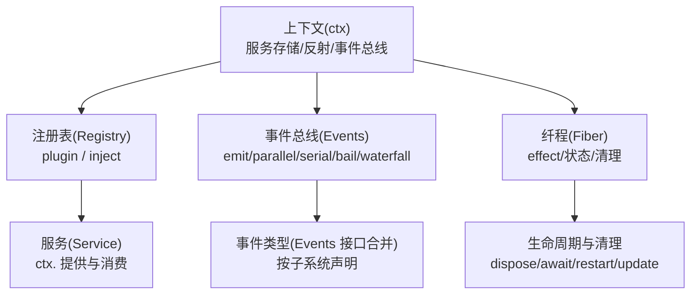
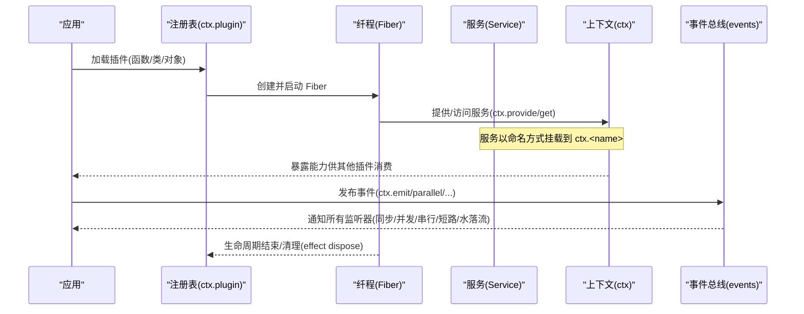
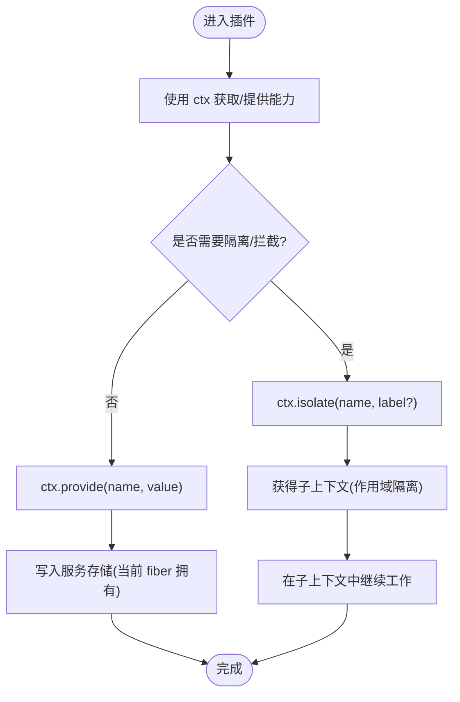
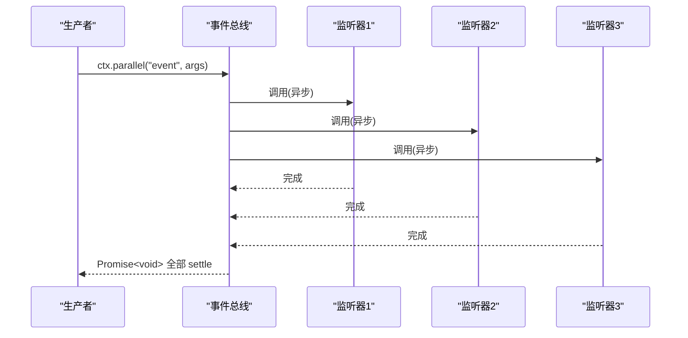
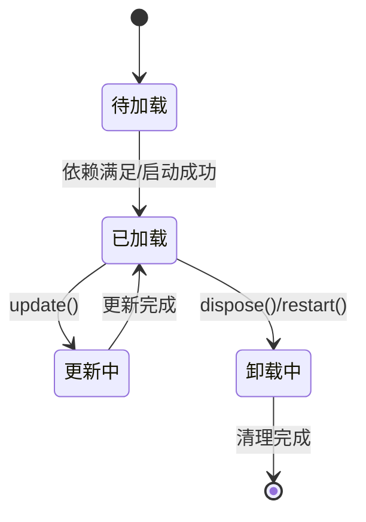
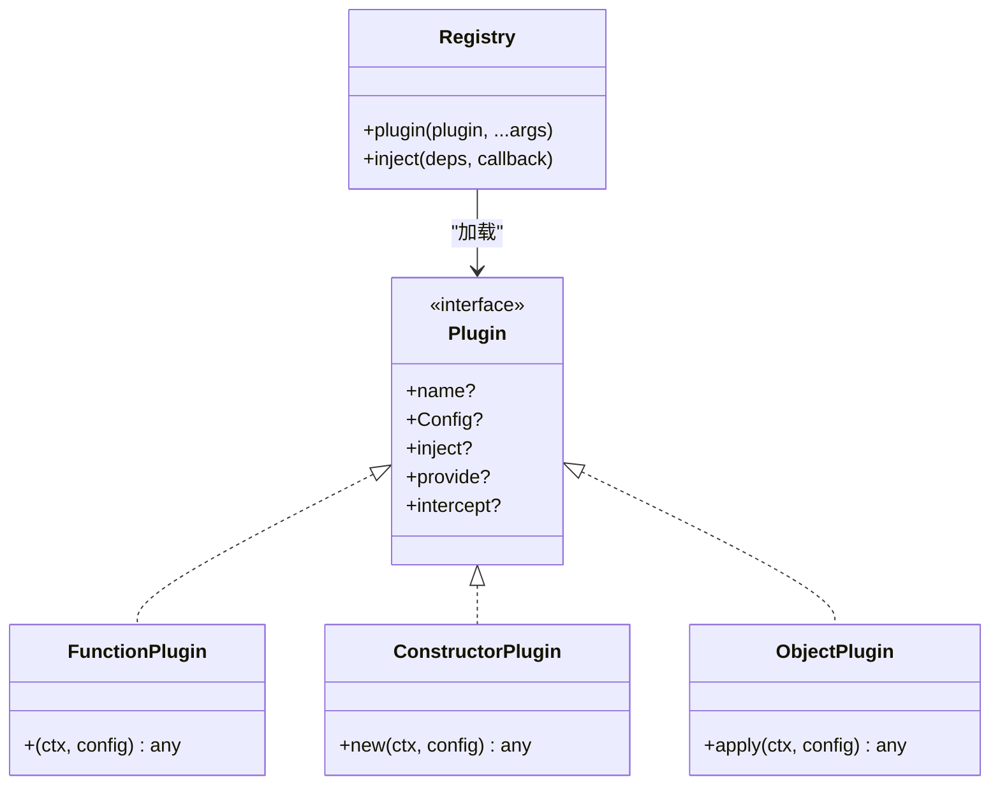
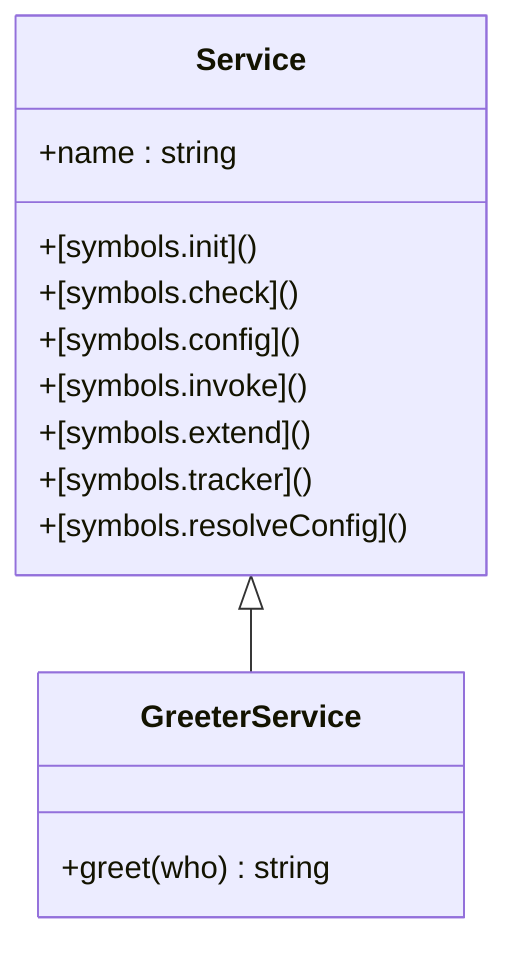
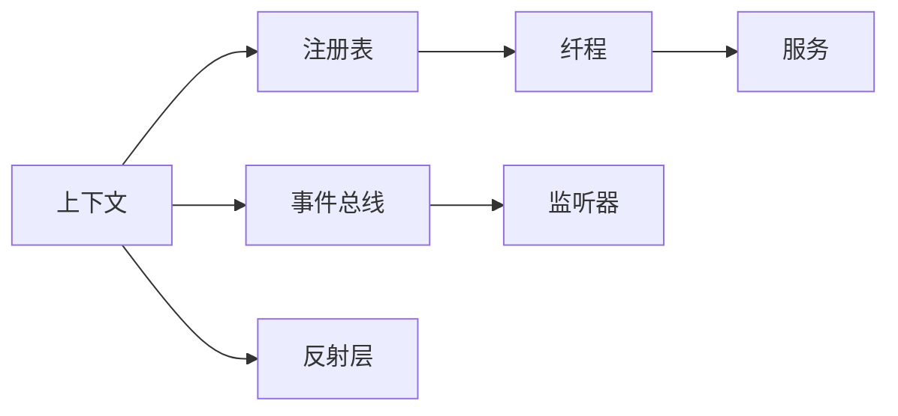

# Cordis API

<cite>
**本文引用的文件**
- [服务.md](file://docs/cordis-api/service.md)
- [事件.md](file://docs/cordis-api/events.md)
- [上下文.md](file://docs/cordis-api/context.md)
- [注册表.md](file://docs/cordis-api/registry.md)
- [纤程.md](file://docs/cordis-api/fiber.md)
- [继承的 API.md](file://docs/cordis-api/inherited.md)
- [教程：服务.md](file://docs/cordis-tutorial/03-services.md)
- [教程：事件.md](file://docs/cordis-tutorial/04-events.md)
</cite>

## 目录
1. [简介](#简介)
2. [项目结构](#项目结构)
3. [核心组件](#核心组件)
4. [架构总览](#架构总览)
5. [详细组件分析](#详细组件分析)
6. [依赖关系分析](#依赖关系分析)
7. [性能考量](#性能考量)
8. [故障排查指南](#故障排查指南)
9. [结论](#结论)
10. [附录](#附录)

## 简介
本文件为 Cordis 框架的完整 API 文档，聚焦以下目标：
- 服务接口定义、服务的注册与发现机制
- 事件类型规范、事件的发布与订阅模式（含多种分发策略）
- 上下文的获取与使用方法（扩展、隔离、拦截）
- 插件加载与依赖注入（inject/plugin）
- 版本兼容性、错误处理模式与最佳实践
- 通过具体示例展示如何创建自定义服务、监听事件和处理上下文数据

Cordis 以“上下文”为核心，所有服务、事件、生命周期能力均通过 ctx 暴露；插件通过注册表加载，借助 Fiber 管理生命周期与副作用；服务在命名空间内被提供与消费；事件用于解耦通信。

## 项目结构
本仓库中与 Cordis API 直接相关的文档位于 docs/cordis-api 与 docs/cordis-tutorial：
- docs/cordis-api：由脚本从 vendored 源码生成，覆盖 Context、Events、Fiber、Registry、Service 等核心 API 的签名与说明
- docs/cordis-tutorial：面向实践的教程，演示如何声明服务、使用 inject、发布/订阅事件、以及 waterfall 拦截模式

图示来源
- [上下文.md:14-96](file://docs/cordis-api/context.md#L14-L96)
- [注册表.md:8-56](file://docs/cordis-api/registry.md#L8-L56)
- [事件.md:8-123](file://docs/cordis-api/events.md#L8-L123)
- [纤程.md:8-37](file://docs/cordis-api/fiber.md#L8-L37)

章节来源
- [上下文.md:1-163](file://docs/cordis-api/context.md#L1-L163)
- [注册表.md:1-56](file://docs/cordis-api/registry.md#L1-L56)
- [事件.md:1-123](file://docs/cordis-api/events.md#L1-L123)
- [纤程.md:1-37](file://docs/cordis-api/fiber.md#L1-L37)

## 核心组件
- 上下文(Context)：插件运行时的根容器，提供 get/set/provide/accessor/mixin、extend/isolate/intercept、events/logger/registry/reflect 等能力
- 事件(Events)：每个 ctx 混入的事件派发方法，支持 emit/parallel/serial/bail/waterfall 五种分发模式，并提供 on/once 注册监听器
- 纤程(Fiber)：一次插件实例的生命周期载体，负责 effect 注册、配置校验、状态转换、清理与重启
- 注册表(Registry)：插件加载与依赖注入，支持函数/类/对象三种插件形态，以及 inject 声明式依赖
- 服务(Service)：基于 Service 基类的可命名能力提供者，自动注册到 ctx.<name>，随 fiber 卸载而移除

章节来源
- [上下文.md:14-163](file://docs/cordis-api/context.md#L14-L163)
- [事件.md:8-187](file://docs/cordis-api/events.md#L8-L187)
- [纤程.md:8-376](file://docs/cordis-api/fiber.md#L8-L376)
- [注册表.md:8-153](file://docs/cordis-api/registry.md#L8-L153)
- [服务.md:4-103](file://docs/cordis-api/service.md#L4-L103)

## 架构总览
下图展示了插件加载、服务提供与消费、事件发布与订阅的整体流程。

图示来源
- [注册表.md:35-56](file://docs/cordis-api/registry.md#L35-L56)
- [纤程.md:8-37](file://docs/cordis-api/fiber.md#L8-L37)
- [上下文.md:237-365](file://docs/cordis-api/context.md#L237-L365)
- [事件.md:8-123](file://docs/cordis-api/events.md#L8-L123)

## 详细组件分析

### 上下文(Context)
- 子上下文派生：extend 增加元数据；isolate 对指定服务名建立独立作用域；intercept 为下游插件注入拦截配置
- 服务存取：get/set/provide/accessor/mixin，支持强/弱依赖与动态绑定
- 内置能力：events、logger、registry、reflect、root、baseUrl 等

图示来源
- [上下文.md:14-96](file://docs/cordis-api/context.md#L14-L96)
- [上下文.md:237-365](file://docs/cordis-api/context.md#L237-L365)

章节来源
- [上下文.md:14-163](file://docs/cordis-api/context.md#L14-L163)
- [上下文.md:237-365](file://docs/cordis-api/context.md#L237-L365)

### 事件(Events)
- 分发模式：
  - emit：同步广播，不等待返回值
  - parallel：并发执行所有监听器，全部 settle 后返回
  - serial：顺序 await，首个非空返回值即停止
  - bail：同步版本的 serial
  - waterfall：中间件风格，最后一个参数为 next，调用 next 继续链，不调用则短路
- 监听器注册：on/once，支持 prepend/global 选项，返回释放函数

图示来源
- [事件.md:8-29](file://docs/cordis-api/events.md#L8-L29)
- [事件.md:51-95](file://docs/cordis-api/events.md#L51-L95)
- [事件.md:97-123](file://docs/cordis-api/events.md#L97-L123)
- [事件.md:125-187](file://docs/cordis-api/events.md#L125-L187)

章节来源
- [事件.md:8-187](file://docs/cordis-api/events.md#L8-L187)

### 纤程(Fiber)
- 生命周期：state、await、restart、update、dispose
- 副作用：effect 注册清理回调，支持同步/异步/迭代器形式
- 诊断：getEffects 输出效果树；assertActive 检查有效性
- 错误：INACTIVE_EFFECT 等稳定错误码

图示来源
- [纤程.md:8-37](file://docs/cordis-api/fiber.md#L8-L37)
- [纤程.md:146-275](file://docs/cordis-api/fiber.md#L146-L275)
- [纤程.md:331-355](file://docs/cordis-api/fiber.md#L331-L355)

章节来源
- [纤程.md:8-376](file://docs/cordis-api/fiber.md#L8-L376)

### 注册表(Registry)
- 插件形态：函数、类、对象（apply）
- 依赖注入：inject 数组或对象映射，确保依赖就绪后才运行
- 运行时记录：name、fibers、Config、callback 等

图示来源
- [注册表.md:8-56](file://docs/cordis-api/registry.md#L8-L56)
- [注册表.md:58-121](file://docs/cordis-api/registry.md#L58-L121)

章节来源
- [注册表.md:8-153](file://docs/cordis-api/registry.md#L8-L153)

### 服务(Service)
- 命名服务：继承 Service 并在构造时传入名称，自动注册到 ctx.<name>
- 静态符号：init/check/config/invoke/extend/tracker/resolveConfig 等扩展点
- 生命周期：随 fiber 卸载自动移除

图示来源
- [服务.md:4-103](file://docs/cordis-api/service.md#L4-L103)

章节来源
- [服务.md:4-103](file://docs/cordis-api/service.md#L4-L103)

### 实战示例：创建自定义服务与消费
- 提供：定义 Service 子类，构造时 super(ctx, 'name') 注册；导出 name 与 apply，并通过 ctx.plugin 挂载
- 消费：在插件中使用 inject 声明依赖，或在运行时 ctx.get 探测可选依赖
- 类型安全：通过 declare module 合并 Context 接口，使 ctx.<name> 具备类型提示

参考路径
- [教程：服务.md:7-43](file://docs/cordis-tutorial/03-services.md#L7-L43)
- [教程：服务.md:44-95](file://docs/cordis-tutorial/03-services.md#L44-L95)

章节来源
- [教程：服务.md:7-95](file://docs/cordis-tutorial/03-services.md#L7-L95)

### 实战示例：事件发布与订阅
- 声明事件：在模块中合并 Events 接口，声明事件名与监听器签名
- 发布：ctx.emit/parallel/serial/bail/waterfall 选择合适分发模式
- 订阅：ctx.on/once 注册监听器，返回释放函数；监听器随 fiber 卸载自动移除

参考路径
- [教程：事件.md:7-79](file://docs/cordis-tutorial/04-events.md#L7-L79)
- [教程：事件.md:80-141](file://docs/cordis-tutorial/04-events.md#L80-L141)

章节来源
- [教程：事件.md:7-141](file://docs/cordis-tutorial/04-events.md#L7-L141)

### 上下文的使用：扩展、隔离与拦截
- extend：叠加元数据，不影响父上下文
- isolate：对特定服务名建立隔离作用域，便于替换实现
- intercept：为下游插件注入拦截配置，参与服务解析

参考路径
- [上下文.md:14-96](file://docs/cordis-api/context.md#L14-L96)

章节来源
- [上下文.md:14-96](file://docs/cordis-api/context.md#L14-L96)

## 依赖关系分析
- 上下文依赖事件总线、注册表、反射层与日志服务
- 注册表驱动插件加载，创建并管理 Fiber
- Fiber 管理 effect 与生命周期，影响服务可见性与清理
- 服务通过命名在上下文中共享，事件用于跨服务解耦通信

图示来源
- [上下文.md:120-163](file://docs/cordis-api/context.md#L120-L163)
- [注册表.md:8-56](file://docs/cordis-api/registry.md#L8-L56)
- [纤程.md:8-37](file://docs/cordis-api/fiber.md#L8-L37)
- [事件.md:8-123](file://docs/cordis-api/events.md#L8-L123)

章节来源
- [上下文.md:120-163](file://docs/cordis-api/context.md#L120-L163)
- [注册表.md:8-56](file://docs/cordis-api/registry.md#L8-L56)
- [纤程.md:8-37](file://docs/cordis-api/fiber.md#L8-L37)
- [事件.md:8-123](file://docs/cordis-api/events.md#L8-L123)

## 性能考量
- 事件分发模式选择：
  - emit：最轻量，适合纯副作用广播
  - parallel：高吞吐但需关注监听器耗时与异常聚合
  - serial/bail：适合优先级决策或短路场景
  - waterfall：适合中间件式处理，注意必须调用 next() 避免静默吞掉默认行为
- 服务依赖：
  - 使用 inject 保证依赖就绪，避免竞态
  - 可选依赖使用 ctx.get 探测，避免不必要的阻塞
- 上下文隔离：
  - isolate 可用于多实现共存，减少全局污染
- 纤程清理：
  - 合理使用 effect 管理资源，避免内存泄漏
  - 使用 await/restart/update 进行可控的重载与热更新

[本节为通用指导，无需特定文件引用]

## 故障排查指南
- 常见错误：
  - INACTIVE_EFFECT：在已销毁的 fiber 上注册 effect
  - ValidationError：插件配置未通过标准 schema 校验
- 定位手段：
  - 使用 ctx.events 的内部事件（如 internal/status、internal/dispatch）观察生命周期与事件分发
  - 使用 fiber.getEffects() 查看当前生效的效果树
  - 使用 ctx.logger 输出带名称的日志，便于区分不同插件
- 恢复策略：
  - 对配置变更使用 fiber.update(config) 触发受控重启
  - 对异常状态使用 fiber.restart() 重新加载
  - 必要时通过 ctx.isolate 隔离问题服务，逐步缩小范围

章节来源
- [纤程.md:331-376](file://docs/cordis-api/fiber.md#L331-L376)
- [继承的 API.md:23-40](file://docs/cordis-api/inherited.md#L23-L40)

## 结论
Cordis 以上下文为中心，结合注册表、纤程、服务与事件，提供了清晰的插件化架构与强大的扩展能力。通过正确的依赖声明、事件模式选择与上下文隔离，开发者可以构建高内聚、低耦合的可插拔系统。遵循本指南的最佳实践，可有效提升系统的可维护性与可观测性。

[本节为总结性内容，无需特定文件引用]

## 附录
- 版本兼容性
  - 事件分发模式与服务 API 在文档中标注了稳定的语义；建议通过标准 schema 校验配置，降低升级风险
  - 内部事件（internal/*）用于调试与工具集成，可能随版本演进调整，生产代码应谨慎依赖
- 最佳实践清单
  - 使用 inject 声明强依赖，使用 ctx.get 探测可选依赖
  - 合理选择事件分发模式，避免在高频路径上使用昂贵操作
  - 使用 isolate 隔离同名服务，便于测试与多实现共存
  - 使用 effect 管理资源，确保清理路径可靠
  - 使用 ctx.intercept 注入拦截配置，实现横切关注点（如日志、审计、权限）

[本节为补充信息，无需特定文件引用]