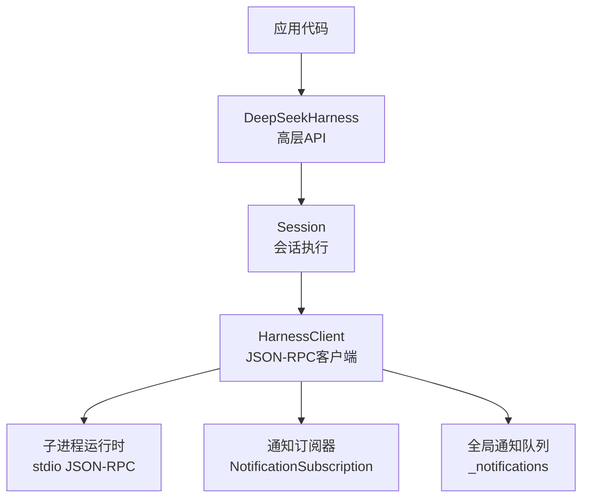
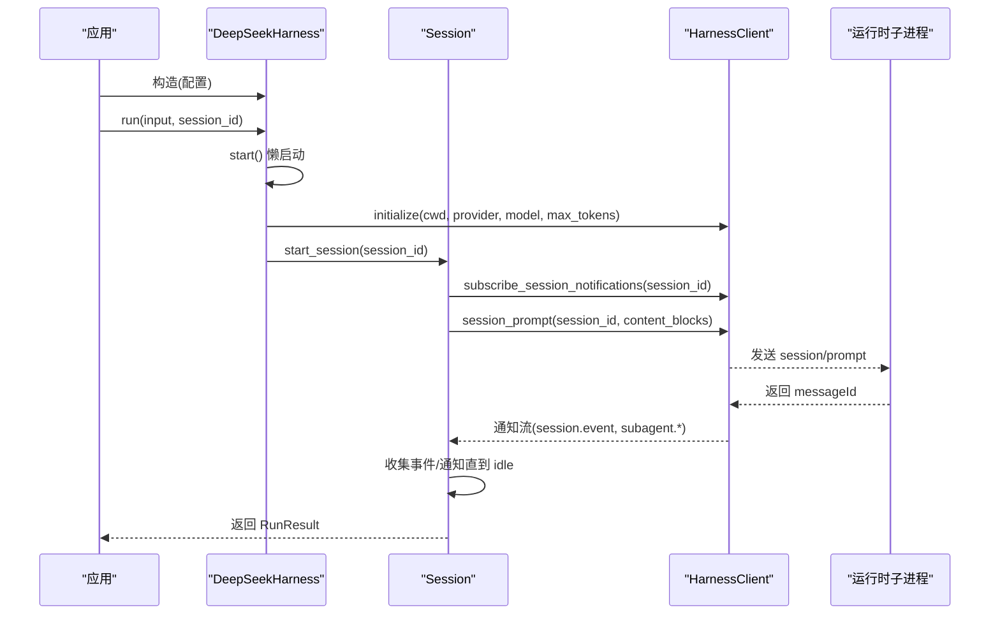
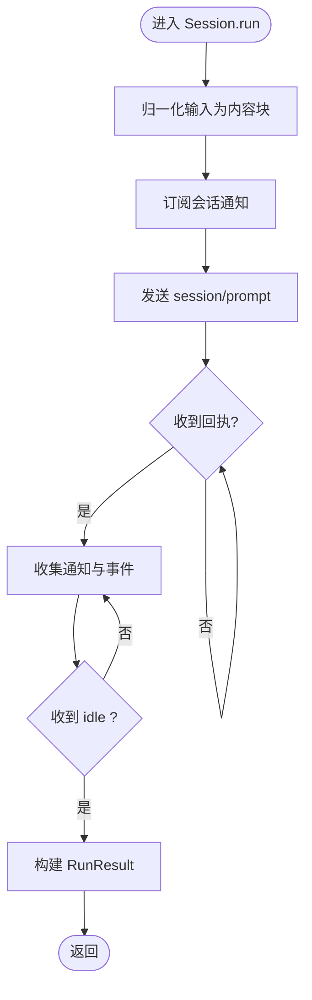
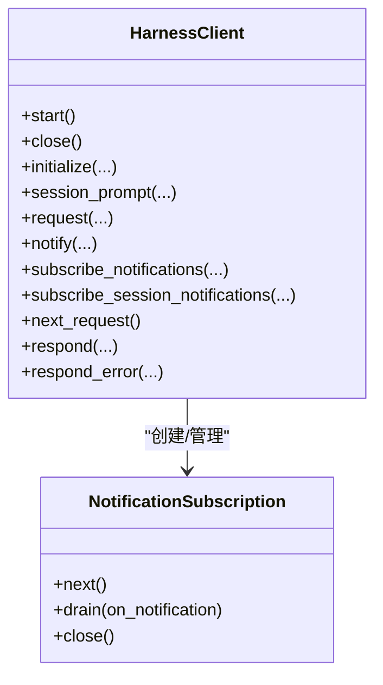

# Python SDK

<cite>
**本文引用的文件**
- [__init__.py](file://python/sdk/src/deepseek_harness/__init__.py)
- [api.py](file://python/sdk/src/deepseek_harness/api.py)
- [client.py](file://python/sdk/src/deepseek_harness/client.py)
- [models.py](file://python/sdk/src/deepseek_harness/models.py)
- [errors.py](file://python/sdk/src/deepseek_harness/errors.py)
- [README.md](file://python/sdk/README.md)
- [pyproject.toml](file://python/sdk/pyproject.toml)
- [test_client.py](file://python/sdk/tests/test_client.py)
- [minimal.py](file://examples/jsonrpc-agent/minimal.py)
- [python-sdk.md](file://docs/user/guide/python-sdk.md)
</cite>

## 目录
1. [简介](#简介)
2. [项目结构](#项目结构)
3. [核心组件](#核心组件)
4. [架构总览](#架构总览)
5. [详细组件分析](#详细组件分析)
6. [依赖关系与版本要求](#依赖关系与版本要求)
7. [性能与连接管理](#性能与连接管理)
8. [故障排查指南](#故障排查指南)
9. [结论](#结论)
10. [附录：快速上手示例](#附录快速上手示例)

## 简介
本 SDK 提供通过 JSON-RPC over stdio 驱动 DeepSeek Harness 的 Python 接口。它启动并复用本地运行时子进程，封装会话、通知、事件与结果解析，帮助开发者以同步方式创建和管理智能体任务，同时支持订阅会话通知、处理子代理树事件、超时控制与错误诊断等高级特性。

## 项目结构
SDK 位于 python/sdk 目录，核心模块如下：
- deepseek_harness/__init__.py：统一导出高层 API（DeepSeekHarness、Session、RunResult、配置类、客户端与模型类型）
- deepseek_harness/api.py：高层 API（DeepSeekHarness、Session、RunResult）与输入归一化、最终响应提取、结束原因解析
- deepseek_harness/client.py：底层 JSON-RPC 客户端（HarnessClient），负责子进程生命周期、请求/通知路由、超时、诊断信息收集
- deepseek_harness/models.py：通用数据模型（Notification、IncomingRequest、InitializeResponse、ServerInfo、JSON 类型别名）
- deepseek_harness/errors.py：异常体系（TransportClosedError、SdkProtocolError、JsonRpcError）

图表来源
- [api.py:48-124](file://python/sdk/src/deepseek_harness/api.py#L48-L124)
- [client.py:37-205](file://python/sdk/src/deepseek_harness/client.py#L37-L205)

章节来源
- [__init__.py:1-19](file://python/sdk/src/deepseek_harness/__init__.py#L1-L19)
- [api.py:13-124](file://python/sdk/src/deepseek_harness/api.py#L13-L124)
- [client.py:24-205](file://python/sdk/src/deepseek_harness/client.py#L24-L205)

## 核心组件
- DeepSeekHarness：可复用的同步 SDK 入口，负责启动/关闭运行时、初始化参数注入、创建 Session、执行 run()
- Session：绑定一个 session_id，封装一次“提示到空闲”的活动区间，收集事件与通知，返回 RunResult
- RunResult：包含 session_id、final_response、finish_reason、events、notifications、session_root
- HarnessClient：底层 JSON-RPC 客户端，维护子进程、读写线程、请求等待队列、通知订阅、会话父子关系追踪
- NotificationSubscription：上下文管理器式的通知订阅，支持 next()/drain()
- 模型与错误：Notification、IncomingRequest、InitializeResponse、ServerInfo；TransportClosedError、SdkProtocolError、JsonRpcError

章节来源
- [api.py:13-46](file://python/sdk/src/deepseek_harness/api.py#L13-L46)
- [api.py:48-183](file://python/sdk/src/deepseek_harness/api.py#L48-L183)
- [client.py:24-205](file://python/sdk/src/deepseek_harness/client.py#L24-L205)
- [models.py:8-33](file://python/sdk/src/deepseek_harness/models.py#L8-L33)
- [errors.py:4-24](file://python/sdk/src/deepseek_harness/errors.py#L4-L24)

## 架构总览
SDK 采用“高层 API + 低层客户端 + 子进程运行时”的分层架构：
- 高层 API 屏蔽子进程细节，提供面向会话的 run() 语义
- 低层客户端负责 JSON-RPC 消息编解码、请求-响应匹配、通知分发、超时与诊断
- 运行时通过 stdio 通信，支持自定义 Cordis 配置、环境变量注入、工作目录隔离

图表来源
- [api.py:97-124](file://python/sdk/src/deepseek_harness/api.py#L97-L124)
- [api.py:127-183](file://python/sdk/src/deepseek_harness/api.py#L127-L183)
- [client.py:117-155](file://python/sdk/src/deepseek_harness/client.py#L117-L155)
- [client.py:192-205](file://python/sdk/src/deepseek_harness/client.py#L192-L205)

## 详细组件分析

### 高层 API：DeepSeekHarness 与 Session
- 配置项：provider、model、max_tokens、cwd、runtime_cwd、session_root、cordis、env、runtime_bin、launch_args_override、request_timeout_seconds、shutdown_timeout_seconds、base_url、api_key
- 生命周期：作为上下文管理器或显式 close() 确保子进程被回收
- 会话：start_session() 创建 Session；run() 委托给 Session.run()
- Session.run()：
  - 将字符串输入归一化为内容块列表
  - 订阅会话及后代通知
  - 发送 session/prompt，等待 agent/inbox/spliced 回执后开始收集
  - 循环读取通知，直到收到 session.status=idle 为止
  - 从事件中提取 final_response 与 finish_reason，并返回 RunResult

图表来源
- [api.py:127-183](file://python/sdk/src/deepseek_harness/api.py#L127-L183)
- [api.py:186-243](file://python/sdk/src/deepseek_harness/api.py#L186-L243)

章节来源
- [api.py:13-124](file://python/sdk/src/deepseek_harness/api.py#L13-L124)
- [api.py:127-243](file://python/sdk/src/deepseek_harness/api.py#L127-L243)

### 低层客户端：HarnessClient
- 子进程管理：
  - start()：根据配置选择运行二进制（优先 runtime_bin/bridge_bin，否则解析打包默认参数），设置 cwd/env，启动子进程，开启 reader/stderr 线程
  - close()：发送 shutdown，关闭 stdin，终止/杀死进程，清理线程，失败时抛出诊断信息
- JSON-RPC 请求：
  - request()：包装 _request_raw()，按 response_model 校验返回值
  - _request_raw()：分配唯一 request_id，写入消息，轮询等待响应或通知，支持 on_notification 与 notification_filter，超时抛出 TimeoutError
- 通知系统：
  - subscribe_notifications() / subscribe_session_notifications()：基于过滤器的订阅，支持 next()/drain()
  - 自动记录 subagent.started/finished 建立父子会话关系，实现“会话树”通知路由
- 诊断：
  - 捕获 stderr 尾部输出，在传输错误或超时时附加到异常信息中

图表来源
- [client.py:37-205](file://python/sdk/src/deepseek_harness/client.py#L37-L205)
- [client.py:507-546](file://python/sdk/src/deepseek_harness/client.py#L507-L546)

章节来源
- [client.py:63-116](file://python/sdk/src/deepseek_harness/client.py#L63-L116)
- [client.py:117-178](file://python/sdk/src/deepseek_harness/client.py#L117-L178)
- [client.py:228-296](file://python/sdk/src/deepseek_harness/client.py#L228-L296)
- [client.py:310-422](file://python/sdk/src/deepseek_harness/client.py#L310-L422)
- [client.py:460-504](file://python/sdk/src/deepseek_harness/client.py#L460-L504)
- [client.py:507-546](file://python/sdk/src/deepseek_harness/client.py#L507-L546)

### 数据模型与错误
- 模型：
  - Notification：method + payload
  - IncomingRequest：id + method + payload
  - InitializeResponse：serverInfo
  - ServerInfo：name/version
  - JsonValue/JsonObject：JSON 类型别名
- 错误：
  - TransportClosedError：运行时退出或 stdout 关闭
  - SdkProtocolError：运行时违反协议（如 turn/end 缺少 reason.kind）
  - JsonRpcError：JSON-RPC 错误响应，携带 code/message/data

章节来源
- [models.py:8-33](file://python/sdk/src/deepseek_harness/models.py#L8-L33)
- [errors.py:4-24](file://python/sdk/src/deepseek_harness/errors.py#L4-L24)

## 依赖关系与版本要求
- Python 版本：>= 3.10
- 依赖：
  - pydantic >= 2.12, < 3
  - deepseek-harness-runtime-bin（同版本平台 wheel，提供运行时二进制与默认配置）
- 安装：
  - pip install deepseek-harness-sdk
  - 安装后无需额外 Node.js，可直接使用打包的运行时
- 环境变量：
  - DEEPSEEK_API_KEY、DEEPSEEK_BASE_URL 会被透传到子进程
  - DSH_CWD、DSH_SESSION_ROOT、DSH_CORDIS_CONFIG 由 SDK 注入或用户配置

章节来源
- [pyproject.toml:5-16](file://python/sdk/pyproject.toml#L5-L16)
- [README.md:10-27](file://python/sdk/README.md#L10-L27)
- [api.py:56-83](file://python/sdk/src/deepseek_harness/api.py#L56-L83)
- [client.py:424-454](file://python/sdk/src/deepseek_harness/client.py#L424-L454)

## 性能与连接管理
- 子进程复用：DeepSeekHarness 实例内部持有 HarnessClient，多次 run() 复用同一运行时，减少启动开销
- 懒启动：首次调用 start() 才启动子进程
- 超时控制：
  - request_timeout_seconds：单次请求等待响应的超时
  - shutdown_timeout_seconds：关闭时的优雅停机超时，超过则强制 kill
- 通知与事件：
  - Session.run() 仅收集根会话事件用于 final_response，避免子代理消息污染根响应
  - 通知订阅支持会话树过滤，自动识别 subagent 父子关系
- 诊断信息：
  - 传输错误或超时会附带子进程退出码与 stderr 尾部，便于定位问题

章节来源
- [api.py:97-124](file://python/sdk/src/deepseek_harness/api.py#L97-L124)
- [client.py:63-116](file://python/sdk/src/deepseek_harness/client.py#L63-L116)
- [client.py:228-296](file://python/sdk/src/deepseek_harness/client.py#L228-L296)
- [client.py:403-422](file://python/sdk/src/deepseek_harness/client.py#L403-L422)

## 故障排查指南
- 常见错误与含义：
  - TransportClosedError：运行时已退出或 stdout 关闭，检查子进程是否崩溃、stderr 是否有错误
  - SdkProtocolError：turn/end 事件缺少 data.reason.kind，说明运行时不符合协议约定
  - JsonRpcError：运行时返回 JSON-RPC 错误，查看 code/message/data 定位
  - TimeoutError：请求超时，检查 request_timeout_seconds 与运行时负载
- 调试建议：
  - 使用 on_notification 回调打印通知方法序列，确认事件顺序与状态机
  - 检查 DSH_CORDIS_CONFIG 是否正确指向你的插件组合
  - 通过 env 注入 DEEPSEEK_BASE_URL/DEEPSEEK_API_KEY 验证网络与鉴权
  - 使用 launch_args_override 指向自定义脚本进行最小化测试
- 参考用例：
  - 测试覆盖多种场景：环境注入、通知回调、子代理树、超时、关闭超时、非 JSON 行忽略、桥接请求路由等

章节来源
- [errors.py:4-24](file://python/sdk/src/deepseek_harness/errors.py#L4-L24)
- [api.py:225-243](file://python/sdk/src/deepseek_harness/api.py#L225-L243)
- [test_client.py:15-125](file://python/sdk/tests/test_client.py#L15-L125)
- [test_client.py:127-200](file://python/sdk/tests/test_client.py#L127-L200)
- [test_client.py:453-486](file://python/sdk/tests/test_client.py#L453-L486)
- [test_client.py:695-746](file://python/sdk/tests/test_client.py#L695-L746)
- [test_client.py:748-783](file://python/sdk/tests/test_client.py#L748-L783)

## 结论
该 Python SDK 提供了简洁的高层 API 与稳健的低层客户端，适合在 Python 应用中集成 DeepSeek Harness 的智能体能力。通过会话管理、通知订阅、超时与诊断机制，开发者可以可靠地编排任务、观察过程、处理异常，并在生产环境中稳定运行。

## 附录：快速上手示例
- 安装与运行：
  - 安装 SDK：pip install deepseek-harness-sdk
  - 设置环境变量：DEEPSEEK_API_KEY、可选 DEEPSEEK_BASE_URL
  - 运行示例脚本：python examples/jsonrpc-agent/minimal.py --workspace ... --session-root ... "任务描述"
- 在程序中调用：
  - 使用 DeepSeekHarness 作为上下文管理器，传入 provider/model/max_tokens/cwd/session_root/cordis
  - 调用 harness.run(prompt, session_id=...) 获取 RunResult
  - 读取 result.final_response 与 result.finish_reason
- 更多用法：
  - 使用 Session.run() 的 on_notification 回调实时观察事件
  - 使用 HarnessClient 直接发送 session/prompt 并自行管理活动边界
  - 通过 env 注入自定义配置与环境变量

章节来源
- [python-sdk.md:15-81](file://docs/user/guide/python-sdk.md#L15-L81)
- [minimal.py:16-39](file://examples/jsonrpc-agent/minimal.py#L16-L39)
- [README.md:10-49](file://python/sdk/README.md#L10-L49)