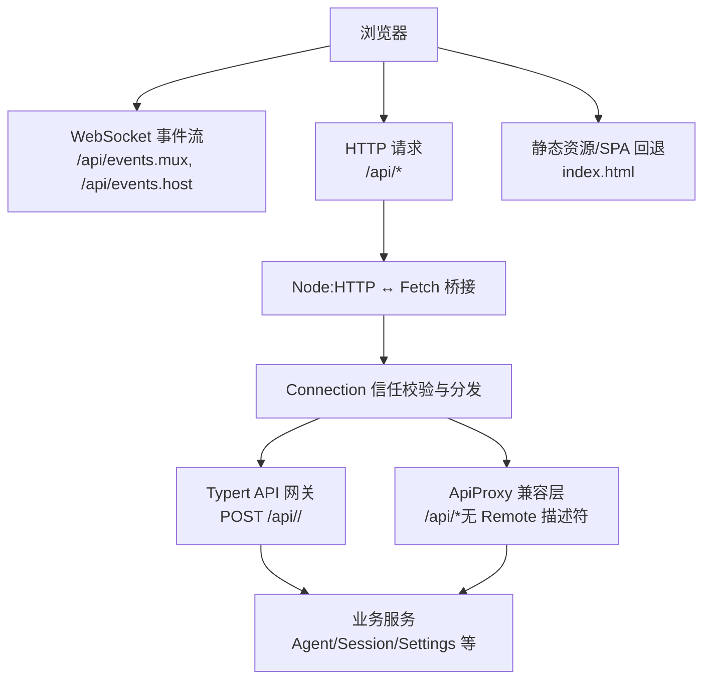
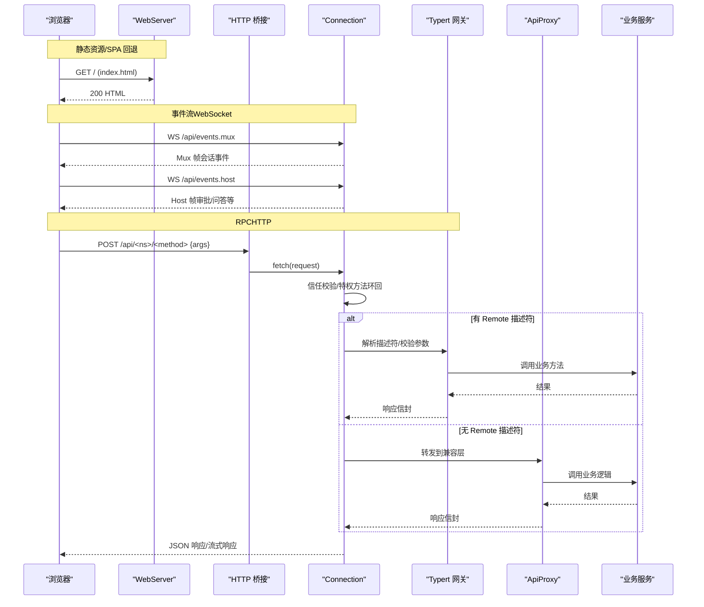
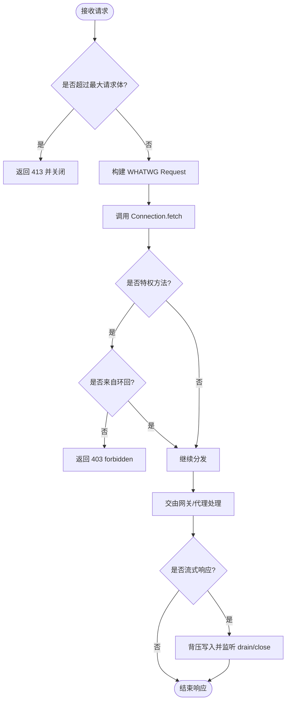
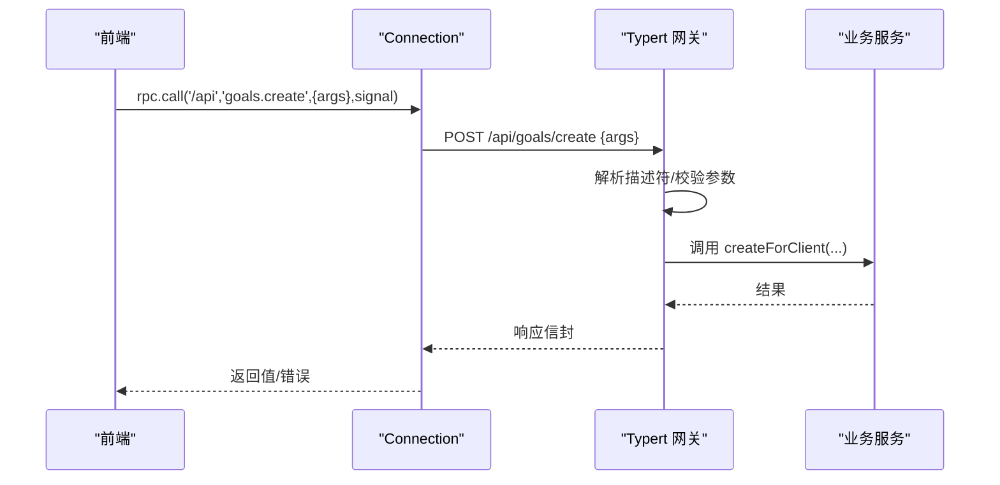
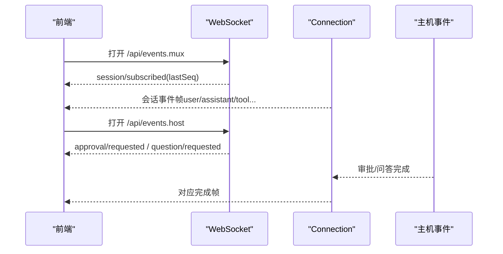
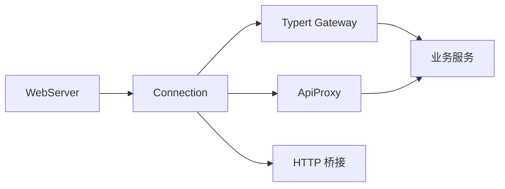

# Web API

<cite>
**本文引用的文件**
- [packages/host/webserver/src/index.ts](file://packages/host/webserver/src/index.ts)
- [docs/subsystems/web-server.md](file://docs/subsystems/web-server.md)
- [docs/api-gateway.md](file://docs/api-gateway.md)
- [packages/client/connection/src/api-path.ts](file://packages/client/connection/src/api-path.ts)
- [packages/client/connection/src/http-bridge.ts](file://packages/client/connection/src/http-bridge.ts)
- [packages/client/connection/src/index.ts](file://packages/client/connection/src/index.ts)
- [packages/client/connection/src/client/web-api-client.ts](file://packages/client/connection/src/client/web-api-client.ts)
- [packages/host/apiproxy/src/index.ts](file://packages/host/apiproxy/src/index.ts)
- [packages/host/apiproxy/src/api-proxy.ts](file://packages/host/apiproxy/src/api-proxy.ts)
</cite>

## 目录
1. [简介](#简介)
2. [项目结构](#项目结构)
3. [核心组件](#核心组件)
4. [架构总览](#架构总览)
5. [详细组件分析](#详细组件分析)
6. [依赖关系分析](#依赖关系分析)
7. [性能考虑](#性能考虑)
8. [故障排查指南](#故障排查指南)
9. [结论](#结论)
10. [附录：API 规格与客户端集成](#附录api-规格与客户端集成)

## 简介
本文件面向前端开发者，系统化说明 Harness Web 的 HTTP 端点、WebSocket 连接与实时通信协议，覆盖会话管理、消息发送、文件上传等 Web 功能的接口规范。文档基于仓库中的 HTTP 服务器、API 网关、连接桥接与代理实现，给出请求/响应格式、状态码、认证授权边界、错误处理与性能优化建议，并提供客户端集成要点与最佳实践。

## 项目结构
Web 访问由四层组成：浏览器通过 WebServer 暴露的 HTTP 服务进入；/api 前缀的请求由 Connection 统一承载并做信任校验；已声明的 Remote 方法经 Typert Gateway 路由到业务服务；未声明的旧端点由 ApiProxy 兼容处理。静态资源与 SPA 回退由前端静态插件提供。

图表来源
- [packages/host/webserver/src/index.ts:59-105](file://packages/host/webserver/src/index.ts#L59-L105)
- [packages/client/connection/src/api-path.ts:7-14](file://packages/client/connection/src/api-path.ts#L7-L14)
- [packages/client/connection/src/http-bridge.ts:32-99](file://packages/client/connection/src/http-bridge.ts#L32-L99)
- [packages/client/connection/src/index.ts:121-145](file://packages/client/connection/src/index.ts#L121-L145)
- [docs/api-gateway.md:80-128](file://docs/api-gateway.md#L80-L128)

章节来源
- [docs/subsystems/web-server.md:1-48](file://docs/subsystems/web-server.md#L1-L48)
- [packages/host/webserver/src/index.ts:59-105](file://packages/host/webserver/src/index.ts#L59-L105)
- [packages/client/connection/src/api-path.ts:7-14](file://packages/client/connection/src/api-path.ts#L7-L14)
- [packages/client/connection/src/http-bridge.ts:32-99](file://packages/client/connection/src/http-bridge.ts#L32-L99)
- [packages/client/connection/src/index.ts:121-145](file://packages/client/connection/src/index.ts#L121-L145)
- [docs/api-gateway.md:80-128](file://docs/api-gateway.md#L80-L128)

## 核心组件
- Web 服务器（WebServer）
  - 负责监听端口、注册命名路由、升级路由、SPA 回退与 index.html 注入。
  - 仅服务于浏览器；不提供 TLS、鉴权或源策略。
- 连接层（Connection）
  - 提供统一的 /api 前缀承载 RPC 与事件流；执行 DNS 重绑定与跨站防御；对特权方法强制环回。
  - 将 Node:HTTP 请求桥接到 WHATWG Fetch 处理器，支持流式响应与背压。
- API 网关（Typert Gateway）
  - 为远程方法提供严格契约：生成 Host/Client 描述符，按命名空间与方法名路由，校验参数与返回值。
  - 复用 Connection 的 /api 路由，但仅处理有严格描述符的两段式端点。
- API 代理（ApiProxy）
  - 承载历史兼容端点（如会话、设置、凭据、模型目录等），作为无 Remote 描述符时的降级路径。
  - 提供会话列表、搜索、导出、消息分页、审批、用户问答等能力。

章节来源
- [docs/subsystems/web-server.md:1-48](file://docs/subsystems/web-server.md#L1-L48)
- [packages/client/connection/src/index.ts:121-145](file://packages/client/connection/src/index.ts#L121-L145)
- [docs/api-gateway.md:80-128](file://docs/api-gateway.md#L80-L128)
- [packages/host/apiproxy/src/index.ts:1-129](file://packages/host/apiproxy/src/index.ts#L1-L129)

## 架构总览
下图展示从浏览器到后端服务的完整调用链，包括 HTTP 与 WebSocket 两条通道。

图表来源
- [packages/client/connection/src/api-path.ts:7-14](file://packages/client/connection/src/api-path.ts#L7-L14)
- [packages/client/connection/src/http-bridge.ts:32-99](file://packages/client/connection/src/http-bridge.ts#L32-L99)
- [packages/client/connection/src/index.ts:121-145](file://packages/client/connection/src/index.ts#L121-L145)
- [docs/api-gateway.md:119-128](file://docs/api-gateway.md#L119-L128)
- [packages/host/apiproxy/src/index.ts:64-129](file://packages/host/apiproxy/src/index.ts#L64-L129)

## 详细组件分析

### HTTP 服务器（WebServer）
- 路由匹配：精确匹配优先，其次最长前缀，最后回退到 SPA 静态服务。
- 配置：host 仅允许 127.0.0.1 或 0.0.0.0；port=0 表示系统分配端口。
- 生命周期：激活即监听；重复注册同名路由抛错；可注入 index.html 变换；关闭时同时关闭所有连接以释放 SSE 等长连接。

章节来源
- [docs/subsystems/web-server.md:9-48](file://docs/subsystems/web-server.md#L9-L48)
- [packages/host/webserver/src/index.ts:59-105](file://packages/host/webserver/src/index.ts#L59-L105)

### 连接层与 HTTP 桥接（Connection + HTTP Bridge）
- 统一前缀：/api 用于所有 RPC 与事件流。
- 信任边界：DNS 重绑定与跨站防护；特权方法强制环回（即使白名单主机）。
- 请求体限制：默认最大请求体约 160 MiB，超限返回 413。
- 流式响应：对 SSE/流式响应进行背压控制，客户端断开时中止处理。

图表来源
- [packages/client/connection/src/http-bridge.ts:32-99](file://packages/client/connection/src/http-bridge.ts#L32-L99)
- [packages/client/connection/src/index.ts:121-145](file://packages/client/connection/src/index.ts#L121-L145)

章节来源
- [packages/client/connection/src/http-bridge.ts:1-100](file://packages/client/connection/src/http-bridge.ts#L1-L100)
- [packages/client/connection/src/index.ts:121-145](file://packages/client/connection/src/index.ts#L121-L145)

### API 网关（Typert Gateway）
- 编程模型：使用 @Remote/@RemoteScope 暴露方法；构建期生成 Host/Client 描述符与类型。
- 运行时：Client 通过 connection.rpc.call('/api', '<namespace>/<method>', { args }, signal) 发起调用；Host 映射为 POST /api/<namespace>/<method>。
- 安全与校验：Gateway 仅处理两段式且有严格描述符的端点；参数与返回值经 schema 校验；对象通过 lookup 解析。
- 开发模式：源码启动时采用 SRC 降级，不再生成严格 schema，但 Client 仍要求严格描述符。

图表来源
- [docs/api-gateway.md:119-128](file://docs/api-gateway.md#L119-L128)
- [docs/api-gateway.md:80-118](file://docs/api-gateway.md#L80-L118)

章节来源
- [docs/api-gateway.md:1-165](file://docs/api-gateway.md#L1-L165)

### API 代理（ApiProxy）
- 职责：承载无 Remote 描述符的历史端点，提供会话、工作区、设置、凭据、模型目录、下载、事件转发等能力。
- 典型能力：
  - 会话列表与搜索：分页、内容索引搜索、冷启动摘要探测。
  - 会话日志导出：ZIP 流式压缩输出，受容量门控。
  - 图片上传：校验 base64 规范、单条/总量大小限制、媒体类型校验。
  - 审批与用户问答：服务端维护待决项，通过事件流下发，客户端回填答案。
- 错误映射：将领域错误映射为稳定的 RPC 错误码（如 agent-preset-not-found、internal 等）。

章节来源
- [packages/host/apiproxy/src/index.ts:1-129](file://packages/host/apiproxy/src/index.ts#L1-L129)
- [packages/host/apiproxy/src/api-proxy.ts:113-188](file://packages/host/apiproxy/src/api-proxy.ts#L113-L188)
- [packages/host/apiproxy/src/api-proxy.ts:282-318](file://packages/host/apiproxy/src/api-proxy.ts#L282-L318)
- [packages/host/apiproxy/src/api-proxy.ts:379-411](file://packages/host/apiproxy/src/api-proxy.ts#L379-L411)

### WebSocket 与实时通信
- 事件流端点：
  - /api/events.mux：会话级多路复用事件流。
  - /api/events.host：主机级事件流（审批、问答等）。
- 客户端行为：建立 WebSocket，订阅 open/message/close；收到 end 标记后终止；支持 AbortSignal 取消。
- 服务端行为：Connection 在共享 FetchHandler 中处理事件流，保证背压与断连清理。

图表来源
- [packages/client/connection/src/api-path.ts:7-14](file://packages/client/connection/src/api-path.ts#L7-L14)
- [packages/client/connection/src/client/web-api-client.ts:67-91](file://packages/client/connection/src/client/web-api-client.ts#L67-L91)

章节来源
- [packages/client/connection/src/api-path.ts:7-14](file://packages/client/connection/src/api-path.ts#L7-L14)
- [packages/client/connection/src/client/web-api-client.ts:67-91](file://packages/client/connection/src/client/web-api-client.ts#L67-L91)

## 依赖关系分析
- WebServer 提供 HTTP 载体与路由注册；前端静态插件接管回退与 SPA。
- Connection 在 /api 前缀上实施信任检查，并将请求分发给 Typert Gateway 或 ApiProxy。
- Typert Gateway 依赖构建期生成的描述符与运行时 lookup 解析；ApiProxy 直接消费宿主上下文（sessions、llm、settings、credentials 等）。
- 两者共同依赖底层 HTTP 桥接，确保一致的请求体限制、流式响应与背压。

图表来源
- [packages/host/webserver/src/index.ts:59-105](file://packages/host/webserver/src/index.ts#L59-L105)
- [packages/client/connection/src/index.ts:121-145](file://packages/client/connection/src/index.ts#L121-L145)
- [docs/api-gateway.md:80-128](file://docs/api-gateway.md#L80-L128)
- [packages/host/apiproxy/src/index.ts:64-129](file://packages/host/apiproxy/src/index.ts#L64-L129)

章节来源
- [docs/api-gateway.md:80-128](file://docs/api-gateway.md#L80-L128)
- [packages/host/apiproxy/src/index.ts:64-129](file://packages/host/apiproxy/src/index.ts#L64-L129)

## 性能考虑
- 请求体限制：默认最大请求体约 160 MiB，避免内存溢出；超大请求直接 413。
- 流式响应：SSE/流式响应使用背压，防止慢消费者阻塞；客户端断开立即中止。
- 会话日志导出：ZIP 流式压缩，按容量门控推送，避免一次性加载大文件。
- 会话搜索：限制提供者调用次数与命中数，减少后端压力。
- 图片上传：批量校验与持久化，限制单条与总量，降低无效 IO。

章节来源
- [packages/client/connection/src/http-bridge.ts:8-12](file://packages/client/connection/src/http-bridge.ts#L8-L12)
- [packages/client/connection/src/http-bridge.ts:47-66](file://packages/client/connection/src/http-bridge.ts#L47-L66)
- [packages/host/apiproxy/src/api-proxy.ts:113-188](file://packages/host/apiproxy/src/api-proxy.ts#L113-L188)

## 故障排查指南
- 413 请求体过大：检查图片 base64 体积与数量；确认客户端未重复上传。
- 403 禁止访问：特权方法必须来自环回；检查请求来源与信任主机配置。
- 404 未找到：确认端点是否有 Remote 描述符；若无则应走 ApiProxy 兼容路径。
- 会话相关错误：关注 session/query 错误码与分页 hasMore；必要时刷新基线。
- 图片上传失败：校验是否为规范 base64；检查媒体类型与大小限制。
- 流式中断：检查客户端是否提前关闭；服务端 close 会触发 abort，需重试或降级。

章节来源
- [packages/client/connection/src/http-bridge.ts:47-66](file://packages/client/connection/src/http-bridge.ts#L47-L66)
- [packages/client/connection/src/index.ts:121-145](file://packages/client/connection/src/index.ts#L121-L145)
- [packages/host/apiproxy/src/api-proxy.ts:379-411](file://packages/host/apiproxy/src/api-proxy.ts#L379-L411)

## 结论
Harness Web 通过 WebServer、Connection、Typert Gateway 与 ApiProxy 的分层设计，实现了清晰的职责划分与安全边界。前端应优先使用 /api 前缀的 RPC 与事件流接口，遵循信任与权限约束，合理利用流式与分页能力，以获得稳定高效的交互体验。

## 附录：API 规格与客户端集成

### HTTP 端点总览
- 静态资源与 SPA
  - GET /：返回 index.html；未知扩展以 octet-stream 返回；非 GET/HEAD 返回 405；遍历超出根目录返回 403。
- 事件流（WebSocket）
  - WS /api/events.mux：会话级事件多路复用。
  - WS /api/events.host：主机级事件（审批、问答等）。
- RPC（HTTP）
  - POST /api/<namespace>/<method>：请求体为 { args }；响应为标准信封；支持取消信号。
- 兼容端点（ApiProxy）
  - 由 ApiProxyService 挂载，具体子路径由各模块实现（会话、设置、凭据、模型目录、下载、事件等）。

章节来源
- [docs/subsystems/web-server.md:9-48](file://docs/subsystems/web-server.md#L9-L48)
- [packages/client/connection/src/api-path.ts:7-14](file://packages/client/connection/src/api-path.ts#L7-L14)
- [docs/api-gateway.md:119-128](file://docs/api-gateway.md#L119-L128)
- [packages/host/apiproxy/src/index.ts:64-129](file://packages/host/apiproxy/src/index.ts#L64-L129)

### 请求与响应格式
- RPC 请求
  - 方法：POST
  - 路径：/api/<namespace>/<method>
  - 头部：标准 HTTP 头；Content-Type 通常为 application/json
  - 主体：{ args }，字段与顺序由描述符严格校验
  - 取消：通过 AbortSignal 传递
- RPC 响应
  - 成功：包含 result.ok=true 与 value
  - 失败：result.ok=false 与 error.code/message/details
- 事件流
  - Mux：session/subscribed 携带 lastSeq；后续推送会话事件帧
  - Host：approval/requested、question/requested 等主机事件帧

章节来源
- [docs/api-gateway.md:119-128](file://docs/api-gateway.md#L119-L128)
- [packages/client/connection/src/api-path.ts:7-14](file://packages/client/connection/src/api-path.ts#L7-L14)

### 会话管理
- 会话列表与搜索：支持分页、内容索引搜索；搜索结果仅请求局部有效。
- 会话日志导出：ZIP 流式压缩，受容量门控；适合长时间运行任务。
- 消息分页：按消息边界分页，避免截断组内消息。

章节来源
- [packages/host/apiproxy/src/api-proxy.ts:282-318](file://packages/host/apiproxy/src/api-proxy.ts#L282-L318)
- [packages/host/apiproxy/src/session-export.ts:304-335](file://packages/host/apiproxy/src/session-export.ts#L304-L335)

### 消息发送与图片上传
- 文本消息：通过会话 API 发送 user/message。
- 图片消息：
  - 客户端以 base64 编码图片数据；服务端校验规范与大小限制。
  - 单条与总量限制；媒体类型校验；保存为附件引用。
  - 若 base64 不规范，返回 INVALID_IMAGE_BASE64。

章节来源
- [packages/host/apiproxy/src/api-proxy.ts:141-188](file://packages/host/apiproxy/src/api-proxy.ts#L141-L188)

### 认证与授权
- 信任边界：Connection 对 /api 前缀执行 DNS 重绑定与跨站防护。
- 特权方法：强制环回访问；即使列入信任主机也会拒绝。
- 会话/Agent 身份：由 API Remotes 配置解析策略，自动恢复冷会话、去重并发恢复、拒绝子代理路由所有权。

章节来源
- [packages/client/connection/src/index.ts:121-145](file://packages/client/connection/src/index.ts#L121-L145)
- [docs/api-gateway.md:121-128](file://docs/api-gateway.md#L121-L128)

### 错误处理
- 常见状态码
  - 400：请求解析失败（例如 malformed %-escape）
  - 403：禁止访问（特权方法非环回）
  - 404：未找到（无匹配路由或无 Remote 描述符且无兼容端点）
  - 405：非 GET/HEAD 访问静态资源
  - 413：请求体过大
- 业务错误：通过 error.code/message/details 结构化返回；客户端应按 code 分支处理。

章节来源
- [docs/subsystems/web-server.md:41-48](file://docs/subsystems/web-server.md#L41-L48)
- [packages/client/connection/src/index.ts:121-145](file://packages/client/connection/src/index.ts#L121-L145)
- [packages/host/apiproxy/src/api-proxy.ts:379-411](file://packages/host/apiproxy/src/api-proxy.ts#L379-L411)

### 客户端集成要点与最佳实践
- 连接建立
  - 先建立 WebSocket 到 /api/events.mux 与 /api/events.host，订阅事件。
  - 使用 AbortController 管理取消；在页面卸载或切换会话时及时关闭。
- RPC 调用
  - 使用 connection.rpc.call('/api', '<namespace>/<method>', { args }, signal)。
  - 对大图上传进行本地压缩与分片，避免单次请求过大。
- 错误与重试
  - 区分网络错误与业务错误；对 403/413 等明确错误不做重试。
  - 对瞬态错误采用指数退避重试，并限制最大重试次数。
- 性能优化
  - 合理使用分页与搜索限制；避免全量拉取。
  - 对长耗时操作使用流式接口（如日志导出）。
  - 利用背压机制，避免阻塞 UI。

章节来源
- [packages/client/connection/src/client/web-api-client.ts:67-91](file://packages/client/connection/src/client/web-api-client.ts#L67-L91)
- [docs/api-gateway.md:119-128](file://docs/api-gateway.md#L119-L128)
- [packages/host/apiproxy/src/api-proxy.ts:282-318](file://packages/host/apiproxy/src/api-proxy.ts#L282-L318)