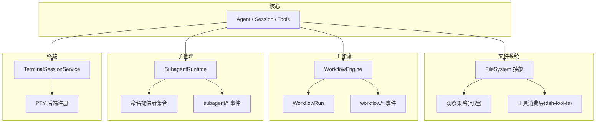
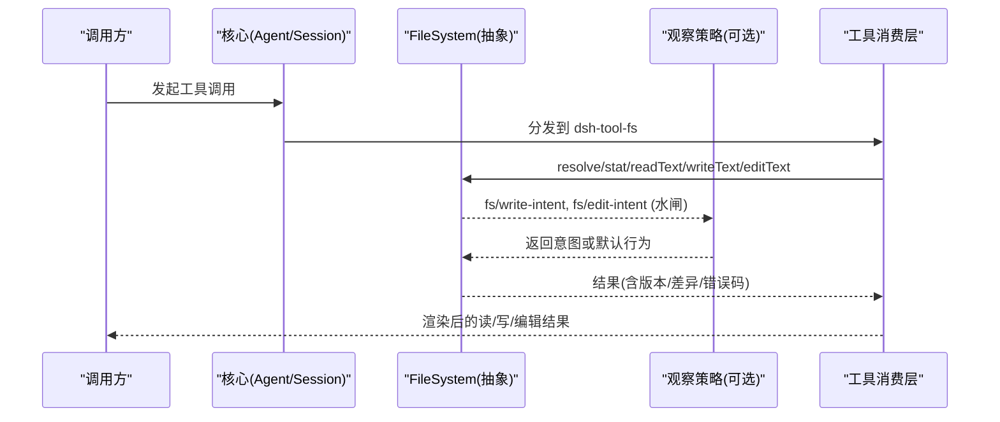
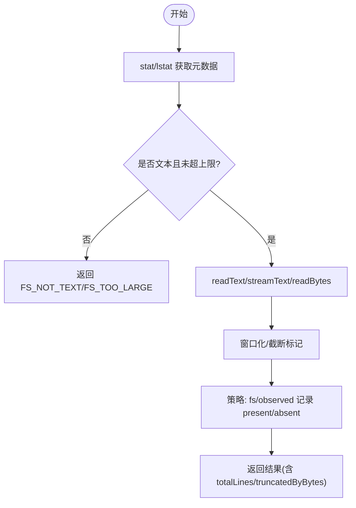
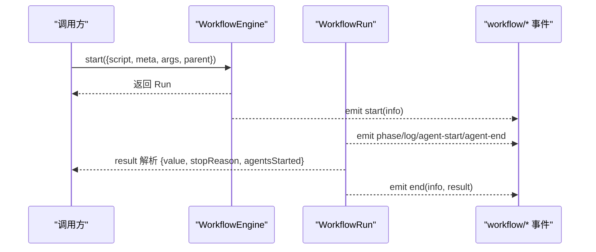
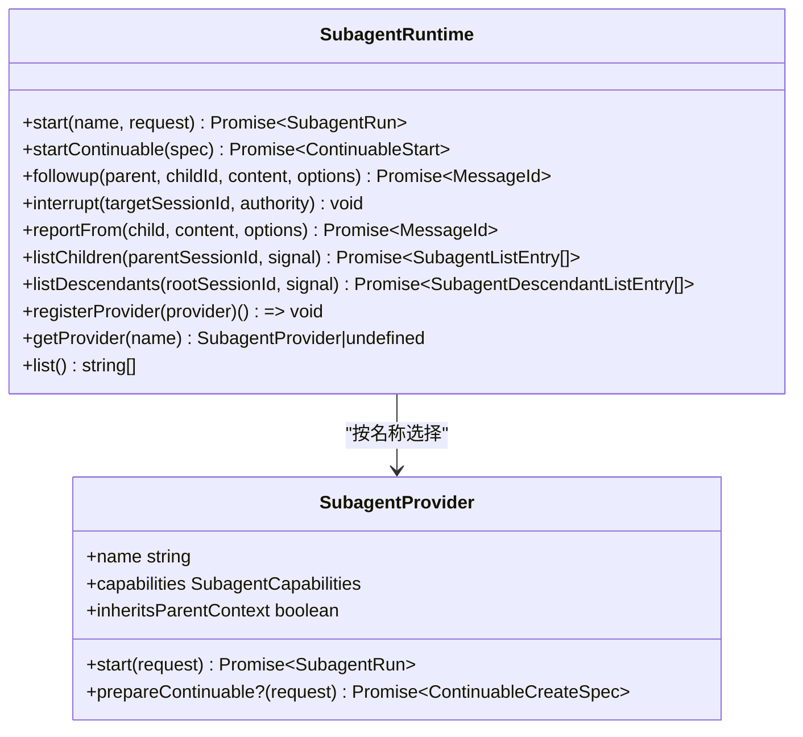
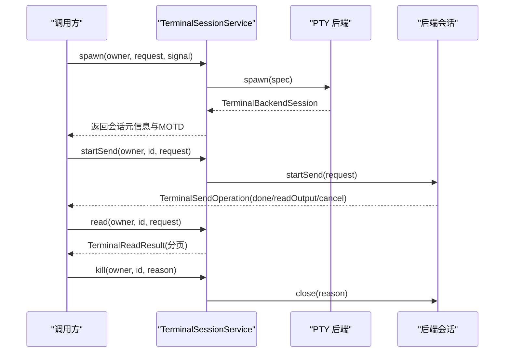
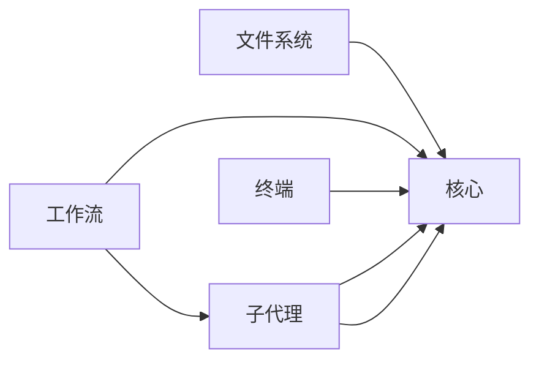

# 子系统 API

<cite>
**本文引用的文件**
- [文件系统文档](file://docs/subsystems/filesystem.md)
- [工作流文档](file://docs/subsystems/workflow.md)
- [子代理文档](file://docs/subsystems/subagent.md)
- [终端文档](file://docs/subsystems/terminal.md)
- [Shell 执行文档](file://docs/subsystems/shell.md)
- [核心文档](file://docs/subsystems/core.md)
- [子系统总览](file://docs/subsystems/README.md)
</cite>

## 目录
1. [简介](#简介)
2. [项目结构](#项目结构)
3. [核心组件](#核心组件)
4. [架构总览](#架构总览)
5. [详细组件分析](#详细组件分析)
6. [依赖关系分析](#依赖关系分析)
7. [性能考虑](#性能考虑)
8. [故障排查指南](#故障排查指南)
9. [结论](#结论)
10. [附录](#附录)

## 简介
本文件面向开发者，系统化梳理 DeepSeek Harness 中“文件系统、工作流、子代理、终端”等关键子系统的公共接口与协作方式。内容涵盖：
- 每个子系统的核心类、方法、事件与错误模型
- 使用示例与集成模式（以调用序列和流程图说明）
- 子系统间的依赖与协作边界
- 错误处理、配置选项与性能调优建议
- 帮助开发者正确、安全地集成各子系统能力

## 项目结构
本仓库采用多包多子系统组织，子系统文档位于 docs/subsystems，对应实现位于 packages/*。本次文档聚焦以下四个子系统及其与核心、Shell、终端的交互：
- 文件系统（fs）：抽象提供者 + 观察策略 + 工具消费层
- 工作流（workflow）：脚本编排引擎 + 运行句柄 + 事件
- 子代理（subagent）：命名提供者注册表 + 一次性/可延续子代理 + 枚举与控制
- 终端（terminal）：持久 PTY 会话 + 后端注册 + 发送/读取/信号/关闭

图表来源
- [核心文档:22-20](file://docs/subsystems/core.md#L22-L20)
- [文件系统文档:5-9](file://docs/subsystems/filesystem.md#L5-L9)
- [工作流文档:5-9](file://docs/subsystems/workflow.md#L5-L9)
- [子代理文档:5-9](file://docs/subsystems/subagent.md#L5-L9)
- [终端文档:5-6](file://docs/subsystems/terminal.md#L5-L6)

章节来源
- [子系统总览:1-56](file://docs/subsystems/README.md#L1-L56)

## 核心组件
- Agent/Session/Tools：核心循环驱动会话日志、系统提示组装、工具调度与 LLM 流式响应；提供 Agent 生命周期、取消、投递、拦截等统一契约。
- FileSystem：抽象提供者定义目标解析、元数据、读写、编辑、目录列举；可选观察策略通过 fs/* 事件决定写/编辑意图并记录存在性；工具消费层负责渲染与窗口化。
- WorkflowEngine：启动脚本编排，返回运行句柄；支持取消、处置、阶段与日志事件；结果包含完成/取消/错误原因。
- SubagentRuntime：命名提供者注册的一次性与可延续子代理；支持 followup/interrupt/reportFrom/listChildren/listDescendants；事件覆盖 start/end/provider 变更。
- TerminalSessionService：PTY 会话服务，注册后端类型，创建/发送/读取/信号/关闭会话；维护所有者权限与清理。

章节来源
- [核心文档:22-207](file://docs/subsystems/core.md#L22-L207)
- [文件系统文档:11-278](file://docs/subsystems/filesystem.md#L11-L278)
- [工作流文档:11-129](file://docs/subsystems/workflow.md#L11-L129)
- [子代理文档:11-290](file://docs/subsystems/subagent.md#L11-L290)
- [终端文档:7-92](file://docs/subsystems/terminal.md#L7-L92)

## 架构总览
下图展示子系统间的主要依赖与数据流向：
- 文件系统：工具消费层通过 ctx.fs 调用抽象提供者；可选策略插件监听 fs/write-intent、fs/edit-intent 水闸与 fs/observed 记录；读操作由消费层窗口化并授权。
- 工作流：调用 ctx.workflowEngine.start 返回 WorkflowRun；运行期间产生 workflow/* 事件；结果通过 result 获取。
- 子代理：ctx.subagents 管理命名提供者；start/followup/interrupt/reportFrom 控制一次性或可延续子代理；listChildren/listDescendants 枚举。
- 终端：ctx.terminals 注册后端；spawn/startSend/read/signal/kill 管理会话；输出与状态通过操作句柄与只读快照暴露。

图表来源
- [文件系统文档:181-278](file://docs/subsystems/filesystem.md#L181-L278)
- [文件系统文档:280-496](file://docs/subsystems/filesystem.md#L280-L496)

章节来源
- [文件系统文档:181-278](file://docs/subsystems/filesystem.md#L181-L278)

## 详细组件分析

### 文件系统子系统
- 核心概念
  - 目标标识 FsTarget/FsTargetKey：解析用户路径为稳定标识，禁止消费者解析 targetKey。
  - 元数据 FsInfo/FsPathInfo：stat/lstat 返回类型、大小、版本；lstat 不跟随最终符号链接。
  - 文本/字节读取：readText/streamText/readBytes；readBytes 带 maxBytes 上限，超限返回 FS_TOO_LARGE。
  - 写入与编辑：writeText/editText 支持可选守卫（createIfAbsent/replaceIfVersion），原子更新并返回 before/after。
  - 观察策略：fs/write-intent、fs/edit-intent 单槽水闸；fs/observed 记录 present/absent。
  - 错误分类：FsErrorCode 稳定字符串，便于重试/权限/UI 分支。
- 典型用法
  - 读大文件：先 stat 判断 size，选择 readText 或 streamText；设置行窗口与字节上限。
  - 受控写：先 fs/observed 记录版本，再 writeText 传入 replaceIfVersion 守卫。
  - 编辑：editText 携带 oldString/newString/replaceAll，支持版本守卫。
- 集成模式
  - 部署需同时加载 dsh-tool-fs 与 dsh-fs-observation-policy，以获得“先读后写/编辑”的默认策略。
  - 自定义后端只需实现 FileSystem 抽象；策略与工具解耦。

图表来源
- [文件系统文档:55-91](file://docs/subsystems/filesystem.md#L55-L91)
- [文件系统文档:222-238](file://docs/subsystems/filesystem.md#L222-L238)
- [文件系统文档:181-196](file://docs/subsystems/filesystem.md#L181-L196)

章节来源
- [文件系统文档:11-278](file://docs/subsystems/filesystem.md#L11-L278)
- [文件系统文档:280-496](file://docs/subsystems/filesystem.md#L280-L496)

### 工作流子系统
- 核心概念
  - 启动请求 WorkflowStartRequest：script/meta/args/subagentProvider/maxTotalAgents/parent/signal。
  - 身份元信息 WorkflowMeta：name/description/whenToUse/phases。
  - 运行句柄 WorkflowRun：id/meta/result/cancel/dispose；result 永不拒绝，stopReason 包含 completed/cancelled/error。
  - 事件：workflow/start、phase、log、agent-start、agent-end、end；载荷为快照，不可变。
- 典型用法
  - 启动脚本：调用 start(request)，持有 WorkflowRun；await result 获取 value 与 stopReason。
  - 取消与处置：cancel(reason) 立即生效；dispose() 等待有界结算与子代理清理。
  - 观察：订阅 workflow/* 事件进行进度分组与日志收集。
- 集成模式
  - 引擎实现（如 worker_threads）在独立上下文执行脚本；宿主侧仅持有句柄与事件。
  - UI 消费层将事件折叠为对话节点，呈现阶段与状态。

图表来源
- [工作流文档:11-129](file://docs/subsystems/workflow.md#L11-L129)
- [工作流文档:138-278](file://docs/subsystems/workflow.md#L138-L278)

章节来源
- [工作流文档:11-129](file://docs/subsystems/workflow.md#L11-L129)
- [工作流文档:138-278](file://docs/subsystems/workflow.md#L138-L278)

### 子代理子系统
- 核心概念
  - 提供者能力：SubagentCapabilities（outputSchema/depthLimit/toolFilter/persona）。
  - 一次性启动：SubagentStartRequest → SubagentRun.result；结果包含 output/structured/stopReason。
  - 可延续子代理：startContinuable/followup/interrupt/reportFrom；Activation 驻留、冷恢复、父子授权。
  - 枚举：listChildren/listDescendants；基于投影与缓存的三阶查询。
  - 事件：subagent/start、end、provider-added、provider-removed。
- 典型用法
  - 一次性任务：start(name, request) 获取 run，await result 并 dispose。
  - 长对话：startContinuable(spec) 获得 childId/messageId；后续 followup 投递消息；interrupt 停止当前轮次。
  - 报告：reportFrom(child, content, options) 向直接父会话回传内容。
- 集成模式
  - 多个提供者共存于 ctx.subagents；按名称选择；能力检查在启动前进行。
  - 可延续子代理由管理器拥有 Activation，遵循 FIFO 投递与所有权图。

图表来源
- [子代理文档:11-290](file://docs/subsystems/subagent.md#L11-L290)
- [子代理文档:406-459](file://docs/subsystems/subagent.md#L406-L459)
- [子代理文档:478-649](file://docs/subsystems/subagent.md#L478-L649)

章节来源
- [子代理文档:11-290](file://docs/subsystems/subagent.md#L11-L290)
- [子代理文档:478-649](file://docs/subsystems/subagent.md#L478-L649)

### 终端子系统
- 核心概念
  - 会话与状态：TerminalSessionId、TerminalSessionStatus（running/exited）、TerminalWaitReason（stdin_read/inferred_idle/timeout/session_exit）。
  - 后端与会话：TerminalBackend.spawn 创建未发布会话；TerminalBackendSession 管理 motd/pid/send/read/signal/status/close。
  - 发送与输出：startSend 返回 TerminalSendOperation（done/readOutput/cancel）；read 分页读取滚动缓冲区。
  - 服务：ctx.terminals.registerBackend/listBackends/spawn/hasOwnerActivity/startSend/read/signal/kill/list。
- 典型用法
  - 创建会话：spawn(owner, request, signal) 成功后获得 id/metadata/status/MOTD。
  - 交互式输入：startSend(owner, id, request) 获取操作句柄；await done 获取 viewport/waitReason/sessionStatus。
  - 信号与关闭：signal(owner, id, signal) 发送允许的信号；kill(owner, id, reason) 幂等关闭并等待清理。
- 集成模式
  - 会话生命周期绑定所有者 Agent；跨后端/插件重载保持存活；输出与状态通过句柄与快照暴露。

图表来源
- [终端文档:25-92](file://docs/subsystems/terminal.md#L25-L92)
- [终端文档:101-183](file://docs/subsystems/terminal.md#L101-L183)

章节来源
- [终端文档:7-92](file://docs/subsystems/terminal.md#L7-L92)
- [终端文档:101-183](file://docs/subsystems/terminal.md#L101-L183)

## 依赖关系分析
- 文件系统
  - 依赖核心工具执行管线；可选策略通过事件解耦；工具消费层负责窗口化与渲染。
  - 与 Shell/子代理无直接耦合，但可通过工作流/子代理间接触发文件操作。
- 工作流
  - 依赖核心 Agent/Session 作为父级归属；内部可能启动子代理（agent() 调用）；事件供 UI/审计消费。
- 子代理
  - 依赖核心 Agent/Session；可延续子代理由管理器维护 Activation；枚举依赖会话存储与可选持久化。
- 终端
  - 依赖核心 Agent 作为所有者；后端实现 PTY 细节；输出与状态通过句柄与快照暴露给上层。

图表来源
- [核心文档:22-207](file://docs/subsystems/core.md#L22-L207)
- [文件系统文档:5-9](file://docs/subsystems/filesystem.md#L5-L9)
- [工作流文档:5-9](file://docs/subsystems/workflow.md#L5-L9)
- [子代理文档:5-9](file://docs/subsystems/subagent.md#L5-L9)
- [终端文档:5-6](file://docs/subsystems/terminal.md#L5-L6)

章节来源
- [核心文档:22-207](file://docs/subsystems/core.md#L22-L207)

## 性能考虑
- 文件系统
  - 避免不必要的全量读取：优先使用 stat.size 选择 readText/streamText；对二进制使用 readBytes 并设置 maxBytes 防止缓冲溢出。
  - 利用窗口化与截断标记：读大文件时结合 offset/line window 与 truncatedByBytes 控制内存占用。
  - 策略事件同步：fs/observed 监听器必须同步且副作用最小，避免阻塞工具调用。
- 工作流
  - 合理设置 maxTotalAgents 与 subagentProvider 限制并发；及时 cancel/dispose 避免资源泄漏。
  - 事件消费应轻量，避免在 listener 中进行重 I/O。
- 子代理
  - 一次性任务尽快 dispose；可延续子代理注意 Activation 驻留与冷恢复成本。
  - listChildren/listDescendants 使用信号控制超时；避免频繁全量枚举。
- 终端
  - 使用 readOutput 增量消费输出，避免重复读取；必要时分页 read 滚动缓冲区。
  - 及时 kill 会话释放进程树；信号操作仅在允许范围内。

[本节为通用指导，无需具体文件引用]

## 故障排查指南
- 文件系统
  - 常见错误码：FS_NOT_FOUND、FS_PERMISSION_DENIED、FS_IO_ERROR、FS_STALE_VERSION、FS_NOT_OBSERVED、FS_AMBIGUOUS_EDIT、FS_EDIT_NOT_FOUND、FS_ABORTED。
  - 排查要点：确认 fs/observed 是否正确记录；检查守卫意图（createIfAbsent/replaceIfVersion）；区分权限拒绝与沙箱拒绝（FS_SANDBOX_DENIED）。
- 工作流
  - 结果非 completed：检查 stopReason 与 error；确认 cancel/dispose 是否被调用；观察 workflow/* 事件定位失败阶段。
  - 致命错误：WorkflowError.fatal 会终止脚本；组合器会重新抛出致命错误。
- 子代理
  - 启动失败：检查 provider 能力（SubagentCapabilities）；不支持的能力会在 start 前拒绝。
  - 可延续子代理中断：interrupt 需要合法 authority；未知/已结算目标视为 no-op。
  - 枚举不可用：当缺少 sessionProjections 或 session store 时抛出特定错误码。
- 终端
  - 发送等待原因：TerminalWaitReason 指示 stdin_read/inferred_idle/timeout/session_exit；与 session_status 正交。
  - 后端清理失败：spawn 失败使用 TerminalBackendCleanupError；kill 幂等并等待清理。

章节来源
- [文件系统文档:244-278](file://docs/subsystems/filesystem.md#L244-L278)
- [工作流文档:114-129](file://docs/subsystems/workflow.md#L114-L129)
- [子代理文档:287-290](file://docs/subsystems/subagent.md#L287-L290)
- [终端文档:7-92](file://docs/subsystems/terminal.md#L7-L92)

## 结论
本文件总结了文件系统、工作流、子代理、终端四大子系统的公共接口、事件模型与错误分类，并通过序列图与流程图展示了典型调用链与数据流。开发者可据此：
- 选择合适的子系统能力（如文件系统策略、工作流脚本、子代理提供者、终端后端）
- 正确使用核心句柄（FileSystem、WorkflowRun、SubagentRuntime、TerminalSessionService）
- 遵循错误分类与性能最佳实践，确保健壮性与可扩展性

[本节为总结性内容，无需具体文件引用]

## 附录
- 参考文档索引：各子系统文档均包含生成的 Cordis API 章节，可直接查阅方法签名与事件载荷。
- 集成建议：优先从核心 Agent/Session 出发，按需挂载子系统能力；通过事件与句柄解耦实现，避免紧耦合。

[本节为补充信息，无需具体文件引用]