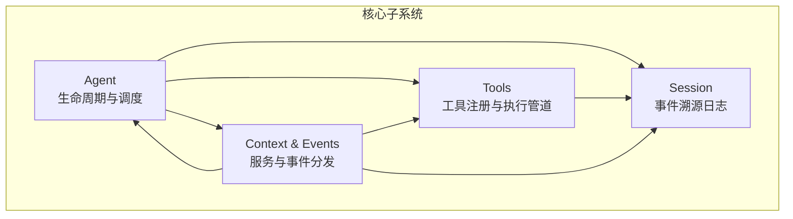
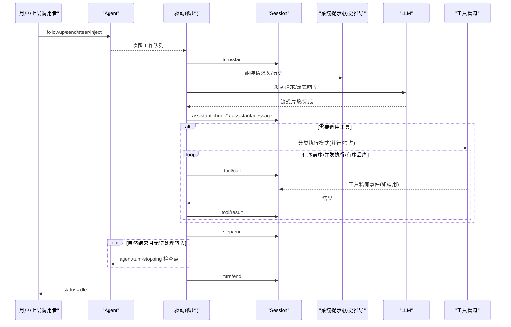
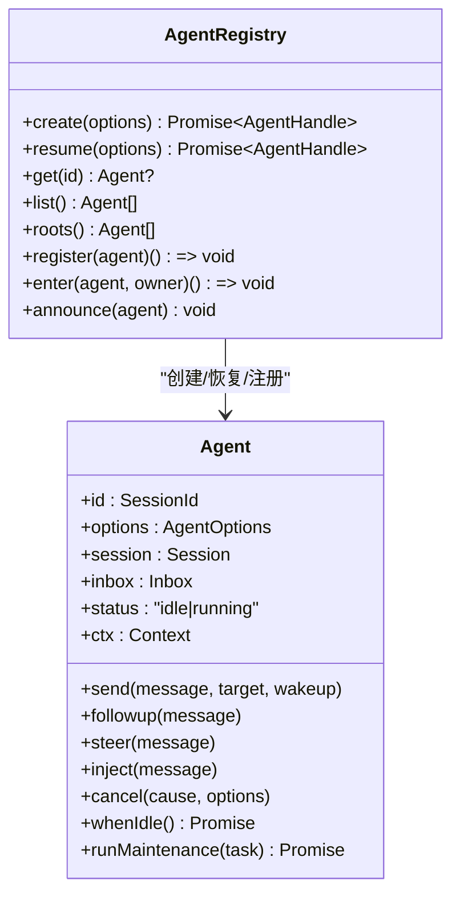
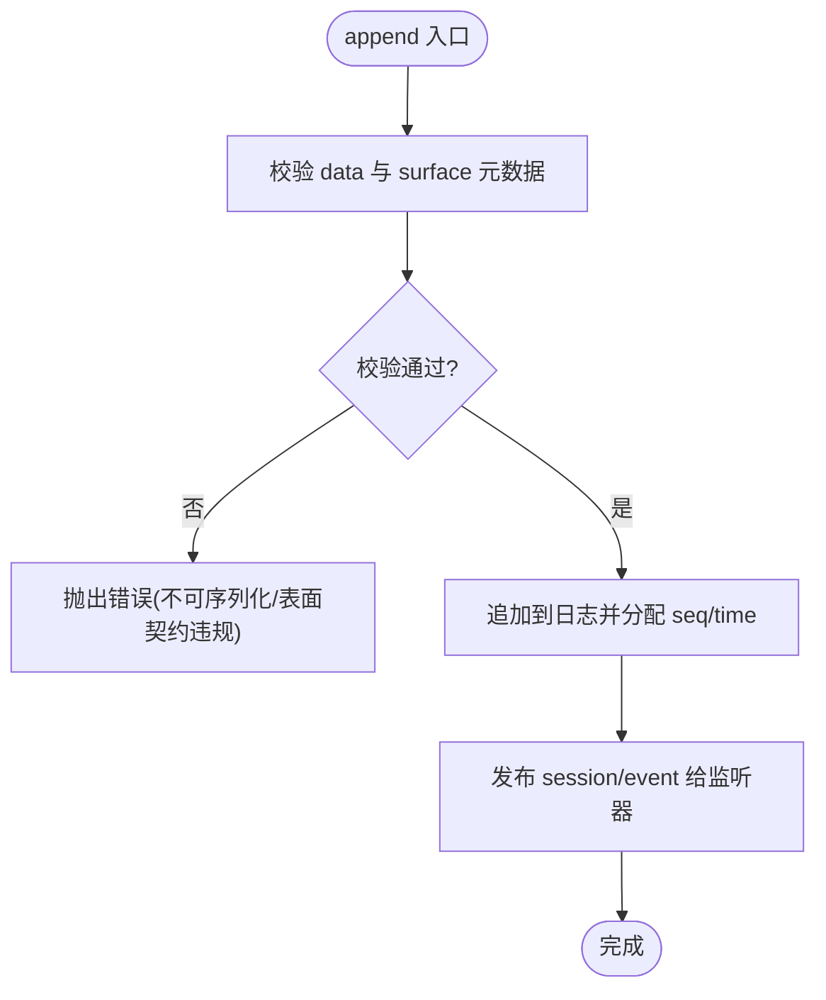
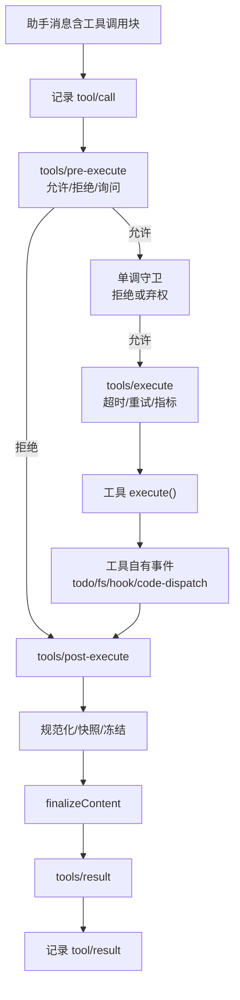
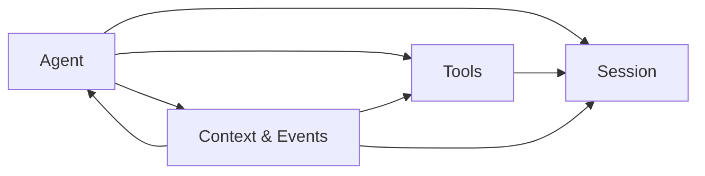

# 核心 API

<cite>
**本文引用的文件**
- [packages/core/agent/src/index.ts](file://packages/core/agent/src/index.ts)
- [packages/core/agent/src/types.ts](file://packages/core/agent/src/types.ts)
- [packages/core/session/src/index.ts](file://packages/core/session/src/index.ts)
- [packages/core/tools/src/index.ts](file://packages/core/tools/src/index.ts)
- [docs/subsystems/core.md](file://docs/subsystems/core.md)
- [docs/subsystems/session.md](file://docs/subsystems/session.md)
- [docs/subsystems/tools.md](file://docs/subsystems/tools.md)
- [docs/tool-execution-pipeline.md](file://docs/tool-execution-pipeline.md)
- [docs/cordis-api/context.md](file://docs/cordis-api/context.md)
- [docs/cordis-api/events.md](file://docs/cordis-api/events.md)
</cite>

## 目录
1. [简介](#简介)
2. [项目结构](#项目结构)
3. [核心组件](#核心组件)
4. [架构总览](#架构总览)
5. [详细组件分析](#详细组件分析)
6. [依赖关系分析](#依赖关系分析)
7. [性能考虑](#性能考虑)
8. [故障排查指南](#故障排查指南)
9. [结论](#结论)
10. [附录：使用示例与最佳实践](#附录使用示例与最佳实践)

## 简介
本文件面向开发者，系统化说明框架的核心公共 API，覆盖 Agent 生命周期管理、会话管理与事件机制、工具注册与执行管道等关键能力。文档以“从概念到实现”的层次展开，配合时序图、流程图和类图帮助理解调用链路与数据流，并提供参数校验、错误处理与性能优化建议以及可操作的最佳实践。

## 项目结构
核心子系统由以下模块组成：
- 会话（Session）：事件溯源的追加日志，作为唯一事实来源；提供 append、deriveMessages、surface 等接口。
- Agent：统一的生命周期句柄，封装 send/followup/steer/inject/cancel/whenIdle/runMaintenance 等交互与状态控制。
- 工具（Tools）：工具注册表与执行管道，包含 pre-execute/guard/execute/post-execute/result 等扩展点。
- 上下文与事件（Context & Events）：Cordis 提供的服务容器与事件分发模式（emit/parallel/serial/bail/waterfall）。

图表来源
- [docs/subsystems/core.md:1-20](file://docs/subsystems/core.md#L1-L20)
- [packages/core/session/src/index.ts:1-35](file://packages/core/session/src/index.ts#L1-L35)
- [packages/core/tools/src/index.ts:1-30](file://packages/core/tools/src/index.ts#L1-L30)
- [docs/cordis-api/context.md:1-15](file://docs/cordis-api/context.md#L1-L15)

章节来源
- [docs/subsystems/core.md:1-20](file://docs/subsystems/core.md#L1-L20)

## 核心组件
- Agent 接口与注册表：提供创建、恢复、查询、列举、所有权判断等能力；暴露 Agent 句柄用于消息投递、转向、注入、取消与空闲等待。
- Session 事件模型：定义 SessionEventMap、SurfaceEventType、TurnEndReason 等类型；提供 SessionStore 创建/准备/进入/宣布/刷新/分叉等操作。
- Tools 执行管道：defineTool DSL、ToolDefinition、ToolExecutionResult、pre-execute/guard/execute/post-execute/result 水落石出式扩展点。
- Context 与 Events：通过 ctx 访问服务与事件，支持 emit/parallel/serial/bail/waterfall 多种分发模式。

章节来源
- [packages/core/agent/src/index.ts:1-200](file://packages/core/agent/src/index.ts#L1-L200)
- [packages/core/session/src/index.ts:1-200](file://packages/core/session/src/index.ts#L1-L200)
- [packages/core/tools/src/index.ts:1-200](file://packages/core/tools/src/index.ts#L1-L200)
- [docs/cordis-api/context.md:1-120](file://docs/cordis-api/context.md#L1-L120)
- [docs/cordis-api/events.md:1-120](file://docs/cordis-api/events.md#L1-L120)

## 架构总览
Agent 驱动一次对话轮次（turn），在 turn 内可能包含多次步骤（step）。每一步会组装系统提示、调用 LLM 并消费工具调用结果，所有可见事实都追加到 Session 日志中。工具执行经过严格的策略与钩子管道，最终产出 tool/result 事件。

图表来源
- [docs/subsystems/core.md:1-20](file://docs/subsystems/core.md#L1-L20)
- [docs/subsystems/session.md:28-125](file://docs/subsystems/session.md#L28-L125)
- [docs/tool-execution-pipeline.md:8-60](file://docs/tool-execution-pipeline.md#L8-L60)

## 详细组件分析

### Agent 生命周期管理
- 创建与恢复
  - 通过 ctx.agents.create/resume 创建或恢复 Agent，返回 AgentHandle，持有 dispose 能力。
  - 创建选项包含 sessionId、meta（cwd、parentSession、seedLength、origin、delegationDepth）、seed（回放前缀）、agentOptions、signal、setup（作用域装配与提交）。
- Agent 句柄能力
  - send/followup/steer/inject：投递消息、转向、注入上下文。
  - cancel：取消当前活动或维护任务，支持 keepInbox 保留待处理项。
  - whenIdle：等待整个 Agent 活动收敛至空闲。
  - runMaintenance：在真正空闲阶段运行非 turn 维护任务。
- 事件与状态
  - agent/status 随状态切换发出；agent/created/disposed/error 等事件用于生命周期与错误观测。
  - Inbox 是持久化的待处理消息投影，支持 append/prepend/replace/remove/clear/splice/claim。

图表来源
- [packages/core/agent/src/types.ts:59-153](file://packages/core/agent/src/types.ts#L59-L153)
- [packages/core/agent/src/index.ts:158-200](file://packages/core/agent/src/index.ts#L158-L200)
- [docs/subsystems/core.md:311-723](file://docs/subsystems/core.md#L311-L723)

章节来源
- [packages/core/agent/src/index.ts:1-200](file://packages/core/agent/src/index.ts#L1-L200)
- [packages/core/agent/src/types.ts:59-201](file://packages/core/agent/src/types.ts#L59-L201)
- [docs/subsystems/core.md:22-254](file://docs/subsystems/core.md#L22-L254)

### 会话管理与事件机制
- 事件模型
  - SessionEventMap 定义了 turn/start、turn/end、step/start、step/end、user/message、assistant/chunk、assistant/message、tool/call、tool/result、todo/write、request/header、request/context、session/end-seed 等事件。
  - SurfaceEventType 限定 user/message、assistant/message、tool/result 三类可进入“表面”的消息事件。
  - TurnEndReasonMap 描述 turn 结束原因（completed、aborted、blocked、error、max-tokens、interrupted）。
- Session 公共 API
  - create/prepare/enter/announce：会话创建、准备、进入存储、宣布。
  - flush：触发持久化检查点。
  - fork：基于稳定边界分叉子会话。
  - append：追加事件，严格 JSON 序列化与表面契约校验。
  - deriveMessages/deriveEventMessage：从日志推导模型可见的历史消息。
  - requestHeader/requestContext：读取最新请求头与路由上下文。
- 事件流与持久化
  - session/event 为追加后的事件通知；session/flush 为持久化检查点。
  - 所有 event.data 必须可无损 JSON 序列化；seq 连续，保证可重放。

图表来源
- [docs/subsystems/session.md:28-125](file://docs/subsystems/session.md#L28-L125)
- [docs/subsystems/session.md:359-519](file://docs/subsystems/session.md#L359-L519)
- [docs/subsystems/session.md:601-605](file://docs/subsystems/session.md#L601-L605)

章节来源
- [docs/subsystems/session.md:1-125](file://docs/subsystems/session.md#L1-L125)
- [docs/subsystems/session.md:359-519](file://docs/subsystems/session.md#L359-L519)
- [docs/subsystems/session.md:601-605](file://docs/subsystems/session.md#L601-L605)

### 工具注册、调用与执行管道
- 工具定义与注册
  - defineTool DSL 构建 ToolDefinition，声明 output schema、execute、finalizeContent、timeoutMs、isConcurrencySafe、presentCall/presentResult。
  - ctx.tools.register 注册工具；ctx.tools.restrict 限制全局工具可见性；ctx.tools.schemas 生成模型可见的工具列表。
- 执行管道
  - tools/pre-execute：允许、拒绝或询问（审批）。
  - 单调守卫（guard）：最终拒绝权，顺序不可逆。
  - tools/execute：围绕调用的超时、重试、指标等包装。
  - 工具体 execute：返回规范 JSON 值。
  - tools/post-execute：接受、替换内容或值、附加上下文、阻断。
  - finalizeContent：最后一次内容转换。
  - tools/result：观察冻结的最终结果。
- 执行模式
  - 根据 isConcurrencySafe 分类为 parallel/exclusive，形成屏障与滚动池并行执行。

图表来源
- [docs/tool-execution-pipeline.md:8-60](file://docs/tool-execution-pipeline.md#L8-L60)
- [docs/subsystems/tools.md:170-405](file://docs/subsystems/tools.md#L170-L405)
- [packages/core/tools/src/index.ts:137-200](file://packages/core/tools/src/index.ts#L137-L200)

章节来源
- [docs/subsystems/tools.md:1-152](file://docs/subsystems/tools.md#L1-L152)
- [docs/subsystems/tools.md:170-405](file://docs/subsystems/tools.md#L170-L405)
- [packages/core/tools/src/index.ts:137-200](file://packages/core/tools/src/index.ts#L137-L200)

### 上下文与事件分发
- Context：服务容器，支持 extend/isolate/intercept 创建子作用域；提供 events/logger/registry 等能力。
- Events：支持 emit（同步忽略返回值）、parallel（并行等待）、serial（串行直到 bail）、bail（同步快速失败）、waterfall（next 组合链）。

章节来源
- [docs/cordis-api/context.md:1-120](file://docs/cordis-api/context.md#L1-L120)
- [docs/cordis-api/events.md:1-120](file://docs/cordis-api/events.md#L1-L120)

## 依赖关系分析
- Agent 依赖 Session 进行状态与历史持久化，依赖 Tools 执行外部能力，依赖 Context/Events 进行服务与事件通信。
- Session 不直接依赖 Agent，但被 Agent 驱动写入；其事件被持久化插件订阅。
- Tools 依赖 Session 记录 tool/call 与 tool/result，并通过 Context/Events 暴露扩展点。

图表来源
- [docs/subsystems/core.md:1-20](file://docs/subsystems/core.md#L1-L20)
- [packages/core/session/src/index.ts:1-35](file://packages/core/session/src/index.ts#L1-L35)
- [packages/core/tools/src/index.ts:1-30](file://packages/core/tools/src/index.ts#L1-L30)

章节来源
- [docs/subsystems/core.md:1-20](file://docs/subsystems/core.md#L1-L20)

## 性能考虑
- 会话追加路径
  - append 同步通知观察者，I/O 由持久化插件异步缓冲；避免阻塞热路径。
  - deriveMessages 缓存每个表面节点的一次投影，重写时重建；单次调用成本 O(新节点)。
- 工具执行
  - 通过 isConcurrencySafe 将可并行工具分组，结合屏障与滚动池提升吞吐。
  - tools/execute 包装可实现超时与重试，避免长尾阻塞。
- 事件分发
  - 使用 parallel 批量派发无关监听器；使用 waterfall 对关键流程进行可控拦截。
- 请求头与上下文
  - requestHeader/requestContext 增量折叠，避免每次全量计算。

[本节为通用指导，无需特定文件引用]

## 故障排查指南
- 会话事件校验失败
  - 现象：append 抛出错误，常见于 data 不可 JSON 序列化或表面契约违规。
  - 排查：确认 meta、content、message 等字段可序列化；检查 sourceEventSeqs 与 surfaceOp 是否合法。
  - 参考：[docs/subsystems/session.md:437-476](file://docs/subsystems/session.md#L437-L476)
- 工具调用被拒绝
  - 现象：tools/pre-execute 返回 deny 或 ask 未获批准；最终结果为 UNKNOWN_TOOL 或结构化错误。
  - 排查：检查工具是否在可见范围、是否被 restrict 过滤；确认审批通道可用；查看 guard 是否返回拒绝原因。
  - 参考：[docs/subsystems/tools.md:376-405](file://docs/subsystems/tools.md#L376-L405)
- Agent 无法空闲
  - 现象：whenIdle 长期不 resolve。
  - 排查：确认是否有活跃 turn/step、维护任务或待处理 inbox；必要时使用 cancel(keepInbox=false) 清理。
  - 参考：[packages/core/agent/src/types.ts:75-101](file://packages/core/agent/src/types.ts#L75-L101)
- 持久化不一致
  - 现象：replay 或加载后序列不连续或缺失。
  - 排查：确保 session/flush 已调用；检查后端是否按契约保存完整事件；验证 seq 连续性。
  - 参考：[docs/subsystems/session.md:601-605](file://docs/subsystems/session.md#L601-L605)

章节来源
- [docs/subsystems/session.md:437-476](file://docs/subsystems/session.md#L437-L476)
- [docs/subsystems/tools.md:376-405](file://docs/subsystems/tools.md#L376-L405)
- [packages/core/agent/src/types.ts:75-101](file://packages/core/agent/src/types.ts#L75-L101)
- [docs/subsystems/session.md:601-605](file://docs/subsystems/session.md#L601-L605)

## 结论
本框架以事件溯源为核心，通过 Agent 统一生命周期、Session 持久化事实、Tools 可扩展执行管道，以及 Context/Events 的服务与事件机制，提供了高内聚、低耦合、可重放的对话驱动架构。遵循本文档的接口约定与最佳实践，可高效构建健壮的 Agent 应用。

[本节为总结，无需特定文件引用]

## 附录：使用示例与最佳实践

- 创建与启动 Agent
  - 使用 ctx.agents.create 传入 sessionId、meta、agentOptions、setup；setup 中注册工具、提示段与监听器。
  - 通过 returned handle 的 agent 句柄调用 followup/send/steer/inject；完成后调用 dispose 释放资源。
  - 参考：[packages/core/agent/src/index.ts:158-200](file://packages/core/agent/src/index.ts#L158-L200)

- 会话事件追加与历史推导
  - 使用 session.append(type, data, opts) 追加事件；通过 session.deriveMessages() 获取模型可见历史。
  - 注意 surfaceOp 与 sourceEventSeqs 的合法性；确保 data 可 JSON 序列化。
  - 参考：[docs/subsystems/session.md:437-519](file://docs/subsystems/session.md#L437-L519)

- 工具注册与调用
  - 使用 defineTool 声明参数与输出 schema，实现 execute；可选 presentCall/presentResult 定制 UI。
  - 通过 ctx.tools.execute 调用；利用 pre-execute/guard/execute/post-execute 实现权限、超时、结果改写。
  - 参考：[docs/subsystems/tools.md:98-152](file://docs/subsystems/tools.md#L98-L152)
  - 参考：[docs/tool-execution-pipeline.md:8-60](file://docs/tool-execution-pipeline.md#L8-L60)

- 事件分发模式选择
  - 使用 ctx.emit 做轻量同步广播；ctx.parallel 并发等待；ctx.serial/bail 短路控制；ctx.waterfall 组合 next 链。
  - 参考：[docs/cordis-api/events.md:8-120](file://docs/cordis-api/events.md#L8-L120)

- 参数验证与错误处理
  - 工具参数与输出由 defineTool 与 JSON Schema 严格校验；非法输入抛出 ToolArgsError/ToolOutputError。
  - 会话事件在 append 时进行深度校验；非法数据立即失败，避免污染日志。
  - 参考：[docs/subsystems/tools.md:149-152](file://docs/subsystems/tools.md#L149-L152)
  - 参考：[docs/subsystems/session.md:437-476](file://docs/subsystems/session.md#L437-L476)

- 性能优化建议
  - 将可并行工具标记 isConcurrencySafe=true，减少串行瓶颈。
  - 使用 tools/execute 包装超时与重试，避免长尾。
  - 使用 session.flush 在关键节点触发持久化，平衡一致性与吞吐。
  - 参考：[docs/subsystems/tools.md:243-253](file://docs/subsystems/tools.md#L243-L253)
  - 参考：[docs/subsystems/session.md:703-715](file://docs/subsystems/session.md#L703-L715)