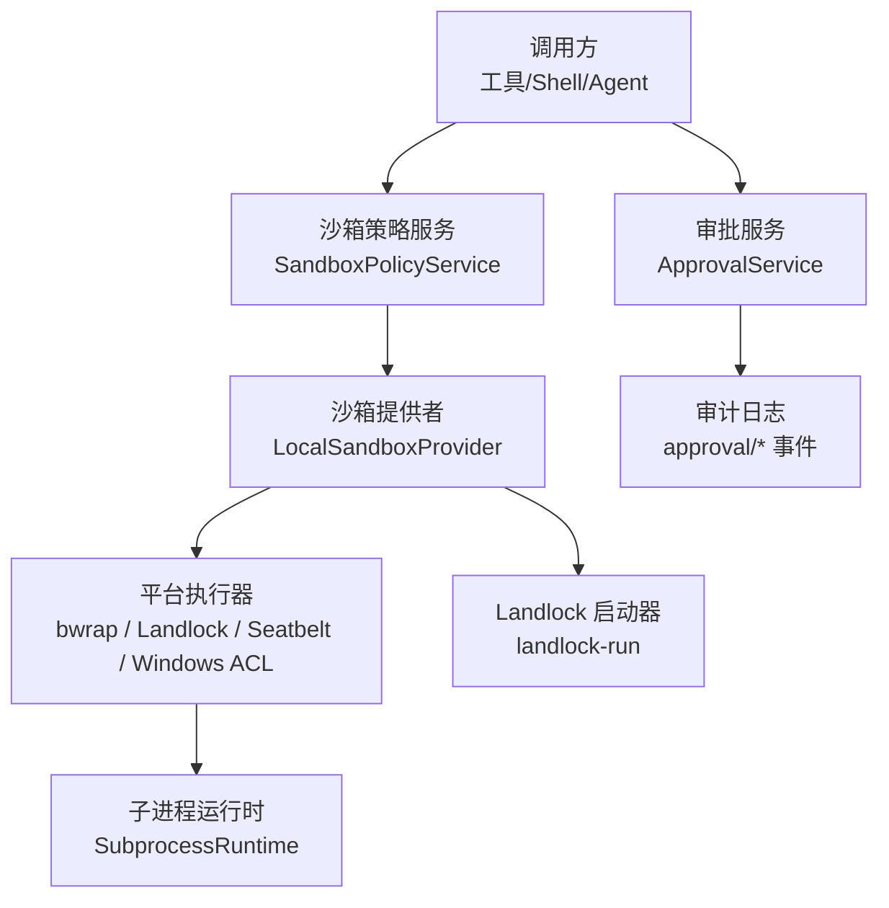
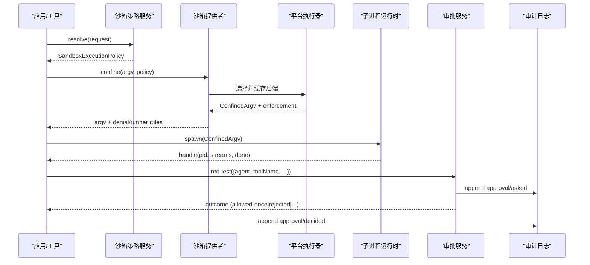
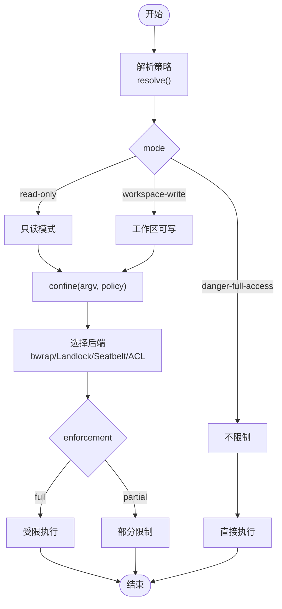
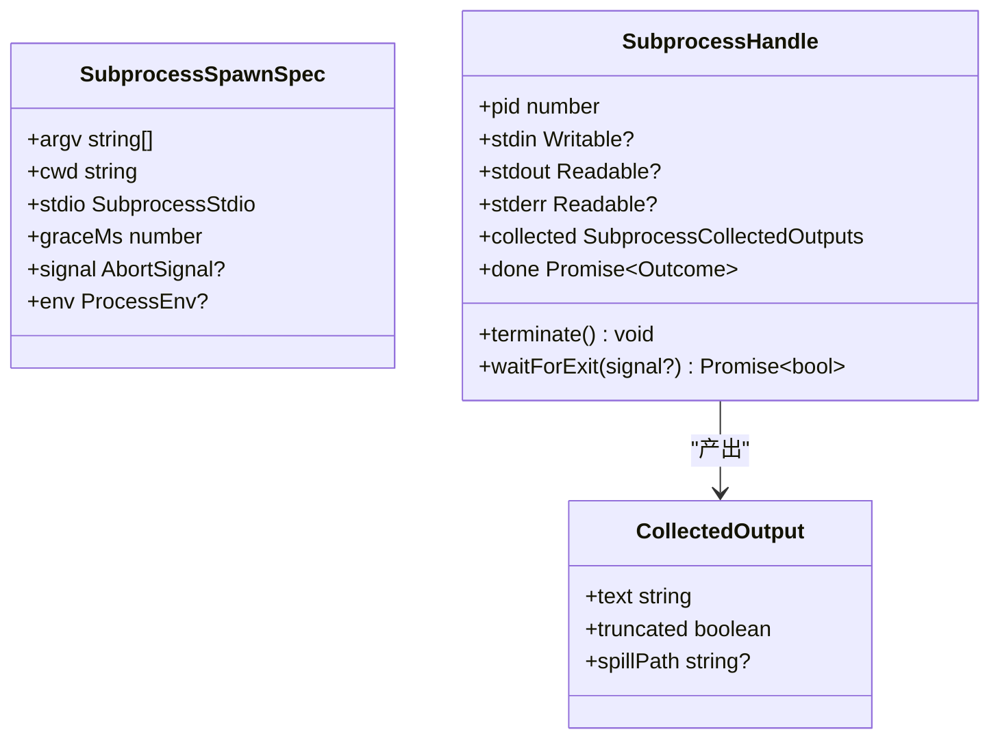
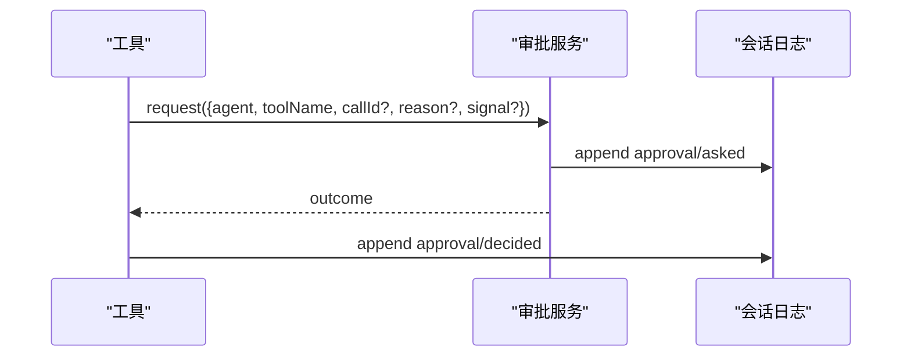
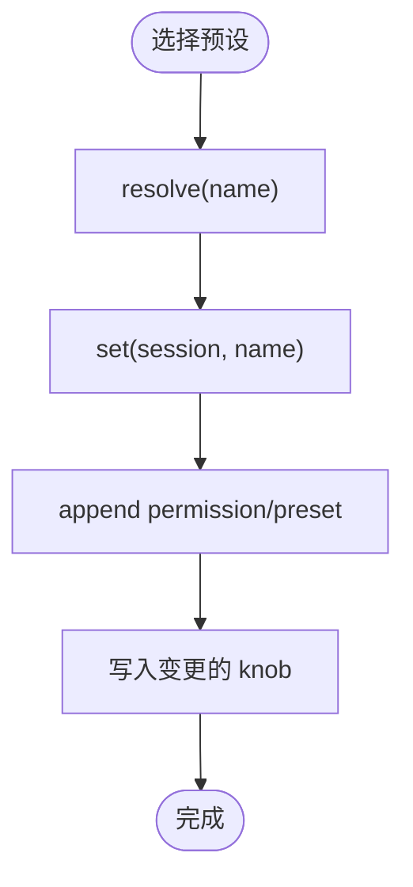
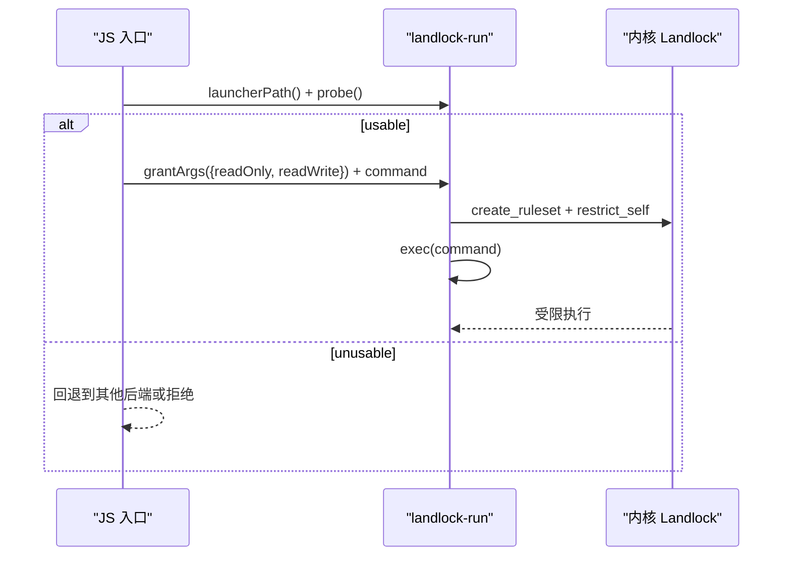
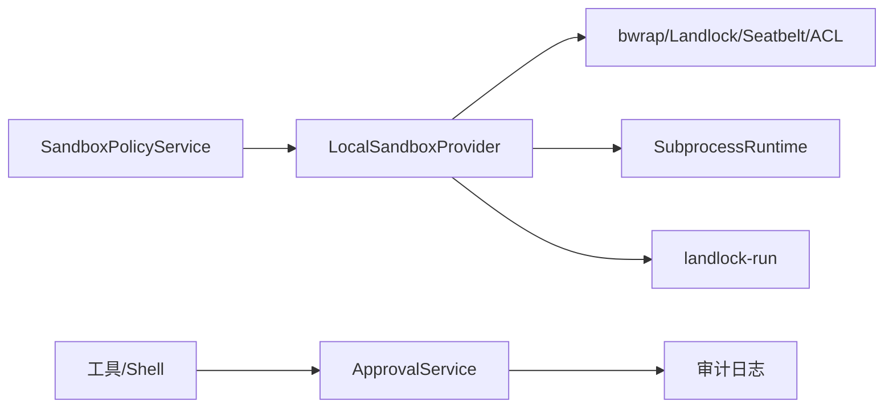

# 安全与沙箱

<cite>
**本文引用的文件**
- [sandbox.md](file://docs/subsystems/sandbox.md)
- [permission-presets.md](file://docs/subsystems/permission-presets.md)
- [approval.md](file://docs/subsystems/approval.md)
- [subprocess.md](file://docs/subsystems/subprocess.md)
- [landlock-run README.md](file://native/landlock-run/README.md)
- [cli-contract.md](file://native/landlock-run/docs/cli-contract.md)
- [sandbox-local README.md](file://packages/sandbox/sandbox-local/README.md)
- [main.c](file://native/landlock-run/packages/entry/src/main.c)
- [index.ts（用户审批）](file://packages/interaction/user-approval/src/index.ts)
- [invariant.spec.ts（审批不变式）](file://packages/interaction/user-approval/tests/invariant.spec.ts)
- [landlock.e2e.ts（bash-sandbox）](file://packages/shell/bash-sandbox/tests/landlock.e2e.ts)
- [landlock.e2e.ts（sandbox-local）](file://packages/sandbox/sandbox-local/tests/landlock.e2e.ts)
</cite>

## 目录
1. [简介](#简介)
2. [项目结构](#项目结构)
3. [核心组件](#核心组件)
4. [架构总览](#架构总览)
5. [详细组件分析](#详细组件分析)
6. [依赖关系分析](#依赖关系分析)
7. [性能与安全特性](#性能与安全特性)
8. [故障排除指南](#故障排除指南)
9. [结论](#结论)
10. [附录：配置示例与最佳实践](#附录：配置示例与最佳实践)

## 简介
本文件系统性阐述 DeepSeek Harness 的安全与沙箱体系，覆盖进程隔离、资源限制、细粒度权限管理、Landlock 沙箱实现、审批工作流与审计日志、以及面向开发者的安全最佳实践与常见威胁防护。目标是帮助开发者构建安全的智能体应用，在可验证的边界内运行不可信代码与命令。

## 项目结构
安全能力由多个子系统协作构成：
- 进程沙箱抽象与本地实现：提供跨平台进程隔离策略与后端选择
- 子进程运行时：统一进程生命周期、环境变量清理、输出收集与终止
- 审批服务：统一的“是否允许”决策与审计日志
- 权限预设：将沙箱模式与审批策略打包为可选的“权限预设”，便于客户端呈现与切换
- Landlock 原生启动器：Linux 上的最小化自限制执行器，配合 bwrap/Seatbelt/Windows ACL 形成多后端

图表来源
- [sandbox.md:9-157](file://docs/subsystems/sandbox.md#L9-L157)
- [subprocess.md:9-130](file://docs/subsystems/subprocess.md#L9-L130)
- [approval.md:84-140](file://docs/subsystems/approval.md#L84-L140)
- [landlock-run README.md:25-44](file://native/landlock-run/README.md#L25-L44)

章节来源
- [sandbox.md:1-219](file://docs/subsystems/sandbox.md#L1-L219)
- [subprocess.md:1-325](file://docs/subsystems/subprocess.md#L1-L325)
- [approval.md:1-171](file://docs/subsystems/approval.md#L1-L171)
- [landlock-run README.md:1-61](file://native/landlock-run/README.md#L1-L61)

## 核心组件
- 进程沙箱（Sandbox Provider）：封装同进程子进程的 argv 到受控执行环境，返回受限 argv 与执行完整性报告；支持 read-only、workspace-write、danger-full-access 三种模式，并报告 full/partial 执行完整性。
- 子进程运行时（Subprocess Runtime）：负责可执行解析、环境变量清洗、stdio 模式、输出收集与溢出转储、树级终止与等待。
- 审批服务（Approval Service）：对敏感操作进行 ask/never 策略控制，记录 asked/decided 审计事件，保证成对提交与失败关闭。
- 权限预设（Permission Presets）：将沙箱模式与审批策略组合为命名预设，提供当前状态推导与切换写入路径。
- Landlock 启动器：Linux 上以最小 C 程序安装 Landlock 规则集后 exec 目标命令，支持 --probe、--ro/--rw 授权语义与严格的退出码约定。

章节来源
- [sandbox.md:9-157](file://docs/subsystems/sandbox.md#L9-L157)
- [subprocess.md:9-130](file://docs/subsystems/subprocess.md#L9-L130)
- [approval.md:31-88](file://docs/subsystems/approval.md#L31-L88)
- [permission-presets.md:9-68](file://docs/subsystems/permission-presets.md#L9-L68)
- [cli-contract.md:5-34](file://native/landlock-run/docs/cli-contract.md#L5-L34)

## 架构总览
下图展示一次受限执行的端到端流程：策略解析 → 沙箱包装 → 平台执行器 → 子进程运行时 → 审批与审计。

图表来源
- [sandbox.md:41-157](file://docs/subsystems/sandbox.md#L41-L157)
- [subprocess.md:89-174](file://docs/subsystems/subprocess.md#L89-L174)
- [approval.md:84-140](file://docs/subsystems/approval.md#L84-L140)

## 详细组件分析

### 进程沙箱与模式
- 模式与执行完整性：read-only 仅允许必要写口（如 /dev/null），workspace-write 允许工作区与后端临时目录，danger-full-access 绕过限制；enforcement 报告 full/partial，用于区分内核 ABI 或后端能力差异。
- 每调用策略：SandboxExecutionPolicy 携带 mode、workspaceRoot、sessionId；SandboxPolicyService.resolve() 决定最终策略，避免消费者重复逻辑。
- 包装 argv 与分类：返回 ConfinedArgv，包含 denialSignatures 与 runnerFailureRules，使消费者能区分“被沙箱拒绝”和“沙箱启动器失败”。

图表来源
- [sandbox.md:9-157](file://docs/subsystems/sandbox.md#L9-L157)

章节来源
- [sandbox.md:9-157](file://docs/subsystems/sandbox.md#L9-L157)

### 子进程运行时与资源限制
- 环境变量：DSH_* 命名空间由 Harness 管理，子进程会丢弃父进程中的 DSH_*，显式传入才生效，防止凭据泄露。
- 输出收集：支持 pipe/inherit/collect 模式，collect 模式具备内存上限与 spill 文件恢复，避免大输出导致 OOM。
- 终止与等待：terminate() 树级终止（SIGTERM→grace→SIGKILL），waitForExit() 等待整棵树退出，确保无孤儿进程。
- 终端原语：spawnTerminal 提供真实终端分配、前台进程组、信号与完整会话清理。

图表来源
- [subprocess.md:13-174](file://docs/subsystems/subprocess.md#L13-L174)

章节来源
- [subprocess.md:9-174](file://docs/subsystems/subprocess.md#L9-L174)

### 审批工作流与审计日志
- 策略：ask 委派给答案器链（默认 fail-closed），never 直接拒绝，适合无人值守场景。
- 请求与结果：request(req) 要求处于 open turn 中，追加 asked 事件，获取结果后再追加 decided 事件；任何审计写入失败都会导致请求拒绝，保证成对性。
- 不变式校验：测试覆盖非法/未配对审计事件，确保一致性。

图表来源
- [approval.md:84-140](file://docs/subsystems/approval.md#L84-L140)
- [invariant.spec.ts:88-106](file://packages/interaction/user-approval/tests/invariant.spec.ts#L88-L106)

章节来源
- [approval.md:31-140](file://docs/subsystems/approval.md#L31-L140)
- [invariant.spec.ts:88-106](file://packages/interaction/user-approval/tests/invariant.spec.ts#L88-L106)

### 权限预设
- 预设表：将 sandbox/mode 与 approval/policy 绑定为命名预设，并提供 name/description 等展示信息。
- 当前状态推导：current(events) 根据有效 knob 值推导当前预设，若无法匹配则返回 custom。
- 切换写入：set(session, name) 先记录 permission/preset 事件，再分别写入变更的 knob，避免冗余。

图表来源
- [permission-presets.md:9-68](file://docs/subsystems/permission-presets.md#L9-L68)

章节来源
- [permission-presets.md:9-132](file://docs/subsystems/permission-presets.md#L9-L132)

### Landlock 安全沙箱
- 启动器职责：设置 no_new_privs，创建规则集，按 ABI 协商支持的访问类，exec 目标命令；所有继承进程同样受限。
- CLI 契约：--probe 探测可用性；--ro/--rw 授予读/执行或读写；exit 125 表示启动器失败；成功 exec 后子进程状态透传。
- 集成方式：本地提供者优先使用 bwrap+Landlock，通过 grantArgs 生成授权参数，结合 probe 判断 full/partial/unusable。

图表来源
- [cli-contract.md:5-34](file://native/landlock-run/docs/cli-contract.md#L5-L34)
- [main.c:220-267](file://native/landlock-run/packages/entry/src/main.c#L220-L267)
- [landlock-run README.md:25-44](file://native/landlock-run/README.md#L25-L44)

章节来源
- [cli-contract.md:5-34](file://native/landlock-run/docs/cli-contract.md#L5-L34)
- [main.c:220-267](file://native/landlock-run/packages/entry/src/main.c#L220-L267)
- [landlock-run README.md:1-61](file://native/landlock-run/README.md#L1-L61)

## 依赖关系分析
- 沙箱策略服务依赖会话上下文与工作区根，为每次调用计算最终策略。
- 本地沙箱提供者依赖平台执行器（bwrap/Landlock/Seatbelt/Windows ACL），并缓存后端选择结果。
- 子进程运行时独立于沙箱，但常被沙箱包装后的 argv 消费。
- 审批服务与沙箱解耦，但常与工具调用协同，决定是否放行敏感操作。
- Landlock 启动器作为二进制契约，与 JS 入口包解耦，便于版本管理与跨仓库兼容。

图表来源
- [sandbox.md:41-157](file://docs/subsystems/sandbox.md#L41-L157)
- [subprocess.md:89-174](file://docs/subsystems/subprocess.md#L89-L174)
- [approval.md:84-140](file://docs/subsystems/approval.md#L84-L140)
- [cli-contract.md:5-34](file://native/landlock-run/docs/cli-contract.md#L5-L34)

章节来源
- [sandbox.md:41-157](file://docs/subsystems/sandbox.md#L41-L157)
- [subprocess.md:89-174](file://docs/subsystems/subprocess.md#L89-L174)
- [approval.md:84-140](file://docs/subsystems/approval.md#L84-L140)
- [cli-contract.md:5-34](file://native/landlock-run/docs/cli-contract.md#L5-L34)

## 性能与安全特性
- 后端选择缓存：本地提供者缓存 runner 选择结果，减少重复探测开销。
- 输出收集与溢出：collect 模式支持内存上限与 spill 文件，避免大输出阻塞或丢失关键诊断。
- 树级终止：统一 terminate() 与 waitForExit()，确保进程树快速回收，降低僵尸进程风险。
- 环境变量清洗：DSH_* 命名空间严格管控，避免凭据泄漏。
- 执行完整性报告：enforcement full/partial 明确告知上层限制强度，必要时拒绝高风险操作。

[本节为通用指导，无需特定文件引用]

## 故障排除指南
- 沙箱不可用：当无可用后端或探针失败时，provider 抛出 SANDBOX_UNAVAILABLE；应检查平台支持、runner 安装与权限。
- 启动器失败：landlock-run 返回 125 且 stderr 含 landlock-run: 前缀行；需区分“启动器失败”与“子进程失败”。
- 部分限制：older ABI 或 Windows ACL 的 Everyone/hard-link 边界导致 partial；高风险场景应拒绝或提示。
- 审批审计不一致：测试覆盖未配对/非法事件；若出现异常，检查会话是否在 open turn 中以及审计写入是否成功。
- 终端/子进程挂起：确认 graceMs 合理、terminate() 已调用、waitForExit() 等待整棵树退出。

章节来源
- [sandbox-local README.md:1-41](file://packages/sandbox/sandbox-local/README.md#L1-L41)
- [cli-contract.md:20-34](file://native/landlock-run/docs/cli-contract.md#L20-L34)
- [invariant.spec.ts:88-106](file://packages/interaction/user-approval/tests/invariant.spec.ts#L88-L106)
- [subprocess.md:132-174](file://docs/subsystems/subprocess.md#L132-L174)

## 结论
DeepSeek Harness 通过分层设计实现了可验证的进程隔离与细粒度权限控制：策略层决定执行边界，沙箱层提供跨平台执行约束，子进程运行时保障资源与生命周期管理，审批服务提供可审计的决策闭环，Landlock 启动器在 Linux 上提供最小可信执行面。结合预设与审计，开发者可在不同信任级别下安全地运行智能体与工具。

[本节为总结，无需特定文件引用]

## 附录：配置示例与最佳实践

### 安全最佳实践
- 默认采用 read-only 或 workspace-write，仅在必要时使用 danger-full-access。
- 启用审批策略为 ask，并在无人值守环境中设置为 never。
- 使用权限预设统一管理沙箱与审批的组合，便于客户端呈现与切换。
- 对子进程输出使用 collect 模式并设置合理的 maxBytes，必要时启用 spill 文件。
- 始终检查 enforcement 是否为 full，对高风险操作在 partial 时拒绝或降级。
- 使用 DSH_* 环境变量传递受控事实，避免凭据泄露。
- 在部署中禁用不必要的 runner，确保不可用时 fail-closed。

### 常见威胁与防护
- 逃逸与越权：通过 Landlock allow-list 与 bwrap/Seatbelt/ACL 限制文件系统访问；partial 时拒绝高风险操作。
- 凭据泄露：清洗 DSH_* 与 PATH，避免向子进程暴露敏感变量。
- 资源耗尽：限制输出大小、设置 graceMs、强制树级终止。
- 审计缺失：确保 approval/asked 与 approval/decided 成对写入，失败即拒绝。

### 配置示例（路径参考）
- 沙箱本地提供者配置与插件注册：参见 [sandbox-local README.md:19-24](file://packages/sandbox/sandbox-local/README.md#L19-L24)
- Landlock 启动器用法与参数：参见 [cli-contract.md:5-34](file://native/landlock-run/docs/cli-contract.md#L5-L34)
- 审批策略与服务接口：参见 [approval.md:31-140](file://docs/subsystems/approval.md#L31-L140)
- 权限预设表与切换：参见 [permission-presets.md:9-68](file://docs/subsystems/permission-presets.md#L9-L68)
- 子进程运行时规格与终止：参见 [subprocess.md:89-174](file://docs/subsystems/subprocess.md#L89-L174)

章节来源
- [sandbox-local README.md:19-24](file://packages/sandbox/sandbox-local/README.md#L19-L24)
- [cli-contract.md:5-34](file://native/landlock-run/docs/cli-contract.md#L5-L34)
- [approval.md:31-140](file://docs/subsystems/approval.md#L31-L140)
- [permission-presets.md:9-68](file://docs/subsystems/permission-presets.md#L9-L68)
- [subprocess.md:89-174](file://docs/subsystems/subprocess.md#L89-L174)