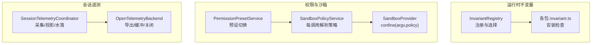
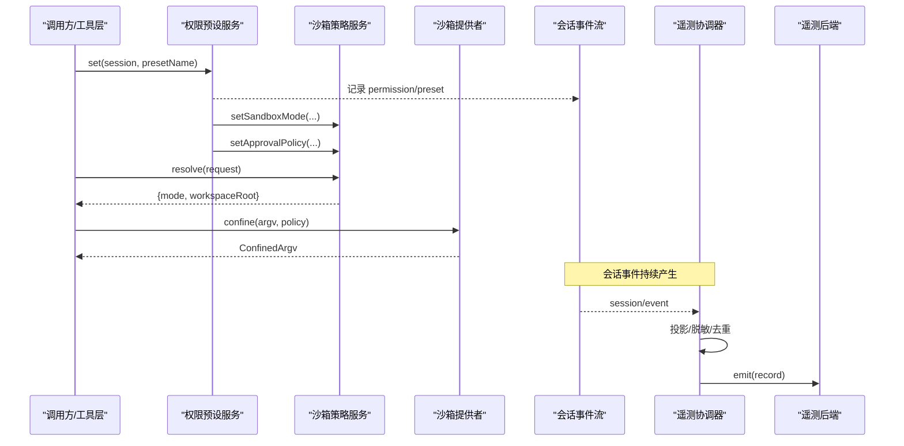
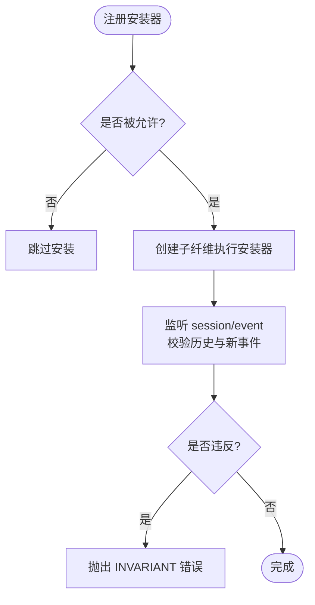
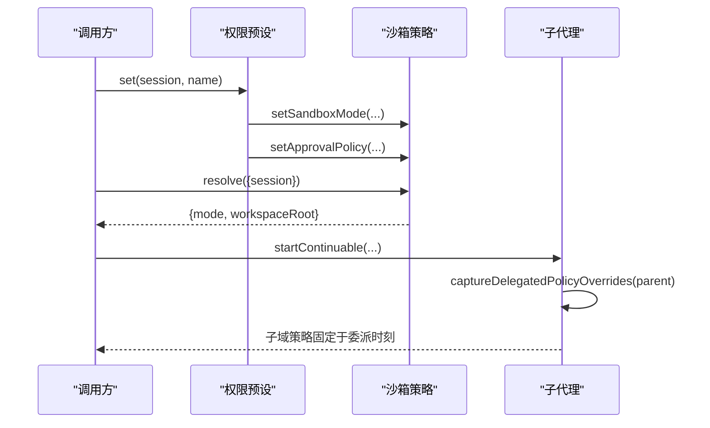
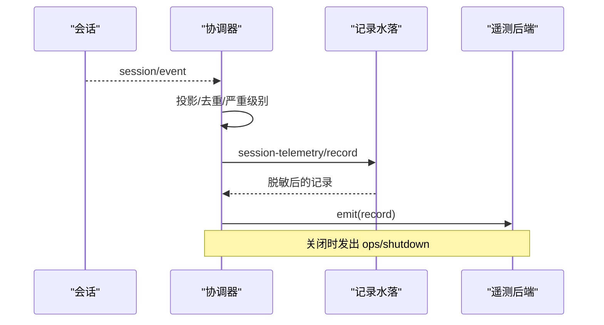
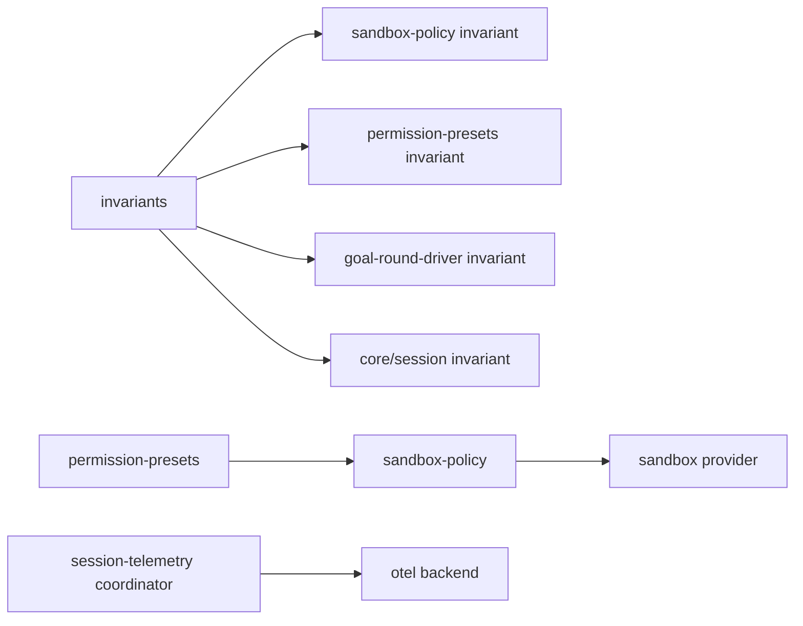

# 安全监控与审计

<cite>
**本文引用的文件**
- [packages/runtime-diagnostics/invariants/src/index.ts](file://packages/runtime-diagnostics/invariants/src/index.ts)
- [docs/subsystems/invariants.md](file://docs/subsystems/invariants.md)
- [packages/sandbox/sandbox-policy/src/invariant.ts](file://packages/sandbox/sandbox-policy/src/invariant.ts)
- [packages/interaction/permission-presets/src/invariant.ts](file://packages/interaction/permission-presets/src/invariant.ts)
- [packages/goal/goal-round-driver/src/invariant.ts](file://packages/goal/goal-round-driver/src/invariant.ts)
- [packages/core/session/src/invariant.ts](file://packages/core/session/src/invariant.ts)
- [docs/subsystems/sandbox.md](file://docs/subsystems/sandbox.md)
- [docs/subsystems/permission-presets.md](file://docs/subsystems/permission-presets.md)
- [packages/session/session-telemetry/src/coordinator.ts](file://packages/session/session-telemetry/src/coordinator.ts)
- [packages/session/session-telemetry/src/index.ts](file://packages/session/session-telemetry/src/index.ts)
- [docs/subsystems/session-telemetry.md](file://docs/subsystems/session-telemetry.md)
- [packages/session/session-telemetry-otel/src/index.ts](file://packages/session/session-telemetry-otel/src/index.ts)
- [packages/sandbox/sandbox/src/roots.ts](file://packages/sandbox/sandbox/src/roots.ts)
- [packages/subagent/subagent/src/child-agent.ts](file://packages/subagent/subagent/src/child-agent.ts)
</cite>

## 目录
1. [简介](#简介)
2. [项目结构](#项目结构)
3. [核心组件](#核心组件)
4. [架构总览](#架构总览)
5. [详细组件分析](#详细组件分析)
6. [依赖关系分析](#依赖关系分析)
7. [性能考虑](#性能考虑)
8. [故障排查指南](#故障排查指南)
9. [结论](#结论)
10. [附录](#附录)

## 简介
本文件面向 DeepSeek Harness 的安全监控与审计体系，聚焦运行时安全监控、权限违规检测、资源访问审计与安全事件记录；解释 Invariant（不变量）检查系统的工作原理与自定义实现方法；说明安全日志结构与使用方式；提供安全事件响应流程与自动化处理建议；并给出性能监控指标与安全告警配置示例，帮助开发者建立完整的安全监控体系。

## 项目结构
围绕“安全监控与审计”的关键代码分布在以下子系统：
- 运行时不变量注册中心：用于按包名启用/过滤运行期不变量检查，承载各包的 invariant 插件。
- 沙箱与权限预设：定义进程级文件访问边界与审批策略的组合开关，并提供变更事件与不变量校验。
- 会话遥测：将会话事件与操作信号统一投影为可审计的遥测记录，支持重放、脱敏与后端导出。
- 子代理委派策略：在委托边界固化父会话的权限与审批策略，确保子域最小权限。

**图表来源**
- [packages/runtime-diagnostics/invariants/src/index.ts:94-197](file://packages/runtime-diagnostics/invariants/src/index.ts#L94-L197)
- [docs/subsystems/invariants.md:9-59](file://docs/subsystems/invariants.md#L9-L59)
- [docs/subsystems/sandbox.md:41-94](file://docs/subsystems/sandbox.md#L41-L94)
- [docs/subsystems/permission-presets.md:9-68](file://docs/subsystems/permission-presets.md#L9-L68)
- [packages/session/session-telemetry/src/coordinator.ts:60-126](file://packages/session/session-telemetry/src/coordinator.ts#L60-L126)
- [packages/session/session-telemetry-otel/src/index.ts:141-168](file://packages/session/session-telemetry-otel/src/index.ts#L141-L168)

**章节来源**
- [packages/runtime-diagnostics/invariants/src/index.ts:94-197](file://packages/runtime-diagnostics/invariants/src/index.ts#L94-L197)
- [docs/subsystems/invariants.md:9-59](file://docs/subsystems/invariants.md#L9-L59)
- [docs/subsystems/sandbox.md:41-94](file://docs/subsystems/sandbox.md#L41-L94)
- [docs/subsystems/permission-presets.md:9-68](file://docs/subsystems/permission-presets.md#L9-L68)
- [packages/session/session-telemetry/src/coordinator.ts:60-126](file://packages/session/session-telemetry/src/coordinator.ts#L60-L126)
- [packages/session/session-telemetry-otel/src/index.ts:141-168](file://packages/session/session-telemetry-otel/src/index.ts#L141-L168)

## 核心组件
- 运行时不变量服务：提供按包名白/黑名单的选择机制，以独立子纤维执行各包的不变量安装器，失败抛出带包名的稳定错误码。
- 沙箱策略服务：为每次能力调用解析完整的文件访问策略（模式+工作区根），并在受限模式下交由后端 confine。
- 权限预设服务：将沙箱模式与审批策略打包为“预设”，切换时写入各自设置并记录持久化事件。
- 会话遥测协调器：订阅会话事件流，投影为统一的遥测记录，经水落脱敏后交给后端导出；支持“实时”和“按需”两种采集模式。

**章节来源**
- [packages/runtime-diagnostics/invariants/src/index.ts:14-42](file://packages/runtime-diagnostics/invariants/src/index.ts#L14-L42)
- [docs/subsystems/invariants.md:25-59](file://docs/subsystems/invariants.md#L25-L59)
- [docs/subsystems/sandbox.md:41-94](file://docs/subsystems/sandbox.md#L41-L94)
- [docs/subsystems/permission-presets.md:9-68](file://docs/subsystems/permission-presets.md#L9-L68)
- [packages/session/session-telemetry/src/coordinator.ts:60-126](file://packages/session/session-telemetry/src/coordinator.ts#L60-L126)

## 架构总览
下图展示了从“权限/沙箱”到“事件采集/审计”的端到端链路：权限预设驱动策略变化，策略决定受限执行；所有关键事件被遥测协调器捕获、投影、脱敏并导出。

**图表来源**
- [docs/subsystems/permission-presets.md:64-68](file://docs/subsystems/permission-presets.md#L64-L68)
- [docs/subsystems/sandbox.md:41-94](file://docs/subsystems/sandbox.md#L41-L94)
- [packages/session/session-telemetry/src/coordinator.ts:79-126](file://packages/session/session-telemetry/src/coordinator.ts#L79-L126)

## 详细组件分析

### 运行时不变量检查系统
- 工作原理
  - 通过 `ctx.invariants.register(packageName, installer)` 注册每个包的不变量安装器。
  - 服务根据全局开关与包名正则白/黑名单决定是否启用该安装器。
  - 安装器在独立子纤维中运行，失败会释放注册并抛出稳定的 `INVARIANT` 错误。
- 典型实现位置
  - 权限预设、沙箱策略、目标轮次驱动、会话状态机等均提供各自的 invariant 安装器，监听 `session/event` 并对新增事件进行一致性校验。
- 自定义不变量实现要点
  - 在包的 `./invariant` 导出安装函数，使用注入的服务读取当前会话与事件流。
  - 对已加载会话的历史事件与后续新追加事件分别校验。
  - 使用 fail(message) 报告违反契约的错误，错误包含包名以便定位。

**图表来源**
- [packages/runtime-diagnostics/invariants/src/index.ts:120-197](file://packages/runtime-diagnostics/invariants/src/index.ts#L120-L197)
- [docs/subsystems/invariants.md:25-59](file://docs/subsystems/invariants.md#L25-L59)

**章节来源**
- [packages/runtime-diagnostics/invariants/src/index.ts:14-42](file://packages/runtime-diagnostics/invariants/src/index.ts#L14-L42)
- [packages/runtime-diagnostics/invariants/src/index.ts:94-197](file://packages/runtime-diagnostics/invariants/src/index.ts#L94-L197)
- [docs/subsystems/invariants.md:9-59](file://docs/subsystems/invariants.md#L9-L59)
- [packages/sandbox/sandbox-policy/src/invariant.ts:23-42](file://packages/sandbox/sandbox-policy/src/invariant.ts#L23-L42)
- [packages/interaction/permission-presets/src/invariant.ts:21-39](file://packages/interaction/permission-presets/src/invariant.ts#L21-L39)
- [packages/goal/goal-round-driver/src/invariant.ts:60-84](file://packages/goal/goal-round-driver/src/invariant.ts#L60-L84)
- [packages/core/session/src/invariant.ts:233-250](file://packages/core/session/src/invariant.ts#L233-L250)

### 权限与沙箱控制
- 权限预设
  - 将“沙箱模式”和“审批策略”组合为预设，切换时先记录意图事件，再写入对应设置；若当前已是有效值则不重复记录。
- 沙箱策略
  - 每次能力调用解析完整策略（模式+工作区根），受限模式进入 confine；非受限模式直接执行。
  - 平台后端返回“执行完整性”事实（full/partial），供上层决策。
- 委派边界
  - 子代理在委派边界捕获父会话的沙箱覆盖与审批策略，确保子域继承最小权限。

**图表来源**
- [docs/subsystems/permission-presets.md:64-68](file://docs/subsystems/permission-presets.md#L64-L68)
- [docs/subsystems/sandbox.md:41-94](file://docs/subsystems/sandbox.md#L41-L94)
- [packages/subagent/subagent/src/child-agent.ts:177-204](file://packages/subagent/subagent/src/child-agent.ts#L177-L204)

**章节来源**
- [docs/subsystems/permission-presets.md:9-68](file://docs/subsystems/permission-presets.md#L9-L68)
- [docs/subsystems/sandbox.md:9-94](file://docs/subsystems/sandbox.md#L9-L94)
- [packages/subagent/subagent/src/child-agent.ts:177-204](file://packages/subagent/subagent/src/child-agent.ts#L177-L204)

### 会话遥测与安全日志
- 逻辑记录
  - 每条记录包含通道（账本/操作）、时间、预映射严重级别、最小身份属性与完整负载。
  - 仅首块助手分片随流发送，其余在采集阶段丢弃；接收端需基于 (session.id, event.seq) 去重。
- 采集与投递
  - 协调器订阅会话事件流，投影并运行“记录水落”（部署挂载的脱敏规则），然后交给后端 emit。
  - 支持“实时”与“按需”两种采集模式；关闭时发出 shutdown 操作信号。
- 后端
  - OpenTelemetry 后端根据配置启用或禁用上报；禁用时仍记录本地告警。

**图表来源**
- [packages/session/session-telemetry/src/coordinator.ts:79-126](file://packages/session/session-telemetry/src/coordinator.ts#L79-L126)
- [packages/session/session-telemetry/src/coordinator.ts:179-226](file://packages/session/session-telemetry/src/coordinator.ts#L179-L226)
- [docs/subsystems/session-telemetry.md:9-58](file://docs/subsystems/session-telemetry.md#L9-L58)
- [packages/session/session-telemetry-otel/src/index.ts:141-168](file://packages/session/session-telemetry-otel/src/index.ts#L141-L168)

**章节来源**
- [packages/session/session-telemetry/src/index.ts:47-178](file://packages/session/session-telemetry/src/index.ts#L47-L178)
- [packages/session/session-telemetry/src/coordinator.ts:60-126](file://packages/session/session-telemetry/src/coordinator.ts#L60-L126)
- [packages/session/session-telemetry/src/coordinator.ts:179-226](file://packages/session/session-telemetry/src/coordinator.ts#L179-L226)
- [docs/subsystems/session-telemetry.md:9-58](file://docs/subsystems/session-telemetry.md#L9-L58)
- [packages/session/session-telemetry-otel/src/index.ts:141-168](file://packages/session/session-telemetry-otel/src/index.ts#L141-L168)

### 路径规范化与边界
- 授予根路径在比较前会被规范化为真实路径，避免符号链接导致的边界不一致。
- 这保证了沙箱约束与实际文件系统行为一致。

**章节来源**
- [packages/sandbox/sandbox/src/roots.ts:16-41](file://packages/sandbox/sandbox/src/roots.ts#L16-L41)

## 依赖关系分析
- 低耦合高内聚
  - 不变量服务与各包解耦，仅通过包名与安装器接口交互。
  - 权限预设与沙箱策略分离，预设只负责组合与写入，策略负责解析。
  - 遥测协调器与后端通过最小接口通信，屏蔽批处理与重试细节。
- 外部依赖
  - 沙箱后端依赖平台能力（bwrap/Landlock、Seatbelt、Windows ACL）。
  - 遥测后端依赖 OpenTelemetry SDK。

**图表来源**
- [packages/runtime-diagnostics/invariants/src/index.ts:94-197](file://packages/runtime-diagnostics/invariants/src/index.ts#L94-L197)
- [packages/sandbox/sandbox-policy/src/invariant.ts:23-42](file://packages/sandbox/sandbox-policy/src/invariant.ts#L23-L42)
- [packages/interaction/permission-presets/src/invariant.ts:21-39](file://packages/interaction/permission-presets/src/invariant.ts#L21-L39)
- [packages/goal/goal-round-driver/src/invariant.ts:60-84](file://packages/goal/goal-round-driver/src/invariant.ts#L60-L84)
- [packages/core/session/src/invariant.ts:233-250](file://packages/core/session/src/invariant.ts#L233-L250)
- [packages/session/session-telemetry/src/coordinator.ts:60-126](file://packages/session/session-telemetry/src/coordinator.ts#L60-L126)
- [packages/session/session-telemetry-otel/src/index.ts:141-168](file://packages/session/session-telemetry-otel/src/index.ts#L141-L168)

**章节来源**
- [packages/runtime-diagnostics/invariants/src/index.ts:94-197](file://packages/runtime-diagnostics/invariants/src/index.ts#L94-L197)
- [docs/subsystems/sandbox.md:41-94](file://docs/subsystems/sandbox.md#L41-L94)
- [docs/subsystems/permission-presets.md:9-68](file://docs/subsystems/permission-presets.md#L9-L68)
- [packages/session/session-telemetry/src/coordinator.ts:60-126](file://packages/session/session-telemetry/src/coordinator.ts#L60-L126)

## 性能考虑
- 遥测采集
  - 协调器在热路径上只做轻量投影与队列入队，flush 为可选提示，避免阻塞主循环。
  - 仅首块助手分片外发，减少带宽与存储压力。
- 沙箱 confine
  - 策略解析与 confine 调用为每调用一次，避免全局状态污染；平台后端缓存与探测由提供方负责。
- 不变量检查
  - 安装器在子纤维中运行，失败不影响主流程；可按包名白/黑名单选择性启用，降低开销。

[本节为通用指导，不直接分析具体文件]

## 故障排查指南
- 不变量失败
  - 现象：出现稳定错误码 `INVARIANT`，消息包含包名。
  - 排查：定位对应包的 invariant 安装器，检查其对历史与新事件的校验逻辑。
- 遥测丢失或重复
  - 现象：接收端出现 seq 间隙或重复记录。
  - 原因：最佳努力交付，可能因崩溃/重载丢失，也可能因重接入重复。
  - 处理：接收端基于 (session.id, event.seq) 去重；关注 ops/shutdown 信号判断会话结束。
- 沙箱不可用或部分生效
  - 现象：confine 抛出不可用错误或返回 partial 执行完整性。
  - 处理：确认平台后端可用性与 ABI 版本；必要时降级或拒绝高风险调用。

**章节来源**
- [packages/runtime-diagnostics/invariants/src/index.ts:49-66](file://packages/runtime-diagnostics/invariants/src/index.ts#L49-L66)
- [docs/subsystems/session-telemetry.md:9-58](file://docs/subsystems/session-telemetry.md#L9-L58)
- [docs/subsystems/sandbox.md:9-40](file://docs/subsystems/sandbox.md#L9-L40)

## 结论
DeepSeek Harness 通过“权限预设 + 沙箱策略 + 运行时不变量 + 会话遥测”的组合，构建了从执行边界到可观测性的闭环安全体系。不变量保证内部契约不被破坏，沙箱与审批策略限制资源访问，遥测提供可审计的事件流与操作信号。结合按需采集、脱敏水落与后端导出，可在生产环境中实现高效、可控的安全监控与审计。

[本节为总结性内容，不直接分析具体文件]

## 附录

### 安全事件响应流程与自动化建议
- 事件分类
  - 账本事件：来自会话日志，适合长期审计与回溯。
  - 操作事件：如 agent-error、shutdown，适合即时告警。
- 响应步骤
  - 采集：协调器实时捕获并投递至后端。
  - 告警：基于 severity=error 的操作事件触发告警。
  - 处置：根据事件上下文（会话、工具调用、沙箱模式）自动隔离或回滚。
  - 复盘：基于账本事件重建时间线，定位根因。
- 自动化
  - 在遥测后端侧实现阈值与规则引擎，对高频异常、越权尝试等模式自动封禁或降权。
  - 将“权限预设切换”作为用户意图事件纳入审计看板，便于追溯人为变更。

[本节为概念性内容，不直接分析具体文件]

### 性能监控指标与安全告警配置示例
- 指标建议
  - 遥测吞吐：emit 速率、延迟分布、丢包率（基于 seq 间隙推断）。
  - 沙箱有效性：confine 成功率、partial 执行比例、拒绝次数。
  - 不变量触发：安装器启用数、违反次数（按包名聚合）。
- 告警示例
  - 当连续 N 条 tool/result 标记为错误时触发告警。
  - 当 sandbox/mode 频繁切换或出现危险模式时触发告警。
  - 当 agent-error 频率突增时触发告警。

[本节为通用指导，不直接分析具体文件]