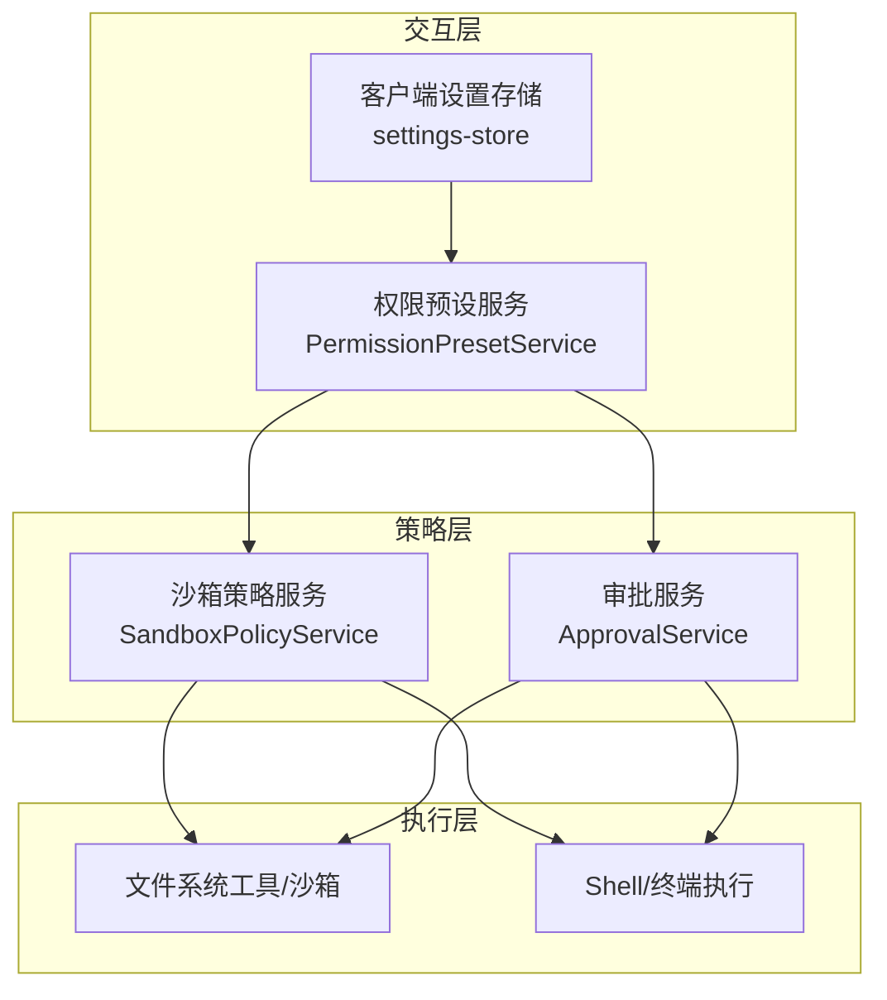
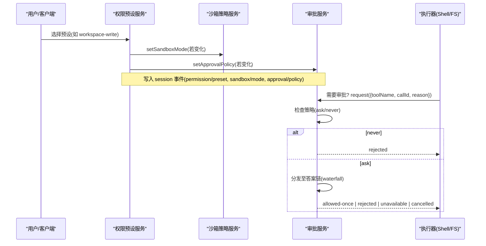
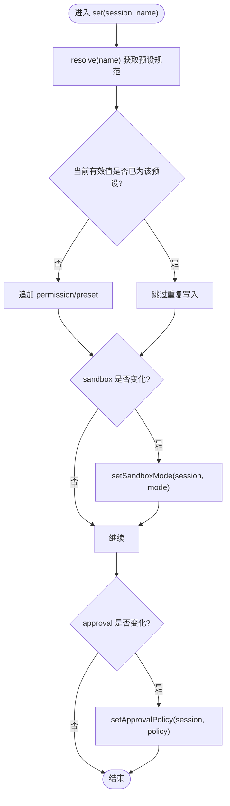
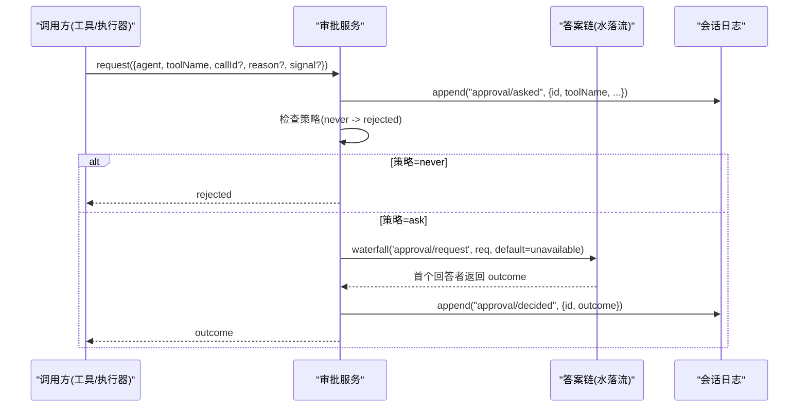
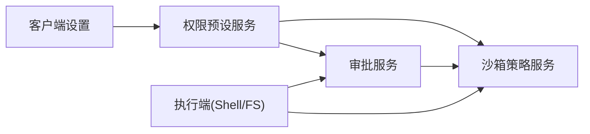

# 权限管理系统

<cite>
**本文引用的文件**
- [packages/interaction/permission-presets/src/index.ts](file://packages/interaction/permission-presets/src/index.ts)
- [packages/interaction/user-approval/src/index.ts](file://packages/interaction/user-approval/src/index.ts)
- [docs/subsystems/permission-presets.md](file://docs/subsystems/permission-presets.md)
- [docs/subsystems/approval.md](file://docs/subsystems/approval.md)
- [packages/interaction/permission-presets/tests/permission-presets.spec.ts](file://packages/interaction/permission-presets/tests/permission-presets.spec.ts)
- [packages/interaction/user-approval/tests/approval.spec.ts](file://packages/interaction/user-approval/tests/approval.spec.ts)
- [packages/client/ui-permission-presets/src/client/settings-store.ts](file://packages/client/ui-permission-presets/src/client/settings-store.ts)
- [packages/sandbox/sandbox-policy/src/index.ts](file://packages/sandbox/sandbox-policy/src/index.ts)
- [docs/subsystems/sandbox.md](file://docs/subsystems/sandbox.md)
</cite>

## 目录
1. [简介](#简介)
2. [项目结构](#项目结构)
3. [核心组件](#核心组件)
4. [架构总览](#架构总览)
5. [详细组件分析](#详细组件分析)
6. [依赖关系分析](#依赖关系分析)
7. [性能与可扩展性](#性能与可扩展性)
8. [故障排查指南](#故障排查指南)
9. [结论](#结论)
10. [附录：配置示例与最佳实践](#附录：配置示例与最佳实践)

## 简介
本文件系统面向 DeepSeek Harness 的权限管理子系统，聚焦细粒度权限控制、审批工作流与审计日志。系统通过“沙箱模式”和“审批策略”两个独立旋钮的组合，提供可配置的权限预设；同时提供会话级审批策略、请求-决策-审计闭环，以及客户端可见的权限选择器与设置项。文档将解释权限继承、组合与覆盖规则，给出审批流程时序图、数据流图，并提供安全建议与常见问题解决方案，帮助开发者构建安全的权限模型。

## 项目结构
权限相关能力由多个包协作完成：
- 权限预设层：聚合沙箱模式与审批策略为“预设”，提供切换、投影与命令入口。
- 审批服务：实现一次性的权限请求、策略门控、答案链（waterfall）与审计事件对。
- 沙箱策略：统一解析执行边界与工作区根路径，供各执行后端消费。
- 客户端设置：暴露默认预设的选择与校验，驱动新会话初始权限。

图表来源
- [packages/interaction/permission-presets/src/index.ts:159-277](file://packages/interaction/permission-presets/src/index.ts#L159-L277)
- [packages/interaction/user-approval/src/index.ts:192-348](file://packages/interaction/user-approval/src/index.ts#L192-L348)
- [packages/sandbox/sandbox-policy/src/index.ts:112-154](file://packages/sandbox/sandbox-policy/src/index.ts#L112-L154)

章节来源
- [docs/subsystems/permission-presets.md:1-132](file://docs/subsystems/permission-presets.md#L1-L132)
- [docs/subsystems/approval.md:1-171](file://docs/subsystems/approval.md#L1-L171)

## 核心组件
- 权限预设服务：将沙箱模式与审批策略打包为“预设”，支持当前值推导、选项生成、切换写入、新会话默认注入与投影。
- 审批服务：提供会话级审批策略（ask/never）、请求分发、审计事件对（asked/decided）、取消与不可用处理。
- 沙箱策略服务：统一解析每调用粒度的执行模式与工作区根，保证多执行端一致。
- 客户端设置：从宿主描述中读取默认预设枚举并渲染到界面，确保当前值在选项中存在。

章节来源
- [packages/interaction/permission-presets/src/index.ts:139-277](file://packages/interaction/permission-presets/src/index.ts#L139-L277)
- [packages/interaction/user-approval/src/index.ts:176-237](file://packages/interaction/user-approval/src/index.ts#L176-L237)
- [packages/sandbox/sandbox-policy/src/index.ts:112-154](file://packages/sandbox/sandbox-policy/src/index.ts#L112-L154)
- [packages/client/ui-permission-presets/src/client/settings-store.ts:45-76](file://packages/client/ui-permission-presets/src/client/settings-store.ts#L45-L76)

## 架构总览
权限控制的两大支柱：
- 沙箱模式：决定执行边界（只读、工作区可写、危险全访问），由沙箱策略服务统一解析。
- 审批策略：决定是否需要交互式或机器式审批（ask/never），由审批服务在每次请求前应用。

预设是两者的用户友好封装，切换时仅记录意图并写入对应旋钮；实际执行与回放始终读取各自旋钮的有效值。

图表来源
- [packages/interaction/permission-presets/src/index.ts:375-392](file://packages/interaction/permission-presets/src/index.ts#L375-L392)
- [packages/interaction/user-approval/src/index.ts:257-348](file://packages/interaction/user-approval/src/index.ts#L257-L348)
- [packages/sandbox/sandbox-policy/src/index.ts:126-154](file://packages/sandbox/sandbox-policy/src/index.ts#L126-L154)

## 详细组件分析

### 权限预设服务（PermissionPresetService）
- 预设表：键名映射到沙箱模式+审批策略，可选名称与描述；内置 workspace-write 与 danger-full-access。
- 当前值推导：基于会话事件折叠（permission/preset、sandbox/mode、approval/policy），优先匹配最近选择的预设，否则按声明顺序匹配，否则返回 custom。
- 切换写入：set() 仅在有效值变化时追加 permission/preset，再分别写入 sandbox/mode 与 approval/policy。
- 新会话默认：session/created 时补齐缺失的权限事实，确保每个会话具备完整权限上下文。
- 客户端集成：注册 permissions 投影与 /permission 命令，便于 Web 与 CLI 使用。

图表来源
- [packages/interaction/permission-presets/src/index.ts:375-392](file://packages/interaction/permission-presets/src/index.ts#L375-L392)

章节来源
- [packages/interaction/permission-presets/src/index.ts:139-277](file://packages/interaction/permission-presets/src/index.ts#L139-L277)
- [packages/interaction/permission-presets/src/index.ts:304-392](file://packages/interaction/permission-presets/src/index.ts#L304-L392)
- [packages/interaction/permission-presets/src/index.ts:400-430](file://packages/interaction/permission-presets/src/index.ts#L400-L430)
- [docs/subsystems/permission-presets.md:9-68](file://docs/subsystems/permission-presets.md#L9-L68)

### 审批服务（ApprovalService）
- 策略门控：每次请求前先判断会话策略（ask/never）。never 直接拒绝且不触发答案链。
- 请求生命周期：在 open turn 内追加 asked，分发至答案链，追加 decided，返回闭集结果。
- 答案链：首个回答者返回结果即终止；未命中或异常归一化为 unavailable。
- 取消与超时：支持 AbortSignal，已中止立即返回 cancelled，后续晚到答案丢弃。
- 审计与提示：asked/decided 为日志事件；策略变更会向模型注入通知消息，并在系统提示上下文中体现。

图表来源
- [packages/interaction/user-approval/src/index.ts:257-348](file://packages/interaction/user-approval/src/index.ts#L257-L348)

章节来源
- [packages/interaction/user-approval/src/index.ts:176-237](file://packages/interaction/user-approval/src/index.ts#L176-L237)
- [packages/interaction/user-approval/src/index.ts:257-348](file://packages/interaction/user-approval/src/index.ts#L257-L348)
- [docs/subsystems/approval.md:9-88](file://docs/subsystems/approval.md#L9-L88)

### 沙箱策略服务（SandboxPolicyService）
- 单一权威：集中维护部署默认模式与工作区根，以及会话覆盖。
- 解析优先级：显式批准的模式 > 会话 last sandbox/mode > 部署默认。
- 上下文注入：向系统提示注入当前策略说明，使模型知晓边界。

章节来源
- [packages/sandbox/sandbox-policy/src/index.ts:112-154](file://packages/sandbox/sandbox-policy/src/index.ts#L112-L154)
- [docs/subsystems/sandbox.md:23-94](file://docs/subsystems/sandbox.md#L23-L94)

### 客户端设置与权限选择器
- 从宿主描述中读取 defaultPreset 的枚举类型，构造选项列表并校验当前值。
- 当 schema 不合法或缺少字段时抛出错误，保障前端展示与后端一致性。

章节来源
- [packages/client/ui-permission-presets/src/client/settings-store.ts:45-76](file://packages/client/ui-permission-presets/src/client/settings-store.ts#L45-L76)

## 依赖关系分析
- 权限预设依赖沙箱策略与审批策略的写入接口，自身不执行业务限制。
- 审批服务依赖会话事件与系统提示上下文，负责策略门控与审计。
- 沙箱策略被所有执行端消费，避免多端策略漂移。
- 客户端设置依赖宿主描述，确保 UI 与后端预设表一致。

图表来源
- [packages/interaction/permission-presets/src/index.ts:159-277](file://packages/interaction/permission-presets/src/index.ts#L159-L277)
- [packages/interaction/user-approval/src/index.ts:192-348](file://packages/interaction/user-approval/src/index.ts#L192-L348)
- [packages/sandbox/sandbox-policy/src/index.ts:112-154](file://packages/sandbox/sandbox-policy/src/index.ts#L112-L154)

章节来源
- [packages/interaction/permission-presets/src/index.ts:159-277](file://packages/interaction/permission-presets/src/index.ts#L159-L277)
- [packages/interaction/user-approval/src/index.ts:192-348](file://packages/interaction/user-approval/src/index.ts#L192-L348)
- [packages/sandbox/sandbox-policy/src/index.ts:112-154](file://packages/sandbox/sandbox-policy/src/index.ts#L112-L154)

## 性能与可扩展性
- 最小化写入：预设切换仅在值变化时追加事件，避免冗余日志。
- 无状态回放：策略与预设均通过事件折叠计算，无需额外状态同步。
- 可扩展答案链：审批答案链支持作用域过滤与扩展，新增答案者不影响既有行为。
- 上下文缓存：系统提示上下文按会话快照计算，避免重复组装开销。

[本节为通用指导，不直接分析具体文件]

## 故障排查指南
- 未打开的 turn 发起审批：会抛出错误且不会追加任何审计事件。请确保在 turn/start 之后、turn/end 之前发起请求。
- 无人响应审批：答案链为空时返回 unavailable，审计仍记录 asked/decided 对。
- 非法策略值：setApprovalPolicy 会拒绝非词汇表值，防止污染日志。
- 预设名冲突：custom 保留用于派生状态，禁止作为预设键名。
- 非约束执行器：在未提供沙箱模式的执行器上挂载权限预设会失败，需确保 executor 支持 confinement。

章节来源
- [packages/interaction/user-approval/tests/approval.spec.ts:42-71](file://packages/interaction/user-approval/tests/approval.spec.ts#L42-L71)
- [packages/interaction/user-approval/tests/approval.spec.ts:376-383](file://packages/interaction/user-approval/tests/approval.spec.ts#L376-L383)
- [packages/interaction/permission-presets/tests/permission-presets.spec.ts:162-184](file://packages/interaction/permission-presets/tests/permission-presets.spec.ts#L162-L184)

## 结论
DeepSeek Harness 的权限管理以“沙箱模式 + 审批策略”为核心，通过预设简化配置，通过审批服务实现细粒度控制与审计。该设计保证了执行边界的统一性与可追溯性，同时为自动化与人工审批提供了灵活扩展点。遵循本文的最佳实践与安全建议，可构建稳健、可审计、可回放的权限模型。

[本节为总结，不直接分析具体文件]

## 附录：配置示例与最佳实践

### 预设与策略组合
- 工作区写入：沙箱模式 workspace-write，审批策略 ask。适合日常开发，允许在工作区内写入，超出范围需审批。
- 危险全访问：沙箱模式 danger-full-access，审批策略 never。适合受信任环境或一次性任务，需谨慎使用。

章节来源
- [packages/interaction/permission-presets/src/index.ts:167-176](file://packages/interaction/permission-presets/src/index.ts#L167-L176)
- [docs/subsystems/permission-presets.md:9-12](file://docs/subsystems/permission-presets.md#L9-L12)

### 自定义权限策略
- 扩展预设表：在配置中添加新的预设键，指定 sandbox 与 approval 组合，并可附加 name/description。
- 新会话默认：通过 settings 中的 defaultPreset 指定新会话初始预设；若组合不在表中，必须显式配置以避免派生 custom。

章节来源
- [packages/interaction/permission-presets/src/index.ts:139-152](file://packages/interaction/permission-presets/src/index.ts#L139-L152)
- [packages/interaction/permission-presets/src/index.ts:208-218](file://packages/interaction/permission-presets/src/index.ts#L208-L218)
- [packages/client/ui-permission-presets/src/client/settings-store.ts:45-76](file://packages/client/ui-permission-presets/src/client/settings-store.ts#L45-L76)

### 权限继承、组合与覆盖规则
- 继承：新会话若无任何权限事实，则注入默认预设及其对应的沙箱模式与审批策略。
- 组合：预设 = 沙箱模式 + 审批策略；两者独立生效，互不干扰。
- 覆盖：显式批准的执行模式 > 会话 last sandbox/mode > 部署默认；会话 last approval/policy > 配置默认。

章节来源
- [packages/interaction/permission-presets/src/index.ts:400-430](file://packages/interaction/permission-presets/src/index.ts#L400-L430)
- [packages/sandbox/sandbox-policy/src/index.ts:126-154](file://packages/sandbox/sandbox-policy/src/index.ts#L126-L154)
- [packages/interaction/user-approval/src/index.ts:285-296](file://packages/interaction/user-approval/src/index.ts#L285-L296)

### 审批工作流程
- 请求：工具/执行器在 turn 内发起审批请求，附带工具名与可选 callId、reason。
- 决策：审批服务先应用策略（never 直接拒绝），再分发给答案链；首个回答者决定结果。
- 审计：追加 asked/decided 事件对，形成可回放审计轨迹。

章节来源
- [packages/interaction/user-approval/src/index.ts:257-348](file://packages/interaction/user-approval/src/index.ts#L257-L348)
- [docs/subsystems/approval.md:51-88](file://docs/subsystems/approval.md#L51-L88)

### 安全建议
- 默认严格：部署默认策略倾向更严格的模式（如 read-only 或 workspace-write + ask）。
- 最小权限：尽量使用工作区写入而非危险全访问；必要时通过审批机制临时放宽。
- 审计先行：确保审批事件对完整记录，便于事后审查与问题定位。
- 环境隔离：CI/无人值守场景使用 never 策略，避免阻塞与误授权。

[本节为通用指导，不直接分析具体文件]

### 常见权限问题与解决
- 问题：审批请求抛出“不在 open turn”。解决：确保在 turn/start 与 turn/end 之间发起请求。
- 问题：审批返回 unavailable。解决：检查是否缺少答案者或答案链异常；确认策略是否为 ask。
- 问题：预设切换无效。解决：确认传入的预设名存在于预设表；避免重复切换到当前有效值。
- 问题：新会话权限不符合预期。解决：检查 settings.defaultPreset 与组合是否在预设表中；必要时显式配置。

章节来源
- [packages/interaction/user-approval/tests/approval.spec.ts:42-71](file://packages/interaction/user-approval/tests/approval.spec.ts#L42-L71)
- [packages/interaction/permission-presets/tests/permission-presets.spec.ts:162-184](file://packages/interaction/permission-presets/tests/permission-presets.spec.ts#L162-L184)
- [packages/interaction/permission-presets/tests/permission-presets.spec.ts:195-242](file://packages/interaction/permission-presets/tests/permission-presets.spec.ts#L195-L242)