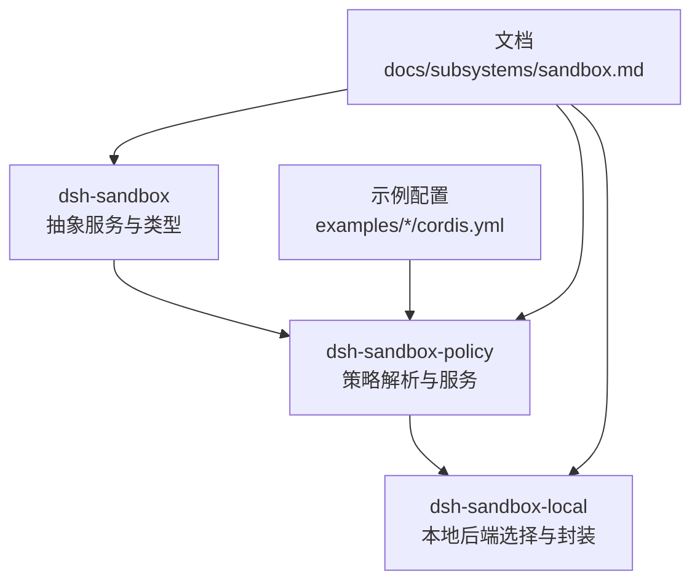
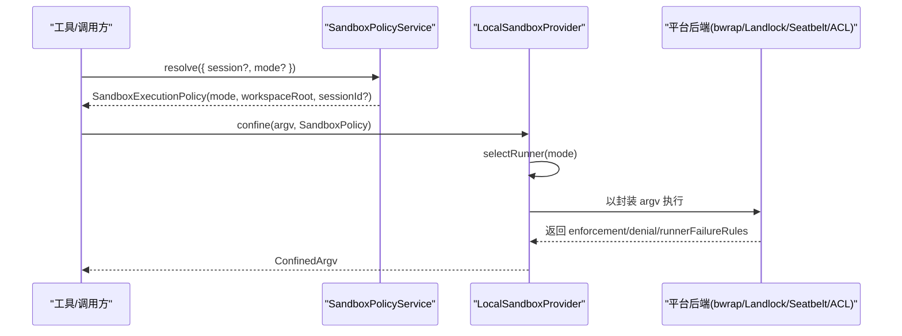
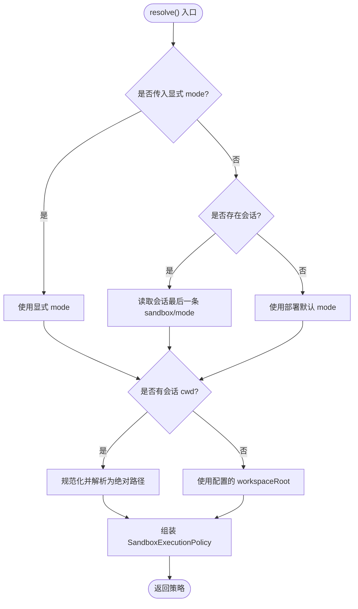
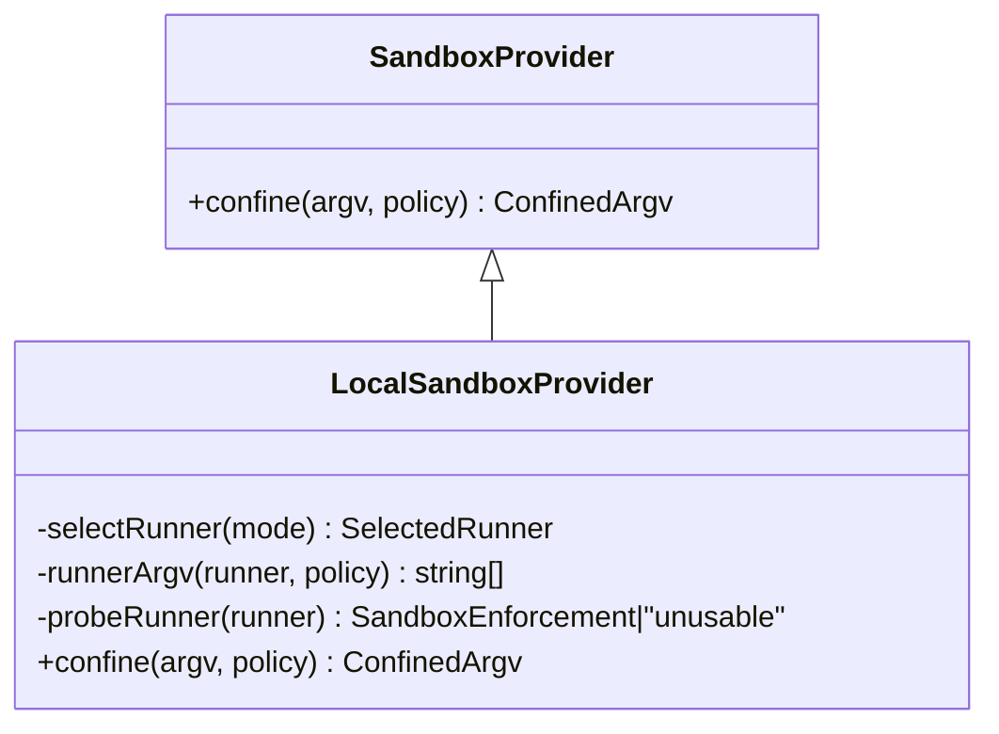
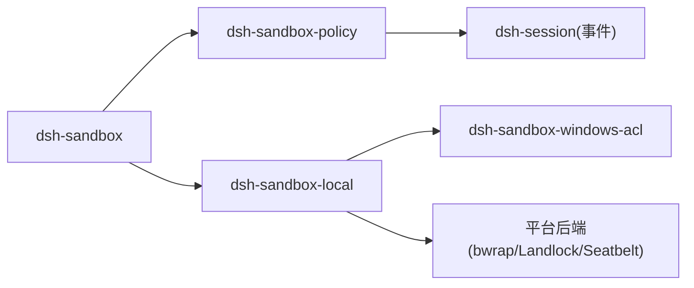

# 沙箱配置与策略

<cite>
**本文引用的文件**
- [packages/sandbox/sandbox/src/index.ts](file://packages/sandbox/sandbox/src/index.ts)
- [packages/sandbox/sandbox-policy/src/index.ts](file://packages/sandbox/sandbox-policy/src/index.ts)
- [packages/sandbox/sandbox-policy/src/session-mode.ts](file://packages/sandbox/sandbox-policy/src/session-mode.ts)
- [packages/sandbox/sandbox-local/src/index.ts](file://packages/sandbox/sandbox-local/src/index.ts)
- [docs/subsystems/sandbox.md](file://docs/subsystems/sandbox.md)
- [examples/acp-agent/cordis.yml](file://examples/acp-agent/cordis.yml)
- [examples/headless-agent/e2b.cordis.yml](file://examples/headless-agent/e2b.cordis.yml)
- [apps/cli/config/agent-presets/code/agent.cordis.yml](file://apps/cli/config/agent-presets/code/agent.cordis.yml)
- [packages/sandbox/sandbox-policy/tests/policy.spec.ts](file://packages/sandbox/sandbox-policy/tests/policy.spec.ts)
- [packages/sandbox/sandbox-policy/tests/invariant.spec.ts](file://packages/sandbox/sandbox-policy/tests/invariant.spec.ts)
</cite>

## 目录
1. [简介](#简介)
2. [项目结构](#项目结构)
3. [核心组件](#核心组件)
4. [架构总览](#架构总览)
5. [详细组件分析](#详细组件分析)
6. [依赖关系分析](#依赖关系分析)
7. [性能考量](#性能考量)
8. [故障排查指南](#故障排查指南)
9. [结论](#结论)
10. [附录](#附录)

## 简介
本文件聚焦 DeepSeek Harness 的“进程沙箱”能力，围绕 SandboxPolicy 与 SandboxExecutionPolicy 的设计、per-call policy 解析与优先级、workspaceRoot 计算与会话边界管理、不同环境的配置示例、热重载与动态调整能力，以及配置验证与错误处理进行系统化说明。目标是帮助读者在不深入源码的情况下，也能正确理解并安全地配置沙箱策略。

## 项目结构
沙箱相关代码主要分布在以下包：
- dsh-sandbox：定义抽象服务、模式、执行策略与错误类型
- dsh-sandbox-policy：提供部署默认值、会话覆盖、工作区根解析与上下文注入
- dsh-sandbox-local：平台后端选择（Linux bwrap/Landlock、macOS Seatbelt、Windows ACL），功能探测与封装 argv 生成
- 文档与示例：docs/subsystems/sandbox.md 与 examples/* 中的 cordis.yml 展示典型配置

图表来源
- [packages/sandbox/sandbox/src/index.ts:1-179](file://packages/sandbox/sandbox/src/index.ts#L1-L179)
- [packages/sandbox/sandbox-policy/src/index.ts:1-155](file://packages/sandbox/sandbox-policy/src/index.ts#L1-L155)
- [packages/sandbox/sandbox-local/src/index.ts:1-568](file://packages/sandbox/sandbox-local/src/index.ts#L1-L568)
- [docs/subsystems/sandbox.md:1-219](file://docs/subsystems/sandbox.md#L1-L219)
- [examples/acp-agent/cordis.yml:1-193](file://examples/acp-agent/cordis.yml#L1-L193)

章节来源
- [docs/subsystems/sandbox.md:1-219](file://docs/subsystems/sandbox.md#L1-L219)

## 核心组件
- SandboxMode：文件影响模式，包含 read-only、workspace-write、danger-full-access。仅前两种可发送给后端；danger-full-access 由消费者直接绕过沙箱执行。
- SandboxExecutionPolicy：一次能力调用的完整策略，包含 mode、workspaceRoot，以及在有会话时携带 sessionId。
- SandboxPolicy：受限模式的执行策略（不含 danger-full-access），用于传给后端 confine。
- RunnerFailureRule / ConfinedArgv：后端返回的封装 argv、执行完整性、拒绝特征与运行器失败规则，供上层区分“命令未执行”和“被沙箱拒绝”。
- SandboxProvider：抽象服务，confine(argv, policy) 必须返回受约束的 argv 或关闭失败，禁止静默放行。
- SandboxPolicyService：策略服务，负责部署默认、会话覆盖、workspaceRoot 解析，并将策略注入系统提示上下文。

章节来源
- [packages/sandbox/sandbox/src/index.ts:23-176](file://packages/sandbox/sandbox/src/index.ts#L23-L176)
- [packages/sandbox/sandbox-policy/src/index.ts:60-152](file://packages/sandbox/sandbox-policy/src/index.ts#L60-L152)
- [docs/subsystems/sandbox.md:41-156](file://docs/subsystems/sandbox.md#L41-L156)

## 架构总览
下图展示了 per-call 策略解析到后端执行的端到端流程：

图表来源
- [packages/sandbox/sandbox-policy/src/index.ts:126-142](file://packages/sandbox/sandbox-policy/src/index.ts#L126-L142)
- [packages/sandbox/sandbox-local/src/index.ts:316-333](file://packages/sandbox/sandbox-local/src/index.ts#L316-L333)
- [packages/sandbox/sandbox-local/src/index.ts:492-539](file://packages/sandbox/sandbox-local/src/index.ts#L492-L539)

## 详细组件分析

### SandboxPolicyService：策略解析与优先级
- 职责：维护部署默认 mode 与 fallback workspaceRoot；为每次能力调用解析出完整的 SandboxExecutionPolicy；将当前策略文本注入系统提示上下文。
- 优先级规则（从高到低）：
  1) 显式传入的 approved mode（请求级覆盖）
  2) 会话日志中最后一次 sandbox/mode 事件（会话级覆盖）
  3) 部署默认 mode
- workspaceRoot 计算：优先使用会话不可变 cwd；若无会话或无 cwd，则回退到配置的 workspaceRoot；最终通过文件系统语义规范化路径后再做词法归一化，确保 symlink/.. 等语义正确识别实际工作目录。
- 会话边界：当存在 sessionId 时，后端可按会话隔离状态（例如 Windows ACL 的临时目录与 SID）。

图表来源
- [packages/sandbox/sandbox-policy/src/index.ts:126-142](file://packages/sandbox/sandbox-policy/src/index.ts#L126-L142)
- [packages/sandbox/sandbox-policy/src/index.ts:32-35](file://packages/sandbox/sandbox-policy/src/index.ts#L32-L35)

章节来源
- [packages/sandbox/sandbox-policy/src/index.ts:60-152](file://packages/sandbox/sandbox-policy/src/index.ts#L60-L152)
- [packages/sandbox/sandbox-policy/src/session-mode.ts:1-72](file://packages/sandbox/sandbox-policy/src/session-mode.ts#L1-L72)
- [docs/subsystems/sandbox.md:41-94](file://docs/subsystems/sandbox.md#L41-L94)

### LocalSandboxProvider：后端选择与封装 argv
- 平台链：Linux 优先 bwrap，其次 Landlock；macOS 使用 Seatbelt；Windows 使用 ACL restricted-token runner。
- 功能探测：对多候选链进行一次功能性探测，缓存结果；单候选直接选择。
- 封装 argv：根据所选 runner 拼接 profile 参数，附加分隔符与被包装的原始 argv。
- 执行完整性与诊断：
  - enforcement：full 或 partial（如 Windows ACL 因 Everyone/hard-link 限制只能 partial）
  - denialSignatures：各后端特有的拒绝 stderr 片段
  - runnerFailureRules：结构化规则，先判断运行器是否在命令执行前失败

图表来源
- [packages/sandbox/sandbox/src/index.ts:152-176](file://packages/sandbox/sandbox/src/index.ts#L152-L176)
- [packages/sandbox/sandbox-local/src/index.ts:250-333](file://packages/sandbox/sandbox-local/src/index.ts#L250-L333)
- [packages/sandbox/sandbox-local/src/index.ts:492-539](file://packages/sandbox/sandbox-local/src/index.ts#L492-L539)

章节来源
- [packages/sandbox/sandbox-local/src/index.ts:1-568](file://packages/sandbox/sandbox-local/src/index.ts#L1-L568)
- [docs/subsystems/sandbox.md:96-156](file://docs/subsystems/sandbox.md#L96-L156)

### Per-call Policy 解析与优先级规则
- 输入：SandboxPolicyRequest{ session?, mode? }
- 输出：SandboxExecutionPolicy{ mode, workspaceRoot, sessionId? }
- 优先级：显式 mode > 会话覆盖 > 部署默认
- workspaceRoot：会话 cwd 优先，否则回退到配置的 workspaceRoot；路径规范化保证语义正确
- 会话边界：sessionId 仅在存在会话时携带，便于后端按会话隔离资源

章节来源
- [packages/sandbox/sandbox-policy/src/index.ts:77-142](file://packages/sandbox/sandbox-policy/src/index.ts#L77-L142)
- [docs/subsystems/sandbox.md:41-94](file://docs/subsystems/sandbox.md#L41-L94)

### workspaceRoot 计算与会话边界管理
- 计算顺序：session.header.cwd → 配置的 workspaceRoot → 规范化为绝对路径
- 语义规范：先 canonicalPath（文件系统语义），再 resolve（词法归一化），确保 symlink/.. 等场景定位到真实目录
- 会话边界：后端可利用 sessionId 为每个会话分配私有临时目录与能力（如 Windows ACL 的 tempWriteSid），避免跨会话污染

章节来源
- [packages/sandbox/sandbox-policy/src/index.ts:32-35](file://packages/sandbox/sandbox-policy/src/index.ts#L32-L35)
- [packages/sandbox/sandbox-policy/src/index.ts:135-142](file://packages/sandbox/sandbox-policy/src/index.ts#L135-L142)
- [packages/sandbox/sandbox-local/src/index.ts:346-377](file://packages/sandbox/sandbox-local/src/index.ts#L346-L377)

### 不同场景下的沙箱配置示例
- 开发环境（推荐 workspace-write，允许在工作区内写入，同时保留沙箱保护）
  - 参考：[examples/acp-agent/cordis.yml:27-31](file://examples/acp-agent/cordis.yml#L27-L31)
  - 要点：mode 可通过环境变量切换；workspaceRoot 指向当前工作目录
- 测试/快照环境（倾向 danger-full-access，使场景稳定且与后端无关）
  - 参考：[examples/acp-agent/cordis.yml:18-31](file://examples/acp-agent/cordis.yml#L18-L31)
  - 要点：在快照模式下放宽限制，避免 runner 差异导致的不稳定
- 远程/容器环境（E2B 等）
  - 参考：[examples/headless-agent/e2b.cordis.yml:21-35](file://examples/headless-agent/e2b.cordis.yml#L21-L35)
  - 要点：保持 e2b.cwd、sandbox-policy.workspaceRoot、bash 默认 workdir 三者一致，避免远程路径不一致导致的失败

章节来源
- [examples/acp-agent/cordis.yml:18-31](file://examples/acp-agent/cordis.yml#L18-L31)
- [examples/headless-agent/e2b.cordis.yml:1-58](file://examples/headless-agent/e2b.cordis.yml#L1-L58)

### 沙箱策略的热重载与动态调整
- 运行时切换：通过向会话追加 sandbox/mode 事件实现动态调整；下一次受限调用即生效
- 持久性与回放：事件属于会话日志的一部分，重启后可通过回放恢复最新覆盖
- 热重载保障：Cordis Loader 的配置更新具备事务性，失败会回滚并广播 hmr/config-update-failed 事件，不会中断正在运行的应用
- 注意：策略本身不持有外部状态，所有变更通过事件与配置项完成，天然支持热重载

章节来源
- [packages/sandbox/sandbox-policy/src/session-mode.ts:1-72](file://packages/sandbox/sandbox-policy/src/session-mode.ts#L1-L72)
- [.agents/notes/implemented/bug-fix/2026-07-20-config-hot-reload-resilience.zh.md:1-21](file://.agents/notes/implemented/bug-fix/2026-07-20-config-hot-reload-resilience.zh.md#L1-L21)

### 配置验证与错误处理
- 配置校验：SandboxPolicyService.Config 使用 schema 校验 mode 与 workspaceRoot；未知模式会被拒绝
- 不变量检查：若会话日志中存在未知模式，会在注册不变量检测时抛出 INVARIANT 错误
- 后端不可用：当没有可用的后端时，confine 抛出 SANDBOX_UNAVAILABLE 错误，禁止静默放行
- 运行器失败 vs 拒绝：
  - 运行器失败：命令未执行（需匹配 fatal signatures 与 exit code gate）
  - 拒绝：命令已执行但被沙箱阻止（匹配 denial signatures）

章节来源
- [packages/sandbox/sandbox-policy/src/index.ts:91-98](file://packages/sandbox/sandbox-policy/src/index.ts#L91-L98)
- [packages/sandbox/sandbox-policy/tests/invariant.spec.ts:36-53](file://packages/sandbox/sandbox-policy/tests/invariant.spec.ts#L36-L53)
- [packages/sandbox/sandbox/src/index.ts:118-144](file://packages/sandbox/sandbox/src/index.ts#L118-L144)
- [packages/sandbox/sandbox-local/src/index.ts:215-240](file://packages/sandbox/sandbox-local/src/index.ts#L215-L240)

## 依赖关系分析
- 模块耦合：
  - dsh-sandbox 提供抽象与类型，被 policy 与 local 共同依赖
  - dsh-sandbox-policy 依赖 session 事件模型与 schemastery 校验
  - dsh-sandbox-local 依赖平台工具（bwrap/landlock-run/sandbox-exec）与 Windows ACL 子包
- 外部集成点：
  - 平台二进制/内核能力（Landlock ABI、Seatbelt、ACL）
  - Cordis 生命周期与 HMR 机制（配置热重载）
- 循环依赖：未发现循环依赖；分层清晰（抽象→策略→后端）

图表来源
- [packages/sandbox/sandbox/src/index.ts:1-179](file://packages/sandbox/sandbox/src/index.ts#L1-L179)
- [packages/sandbox/sandbox-policy/src/index.ts:1-155](file://packages/sandbox/sandbox-policy/src/index.ts#L1-L155)
- [packages/sandbox/sandbox-local/src/index.ts:1-568](file://packages/sandbox/sandbox-local/src/index.ts#L1-L568)

章节来源
- [packages/sandbox/sandbox/src/index.ts:1-179](file://packages/sandbox/sandbox/src/index.ts#L1-L179)
- [packages/sandbox/sandbox-policy/src/index.ts:1-155](file://packages/sandbox/sandbox-policy/src/index.ts#L1-L155)
- [packages/sandbox/sandbox-local/src/index.ts:1-568](file://packages/sandbox/sandbox-local/src/index.ts#L1-L568)

## 性能考量
- 策略解析：每次调用 resolve 仅读取会话事件与 cwd，复杂度低；workspaceRoot 规范化为 O(n) 路径操作
- 后端选择：首次探测后缓存结果，后续 confine 直接复用，避免重复 spawn
- 资源清理：Windows ACL 的临时目录与 SID 在 provider dispose 时统一回收，避免泄漏
- 建议：
  - 合理设置 probeTimeoutMs，避免过长阻塞
  - 在生产环境启用 full enforcement 的后端（如 bwrap/Landlock），减少 partial 风险

## 故障排查指南
- 现象：confine 抛出 SANDBOX_UNAVAILABLE
  - 原因：当前主机无可用的后端（缺少 bwrap/sandbox-exec/landlock 或 Windows ACL runner 无法启动）
  - 处理：安装对应后端或切换到 danger-full-access（仅限受控环境）
- 现象：命令失败但非权限问题
  - 排查：检查 runnerFailureRules 与 allowedExitCodes，确认是否为运行器失败而非命令失败
- 现象：策略未按预期生效
  - 排查：确认会话是否已追加 sandbox/mode 事件；检查 resolve 的优先级（显式 > 会话 > 部署默认）
- 现象：workspaceRoot 与实际不符
  - 排查：确认 session.header.cwd 是否正确；必要时显式配置 workspaceRoot 并确保路径规范化

章节来源
- [packages/sandbox/sandbox/src/index.ts:118-144](file://packages/sandbox/sandbox/src/index.ts#L118-L144)
- [packages/sandbox/sandbox-local/src/index.ts:215-240](file://packages/sandbox/sandbox-local/src/index.ts#L215-L240)
- [packages/sandbox/sandbox-policy/tests/policy.spec.ts:63-85](file://packages/sandbox/sandbox-policy/tests/policy.spec.ts#L63-L85)

## 结论
DeepSeek Harness 的沙箱体系通过清晰的策略层与后端抽象，实现了跨平台的进程隔离与可控的文件访问。SandboxPolicyService 提供稳定的 per-call 策略解析与优先级控制，LocalSandboxProvider 负责平台适配与健壮的错误分类。结合事件驱动的会话覆盖与 Cordis 的热重载机制，可在开发、测试与生产环境中灵活、安全地调整沙箱策略。

## 附录
- 最佳实践速查
  - 开发：默认 workspace-write，配合 approval ask，便于调试
  - 测试：快照模式使用 danger-full-access，提升稳定性
  - 生产：尽可能使用 full enforcement 后端，严格 read-only 或受限 workspace-write
  - 远程：确保 e2b.cwd、workspaceRoot、bash 默认 workdir 一致
- 常用配置位置
  - 示例：examples/acp-agent/cordis.yml
  - 预设：apps/cli/config/agent-presets/*/agent.cordis.yml
  - 远程：examples/headless-agent/e2b.cordis.yml