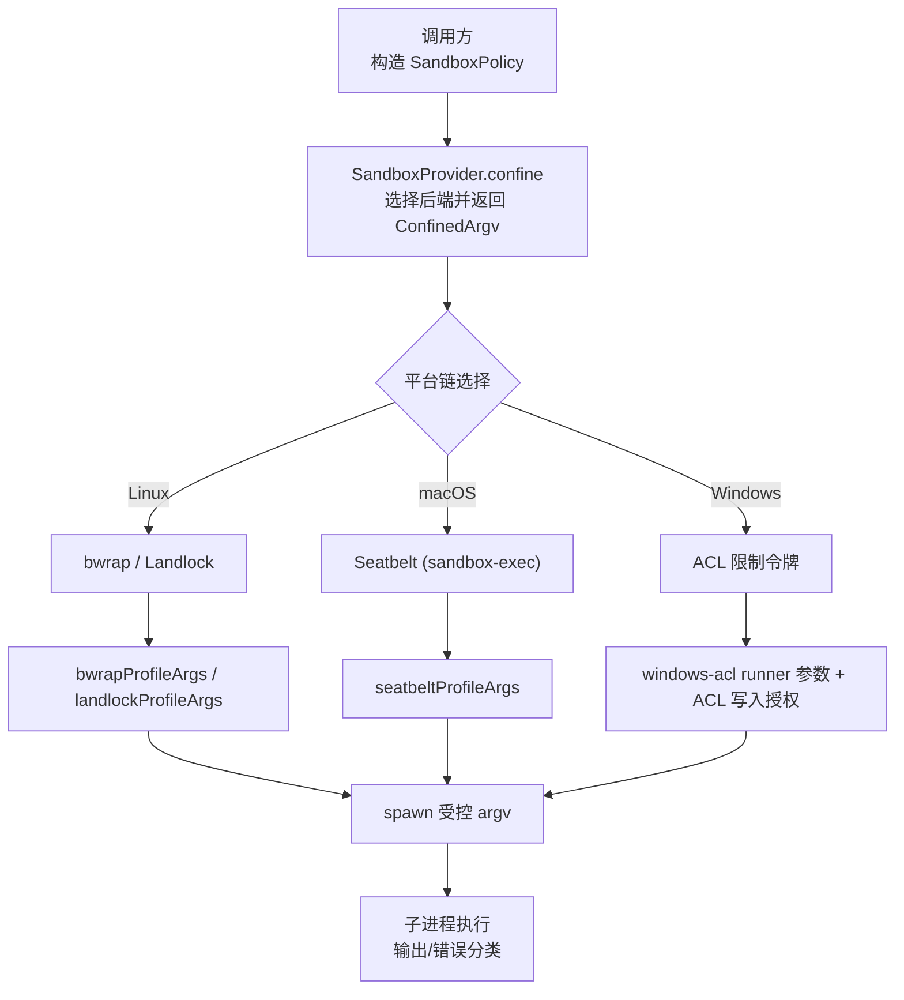
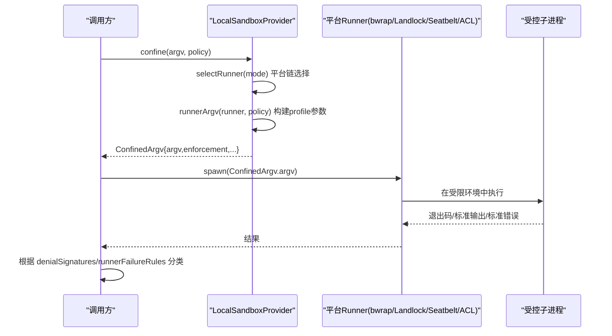
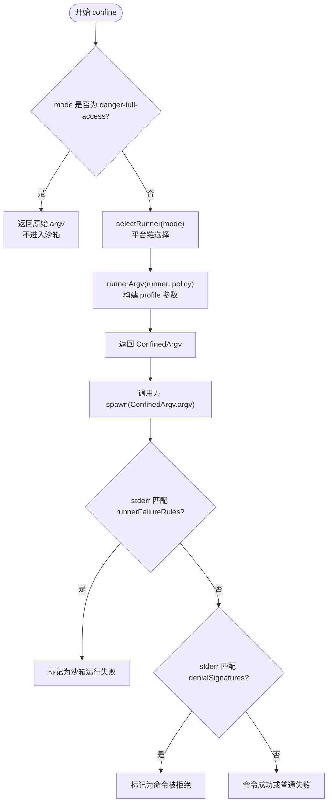
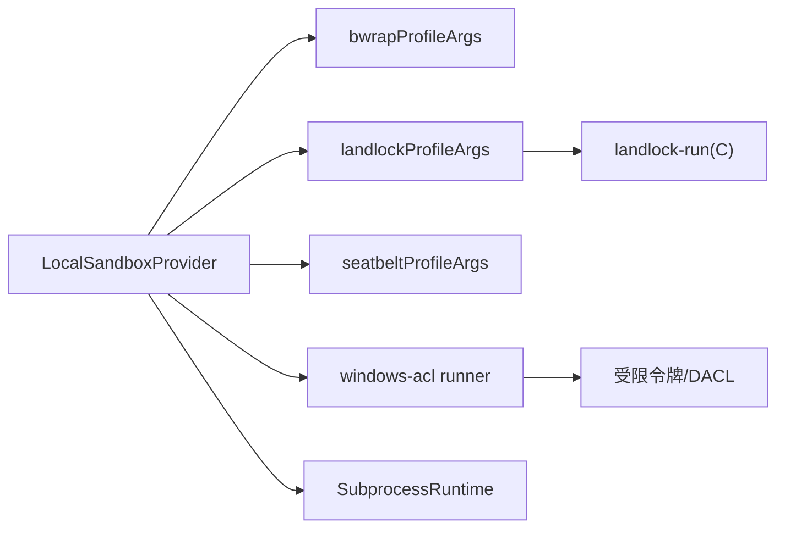

# 进程隔离机制

<cite>
**本文引用的文件**
- [packages/sandbox/sandbox/src/index.ts](file://packages/sandbox/sandbox/src/index.ts)
- [packages/sandbox/sandbox-policy/src/session-mode.ts](file://packages/sandbox/sandbox-policy/src/session-mode.ts)
- [packages/sandbox/sandbox-local/src/index.ts](file://packages/sandbox/sandbox-local/src/index.ts)
- [packages/sandbox/sandbox-local/src/profiles.ts](file://packages/sandbox/sandbox-local/src/profiles.ts)
- [native/landlock-run/packages/entry/src/main.c](file://native/landlock-run/packages/entry/src/main.c)
- [packages/subprocess/subprocess-local/src/index.ts](file://packages/subprocess/subprocess-local/src/index.ts)
- [packages/sandbox/sandbox/tests/vocabulary.spec.ts](file://packages/sandbox/sandbox/tests/vocabulary.spec.ts)
</cite>

## 目录
1. [简介](#简介)
2. [项目结构](#项目结构)
3. [核心组件](#核心组件)
4. [架构总览](#架构总览)
5. [详细组件分析](#详细组件分析)
6. [依赖关系分析](#依赖关系分析)
7. [性能考量](#性能考量)
8. [故障排除指南](#故障排除指南)
9. [结论](#结论)
10. [附录：配置示例与最佳实践](#附录：配置示例与最佳实践)

## 简介
本文件系统性说明 DeepSeek Harness 的进程隔离机制，覆盖 Linux、macOS、Windows 三大平台的实现原理（Landlock、Seatbelt、ACL 限制令牌），详解 SandboxMode 三种模式（read-only、workspace-write、danger-full-access）的工作机制与适用场景，解释 ConfinedArgv 的生成过程与执行策略，并提供配置示例与故障排除建议，帮助开发者安全、正确地使用进程隔离能力。

## 项目结构
与进程隔离相关的关键代码分布在以下模块：
- 沙箱服务抽象与类型定义：packages/sandbox/sandbox/src/index.ts
- 会话级沙箱模式策略：packages/sandbox/sandbox-policy/src/session-mode.ts
- 本地平台后端选择与封装：packages/sandbox/sandbox-local/src/index.ts
- 各平台 Profile 参数构建：packages/sandbox/sandbox-local/src/profiles.ts
- Linux Landlock 原生启动器：native/landlock-run/packages/entry/src/main.c
- 子进程执行与可执行文件解析：packages/subprocess/subprocess-local/src/index.ts

图表来源
- [packages/sandbox/sandbox/src/index.ts:90-116](file://packages/sandbox/sandbox/src/index.ts#L90-L116)
- [packages/sandbox/sandbox-local/src/index.ts:159-187](file://packages/sandbox/sandbox-local/src/index.ts#L159-L187)
- [packages/sandbox/sandbox-local/src/profiles.ts:16-58](file://packages/sandbox/sandbox-local/src/profiles.ts#L16-L58)

章节来源
- [packages/sandbox/sandbox/src/index.ts:23-72](file://packages/sandbox/sandbox/src/index.ts#L23-L72)
- [packages/sandbox/sandbox-local/src/index.ts:159-187](file://packages/sandbox/sandbox-local/src/index.ts#L159-L187)

## 核心组件
- SandboxMode 与 ConfinedSandboxMode：定义受限模式集合，danger-full-access 不进入沙箱。
- SandboxPolicy/SandboxExecutionPolicy：携带 mode、workspaceRoot、sessionId，决定一次调用的文件访问边界。
- ConfinedArgv：封装后的 argv、enforcement（full/partial）、denialSignatures、runnerFailureRules，供上层判断“命令被拒绝”还是“沙箱运行失败”。
- LocalSandboxProvider：按平台选择 runner 链，进行功能探测，返回 ConfinedArgv；对 Windows 管理 ACL 写入授权。
- Profiles：为 bwrap/Landlock/Seatbelt 生成具体 profile 参数。
- Landlock 启动器：C 程序，创建规则集并 exec 目标命令，报告 ABI 级别是否完全受控。
- Subprocess 执行：统一解析可执行文件、跨平台环境处理、PTY 分配等。

章节来源
- [packages/sandbox/sandbox/src/index.ts:23-72](file://packages/sandbox/sandbox/src/index.ts#L23-L72)
- [packages/sandbox/sandbox/src/index.ts:90-116](file://packages/sandbox/sandbox/src/index.ts#L90-L116)
- [packages/sandbox/sandbox-local/src/index.ts:250-333](file://packages/sandbox/sandbox-local/src/index.ts#L250-L333)
- [packages/sandbox/sandbox-local/src/profiles.ts:16-58](file://packages/sandbox/sandbox-local/src/profiles.ts#L16-L58)
- [native/landlock-run/packages/entry/src/main.c:220-299](file://native/landlock-run/packages/entry/src/main.c#L220-L299)
- [packages/subprocess/subprocess-local/src/index.ts:104-135](file://packages/subprocess/subprocess-local/src/index.ts#L104-L135)

## 架构总览
下图展示从调用方到最终执行的完整流程，包括平台选择、profile 构建、执行与错误分类。

图表来源
- [packages/sandbox/sandbox-local/src/index.ts:316-344](file://packages/sandbox/sandbox-local/src/index.ts#L316-L344)
- [packages/sandbox/sandbox-local/src/index.ts:492-539](file://packages/sandbox/sandbox-local/src/index.ts#L492-L539)
- [packages/sandbox/sandbox/src/index.ts:90-116](file://packages/sandbox/sandbox/src/index.ts#L90-L116)

## 详细组件分析

### 平台链与后端选择
- Linux：优先尝试 bwrap（基于命名空间/挂载的强隔离），不可用时回退到 Landlock（内核级系统调用白名单）。
- macOS：使用 Seatbelt（sandbox-exec + SBPL 策略）。
- Windows：使用 ACL 限制令牌（restricted token）+ DACL 写入授权。
- 选择策略：单候选直接选用；多候选通过功能探测择优；全部不可用则 fail-closed，抛出不可用错误。

章节来源
- [packages/sandbox/sandbox-local/src/index.ts:159-187](file://packages/sandbox/sandbox-local/src/index.ts#L159-L187)
- [packages/sandbox/sandbox-local/src/index.ts:492-539](file://packages/sandbox/sandbox-local/src/index.ts#L492-L539)

### bwrap（Linux）
- 行为：将根文件系统以只读方式绑定，提供独立的 /dev、/proc，必要时挂载临时 /tmp，并将 workspaceRoot 以读写方式绑定。
- 优势：接近“模式词汇表”语义，适合 read-only 与 workspace-write。
- 探测：执行一次最小化 bwrap 命令验证可用性。

章节来源
- [packages/sandbox/sandbox-local/src/profiles.ts:16-23](file://packages/sandbox/sandbox-local/src/profiles.ts#L16-L23)
- [packages/sandbox/sandbox-local/src/index.ts:67-74](file://packages/sandbox/sandbox-local/src/index.ts#L67-L74)

### Landlock（Linux）
- 行为：通过原生 C 启动器创建规则集，授予 --ro/--rw 路径的访问权限，设置 no_new_privs，restrict_self 后 exec 目标命令。
- ABI 协商：根据内核支持的 ABI 级别动态裁剪允许的能力集，若仅部分支持则报告 partial enforcement。
- 探测：以最大规则集实际施加限制来判定是否可用。

章节来源
- [native/landlock-run/packages/entry/src/main.c:220-299](file://native/landlock-run/packages/entry/src/main.c#L220-L299)
- [packages/sandbox/sandbox-local/src/profiles.ts:25-36](file://packages/sandbox/sandbox-local/src/profiles.ts#L25-L36)
- [packages/sandbox/sandbox-local/src/index.ts:524-527](file://packages/sandbox/sandbox-local/src/index.ts#L524-L527)

### Seatbelt（macOS）
- 行为：通过 sandbox-exec 加载 SBPL 策略，默认 deny file-write*，显式允许 /dev/null，并在 workspace-write 模式下追加工作区写权限。
- 探测：以 read-only 策略执行 true 命令验证内核接受并生效。

章节来源
- [packages/sandbox/sandbox-local/src/profiles.ts:38-58](file://packages/sandbox/sandbox-local/src/profiles.ts#L38-L58)
- [packages/sandbox/sandbox-local/src/index.ts:76-91](file://packages/sandbox/sandbox-local/src/index.ts#L76-L91)

### Windows ACL 限制令牌
- 行为：创建受限令牌（restricted token），结合 DACL 授予工作区与临时目录的写入能力；每个会话拥有随机私有临时目录与独立 SID，避免跨会话泄漏。
- 限制：由于初始化需要 Everyone 写入权限以及 NTFS 硬链接可能绕过，因此声明为 partial enforcement。
- 探测：以 read-only 模式执行 cmd /c exit 0 验证受限令牌可正常创建并执行。

章节来源
- [packages/sandbox/sandbox-local/src/index.ts:346-377](file://packages/sandbox/sandbox-local/src/index.ts#L346-L377)
- [packages/sandbox/sandbox-local/src/index.ts:392-443](file://packages/sandbox/sandbox-local/src/index.ts#L392-L443)
- [packages/sandbox/sandbox-local/src/index.ts:100-112](file://packages/sandbox/sandbox-local/src/index.ts#L100-L112)

### SandboxMode 工作机制与适用场景
- read-only：仅允许读取必要资源（如 /dev/null），禁止一切写入。适用于不需要持久化的工具执行、只读扫描等。
- workspace-write：在工作区根与后端定义的临时区域允许写入。适用于需要落盘但范围受限的任务。
- danger-full-access：不进入沙箱，直接执行原始 argv。用于调试或明确需要全权限的场景，默认不应在生产使用。

章节来源
- [packages/sandbox/sandbox/src/index.ts:23-32](file://packages/sandbox/sandbox/src/index.ts#L23-L32)
- [packages/sandbox/sandbox-policy/src/session-mode.ts:41-72](file://packages/sandbox/sandbox-policy/src/session-mode.ts#L41-L72)

### ConfinedArgv 生成与执行策略
- 生成：confine(argv, policy) 根据所选 runner 与 policy 构建 argv，附带 enforcement、denialSignatures、runnerFailureRules。
- 执行：调用方替换自身 argv 为 ConfinedArgv.argv 进行 spawn；子进程在受限环境中运行。
- 错误分类：先检查 runnerFailureRules 判断“沙箱运行失败”，再匹配 denialSignatures 判断“命令被拒绝”。

图表来源
- [packages/sandbox/sandbox-local/src/index.ts:316-344](file://packages/sandbox/sandbox-local/src/index.ts#L316-L344)
- [packages/sandbox/sandbox/src/index.ts:90-116](file://packages/sandbox/sandbox/src/index.ts#L90-L116)

章节来源
- [packages/sandbox/sandbox/src/index.ts:90-116](file://packages/sandbox/sandbox/src/index.ts#L90-L116)
- [packages/sandbox/sandbox-local/src/index.ts:316-344](file://packages/sandbox/sandbox-local/src/index.ts#L316-L344)

### 子进程执行与环境
- 可执行文件解析：要求绝对路径或 PATH 中的裸名；Windows 下大小写不敏感的环境键处理；相对路径会被拒绝。
- PTY：按需分配伪终端，注入平台特定的进程检查器。

章节来源
- [packages/subprocess/subprocess-local/src/index.ts:104-135](file://packages/subprocess/subprocess-local/src/index.ts#L104-L135)
- [packages/subprocess/subprocess-local/src/index.ts:159-185](file://packages/subprocess/subprocess-local/src/index.ts#L159-L185)

## 依赖关系分析
- LocalSandboxProvider 依赖 platform chain 与 profiles 构建器，以及可选的 native landlock 启动器。
- Landlock 启动器依赖内核 Landlock 系统调用，负责规则集创建与 self-restrict。
- Windows ACL 后端依赖系统 API 创建受限令牌与 DACL 写入授权。
- 子进程运行时负责跨平台可执行文件解析与 PTY 管理。

图表来源
- [packages/sandbox/sandbox-local/src/index.ts:335-344](file://packages/sandbox/sandbox-local/src/index.ts#L335-L344)
- [packages/sandbox/sandbox-local/src/profiles.ts:16-58](file://packages/sandbox/sandbox-local/src/profiles.ts#L16-L58)
- [native/landlock-run/packages/entry/src/main.c:220-299](file://native/landlock-run/packages/entry/src/main.c#L220-L299)
- [packages/subprocess/subprocess-local/src/index.ts:104-135](file://packages/subprocess/subprocess-local/src/index.ts#L104-L135)

章节来源
- [packages/sandbox/sandbox-local/src/index.ts:335-344](file://packages/sandbox/sandbox-local/src/index.ts#L335-L344)
- [packages/sandbox/sandbox-local/src/profiles.ts:16-58](file://packages/sandbox/sandbox-local/src/profiles.ts#L16-L58)

## 性能考量
- 探测开销：首次选择 runner 时会进行一次轻量功能探测（超时控制），后续缓存结果。
- bwrap 临时 /tmp：workspace-write 时 bwrap 会挂载新的 tmpfs，隔离宿主 /tmp，避免跨进程污染。
- Landlock ABI 差异：旧 ABI 下部分能力不受控，但仍保持最小权限原则；报告 partial enforcement 以便上层决策。
- Windows ACL：每会话私有临时目录与 SID 增加少量系统调用开销，但提升隔离强度。

[本节为通用指导，无需特定文件引用]

## 故障排除指南
- 沙箱不可用：当平台无可用后端时，confine 会抛出结构化错误（包含 SANDBOX_UNAVAILABLE），提示安装必要组件或切换到 danger-full-access。
- 命令被拒绝：根据 ConfinedArgv.denialSignatures 匹配 stderr 内容，区分“命令被拒绝”和“沙箱运行失败”。
- 运行器失败：依据 runnerFailureRules 的 allowedExitCodes、fatalSignatures、informationalLines 判断 runner 侧失败（例如 landlock-run 版本/ABI 问题、bwrap 配置错误、sandbox-exec 拒绝策略）。
- Windows 权限问题：确认受限令牌创建成功、DACL 写入授权已应用；清理失败的临时目录与 SID。

章节来源
- [packages/sandbox/sandbox/tests/vocabulary.spec.ts:12-35](file://packages/sandbox/sandbox/tests/vocabulary.spec.ts#L12-L35)
- [packages/sandbox/sandbox/src/index.ts:118-144](file://packages/sandbox/sandbox/src/index.ts#L118-L144)
- [packages/sandbox/sandbox-local/src/index.ts:200-240](file://packages/sandbox/sandbox-local/src/index.ts#L200-L240)

## 结论
DeepSeek Harness 通过统一的沙箱抽象与平台适配层，实现了跨 Linux/macOS/Windows 的进程隔离。其核心在于：
- 明确的模式词汇表（read-only、workspace-write、danger-full-access）
- 平台链选择与功能探测，确保 fail-closed
- 标准化的 ConfinedArgv 与错误分类，便于上层可靠处理
- 对 Landlock、Seatbelt、ACL 限制令牌的深度集成，兼顾安全性与兼容性

## 附录：配置示例与最佳实践
- 基本用法
  - 在调用前构造 SandboxPolicy（mode、workspaceRoot、可选 sessionId），调用 ctx.sandbox.confine(argv, policy)，获取 ConfinedArgv 后替换 argv 进行 spawn。
- 模式选择建议
  - 默认使用 read-only；仅在确需落盘时使用 workspace-write；尽量避免 danger-full-access。
- 平台注意事项
  - Linux：优先安装 bwrap；若无，则依赖 Landlock 内核支持。
  - macOS：确保 sandbox-exec 可用。
  - Windows：确保受限令牌与 ACL 操作可用；注意 partial enforcement 的限制。
- 错误处理
  - 捕获 SandboxUnavailableError，记录 runnerFailureRules 信息，必要时降级或提示用户安装依赖。
- 审计与日志
  - 通过会话事件记录模式切换（sandbox/mode），保证可回放与可审计。

章节来源
- [packages/sandbox/sandbox-policy/src/session-mode.ts:41-72](file://packages/sandbox/sandbox-policy/src/session-mode.ts#L41-L72)
- [packages/sandbox/sandbox/src/index.ts:118-144](file://packages/sandbox/sandbox/src/index.ts#L118-L144)
- [packages/sandbox/sandbox-local/src/index.ts:492-539](file://packages/sandbox/sandbox-local/src/index.ts#L492-L539)