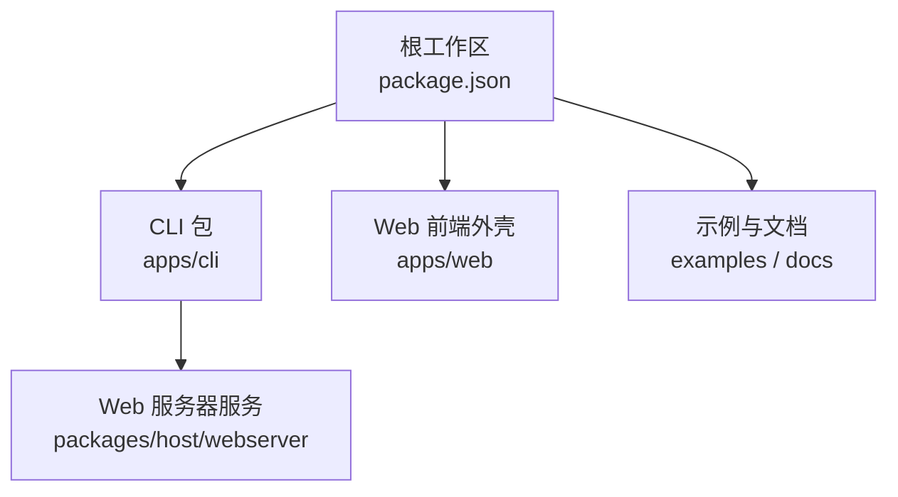
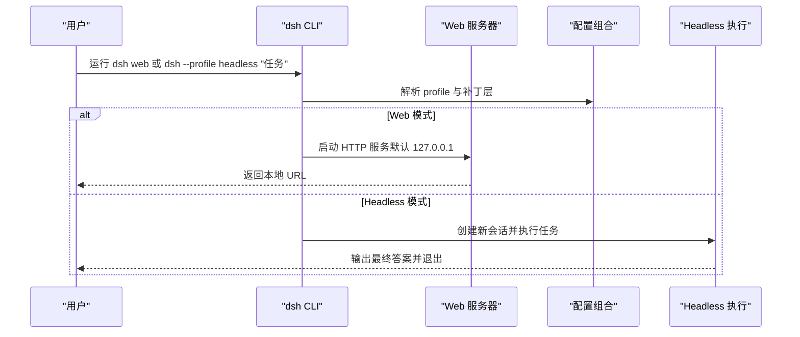
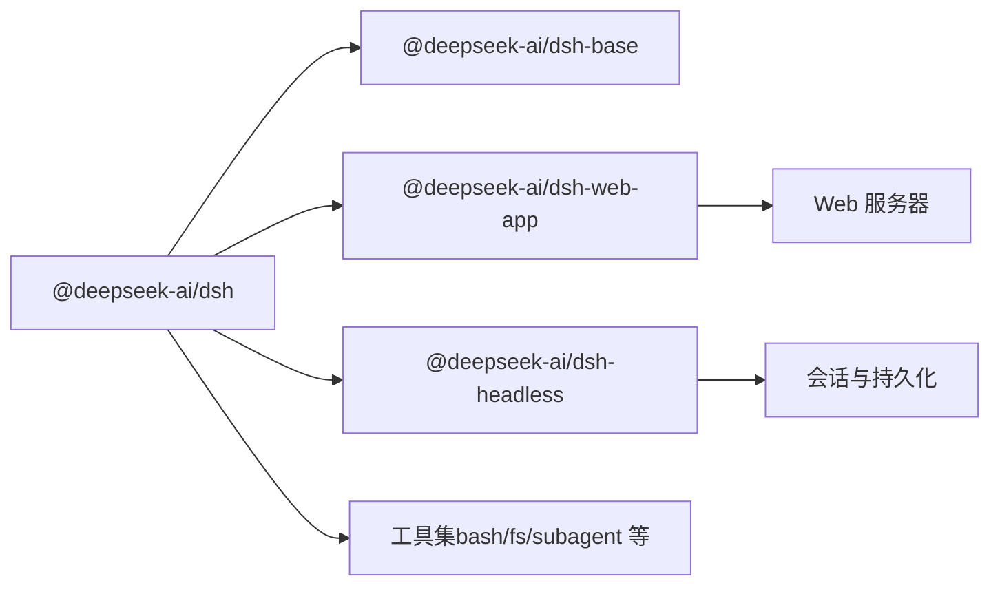

# 快速开始

<cite>
**本文引用的文件**
- [README.md](file://README.md)
- [apps/cli/README.md](file://apps/cli/README.md)
- [apps/cli/README.zh.md](file://apps/cli/README.zh.md)
- [apps/cli/package.json](file://apps/cli/package.json)
- [package.json](file://package.json)
- [apps/cli/src/args.ts](file://apps/cli/src/args.ts)
- [docs/user/guide/index.md](file://docs/user/guide/index.md)
- [examples/headless-agent/README.md](file://examples/headless-agent/README.md)
- [examples/headless-agent/cordis.yml](file://examples/headless-agent/cordis.yml)
- [packages/host/webserver/src/index.ts](file://packages/host/webserver/src/index.ts)
- [docs/subsystems/web-server.md](file://docs/subsystems/web-server.md)
- [docs/config-catalog.md](file://docs/config-catalog.md)
- [docs/subsystems/settings.md](file://docs/subsystems/settings.md)
- [packages/util/home-paths/src/index.ts](file://packages/util/home-paths/src/index.ts)
</cite>

## 目录
1. [简介](#简介)
2. [项目结构](#项目结构)
3. [核心组件](#核心组件)
4. [架构总览](#架构总览)
5. [详细组件分析](#详细组件分析)
6. [依赖关系分析](#依赖关系分析)
7. [性能注意事项](#性能注意事项)
8. [故障排除指南](#故障排除指南)
9. [结论](#结论)
10. [附录](#附录)

## 简介
本指南面向首次接触 DeepSeek Harness（简称 dsh）的用户，帮助你快速完成安装、配置与使用。你将学会：
- 通过 npm 包或从源码构建两种方式安装并运行
- 启动 Web UI、运行 Headless 模式以及执行基本命令
- 理解配置文件的基本结构与常用选项
- 排查常见安装与配置问题

## 项目结构
仓库采用多包工作区组织，CLI 入口位于 apps/cli，Web 前端在 apps/web，示例与文档分布在 examples 与 docs。根 package.json 提供统一的构建与脚本命令；CLI 包暴露 dsh 可执行命令。

图表来源
- [package.json:19-24](file://package.json#L19-L24)
- [apps/cli/package.json:14-16](file://apps/cli/package.json#L14-L16)
- [packages/host/webserver/src/index.ts:59-76](file://packages/host/webserver/src/index.ts#L59-L76)

章节来源
- [package.json:1-18](file://package.json#L1-L18)
- [apps/cli/package.json:1-20](file://apps/cli/package.json#L1-L20)

## 核心组件
- CLI 启动器：负责解析命令行参数、选择 profile（web/headless），并将后续参数转发给对应应用。
- Web UI：默认绑定本地回环地址，提供会话、模型设置与工作区管理界面。
- Headless 模式：一次性任务执行，输出最终结果后退出，适合自动化与测试。
- 配置系统：基于 Cordis 的组合式配置树，支持 bundle patch、用户覆盖与环境注入。

章节来源
- [apps/cli/README.md:5-17](file://apps/cli/README.md#L5-L17)
- [apps/cli/README.zh.md:5-17](file://apps/cli/README.zh.md#L5-L17)
- [docs/user/guide/index.md:1-11](file://docs/user/guide/index.md#L1-L11)
- [examples/headless-agent/README.md:7-16](file://examples/headless-agent/README.md#L7-L16)

## 架构总览
下图展示了从命令行到 Web 服务器的关键调用路径，以及 Headless 的一次性执行流程。

图表来源
- [apps/cli/src/args.ts:147-169](file://apps/cli/src/args.ts#L147-L169)
- [packages/host/webserver/src/index.ts:59-76](file://packages/host/webserver/src/index.ts#L59-L76)
- [examples/headless-agent/README.md:7-16](file://examples/headless-agent/README.md#L7-L16)

## 详细组件分析

### 安装与环境要求
- Node.js 版本要求：^22.19.0 或 >=24.0.0
- 包管理器：pnpm（工作区脚本依赖）
- 可选：Python SDK（如需 Python 集成）

安装方式一：通过 npm 直接运行
- 安装 Node.js 后，可直接通过 npx 启动 Web UI：
  - 命令参考：npx @deepseek-ai/dsh web
  - 说明：该命令会启动 Web UI，默认监听本地地址，端口由系统分配或在配置中指定

安装方式二：从源码构建
- 克隆仓库、安装依赖、构建产物，然后运行：
  - git clone ... && cd deepseek-harness
  - pnpm install
  - pnpm run build
  - pnpm dsh web

章节来源
- [README.md:13-35](file://README.md#L13-L35)
- [package.json:8-10](file://package.json#L8-L10)
- [package.json:19-24](file://package.json#L19-L24)
- [package.json:136-142](file://package.json#L136-L142)

### 启动 Web UI
- 使用 dsh web 启动 Web UI，默认绑定本地回环地址，便于安全开发
- 可通过 host 与 port 控制网络行为（仅允许 127.0.0.1 或 0.0.0.0）
- 首次运行会在当前目录作为工作区根，需在 UI 中选择工作区后再启用会话

章节来源
- [docs/user/guide/index.md:1-11](file://docs/user/guide/index.md#L1-L11)
- [docs/subsystems/web-server.md:27-41](file://docs/subsystems/web-server.md#L27-L41)
- [packages/host/webserver/src/index.ts:44-50](file://packages/host/webserver/src/index.ts#L44-L50)

### 运行 Headless 模式
- 使用 dsh --profile headless "任务" 执行一次性任务
- 该模式会创建并持久化一个会话，打印最终助手文本后退出
- 适用于自动化脚本、CI 或测试场景

章节来源
- [examples/headless-agent/README.md:7-16](file://examples/headless-agent/README.md#L7-L16)
- [apps/cli/README.md:7-17](file://apps/cli/README.md#L7-L17)

### 基本命令与用法
- dsh web：启动 Web UI（等价于 --profile web）
- dsh --profile headless "任务"：执行一次性任务
- dsh --dump-config / --dump-default-config：在不启动的情况下检查组合后的配置树
- 注意：启动器的 flag 必须写在最前面，其后内容交给已启动的 profile 解析

章节来源
- [apps/cli/README.md:18-28](file://apps/cli/README.md#L18-L28)
- [apps/cli/README.zh.md:18-28](file://apps/cli/README.zh.md#L18-L28)
- [apps/cli/src/args.ts:147-169](file://apps/cli/src/args.ts#L147-L169)

### 配置文件结构与常用选项
- 配置以 Cordis 组合树形式存在，包含多个 bundle 的 patch 层与用户覆盖
- 典型组成：
  - settings：用户设置文档（热重载）
  - credentials：凭据存储（优先读取进程环境与 $DSH_HOME/.credentials.yaml）
  - llm-deepseek：模型适配器与模型列表
  - bash/subprocess：子进程与 Bash 工具
  - persistence/checkpoint/token-meter/compaction：会话持久化与压缩策略
  - subagent/workflow/tools：子代理、工作流与工具链
- 常用选项（节选）：
  - thinking/reasoningEffort/models：模型能力与上下文窗口
  - cwd：工作目录（相对进程当前目录）
  - root/compression：持久化目录与压缩格式
  - thresholdRatio/retainRatio/maxTokens：压缩阈值与保留比例

章节来源
- [examples/headless-agent/cordis.yml:1-166](file://examples/headless-agent/cordis.yml#L1-L166)
- [docs/config-catalog.md:1-10](file://docs/config-catalog.md#L1-L10)

### 环境变量与 Home 目录
- DSH_HOME：覆盖默认用户数据目录（默认为 ~/.dsh）
- DEEPSEEK_API_KEY：通过凭据提供者注入，避免在配置中硬编码密钥
- LANG/LC_ALL/TERM/COLUMNS/LINES：终端相关的环境变量，影响交互体验

章节来源
- [packages/util/home-paths/src/index.ts:11-18](file://packages/util/home-paths/src/index.ts#L11-L18)
- [examples/headless-agent/README.md:9-13](file://examples/headless-agent/README.md#L9-L13)

## 依赖关系分析
- CLI 包依赖大量内部插件与服务，包括 agent、session、tools、web-app、headless 等
- Web 服务器作为独立服务，提供路由注册与静态资源服务
- 配置系统贯穿各组件，确保运行时可组合与热更新

图表来源
- [apps/cli/package.json:22-79](file://apps/cli/package.json#L22-L79)
- [packages/host/webserver/src/index.ts:59-76](file://packages/host/webserver/src/index.ts#L59-L76)

章节来源
- [apps/cli/package.json:22-79](file://apps/cli/package.json#L22-L79)

## 性能注意事项
- 会话压缩：合理设置 thresholdRatio、retainRatio、maxTokens，避免历史过长导致上下文溢出
- 持久化压缩：根据环境选择 zstd 或 none，平衡磁盘占用与 I/O 性能
- 子进程超时：为 bash 工具设置合理的 timeoutMs，防止长时间阻塞
- 模型能力：根据任务复杂度选择合适的 model 与 reasoningEffort，避免过度消耗

章节来源
- [examples/headless-agent/cordis.yml:63-83](file://examples/headless-agent/cordis.yml#L63-L83)

## 故障排除指南
- 无法访问 Web UI
  - 确认是否绑定了非回环地址（host 仅支持 127.0.0.1 或 0.0.0.0）
  - 若需远程访问，显式设置 host 为 0.0.0.0，并注意无 TLS/认证的安全风险
- 端口冲突
  - 使用操作系统分配的端口或更换端口
- 模型未配置
  - 在 Settings → Models 中设置 API Key，保存后立即生效
- Headless 模式无输出
  - 检查任务字符串是否为非空白
  - 确认凭据与模型可用
- 配置错误
  - 使用 --dump-config 或 --dump-default-config 检查组合后的配置树
  - 关注 schema 校验错误与缺失必填项

章节来源
- [docs/subsystems/web-server.md:27-41](file://docs/subsystems/web-server.md#L27-L41)
- [docs/user/guide/index.md:7-11](file://docs/user/guide/index.md#L7-L11)
- [apps/cli/README.md:30-43](file://apps/cli/README.md#L30-L43)
- [examples/headless-agent/README.md:7-16](file://examples/headless-agent/README.md#L7-L16)

## 结论
通过本指南，你应能：
- 使用 npm 或源码方式安装并运行 dsh
- 启动 Web UI 或执行 Headless 任务
- 理解配置组合与常用选项
- 解决常见的安装与配置问题

建议进一步阅读：
- Web UI 使用指南
- Headless 示例与高级配置
- 配置目录与子系统文档

## 附录
- 常用命令速查
  - dsh web：启动 Web UI
  - dsh --profile headless "任务"：执行一次性任务
  - dsh --dump-config：查看组合配置
  - dsh --dump-default-config：查看默认配置层
- 关键环境变量
  - DSH_HOME：用户数据目录
  - DEEPSEEK_API_KEY：API 密钥
  - LANG/LC_ALL/TERM/COLUMNS/LINES：终端环境

章节来源
- [apps/cli/README.md:18-43](file://apps/cli/README.md#L18-L43)
- [examples/headless-agent/README.md:9-13](file://examples/headless-agent/README.md#L9-L13)
- [docs/subsystems/settings.md:1-20](file://docs/subsystems/settings.md#L1-L20)