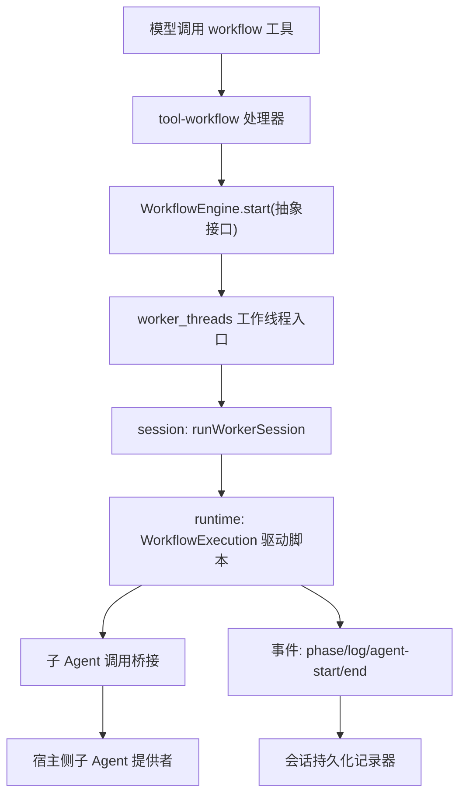
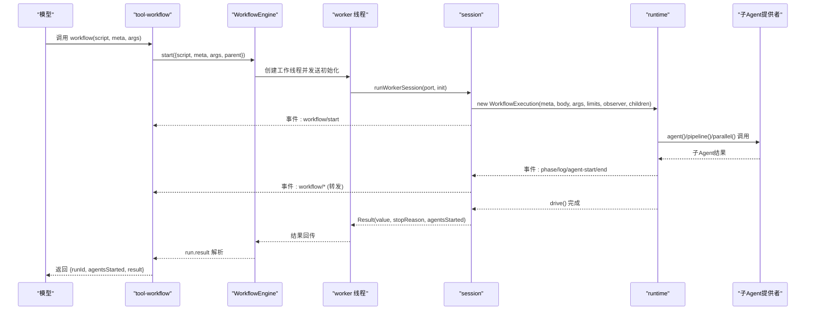
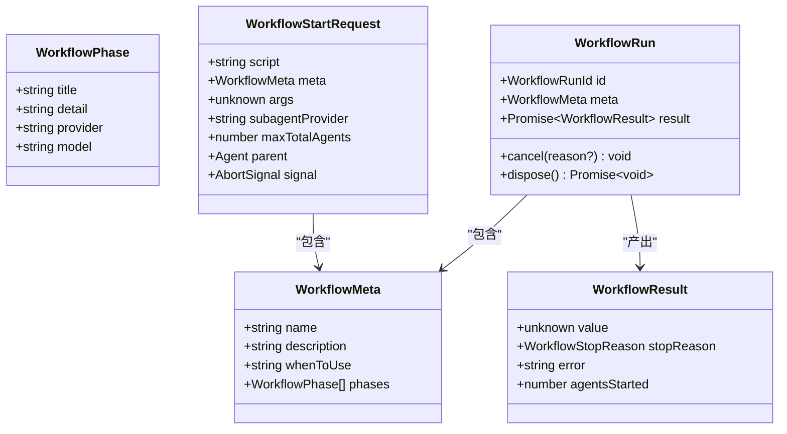
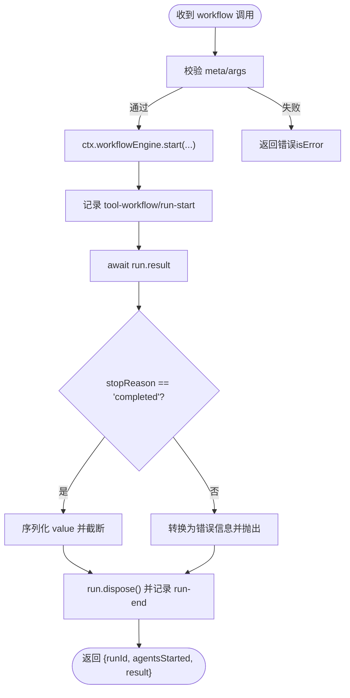
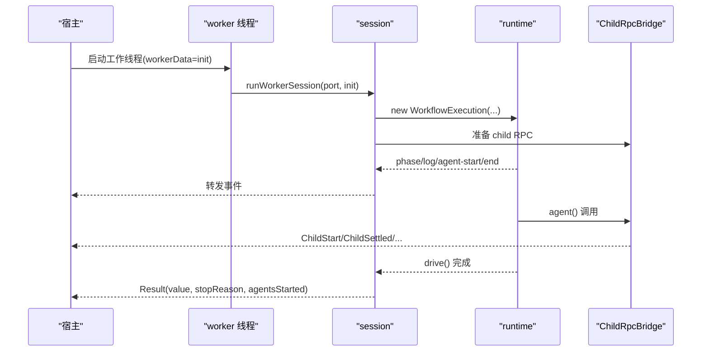
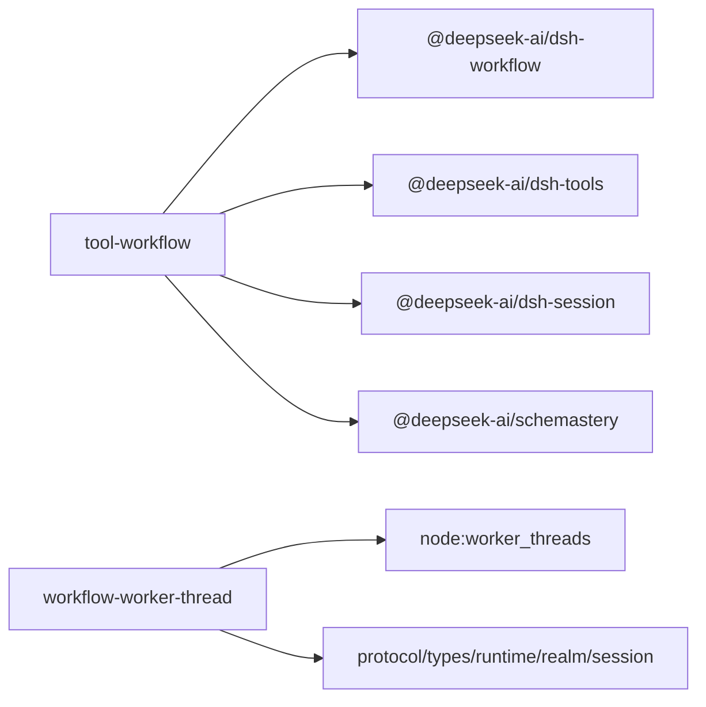

# 工作流开发

<cite>
**本文引用的文件**
- [packages/workflow/workflow/src/types.ts](file://packages/workflow/workflow/src/types.ts)
- [packages/workflow/workflow/src/runtime-types.ts](file://packages/workflow/workflow/src/runtime-types.ts)
- [packages/workflow/tool-workflow/src/index.ts](file://packages/workflow/tool-workflow/src/index.ts)
- [packages/workflow/workflow-worker-thread/src/worker.ts](file://packages/workflow/workflow-worker-thread/src/worker.ts)
- [packages/workflow/workflow-worker-thread/src/session.ts](file://packages/workflow/workflow-worker-thread/src/session.ts)
- [docs/subsystems/workflow.md](file://docs/subsystems/workflow.md)
</cite>

## 目录
1. [简介](#简介)
2. [项目结构](#项目结构)
3. [核心组件](#核心组件)
4. [架构总览](#架构总览)
5. [详细组件分析](#详细组件分析)
6. [依赖关系分析](#依赖关系分析)
7. [性能与并发特性](#性能与并发特性)
8. [调试与监控](#调试与监控)
9. [故障排查指南](#故障排查指南)
10. [最佳实践与优化建议](#最佳实践与优化建议)
11. [结论](#结论)
12. [附录：脚本化工作流语法与示例](#附录：脚本化工作流语法与示例)

## 简介
本指南面向使用 DeepSeek Harness 工作流引擎的开发者，系统讲解如何以脚本化方式定义工作流、在受控执行环境中编排子 Agent、管理变量与作用域、处理错误与取消、集成工具与外部能力，并通过事件与日志进行调试与监控。文档同时提供从简单任务自动化到复杂多步骤业务流程的实践建议与优化技巧，确保工作流的稳定性与可维护性。

## 项目结构
工作流由“模型侧工具”、“工作流抽象接口”和“线程隔离的执行引擎”三部分构成：
- 模型侧工具：对外暴露 workflow 工具，负责参数校验、生命周期管理与结果呈现。
- 工作流抽象接口：定义启动请求、运行句柄、结果类型与事件契约。
- 线程隔离执行引擎：基于 worker_threads 将脚本运行在独立线程中，通过消息协议与主进程通信，实现安全隔离与可控资源。

图表来源
- [packages/workflow/tool-workflow/src/index.ts:205-335](file://packages/workflow/tool-workflow/src/index.ts#L205-L335)
- [packages/workflow/workflow-worker-thread/src/worker.ts:1-15](file://packages/workflow/workflow-worker-thread/src/worker.ts#L1-L15)
- [packages/workflow/workflow-worker-thread/src/session.ts:143-201](file://packages/workflow/workflow-worker-thread/src/session.ts#L143-L201)

章节来源
- [docs/subsystems/workflow.md:1-10](file://docs/subsystems/workflow.md#L1-L10)
- [packages/workflow/tool-workflow/src/index.ts:205-335](file://packages/workflow/tool-workflow/src/index.ts#L205-L335)
- [packages/workflow/workflow-worker-thread/src/worker.ts:1-15](file://packages/workflow/workflow-worker-thread/src/worker.ts#L1-L15)
- [packages/workflow/workflow-worker-thread/src/session.ts:143-201](file://packages/workflow/workflow-worker-thread/src/session.ts#L143-L201)

## 核心组件
- 工作流元数据与类型
  - 元数据：name、description、whenToUse、phases（仅用于观察与分组）。
  - 运行句柄：id、meta、result、cancel、dispose。
  - 结果：value、stopReason（completed/cancelled/error）、agentsStarted。
- 模型侧工具
  - 注册 workflow 工具，解析并校验 meta/args，调用 ctx.workflowEngine.start，监听事件写入会话，最终返回结构化结果。
- 执行引擎（线程隔离）
  - worker 入口加载 session；session 建立消息通道，创建执行上下文，驱动脚本执行，回传阶段、日志、子 Agent 开始/结束与最终结果。

章节来源
- [packages/workflow/workflow/src/types.ts:12-132](file://packages/workflow/workflow/src/types.ts#L12-L132)
- [packages/workflow/workflow/src/runtime-types.ts:14-49](file://packages/workflow/workflow/src/runtime-types.ts#L14-L49)
- [packages/workflow/tool-workflow/src/index.ts:205-335](file://packages/workflow/tool-workflow/src/index.ts#L205-L335)
- [packages/workflow/workflow-worker-thread/src/session.ts:143-201](file://packages/workflow/workflow-worker-thread/src/session.ts#L143-L201)

## 架构总览
工作流执行采用“宿主-工作线程”双端协作：
- 宿主侧：工具层负责参数校验、事件订阅、会话持久化与结果渲染。
- 工作线程侧：脚本在隔离环境执行，通过 RPC 桥发起子 Agent 调用，所有进度与结果通过消息回传宿主。

图表来源
- [packages/workflow/tool-workflow/src/index.ts:272-331](file://packages/workflow/tool-workflow/src/index.ts#L272-L331)
- [packages/workflow/workflow-worker-thread/src/worker.ts:8-14](file://packages/workflow/workflow-worker-thread/src/worker.ts#L8-L14)
- [packages/workflow/workflow-worker-thread/src/session.ts:143-201](file://packages/workflow/workflow-worker-thread/src/session.ts#L143-L201)

## 详细组件分析

### 工作流元数据与运行类型
- WorkflowMeta：标识工作流身份与展示信息，phases 仅用于观察分组。
- WorkflowStartRequest：包含 script、meta、args、parent、可选 subagentProvider/maxTotalAgents/signal。
- WorkflowRun：持有 id/meta/result，支持 cancel/dispose。
- WorkflowResult：value、stopReason、error、agentsStarted。

图表来源
- [packages/workflow/workflow/src/types.ts:24-132](file://packages/workflow/workflow/src/types.ts#L24-L132)
- [packages/workflow/workflow/src/runtime-types.ts:14-49](file://packages/workflow/workflow/src/runtime-types.ts#L14-L49)

章节来源
- [packages/workflow/workflow/src/types.ts:24-132](file://packages/workflow/workflow/src/types.ts#L24-L132)
- [packages/workflow/workflow/src/runtime-types.ts:14-49](file://packages/workflow/workflow/src/runtime-types.ts#L14-L49)

### 模型侧工具：workflow 工具
- 职责：注册工具、校验参数、启动运行、订阅事件、写入会话、渲染结果。
- 关键点：
  - meta 与 args 为纯 JSON，引擎先校验再执行脚本。
  - 非 completed 的结果映射为 isError 返回。
  - 结果文本截断以避免过大输出。
  - 通过 exec.signal 与 run.cancel 联动，保证父级中止时工作流及时终止。

图表来源
- [packages/workflow/tool-workflow/src/index.ts:205-335](file://packages/workflow/tool-workflow/src/index.ts#L205-L335)

章节来源
- [packages/workflow/tool-workflow/src/index.ts:205-335](file://packages/workflow/tool-workflow/src/index.ts#L205-L335)

### 执行引擎：worker 与 session
- worker 入口：加载 session，绑定 parentPort，传入 WorkerInit。
- session：
  - 建立消息通道，创建 ExecutionObserver，驱动 WorkflowExecution。
  - 通过 ChildRpcBridge 管理子 Agent 调用的 RPC 生命周期（start/settled/dispose）。
  - 将 phase/log/agent-start/end 等事件回传给宿主。
  - 最终发送 Result 消息，保证只发一次。

图表来源
- [packages/workflow/workflow-worker-thread/src/worker.ts:8-14](file://packages/workflow/workflow-worker-thread/src/worker.ts#L8-L14)
- [packages/workflow/workflow-worker-thread/src/session.ts:143-201](file://packages/workflow/workflow-worker-thread/src/session.ts#L143-L201)

章节来源
- [packages/workflow/workflow-worker-thread/src/worker.ts:1-15](file://packages/workflow/workflow-worker-thread/src/worker.ts#L1-L15)
- [packages/workflow/workflow-worker-thread/src/session.ts:143-201](file://packages/workflow/workflow-worker-thread/src/session.ts#L143-L201)

### 事件与持久化
- 事件：workflow/start、workflow/phase、workflow/log、workflow/agent-start、workflow/agent-end、workflow/end。
- 持久化：tool-workflow 将上述事件投影到父 Session，形成连续的前缀日志；首次 append 失败即停止后续写入，避免污染。
- UI 折叠：客户端将事件折叠为单一 workflow-run 节点，便于导航与状态展示。

章节来源
- [docs/subsystems/workflow.md:118-129](file://docs/subsystems/workflow.md#L118-L129)
- [packages/workflow/tool-workflow/src/index.ts:95-130](file://packages/workflow/tool-workflow/src/index.ts#L95-L130)

## 依赖关系分析
- tool-workflow 依赖：
  - @deepseek-ai/dsh-workflow（抽象接口与类型）
  - @deepseek-ai/dsh-tools（工具注册）
  - @deepseek-ai/dsh-session（会话事件追加）
  - @deepseek-ai/schemastery（参数校验）
- 执行引擎依赖：
  - node:worker_threads（隔离执行）
  - 内部 protocol/types/runtime/realm/session（消息协议、运行时、领域对象）

图表来源
- [packages/workflow/tool-workflow/src/index.ts:13-27](file://packages/workflow/tool-workflow/src/index.ts#L13-L27)
- [packages/workflow/workflow-worker-thread/src/worker.ts:8-14](file://packages/workflow/workflow-worker-thread/src/worker.ts#L8-L14)

章节来源
- [packages/workflow/tool-workflow/src/index.ts:13-27](file://packages/workflow/tool-workflow/src/index.ts#L13-L27)
- [packages/workflow/workflow-worker-thread/src/worker.ts:8-14](file://packages/workflow/workflow-worker-thread/src/worker.ts#L8-L14)

## 性能与并发特性
- 并发控制：
  - pipeline：无屏障的多阶段流水线，每个 item 独立流经 stages，普通 stage 抛错仅该 item 置 null。
  - parallel：并行执行 thunk 集合，等待全部完成（屏障），throw 的 thunk 结果为 null。
- 资源限制：
  - 可通过 subagentProvider 与 maxTotalAgents 对单次运行进行全局约束。
  - 脚本内不提供文件系统、网络、定时器或 Node API，所有实际工作委托给 Agent。
- 隔离执行：
  - 脚本在 worker_threads 中运行，崩溃不影响宿主；超时/取消通过信号与 grace period 强制收敛。

章节来源
- [docs/subsystems/workflow.md:11-15](file://docs/subsystems/workflow.md#L11-L15)
- [packages/workflow/tool-workflow/src/index.ts:138-150](file://packages/workflow/tool-workflow/src/index.ts#L138-L150)
- [packages/workflow/workflow-worker-thread/src/session.ts:143-201](file://packages/workflow/workflow-worker-thread/src/session.ts#L143-L201)

## 调试与监控
- 执行日志：
  - 脚本内使用 log(message) 输出叙述性日志，触发 workflow/log 事件。
  - 使用 phase(title) 划分阶段，触发 workflow/phase 事件，便于 UI 分组与进度展示。
- 子 Agent 追踪：
  - agent-start/agent-end 成对出现，seq 一致，可用于统计与关联。
- 会话记录：
  - tool-workflow 将运行生命周期写入父 Session，形成可审计的连续日志前缀。
- 诊断要点：
  - 若 append 失败，后续写入自动禁用，避免污染日志。
  - 非 completed 结果会转为错误信息，便于快速定位问题。

章节来源
- [docs/subsystems/workflow.md:118-129](file://docs/subsystems/workflow.md#L118-L129)
- [packages/workflow/tool-workflow/src/index.ts:95-130](file://packages/workflow/tool-workflow/src/index.ts#L95-L130)
- [packages/workflow/tool-workflow/src/index.ts:179-203](file://packages/workflow/tool-workflow/src/index.ts#L179-L203)

## 故障排查指南
- 常见错误分类
  - 元数据/脚本解析失败：在工具层同步抛出，直接返回 isError。
  - 致命错误（Hook 误用、未知选项、超出受限 schema、触发上限、seam 启动失败、取消）：在工作流引擎中以 fatal 错误传播，立即终止脚本。
  - 子 Agent 失败：pipeline/parallel 中对应项结果为 null，需过滤后继续。
- 排查步骤
  - 检查 meta 字段是否完整且符合约定。
  - 确认脚本仅使用允许的全局与钩子（agent/pipeline/parallel/phase/log/args）。
  - 关注 workflow/* 事件顺序与配对，确认 agent-start/agent-end 是否匹配。
  - 查看会话中的 tool-workflow 记录，定位中断点。
  - 如发生异常，优先检查错误消息与 agentsStarted 计数。

章节来源
- [docs/subsystems/workflow.md:114-129](file://docs/subsystems/workflow.md#L114-L129)
- [packages/workflow/tool-workflow/src/index.ts:179-203](file://packages/workflow/tool-workflow/src/index.ts#L179-L203)

## 最佳实践与优化建议
- 脚本设计
  - 明确阶段：使用 phase 划分逻辑阶段，提升可读性与可观测性。
  - 选择合适组合器：大量独立任务优先 pipeline；需要聚合中间结果的阶段再用 parallel。
  - 严格输入：meta.name/description 简洁准确，phases.title 与脚本中 phase 调用保持一致。
- 错误与取消
  - 对 pipeline/parallel 的 null 结果进行过滤与降级处理。
  - 利用 exec.signal 与 run.cancel 配合，确保父级中止能迅速收敛。
- 性能与成本
  - 合理设置 maxTotalAgents，避免过度并发导致资源争用。
  - 避免在脚本中进行 IO 或耗时计算，尽量委派给 Agent。
- 可维护性
  - 保持脚本短小聚焦，复杂流程拆分为多个工作流。
  - 通过事件与日志完善可观测性，便于回溯与复盘。

[本节为通用指导，不直接分析具体文件]

## 结论
DeepSeek Harness 的工作流引擎通过“脚本化编排 + 线程隔离 + 事件驱动”的方式，提供了稳定、可观测、可扩展的多 Agent 协作能力。借助严格的元数据校验、受限的执行环境与完善的错误/取消机制，开发者可以高效构建从简单自动化到复杂业务流程的各类工作流。结合事件与日志，可在生产环境中获得良好的可观测性与可维护性。

[本节为总结，不直接分析具体文件]

## 附录：脚本化工作流语法与示例
- 脚本体
  - 纯 JavaScript，顶层 await 允许，必须以 return <JSON 值> 结尾。
  - 可用全局：args（工具传入的原始输入）。
- 钩子
  - agent(prompt, opts?): 运行一个子 Agent 直至完成。opts.schema 仅支持受限 JSON Schema 子集；其他选项会被拒绝。
  - pipeline(items, ...stages): 多阶段流水线，无屏障；普通 stage 抛错仅该项为 null。
  - parallel(thunks): 并发执行零参函数，等待全部完成；throw 的 thunk 结果为 null。
  - phase(title)/log(message): 进度与日志。
- 元数据
  - name/description 必填；whenToUse/phases 可选。
- 示例思路
  - 简单任务自动化：读取 args 列表，使用 pipeline 逐项处理，收集结果。
  - 多步骤业务流程：使用 phase 划分阶段，按阶段调用不同 provider/model 的 Agent，聚合阶段性结果。
  - 容错与重试：对 pipeline/parallel 的 null 结果进行过滤与重试策略。

章节来源
- [packages/workflow/tool-workflow/src/index.ts:138-150](file://packages/workflow/tool-workflow/src/index.ts#L138-L150)
- [packages/workflow/workflow/src/types.ts:24-55](file://packages/workflow/workflow/src/types.ts#L24-L55)
- [packages/workflow/workflow/src/runtime-types.ts:14-34](file://packages/workflow/workflow/src/runtime-types.ts#L14-L34)