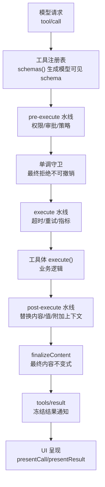
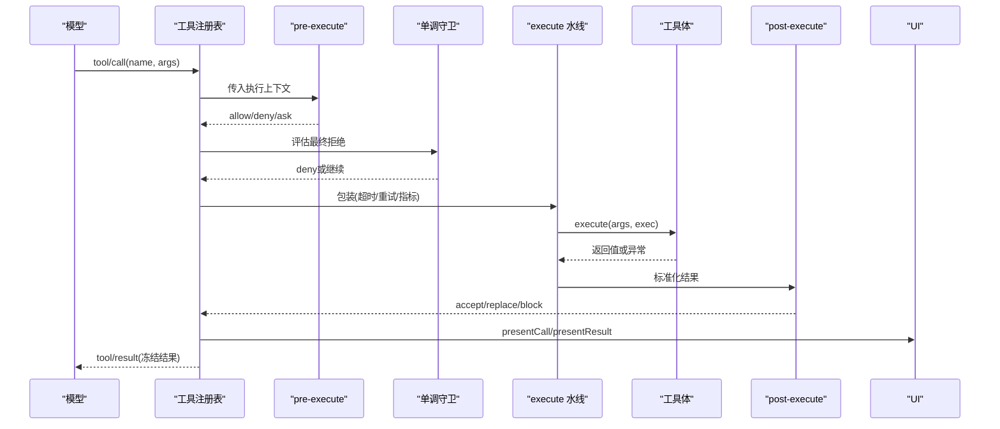
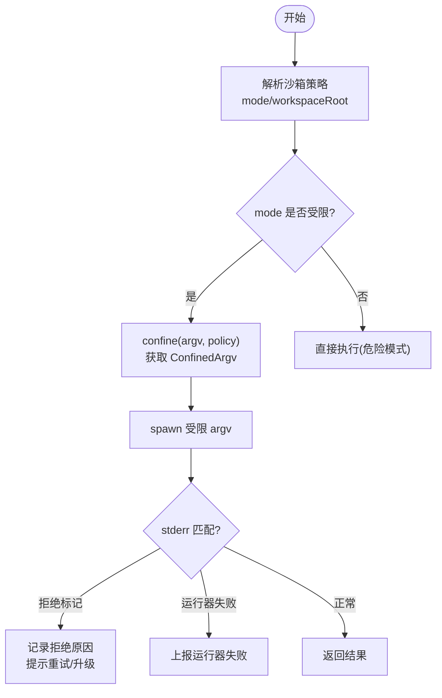
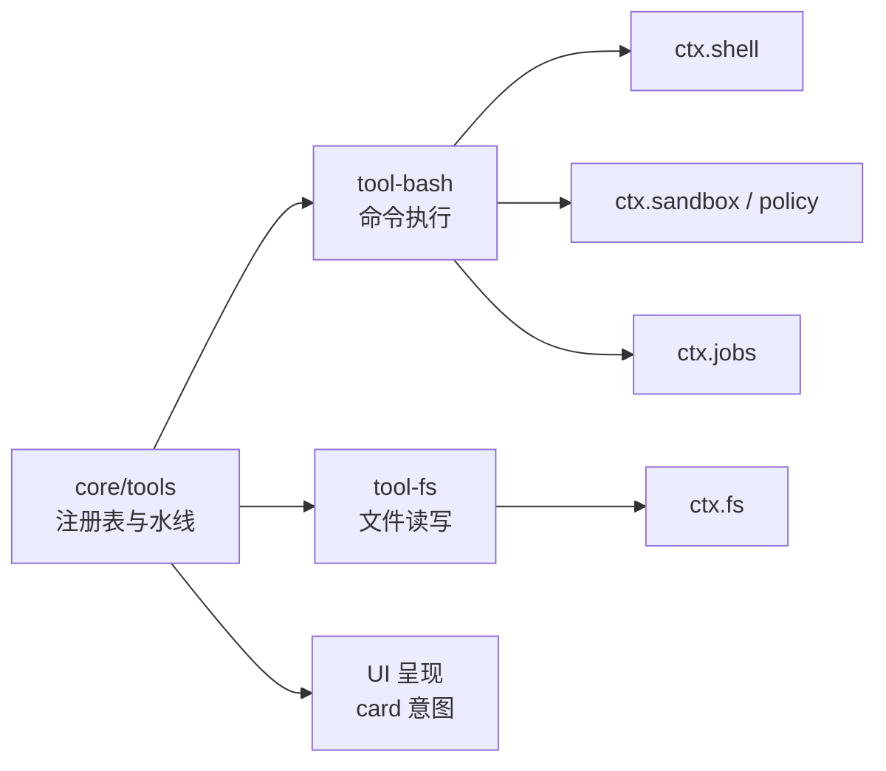

# 工具开发

<cite>
**本文引用的文件**
- [docs/tool-catalog.md](file://docs/tool-catalog.md)
- [docs/tool-execution-pipeline.md](file://docs/tool-execution-pipeline.md)
- [docs/cookbook/adding-a-tool.md](file://docs/cookbook/adding-a-tool.md)
- [docs/subsystems/tools.md](file://docs/subsystems/tools.md)
- [docs/subsystems/sandbox.md](file://docs/subsystems/sandbox.md)
- [packages/shell/tool-bash/src/index.ts](file://packages/shell/tool-bash/src/index.ts)
- [packages/fs/tool-fs/src/index.ts](file://packages/fs/tool-fs/src/index.ts)
</cite>

## 目录
1. [简介](#简介)
2. [项目结构](#项目结构)
3. [核心组件](#核心组件)
4. [架构总览](#架构总览)
5. [详细组件分析](#详细组件分析)
6. [依赖关系分析](#依赖关系分析)
7. [性能考量](#性能考量)
8. [故障排查指南](#故障排查指南)
9. [结论](#结论)
10. [附录](#附录)

## 简介
本指南面向 DeepSeek Harness 的工具开发者，系统性讲解如何以声明式方式定义模型可见工具（名称、描述、参数 schema、返回类型），并深入解析工具执行管道各阶段：参数验证、权限检查、沙箱执行、结果处理与 UI 呈现。同时覆盖外部服务集成（异步调用、错误处理、重试）、安全控制（文件系统访问、网络限制、资源监控）以及从简单文本处理到复杂文件操作的完整示例。文末提供测试方法与调试技巧，帮助构建高可靠、高性能的工具。

## 项目结构
DeepSeek Harness 将“工具”作为可注册、可组合的插件能力，通过统一的 schema 与执行管线暴露给模型与 UI。关键位置包括：
- 工具注册与执行核心：core/tools（ToolDefinition、schema DSL、waterfall 钩子）
- 具体工具实现：shell/tool-bash、fs/tool-fs 等
- 文档与规范：docs/tool-catalog.md、docs/subsystems/tools.md、docs/tool-execution-pipeline.md
- 沙箱与安全：sandbox 子系统（进程级文件访问限制）

图表来源
- [docs/tool-execution-pipeline.md:8-58](file://docs/tool-execution-pipeline.md#L8-L58)
- [docs/subsystems/tools.md:170-404](file://docs/subsystems/tools.md#L170-L404)

章节来源
- [docs/tool-catalog.md:1-42](file://docs/tool-catalog.md#L1-L42)
- [docs/tool-execution-pipeline.md:1-63](file://docs/tool-execution-pipeline.md#L1-L63)
- [docs/subsystems/tools.md:1-152](file://docs/subsystems/tools.md#L1-L152)

## 核心组件
- ToolDefinition：包含模型可见 schema（name/description/parameters）与输出 schema（output.schema + render + presentationMeta），以及 execute、可选 finalizeContent、timeoutMs、isConcurrencySafe、presentCall/presentResult。
- 统一 JSON 值 schema DSL：ValueSchemaSpec/ParameterSchemaSpec，支持标量、对象、数组、oneOf、enum/const 等；运行时严格校验。
- 执行水线：tools/pre-execute（允许/拒绝/询问）、monotonic guards（最终拒绝）、tools/execute（around-dispatch，如超时/重试）、tools/post-execute（接受/替换/阻断）、finalizeContent、tools/result。
- UI 呈现：presentCall 与 presentResult 返回中性 card 意图（generic/terminal/diff/search/web/read），由宿主映射为具体视图。

章节来源
- [docs/subsystems/tools.md:9-152](file://docs/subsystems/tools.md#L9-L152)
- [docs/subsystems/tools.md:153-404](file://docs/subsystems/tools.md#L153-L404)
- [docs/subsystems/tools.md:459-468](file://docs/subsystems/tools.md#L459-L468)

## 架构总览
工具从模型侧进入后，先经 schema 投影生成模型可见接口，再进入执行水线完成策略、安全与业务执行，最后产出冻结结果并呈现 UI。

图表来源
- [docs/tool-execution-pipeline.md:8-58](file://docs/tool-execution-pipeline.md#L8-L58)
- [docs/subsystems/tools.md:170-404](file://docs/subsystems/tools.md#L170-L404)

## 详细组件分析

### 工具声明式定义（元数据、参数 schema、返回类型）
- 元数据：name、description 用于模型理解与 UI 展示。
- 参数 schema：使用 ParameterSchemaSpec 声明字段类型、required、枚举等；defineTool 会在执行前进行严格校验。
- 返回类型：output.schema 声明结构化返回值；render 负责模型可读内容；presentationMeta 提供可重放的 UI 元数据。

参考路径
- [添加工具的最低形态与规则:7-66](file://docs/cookbook/adding-a-tool.md#L7-L66)
- [工具定义与 schema DSL:9-152](file://docs/subsystems/tools.md#L9-L152)

章节来源
- [docs/cookbook/adding-a-tool.md:7-66](file://docs/cookbook/adding-a-tool.md#L7-L66)
- [docs/subsystems/tools.md:99-152](file://docs/subsystems/tools.md#L99-L152)

### 执行管道各阶段详解
- 参数验证：defineTool 基于 schema 对 model 生成的 arguments 进行强校验，确保 execute 内参数类型安全。
- 权限检查：tools/pre-execute 水线支持 allow/deny/ask；缺失审批通道时 ask 转为 deny。
- 单调守卫：注册 guard 做最终拒绝，后续监听器无法撤销。
- 执行包装：tools/execute 水线用于超时、重试、指标收集；仅允许替换 exec.signal。
- 结果处理：post-execute 可替换 content/value 或阻断；finalizeContent 做最终内容不变式；tools/result 观察冻结结果。
- UI 呈现：presentCall/presentResult 返回中性 card 意图，宿主渲染。

参考路径
- [执行水线与决策类型](file://docs/subsystems/tools.md:170-404)
- [UI 呈现词汇](file://docs/subsystems/tools.md:459-468)
- [执行流程图](file://docs/tool-execution-pipeline.md:8-58)

章节来源
- [docs/subsystems/tools.md:170-404](file://docs/subsystems/tools.md#L170-L404)
- [docs/tool-execution-pipeline.md:8-58](file://docs/tool-execution-pipeline.md#L8-L58)

### 沙箱与安全控制
- 进程沙箱模式：read-only、workspace-write、danger-full-access；仅前两种可下发至后端。
- 每调用策略：SandboxExecutionPolicy 携带 mode 与 workspaceRoot；resolve 顺序为显式批准 > 会话覆盖 > 部署默认。
- 失败分类：denialSignatures 标识被沙箱正确阻止；runnerFailureRules 标识沙箱运行器自身失败。
- 工具集成：bash 工具在检测到沙箱拒绝时可引导一次性升级（sandbox_permissions + justification）并经审批流程。

图表来源
- [docs/subsystems/sandbox.md:9-40](file://docs/subsystems/sandbox.md#L9-L40)
- [docs/subsystems/sandbox.md:41-94](file://docs/subsystems/sandbox.md#L41-L94)
- [docs/subsystems/sandbox.md:96-157](file://docs/subsystems/sandbox.md#L96-L157)

章节来源
- [docs/subsystems/sandbox.md:9-157](file://docs/subsystems/sandbox.md#L9-L157)
- [packages/shell/tool-bash/src/index.ts:202-233](file://packages/shell/tool-bash/src/index.ts#L202-L233)

### 外部服务集成（异步、错误、重试）
- 异步工作：通过 ctx.jobs.start 注册后台任务，返回 jobId；前台调用立即返回，后续通过 job_output/job_kill 管理。
- 错误处理：工具体应返回结构化 value；基础设施错误抛出，管道将其归一化为 isError。
- 重试机制：可在 tools/execute 水线中封装重试逻辑，结合超时与信号取消。

参考路径
- [后台任务与生命周期](file://docs/cookbook/adding-a-tool.md:51-56)
- [bash 工具后台执行](file://packages/shell/tool-bash/src/index.ts:349-378)

章节来源
- [docs/cookbook/adding-a-tool.md:51-56](file://docs/cookbook/adding-a-tool.md#L51-L56)
- [packages/shell/tool-bash/src/index.ts:349-378](file://packages/shell/tool-bash/src/index.ts#L349-L378)

### 工具开发示例

#### 示例一：简单文本处理工具
- 目标：读取文件并返回行号化内容。
- 关键点：
  - parameters 声明 path、limit 等字段。
  - output.schema 声明返回类型为字符串或对象。
  - execute 中遵循 exec.signal 取消语义。
  - presentCall/presentResult 返回 generic 或 read 卡片。

参考路径
- [最小工具形态与 execute 契约](file://docs/cookbook/adding-a-tool.md:7-66)
- [UI 呈现词汇（read 卡片）](file://docs/subsystems/tools.md:459-468)

章节来源
- [docs/cookbook/adding-a-tool.md:7-66](file://docs/cookbook/adding-a-tool.md#L7-L66)
- [docs/subsystems/tools.md:459-468](file://docs/subsystems/tools.md#L459-L468)

#### 示例二：复杂文件操作工具（读写/编辑/图片）
- 目标：提供 read/write/edit/read_image 能力，带沙箱与观察事件。
- 关键点：
  - 使用 fs 工具套件注册，配置读限制与流式阈值。
  - 写/编辑走 FsSandboxController 统一升级 API。
  - read_image 仅在 attachments 挂载时注册。

参考路径
- [FS 工具套件注册与配置](file://packages/fs/tool-fs/src/index.ts:1-80)

章节来源
- [packages/fs/tool-fs/src/index.ts:1-80](file://packages/fs/tool-fs/src/index.ts#L1-L80)

#### 示例三：命令执行工具（bash）
- 目标：执行 bash 命令，支持前台/后台、超时、工作目录、沙箱升级。
- 关键点：
  - parameters 含 command、description、timeoutMs、workdir、run_in_background、sandbox_permissions、justification。
  - output.schema 区分 foreground/background，结构化 stdout/stderr、sandbox 信息。
  - presentCall/presentResult 分别渲染 terminal/generic 卡片。
  - 后台任务通过 ctx.jobs.start 管理生命周期。

参考路径
- [bash 工具定义与执行](file://packages/shell/tool-bash/src/index.ts:242-393)

章节来源
- [packages/shell/tool-bash/src/index.ts:242-393](file://packages/shell/tool-bash/src/index.ts#L242-L393)

## 依赖关系分析
- 工具注册表（core/tools）提供 schemas()/register()/execute()，对外暴露模型可见 schema 与执行入口。
- 具体工具（如 tool-bash、tool-fs）依赖 shell/fs 能力与 sandbox/sandbox-policy 策略。
- UI 呈现依赖中性 card 意图，由宿主映射为终端、差异、搜索等视图。

图表来源
- [docs/subsystems/tools.md:478-570](file://docs/subsystems/tools.md#L478-L570)
- [packages/shell/tool-bash/src/index.ts:31-32](file://packages/shell/tool-bash/src/index.ts#L31-L32)
- [packages/fs/tool-fs/src/index.ts:21-22](file://packages/fs/tool-fs/src/index.ts#L21-L22)

章节来源
- [docs/subsystems/tools.md:478-570](file://docs/subsystems/tools.md#L478-L570)
- [packages/shell/tool-bash/src/index.ts:31-32](file://packages/shell/tool-bash/src/index.ts#L31-L32)
- [packages/fs/tool-fs/src/index.ts:21-22](file://packages/fs/tool-fs/src/index.ts#L21-L22)

## 性能考量
- 并发安全：isConcurrencySafe 可将可并行工具加入滚动池执行；否则形成独占屏障。
- 超时与取消：timeoutMs 配合 exec.signal，避免长时间阻塞；后台任务使用 job 取消而非工具信号。
- 输出裁剪：read 限制行数/字节/行长度，大文件流式读取；grep/glob 结果截断并通过 spill 存储完整列表。
- 结果规范化：registry 冻结 value 与 content，减少重复序列化开销。

章节来源
- [docs/subsystems/tools.md:54-74](file://docs/subsystems/tools.md#L54-L74)
- [docs/tool-catalog.md:716-774](file://docs/tool-catalog.md#L716-L774)

## 故障排查指南
- 参数错误：ToolArgsError（INVALID_ARGS）——检查 parameters 与 required 字段。
- 输出错误：ToolOutputError（INVALID_TOOL_OUTPUT）——核对 output.schema 与返回值。
- 未知工具：UNKNOWN_TOOL——确认工具已注册且未被 restrict 过滤。
- 沙箱拒绝：denialSignatures 匹配 stderr；按提示升级或调整命令；若 runnerFailureRules 命中则修复运行器问题。
- 后台任务：job_* 工具查询/终止；注意 owner 清理与资源释放。

章节来源
- [docs/subsystems/tools.md:149-152](file://docs/subsystems/tools.md#L149-L152)
- [docs/subsystems/tools.md:404-408](file://docs/subsystems/tools.md#L404-L408)
- [docs/subsystems/sandbox.md:96-157](file://docs/subsystems/sandbox.md#L96-L157)

## 结论
DeepSeek Harness 的工具体系以声明式 schema 为核心，通过可扩展的执行水线实现权限、安全与策略的统一治理。开发者只需关注业务逻辑与结构化返回值，即可获得一致的模型可见接口、安全的执行环境与丰富的 UI 呈现。借助后台任务、沙箱升级与严格的校验机制，可构建从简单文本处理到复杂文件操作的各类工具，并确保可靠性与性能。

## 附录

### 常用工具清单与用途
- bash/pwsh：命令执行（前台/后台、超时、工作目录、沙箱）
- fs：文件读写/编辑/图片读取
- fs-search：glob/grep 搜索
- terminal：持久终端会话控制
- web：网页抓取与搜索
- subagent/jobs/goal/workflow：高级编排与控制

章节来源
- [docs/tool-catalog.md:12-42](file://docs/tool-catalog.md#L12-L42)