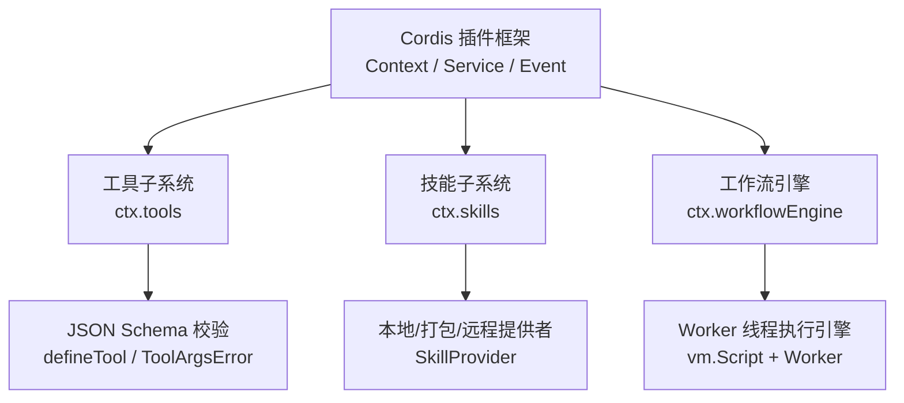
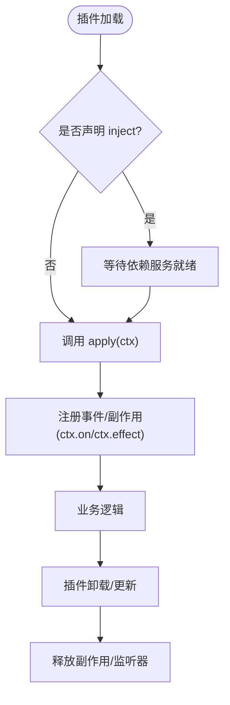
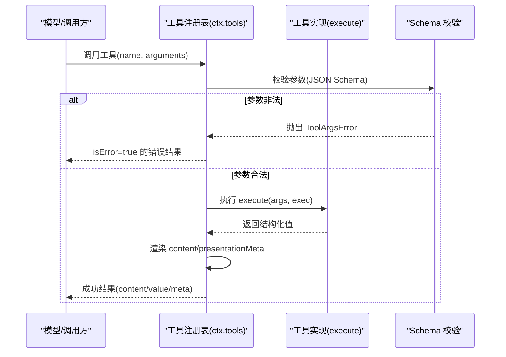
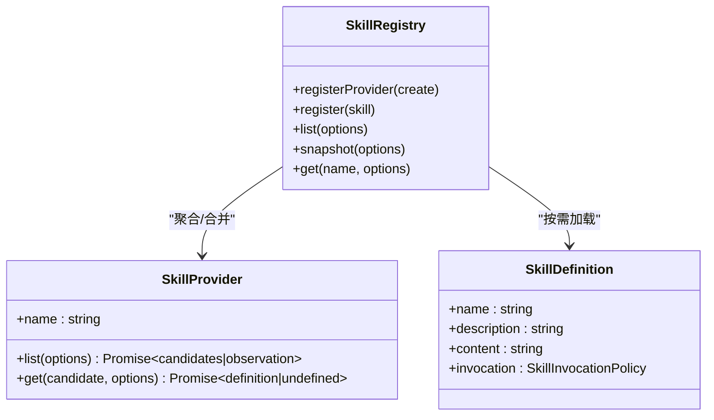
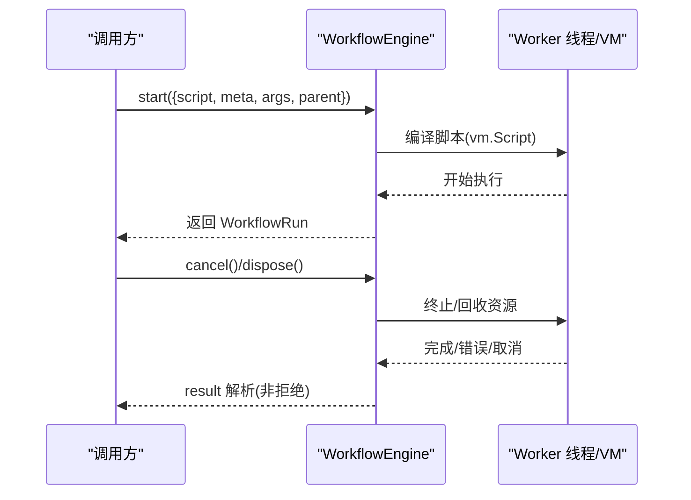
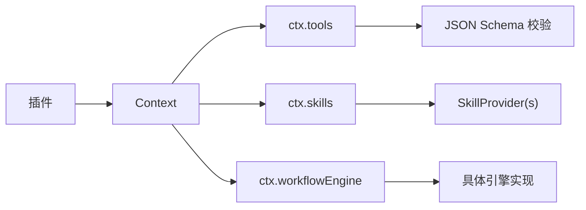

# 扩展开发

<cite>
**本文引用的文件**
- [docs/cordis-primer.md](file://docs/cordis-primer.md)
- [docs/cordis-tutorial/index.md](file://docs/cordis-tutorial/index.md)
- [docs/subsystems/tools.md](file://docs/subsystems/tools.md)
- [docs/subsystems/skills.md](file://docs/subsystems/skills.md)
- [docs/subsystems/workflow.md](file://docs/subsystems/workflow.md)
- [packages/core/tools/src/schema.ts](file://packages/core/tools/src/schema.ts)
- [packages/core/tools/tests/tools.spec.ts](file://packages/core/tools/tests/tools.spec.ts)
- [packages/skill/skill/src/index.ts](file://packages/skill/skill/src/index.ts)
- [packages/skill/skill/tests/skill.spec.ts](file://packages/skill/skill/tests/skill.spec.ts)
- [packages/skill/skill-filesystem/tests/skill-filesystem.spec.ts](file://packages/skill/skill-filesystem/tests/skill-filesystem.spec.ts)
- [packages/workflow/workflow/src/types.ts](file://packages/workflow/workflow/src/types.ts)
- [packages/workflow/workflow/src/runtime-types.ts](file://packages/workflow/workflow/src/runtime-types.ts)
- [packages/workflow/workflow/src/index.ts](file://packages/workflow/workflow/src/index.ts)
- [packages/workflow/workflow-worker-thread/src/runtime.ts](file://packages/workflow/workflow-worker-thread/src/runtime.ts)
- [packages/workflow/workflow-worker-thread/tests/workflow-worker-thread.spec.ts](file://packages/workflow/workflow-worker-thread/tests/workflow-worker-thread.spec.ts)
- [apps/cli/config/agent-presets/cordis/skills/cordis-plugin-development/SKILL.md](file://apps/cli/config/agent-presets/cordis/skills/cordis-plugin-development/SKILL.md)
- [docs/testing.md](file://docs/testing.md)
</cite>

## 目录
1. [简介](#简介)
2. [项目结构](#项目结构)
3. [核心组件](#核心组件)
4. [架构总览](#架构总览)
5. [详细组件分析](#详细组件分析)
6. [依赖关系分析](#依赖关系分析)
7. [性能考虑](#性能考虑)
8. [故障排查指南](#故障排查指南)
9. [结论](#结论)
10. [附录](#附录)

## 简介
本指南面向希望基于 DeepSeek Harness（简称 DSH）与 Cordis 插件框架进行扩展开发的工程师。内容覆盖：
- 插件结构与生命周期管理、依赖注入机制
- 自定义工具的定义、参数校验与错误处理
- 技能系统：发现、加载与执行
- 工作流引擎：脚本化工作流的定义与执行
- 完整示例与最佳实践
- 测试与调试技巧，确保扩展的稳定性与可靠性

DSH 将能力以插件形式组织，通过共享上下文（Context）暴露服务（Service）、事件（Event）和注册点（Slot/Provider），使扩展具备可组合、可替换、可观测的特性。

## 项目结构
仓库采用多包（monorepo）组织，关键目录与职责如下：
- docs：官方文档与子系统说明，包含 Cordis 入门、工具、技能、工作流等专题
- packages：核心功能包（tools、skill、workflow 等）
- apps：CLI/Web 应用入口与配置
- examples：示例工程与用例
- scripts：构建、验证、生成脚本

下图给出与本指南相关的顶层模块关系概览：



图表来源
- [docs/cordis-primer.md:7-13](file://docs/cordis-primer.md#L7-L13)
- [docs/subsystems/tools.md:9-12](file://docs/subsystems/tools.md#L9-L12)
- [docs/subsystems/skills.md:5-11](file://docs/subsystems/skills.md#L5-L11)
- [docs/subsystems/workflow.md:5-9](file://docs/subsystems/workflow.md#L5-L9)

章节来源
- [docs/cordis-primer.md:7-13](file://docs/cordis-primer.md#L7-L13)
- [docs/cordis-tutorial/index.md:13-46](file://docs/cordis-tutorial/index.md#L13-L46)

## 核心组件
- 插件与上下文：插件实现 Service，通过 Context 访问服务；使用 inject 声明强依赖，避免手动排序启动
- 工具子系统：提供 defineTool、参数 JSON Schema 校验、执行管线（pre-execute → execute → post-execute → result）
- 技能子系统：SkillRegistry 聚合多个 SkillProvider，支持本地/打包/远程来源，按层合并与缓存
- 工作流引擎：抽象接口 WorkflowEngine 由具体实现（如 worker-thread）提供，支持脚本运行、取消、资源清理

章节来源
- [docs/cordis-primer.md:7-13](file://docs/cordis-primer.md#L7-L13)
- [docs/subsystems/tools.md:9-12](file://docs/subsystems/tools.md#L9-L12)
- [docs/subsystems/skills.md:5-11](file://docs/subsystems/skills.md#L5-L11)
- [docs/subsystems/workflow.md:5-9](file://docs/subsystems/workflow.md#L5-L9)

## 架构总览
下图展示插件在 DSH 中的典型交互：插件通过 ctx 获取服务，注册工具/技能/监听器，并通过事件协作。

```mermaid
sequenceDiagram
participant P as "插件"
participant C as "Context"
participant T as "工具子系统(ctx.tools)"
participant S as "技能子系统(ctx.skills)"
participant W as "工作流引擎(ctx.workflowEngine)"
P->>C : 获取服务(如 tools/skills/workflowEngine)
P->>T : 注册工具(defineTool/register)
P->>S : 注册提供者(registerProvider)
P->>W : 启动工作流(start)
Note over P,T,S,W : 各子系统通过事件与管线协作
```

图表来源
- [docs/cordis-primer.md:7-13](file://docs/cordis-primer.md#L7-L13)
- [docs/subsystems/tools.md:478-570](file://docs/subsystems/tools.md#L478-L570)
- [docs/subsystems/skills.md:245-305](file://docs/subsystems/skills.md#L245-L305)
- [docs/subsystems/workflow.md:138-152](file://docs/subsystems/workflow.md#L138-L152)

## 详细组件分析

### 插件生命周期与依赖注入
- 插件是实现了 Service 的对象或函数，拥有可选 inject 与 apply(ctx)
- 通过 inject 声明强依赖，Cordis 会等待依赖就绪再激活插件
- 所有注册（事件监听、副作用）应通过 ctx.effect()/ctx.on() 管理，卸载时自动回滚



图表来源
- [docs/cordis-primer.md:7-13](file://docs/cordis-primer.md#L7-L13)
- [apps/cli/config/agent-presets/cordis/skills/cordis-plugin-development/SKILL.md:127-150](file://apps/cli/config/agent-presets/cordis/skills/cordis-plugin-development/SKILL.md#L127-L150)

章节来源
- [docs/cordis-primer.md:7-13](file://docs/cordis-primer.md#L7-L13)
- [apps/cli/config/agent-presets/cordis/skills/cordis-plugin-development/SKILL.md:100-150](file://apps/cli/config/agent-presets/cordis/skills/cordis-plugin-development/SKILL.md#L100-L150)

### 自定义工具：定义、参数校验与错误处理
- 使用 defineTool 声明工具名称、描述、参数 schema、输出 schema、execute 函数
- 参数通过 JSON Schema 严格校验，非法参数抛出 ToolArgsError（INVALID_ARGS）
- 执行结果经 finalizeContent/presentationMeta 渲染为模型可见内容
- 执行管线：tools/pre-execute → guards → tools/execute → tools/post-execute → finalizeContent → tools/result



图表来源
- [packages/core/tools/src/schema.ts:563-590](file://packages/core/tools/src/schema.ts#L563-L590)
- [docs/subsystems/tools.md:9-12](file://docs/subsystems/tools.md#L9-L12)
- [docs/subsystems/tools.md:170-173](file://docs/subsystems/tools.md#L170-L173)

章节来源
- [packages/core/tools/src/schema.ts:563-590](file://packages/core/tools/src/schema.ts#L563-L590)
- [packages/core/tools/tests/tools.spec.ts:2569-2613](file://packages/core/tools/tests/tools.spec.ts#L2569-L2613)
- [docs/subsystems/tools.md:9-12](file://docs/subsystems/tools.md#L9-L12)
- [docs/subsystems/tools.md:170-173](file://docs/subsystems/tools.md#L170-L173)

### 技能系统：发现、加载与执行
- 技能提供者（SkillProvider）负责列出候选（list）与加载完整定义（get）
- 注册层级：全局层 + 每作用域层，最近层优先；同层内按 rank/provider 顺序决定重复项
- 支持本地、打包、远程等多种来源；变更通过 skills/change 事件通知
- 消费端通过 ctx.skills.list/snapshot/get 获取技能摘要与正文，并受 invocation 策略控制



图表来源
- [docs/subsystems/skills.md:9-17](file://docs/subsystems/skills.md#L9-L17)
- [docs/subsystems/skills.md:245-305](file://docs/subsystems/skills.md#L245-L305)
- [packages/skill/skill/src/index.ts:492-517](file://packages/skill/skill/src/index.ts#L492-L517)

章节来源
- [docs/subsystems/skills.md:9-17](file://docs/subsystems/skills.md#L9-L17)
- [docs/subsystems/skills.md:64-82](file://docs/subsystems/skills.md#L64-L82)
- [docs/subsystems/skills.md:92-178](file://docs/subsystems/skills.md#L92-L178)
- [packages/skill/skill/src/index.ts:492-517](file://packages/skill/skill/src/index.ts#L492-L517)
- [packages/skill/skill/tests/skill.spec.ts:654-678](file://packages/skill/skill/tests/skill.spec.ts#L654-L678)
- [packages/skill/skill-filesystem/tests/skill-filesystem.spec.ts:570-599](file://packages/skill/skill-filesystem/tests/skill-filesystem.spec.ts#L570-L599)

### 工作流引擎：脚本化工作流的定义与执行
- 工作流通过 ctx.workflowEngine.start(request) 启动，request 包含 script、meta、args、parent 等
- 引擎实现（如 worker-thread）在隔离环境中编译并执行脚本，支持取消与有界结算
- 运行句柄 WorkflowRun 提供 cancel/dispose 与 result 承诺；result 永不拒绝，失败以 stopReason 表达
- 事件 workflow/start/end/phase/log/agent-start/agent-end 用于观察执行过程



图表来源
- [docs/subsystems/workflow.md:11-37](file://docs/subsystems/workflow.md#L11-L37)
- [docs/subsystems/workflow.md:93-112](file://docs/subsystems/workflow.md#L93-L112)
- [packages/workflow/workflow/src/types.ts:65-95](file://packages/workflow/workflow/src/types.ts#L65-L95)
- [packages/workflow/workflow/src/runtime-types.ts:36-49](file://packages/workflow/workflow/src/runtime-types.ts#L36-L49)
- [packages/workflow/workflow-worker-thread/src/runtime.ts:75-98](file://packages/workflow/workflow-worker-thread/src/runtime.ts#L75-L98)

章节来源
- [docs/subsystems/workflow.md:11-37](file://docs/subsystems/workflow.md#L11-L37)
- [docs/subsystems/workflow.md:93-112](file://docs/subsystems/workflow.md#L93-L112)
- [packages/workflow/workflow/src/types.ts:65-95](file://packages/workflow/workflow/src/types.ts#L65-L95)
- [packages/workflow/workflow/src/runtime-types.ts:36-49](file://packages/workflow/workflow/src/runtime-types.ts#L36-L49)
- [packages/workflow/workflow/src/index.ts:134-168](file://packages/workflow/workflow/src/index.ts#L134-L168)
- [packages/workflow/workflow-worker-thread/src/runtime.ts:75-98](file://packages/workflow/workflow-worker-thread/src/runtime.ts#L75-L98)
- [packages/workflow/workflow-worker-thread/tests/workflow-worker-thread.spec.ts:163-175](file://packages/workflow/workflow-worker-thread/tests/workflow-worker-thread.spec.ts#L163-L175)
- [packages/workflow/workflow-worker-thread/tests/workflow-worker-thread.spec.ts:800-819](file://packages/workflow/workflow-worker-thread/tests/workflow-worker-thread.spec.ts#L800-L819)

### 开发示例与最佳实践
- 第一个插件：导出 name 与 apply(ctx)，在 cordis.yml 中注册，通过 Loader 挂载
- 生命周期与副作用：使用 ctx.effect()/ctx.on() 注册，确保卸载时清理
- 服务与依赖：通过 ctx.get(name) 读取可选能力，inject 声明强依赖
- 工具与技能：遵循各自子系统的契约与校验规则，保证幂等与可观测
- 工作流：合理设置 meta/phases，使用 cancel/dispose 管理资源

章节来源
- [docs/cordis-tutorial/index.md:13-46](file://docs/cordis-tutorial/index.md#L13-L46)
- [docs/cordis-tutorial/index.md:38-46](file://docs/cordis-tutorial/index.md#L38-L46)
- [apps/cli/config/agent-presets/cordis/skills/cordis-plugin-development/SKILL.md:61-193](file://apps/cli/config/agent-presets/cordis/skills/cordis-plugin-development/SKILL.md#L61-L193)

## 依赖关系分析
- 插件对服务的耦合通过 Context 键名解耦，降低直接 import 带来的紧耦合
- 工具子系统依赖 JSON Schema 校验与执行管线，对外暴露稳定 API
- 技能子系统聚合多个 Provider，内部维护层级、缓存与失效策略
- 工作流引擎抽象出 start 接口，具体实现屏蔽执行细节（如 VM/Worker）



图表来源
- [docs/cordis-primer.md:7-13](file://docs/cordis-primer.md#L7-L13)
- [docs/subsystems/tools.md:9-12](file://docs/subsystems/tools.md#L9-L12)
- [docs/subsystems/skills.md:9-17](file://docs/subsystems/skills.md#L9-L17)
- [docs/subsystems/workflow.md:5-9](file://docs/subsystems/workflow.md#L5-L9)

章节来源
- [docs/cordis-primer.md:7-13](file://docs/cordis-primer.md#L7-L13)
- [docs/subsystems/tools.md:9-12](file://docs/subsystems/tools.md#L9-L12)
- [docs/subsystems/skills.md:9-17](file://docs/subsystems/skills.md#L9-L17)
- [docs/subsystems/workflow.md:5-9](file://docs/subsystems/workflow.md#L5-L9)

## 性能考虑
- 工具执行：合理使用 timeoutMs，配合信号取消，避免长时间阻塞
- 技能发现：利用缓存与不完整快照，避免频繁全量刷新；关注变更事件
- 工作流执行：使用 cancel/dispose 及时释放资源；避免无限循环或无界等待
- 事件分发：选择合适的事件模式（emit/waterfall/parallel/serial），减少不必要开销

[本节为通用指导，不直接分析具体文件]

## 故障排查指南
- 工具参数错误：检查 defineTool 的 parameters/output 定义；捕获 ToolArgsError（INVALID_ARGS）
- 技能不可用：确认 provider list/get 是否正确；查看 skills/change 事件；检查 cwd/scope 影响
- 工作流卡死：调用 dispose() 确保有界结算；检查脚本是否响应取消信号
- 插件未加载：核对 cordis.yml 配置与模块路径；使用 Loader 诊断信息定位问题

章节来源
- [packages/core/tools/tests/tools.spec.ts:2569-2613](file://packages/core/tools/tests/tools.spec.ts#L2569-L2613)
- [packages/skill/skill/tests/skill.spec.ts:654-678](file://packages/skill/skill/tests/skill.spec.ts#L654-L678)
- [packages/skill/skill-filesystem/tests/skill-filesystem.spec.ts:570-599](file://packages/skill/skill-filesystem/tests/skill-filesystem.spec.ts#L570-L599)
- [packages/workflow/workflow-worker-thread/tests/workflow-worker-thread.spec.ts:800-819](file://packages/workflow/workflow-worker-thread/tests/workflow-worker-thread.spec.ts#L800-L819)

## 结论
通过 Cordis 插件框架，DeepSeek Harness 提供了可扩展、可组合、可观测的扩展体系。开发者可以：
- 以插件形式封装能力，借助 Context 与 Service 解耦依赖
- 使用工具子系统提供稳定的模型可调能力，并保障参数与输出安全
- 通过技能系统灵活集成指令与资源，支持多种来源与策略
- 利用工作流引擎编排复杂任务，具备取消与资源管理能力
结合完善的测试与调试策略，可构建高质量、高可靠的扩展。

[本节为总结性内容，不直接分析具体文件]

## 附录
- 快速上手：参考 Cordis 教程章节，从“你的第一个插件”到“进入 harness”逐步实践
- 测试策略：遵循单元测试、覆盖率门控、真实 API e2e、快照测试与 Web 浏览器快照的多层策略
- 调试技巧：利用事件与日志，结合错误链渲染，定位深层问题

章节来源
- [docs/cordis-tutorial/index.md:38-46](file://docs/cordis-tutorial/index.md#L38-L46)
- [docs/testing.md:7-15](file://docs/testing.md#L7-L15)
- [docs/testing.md:17-35](file://docs/testing.md#L17-L35)