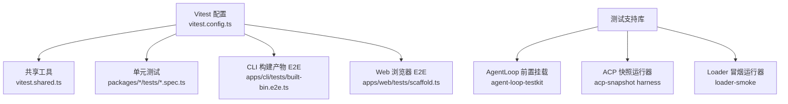
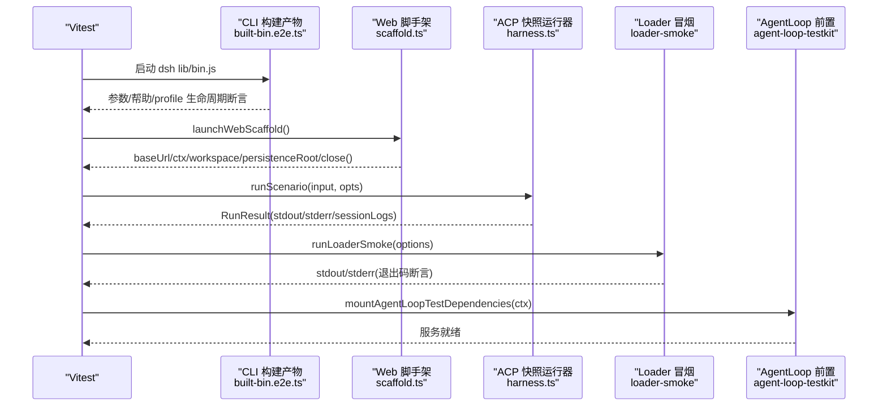
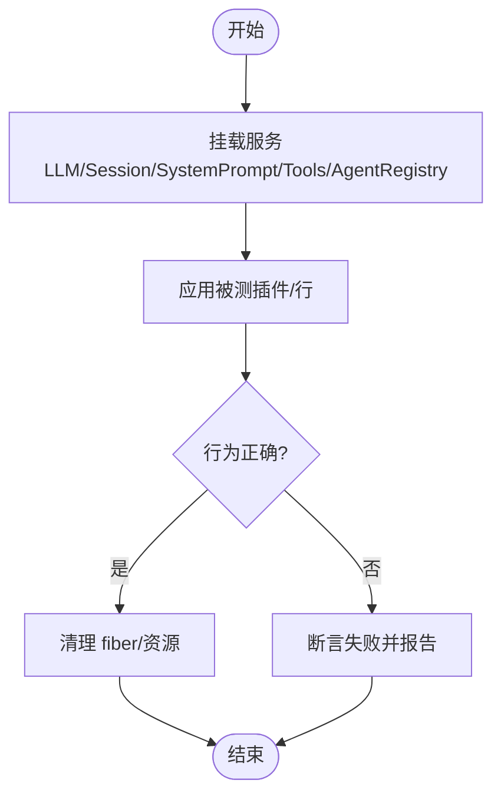
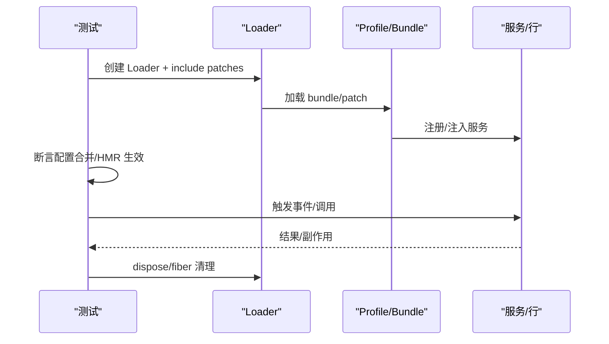
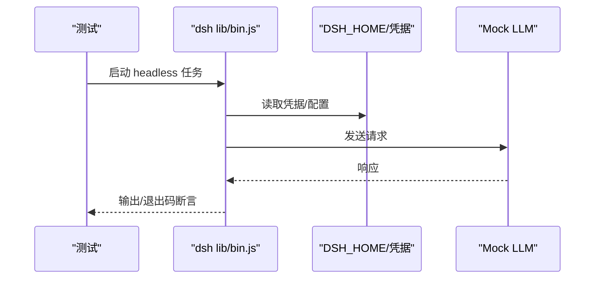
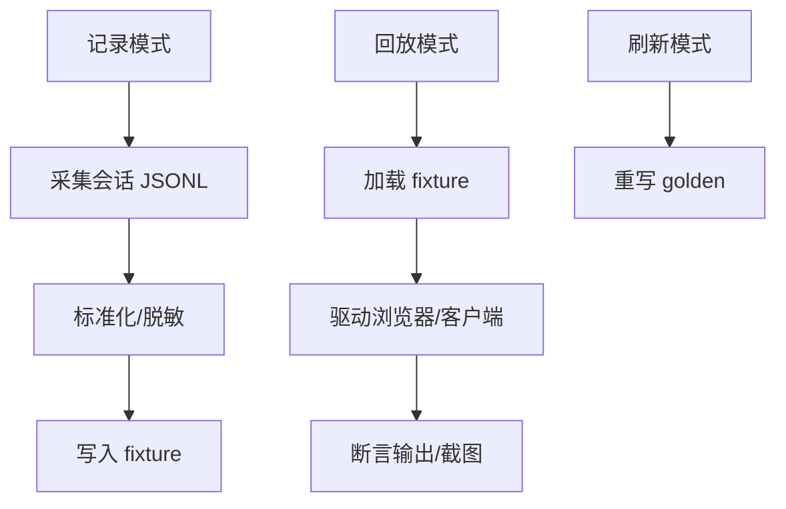
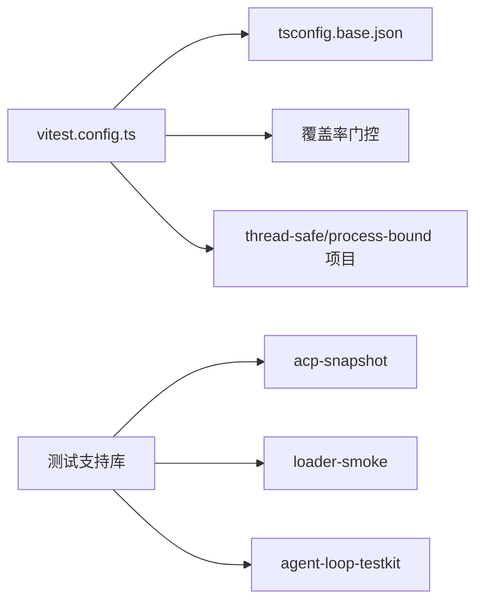

# 扩展测试

<cite>
**本文引用的文件**
- [apps/cli/tests/built-bin.e2e.ts](file://apps/cli/tests/built-bin.e2e.ts)
- [apps/web/tests/scaffold.ts](file://apps/web/tests/scaffold.ts)
- [packages/test-support/agent-loop-testkit/src/index.ts](file://packages/test-support/agent-loop-testkit/src/index.ts)
- [packages/test-support/acp-snapshot/src/harness.ts](file://packages/test-support/acp-snapshot/src/harness.ts)
- [packages/test-support/loader-smoke/src/index.ts](file://packages/test-support/loader-smoke/src/index.ts)
- [vitest.config.ts](file://vitest.config.ts)
- [vitest.shared.ts](file://vitest.shared.ts)
- [docs/testing.md](file://docs/testing.md)
</cite>

## 目录
1. [简介](#简介)
2. [项目结构](#项目结构)
3. [核心组件](#核心组件)
4. [架构总览](#架构总览)
5. [详细组件分析](#详细组件分析)
6. [依赖关系分析](#依赖关系分析)
7. [性能考虑](#性能考虑)
8. [故障排查指南](#故障排查指南)
9. [结论](#结论)
10. [附录](#附录)

## 简介
本指南面向 DeepSeek Harness 的扩展测试，覆盖单元测试、集成测试、端到端（E2E）测试与快照测试。重点包括：
- 如何模拟 Cordis 上下文、验证插件生命周期与服务行为
- 多插件交互、事件流与配置验证的集成测试策略
- E2E 环境准备、测试数据管理与断言方法
- 快照测试在 UI、配置文件与输出格式稳定性上的应用
- 最佳实践：用例设计、覆盖率要求与持续集成
- 调试技巧：定位不稳定与偶发失败

## 项目结构
仓库采用分层测试组织：
- 单元测试：位于各包 tests 目录，使用 Vitest；通过 vitest.config.ts 统一解析路径、隔离进程与覆盖率门控
- 集成测试：以 Loader 启动真实组合，验证服务装配、配置合并与 HMR 热重载
- E2E 测试：CLI 构建产物验收、Web 浏览器回放与截图对比
- 快照测试：ACP JSON-RPC 会话回放、Web GUI 浏览器快照、JSONL 会话日志

**图示来源**
- [vitest.config.ts:117-159](file://vitest.config.ts#L117-L159)
- [vitest.shared.ts:15-42](file://vitest.shared.ts#L15-L42)
- [apps/cli/tests/built-bin.e2e.ts:312-395](file://apps/cli/tests/built-bin.e2e.ts#L312-L395)
- [apps/web/tests/scaffold.ts:294-580](file://apps/web/tests/scaffold.ts#L294-L580)
- [packages/test-support/agent-loop-testkit/src/index.ts:37-46](file://packages/test-support/agent-loop-testkit/src/index.ts#L37-L46)
- [packages/test-support/acp-snapshot/src/harness.ts:225-373](file://packages/test-support/acp-snapshot/src/harness.ts#L225-L373)
- [packages/test-support/loader-smoke/src/index.ts:174-212](file://packages/test-support/loader-smoke/src/index.ts#L174-L212)

**章节来源**
- [vitest.config.ts:117-159](file://vitest.config.ts#L117-L159)
- [vitest.shared.ts:15-42](file://vitest.shared.ts#L15-L42)
- [docs/testing.md:7-15](file://docs/testing.md#L7-L15)

## 核心组件
- 测试执行与覆盖率门控：Vitest 双项目（线程安全/进程绑定），v8 覆盖率 100% 门控，按平台与 pwsh 可用性豁免
- CLI 构建产物验收：直接调用 lib/bin.js，验证参数路由、profile 生命周期、头信息打印、错误退出码
- Web 浏览器 E2E 脚手架：基于真实 web 组合，注入 replay/record/refresh 模式，临时工作区与持久化根，会话播种与回放
- AgentLoop 测试前置：挂载 LLM、SessionStore、SystemPrompt、ToolRuntime、AgentRegistry
- ACP 快照运行器：子进程驱动真实 agent，输入脚本驱动步骤，采集 stdout 与会话 JSONL，回放/录制/刷新
- Loader 冒烟运行器：src/lib 双模式启动真实 cordis.yml，隔离 cwd，超时与退出码断言

**章节来源**
- [vitest.config.ts:160-283](file://vitest.config.ts#L160-L283)
- [apps/cli/tests/built-bin.e2e.ts:17-39](file://apps/cli/tests/built-bin.e2e.ts#L17-L39)
- [apps/web/tests/scaffold.ts:294-580](file://apps/web/tests/scaffold.ts#L294-L580)
- [packages/test-support/agent-loop-testkit/src/index.ts:37-46](file://packages/test-support/agent-loop-testkit/src/index.ts#L37-L46)
- [packages/test-support/acp-snapshot/src/harness.ts:225-373](file://packages/test-support/acp-snapshot/src/harness.ts#L225-L373)
- [packages/test-support/loader-smoke/src/index.ts:174-212](file://packages/test-support/loader-smoke/src/index.ts#L174-L212)

## 架构总览
下图展示从测试入口到被测系统的调用链：Vitest 驱动 CLI/Web/ACP/Loader 等子系统，配合测试支持库完成环境准备、回放与断言。

**图示来源**
- [apps/cli/tests/built-bin.e2e.ts:312-395](file://apps/cli/tests/built-bin.e2e.ts#L312-L395)
- [apps/web/tests/scaffold.ts:294-580](file://apps/web/tests/scaffold.ts#L294-L580)
- [packages/test-support/acp-snapshot/src/harness.ts:225-373](file://packages/test-support/acp-snapshot/src/harness.ts#L225-L373)
- [packages/test-support/loader-smoke/src/index.ts:174-212](file://packages/test-support/loader-smoke/src/index.ts#L174-L212)
- [packages/test-support/agent-loop-testkit/src/index.ts:37-46](file://packages/test-support/agent-loop-testkit/src/index.ts#L37-L46)

## 详细组件分析

### 单元测试：模拟 Cordis 上下文、插件生命周期与服务行为
- 使用 AgentLoop 测试前置挂载必要服务，保持对加载顺序与拓扑的控制，便于聚焦被测逻辑
- 通过 Context 提供/获取服务，验证插件 effect/dispose 清理、HMR 安全与资源释放
- 结合 Vitest 双项目隔离进程边界，避免全局状态污染

**图示来源**
- [packages/test-support/agent-loop-testkit/src/index.ts:37-46](file://packages/test-support/agent-loop-testkit/src/index.ts#L37-L46)
- [vitest.config.ts:126-158](file://vitest.config.ts#L126-L158)

**章节来源**
- [packages/test-support/agent-loop-testkit/src/index.ts:37-46](file://packages/test-support/agent-loop-testkit/src/index.ts#L37-L46)
- [vitest.config.ts:126-158](file://vitest.config.ts#L126-L158)

### 集成测试：多插件交互、事件流与配置验证
- 通过 Loader 启动真实 cordis.yml，验证配置层叠加、HMR 热重载与行级替换
- 使用 CLI 构建产物 e2e 验证 profile 生命周期：ready/settled/disposed、信号中断、patch overlay 重放
- 使用 Web 脚手架注入 replay/record/refresh，验证会话播种、服务装配、工具呈现与持久化

**图示来源**
- [apps/cli/tests/built-bin.e2e.ts:496-546](file://apps/cli/tests/built-bin.e2e.ts#L496-L546)
- [apps/web/tests/scaffold.ts:365-491](file://apps/web/tests/scaffold.ts#L365-L491)

**章节来源**
- [apps/cli/tests/built-bin.e2e.ts:496-546](file://apps/cli/tests/built-bin.e2e.ts#L496-L546)
- [apps/web/tests/scaffold.ts:365-491](file://apps/web/tests/scaffold.ts#L365-L491)

### 端到端测试：环境准备、数据管理与断言
- CLI 构建产物验收：直接调用 lib/bin.js，验证 --help/--version、profile 缺失提示、headless 任务、环境变量与凭据读取、patch 启动失败不挂起
- Web 浏览器 E2E：launchWebScaffold 初始化临时工作区与持久化根，注入 replay/record/refresh，播种会话，等待 turn/end 并 flush，关闭时校验回放消费
- ACP 快照：runScenario 驱动子进程，输入脚本控制步骤，采集 stdout 与会话 JSONL，回放/录制/刷新三种模式

**图示来源**
- [apps/cli/tests/built-bin.e2e.ts:370-395](file://apps/cli/tests/built-bin.e2e.ts#L370-L395)
- [apps/cli/tests/built-bin.e2e.ts:420-458](file://apps/cli/tests/built-bin.e2e.ts#L420-L458)

**章节来源**
- [apps/cli/tests/built-bin.e2e.ts:312-395](file://apps/cli/tests/built-bin.e2e.ts#L312-L395)
- [apps/cli/tests/built-bin.e2e.ts:420-458](file://apps/cli/tests/built-bin.e2e.ts#L420-L458)

### 快照测试：UI、配置文件与输出格式稳定性
- ACP 快照：input.json 描述步骤，harness 驱动子进程，采集 stdout 与 session.jsonl，normalize 后比对；record 模式写入 fixture，refresh 模式重写 golden
- Web 浏览器快照：replay 模式禁用模型调用，注入 route-only adapter；record 模式需要密钥并采集会话；CI 强制只读回放
- 会话种子：seedSession/seedBlankSession 通过真实后端 API 写入，保证编码一致性与完整性

**图示来源**
- [packages/test-support/acp-snapshot/src/harness.ts:225-373](file://packages/test-support/acp-snapshot/src/harness.ts#L225-L373)
- [apps/web/tests/scaffold.ts:294-330](file://apps/web/tests/scaffold.ts#L294-L330)
- [apps/web/tests/scaffold.ts:651-735](file://apps/web/tests/scaffold.ts#L651-L735)

**章节来源**
- [packages/test-support/acp-snapshot/src/harness.ts:225-373](file://packages/test-support/acp-snapshot/src/harness.ts#L225-L373)
- [apps/web/tests/scaffold.ts:294-330](file://apps/web/tests/scaffold.ts#L294-L330)
- [apps/web/tests/scaffold.ts:651-735](file://apps/web/tests/scaffold.ts#L651-L735)

### 插件生命周期与 HMR 验证
- CLI 构建产物 e2e 验证 profile 生命周期：ready/settled/disposed 标记文件出现，patch 编辑触发热重载，移除 patch 回退默认值，信号中断正常退出
- Web 脚手架在 record/replay/refresh 模式下分别处理模型适配与凭证遮蔽，确保回放一致性

**章节来源**
- [apps/cli/tests/built-bin.e2e.ts:496-546](file://apps/cli/tests/built-bin.e2e.ts#L496-L546)
- [apps/web/tests/scaffold.ts:294-330](file://apps/web/tests/scaffold.ts#L294-L330)

## 依赖关系分析
- Vitest 配置将源码导入映射到 tsconfig.base.json，避免加载已构建产物导致单例重复
- 进程绑定测试单独项目隔离，避免全局状态干扰
- 覆盖率门控按文件 100%，排除类型/入口/特定客户端区域，pwsh 缺失时豁免相关包
- 测试支持库解耦具体场景：ACP 快照、Loader 冒烟、AgentLoop 前置挂载

**图示来源**
- [vitest.config.ts:15-19](file://vitest.config.ts#L15-L19)
- [vitest.config.ts:126-158](file://vitest.config.ts#L126-L158)
- [vitest.config.ts:160-283](file://vitest.config.ts#L160-L283)

**章节来源**
- [vitest.config.ts:15-19](file://vitest.config.ts#L15-L19)
- [vitest.config.ts:126-158](file://vitest.config.ts#L126-L158)
- [vitest.config.ts:160-283](file://vitest.config.ts#L160-L283)

## 性能考虑
- 使用 fork 池隔离进程绑定测试，避免 worker 线程在部分 Node 版本下的崩溃
- 覆盖率统计仅针对 packages/*/src，排除类型/入口/客户端债务区域，缩短 CI 时间
- 回放/录制模式减少外部依赖，提升稳定性与速度

[本节为通用指导，无需引用具体文件]

## 故障排查指南
- 超时与挂起：CLI 构建产物 e2e 设置超时与 SIGKILL，捕获 stdout/stderr；Loader 冒烟同样具备超时与退出码断言
- 回放未消费：Web 脚手架 close 前调用 replayHandle.assertConsumed，未完全消费会抛出错误
- 权限请求错配：ACP 快照 harness 捕获脚本侧权限选择错误，返回 cancelled 并在步骤循环中失败
- 环境隔离：Web 脚手架重置 DSH_HOME/AGENTS_HOME/BUNDLED_SKILL_DIR，避免污染用户目录
- 覆盖率豁免：pwsh 缺失时豁免 shell 相关包，确保本地绿色；CI 有 pwsh 则全量覆盖

**章节来源**
- [apps/cli/tests/built-bin.e2e.ts:17-39](file://apps/cli/tests/built-bin.e2e.ts#L17-L39)
- [packages/test-support/loader-smoke/src/index.ts:174-212](file://packages/test-support/loader-smoke/src/index.ts#L174-L212)
- [apps/web/tests/scaffold.ts:607-624](file://apps/web/tests/scaffold.ts#L607-L624)
- [packages/test-support/acp-snapshot/src/harness.ts:261-293](file://packages/test-support/acp-snapshot/src/harness.ts#L261-L293)
- [vitest.config.ts:71-83](file://vitest.config.ts#L71-L83)

## 结论
DeepSeek Harness 的测试体系围绕“真实实现优先”的原则，通过 CLI 构建产物验收、Web 浏览器回放、ACP 快照与 Loader 冒烟，形成从单元到 E2E 的全链路保障。配合严格的覆盖率门控与环境隔离，既能快速发现回归，又能稳定复现问题。建议在新功能规划阶段即明确覆盖层级与可观测点，确保测试可表达、可断言、可回放。

[本节为总结性内容，无需引用具体文件]

## 附录
- 测试策略与命令：参考仓库文档中的分层测试说明与命令约定
- 关键实践要点
  - 优先真实实现，仅对昂贵/非确定性边界做 mock
  - 用外部世界验证而非自报告
  - 测试真实入口路径（构建产物）
  - 快照测试用于协议/呈现/持久化日志的稳定性
  - 用例设计关注边缘、错误路径、事件顺序、并发竞态与永久回归

**章节来源**
- [docs/testing.md:17-49](file://docs/testing.md#L17-L49)