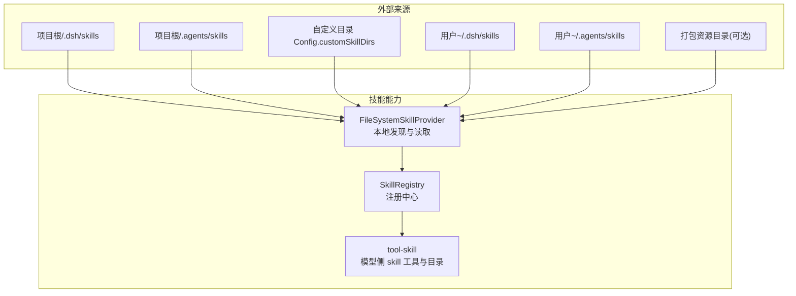
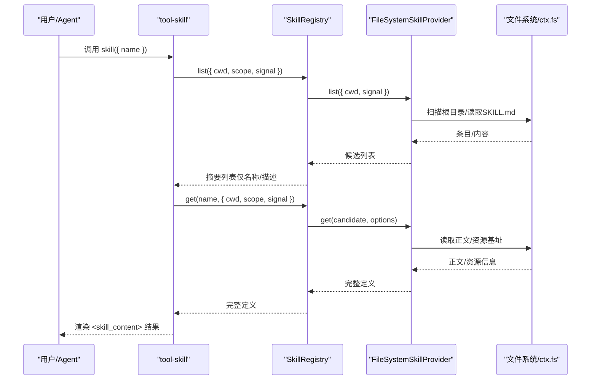
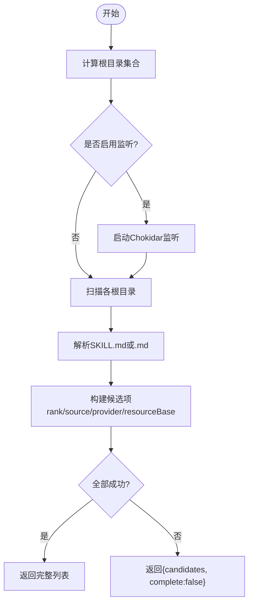
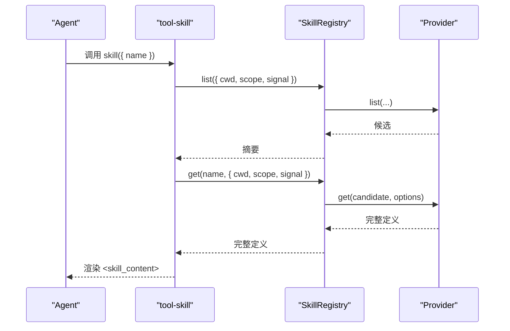
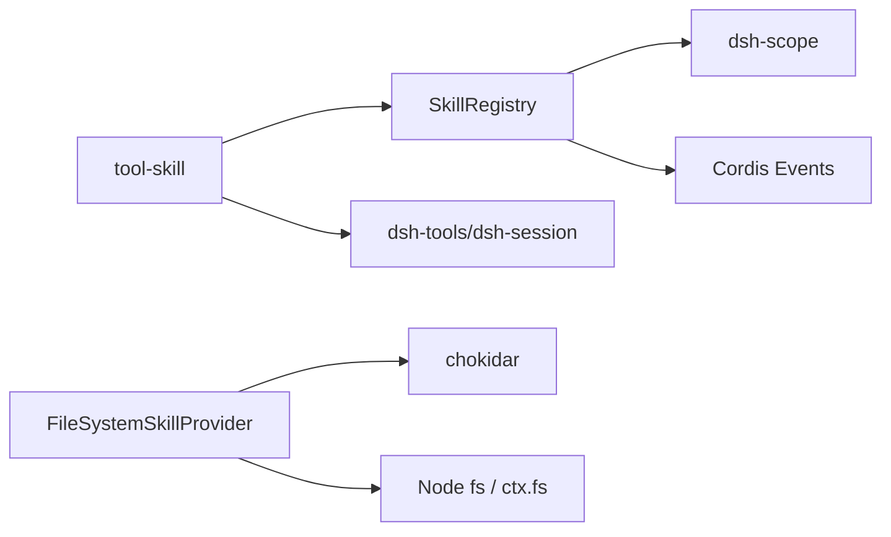

# 技能开发

<cite>
**本文引用的文件**
- [packages/skill/skill/src/index.ts](file://packages/skill/skill/src/index.ts)
- [packages/skill/skill-filesystem/src/index.ts](file://packages/skill/skill-filesystem/src/index.ts)
- [packages/skill/tool-skill/src/index.ts](file://packages/skill/tool-skill/src/index.ts)
- [docs/subsystems/skills.md](file://docs/subsystems/skills.md)
- [apps/cli/config/agent-presets/cordis/skills/cordis-plugin-development/SKILL.md](file://apps/cli/config/agent-presets/cordis/skills/cordis-plugin-development/SKILL.md)
- [apps/cli/config/agent-presets/cordis/skills/editing-cordis-compositions/SKILL.md](file://apps/cli/config/agent-presets/cordis/skills/editing-cordis-compositions/SKILL.md)
- [packages/skill/skill/tests/skill.spec.ts](file://packages/skill/skill/tests/skill.spec.ts)
</cite>

## 目录
1. [简介](#简介)
2. [项目结构](#项目结构)
3. [核心组件](#核心组件)
4. [架构总览](#架构总览)
5. [详细组件分析](#详细组件分析)
6. [依赖关系分析](#依赖关系分析)
7. [性能考虑](#性能考虑)
8. [故障排查指南](#故障排查指南)
9. [结论](#结论)
10. [附录](#附录)

## 简介
本指南面向 DeepSeek Harness 的技能系统开发者，系统性说明技能的发现与加载机制、目录结构与元数据定义、版本管理策略、执行上下文（工作区、会话状态、用户输入）、与 Agent 的集成方式（调用协议、参数传递、结果处理）、生命周期管理（初始化、执行、清理），并提供从简单提示词模板到复杂交互式技能的完整示例，以及测试与调试方法，确保技能的正确性与用户体验。

## 项目结构
技能能力由多个包协作完成：
- 服务定义与注册中心：SkillRegistry（dsh-skill）
- 本地文件系统提供者：FileSystemSkillProvider（dsh-skill-filesystem）
- 模型侧工具与持久化目录：skill 工具与目录消息（dsh-tool-skill）
- 示例技能：位于 CLI 预设下的 skills 目录

图表来源
- [packages/skill/skill/src/index.ts:357-661](file://packages/skill/skill/src/index.ts#L357-L661)
- [packages/skill/skill-filesystem/src/index.ts:130-262](file://packages/skill/skill-filesystem/src/index.ts#L130-L262)
- [packages/skill/tool-skill/src/index.ts:77-252](file://packages/skill/tool-skill/src/index.ts#L77-L252)

章节来源
- [docs/subsystems/skills.md:9-82](file://docs/subsystems/skills.md#L9-L82)
- [packages/skill/skill/src/index.ts:357-661](file://packages/skill/skill/src/index.ts#L357-L661)
- [packages/skill/skill-filesystem/src/index.ts:130-262](file://packages/skill/skill-filesystem/src/index.ts#L130-L262)
- [packages/skill/tool-skill/src/index.ts:77-252](file://packages/skill/tool-skill/src/index.ts#L77-L252)

## 核心组件
- SkillRegistry（注册中心）
  - 提供 registerProvider/register/list/snapshot/get 等 API
  - 维护分层作用域（全局层 + 每作用域链），合并并去重候选项
  - 缓存收集结果，支持不完整观察与失效事件
- FileSystemSkillProvider（本地提供者）
  - 扫描多优先级根目录，解析 SKILL.md 或 .md 文件
  - 使用 Chokidar 监听变更，触发目录失效
  - 通过 ctx.fs 或 Node fs 读取内容，返回 resourceBase
- tool-skill（模型侧集成）
  - 注册 skill 工具，校验名称、策略、加载完整定义
  - 在 agent/pre-step 注入持久化的可用技能目录消息
  - 支持用户显式手势 /name 直接注入技能内容

章节来源
- [packages/skill/skill/src/index.ts:357-661](file://packages/skill/skill/src/index.ts#L357-L661)
- [packages/skill/skill-filesystem/src/index.ts:130-262](file://packages/skill/skill-filesystem/src/index.ts#L130-L262)
- [packages/skill/tool-skill/src/index.ts:77-252](file://packages/skill/tool-skill/src/index.ts#L77-L252)

## 架构总览
技能系统采用“提供者-注册中心-消费者”的分层架构：
- 提供者负责发现与加载（本地、远程、打包等）
- 注册中心统一合并、排序、缓存、失效通知
- 消费者（如 tool-skill）基于策略选择可见性，渲染目录与工具结果

图表来源
- [packages/skill/tool-skill/src/index.ts:127-156](file://packages/skill/tool-skill/src/index.ts#L127-L156)
- [packages/skill/skill/src/index.ts:471-518](file://packages/skill/skill/src/index.ts#L471-L518)
- [packages/skill/skill-filesystem/src/index.ts:182-222](file://packages/skill/skill-filesystem/src/index.ts#L182-L222)

## 详细组件分析

### 技能发现与加载（本地提供者）
- 根目录优先级（从高到低）
  - project-dsh: <projectRoot>/.dsh/skills
  - project-agents: <projectRoot>/.agents/skills
  - custom: Config.customSkillDirs
  - user-dsh: <dshHome>/skills（跳过 .system）
  - user-agents: <agentsHome>/skills
  - bundled: 配置或环境变量指定的打包目录
- 识别规则
  - 目录 bundle：<name>/SKILL.md
  - 扁平文件：<name>.md
  - 不支持递归 **/SKILL.md
- 监听与失效
  - 使用 Chokidar 监控根目录变化
  - 首次失败降级为“不完整观察”，仍允许直接加载可用候选
  - 主机写入/编辑事件触发失效，避免脏读

图表来源
- [packages/skill/skill-filesystem/src/index.ts:182-222](file://packages/skill/skill-filesystem/src/index.ts#L182-L222)
- [packages/skill/skill-filesystem/src/index.ts:241-262](file://packages/skill/skill-filesystem/src/index.ts#L241-L262)
- [packages/skill/skill-filesystem/src/index.ts:719-747](file://packages/skill/skill-filesystem/src/index.ts#L719-L747)

章节来源
- [docs/subsystems/skills.md:64-86](file://docs/subsystems/skills.md#L64-L86)
- [packages/skill/skill-filesystem/src/index.ts:130-262](file://packages/skill/skill-filesystem/src/index.ts#L130-L262)

### 技能身份、元数据与版本管理
- 技能名称：kebab-case 正则约束
- 元数据
  - 摘要：name、description、whenToUse
  - 策略：invocation.modelInvocable、invocation.userInvocable
  - 来源：source（project-dsh、user-dsh、bundled 等）
  - 资源基址：resourceBase（directory/url/opaque）
  - 路径与元对象：path、metadata
- 版本管理
  - 注册中心不缓存完整定义，每次 get() 重新加载最新内容
  - 若加载后的 name 与候选不一致，则失效对应条目并重试发现
  - 运行时注册（register）可覆盖同层同名技能，优先于用户层

章节来源
- [packages/skill/skill/src/index.ts:20-120](file://packages/skill/skill/src/index.ts#L20-L120)
- [packages/skill/skill/src/index.ts:440-461](file://packages/skill/skill/src/index.ts#L440-L461)
- [packages/skill/skill/src/index.ts:501-518](file://packages/skill/skill/src/index.ts#L501-L518)

### 执行上下文与工作区/会话/用户输入
- 工作区选择
  - 通过 SkillLookupOptions.cwd 指定当前工作区，影响本地提供者根定位
- 会话与作用域
  - 通过 SkillViewOptions.scope 指定查看作用域（通常为调用 Agent），实现分层覆盖
- 取消与超时
  - 所有 provider.list/get 均接收 AbortSignal，支持请求级取消
- 用户输入
  - tool-skill 支持用户显式手势 /name 直接注入技能内容（instructions 形式）
  - 仅在 source.kind === 'user' 的消息中扫描，防止伪造

章节来源
- [packages/skill/skill/src/index.ts:103-120](file://packages/skill/skill/src/index.ts#L103-L120)
- [packages/skill/tool-skill/src/index.ts:177-204](file://packages/skill/tool-skill/src/index.ts#L177-L204)

### 与 Agent 的集成（调用协议、参数、结果）
- 工具注册
  - tool-skill 注册 skill 工具，参数 name 必须为合法技能名
- 可见性控制
  - 仅当该 Agent 可见到该工具时，才发布持久化目录消息
- 参数传递
  - 通过 exec.agent.session.header.cwd 传入工作区
  - 通过 exec.signal 传递取消信号
  - 通过 exec.agent 作为作用域键
- 结果处理
  - 工具输出渲染为 <skill_content>，包含 name、provider、resourceBase、content
  - 目录消息以 <available_skills> 呈现，仅含名称与描述

图表来源
- [packages/skill/tool-skill/src/index.ts:127-156](file://packages/skill/tool-skill/src/index.ts#L127-L156)
- [packages/skill/skill/src/index.ts:471-518](file://packages/skill/skill/src/index.ts#L471-L518)

章节来源
- [packages/skill/tool-skill/src/index.ts:77-252](file://packages/skill/tool-skill/src/index.ts#L77-L252)
- [packages/skill/skill/src/index.ts:471-518](file://packages/skill/skill/src/index.ts#L471-L518)

### 生命周期管理（初始化、执行、清理）
- 初始化
  - 插件 apply 中注册提供者或运行时技能
  - 本地提供者启动监听器（可能失败降级为不完整观察）
- 执行
  - 模型步骤前注入目录消息；用户手势注入技能内容
  - 工具执行时按策略校验并加载最新定义
- 清理
  - 提供者 dispose 关闭监听器
  - 运行时技能 unregister 后失效缓存并通知观察者
  - 作用域销毁时自动卸载贡献

章节来源
- [packages/skill/skill-filesystem/src/index.ts:130-143](file://packages/skill/skill-filesystem/src/index.ts#L130-L143)
- [packages/skill/skill-filesystem/src/index.ts:232-239](file://packages/skill/skill-filesystem/src/index.ts#L232-L239)
- [packages/skill/skill/src/index.ts:391-461](file://packages/skill/skill/src/index.ts#L391-L461)

### 示例：从简单到复杂
- 简单提示词模板
  - 在任意受扫描根目录下创建 <name>.md 或 <name>/SKILL.md
  - 使用 YAML frontmatter 声明 name、description、whenToUse、invocation 等
  - 参考示例：
    - [apps/cli/config/agent-presets/cordis/skills/cordis-plugin-development/SKILL.md:1-421](file://apps/cli/config/agent-presets/cordis/skills/cordis-plugin-development/SKILL.md#L1-L421)
    - [apps/cli/config/agent-presets/cordis/skills/editing-cordis-compositions/SKILL.md:1-155](file://apps/cli/config/agent-presets/cordis/skills/editing-cordis-compositions/SKILL.md#L1-L155)
- 复杂交互式技能
  - 结合 tool-skill 的用户手势 /name 注入指令
  - 配合文件系统资源（resourceBase.directory）按需加载脚本/资源
  - 通过 invocation.userInvocable=false 限制仅用户显式调用

章节来源
- [apps/cli/config/agent-presets/cordis/skills/cordis-plugin-development/SKILL.md:1-421](file://apps/cli/config/agent-presets/cordis/skills/cordis-plugin-development/SKILL.md#L1-L421)
- [apps/cli/config/agent-presets/cordis/skills/editing-cordis-compositions/SKILL.md:1-155](file://apps/cli/config/agent-presets/cordis/skills/editing-cordis-compositions/SKILL.md#L1-L155)

## 依赖关系分析
- 模块耦合
  - tool-skill 依赖 SkillRegistry 与 dsh-tools/dsh-session
  - FileSystemSkillProvider 依赖 chokidar、Node fs、可选 ctx.fs
  - SkillRegistry 依赖 dsh-scope 的作用域与分层机制
- 外部依赖
  - 文件系统服务（可选）用于跨平台/沙箱环境
  - Cordis 上下文与事件总线用于生命周期与失效通知

图表来源
- [packages/skill/tool-skill/src/index.ts:7-25](file://packages/skill/tool-skill/src/index.ts#L7-L25)
- [packages/skill/skill-filesystem/src/index.ts:12-34](file://packages/skill/skill-filesystem/src/index.ts#L12-L34)
- [packages/skill/skill/src/index.ts:13-18](file://packages/skill/skill/src/index.ts#L13-L18)

章节来源
- [packages/skill/tool-skill/src/index.ts:7-25](file://packages/skill/tool-skill/src/index.ts#L7-L25)
- [packages/skill/skill-filesystem/src/index.ts:12-34](file://packages/skill/skill-filesystem/src/index.ts#L12-L34)
- [packages/skill/skill/src/index.ts:13-18](file://packages/skill/skill/src/index.ts#L13-L18)

## 性能考虑
- 目录缓存
  - 注册中心维护 collectCache，按 cwd+scopeChain+revision 索引
  - 可配置 collectCacheMaxEntries 限制内存占用
- 不完整观察
  - 提供者失败或变更期间返回 incomplete，避免缓存脏数据
- 监听优化
  - 项目级 watcher 使用 LRU 上限，避免过多句柄
  - 稳定阈值与轮询间隔可调，降低高频写场景开销
- 懒加载资源
  - resourceBase 指导按需加载脚本/资源，避免一次性枚举目录

章节来源
- [packages/skill/skill/src/index.ts:357-378](file://packages/skill/skill/src/index.ts#L357-L378)
- [packages/skill/skill/src/index.ts:520-566](file://packages/skill/skill/src/index.ts#L520-L566)
- [packages/skill/skill-filesystem/src/index.ts:284-351](file://packages/skill/skill-filesystem/src/index.ts#L284-L351)

## 故障排查指南
- 常见问题
  - 技能名非法：需符合 kebab-case 规范
  - 描述为空：必须提供非空 description
  - 策略字段类型错误：invocation 的两个布尔字段必须为 boolean
  - 提供者返回格式错误：list 必须返回数组或 { candidates, complete }
- 诊断方法
  - 使用 snapshot 检查 complete 标志，区分暂时失败与稳定目录
  - 订阅 skills/change 事件，确认失效传播
  - 检查本地提供者日志（watcher 失败会记录警告）
- 单元测试参考
  - 验证重复覆盖、策略隔离、取消传播、不完整观察、失效行为等

章节来源
- [packages/skill/skill/tests/skill.spec.ts:61-161](file://packages/skill/skill/tests/skill.spec.ts#L61-L161)
- [packages/skill/skill/tests/skill.spec.ts:163-189](file://packages/skill/skill/tests/skill.spec.ts#L163-L189)
- [packages/skill/skill/tests/skill.spec.ts:221-266](file://packages/skill/skill/tests/skill.spec.ts#L221-L266)
- [packages/skill/skill/tests/skill.spec.ts:625-778](file://packages/skill/skill/tests/skill.spec.ts#L625-L778)

## 结论
DeepSeek Harness 的技能系统通过清晰的提供者-注册中心-消费者分层，实现了灵活的技能发现、严格的元数据校验、可控的可见性与安全的执行上下文。借助目录缓存、不完整观察与监听失效机制，系统在性能与一致性之间取得平衡。开发者可按需扩展提供者、编写技能文档并通过 tool-skill 与 Agent 无缝集成，同时利用测试用例与日志进行高效调试。

## 附录
- 快速上手清单
  - 在受扫描根目录创建 <name>.md 或 <name>/SKILL.md
  - 设置 frontmatter：name、description、whenToUse、invocation
  - 重启或等待监听生效，验证技能出现在目录中
  - 通过 skill 工具或 /name 手势调用，检查渲染结果
- 参考路径
  - 服务定义与API：[packages/skill/skill/src/index.ts:357-661](file://packages/skill/skill/src/index.ts#L357-L661)
  - 本地提供者实现：[packages/skill/skill-filesystem/src/index.ts:130-262](file://packages/skill/skill-filesystem/src/index.ts#L130-L262)
  - 模型侧集成：[packages/skill/tool-skill/src/index.ts:77-252](file://packages/skill/tool-skill/src/index.ts#L77-L252)
  - 示例技能：见 CLI 预设 skills 目录