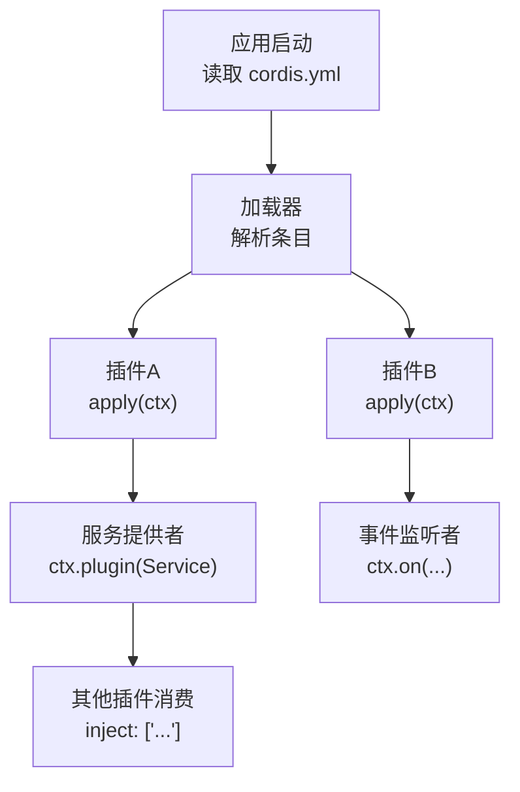
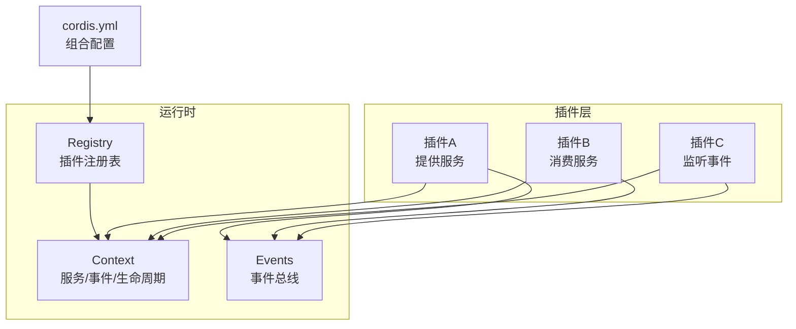
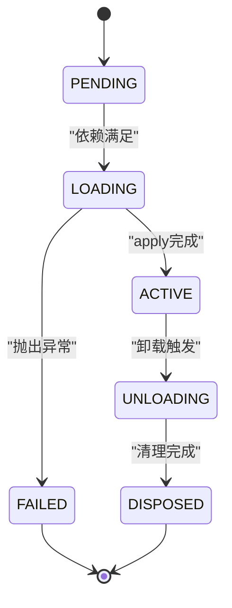
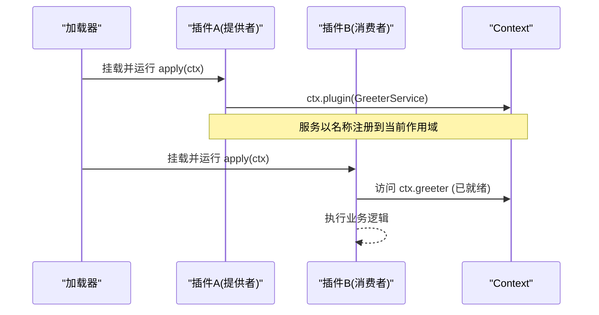
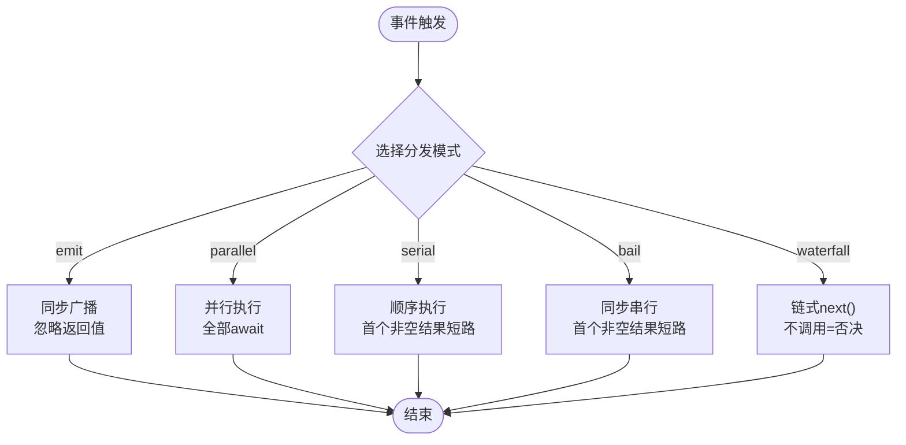
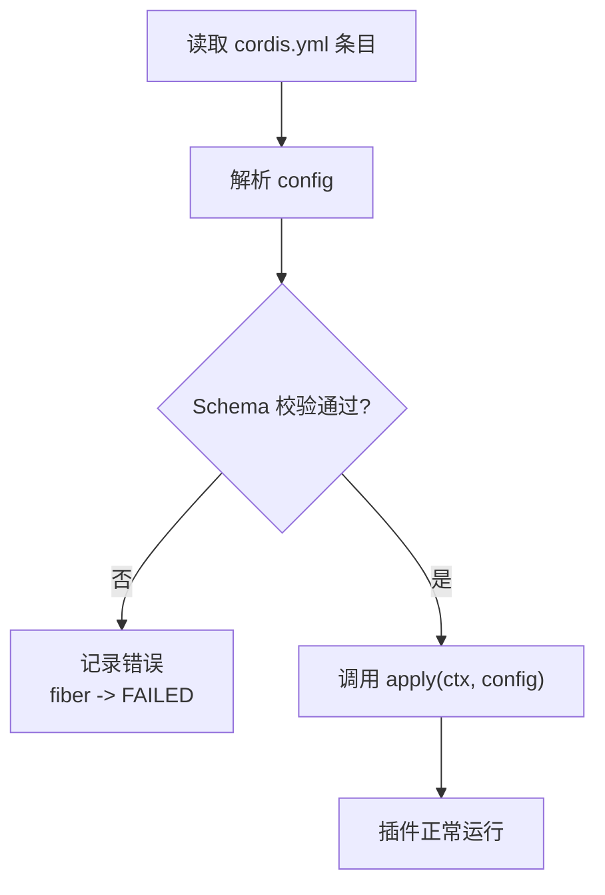
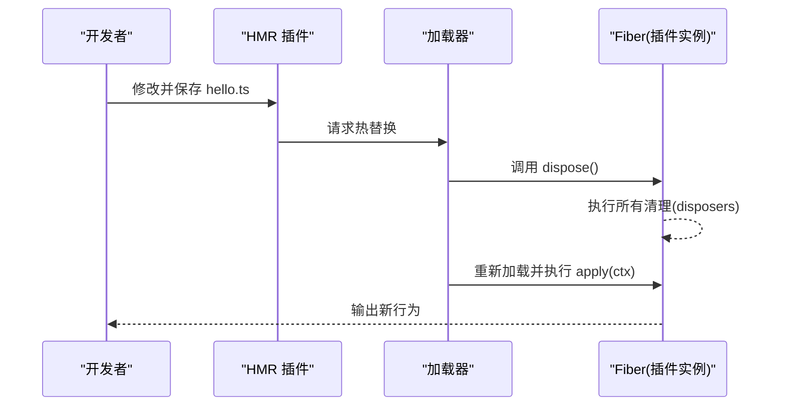
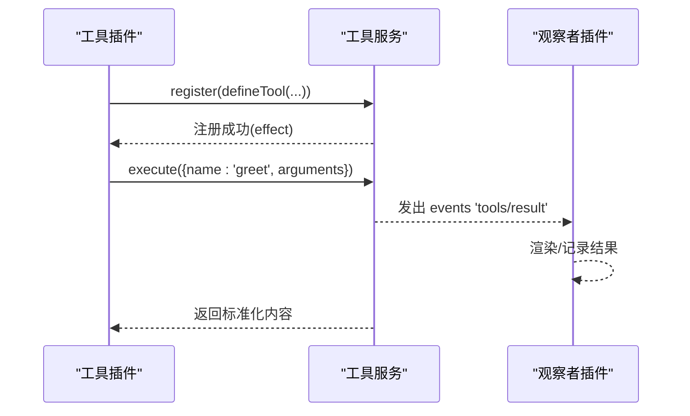
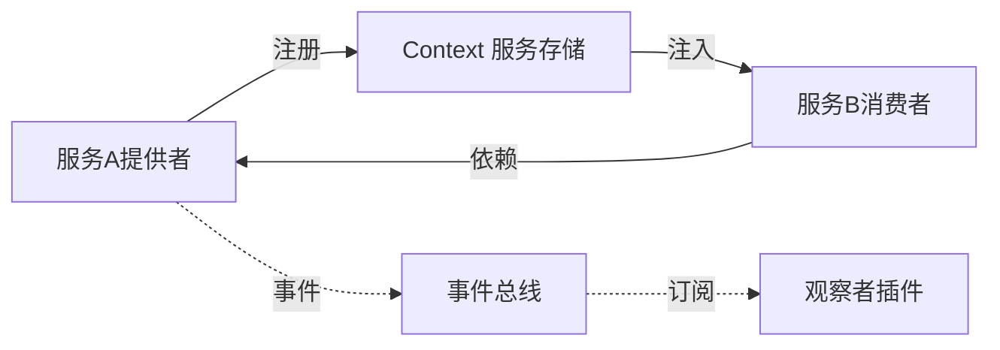

# 插件开发

<cite>
**本文引用的文件**
- [01-first-plugin.md](file://docs/cordis-tutorial/01-first-plugin.md)
- [02-lifecycle-and-effects.md](file://docs/cordis-tutorial/02-lifecycle-and-effects.md)
- [03-services.md](file://docs/cordis-tutorial/03-services.md)
- [04-events.md](file://docs/cordis-tutorial/04-events.md)
- [05-config.md](file://docs/cordis-tutorial/05-config.md)
- [06-composition-and-hmr.md](file://docs/cordis-tutorial/06-composition-and-hmr.md)
- [07-into-the-harness.md](file://docs/cordis-tutorial/07-into-the-harness.md)
- [context.md](file://docs/cordis-api/context.md)
- [service.md](file://docs/cordis-api/service.md)
- [events.md](file://docs/cordis-api/events.md)
- [cordis.yml（headless-agent）](file://examples/headless-agent/cordis.yml)
</cite>

## 目录
1. [简介](#简介)
2. [项目结构](#项目结构)
3. [核心组件](#核心组件)
4. [架构总览](#架构总览)
5. [详细组件分析](#详细组件分析)
6. [依赖关系分析](#依赖关系分析)
7. [性能考虑](#性能考虑)
8. [故障排查指南](#故障排查指南)
9. [结论](#结论)
10. [附录](#附录)

## 简介
本指南面向基于 Cordis 框架的插件开发者，系统讲解插件的基本结构与生命周期、服务提供与依赖注入、事件系统模式、配置校验与错误处理，以及组合与热重载实践。通过教程章节与 API 文档的对照说明，帮助你在不深入源码的前提下，也能构建高质量、可维护、可热更新的 Cordis 插件。

## 项目结构
Cordis 插件以“配置文件 + 插件模块”的方式组织：
- cordis.yml 描述应用由哪些插件组成，并可为每个条目声明 name、id、config、disabled 等元数据。
- 插件模块导出 apply(ctx)、可选 name、可选 inject、可选 Config 等，用于注册能力、订阅事件、管理资源。

图表来源
- [01-first-plugin.md:23-51](file://docs/cordis-tutorial/01-first-plugin.md#L23-L51)
- [06-composition-and-hmr.md:7-21](file://docs/cordis-tutorial/06-composition-and-hmr.md#L7-L21)

章节来源
- [01-first-plugin.md:23-51](file://docs/cordis-tutorial/01-first-plugin.md#L23-L51)
- [06-composition-and-hmr.md:7-21](file://docs/cordis-tutorial/06-composition-and-hmr.md#L7-L21)

## 核心组件
- 上下文 Context：所有能力、事件、生命周期 API 的统一入口；支持扩展、隔离、拦截、子作用域等。
- 服务 Service：具名能力，通过 ctx.<name> 暴露；子类在构造时注册自身，随 fiber 卸载自动清理。
- 事件 Events：解耦通信机制，支持 emit/parallel/serial/bail/waterfall 多种分发模式。
- 配置 Config：通过 Schema 在 apply 前校验，失败即快速失败；支持 !!js 动态计算值。
- 组合与 HMR：通过 id 稳定标识条目，实现热替换、按需启用/禁用、分组隔离。

章节来源
- [context.md:14-96](file://docs/cordis-api/context.md#L14-L96)
- [service.md:4-12](file://docs/cordis-api/service.md#L4-L12)
- [events.md:8-123](file://docs/cordis-api/events.md#L8-L123)
- [05-config.md:5-81](file://docs/cordis-tutorial/05-config.md#L5-L81)
- [06-composition-and-hmr.md:23-60](file://docs/cordis-tutorial/06-composition-and-hmr.md#L23-L60)

## 架构总览
下图展示一个典型插件生态：多个插件通过服务与事件协作，配置驱动组合，HMR 支持热更新。

图表来源
- [context.md:153-162](file://docs/cordis-api/context.md#L153-L162)
- [events.md:8-123](file://docs/cordis-api/events.md#L8-L123)
- [06-composition-and-hmr.md:7-21](file://docs/cordis-tutorial/06-composition-and-hmr.md#L7-L21)

## 详细组件分析

### 插件函数定义与生命周期
- 三种形态：函数插件、对象插件、类插件（Service 子类）。
- 生命周期状态机：PENDING → LOADING → ACTIVE → UNLOADING → DISPOSED，异常路径进入 FAILED。
- 资源管理：使用 ctx.effect() 包装外部资源，返回清理函数；卸载时按逆序并发执行异步清理。
- 从代码挂载子插件：ctx.plugin(fn/class)，返回 fiber 句柄，可用于显式 dispose。

图表来源
- [02-lifecycle-and-effects.md:68-81](file://docs/cordis-tutorial/02-lifecycle-and-effects.md#L68-L81)

章节来源
- [01-first-plugin.md:53-77](file://docs/cordis-tutorial/01-first-plugin.md#L53-L77)
- [02-lifecycle-and-effects.md:7-94](file://docs/cordis-tutorial/02-lifecycle-and-effects.md#L7-L94)

### 服务提供者与依赖注入
- 提供服务：继承 Service，在构造函数中调用 super(ctx, 'name') 注册；通过 ctx.plugin(Service) 挂载。
- 类型增强：使用 declare module 合并 Context 接口，获得编译期类型安全。
- 消费服务：导出 inject = ['serviceName']，框架保证 apply 内服务已就绪；若缺失则保持 PENDING。
- 可选依赖：使用 ctx.get('name') 探测是否存在，避免强耦合。

图表来源
- [03-services.md:7-42](file://docs/cordis-tutorial/03-services.md#L7-L42)
- [03-services.md:44-78](file://docs/cordis-tutorial/03-services.md#L44-L78)

章节来源
- [03-services.md:7-94](file://docs/cordis-tutorial/03-services.md#L7-L94)
- [service.md:4-12](file://docs/cordis-api/service.md#L4-L12)
- [context.md:237-313](file://docs/cordis-api/context.md#L237-L313)

### 事件系统：类型化、广播与水短路
- 事件声明：通过 interface Events 合并声明事件名与监听签名，使 ctx.emit/on 具备类型提示。
- 五种分发模式：
  - emit：同步广播，忽略返回值。
  - parallel：并行执行，全部 await。
  - serial：顺序执行，首个非空结果短路。
  - bail：同步版 serial。
  - waterfall：链式中间件，next() 继续，不调用 next 即为否决。
- 监听自动清理：ctx.on 是 effect，卸载时自动移除监听器。

图表来源
- [04-events.md:80-141](file://docs/cordis-tutorial/04-events.md#L80-L141)
- [events.md:8-123](file://docs/cordis-api/events.md#L8-L123)

章节来源
- [04-events.md:7-141](file://docs/cordis-tutorial/04-events.md#L7-L141)
- [events.md:8-123](file://docs/cordis-api/events.md#L8-L123)

### 配置系统：Schema 校验与错误处理
- 插件导出 Config 作为 Schema，apply(ctx, config) 接收已验证的配置。
- 默认值与必填项：Schema 提供 default 与校验规则，缺失字段填充或报错。
- 快速失败：配置校验失败时，fiber 进入 FAILED，进程退出并打印精确错误。
- 动态值：在 config 中使用 !!js 标签在加载期计算值（如环境变量）。

图表来源
- [05-config.md:5-81](file://docs/cordis-tutorial/05-config.md#L5-L81)

章节来源
- [05-config.md:5-81](file://docs/cordis-tutorial/05-config.md#L5-L81)

### 组合与热重载（HMR）
- 条目元数据：id 提供稳定标识，disabled 控制是否挂载，group/isolate 支持分组与作用域隔离。
- HMR 流程：保存文件后，HMR 插件卸载旧实例、重新加载新代码、再次执行 apply，effect 自动清理。
- 诊断 PENDING：通过遍历 registry 检查 FiberState.PENDING，定位缺失的服务依赖。

图表来源
- [06-composition-and-hmr.md:23-60](file://docs/cordis-tutorial/06-composition-and-hmr.md#L23-L60)
- [06-composition-and-hmr.md:61-110](file://docs/cordis-tutorial/06-composition-and-hmr.md#L61-L110)

章节来源
- [06-composition-and-hmr.md:7-110](file://docs/cordis-tutorial/06-composition-and-hmr.md#L7-L110)

### 实战示例：工具插件与事件观察
- 工具插件：通过 ctx.tools.register(defineTool(...)) 注册工具，execute 返回标准化内容；工具注册为 effect，卸载自动注销。
- 事件观察：通过 ctx.on('tools/result', ...) 监听工具执行结果，无需直接耦合。
- 组合运行：在 cordis.yml 中引入 dsh-tools、dsh-system-prompt 等基础服务，确保依赖满足。

图表来源
- [07-into-the-harness.md:7-94](file://docs/cordis-tutorial/07-into-the-harness.md#L7-L94)

章节来源
- [07-into-the-harness.md:7-94](file://docs/cordis-tutorial/07-into-the-harness.md#L7-L94)

## 依赖关系分析
- 插件间通过服务名解耦，而非直接导入；加载顺序由依赖图决定，与 cordis.yml 中的位置无关。
- 当服务提供方被卸载或热替换，依赖该服务的插件也会被卸载并重启，确保引用一致性。
- 事件系统进一步降低耦合：生产者只关心事件名与载荷，消费者只需订阅。

图表来源
- [03-services.md:74-78](file://docs/cordis-tutorial/03-services.md#L74-L78)
- [events.md:8-123](file://docs/cordis-api/events.md#L8-L123)

章节来源
- [03-services.md:74-78](file://docs/cordis-tutorial/03-services.md#L74-L78)
- [events.md:8-123](file://docs/cordis-api/events.md#L8-L123)

## 性能考虑
- 事件分发模式选择：
  - 高吞吐广播：优先使用 emit 或 parallel，避免不必要的等待。
  - 决策型链路：使用 serial/bail 短路，减少后续监听器开销。
  - 中间件式处理：使用 waterfall 进行转换或否决，注意必须调用 next() 否则静默吞掉下游。
- 依赖解析：inject 会延迟加载直到依赖就绪，避免启动阻塞；但过多 PENDING 会影响整体可用性，需及时补齐依赖。
- 资源清理：将定时器、连接、监听器等放入 ctx.effect()，利用框架统一回收，避免内存泄漏。

[本节为通用指导，不直接分析具体文件]

## 故障排查指南
- 插件无输出且未报错：检查是否处于 PENDING 状态，常见原因为 inject 声明的服务未被提供。
- 配置错误：查看 schema 校验错误信息，确认类型与必填项；必要时使用 !!js 动态计算。
- 热重载无效：确认 HMR 插件已加入组合，并为条目设置稳定 id；编辑 cordis.yml 本身也会触发差异对比与重挂载。
- 服务替换：卸载旧 provider 并挂载新 provider，依赖方会自动卸载并重启，确保引用最新实现。

章节来源
- [06-composition-and-hmr.md:61-110](file://docs/cordis-tutorial/06-composition-and-hmr.md#L61-L110)
- [05-config.md:53-81](file://docs/cordis-tutorial/05-config.md#L53-L81)
- [03-services.md:74-78](file://docs/cordis-tutorial/03-services.md#L74-L78)

## 结论
Cordis 通过“配置驱动的组合 + 服务与事件的解耦 + 严格的配置校验 + 强大的生命周期管理”，为插件化架构提供了清晰而强大的基础设施。遵循本指南的模式与最佳实践，你可以高效地构建可测试、可热更新、可扩展的高质量插件。

## 附录
- 参考示例：headless-agent 的 cordis.yml 展示了真实应用的插件组合方式，包括设置、凭据、LLM、子进程、工作流、工具等。
- 建议阅读顺序：先掌握生命周期与服务，再学习事件与配置，最后结合 HMR 与实战示例进行综合演练。

章节来源
- [cordis.yml（headless-agent）:1-166](file://examples/headless-agent/cordis.yml#L1-L166)