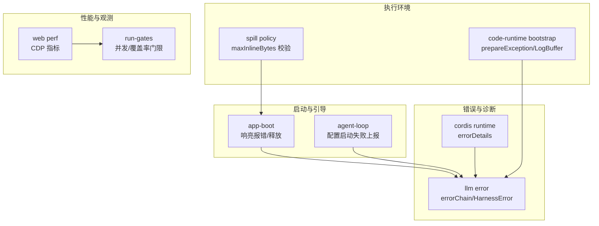
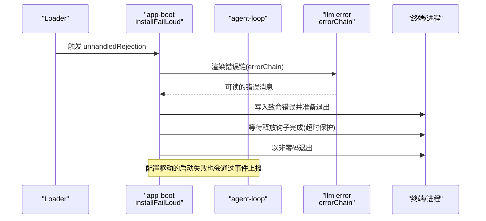
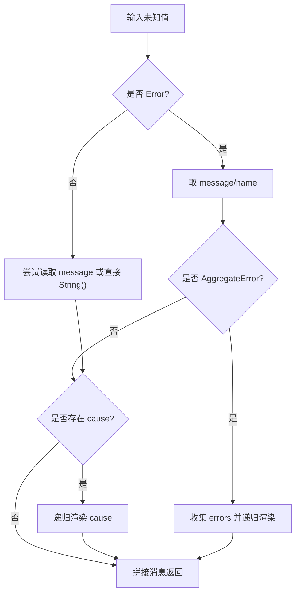
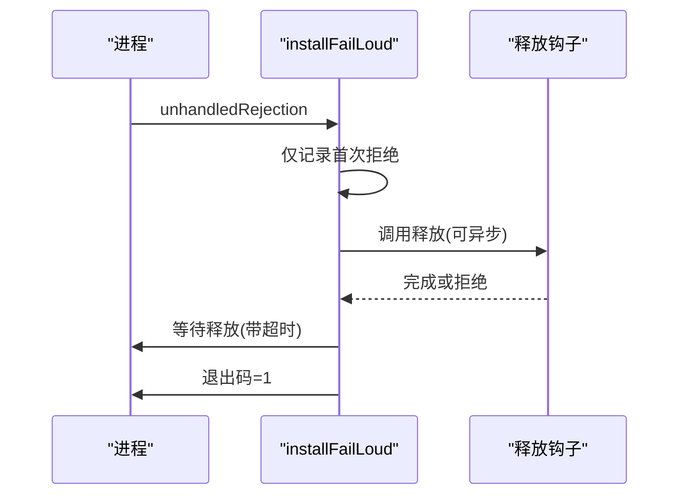
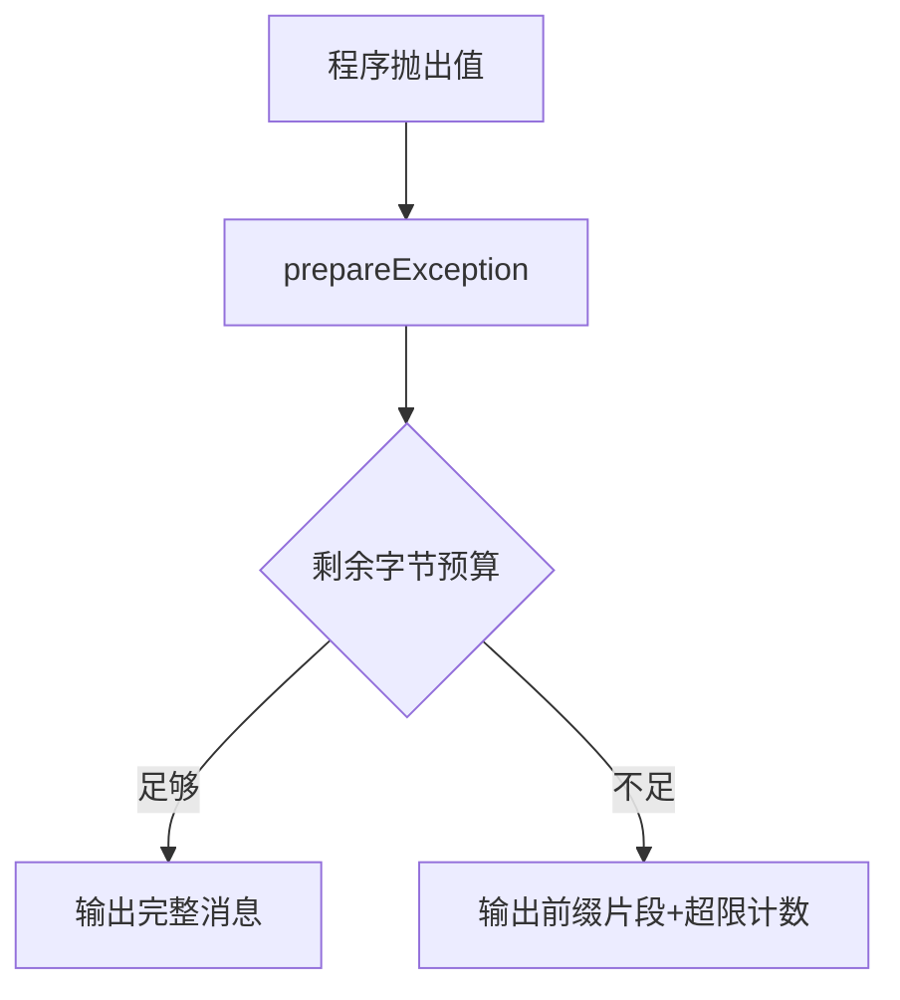
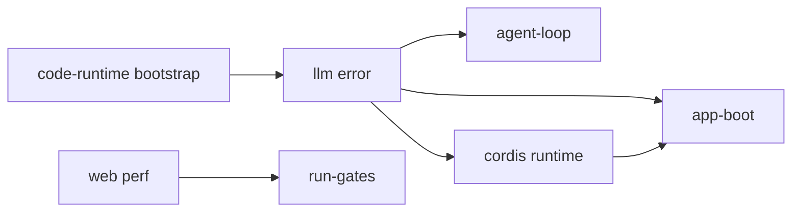

# 故障排除

<cite>
**本文引用的文件**
- [packages/llm/llm/src/error.ts](file://packages/llm/llm/src/error.ts)
- [packages/core/agent-loop/src/index.ts](file://packages/core/agent-loop/src/index.ts)
- [packages/boot/app-boot/tests/app-boot.spec.ts](file://packages/boot/app-boot/tests/app-boot.spec.ts)
- [packages/extensions/cordis-client-runner/src/client/runtime.ts](file://packages/extensions/cordis-client-runner/src/client/runtime.ts)
- [packages/code-runtime/code-runtime-worker-thread/src/bootstrap.ts](file://packages/code-runtime/code-runtime-worker-thread/src/bootstrap.ts)
- [packages/code-runtime/code-runtime-worker-thread/tests/bootstrap.spec.ts](file://packages/code-runtime/code-runtime-worker-thread/tests/bootstrap.spec.ts)
- [packages/spill/spill-policy/src/index.ts](file://packages/spill/spill-policy/src/index.ts)
- [apps/web/tests/complex-history.perf.ts](file://apps/web/tests/complex-history.perf.ts)
- [scripts/run-gates.ts](file://scripts/run-gates.ts)
- [.agents/notes/implemented/bug-fix/2026-07-31-fail-loud-releases-the-terminal.md](file://.agents/notes/implemented/bug-fix/2026-07-31-fail-loud-releases-the-terminal.md)
</cite>

## 目录
1. [简介](#简介)
2. [项目结构](#项目结构)
3. [核心组件](#核心组件)
4. [架构总览](#架构总览)
5. [详细组件分析](#详细组件分析)
6. [依赖关系分析](#依赖关系分析)
7. [性能注意事项](#性能注意事项)
8. [故障排除指南](#故障排除指南)
9. [结论](#结论)
10. [附录](#附录)

## 简介
本指南面向 DeepSeek Harness 使用者与开发者，聚焦“快速定位并解决问题”。内容覆盖启动失败、配置错误、运行时异常、日志级别与分析方法、性能瓶颈定位、错误信息解读与修复建议，以及问题报告最佳实践。文中所有技术细节均基于仓库内实现与测试用例，确保可追溯、可验证。

## 项目结构
DeepSeek Harness 将错误诊断、启动流程、代码执行环境、溢出策略与性能观测等能力分散在多个包中：
- 错误链渲染与结构化错误：llm 包的错误工具
- 启动失败“响亮报错”与终端释放：boot 包及测试
- 配置驱动启动失败上报：core agent-loop
- 加载结果错误详情提取：cordis client runner
- 子进程/Worker 异常与输出截断：code-runtime worker bootstrap
- 溢出策略（spill）配置校验：spill policy
- Web 端性能指标采集：web 测试中的 CDP 指标
- CI 并发与覆盖率门限：scripts/run-gates

图表来源
- [packages/boot/app-boot/tests/app-boot.spec.ts:300-415](file://packages/boot/app-boot/tests/app-boot.spec.ts#L300-L415)
- [packages/core/agent-loop/src/index.ts:384-404](file://packages/core/agent-loop/src/index.ts#L384-L404)
- [packages/llm/llm/src/error.ts:1-164](file://packages/llm/llm/src/error.ts#L1-L164)
- [packages/extensions/cordis-client-runner/src/client/runtime.ts:469-494](file://packages/extensions/cordis-client-runner/src/client/runtime.ts#L469-L494)
- [packages/code-runtime/code-runtime-worker-thread/src/bootstrap.ts:208-275](file://packages/code-runtime/code-runtime-worker-thread/src/bootstrap.ts#L208-L275)
- [packages/spill/spill-policy/src/index.ts:110-121](file://packages/spill/spill-policy/src/index.ts#L110-L121)
- [apps/web/tests/complex-history.perf.ts:515-568](file://apps/web/tests/complex-history.perf.ts#L515-L568)
- [scripts/run-gates.ts:473-495](file://scripts/run-gates.ts#L473-L495)

章节来源
- [packages/boot/app-boot/tests/app-boot.spec.ts:300-415](file://packages/boot/app-boot/tests/app-boot.spec.ts#L300-L415)
- [packages/core/agent-loop/src/index.ts:384-404](file://packages/core/agent-loop/src/index.ts#L384-L404)
- [packages/llm/llm/src/error.ts:1-164](file://packages/llm/llm/src/error.ts#L1-L164)
- [packages/extensions/cordis-client-runner/src/client/runtime.ts:469-494](file://packages/extensions/cordis-client-runner/src/client/runtime.ts#L469-L494)
- [packages/code-runtime/code-runtime-worker-thread/src/bootstrap.ts:208-275](file://packages/code-runtime/code-runtime-worker-thread/src/bootstrap.ts#L208-L275)
- [packages/spill/spill-policy/src/index.ts:110-121](file://packages/spill/spill-policy/src/index.ts#L110-L121)
- [apps/web/tests/complex-history.perf.ts:515-568](file://apps/web/tests/complex-history.perf.ts#L515-L568)
- [scripts/run-gates.ts:473-495](file://scripts/run-gates.ts#L473-L495)

## 核心组件
- 结构化错误与错误链渲染
  - 提供统一的错误基类与稳定 code，便于程序化路由；提供 errorChain 将 cause 链与 AggregateError 成员展开为可读消息，避免被外层包装掩盖真实原因。
- 启动“响亮报错”与终端释放
  - 监听未处理拒绝，打印致命错误并安全释放资源（如终端），保证退出码正确且不会残留 raw 模式。
- 配置驱动的启动失败上报
  - 当通过配置恢复/恢复会话失败时，记录警告并通过事件分发通知订阅者。
- Worker/子进程异常与输出限制
  - 将抛出的值转换为有界的异常对象，避免超大堆栈或字符串跨进程传输；控制台输出使用 LogBuffer 按字节预算截断。
- 溢出策略配置校验
  - 在加载阶段对溢出阈值进行严格校验，避免部署后在工具调用路径抛出。
- Web 性能指标采集
  - 通过 CDP 获取浏览器性能指标，用于评估 UI 响应性与内存占用。
- CI 并发与覆盖率门限
  - 通过环境变量控制工作进程数，拆分带/不带插桩的套件，保障稳定性与可重复性。

章节来源
- [packages/llm/llm/src/error.ts:1-164](file://packages/llm/llm/src/error.ts#L1-L164)
- [packages/boot/app-boot/tests/app-boot.spec.ts:300-415](file://packages/boot/app-boot/tests/app-boot.spec.ts#L300-L415)
- [packages/core/agent-loop/src/index.ts:384-404](file://packages/core/agent-loop/src/index.ts#L384-L404)
- [packages/code-runtime/code-runtime-worker-thread/src/bootstrap.ts:208-275](file://packages/code-runtime/code-runtime-worker-thread/src/bootstrap.ts#L208-L275)
- [packages/code-runtime/code-runtime-worker-thread/tests/bootstrap.spec.ts:70-101](file://packages/code-runtime/code-runtime-worker-thread/tests/bootstrap.spec.ts#L70-L101)
- [packages/spill/spill-policy/src/index.ts:110-121](file://packages/spill/spill-policy/src/index.ts#L110-L121)
- [apps/web/tests/complex-history.perf.ts:515-568](file://apps/web/tests/complex-history.perf.ts#L515-L568)
- [scripts/run-gates.ts:473-495](file://scripts/run-gates.ts#L473-L495)

## 架构总览
下图展示一次典型启动失败到“响亮报错”的时序，包括错误链渲染、审计与终端释放。

图表来源
- [packages/boot/app-boot/tests/app-boot.spec.ts:300-415](file://packages/boot/app-boot/tests/app-boot.spec.ts#L300-L415)
- [packages/llm/llm/src/error.ts:102-163](file://packages/llm/llm/src/error.ts#L102-L163)
- [packages/core/agent-loop/src/index.ts:384-404](file://packages/core/agent-loop/src/index.ts#L384-L404)

## 详细组件分析

### 错误链渲染与结构化错误
- 设计要点
  - 统一错误基类与稳定 code，便于上层按码路由而非解析 message。
  - errorChain 递归展开 cause 链与 AggregateError 成员，屏蔽循环引用与不可渲染值，保证 UI/日志安全。
  - isHarnessError 用于边界处的类型收窄。
- 常见问题
  - 外层包装错误掩盖底层原因：通过 errorChain 可见完整链路。
  - 循环 cause 导致无限渲染：已内置检测，输出占位标记。
  - 非 Error 值或恶意访问器：内部捕获并降级为安全文本。

图表来源
- [packages/llm/llm/src/error.ts:102-163](file://packages/llm/llm/src/error.ts#L102-L163)

章节来源
- [packages/llm/llm/src/error.ts:1-164](file://packages/llm/llm/src/error.ts#L1-L164)

### 启动失败“响亮报错”与终端释放
- 行为特征
  - 安装全局未处理拒绝处理器，首次拒绝即视为诊断点，后续拒绝在释放期间保持处理但不重复报告。
  - 支持异步释放钩子，并在超时情况下仍会退出，避免进程挂起。
  - 针对终端场景，确保释放 raw 模式，避免污染用户 shell。
- 调试建议
  - 若出现“终端卡死”，检查是否在启动阶段持有 raw 模式且未释放。
  - 关注首次拒绝消息，它通常包含最关键的根因。

图表来源
- [packages/boot/app-boot/tests/app-boot.spec.ts:300-415](file://packages/boot/app-boot/tests/app-boot.spec.ts#L300-L415)
- [.agents/notes/implemented/bug-fix/2026-07-31-fail-loud-releases-the-terminal.md:35-49](file://.agents/notes/implemented/bug-fix/2026-07-31-fail-loud-releases-the-terminal.md#L35-L49)

章节来源
- [packages/boot/app-boot/tests/app-boot.spec.ts:300-415](file://packages/boot/app-boot/tests/app-boot.spec.ts#L300-L415)
- [.agents/notes/implemented/bug-fix/2026-07-31-fail-loud-releases-the-terminal.md:35-49](file://.agents/notes/implemented/bug-fix/2026-07-31-fail-loud-releases-the-terminal.md#L35-L49)

### 配置驱动的启动失败上报
- 机制
  - 当通过配置恢复/恢复会话失败时，记录警告并通过事件分发，允许外部监听器消费该失败。
- 排错要点
  - 关注 agent-loop 的警告日志，定位具体 configId 与 sessionId。
  - 订阅对应事件以获取原始错误对象，结合 errorChain 获得完整上下文。

章节来源
- [packages/core/agent-loop/src/index.ts:384-404](file://packages/core/agent-loop/src/index.ts#L384-L404)

### Worker/子进程异常与输出限制
- 异常转换
  - prepareException 将抛出的值转换为有界异常对象，避免超大堆栈/字符串跨进程传输。
- 控制台输出缓冲
  - LogBuffer 按字节预算输出，达到上限后只保留一个能容纳的前缀片段，并计数超限次数。
- 调试建议
  - 若看到“输出超限”提示，说明日志过大，应精简日志或提高预算。
  - 若异常信息不完整，优先查看 prepareException 的 message 字段。

图表来源
- [packages/code-runtime/code-runtime-worker-thread/src/bootstrap.ts:208-275](file://packages/code-runtime/code-runtime-worker-thread/src/bootstrap.ts#L208-L275)
- [packages/code-runtime/code-runtime-worker-thread/tests/bootstrap.spec.ts:70-101](file://packages/code-runtime/code-runtime-worker-thread/tests/bootstrap.spec.ts#L70-L101)

章节来源
- [packages/code-runtime/code-runtime-worker-thread/src/bootstrap.ts:208-275](file://packages/code-runtime/code-runtime-worker-thread/src/bootstrap.ts#L208-L275)
- [packages/code-runtime/code-runtime-worker-thread/tests/bootstrap.spec.ts:70-101](file://packages/code-runtime/code-runtime-worker-thread/tests/bootstrap.spec.ts#L70-L101)

### 加载结果错误详情提取
- 作用
  - 在不伪造堆栈的前提下，保留错误 message 与原始 stack（若存在），便于诊断加载期失败。
- 使用建议
  - 在插件/条目加载失败时，优先查看 errorDetails 的结果，再结合 errorChain 得到完整链路。

章节来源
- [packages/extensions/cordis-client-runner/src/client/runtime.ts:469-494](file://packages/extensions/cordis-client-runner/src/client/runtime.ts#L469-L494)

### 溢出策略（spill）配置校验
- 规则
  - maxInlineBytes 必须在加载阶段校验为非负整数，否则直接抛出，避免部署后在工具调用路径失败。
- 排错建议
  - 若启动时报 spill-policy 相关错误，检查配置值是否为合法整数且非负。

章节来源
- [packages/spill/spill-policy/src/index.ts:110-121](file://packages/spill/spill-policy/src/index.ts#L110-L121)

## 依赖关系分析
- 低耦合高内聚
  - 错误链渲染独立于业务逻辑，被多处复用（启动、Agent Loop、Worker）。
  - 启动失败处理与终端释放解耦，通过释放钩子扩展。
- 关键依赖链
  - app-boot → errorChain（统一错误呈现）
  - agent-loop → errorChain（配置启动失败上报）
  - code-runtime → prepareException/LogBuffer（受限输出）
  - web perf → CDP 指标（性能观测）
  - run-gates → 并发/覆盖率门控（CI 稳定性）

图表来源
- [packages/llm/llm/src/error.ts:1-164](file://packages/llm/llm/src/error.ts#L1-L164)
- [packages/boot/app-boot/tests/app-boot.spec.ts:300-415](file://packages/boot/app-boot/tests/app-boot.spec.ts#L300-L415)
- [packages/core/agent-loop/src/index.ts:384-404](file://packages/core/agent-loop/src/index.ts#L384-L404)
- [packages/code-runtime/code-runtime-worker-thread/src/bootstrap.ts:208-275](file://packages/code-runtime/code-runtime-worker-thread/src/bootstrap.ts#L208-L275)
- [apps/web/tests/complex-history.perf.ts:515-568](file://apps/web/tests/complex-history.perf.ts#L515-L568)
- [scripts/run-gates.ts:473-495](file://scripts/run-gates.ts#L473-L495)

## 性能注意事项
- 浏览器性能指标
  - 通过 CDP 获取 TaskDuration、ScriptDuration、LayoutDuration、RecalcStyleDuration、DevToolsCommandDuration、JSHeapUsedSize 等指标，计算前后差值评估性能回归。
- CI 并发与覆盖率
  - 使用 DSH_COVERAGE_MAX_WORKERS 控制总工作进程数，拆分为 instrumented 与 exempt 两组，避免过度并行导致不稳定。
- 日志与输出
  - 注意 LogBuffer 的字节预算，避免大量日志导致性能抖动或被截断。

章节来源
- [apps/web/tests/complex-history.perf.ts:515-568](file://apps/web/tests/complex-history.perf.ts#L515-L568)
- [scripts/run-gates.ts:473-495](file://scripts/run-gates.ts#L473-L495)
- [packages/code-runtime/code-runtime-worker-thread/tests/bootstrap.spec.ts:70-101](file://packages/code-runtime/code-runtime-worker-thread/tests/bootstrap.spec.ts#L70-L101)

## 故障排除指南

### 启动问题
- 症状
  - 进程立即退出、终端卡住、无头模式下无法拉起。
- 排查步骤
  - 观察首次 unhandledRejection 的日志，这是诊断起点。
  - 若终端异常，确认释放钩子是否成功运行（参考“响亮报错”行为）。
  - 检查配置驱动启动失败事件，定位具体 configId/sessionId。
- 常见原因
  - 插件加载失败、激活阶段 await 拒绝、配置项非法（如 spill 阈值）。
- 修复建议
  - 修正插件/配置；必要时降低并发或关闭可疑条目逐步定位。

章节来源
- [packages/boot/app-boot/tests/app-boot.spec.ts:300-415](file://packages/boot/app-boot/tests/app-boot.spec.ts#L300-L415)
- [packages/core/agent-loop/src/index.ts:384-404](file://packages/core/agent-loop/src/index.ts#L384-L404)
- [packages/spill/spill-policy/src/index.ts:110-121](file://packages/spill/spill-policy/src/index.ts#L110-L121)
- [.agents/notes/implemented/bug-fix/2026-07-31-fail-loud-releases-the-terminal.md:35-49](file://.agents/notes/implemented/bug-fix/2026-07-31-fail-loud-releases-the-terminal.md#L35-L49)

### 配置错误
- 症状
  - 启动时报 spill-policy 或类似配置校验错误。
- 排查步骤
  - 检查 maxInlineBytes 等数值型配置是否为非负整数。
  - 使用 errorChain 查看完整 cause 链，定位非法配置来源。
- 修复建议
  - 修正配置值；若不确定，先回退到默认值再逐步添加。

章节来源
- [packages/spill/spill-policy/src/index.ts:110-121](file://packages/spill/spill-policy/src/index.ts#L110-L121)
- [packages/llm/llm/src/error.ts:102-163](file://packages/llm/llm/src/error.ts#L102-L163)

### 运行时异常与日志分析
- 症状
  - Worker/子进程抛出异常，或控制台输出被截断。
- 排查步骤
  - 查看 prepareException 生成的 message；若被截断，关注“超限计数”。
  - 使用 errorDetails 获取加载期错误的 message/stack。
  - 用 errorChain 串联 cause 链，识别真正根因。
- 修复建议
  - 减少日志体积；修复抛出异常的代码路径；必要时调整预算。

章节来源
- [packages/code-runtime/code-runtime-worker-thread/src/bootstrap.ts:208-275](file://packages/code-runtime/code-runtime-worker-thread/src/bootstrap.ts#L208-L275)
- [packages/extensions/cordis-client-runner/src/client/runtime.ts:469-494](file://packages/extensions/cordis-client-runner/src/client/runtime.ts#L469-L494)
- [packages/llm/llm/src/error.ts:102-163](file://packages/llm/llm/src/error.ts#L102-L163)

### 性能问题与瓶颈定位
- 症状
  - UI 卡顿、内存增长、任务耗时增加。
- 排查步骤
  - 使用 CDP 指标对比前后差异，关注 Script/Task/Layout/RecalcStyle/DevTools 耗时与 JSHeapUsedSize。
  - 在 CI 中调整 DSH_COVERAGE_MAX_WORKERS，隔离并发影响。
- 修复建议
  - 优化重渲染与布局；减少 DevTools 命令；控制内存峰值。

章节来源
- [apps/web/tests/complex-history.perf.ts:515-568](file://apps/web/tests/complex-history.perf.ts#L515-L568)
- [scripts/run-gates.ts:473-495](file://scripts/run-gates.ts#L473-L495)

### 错误信息解读与修复建议
- 结构化错误
  - 优先根据 HarnessError.code 分类处理，不要解析 message。
- 上下文窗口/配额
  - 使用 isContextWindowExceededError/isQuotaExceededError 判断是否属于模型上下文或账户配额问题，采取相应重试/降级策略。
- 错误链
  - 借助 errorChain 还原真实原因，尤其在外层包装错误时。

章节来源
- [packages/llm/llm/src/error.ts:1-164](file://packages/llm/llm/src/error.ts#L1-L164)

### 问题报告最佳实践与社区支持
- 报告模板建议
  - 环境信息（OS、Node/浏览器版本）、复现步骤、期望与实际行为、关键日志片段（含 errorChain 输出）、性能指标（如有）。
- 渠道
  - 使用仓库提供的 Issue 模板与 PR 模板；在 PR 评审线程中讨论架构级问题。
- 证据
  - 附上最小可复现示例与快照；尽量包含首次拒绝日志与 CDP 指标。

[本节为通用指导，不直接分析具体文件]

## 结论
通过统一的错误链渲染、严格的配置校验、安全的启动失败处理与可观测的性能指标，DeepSeek Harness 提供了完善的故障定位基础。遵循本指南的步骤，可快速从“现象→日志→根因→修复”形成闭环，显著缩短排障时间。

## 附录
- 常用命令与环境变量
  - DSH_COVERAGE_MAX_WORKERS：控制覆盖率/门限任务的总工作进程数。
- 参考实现
  - 错误链渲染：packages/llm/llm/src/error.ts
  - 响亮报错与终端释放：packages/boot/app-boot/tests/app-boot.spec.ts
  - 配置启动失败上报：packages/core/agent-loop/src/index.ts
  - Worker 异常与输出限制：packages/code-runtime/code-runtime-worker-thread/src/bootstrap.ts
  - 溢出策略校验：packages/spill/spill-policy/src/index.ts
  - 性能指标采集：apps/web/tests/complex-history.perf.ts
  - CI 并发门限：scripts/run-gates.ts