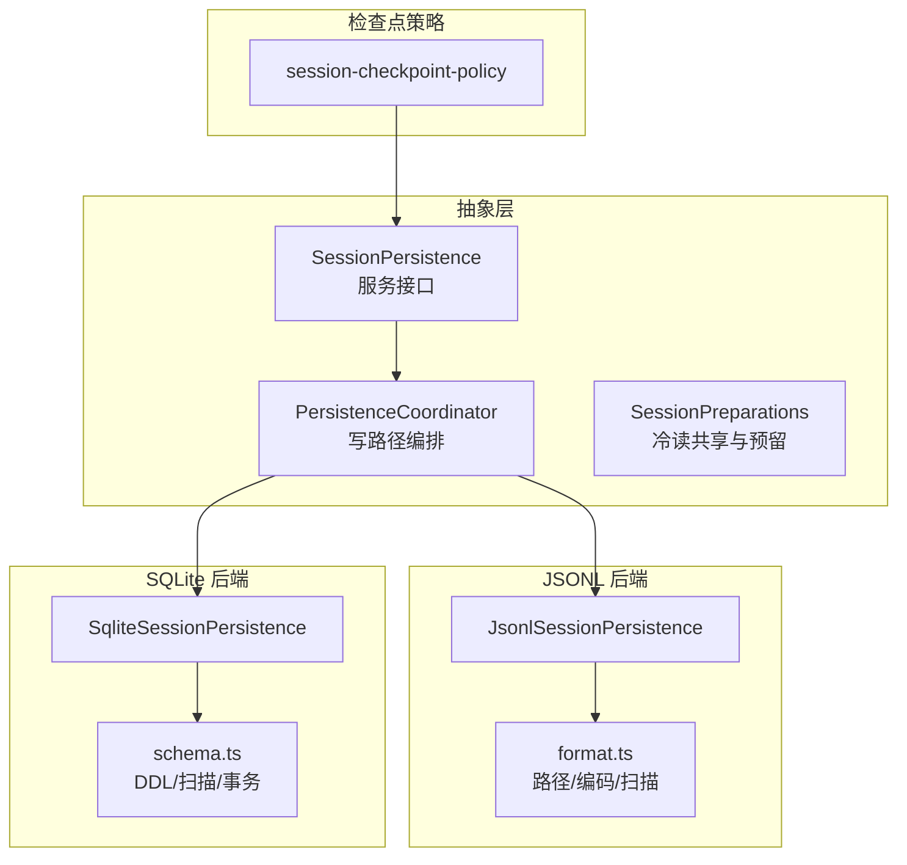
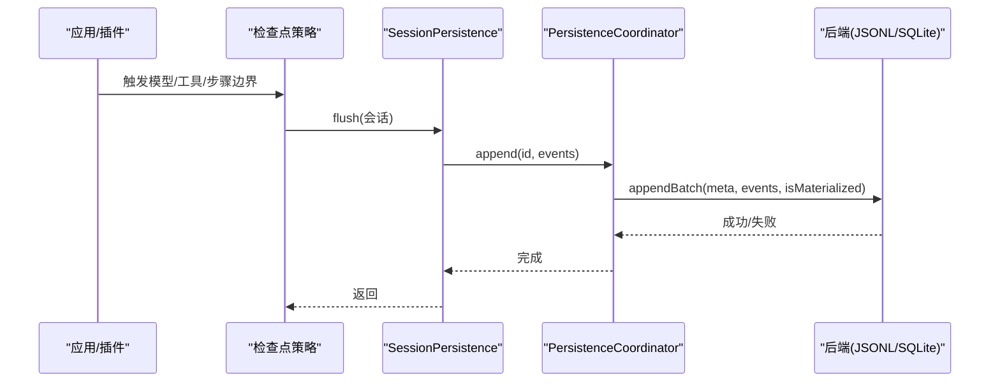
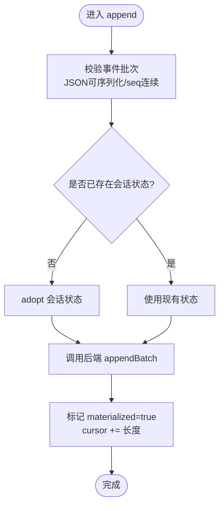
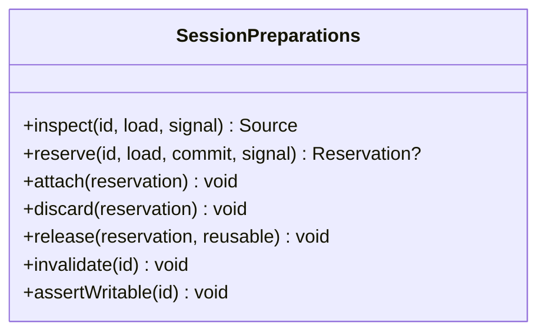
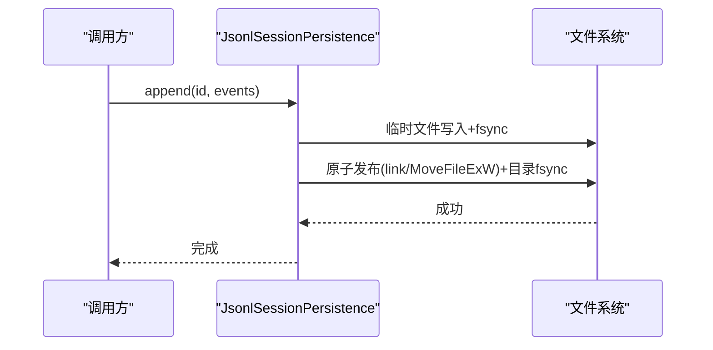
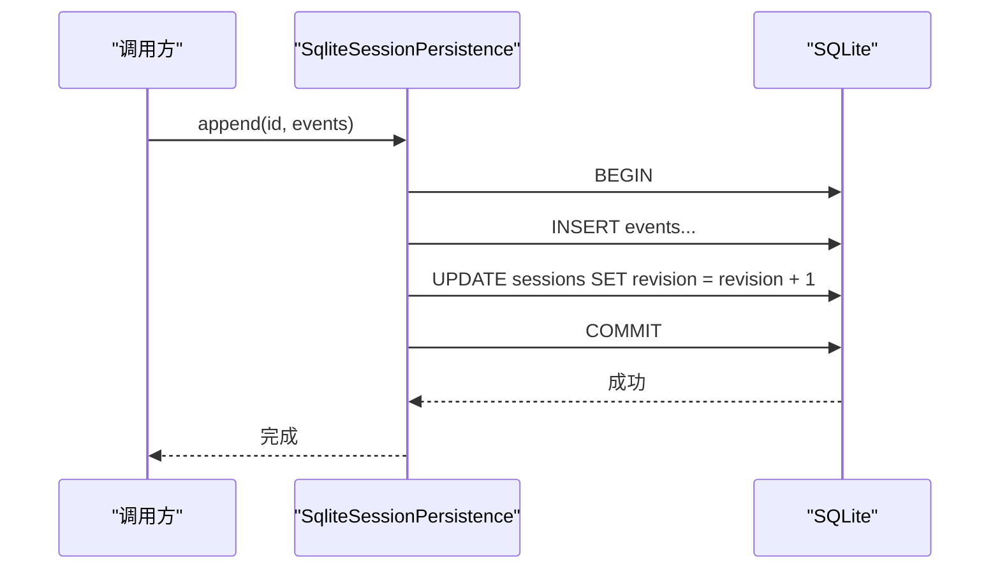
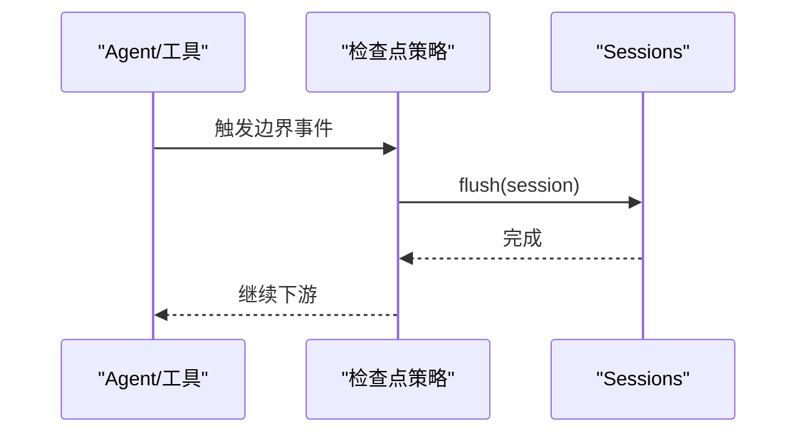
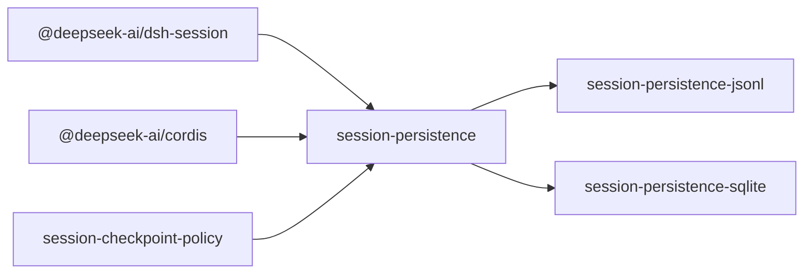

# 会话持久化

<cite>
**本文引用的文件**
- [packages/session/session-persistence/src/index.ts](file://packages/session/session-persistence/src/index.ts)
- [packages/session/session-persistence/src/coordinator.ts](file://packages/session/session-persistence/src/coordinator.ts)
- [packages/session/session-persistence/src/preparations.ts](file://packages/session/session-persistence/src/preparations.ts)
- [packages/session/session-persistence-jsonl/src/index.ts](file://packages/session/session-persistence-jsonl/src/index.ts)
- [packages/session/session-persistence-jsonl/src/format.ts](file://packages/session/session-persistence-jsonl/src/format.ts)
- [packages/session/session-persistence-sqlite/src/index.ts](file://packages/session/session-persistence-sqlite/src/index.ts)
- [packages/session/session-persistence-sqlite/src/schema.ts](file://packages/session/session-persistence-sqlite/src/schema.ts)
- [packages/session/session-checkpoint-policy/src/index.ts](file://packages/session/session-checkpoint-policy/src/index.ts)
- [packages/session/session-persistence/README.md](file://packages/session/session-persistence/README.md)
- [packages/session/session-persistence-jsonl/README.md](file://packages/session/session-persistence-jsonl/README.md)
- [packages/session/session-persistence-sqlite/README.md](file://packages/session/session-persistence-sqlite/README.md)
</cite>

## 目录
1. [简介](#简介)
2. [项目结构](#项目结构)
3. [核心组件](#核心组件)
4. [架构总览](#架构总览)
5. [详细组件分析](#详细组件分析)
6. [依赖关系分析](#依赖关系分析)
7. [性能考量](#性能考量)
8. [故障排查指南](#故障排查指南)
9. [结论](#结论)
10. [附录](#附录)

## 简介
本文件系统性说明 DeepSeek Harness 的会话持久化系统：以事件溯源方式将会话事件与元数据持久化，提供抽象服务 SessionPersistence，以及 JSONL 与 SQLite 两种后端实现。文档覆盖刷新检查点、崩溃恢复策略、会话头元数据管理、会话准备与恢复的所有权管理（SessionPreparation、SessionInspection）、格式版本拒绝机制与数据完整性保证，并给出配置示例与性能对比，帮助开发者选择合适的持久化方案。

## 项目结构
- 抽象层：session-persistence 定义服务接口、协调器、准备池与修订标识等通用能力。
- 后端实现：
  - session-persistence-jsonl：基于每会话追加式 JSONL 日志文件，支持可选压缩与分块打包。
  - session-persistence-sqlite：基于 SQLite 表存储事件与元数据，使用事务保证原子性与一致性。
- 检查点策略：session-checkpoint-policy 在模型请求、工具调用与会话边界处触发持久化刷新。
- 文档：各包 README 提供布局、配置与语义约定。

图示来源
- [packages/session/session-persistence/src/index.ts:84-241](file://packages/session/session-persistence/src/index.ts#L84-L241)
- [packages/session/session-persistence/src/coordinator.ts:588-800](file://packages/session/session-persistence/src/coordinator.ts#L588-L800)
- [packages/session/session-persistence-jsonl/src/index.ts:121-200](file://packages/session/session-persistence-jsonl/src/index.ts#L121-L200)
- [packages/session/session-persistence-jsonl/src/format.ts:221-394](file://packages/session/session-persistence-jsonl/src/format.ts#L221-L394)
- [packages/session/session-persistence-sqlite/src/index.ts:99-200](file://packages/session/session-persistence-sqlite/src/index.ts#L99-L200)
- [packages/session/session-persistence-sqlite/src/schema.ts:81-172](file://packages/session/session-persistence-sqlite/src/schema.ts#L81-L172)
- [packages/session/session-checkpoint-policy/src/index.ts:63-83](file://packages/session/session-checkpoint-policy/src/index.ts#L63-L83)

章节来源
- [packages/session/session-persistence/README.md:1-86](file://packages/session/session-persistence/README.md#L1-L86)

## 核心组件
- SessionPersistence 抽象服务：定义 locate、create、append、load、inspect、readFrom、list、listSnapshots 等能力；暴露 SessionRawArtifact、SessionLocation、SessionInspection、SessionPersistenceRevision 等类型。
- PersistenceCoordinator：跨后端的写路径编排，负责批处理、懒创建、崩溃修复、会话采用、资源回收与并发序列化。
- SessionPreparations：冷读共享、独占预留与 LRU 缓存，确保 prepare/inspect/load 的一致性。
- JSONL 后端：按会话组织追加日志，支持 zstd 压缩与 chunk 打包，提供 readRaw、listSnapshots 等轻量能力。
- SQLite 后端：以行映射事件，使用事务与 revision/incarnation 做轻量快照，支持 loadStoredFrom 后缀读取。
- 检查点策略：在 llm/stream、tools/execute、agent/pre-step 等边界触发 flush，确保关键状态先落盘。

章节来源
- [packages/session/session-persistence/src/index.ts:84-241](file://packages/session/session-persistence/src/index.ts#L84-L241)
- [packages/session/session-persistence/src/coordinator.ts:588-800](file://packages/session/session-persistence/src/coordinator.ts#L588-L800)
- [packages/session/session-persistence/src/preparations.ts:32-228](file://packages/session/session-persistence/src/preparations.ts#L32-L228)
- [packages/session/session-persistence-jsonl/src/index.ts:121-200](file://packages/session/session-persistence-jsonl/src/index.ts#L121-L200)
- [packages/session/session-persistence-sqlite/src/index.ts:99-200](file://packages/session/session-persistence-sqlite/src/index.ts#L99-L200)
- [packages/session/session-checkpoint-policy/src/index.ts:63-83](file://packages/session/session-checkpoint-policy/src/index.ts#L63-L83)

## 架构总览
持久化由“抽象服务 + 协调器 + 具体后端”构成。协调器统一处理批写入、崩溃修复、会话准备与发布；后端仅关注自身存储原语（文件/数据库）。检查点策略在关键业务边界触发 flush，保障强一致性的可见性。

图示来源
- [packages/session/session-checkpoint-policy/src/index.ts:63-83](file://packages/session/session-checkpoint-policy/src/index.ts#L63-L83)
- [packages/session/session-persistence/src/coordinator.ts:669-710](file://packages/session/session-persistence/src/coordinator.ts#L669-L710)
- [packages/session/session-persistence-jsonl/src/index.ts:421-444](file://packages/session/session-persistence-jsonl/src/index.ts#L421-L444)
- [packages/session/session-persistence-sqlite/src/index.ts:284-338](file://packages/session/session-persistence-sqlite/src/index.ts#L284-L338)

## 详细组件分析

### 抽象服务 SessionPersistence
- 职责：定义会话持久化的统一契约，包括定位、创建、追加、加载、检查、后缀读取、列表与轻量快照。
- 关键点：
  - supportsRawArtifacts 指示是否可读取原始工件文本（JSONL 为 true，SQLite 为 false）。
  - prepare 通过 SessionPreparation.create 构建未发布的会话，供 resume 使用。
  - load 保证最终 turn 平衡，必要时合成关闭事件；inspect 不提交修复，仅返回逻辑视图。
  - readFrom 提供从指定 seq 开始的只读后缀读取，避免全量解析。

章节来源
- [packages/session/session-persistence/src/index.ts:84-241](file://packages/session/session-persistence/src/index.ts#L84-L241)

### 协调器 PersistenceCoordinator
- 职责：跨后端写路径编排，含批处理窗口、懒创建、崩溃修复、会话采用、并发控制与资源回收。
- 关键流程：
  - create：记录意图，首次 append 时原子写入首条事件（或 SQLite 中插入 sessions 行）。
  - append：校验事件 JSON 可序列化、seq 连续，调用后端 appendBatch，成功后更新 cursor 与 materialized。
  - prepare/inspect/load：通过 SessionPreparations 共享冷读、预留与 LRU 复用；revision 变化则重新加载。
  - 崩溃修复：根据后端 tornMarker 截断损坏尾部并追加合成关闭事件。

图示来源
- [packages/session/session-persistence/src/coordinator.ts:669-710](file://packages/session/session-persistence/src/coordinator.ts#L669-L710)

章节来源
- [packages/session/session-persistence/src/coordinator.ts:588-800](file://packages/session/session-persistence/src/coordinator.ts#L588-L800)

### 会话准备与所有权 SessionPreparations
- 作用：对同一 id 的冷读进行共享，对 prepare 进行独占预留，并在 commit 后释放或回收到 LRU。
- 关键能力：
  - inspect：观察并共享进行中读取。
  - reserve：等待就绪后执行 commit（如修复），返回独占 reservation。
  - attach/discard/release/invalidate：管理生命周期与失效。
  - assertWritable：阻止在预留期间写入。

图示来源
- [packages/session/session-persistence/src/preparations.ts:32-228](file://packages/session/session-persistence/src/preparations.ts#L32-L228)

章节来源
- [packages/session/session-persistence/src/preparations.ts:32-228](file://packages/session/session-persistence/src/preparations.ts#L32-L228)

### JSONL 后端
- 存储形态：每会话一个追加式 JSONL 文件，默认 zstd 压缩，支持 packChunks 打包 delta 块。
- 关键特性：
  - locate：返回绝对目标路径（无 I/O）。
  - readRaw：解码物理编码后的原始文本（包含 header 帧与事件帧）。
  - list/listSnapshots：仅读取 header 行与 stat 信息，生成轻量 revision。
  - 崩溃恢复：检测不完整帧，保留完整记录，截断并追加合成关闭事件。
  - 安全路径：encodeSegment/projectDir/sessionDir/logPath 保证路径安全与可导航。

图示来源
- [packages/session/session-persistence-jsonl/src/index.ts:513-592](file://packages/session/session-persistence-jsonl/src/index.ts#L513-L592)
- [packages/session/session-persistence-jsonl/src/format.ts:221-394](file://packages/session/session-persistence-jsonl/src/format.ts#L221-L394)

章节来源
- [packages/session/session-persistence-jsonl/src/index.ts:121-200](file://packages/session/session-persistence-jsonl/src/index.ts#L121-L200)
- [packages/session/session-persistence-jsonl/src/index.ts:421-444](file://packages/session/session-persistence-jsonl/src/index.ts#L421-L444)
- [packages/session/session-persistence-jsonl/src/format.ts:221-394](file://packages/session/session-persistence-jsonl/src/format.ts#L221-L394)
- [packages/session/session-persistence-jsonl/README.md:1-78](file://packages/session/session-persistence-jsonl/README.md#L1-L78)

### SQLite 后端
- 存储形态：events 表 1:1 映射事件，sessions 表保存元数据与 incarnation/revision。
- 关键特性：
  - appendBatch：单事务内插入事件并递增 revision，保证原子性。
  - commitRepair：删除损坏尾部行并插入合成关闭事件，单事务完成。
  - loadStoredFrom：按 seq 后缀读取，适合增量重放。
  - 轻量 revision：storeIdentity + incarnation + revision 组合，避免全量解析。

图示来源
- [packages/session/session-persistence-sqlite/src/index.ts:284-338](file://packages/session/session-persistence-sqlite/src/index.ts#L284-L338)
- [packages/session/session-persistence-sqlite/src/schema.ts:81-172](file://packages/session/session-persistence-sqlite/src/schema.ts#L81-L172)

章节来源
- [packages/session/session-persistence-sqlite/src/index.ts:99-200](file://packages/session/session-persistence-sqlite/src/index.ts#L99-L200)
- [packages/session/session-persistence-sqlite/src/schema.ts:81-172](file://packages/session/session-persistence-sqlite/src/schema.ts#L81-L172)
- [packages/session/session-persistence-sqlite/README.md:1-63](file://packages/session/session-persistence-sqlite/README.md#L1-L63)

### 刷新检查点策略
- 在 llm/stream、tools/execute、agent/pre-step 等边界调用 ctx.sessions.flush，确保请求/工具/步骤的关键状态先持久化再执行副作用。
- 若工具在调度前被中止，返回特定错误结果，避免副作用。

图示来源
- [packages/session/session-checkpoint-policy/src/index.ts:63-83](file://packages/session/session-checkpoint-policy/src/index.ts#L63-L83)

章节来源
- [packages/session/session-checkpoint-policy/src/index.ts:63-83](file://packages/session/session-checkpoint-policy/src/index.ts#L63-L83)

### 会话头元数据管理与位置
- SessionHeader 携带 version、id、createdAt、cwd、parentSession、seedLength、origin、delegationDepth、agentPreset 等不可变元数据。
- JSONL 后端 locate 返回绝对路径；SQLite 后端不支持 per-session artifact，locate 返回 undefined。
- listSnapshots 提供轻量 revision，用于变更检测与缓存失效。

章节来源
- [packages/session/session-persistence/src/index.ts:17-241](file://packages/session/session-persistence/src/index.ts#L17-L241)
- [packages/session/session-persistence-jsonl/src/index.ts:171-174](file://packages/session/session-persistence-jsonl/src/index.ts#L171-L174)
- [packages/session/session-persistence-sqlite/src/index.ts:172-175](file://packages/session/session-persistence-sqlite/src/index.ts#L172-L175)

### 格式版本拒绝与数据完整性
- 版本拒绝：当存储的版本高于当前构建可读版本或低于支持版本时，抛出 SessionFormatUnsupportedError，提示升级或无法升级。
- 完整性：JSONL 后端校验 header 帧与事件连续性；SQLite 后端在 committed region 内发现解析错误或 seq 间隙即拒绝。
- 旧格式迁移：协调器对部分历史事件形状进行兼容转换（如 pre-identity message、pre-react-loop 事件），但仅在当前版本范围内。

章节来源
- [packages/session/session-persistence/src/coordinator.ts:35-81](file://packages/session/session-persistence/src/coordinator.ts#L35-L81)
- [packages/session/session-persistence/src/coordinator.ts:273-573](file://packages/session/session-persistence/src/coordinator.ts#L273-L573)
- [packages/session/session-persistence-jsonl/src/format.ts:240-264](file://packages/session/session-persistence-jsonl/src/format.ts#L240-L264)
- [packages/session/session-persistence-sqlite/src/schema.ts:220-270](file://packages/session/session-persistence-sqlite/src/schema.ts#L220-L270)

### 崩溃恢复策略
- JSONL：检测不完整帧，保留完整记录，截断到起始偏移，追加合成 tool/result、step/end、turn/end{interrupted} 等关闭事件。
- SQLite：识别 last turn/end 之后的损坏区域，删除该 tail 并插入合成关闭事件，保持 log 平衡。
- 共同原则：committed region 内的损坏直接拒绝；torn tail 仅在 load 时修复，inspect 不修改物理存储。

章节来源
- [packages/session/session-persistence-jsonl/src/index.ts:421-444](file://packages/session/session-persistence-jsonl/src/index.ts#L421-L444)
- [packages/session/session-persistence-sqlite/src/index.ts:304-338](file://packages/session/session-persistence-sqlite/src/index.ts#L304-L338)
- [packages/session/session-persistence/README.md:25-44](file://packages/session/session-persistence/README.md#L25-L44)

### 会话准备与恢复的所有权管理
- prepare：通过 SessionPreparations.reserve 获取独占 reservation，commit 修复后返回 SessionPreparation，供 resume 发布。
- inspect：共享冷读，可能复用之前的 unpublished Session，但不提交修复。
- 所有权：prepare 期间禁止 append；resume 发布后 reservation 被 attach 或 discard，避免重复发布。

章节来源
- [packages/session/session-persistence/src/coordinator.ts:720-775](file://packages/session/session-persistence/src/coordinator.ts#L720-L775)
- [packages/session/session-persistence/src/preparations.ts:75-151](file://packages/session/session-persistence/src/preparations.ts#L75-L151)

## 依赖关系分析
- 抽象层依赖 dsh-session 的事件与头类型，并通过 cordis 上下文注入 services。
- JSONL 后端依赖 Node fs/promises、zstd 编解码与 Windows 专用发布函数。
- SQLite 后端依赖 node:sqlite 同步数据库，使用 PRAGMA 与严格模式保证一致性。
- 检查点策略依赖 llm、tools、sessions 等服务，在关键边界触发 flush。

图示来源
- [packages/session/session-persistence/src/index.ts:8-15](file://packages/session/session-persistence/src/index.ts#L8-L15)
- [packages/session/session-persistence-jsonl/src/index.ts:9-33](file://packages/session/session-persistence-jsonl/src/index.ts#L9-L33)
- [packages/session/session-persistence-sqlite/src/index.ts:9-27](file://packages/session/session-persistence-sqlite/src/index.ts#L9-L27)
- [packages/session/session-checkpoint-policy/src/index.ts:7-18](file://packages/session/session-checkpoint-policy/src/index.ts#L7-L18)

章节来源
- [packages/session/session-persistence/src/index.ts:8-15](file://packages/session/session-persistence/src/index.ts#L8-L15)
- [packages/session/session-persistence-jsonl/src/index.ts:9-33](file://packages/session/session-persistence-jsonl/src/index.ts#L9-L33)
- [packages/session/session-persistence-sqlite/src/index.ts:9-27](file://packages/session/session-persistence-sqlite/src/index.ts#L9-L27)
- [packages/session/session-checkpoint-policy/src/index.ts:7-18](file://packages/session/session-checkpoint-policy/src/index.ts#L7-L18)

## 性能考量
- JSONL
  - 优点：顺序追加、天然可移植；压缩与打包显著减小体积；list 仅读 header 行，扩展性好。
  - 缺点：大文件随机访问成本高；readFrom 需顺序扫描跳过至 fromSeq。
  - 建议：启用 packChunks 与 zstd 压缩；合理设置 preparedSessionCacheSize 与 writeBatchMaxDelayMs。
- SQLite
  - 优点：按 seq 后缀读取高效；事务原子性强；revision/incarnation 轻量快照。
  - 缺点：DatabaseSync 同步阻塞事件循环；写锁争用无重试策略。
  - 建议：选择合适 journal_mode（网络挂载可用 delete/truncate/persist）；控制并发写；监控 WAL 文件大小。

[本节为一般性指导，无需引用具体文件]

## 故障排查指南
- 常见错误
  - SessionFormatUnsupportedError：存储版本不兼容，需升级 harness 或迁移。
  - SessionPersistenceCorruptionError：committed region 内解析错误或 seq 间隙，需检查存储介质与写入路径。
  - ENOENT/权限错误：JSONL root 不存在或无权限；SQLite 目录/文件权限不足。
- 调试方法
  - 使用 readRaw（JSONL）查看原始工件文本，确认 header 与事件序列。
  - 使用 listSnapshots 观察 revision 变化，判断是否发生外部写入或修复。
  - 开启检查点策略，确保关键边界 flush 后再执行副作用，便于复现问题。
  - 对 SQLite，检查 journal_mode 与 WAL 文件；对 JSONL，确认压缩帧完整性。

章节来源
- [packages/session/session-persistence/src/coordinator.ts:35-81](file://packages/session/session-persistence/src/coordinator.ts#L35-L81)
- [packages/session/session-persistence-jsonl/src/index.ts:252-282](file://packages/session/session-persistence-jsonl/src/index.ts#L252-L282)
- [packages/session/session-persistence-sqlite/src/schema.ts:220-270](file://packages/session/session-persistence-sqlite/src/schema.ts#L220-L270)
- [packages/session/session-checkpoint-policy/src/index.ts:63-83](file://packages/session/session-checkpoint-policy/src/index.ts#L63-L83)

## 结论
DeepSeek Harness 的会话持久化系统通过抽象服务与协调器解耦了存储实现，JSONL 与 SQLite 后端分别满足文件级与数据库级的需求。系统在崩溃恢复、格式版本拒绝、数据完整性与轻量快照方面提供了稳健保障。开发者可根据场景选择后端：追求便携与压缩选 JSONL；需要高效后缀读取与事务原子性选 SQLite。配合检查点策略与合理的配置参数，可在可靠性与性能之间取得平衡。

[本节为总结性内容，无需引用具体文件]

## 附录

### 配置示例
- JSONL
  - root：必填，所有会话文件的根目录。
  - packChunks：默认 true，减少体积。
  - compression：'zstd'（默认）或 'none'。
  - preparedSessionCacheSize：默认 5。
  - writeBatchMaxDelayMs：默认 200。
- SQLite
  - path：数据库路径或 ':memory:'。
  - journalMode：'wal'（默认）或其他滚动日志模式。
  - preparedSessionCacheSize：默认 5。
  - writeBatchMaxDelayMs：默认 200。

章节来源
- [packages/session/session-persistence-jsonl/README.md:22-31](file://packages/session/session-persistence-jsonl/README.md#L22-L31)
- [packages/session/session-persistence-sqlite/README.md:25-34](file://packages/session/session-persistence-sqlite/README.md#L25-L34)