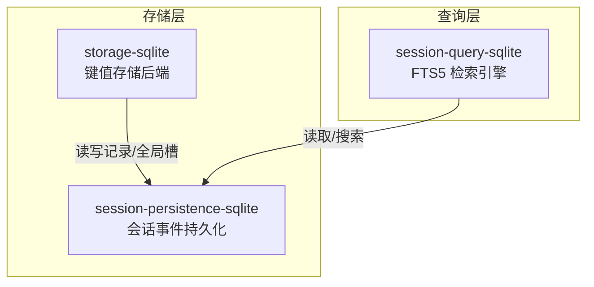
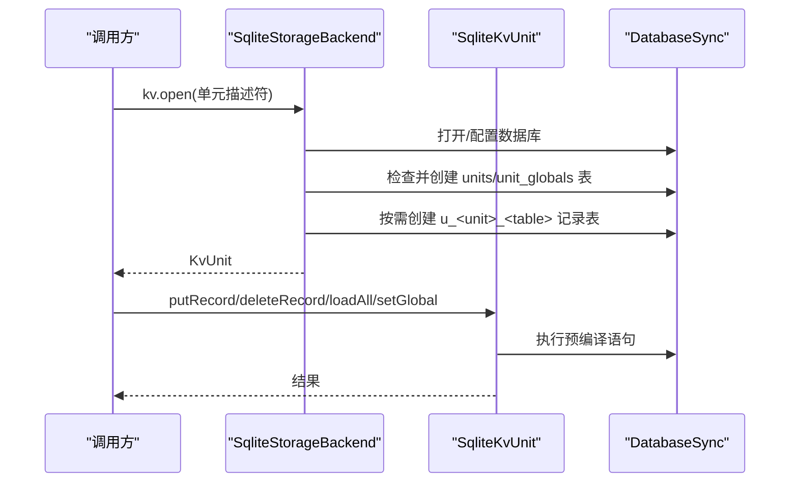
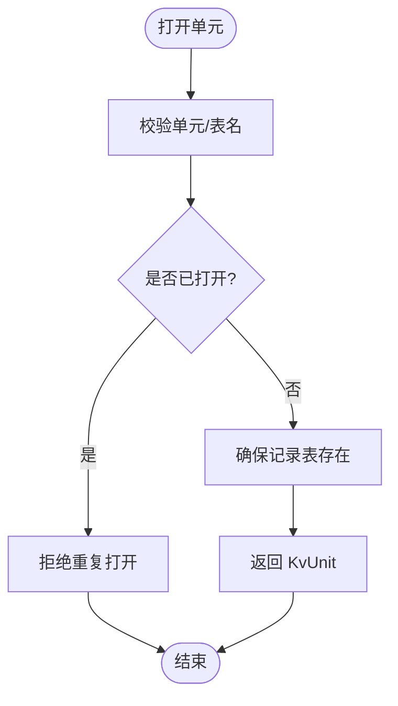
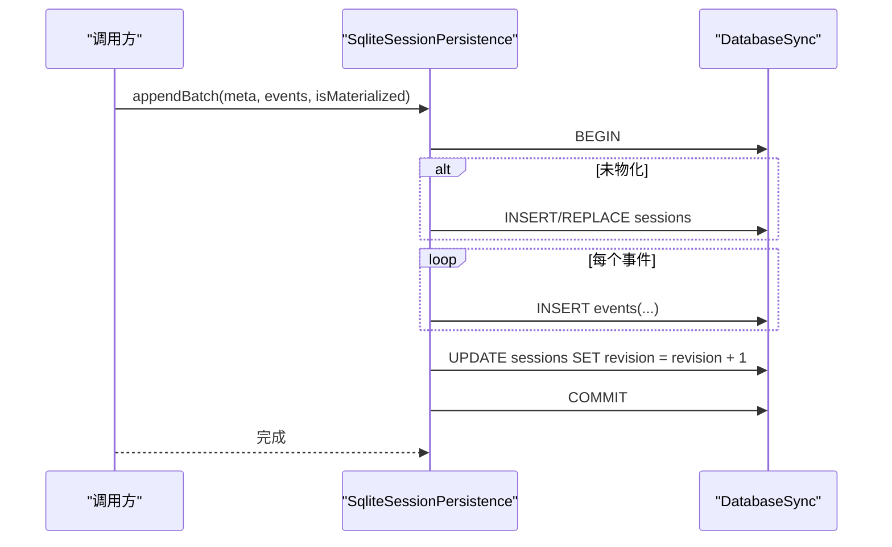
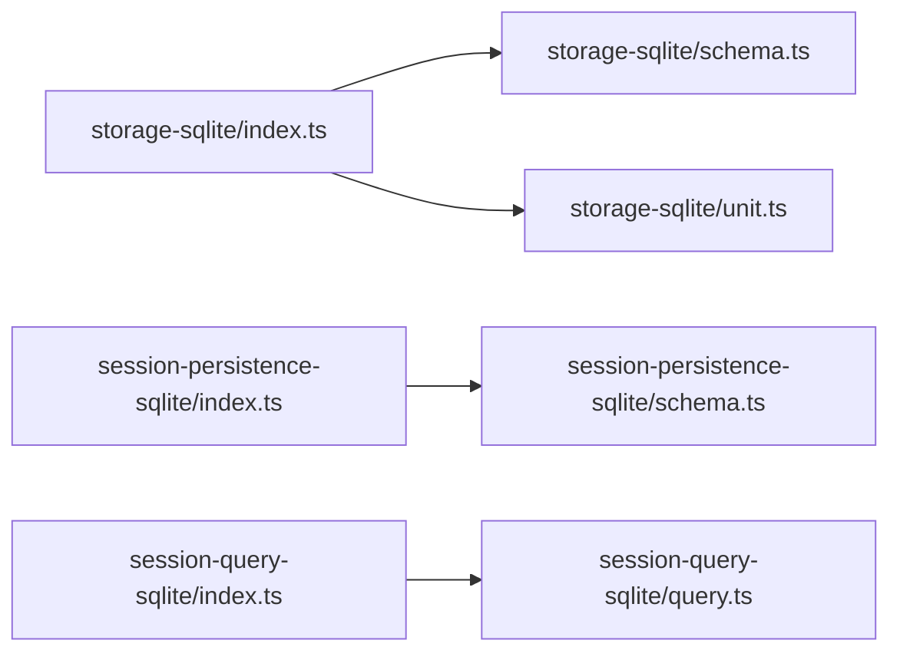

# SQLite 存储

<cite>
**本文引用的文件**
- [packages/storage/storage-sqlite/src/index.ts](file://packages/storage/storage-sqlite/src/index.ts)
- [packages/storage/storage-sqlite/src/schema.ts](file://packages/storage/storage-sqlite/src/schema.ts)
- [packages/storage/storage-sqlite/src/unit.ts](file://packages/storage/storage-sqlite/src/unit.ts)
- [packages/session/session-persistence-sqlite/src/index.ts](file://packages/session/session-persistence-sqlite/src/index.ts)
- [packages/session/session-persistence-sqlite/src/schema.ts](file://packages/session/session-persistence-sqlite/src/schema.ts)
- [packages/session-query/session-query-sqlite/src/index.ts](file://packages/session-query/session-query-sqlite/src/index.ts)
- [packages/session-query/session-query-sqlite/src/query.ts](file://packages/session-query/session-query-sqlite/src/query.ts)
- [packages/storage/storage-sqlite/tests/sqlite-backend.spec.ts](file://packages/storage/storage-sqlite/tests/sqlite-backend.spec.ts)
</cite>

## 目录
1. [简介](#简介)
2. [项目结构](#项目结构)
3. [核心组件](#核心组件)
4. [架构总览](#架构总览)
5. [详细组件分析](#详细组件分析)
6. [依赖关系分析](#依赖关系分析)
7. [性能考量](#性能考量)
8. [故障排查指南](#故障排查指南)
9. [结论](#结论)
10. [附录](#附录)

## 简介
本文件面向需要在应用中使用结构化查询与复杂关系的场景，系统性说明基于 SQLite 的存储后端实现。内容涵盖：
- 存储实现原理与优势（事务、原子性、强一致、可查询）
- 数据库 Schema 设计、表结构与索引策略
- 连接管理、事务处理与并发控制机制
- 配置项：数据库路径、日志模式、缓存与批写窗口等
- 数据迁移策略与版本升级流程
- 性能基准与查询优化建议
- 备份恢复方案与高可用注意事项

## 项目结构
仓库中与 SQLite 存储相关的代码主要分布在三个包中：
- storage-sqlite：通用键值存储后端，提供按单元（unit）隔离的记录表与全局槽位
- session-persistence-sqlite：会话事件持久化后端，将会话元数据与事件序列持久化为行
- session-query-sqlite：基于 SQLite FTS5 的会话检索引擎（配合持久化使用）

图表来源
- [packages/storage/storage-sqlite/src/index.ts:1-169](file://packages/storage/storage-sqlite/src/index.ts#L1-L169)
- [packages/session/session-persistence-sqlite/src/index.ts:1-415](file://packages/session/session-persistence-sqlite/src/index.ts#L1-L415)
- [packages/session-query/session-query-sqlite/src/index.ts:357-1062](file://packages/session-query/session-query-sqlite/src/index.ts#L357-L1062)

章节来源
- [packages/storage/storage-sqlite/src/index.ts:1-169](file://packages/storage/storage-sqlite/src/index.ts#L1-L169)
- [packages/session/session-persistence-sqlite/src/index.ts:1-415](file://packages/session/session-persistence-sqlite/src/index.ts#L1-L415)
- [packages/session-query/session-query-sqlite/src/index.ts:357-1062](file://packages/session-query/session-query-sqlite/src/index.ts#L357-L1062)

## 核心组件
- 存储后端 SqliteStorageBackend：单数据库连接、按单元创建记录表、支持全局槽位；通过插件注册到存储中心
- 单元 SqliteKvUnit：为每个声明的表准备语句，执行增删查与全局槽位写入
- 会话持久化 SqliteSessionPersistence：将会话头与会话事件持久化到 sessions/events 表，提供追加、列表、快照、从某 seq 读取等能力
- 会话检索 SqliteSessionQueryEngine：基于 FTS5 的全文检索，支持分页、排序、片段摘要与游标

章节来源
- [packages/storage/storage-sqlite/src/index.ts:55-169](file://packages/storage/storage-sqlite/src/index.ts#L55-L169)
- [packages/storage/storage-sqlite/src/unit.ts:1-157](file://packages/storage/storage-sqlite/src/unit.ts#L1-L157)
- [packages/session/session-persistence-sqlite/src/index.ts:99-415](file://packages/session/session-persistence-sqlite/src/index.ts#L99-L415)
- [packages/session-query/session-query-sqlite/src/index.ts:357-1062](file://packages/session-query/session-query-sqlite/src/index.ts#L357-L1062)

## 架构总览
SQLite 存储后端以“单库多单元”和“会话事件行式存储”为核心思想，结合严格的事务边界与版本校验，确保一致性、可恢复性与可观测性。

图表来源
- [packages/storage/storage-sqlite/src/index.ts:55-123](file://packages/storage/storage-sqlite/src/index.ts#L55-L123)
- [packages/storage/storage-sqlite/src/unit.ts:27-157](file://packages/storage/storage-sqlite/src/unit.ts#L27-L157)
- [packages/storage/storage-sqlite/src/schema.ts:61-108](file://packages/storage/storage-sqlite/src/schema.ts#L61-L108)

## 详细组件分析

### 存储后端（storage-sqlite）
- 数据库打开与配置
  - 自动创建目录与数据库文件（权限受控），设置外键约束与日志模式
  - 通过 user_version 进行物理布局版本校验，非当前版本拒绝打开
  - 初始化 units 与 unit_globals 元数据表
- 单元生命周期
  - 对单元名与表名进行正则校验，防止注入
  - 同一单元名禁止重复打开，关闭后释放
  - 按描述符动态创建 u_<unit>_<table> 记录表（STRICT 模式）
- 事务与一致性
  - 每条操作为单条 SQL 语句，原子性由 SQLite 保证
  - 读路径无显式事务，写路径遵循调用方顺序（KV 契约要求）
- 错误处理
  - 非法名称、版本不匹配、已关闭、JSON 解析失败等均有明确错误码

图表来源
- [packages/storage/storage-sqlite/src/index.ts:75-123](file://packages/storage/storage-sqlite/src/index.ts#L75-L123)
- [packages/storage/storage-sqlite/src/schema.ts:77-108](file://packages/storage/storage-sqlite/src/schema.ts#L77-L108)

章节来源
- [packages/storage/storage-sqlite/src/index.ts:23-169](file://packages/storage/storage-sqlite/src/index.ts#L23-L169)
- [packages/storage/storage-sqlite/src/schema.ts:14-121](file://packages/storage/storage-sqlite/src/schema.ts#L14-L121)
- [packages/storage/storage-sqlite/src/unit.ts:1-157](file://packages/storage/storage-sqlite/src/unit.ts#L1-L157)
- [packages/storage/storage-sqlite/tests/sqlite-backend.spec.ts:44-200](file://packages/storage/storage-sqlite/tests/sqlite-backend.spec.ts#L44-L200)

### 会话持久化（session-persistence-sqlite）
- 数据库 Schema
  - persistence_state：存储唯一 store_id，用于标识存储实例
  - sessions：会话元数据（id、version、created_at、cwd、parent_session、seed_length、origin、delegation_depth、agent_preset、incarnation、revision）
  - events：每事件一行（seq、type、time、data、source_event_seqs、surface_op、ignorable），主键 (session_id, seq)，外键关联 sessions
- 打开与所有权校验
  - 在 BEGIN IMMEDIATE 下校验 application_id 与 user_version，防止误用无关数据库
  - 首次打开时插入 singleton store_id，并设置 application_id 与 user_version
- 写入与修复
  - appendBatch：在单个事务内写入会话行（惰性物化）与所有事件，最后递增 revision
  - commitRepair：删除损坏尾部（tornMarker 起）并插入合成 closers，保证平衡日志
- 读取与扫描
  - readPrefix/readStoredFrom：按 id 或 fromSeq 读取，scanRows 识别保留前缀与撕裂尾部
  - list/listSnapshots：列出会话元数据及带源标识的单调 revision

图表来源
- [packages/session/session-persistence-sqlite/src/index.ts:284-302](file://packages/session/session-persistence-sqlite/src/index.ts#L284-L302)
- [packages/session/session-persistence-sqlite/src/schema.ts:92-172](file://packages/session/session-persistence-sqlite/src/schema.ts#L92-L172)

章节来源
- [packages/session/session-persistence-sqlite/src/index.ts:69-415](file://packages/session/session-persistence-sqlite/src/index.ts#L69-L415)
- [packages/session/session-persistence-sqlite/src/schema.ts:15-271](file://packages/session/session-persistence-sqlite/src/schema.ts#L15-L271)

### 会话检索（session-query-sqlite）
- 配置与限制
  - journalMode 仅允许 wal/delete/truncate/persist
  - persistedInspectConcurrency 必须为正整数，defaultLimit ≤ maxLimit
  - 变量绑定数量与 FTS5 外层谓词预算有限制，避免不可移植或低效计划
- 运行时行为
  - 延迟打开策略（startup/first-search/later）
  - 序列化执行关键路径，避免竞争
  - 使用 FTS5 unicode61 分词器，短语匹配安全且可预测

章节来源
- [packages/session-query/session-query-sqlite/src/index.ts:357-1062](file://packages/session-query/session-query-sqlite/src/index.ts#L357-L1062)
- [packages/session-query/session-query-sqlite/src/query.ts:29-64](file://packages/session-query/session-query-sqlite/src/query.ts#L29-L64)

## 依赖关系分析
- storage-sqlite 依赖 node:sqlite 的 DatabaseSync，并通过 schema 模块统一打开与配置逻辑
- session-persistence-sqlite 同样使用 DatabaseSync，并在 openDatabase 中进行更严格的 ownership 校验
- session-query-sqlite 依赖 FTS5 能力，并对请求参数做预算限制以保证可移植性与性能

图表来源
- [packages/storage/storage-sqlite/src/index.ts:1-169](file://packages/storage/storage-sqlite/src/index.ts#L1-L169)
- [packages/storage/storage-sqlite/src/schema.ts:1-121](file://packages/storage/storage-sqlite/src/schema.ts#L1-L121)
- [packages/storage/storage-sqlite/src/unit.ts:1-157](file://packages/storage/storage-sqlite/src/unit.ts#L1-L157)
- [packages/session/session-persistence-sqlite/src/index.ts:1-415](file://packages/session/session-persistence-sqlite/src/index.ts#L1-L415)
- [packages/session/session-persistence-sqlite/src/schema.ts:1-271](file://packages/session/session-persistence-sqlite/src/schema.ts#L1-L271)
- [packages/session-query/session-query-sqlite/src/index.ts:357-1062](file://packages/session-query/session-query-sqlite/src/index.ts#L357-L1062)
- [packages/session-query/session-query-sqlite/src/query.ts:29-64](file://packages/session-query/session-query-sqlite/src/query.ts#L29-L64)

章节来源
- [packages/storage/storage-sqlite/src/index.ts:1-169](file://packages/storage/storage-sqlite/src/index.ts#L1-L169)
- [packages/session/session-persistence-sqlite/src/index.ts:1-415](file://packages/session/session-persistence-sqlite/src/index.ts#L1-L415)
- [packages/session-query/session-query-sqlite/src/index.ts:357-1062](file://packages/session-query/session-query-sqlite/src/index.ts#L357-L1062)

## 性能考量
- 日志模式
  - 默认 WAL，适合本地磁盘；网络挂载建议使用 delete/truncate/persist 回滚日志模式
- 事务与批写
  - 会话追加使用单事务批量写入，减少提交开销
  - 可通过 writeBatchMaxDelayMs 合并事件写入窗口，降低频繁提交
- 读取优化
  - 支持从指定 seq 读取后缀，避免全量扫描
  - 会话列表与快照直接读取 sessions 表，轻量高效
- 检索限制
  - 变量绑定与 FTS5 外层谓词预算限制，避免生成低效计划
  - 使用 unicode61 分词器，兼顾召回与索引体积

[本节为通用指导，不直接分析具体文件]

## 故障排查指南
- 版本不匹配
  - 存储后端：user_version 与预期不一致会拒绝打开
  - 会话持久化：application_id 或 user_version 不匹配会拒绝打开
- 非法名称
  - 单元名或表名不符合命名规范会被拒绝
- JSON 损坏
  - 读取时遇到无法解析的 JSON 会抛出特定错误码
- 重复打开与关闭状态
  - 同一单元名重复打开被拒绝；后端关闭后再次打开将被拒绝
- 撕裂尾部
  - scanRows 识别撕裂尾部并提供 tornMarker，commitRepair 可安全修复

章节来源
- [packages/storage/storage-sqlite/src/schema.ts:77-108](file://packages/storage/storage-sqlite/src/schema.ts#L77-L108)
- [packages/storage/storage-sqlite/src/unit.ts:86-97](file://packages/storage/storage-sqlite/src/unit.ts#L86-L97)
- [packages/storage/storage-sqlite/tests/sqlite-backend.spec.ts:75-100](file://packages/storage/storage-sqlite/tests/sqlite-backend.spec.ts#L75-L100)
- [packages/session/session-persistence-sqlite/src/schema.ts:92-172](file://packages/session/session-persistence-sqlite/src/schema.ts#L92-L172)
- [packages/session/session-persistence-sqlite/src/schema.ts:220-271](file://packages/session/session-persistence-sqlite/src/schema.ts#L220-L271)

## 结论
SQLite 存储后端以简单可靠的单机数据库为基础，提供了：
- 强一致的事务与原子性保障
- 清晰的 Schema 与版本控制
- 高效的批写与可寻址读取
- 安全的检索与预算限制
适用于需要结构化查询、复杂关系与可恢复性的场景。对于跨进程高可用需求，应结合外部备份与复制策略。

[本节为总结性内容，不直接分析具体文件]

## 附录

### 数据库 Schema 设计与索引策略
- storage-sqlite
  - units(name PK, version)：单元元数据
  - unit_globals(unit PK, value)：单元级全局槽位
  - u_<unit>_<table>(key PK, value)：记录表，key 为主键
- session-persistence-sqlite
  - persistence_state(singleton PK, store_id)：存储实例标识
  - sessions(id PK, ...incarnation, revision)：会话元数据
  - events(session_id, seq PK, type, time, data, source_event_seqs, surface_op, ignorable)：事件行，主键为复合键，外键引用 sessions

章节来源
- [packages/storage/storage-sqlite/src/schema.ts:90-108](file://packages/storage/storage-sqlite/src/schema.ts#L90-L108)
- [packages/session/session-persistence-sqlite/src/schema.ts:116-147](file://packages/session/session-persistence-sqlite/src/schema.ts#L116-L147)

### 连接池管理与并发控制
- 连接模型
  - 存储后端维护单一 DatabaseSync 连接；单元对象复用预编译语句
  - 会话持久化同样维护单一连接，协调器负责写路径编排
- 并发控制
  - 通过 SQLite 自身锁与事务边界保证一致性
  - 检索引擎对关键路径进行序列化执行，避免竞争
- 注意
  - 未实现连接池；如需更高并发，应考虑多进程或多实例部署

章节来源
- [packages/storage/storage-sqlite/src/index.ts:55-123](file://packages/storage/storage-sqlite/src/index.ts#L55-L123)
- [packages/session/session-persistence-sqlite/src/index.ts:124-138](file://packages/session/session-persistence-sqlite/src/index.ts#L124-L138)
- [packages/session-query/session-query-sqlite/src/index.ts:371-393](file://packages/session-query/session-query-sqlite/src/index.ts#L371-L393)

### 配置选项
- storage-sqlite
  - path：数据库路径，支持 :memory:
  - journalMode：wal/delete/truncate/persist，默认 wal
- session-persistence-sqlite
  - path：同上
  - journalMode：同上
  - preparedSessionCacheSize：冷启动准备缓存大小
  - writeBatchMaxDelayMs：事件批写合并窗口
- session-query-sqlite
  - openAt：启动时机（startup/first-search/later）
  - persistedInspectConcurrency：持久化检查并发度
  - defaultLimit/maxLimit：分页限制
  - journalMode：同上

章节来源
- [packages/storage/storage-sqlite/src/index.ts:23-48](file://packages/storage/storage-sqlite/src/index.ts#L23-L48)
- [packages/session/session-persistence-sqlite/src/index.ts:69-110](file://packages/session/session-persistence-sqlite/src/index.ts#L69-L110)
- [packages/session-query/session-query-sqlite/src/index.ts:1022-1034](file://packages/session-query/session-query-sqlite/src/index.ts#L1022-L1034)

### 数据迁移策略与版本升级
- 物理布局版本
  - storage-sqlite：STORAGE_SQLITE_SCHEMA_VERSION，非当前版本拒绝打开
  - session-persistence-sqlite：SCHEMA_VERSION，配合 application_id 校验
- 升级流程
  - 新版本发布需提升对应版本常量
  - 旧版本数据库将拒绝打开，需先迁移或重建
  - 失败的材料化不会标记版本，便于重试

章节来源
- [packages/storage/storage-sqlite/src/schema.ts:14-20](file://packages/storage/storage-sqlite/src/schema.ts#L14-L20)
- [packages/storage/storage-sqlite/src/schema.ts:81-108](file://packages/storage/storage-sqlite/src/schema.ts#L81-L108)
- [packages/session/session-persistence-sqlite/src/schema.ts:15-20](file://packages/session/session-persistence-sqlite/src/schema.ts#L15-L20)
- [packages/session/session-persistence-sqlite/src/schema.ts:92-172](file://packages/session/session-persistence-sqlite/src/schema.ts#L92-L172)

### 性能基准测试与查询优化建议
- 写入
  - 使用 appendBatch 批量写入，减少事务开销
  - 合理设置 writeBatchMaxDelayMs 以合并事件
- 读取
  - 使用 loadStoredFrom 从指定 seq 读取后缀，避免全量扫描
  - 列表与快照直接读取 sessions 表，保持轻量
- 检索
  - 控制过滤器数量，避免超出 FTS5 外层谓词预算
  - 使用短语匹配，避免危险语法
  - 关注 unicode61 分词器的召回特性

章节来源
- [packages/session/session-persistence-sqlite/src/index.ts:284-302](file://packages/session/session-persistence-sqlite/src/index.ts#L284-L302)
- [packages/session/session-persistence-sqlite/src/index.ts:220-238](file://packages/session/session-persistence-sqlite/src/index.ts#L220-L238)
- [packages/session-query/session-query-sqlite/src/query.ts:29-64](file://packages/session-query/session-query-sqlite/src/query.ts#L29-L64)

### 备份恢复方案与高可用配置
- 备份
  - 使用 SQLite 在线备份 API 或文件系统快照（WAL 模式下更安全）
  - 定期备份 persistence_state/sessions/events 所在数据库文件
- 恢复
  - 停止写入后替换数据库文件，重启服务
  - 若出现撕裂尾部，使用 commitRepair 修复
- 高可用
  - SQLite 为单机数据库，不支持原生主从复制
  - 可通过多实例+负载均衡+共享存储或外部复制方案实现高可用
  - 注意 WAL 共享内存文件在网络挂载上的兼容性问题

[本节为通用指导，不直接分析具体文件]