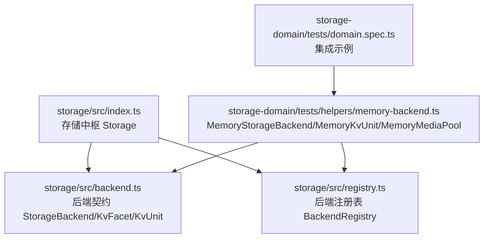
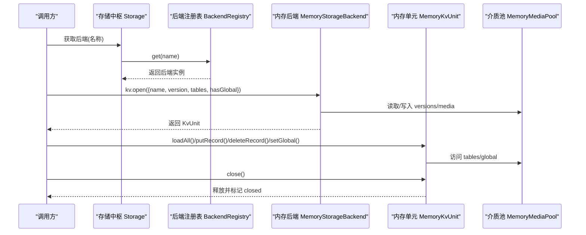
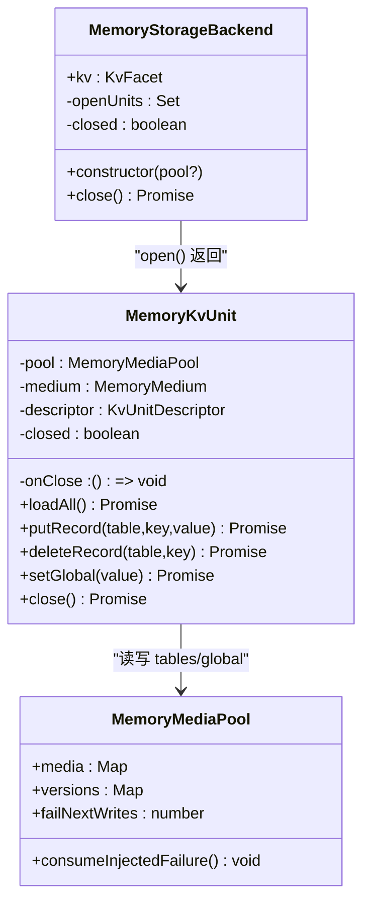
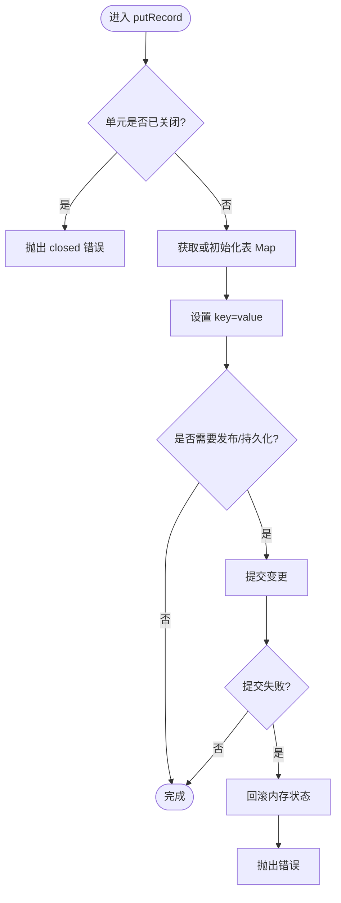
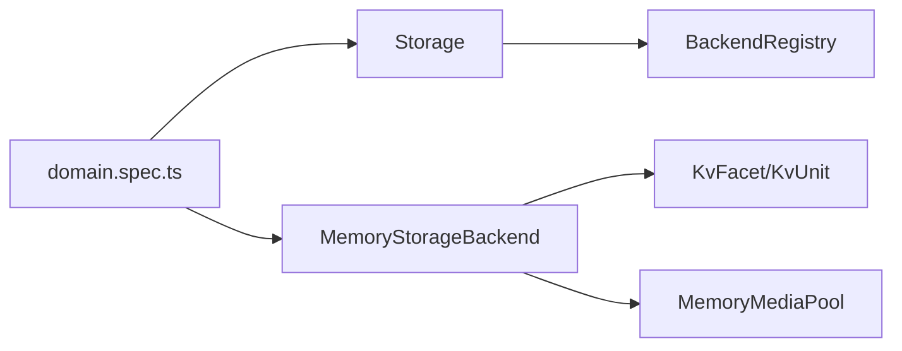

# 内存存储

<cite>
**本文引用的文件**
- [memory-backend.ts](file://packages/storage/storage-domain/tests/helpers/memory-backend.ts)
- [backend.ts](file://packages/storage/storage/src/backend.ts)
- [registry.ts](file://packages/storage/storage/src/registry.ts)
- [index.ts](file://packages/storage/storage/src/index.ts)
- [domain.spec.ts](file://packages/storage/storage-domain/tests/domain.spec.ts)
</cite>

## 目录
1. [简介](#简介)
2. [项目结构](#项目结构)
3. [核心组件](#核心组件)
4. [架构总览](#架构总览)
5. [详细组件分析](#详细组件分析)
6. [依赖关系分析](#依赖关系分析)
7. [性能特征](#性能特征)
8. [配置选项](#配置选项)
9. [测试与开发指南](#测试与开发指南)
10. [故障排查](#故障排查)
11. [结论](#结论)

## 简介
本文件面向“基于内存的临时存储后端”，聚焦仓库中提供的内存实现及其在存储子系统中的作用。该后端以进程内数据结构承载数据，提供键值单元（KV Unit）能力，适用于单元测试、缓存层和临时数据存储等场景。其特点包括：
- 极快的读写速度：直接操作内存映射表，无磁盘 I/O。
- 零持久化：进程退出后数据不可恢复；但通过共享介质池可模拟“重启”语义。
- 生命周期受控：支持显式关闭、版本校验、重复打开保护。
- 可插拔注册：通过命名后端注册表挂载到存储中枢。

## 项目结构
内存存储相关代码主要分布在 storage 子包与 storage-domain 测试辅助中：
- storage/src：定义存储中枢、后端契约、注册表等基础设施。
- storage-domain/tests/helpers：提供内存后端实现与共享介质池，用于测试与演示。

图表来源
- [index.ts:47-93](file://packages/storage/storage/src/index.ts#L47-L93)
- [registry.ts:14-62](file://packages/storage/storage/src/registry.ts#L14-L62)
- [backend.ts:17-104](file://packages/storage/storage/src/backend.ts#L17-L104)
- [memory-backend.ts:21-160](file://packages/storage/storage-domain/tests/helpers/memory-backend.ts#L21-L160)

章节来源
- [index.ts:47-93](file://packages/storage/storage/src/index.ts#L47-L93)
- [registry.ts:14-62](file://packages/storage/storage/src/registry.ts#L14-L62)
- [backend.ts:17-104](file://packages/storage/storage/src/backend.ts#L17-L104)
- [memory-backend.ts:21-160](file://packages/storage/storage-domain/tests/helpers/memory-backend.ts#L21-L160)

## 核心组件
- 存储中枢 Storage：提供后端注册与数据形式挂载点，本身不执行 I/O。
- 后端契约 StorageBackend/KvFacet/KvUnit：定义后端必须实现的 open/loadAll/putRecord/deleteRecord/setGlobal/close 等接口。
- 内存后端 MemoryStorageBackend：实现 KvFacet.open，返回内存 KV 单元 MemoryKvUnit。
- 内存介质池 MemoryMediaPool：共享 tables/global/versions/failNextWrites，用于跨实例复用或注入失败。
- 注册表 BackendRegistry：管理命名后端，提供 register/get/names。

章节来源
- [index.ts:47-93](file://packages/storage/storage/src/index.ts#L47-L93)
- [backend.ts:17-104](file://packages/storage/storage/src/backend.ts#L17-L104)
- [memory-backend.ts:21-160](file://packages/storage/storage-domain/tests/helpers/memory-backend.ts#L21-L160)
- [registry.ts:14-62](file://packages/storage/storage/src/registry.ts#L14-L62)

## 架构总览
内存后端通过存储中枢暴露 kv 能力，上层通过路由选择具体后端。内存后端内部使用 Map 维护每个单元的表与全局槽位，并通过版本号机制防止 schema 不兼容的重开。

图表来源
- [index.ts:47-93](file://packages/storage/storage/src/index.ts#L47-L93)
- [registry.ts:14-62](file://packages/storage/storage/src/registry.ts#L14-L62)
- [backend.ts:17-104](file://packages/storage/storage/src/backend.ts#L17-L104)
- [memory-backend.ts:21-160](file://packages/storage/storage-domain/tests/helpers/memory-backend.ts#L21-L160)

## 详细组件分析

### 内存后端 MemoryStorageBackend
- 职责：实现 StorageBackend.kv.open，负责单元生命周期、版本校验、重复打开保护。
- 关键点：
  - 首次 open 时若 medium 不存在则创建 {tables, global}。
  - 通过 pool.versions 记录已打开单元的版本，再次 open 时进行版本比对，不一致抛出版本不匹配错误。
  - 维护 openUnits 集合，禁止同一 name 重复打开。
  - 提供 close 方法，置闭标志并清空已打开单元集合。

图表来源
- [memory-backend.ts:21-160](file://packages/storage/storage-domain/tests/helpers/memory-backend.ts#L21-L160)

章节来源
- [memory-backend.ts:21-160](file://packages/storage/storage-domain/tests/helpers/memory-backend.ts#L21-L160)

### 存储中枢与注册表
- Storage：提供 backend 注册表与 form 挂载点，对外暴露 ctx.storage。
- BackendRegistry：
  - register(name, backend)：注册后端，返回解绑器。
  - get(name)：按名解析后端，未找到抛错。
  - names()：诊断用，列出已注册后端名。

章节来源
- [index.ts:47-93](file://packages/storage/storage/src/index.ts#L47-L93)
- [registry.ts:14-62](file://packages/storage/storage/src/registry.ts#L14-L62)

### 后端契约与单元模型
- StorageBackend：拥有单一 medium，暴露可选 facet（如 kv），并提供 close。
- KvFacet：仅包含 open(descriptor) -> KvUnit。
- KvUnit：
  - loadAll：读取整单元快照（tables + global）。
  - putRecord/deleteRecord：单条记录的原子写入/删除。
  - setGlobal：当 descriptor.hasGlobal 为真时允许写全局槽位。
  - close：释放单元。

章节来源
- [backend.ts:17-104](file://packages/storage/storage/src/backend.ts#L17-L104)

### 数据流与算法流程
以下流程图展示 putRecord 的关键路径（内存后端简化了发布/持久化步骤，但仍遵循“先改内存、再提交”的模式；JSON 后端在失败时会回滚内存状态）。

图表来源
- [memory-backend.ts:82-97](file://packages/storage/storage-domain/tests/helpers/memory-backend.ts#L82-L97)
- [unit.ts:69-94](file://packages/storage/storage-json/src/unit.ts#L69-L94)

章节来源
- [memory-backend.ts:82-97](file://packages/storage/storage-domain/tests/helpers/memory-backend.ts#L82-L97)
- [unit.ts:69-94](file://packages/storage/storage-json/src/unit.ts#L69-L94)

## 依赖关系分析
- Storage 依赖 BackendRegistry 管理后端。
- 内存后端依赖后端契约（KvFacet/KvUnit）与介质池。
- 测试用例通过 domain.spec 将内存后端注册到存储中枢，并验证路由、版本、schema 校验等行为。

图表来源
- [index.ts:47-93](file://packages/storage/storage/src/index.ts#L47-L93)
- [registry.ts:14-62](file://packages/storage/storage/src/registry.ts#L14-L62)
- [memory-backend.ts:21-160](file://packages/storage/storage-domain/tests/helpers/memory-backend.ts#L21-L160)
- [domain.spec.ts:28-41](file://packages/storage/storage-domain/tests/domain.spec.ts#L28-L41)

章节来源
- [index.ts:47-93](file://packages/storage/storage/src/index.ts#L47-L93)
- [registry.ts:14-62](file://packages/storage/storage/src/registry.ts#L14-L62)
- [memory-backend.ts:21-160](file://packages/storage/storage-domain/tests/helpers/memory-backend.ts#L21-L160)
- [domain.spec.ts:28-41](file://packages/storage/storage-domain/tests/domain.spec.ts#L28-L41)

## 性能特征
- 读写延迟极低：所有操作均为内存 Map 存取，无网络与磁盘开销。
- 并发与原子性：单条调用对介质是原子的；并发串行化由调用方保证（领域层每单元一条写链）。
- 容量限制：内存后端未内置条目数上限或 TTL 过期策略；如需限制，应在上层封装或使用其他后端。
- 零持久化：默认不落地；可通过共享介质池在进程内模拟“重启”后的数据可见性。

[本节为通用性能说明，不直接分析具体文件]

## 配置选项
内存后端本身不提供复杂配置项，但其行为受以下因素影响：
- 后端路由：通过存储中枢的 routes 或默认后端选择决定使用哪个后端。
- 单元描述符：
  - name：单元名，需符合命名规范。
  - version：版本戳，首次打开时写入介质，后续打开会进行版本比对。
  - tables：声明的表名列表。
  - hasGlobal：是否允许全局槽位。
- 介质池控制：
  - failNextWrites：注入写失败的次数，便于测试失败路径。
  - versions：预置版本以触发版本不匹配。
  - media：共享 tables/global 以模拟多实例重开。

章节来源
- [backend.ts:45-55](file://packages/storage/storage/src/backend.ts#L45-L55)
- [memory-backend.ts:34-54](file://packages/storage/storage-domain/tests/helpers/memory-backend.ts#L34-L54)
- [memory-backend.ts:125-153](file://packages/storage/storage-domain/tests/helpers/memory-backend.ts#L125-L153)

## 测试与开发指南
- 快速启动：
  1) 加载存储中枢插件。
  2) 构造 MemoryStorageBackend 并注册到后端注册表。
  3) 通过路由或默认后端打开领域单元，进行读写与断言。
- 共享介质池：
  - 将 MemoryMediaPool 传入多个后端实例，可模拟“进程重启后重新打开同一单元”。
  - 通过 pool.versions 预置版本，可强制触发版本不匹配错误。
  - 通过 pool.failNextWrites 注入写失败，验证调用方的回滚与重试逻辑。
- 典型用例参考：
  - 单元测试中注册内存后端并验证 open/route/write/schema/version-mismatch 等行为。

章节来源
- [domain.spec.ts:28-41](file://packages/storage/storage-domain/tests/domain.spec.ts#L28-L41)
- [domain.spec.ts:62-150](file://packages/storage/storage-domain/tests/domain.spec.ts#L62-L150)
- [memory-backend.ts:34-54](file://packages/storage/storage-domain/tests/helpers/memory-backend.ts#L34-L54)
- [memory-backend.ts:125-153](file://packages/storage/storage-domain/tests/helpers/memory-backend.ts#L125-L153)

## 故障排查
常见错误与定位要点：
- closed：对已关闭单元调用任何方法都会抛出 closed 错误。
- duplicate-backend：重复注册同名后端。
- backend-not-found：路由指向的后端未注册。
- version-mismatch：介质上已存在版本与当前描述符版本不一致。
- invalid-record：存储记录不符合领域 schema。
- 注入失败：通过 failNextWrites 模拟写失败，确保调用方正确回滚内存状态。

章节来源
- [memory-backend.ts:67-70](file://packages/storage/storage-domain/tests/helpers/memory-backend.ts#L67-L70)
- [registry.ts:25-37](file://packages/storage/storage/src/registry.ts#L25-L37)
- [registry.ts:44-53](file://packages/storage/storage/src/registry.ts#L44-L53)
- [memory-backend.ts:136-144](file://packages/storage/storage-domain/tests/helpers/memory-backend.ts#L136-L144)
- [domain.spec.ts:117-150](file://packages/storage/storage-domain/tests/domain.spec.ts#L117-L150)

## 结论
内存存储后端提供了高性能、易用的临时数据存储能力，适合测试、缓存与短期数据交换。它严格遵循存储后端契约，具备版本校验、重复打开保护与资源清理机制。由于无内置 TTL 与容量限制，建议在需要这些特性时在上层封装或选用其他后端。通过共享介质池与失败注入，可在测试中覆盖多种边界条件与异常路径，保障系统健壮性。