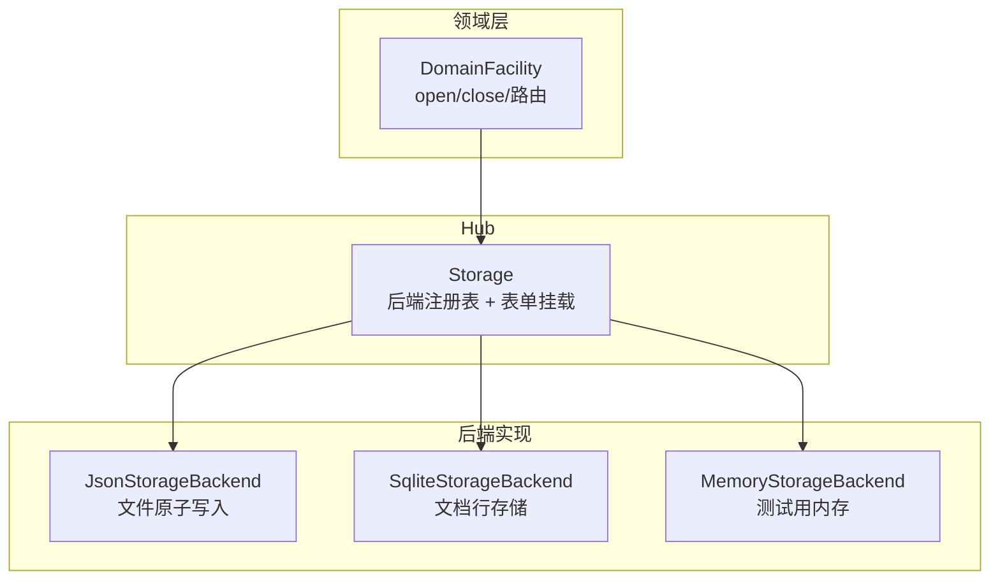
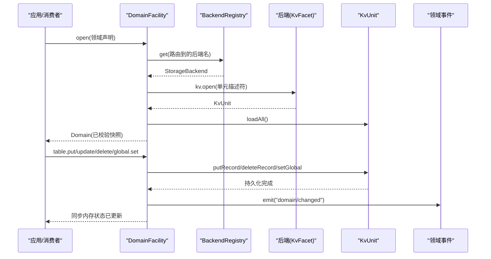
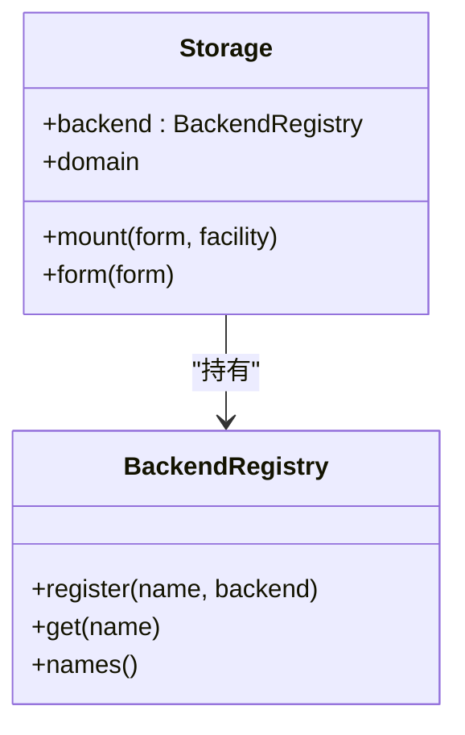
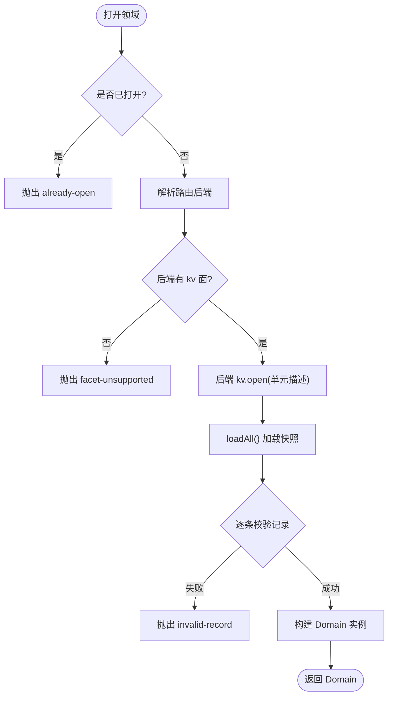
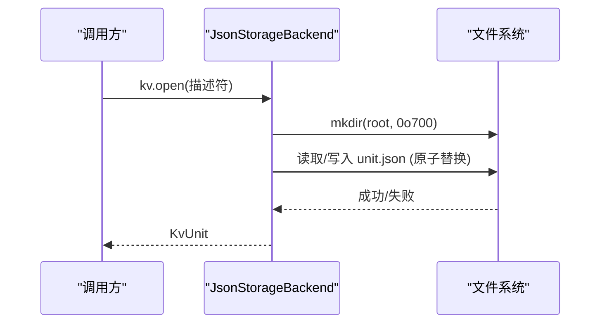
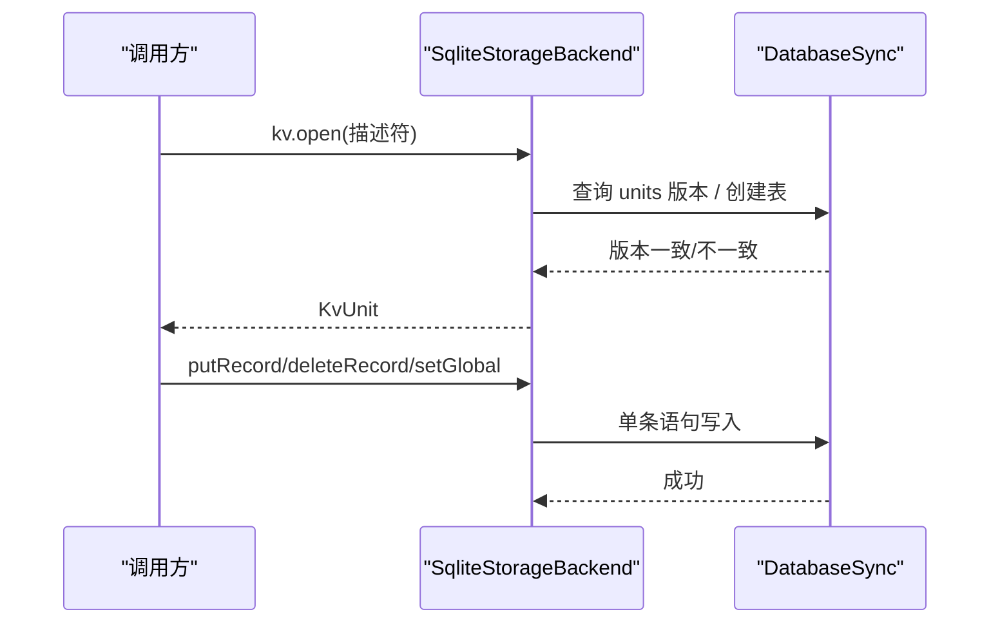
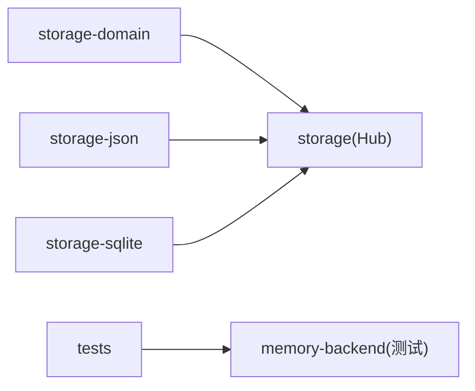

# 存储后端

<cite>
**本文引用的文件**
- [packages/storage/storage/src/backend.ts](file://packages/storage/storage/src/backend.ts)
- [packages/storage/storage/src/index.ts](file://packages/storage/storage/src/index.ts)
- [packages/storage/storage/src/registry.ts](file://packages/storage/storage/src/registry.ts)
- [packages/storage/storage-domain/src/spec.ts](file://packages/storage/storage-domain/src/spec.ts)
- [packages/storage/storage-domain/src/index.ts](file://packages/storage/storage-domain/src/index.ts)
- [packages/storage/storage-json/src/index.ts](file://packages/storage/storage-json/src/index.ts)
- [packages/storage/storage-sqlite/src/index.ts](file://packages/storage/storage-sqlite/src/index.ts)
- [packages/storage/storage/tests/registry.spec.ts](file://packages/storage/storage/tests/registry.spec.ts)
- [packages/storage/storage-domain/tests/domain.spec.ts](file://packages/storage/storage-domain/tests/domain.spec.ts)
- [packages/storage/storage-domain/tests/helpers/memory-backend.ts](file://packages/storage/storage-domain/tests/helpers/memory-backend.ts)
- [docs/subsystems/storage.md](file://docs/subsystems/storage.md)
</cite>

## 目录
1. [简介](#简介)
2. [项目结构](#项目结构)
3. [核心组件](#核心组件)
4. [架构总览](#架构总览)
5. [详细组件分析](#详细组件分析)
6. [依赖关系分析](#依赖关系分析)
7. [性能与扩展性](#性能与扩展性)
8. [故障排查指南](#故障排查指南)
9. [结论](#结论)
10. [附录](#附录)

## 简介
本章节面向 DeepSeek Harness 的“存储后端”子系统，说明其抽象接口、插件化架构、内置后端（JSON 文件、SQLite）特性与适用场景、配置与连接管理、自定义后端开发指南、性能特征、部署拓扑、迁移与备份策略，以及选型建议。该子系统将“领域数据”与“介质实现”解耦：Hub 不直接做 IO，后端拥有介质，领域层定义语义与校验，产品包通过领域 API 消费数据。

**章节来源**
- [docs/subsystems/storage.md:1-10](file://docs/subsystems/storage.md#L1-L10)

## 项目结构
存储子系统由四层组成：
- Hub（服务注册中心）：提供命名后端注册表与数据表单挂载点
- 领域层（Domain）：声明领域模型、版本、表结构与全局单例，负责打开、校验、变更事件
- 后端实现（Backends）：实现 KV 面（键值读写），如 JSON 文件、SQLite
- 测试与契约：跨后端一致性测试与内存后端辅助

**图表来源**
- [packages/storage/storage/src/index.ts:47-93](file://packages/storage/storage/src/index.ts#L47-L93)
- [packages/storage/storage/src/registry.ts:14-62](file://packages/storage/storage/src/registry.ts#L14-L62)
- [packages/storage/storage-domain/src/index.ts:69-177](file://packages/storage/storage-domain/src/index.ts#L69-L177)
- [packages/storage/storage-json/src/index.ts:37-114](file://packages/storage/storage-json/src/index.ts#L37-L114)
- [packages/storage/storage-sqlite/src/index.ts:55-168](file://packages/storage/storage-sqlite/src/index.ts#L55-L168)
- [packages/storage/storage-domain/tests/helpers/memory-backend.ts:117-160](file://packages/storage/storage-domain/tests/helpers/memory-backend.ts#L117-L160)

**章节来源**
- [packages/storage/storage/src/index.ts:1-99](file://packages/storage/storage/src/index.ts#L1-L99)
- [packages/storage/storage/src/registry.ts:1-62](file://packages/storage/storage/src/registry.ts#L1-L62)
- [packages/storage/storage-domain/src/index.ts:1-221](file://packages/storage/storage-domain/src/index.ts#L1-L221)
- [packages/storage/storage-json/src/index.ts:1-115](file://packages/storage/storage-json/src/index.ts#L1-L115)
- [packages/storage/storage-sqlite/src/index.ts:1-169](file://packages/storage/storage-sqlite/src/index.ts#L1-L169)

## 核心组件
- 后端契约（KvFacet/KvUnit）：定义 open/loadAll/putRecord/deleteRecord/setGlobal/close 等最小能力集，保证每个调用在介质上原子且持久化后返回
- Hub（Storage）：维护后端注册表与数据表单挂载；不执行 IO
- 领域设施（DomainFacility）：按配置路由到后端，打开领域、加载快照、校验记录、暴露 typed Domain 句柄
- 领域声明（DomainSpec）：以 zod schema 描述表与全局单例，锁定名称、版本、表名合法性
- 内置后端：
  - JSON：每单位一文件，原子替换，可读性强
  - SQLite：每单位一数据库，文档行存储，适合高频更新
  - 内存：用于测试与隔离环境

**章节来源**
- [packages/storage/storage/src/backend.ts:17-104](file://packages/storage/storage/src/backend.ts#L17-L104)
- [packages/storage/storage/src/index.ts:47-93](file://packages/storage/storage/src/index.ts#L47-L93)
- [packages/storage/storage-domain/src/index.ts:69-177](file://packages/storage/storage-domain/src/index.ts#L69-L177)
- [packages/storage/storage-domain/src/spec.ts:34-112](file://packages/storage/storage-domain/src/spec.ts#L34-L112)
- [packages/storage/storage-json/src/index.ts:37-114](file://packages/storage/storage-json/src/index.ts#L37-L114)
- [packages/storage/storage-sqlite/src/index.ts:55-168](file://packages/storage/storage-sqlite/src/index.ts#L55-L168)

## 架构总览
下图展示从应用调用到后端写盘的完整流程，包括路由、打开单元、写入队列、持久化确认与变更事件。

**图表来源**
- [packages/storage/storage-domain/src/index.ts:100-156](file://packages/storage/storage-domain/src/index.ts#L100-L156)
- [packages/storage/storage/src/registry.ts:44-53](file://packages/storage/storage/src/registry.ts#L44-L53)
- [packages/storage/storage/src/backend.ts:30-104](file://packages/storage/storage/src/backend.ts#L30-L104)

## 详细组件分析

### Hub：Storage 与 BackendRegistry
- 后端注册表支持多后端并存，重复注册抛出错误；get 未找到时抛出“后端未注册”
- 表单挂载支持 domain 等扩展点，重复挂载抛错，卸载后不可解析
- 生命周期：插件 effect 中注册后端，并在卸载时先注销再关闭后端

**图表来源**
- [packages/storage/storage/src/index.ts:47-93](file://packages/storage/storage/src/index.ts#L47-L93)
- [packages/storage/storage/src/registry.ts:14-62](file://packages/storage/storage/src/registry.ts#L14-L62)

**章节来源**
- [packages/storage/storage/src/index.ts:47-93](file://packages/storage/storage/src/index.ts#L47-L93)
- [packages/storage/storage/src/registry.ts:14-62](file://packages/storage/storage/src/registry.ts#L14-L62)
- [packages/storage/storage/tests/registry.spec.ts:38-69](file://packages/storage/storage/tests/registry.spec.ts#L38-L69)

### 领域层：DomainFacility 与 DomainSpec
- 领域声明 defineDomain 会严格校验名称、版本、表名与全局 schema 不接受 null
- 打开流程：检查是否已打开 -> 解析路由 -> 要求 kv 面 -> 打开单元 -> 加载并校验所有记录 -> 构造 Domain
- 写路径：每条写进入领域链串行，先持久化成功，再更新内存，最后发出 domain/changed 事件
- 关闭：拒绝新写，排空队列，释放单元，允许重新打开

**图表来源**
- [packages/storage/storage-domain/src/index.ts:100-156](file://packages/storage/storage-domain/src/index.ts#L100-L156)
- [packages/storage/storage-domain/src/spec.ts:79-112](file://packages/storage/storage-domain/src/spec.ts#L79-L112)

**章节来源**
- [packages/storage/storage-domain/src/index.ts:69-177](file://packages/storage/storage-domain/src/index.ts#L69-L177)
- [packages/storage/storage-domain/src/spec.ts:34-112](file://packages/storage/storage-domain/src/spec.ts#L34-L112)
- [packages/storage/storage-domain/tests/domain.spec.ts:168-194](file://packages/storage/storage-domain/tests/domain.spec.ts#L168-L194)

### 内置后端：JSON 文件
- 模型：每单位一个 JSON 文件，每次写整文件原子替换（临时文件 + fsync + rename）
- 配置：必须指定 root 目录，不存在则创建（权限受控）
- 行为：缺失文件视为空单元，首次写物化；版本不匹配或无法解析报错；并发打开同一单元名被拒绝

**图表来源**
- [packages/storage/storage-json/src/index.ts:37-114](file://packages/storage/storage-json/src/index.ts#L37-L114)

**章节来源**
- [packages/storage/storage-json/src/index.ts:1-115](file://packages/storage/storage-json/src/index.ts#L1-L115)

### 内置后端：SQLite
- 模型：每单位一张或多张物理表（key TEXT PRIMARY KEY, value TEXT），元数据表记录版本；PRAGMA user_version 控制格式
- 配置：path 可为文件路径或 ":memory:"；journalMode 可选 wal 或回滚日志模式
- 行为：DDL 使用安全标识符；每写一条语句即原子；缺少目录/库文件以受限权限创建；版本不匹配拒绝打开

**图表来源**
- [packages/storage/storage-sqlite/src/index.ts:55-168](file://packages/storage/storage-sqlite/src/index.ts#L55-L168)

**章节来源**
- [packages/storage/storage-sqlite/src/index.ts:1-169](file://packages/storage/storage-sqlite/src/index.ts#L1-L169)

### 内置后端：内存（测试）
- 用途：单元测试与隔离环境，共享内存池可模拟跨实例访问
- 行为：遵循后端契约，支持 loadAll/putRecord/deleteRecord/setGlobal/close

**章节来源**
- [packages/storage/storage-domain/tests/helpers/memory-backend.ts:67-160](file://packages/storage/storage-domain/tests/helpers/memory-backend.ts#L67-L160)

## 依赖关系分析
- 领域层依赖 Hub 的后端注册表进行路由解析
- 后端实现依赖 Hub 提供的注册与生命周期钩子
- 测试依赖内存后端验证契约与行为

**图表来源**
- [packages/storage/storage-domain/src/index.ts:194-220](file://packages/storage/storage-domain/src/index.ts#L194-L220)
- [packages/storage/storage-json/src/index.ts:104-114](file://packages/storage/storage-json/src/index.ts#L104-L114)
- [packages/storage/storage-sqlite/src/index.ts:158-168](file://packages/storage/storage-sqlite/src/index.ts#L158-L168)

**章节来源**
- [packages/storage/storage-domain/src/index.ts:194-220](file://packages/storage/storage-domain/src/index.ts#L194-L220)
- [packages/storage/storage-json/src/index.ts:104-114](file://packages/storage/storage-json/src/index.ts#L104-L114)
- [packages/storage/storage-sqlite/src/index.ts:158-168](file://packages/storage/storage-sqlite/src/index.ts#L158-L168)

## 性能与扩展性
- JSON 后端
  - 优点：人类可读、调试友好、整文件原子替换简单可靠
  - 缺点：大对象或高并发写时 I/O 开销较大；无跨进程写锁
  - 适用：小规模、低并发、需要可读性的场景
- SQLite 后端
  - 优点：单行更新高效、适合高频更新；可通过 journal_mode 适配不同文件系统
  - 缺点：同步写入阻塞事件循环；无忙等待/重试；仅当前 schema 版本可打开
  - 适用：中大规模、频繁更新的领域数据
- 扩展性
  - 新增后端只需实现 KvFacet 并注册到 Hub；领域层无需感知具体介质
  - 通过 DomainFacility 的路由配置，可按领域选择合适后端
- 部署拓扑
  - 单机进程内：JSON 或 SQLite（含 :memory:）
  - 多进程：建议使用 SQLite 并配合外部协调（当前无内置写锁）；或采用只读副本+主节点写
- 基准与选型
  - 仓库未提供跨后端基准测试代码；建议基于自身负载（读/写比例、对象大小、并发度）评估
  - 一般经验：小数据/可读优先选 JSON；高频更新/大数据选 SQLite

[本节为通用指导，不直接分析具体文件]

## 故障排查指南
- 常见错误码与触发条件
  - duplicate-mount：重复挂载表单
  - form-not-mounted：表单未挂载
  - backend-not-found：路由到未注册后端
  - facet-unsupported：后端未实现 kv 面
  - version-mismatch：介质版本与描述符不一致
  - malformed-medium：介质无法解析或名称非法
  - closed：后端或单元已关闭
- 定位步骤
  - 检查 DomainFacility 配置中的 backend 与 routes 是否正确
  - 确认后端插件已 apply 并成功 register
  - 查看领域声明的版本与表名是否符合 UNIT_NAME_RE
  - 对 JSON 后端检查 root 目录权限与文件完整性；对 SQLite 检查 journal_mode 与文件路径
- 参考用例
  - 表单挂载/卸载与重复挂载行为
  - 后端注册/注销与 stale disposer 处理
  - 领域打开/关闭与路由等待

**章节来源**
- [packages/storage/storage/tests/registry.spec.ts:38-69](file://packages/storage/storage/tests/registry.spec.ts#L38-L69)
- [packages/storage/storage-domain/tests/domain.spec.ts:168-194](file://packages/storage/storage-domain/tests/domain.spec.ts#L168-L194)
- [packages/storage/storage/src/registry.ts:44-53](file://packages/storage/storage/src/registry.ts#L44-L53)
- [packages/storage/storage-domain/src/index.ts:100-156](file://packages/storage/storage-domain/src/index.ts#L100-L156)

## 结论
DeepSeek Harness 存储后端通过 Hub + 领域层 + 后端实现的清晰分层，实现了强类型、可插拔、可验证的数据持久化方案。JSON 与 SQLite 两种内置后端覆盖从“可读性优先”到“高频更新优先”的典型场景。通过领域声明与路由配置，可在不改动上层业务的前提下切换或组合不同介质。生产环境建议根据数据规模、并发与运维需求选择后端，并结合迁移与备份策略保障数据安全。

[本节为总结，不直接分析具体文件]

## 附录

### 配置方法速查
- 领域层（DomainFacility）
  - backend：默认后端名（必填）
  - routes：按领域名覆盖后端（可选）
- JSON 后端
  - root：单位文件根目录（必填）
- SQLite 后端
  - path：数据库文件或 ":memory:"（必填）
  - journalMode：wal | delete | truncate | persist（可选，默认 wal）

**章节来源**
- [packages/storage/storage-domain/src/index.ts:52-62](file://packages/storage/storage-domain/src/index.ts#L52-L62)
- [packages/storage/storage-json/src/index.ts:27-35](file://packages/storage/storage-json/src/index.ts#L27-L35)
- [packages/storage/storage-sqlite/src/index.ts:23-48](file://packages/storage/storage-sqlite/src/index.ts#L23-L48)

### 自定义存储后端开发指南
- 实现 KvFacet 与 KvUnit：确保每个调用在介质上原子且持久化后返回；close 幂等
- 名称与版本：遵守 UNIT_NAME_RE；在介质上标记版本，版本不匹配应拒绝
- 注册与生命周期：在插件 apply 中注册到 Hub，effect 中返回 unregister；卸载时先注销再 close
- 测试：通过契约测试套件验证行为一致性

**章节来源**
- [packages/storage/storage/src/backend.ts:17-104](file://packages/storage/storage/src/backend.ts#L17-L104)
- [packages/storage/storage-json/src/index.ts:104-114](file://packages/storage/storage-json/src/index.ts#L104-L114)
- [packages/storage/storage-sqlite/src/index.ts:158-168](file://packages/storage/storage-sqlite/src/index.ts#L158-L168)

### 存储迁移与数据备份策略
- 迁移
  - 通过提高 DomainSpec.version 强制旧介质拒绝打开；在新版本中加载旧数据并转换后再写入新版本
  - 建议在独立进程中执行迁移，避免与运行期写冲突
- 备份
  - JSON：直接复制 root 目录；注意原子写入期间的一致性窗口
  - SQLite：使用 WAL 模式并配合离线拷贝或一致性导出；避免在线热拷导致损坏
- 恢复
  - JSON：替换 root 目录后重启
  - SQLite：替换数据库文件并确保权限正确；必要时重建索引（本后端为自管理）

[本节为通用指导，不直接分析具体文件]