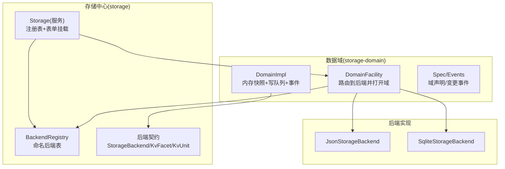
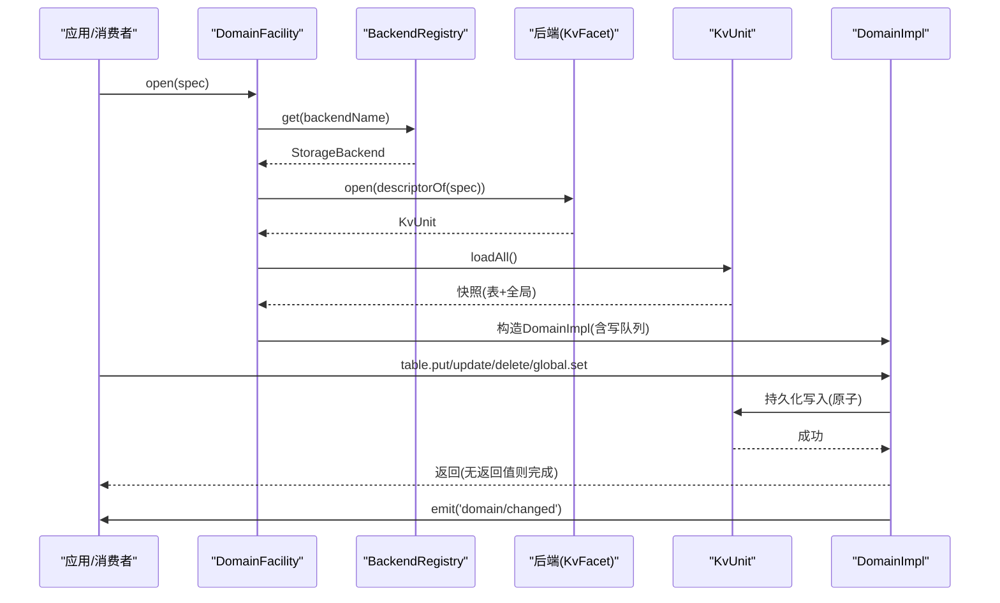
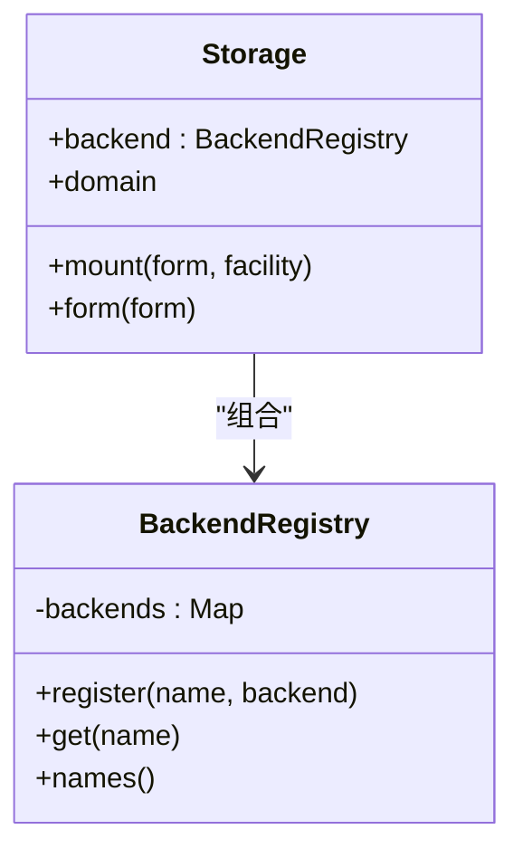
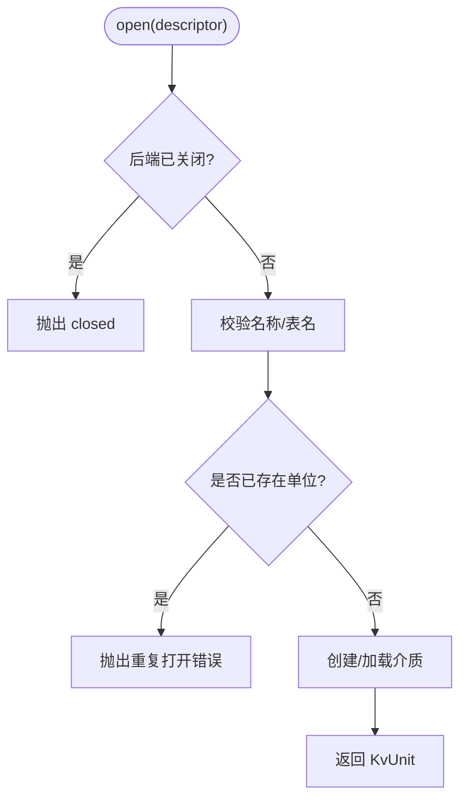
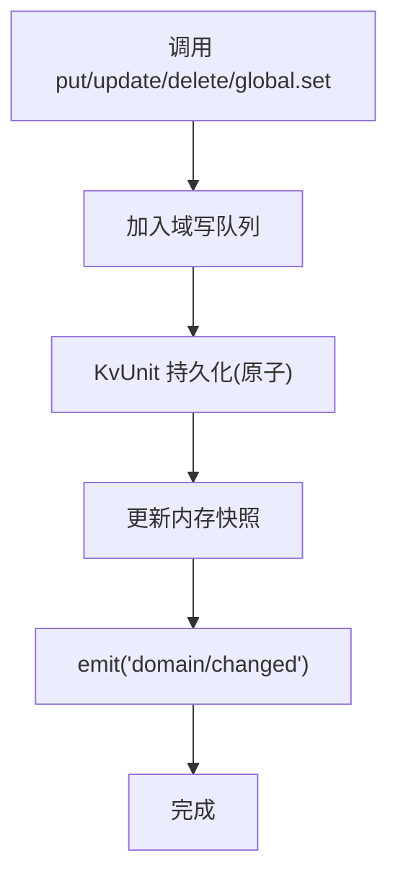
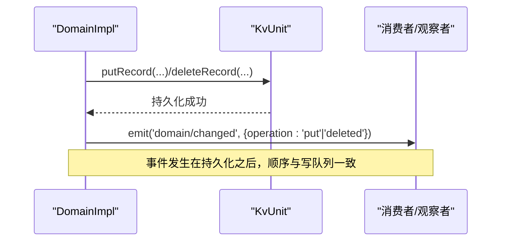
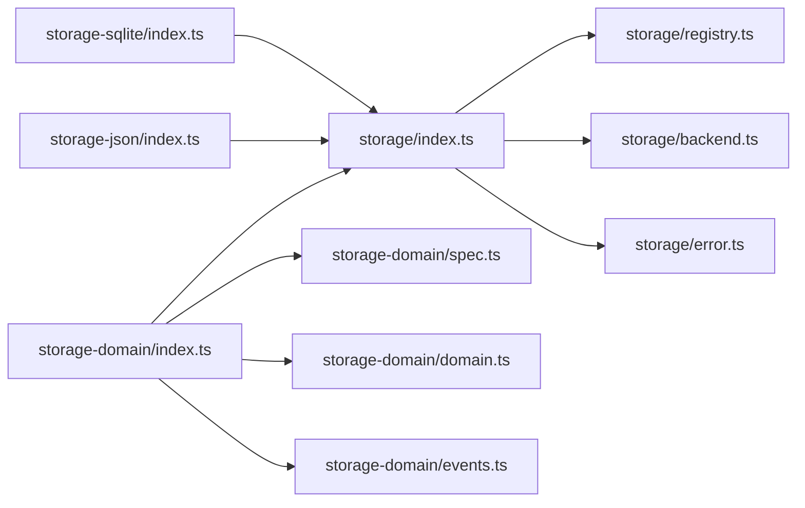

# 存储架构设计

<cite>
**本文引用的文件**
- [packages/storage/storage/src/index.ts](file://packages/storage/storage/src/index.ts)
- [packages/storage/storage/src/backend.ts](file://packages/storage/storage/src/backend.ts)
- [packages/storage/storage/src/registry.ts](file://packages/storage/storage/src/registry.ts)
- [packages/storage/storage/src/error.ts](file://packages/storage/storage/src/error.ts)
- [packages/storage/storage-domain/src/index.ts](file://packages/storage/storage-domain/src/index.ts)
- [packages/storage/storage-domain/src/domain.ts](file://packages/storage/storage-domain/src/domain.ts)
- [packages/storage/storage-domain/src/spec.ts](file://packages/storage/storage-domain/src/spec.ts)
- [packages/storage/storage-domain/src/events.ts](file://packages/storage/storage-domain/src/events.ts)
- [packages/storage/storage-json/src/index.ts](file://packages/storage/storage-json/src/index.ts)
- [packages/storage/storage-sqlite/src/index.ts](file://packages/storage/storage-sqlite/src/index.ts)
- [docs/subsystems/storage.md](file://docs/subsystems/storage.md)
</cite>

## 目录
1. [简介](#简介)
2. [项目结构](#项目结构)
3. [核心组件](#核心组件)
4. [架构总览](#架构总览)
5. [详细组件分析](#详细组件分析)
6. [依赖关系分析](#依赖关系分析)
7. [性能考量](#性能考量)
8. [故障排查指南](#故障排查指南)
9. [结论](#结论)
10. [附录](#附录)

## 简介
本文件系统性阐述 DeepSeek Harness 的存储子系统：以“存储后端抽象 + 数据域模型 + 事件系统 + 注册表与发现”为核心的插件化架构。重点解释键值操作、事务支持（通过写队列串行化）、原子性保证、生命周期管理、错误处理策略，以及扩展新后端的最佳实践与设计原则。文档同时提供架构图与数据流图，帮助开发者快速理解整体设计与实现细节。

## 项目结构
存储子系统按职责拆分为多个包：
- storage：存储中心（Hub），负责后端注册表与数据表单挂载点；定义后端契约与错误码。
- storage-domain：数据域层，基于后端 KV 能力提供带模式校验、变更事件的领域 API。
- storage-json：JSON 文件型后端实现。
- storage-sqlite：SQLite 数据库型后端实现。

图表来源
- [packages/storage/storage/src/index.ts:47-93](file://packages/storage/storage/src/index.ts#L47-L93)
- [packages/storage/storage/src/registry.ts:14-62](file://packages/storage/storage/src/registry.ts#L14-L62)
- [packages/storage/storage/src/backend.ts:17-104](file://packages/storage/storage/src/backend.ts#L17-L104)
- [packages/storage/storage-domain/src/index.ts:69-178](file://packages/storage/storage-domain/src/index.ts#L69-L178)
- [packages/storage/storage-domain/src/domain.ts:140-277](file://packages/storage/storage-domain/src/domain.ts#L140-L277)
- [packages/storage/storage-json/src/index.ts:37-86](file://packages/storage/storage-json/src/index.ts#L37-L86)
- [packages/storage/storage-sqlite/src/index.ts:55-150](file://packages/storage/storage-sqlite/src/index.ts#L55-L150)

章节来源
- [docs/subsystems/storage.md:9-24](file://docs/subsystems/storage.md#L9-L24)

## 核心组件
- 存储中心 Storage：提供后端注册表 backend 与数据表单挂载 mount/form，自身不做 IO。
- 后端契约 StorageBackend/KvFacet/KvUnit：统一键值单元接口，包含 open/loadAll/putRecord/deleteRecord/setGlobal/close。
- 数据域 DomainFacility/DomainImpl：将后端 KV 封装为带模式校验、写队列串行、变更事件的事件驱动域。
- 域声明 Spec：defineDomain/domainTable/descriptorOf 定义域身份、版本、表结构与全局单例。
- 变更事件 domain/changed：每次持久化成功后发出 put/deleted 事件，携带新快照或墓碑。
- 后端实现：json（每单元一个 JSON 文件）与 sqlite（单库多单元）。

章节来源
- [packages/storage/storage/src/index.ts:47-93](file://packages/storage/storage/src/index.ts#L47-L93)
- [packages/storage/storage/src/backend.ts:17-104](file://packages/storage/storage/src/backend.ts#L17-L104)
- [packages/storage/storage-domain/src/index.ts:69-178](file://packages/storage/storage-domain/src/index.ts#L69-L178)
- [packages/storage/storage-domain/src/domain.ts:140-277](file://packages/storage/storage-domain/src/domain.ts#L140-L277)
- [packages/storage/storage-domain/src/spec.ts:34-112](file://packages/storage/storage-domain/src/spec.ts#L34-L112)
- [packages/storage/storage-domain/src/events.ts:10-49](file://packages/storage/storage-domain/src/events.ts#L10-L49)
- [packages/storage/storage-json/src/index.ts:37-86](file://packages/storage/storage-json/src/index.ts#L37-L86)
- [packages/storage/storage-sqlite/src/index.ts:55-150](file://packages/storage/storage-sqlite/src/index.ts#L55-L150)

## 架构总览
存储子系统采用“中心 Hub + 插件后端 + 数据域”的分层设计：
- Hub 仅做注册与分发，不持有状态。
- 数据域对上层暴露强类型、可观察的 KV 域，屏蔽后端差异。
- 后端以插件形式注册，按需实现 kv 能力；未实现的 facet 会显式失败。

图表来源
- [packages/storage/storage-domain/src/index.ts:100-156](file://packages/storage/storage-domain/src/index.ts#L100-L156)
- [packages/storage/storage/src/registry.ts:44-53](file://packages/storage/storage/src/registry.ts#L44-L53)
- [packages/storage/storage/src/backend.ts:30-104](file://packages/storage/storage/src/backend.ts#L30-L104)
- [packages/storage/storage-domain/src/domain.ts:263-270](file://packages/storage/storage-domain/src/domain.ts#L263-L270)
- [packages/storage/storage-domain/src/events.ts:36-49](file://packages/storage/storage-domain/src/events.ts#L36-L49)

## 详细组件分析

### 存储中心与后端注册表
- Storage 提供 backend 注册表与表单挂载点；重复注册/重复挂载会抛出明确错误。
- BackendRegistry 维护 name→backend 映射，提供 register/get/names；释放时仅注销名称，不关闭后端实例。
- storageBackendServiceKey 生成生命周期服务键，供域插件注入后端以规避竞态。

图表来源
- [packages/storage/storage/src/index.ts:47-93](file://packages/storage/storage/src/index.ts#L47-L93)
- [packages/storage/storage/src/registry.ts:14-62](file://packages/storage/storage/src/registry.ts#L14-L62)

章节来源
- [packages/storage/storage/src/index.ts:47-93](file://packages/storage/storage/src/index.ts#L47-L93)
- [packages/storage/storage/src/registry.ts:14-62](file://packages/storage/storage/src/registry.ts#L14-L62)
- [packages/storage/storage/src/error.ts:6-35](file://packages/storage/storage/src/error.ts#L6-L35)

### 后端契约与原子性
- StorageBackend 拥有单一介质（文件或数据库），暴露可选 facet；当前仅有 kv。
- KvFacet.open 创建/打开单位，校验版本与格式；重复打开同一单位名报错。
- KvUnit 的每个调用在介质上原子且持久化成功后才 resolve；close 幂等。
- 并发写序由调用方保证（域层每域一条写队列），单元本身不序列化并发写。

图表来源
- [packages/storage/storage/src/backend.ts:30-104](file://packages/storage/storage/src/backend.ts#L30-L104)
- [packages/storage/storage-json/src/index.ts:50-75](file://packages/storage/storage-json/src/index.ts#L50-L75)
- [packages/storage/storage-sqlite/src/index.ts:75-96](file://packages/storage/storage-sqlite/src/index.ts#L75-L96)

章节来源
- [packages/storage/storage/src/backend.ts:17-104](file://packages/storage/storage/src/backend.ts#L17-L104)

### 数据域模型与不变量
- DomainSpec：定义域名、版本、全局单例 schema 与初始值、表集合；defineDomain 在模块加载时进行严格校验（名称正则、版本非负整数、global 不接受 null）。
- descriptorOf：将 spec 投影为后端可见的 KvUnitDescriptor。
- 读取路径：loadAll 构建内存快照；读操作同步返回内存快照，迭代器稳定于排队写入期间。
- 写入路径：所有写操作进入域级写队列，先持久化再更新内存，最后发出 domain/changed 事件；若持久化失败，内存不回滚，避免读写不一致。
- 全局单例：首次 set 才落盘；未写入前 get 返回 initial。

图表来源
- [packages/storage/storage-domain/src/domain.ts:263-270](file://packages/storage/storage-domain/src/domain.ts#L263-L270)
- [packages/storage/storage-domain/src/domain.ts:307-346](file://packages/storage/storage-domain/src/domain.ts#L307-L346)
- [packages/storage/storage-domain/src/events.ts:36-49](file://packages/storage/storage-domain/src/events.ts#L36-L49)

章节来源
- [packages/storage/storage-domain/src/spec.ts:34-112](file://packages/storage/storage-domain/src/spec.ts#L34-L112)
- [packages/storage/storage-domain/src/domain.ts:140-277](file://packages/storage/storage-domain/src/domain.ts#L140-L277)
- [packages/storage/storage-domain/src/events.ts:10-49](file://packages/storage/storage-domain/src/events.ts#L10-L49)

### 事件系统与观察者
- 事件 domain/changed：每次持久化成功后发出一次，包含 domain/table/key 定位与 operation（put/deleted），put 携带新快照。
- 事件为通知而非事务参与者：监听器抛错不会回滚已提交写入，仅记录警告。
- 同域事件按写队列顺序到达。

图表来源
- [packages/storage/storage-domain/src/domain.ts:251-260](file://packages/storage/storage-domain/src/domain.ts#L251-L260)
- [packages/storage/storage-domain/src/events.ts:36-49](file://packages/storage/storage-domain/src/events.ts#L36-L49)

章节来源
- [packages/storage/storage-domain/src/events.ts:10-49](file://packages/storage/storage-domain/src/events.ts#L10-L49)
- [packages/storage/storage-domain/src/domain.ts:251-260](file://packages/storage/storage-domain/src/domain.ts#L251-L260)

### 存储接口的核心概念
- 键值操作：putRecord/deleteRecord/setGlobal/loadAll 构成最小完备集。
- 事务支持：域层通过单写队列串行化同一域的写操作，保证跨记录的线性时序；单元内单次调用原子持久化。
- 原子性：后端承诺每次调用在介质上原子且成功后即持久化；close 幂等。
- 只读视图：entries/keys/size/get 返回内存快照，迭代期间不受排队写入影响。

章节来源
- [packages/storage/storage/src/backend.ts:30-104](file://packages/storage/storage/src/backend.ts#L30-L104)
- [packages/storage/storage-domain/src/domain.ts:42-119](file://packages/storage/storage-domain/src/domain.ts#L42-L119)

### 存储后端生命周期管理与错误处理
- 后端生命周期：apply 中注册后端并提供生命周期服务键；effect 返回 disposer 先注销再 close。
- 域生命周期：DomainFacility.open 严格步骤失败即中止；Domain.close 拒绝新写、排空队列、关闭单元、释放名称。
- 错误分类：
  - Hub/注册表：duplicate-backend、backend-not-found、duplicate-mount、form-not-mounted。
  - 后端/单元：version-mismatch、malformed-medium、closed。
  - 域：already-open、facet-unsupported、invalid-record、missing-key、closed。

章节来源
- [packages/storage/storage-json/src/index.ts:104-114](file://packages/storage/storage-json/src/index.ts#L104-L114)
- [packages/storage/storage-sqlite/src/index.ts:158-168](file://packages/storage/storage-sqlite/src/index.ts#L158-L168)
- [packages/storage/storage-domain/src/index.ts:100-156](file://packages/storage/storage-domain/src/index.ts#L100-L156)
- [packages/storage/storage/src/error.ts:6-35](file://packages/storage/storage/src/error.ts#L6-L35)

### 存储注册表机制与后端发现模式
- 命名注册：BackendRegistry.register(name, backend) 唯一绑定；get(name) 解析；names() 诊断。
- 发现模式：DomainFacility 通过配置中的 backend/routes 选择后端；若后端缺失 kv facet 则显式失败。
- 生命周期解耦：后端插件提供生命周期服务键，域插件注入该键确保后端已就绪再挂载表单。

章节来源
- [packages/storage/storage/src/registry.ts:14-62](file://packages/storage/storage/src/registry.ts#L14-L62)
- [packages/storage/storage-domain/src/index.ts:46-62](file://packages/storage/storage-domain/src/index.ts#L46-L62)
- [packages/storage/storage-domain/src/index.ts:200-220](file://packages/storage/storage-domain/src/index.ts#L200-L220)

### 具体后端实现要点
- JSON 后端：每单元一个 JSON 文件；open 时校验描述符；close 等待所有 in-flight 打开并完成清理。
- SQLite 后端：单库多单元；units 表记录版本；record 表按单元/表动态创建；journal_mode 可配置；close 幂等。

章节来源
- [packages/storage/storage-json/src/index.ts:37-86](file://packages/storage/storage-json/src/index.ts#L37-L86)
- [packages/storage/storage-sqlite/src/index.ts:55-150](file://packages/storage/storage-sqlite/src/index.ts#L55-L150)

## 依赖关系分析

图表来源
- [packages/storage/storage/src/index.ts:1-99](file://packages/storage/storage/src/index.ts#L1-L99)
- [packages/storage/storage/src/registry.ts:1-63](file://packages/storage/storage/src/registry.ts#L1-L63)
- [packages/storage/storage/src/backend.ts:1-105](file://packages/storage/storage/src/backend.ts#L1-L105)
- [packages/storage/storage/src/error.ts:1-36](file://packages/storage/storage/src/error.ts#L1-L36)
- [packages/storage/storage-domain/src/index.ts:1-221](file://packages/storage/storage-domain/src/index.ts#L1-L221)
- [packages/storage/storage-domain/src/spec.ts:1-113](file://packages/storage/storage-domain/src/spec.ts#L1-L113)
- [packages/storage/storage-domain/src/domain.ts:1-358](file://packages/storage/storage-domain/src/domain.ts#L1-L358)
- [packages/storage/storage-domain/src/events.ts:1-49](file://packages/storage/storage-domain/src/events.ts#L1-L49)
- [packages/storage/storage-json/src/index.ts:1-115](file://packages/storage/storage-json/src/index.ts#L1-L115)
- [packages/storage/storage-sqlite/src/index.ts:1-169](file://packages/storage/storage-sqlite/src/index.ts#L1-L169)

章节来源
- [packages/storage/storage/src/index.ts:1-99](file://packages/storage/storage/src/index.ts#L1-L99)
- [packages/storage/storage-domain/src/index.ts:1-221](file://packages/storage/storage-domain/src/index.ts#L1-L221)

## 性能考量
- 写串行化：域级写队列避免并发写竞争，简化一致性；高吞吐场景应合并小写或批量提交。
- 读取快照：entries/keys/size 为快照迭代，避免迭代期间被修改干扰；适合报表/导出。
- 后端选择：频繁更新数据建议 SQLite；可读性与调试优先选 JSON。
- 事件消费：domain/changed 为进程内通知，避免重逻辑阻塞写队列；必要时异步处理。

[本节为通用指导，无需特定文件来源]

## 故障排查指南
- 重复注册/挂载：检查 apply 中多次注册同名后端或重复 mount；使用 names()/get() 诊断。
- 后端未找到：确认 routes/backend 指向已注册后端；注入生命周期服务键确保顺序。
- 版本不匹配：升级域版本需迁移数据或重建介质；打开时会抛出 version-mismatch。
- 非法记录：检查存储数据是否符合 zod schema；invalid-record 会附带表/键信息。
- 关闭后操作：确保在 Domain.close 完成后不再访问；closed 错误表示资源已释放。

章节来源
- [packages/storage/storage/src/error.ts:6-35](file://packages/storage/storage/src/error.ts#L6-L35)
- [packages/storage/storage-domain/src/index.ts:100-156](file://packages/storage/storage-domain/src/index.ts#L100-L156)
- [packages/storage/storage-domain/src/domain.ts:231-277](file://packages/storage/storage-domain/src/domain.ts#L231-L277)

## 结论
DeepSeek Harness 存储子系统通过清晰的边界划分与严格的契约，实现了可扩展、可观测、强一致的键值存储抽象。Hub 专注编排，域层提供语义与一致性保障，后端以插件方式接入。借助写队列串行化、模式校验与变更事件，系统在复杂业务中保持简单可靠的演进路径。遵循本文档的设计原则与最佳实践，可高效扩展新的存储后端并安全集成到现有生态。

[本节为总结，无需特定文件来源]

## 附录
- 扩展新后端最佳实践
  - 实现 StorageBackend 与 kv facet，遵守 UNIT_NAME_RE 命名约束。
  - 保证 open/loadAll/putRecord/deleteRecord/setGlobal/close 的原子性与幂等。
  - 在 apply 中注册后端并提供生命周期服务键，effect 中先注销再 close。
  - 在测试中覆盖版本不匹配、重复打开、关闭后调用等异常路径。
- 设计原则
  - 关注点分离：Hub 不持介质，域不直接操作后端。
  - 显式失败：缺失 facet/路由/表单均抛出明确错误。
  - 不可变数据：返回记录为原对象引用，禁止原地修改，通过 put/update 替换。
  - 事件即事实：事件仅在持久化成功后发出，顺序与写队列一致。

[本节为补充说明，无需特定文件来源]