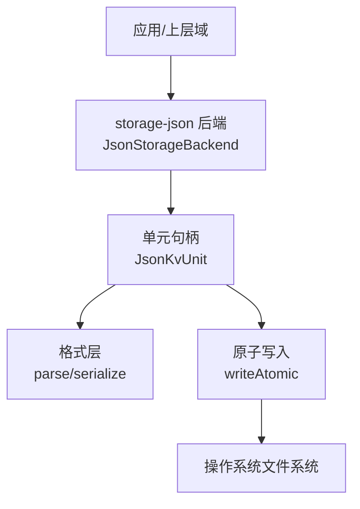
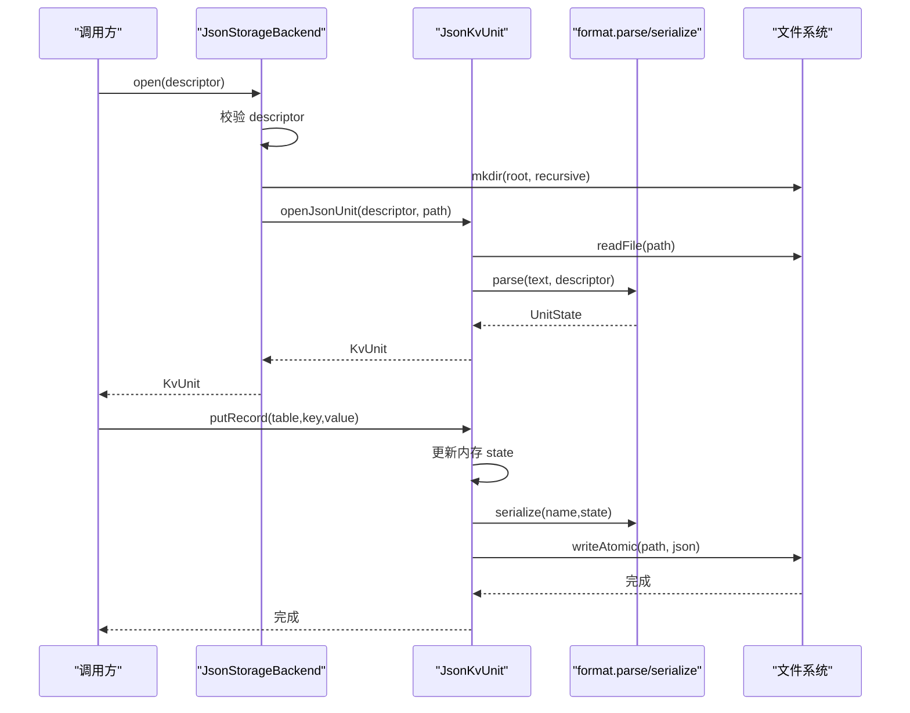
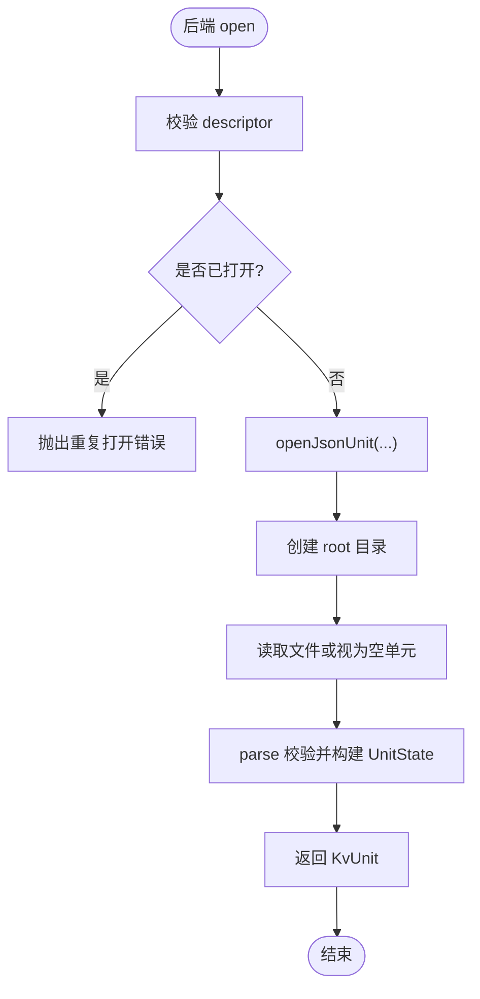
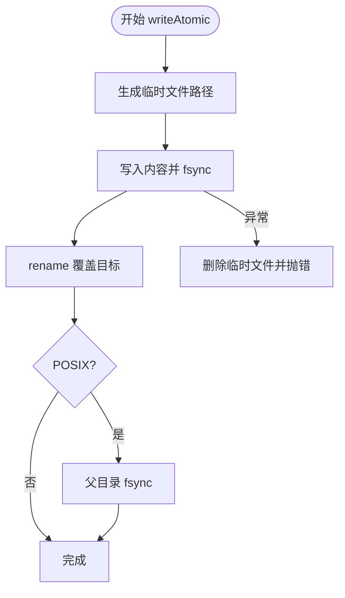
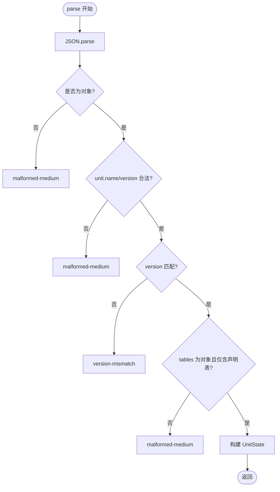
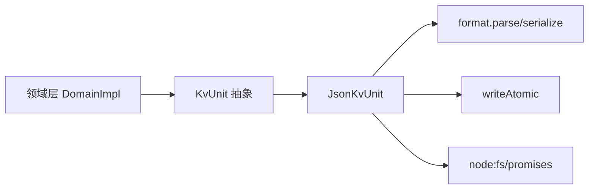

# 文件系统存储

<cite>
**本文引用的文件**
- [packages/storage/storage-json/src/index.ts](file://packages/storage/storage-json/src/index.ts)
- [packages/storage/storage-json/src/atomic.ts](file://packages/storage/storage-json/src/atomic.ts)
- [packages/storage/storage-json/src/format.ts](file://packages/storage/storage-json/src/format.ts)
- [packages/storage/storage-json/src/unit.ts](file://packages/storage/storage-json/src/unit.ts)
- [packages/storage/storage/src/backend.ts](file://packages/storage/storage/src/backend.ts)
- [packages/storage/storage-domain/src/domain.ts](file://packages/storage/storage-domain/src/domain.ts)
- [docs/subsystems/storage.md](file://docs/subsystems/storage.md)
</cite>

## 目录
1. [简介](#简介)
2. [项目结构](#项目结构)
3. [核心组件](#核心组件)
4. [架构总览](#架构总览)
5. [详细组件分析](#详细组件分析)
6. [依赖关系分析](#依赖关系分析)
7. [性能特征与优化](#性能特征与优化)
8. [故障恢复与数据完整性](#故障恢复与数据完整性)
9. [配置选项与部署建议](#配置选项与部署建议)
10. [结论](#结论)

## 简介
本文件面向“基于 JSON 的文件系统存储后端”，系统性说明其设计目标、实现原理、文件组织、原子写入与并发安全、数据格式与版本兼容、配置项、性能特征以及故障恢复策略。该后端以“每单元一个可读 JSON 文件”的方式持久化键值数据，适合单机与小规模场景使用。

## 项目结构
JSON 存储后端位于 storage-json 包中，围绕以下职责划分：
- 后端注册与生命周期管理：负责创建根目录、打开/关闭单元、暴露 kv 能力。
- 单元读写：维护内存中的权威状态，提供 loadAll、putRecord、deleteRecord、setGlobal、close。
- 文件格式：定义序列化/反序列化结构与校验规则（unit/global/tables）。
- 原子写入：通过临时文件 + fsync + rename + 目录 fsync 保证崩溃一致性。

图表来源
- [packages/storage/storage-json/src/index.ts:37-86](file://packages/storage/storage-json/src/index.ts#L37-L86)
- [packages/storage/storage-json/src/unit.ts:24-45](file://packages/storage/storage-json/src/unit.ts#L24-L45)
- [packages/storage/storage-json/src/format.ts:24-84](file://packages/storage/storage-json/src/format.ts#L24-L84)
- [packages/storage/storage-json/src/atomic.ts:24-40](file://packages/storage/storage-json/src/atomic.ts#L24-L40)

章节来源
- [packages/storage/storage-json/src/index.ts:1-115](file://packages/storage/storage-json/src/index.ts#L1-L115)
- [packages/storage/storage-json/src/unit.ts:1-142](file://packages/storage/storage-json/src/unit.ts#L1-L142)
- [packages/storage/storage-json/src/format.ts:1-85](file://packages/storage/storage-json/src/format.ts#L1-L85)
- [packages/storage/storage-json/src/atomic.ts:1-54](file://packages/storage/storage-json/src/atomic.ts#L1-L54)

## 核心组件
- JsonStorageBackend：后端入口，持有 root 路径，提供 kv.open/descriptor 校验、open/close 生命周期管理，并注册到存储中心。
- JsonKvUnit：单单元句柄，维护 UnitState（version/global/tables），对外暴露 loadAll、putRecord、deleteRecord、setGlobal、close；每次写操作后原子发布整份文件。
- 格式层 format：定义 on-disk 文档结构 { unit, global, tables }，并提供 parse/serialize；在解析时校验名称、版本与表结构。
- 原子写入 atomic：writeAtomic 将新内容写入同目录临时文件，fsync 后 rename 覆盖目标，并在 POSIX 上对父目录 fsync，确保崩溃可恢复。

章节来源
- [packages/storage/storage-json/src/index.ts:37-115](file://packages/storage/storage-json/src/index.ts#L37-L115)
- [packages/storage/storage-json/src/unit.ts:47-142](file://packages/storage/storage-json/src/unit.ts#L47-L142)
- [packages/storage/storage-json/src/format.ts:11-84](file://packages/storage/storage-json/src/format.ts#L11-L84)
- [packages/storage/storage-json/src/atomic.ts:18-54](file://packages/storage/storage-json/src/atomic.ts#L18-L54)

## 架构总览
JSON 后端遵循统一的存储契约：后端拥有单一介质（此处为文件树根），暴露可选的能力面（kv）；每个单元由 KvUnitDescriptor 描述（name/version/tables/hasGlobal），读取从内存权威状态返回，写入先落盘再改内存并触发事件。

图表来源
- [packages/storage/storage-json/src/index.ts:47-75](file://packages/storage/storage-json/src/index.ts#L47-L75)
- [packages/storage/storage-json/src/unit.ts:24-45](file://packages/storage/storage-json/src/unit.ts#L24-L45)
- [packages/storage/storage-json/src/format.ts:24-84](file://packages/storage/storage-json/src/format.ts#L24-L84)
- [packages/storage/storage-json/src/atomic.ts:24-40](file://packages/storage/storage-json/src/atomic.ts#L24-L40)

章节来源
- [docs/subsystems/storage.md:26-47](file://docs/subsystems/storage.md#L26-L47)
- [packages/storage/storage/src/backend.ts:17-105](file://packages/storage/storage/src/backend.ts#L17-L105)

## 详细组件分析

### 后端与单元生命周期
- 后端 open：校验 descriptor 的 name/tables 命名规范；若同一单元重复 open 会报错；open 过程中若后端已关闭则拒绝。
- 单元 close：等待所有 in-flight 发布完成后释放；后端 close 会等待所有 opening/opening 中的任务完成，再逐一关闭已打开单元。

图表来源
- [packages/storage/storage-json/src/index.ts:47-75](file://packages/storage/storage-json/src/index.ts#L47-L75)
- [packages/storage/storage-json/src/unit.ts:24-45](file://packages/storage/storage-json/src/unit.ts#L24-L45)

章节来源
- [packages/storage/storage-json/src/index.ts:37-86](file://packages/storage/storage-json/src/index.ts#L37-L86)
- [packages/storage/storage-json/src/unit.ts:109-117](file://packages/storage/storage-json/src/unit.ts#L109-L117)

### 原子写入与崩溃一致性
- 写入流程：生成同目录随机临时文件 -> 写入内容 -> fsync -> rename 覆盖目标 -> 在 POSIX 平台对父目录 fsync。
- 失败清理：异常时删除临时文件，避免残留脏文件。
- 语义：rename 在 POSIX/Windows 均为原子替换；最后一步目录 fsync 保证新条目在崩溃后可见。

图表来源
- [packages/storage/storage-json/src/atomic.ts:24-54](file://packages/storage/storage-json/src/atomic.ts#L24-L54)

章节来源
- [packages/storage/storage-json/src/atomic.ts:1-54](file://packages/storage/storage-json/src/atomic.ts#L1-L54)

### 数据格式与版本兼容
- 文档结构：{ unit: { name, version }, global, tables }。
- 解析校验：必须为对象；unit.name 需匹配期望；unit.version 必须等于 descriptor.version；tables 必须为对象且仅包含声明的表名。
- 兼容性：版本不匹配直接拒绝（version-mismatch）；结构非法拒绝（malformed-medium）。无迁移逻辑，属于预发布阶段的严格模式。

图表来源
- [packages/storage/storage-json/src/format.ts:43-84](file://packages/storage/storage-json/src/format.ts#L43-L84)

章节来源
- [packages/storage/storage-json/src/format.ts:11-84](file://packages/storage/storage-json/src/format.ts#L11-L84)

### 并发安全与写序保障
- 单元级并发：单元本身不串行化并发写；写序由调用方（领域层）的单写链保证。
- 进程内保护：后端对同一单元的重复 open 会拒绝；open 过程中使用 opening Map 防止竞态。
- 回滚语义：单次 put/delete/setGlobal 若发布失败，内存状态会回滚到修改前，避免内存与介质不一致。

章节来源
- [packages/storage/storage/src/backend.ts:57-65](file://packages/storage/storage/src/backend.ts#L57-L65)
- [packages/storage/storage-json/src/index.ts:47-75](file://packages/storage/storage-json/src/index.ts#L47-L75)
- [packages/storage/storage-json/src/unit.ts:69-107](file://packages/storage/storage-json/src/unit.ts#L69-L107)

### 领域层写链与事件
- 写链：每个域维护一条 Promise 链，所有写操作排队执行；先落盘成功，再改内存，最后发出 domain/changed 事件。
- 事件：put 携带新快照；deleted 为墓碑；事件顺序与写链一致。
- 读：同步从内存权威状态读取，迭代器在队列写入期间保持稳定快照。

章节来源
- [packages/storage/storage-domain/src/domain.ts:1-119](file://packages/storage/storage-domain/src/domain.ts#L1-L119)
- [packages/storage/storage-domain/src/domain.ts:246-277](file://packages/storage/storage-domain/src/domain.ts#L246-L277)
- [packages/storage/storage-domain/src/domain.ts:279-358](file://packages/storage/storage-domain/src/domain.ts#L279-L358)

## 依赖关系分析
- 后端依赖：Node.js fs/promises、path、crypto；契约来自 dsh-storage；格式化与原子写入自包含于 storage-json。
- 领域层依赖：dsh-storage 的 KvUnit 抽象；事件通过 Cordis 上下文发出。
- 耦合点：后端与领域层通过 KvUnit 解耦；格式与原子写入被单元封装，外部无需感知。

图表来源
- [packages/storage/storage-domain/src/domain.ts:140-175](file://packages/storage/storage-domain/src/domain.ts#L140-L175)
- [packages/storage/storage-json/src/unit.ts:47-57](file://packages/storage/storage-json/src/unit.ts#L47-L57)
- [packages/storage/storage-json/src/format.ts:24-84](file://packages/storage/storage-json/src/format.ts#L24-L84)
- [packages/storage/storage-json/src/atomic.ts:24-40](file://packages/storage/storage-json/src/atomic.ts#L24-L40)

章节来源
- [packages/storage/storage/src/backend.ts:17-105](file://packages/storage/storage/src/backend.ts#L17-L105)
- [packages/storage/storage-json/src/unit.ts:1-142](file://packages/storage/storage-json/src/unit.ts#L1-L142)

## 性能特征与优化
- 读写模型：每次写操作都会序列化整个单元并原子替换文件。适合中小体量单元；超大单元可能带来较大 I/O 与 CPU 开销。
- 磁盘空间：每个单元一个 JSON 文件；pretty-printed 输出便于人类阅读但体积略大。可通过控制记录数量与字段大小优化。
- I/O 优化：
  - 原子写入减少锁竞争：读者无锁，仅写者竞争；POSIX/Windows 均利用 rename 原子性。
  - 目录 fsync 确保新条目可见，提升崩溃恢复可靠性。
  - 领域层写链合并写序，避免无序并发导致的额外重试。
- 适用场景：单机、小规模数据、需要强一致性与易读性的场景。

[本节为通用性能讨论，不直接分析具体文件]

## 故障恢复与数据完整性
- 崩溃恢复：由于采用“临时文件 + fsync + rename + 目录 fsync”的协议，崩溃后要么看到旧文件完整内容，要么看到新文件完整内容，不会出现半写状态。
- 数据校验：
  - 解析阶段校验 JSON 结构、unit 头、版本与表集合，非法即拒绝。
  - 版本不匹配直接拒绝，避免混用不同版本的 schema。
- 错误分类：
  - malformed-medium：文件非 JSON、结构不符、表类型错误等。
  - version-mismatch：存储版本与期望版本不一致。
  - closed：后端或单元已关闭时的调用。
- 恢复建议：
  - 遇到 malformed-medium：检查文件是否被外部工具破坏；必要时回滚备份。
  - 遇到 version-mismatch：升级/降级应用或迁移数据后再启动。
  - 定期备份：结合外部备份策略（如定时复制根目录）增强容灾。

章节来源
- [packages/storage/storage-json/src/format.ts:43-84](file://packages/storage/storage-json/src/format.ts#L43-L84)
- [packages/storage/storage-json/src/atomic.ts:24-54](file://packages/storage/storage-json/src/atomic.ts#L24-L54)
- [packages/storage/storage/src/backend.ts:57-65](file://packages/storage/storage/src/backend.ts#L57-L65)

## 配置选项与部署建议
- 配置项（后端）：
  - root：存储根目录（必填）。后端会在首次 open 时递归创建该目录。
- 压缩设置：当前 JSON 后端未内置压缩；如需压缩，可在上层进行数据序列化前处理或引入独立压缩服务。
- 备份策略：
  - 推荐对 root 目录进行周期性快照/增量备份。
  - 建议在停机窗口进行一致性备份（停止写入或确保写链已排空）。
- 部署建议：
  - 将 root 置于可靠磁盘，避免网络挂载带来的不可预期行为。
  - 合理控制单元大小与记录数量，避免单文件过大导致 I/O 抖动。
  - 在进程退出时确保调用 backend.close() 与 domain.close()，以等待写链排空并释放资源。

章节来源
- [packages/storage/storage-json/src/index.ts:21-35](file://packages/storage/storage-json/src/index.ts#L21-L35)
- [packages/storage/storage-json/src/index.ts:63-86](file://packages/storage/storage-json/src/index.ts#L63-L86)

## 结论
JSON 文件系统存储后端以“每单元一文件”的可读形式提供强一致、原子化的键值持久化能力。通过严格的格式校验与版本控制、原子写入与目录同步机制，它在单机和小规模场景中具备高可靠性与易维护性。对于更大规模或更高吞吐需求，可考虑其他后端（如 SQLite）或在上层引入压缩与分片策略。