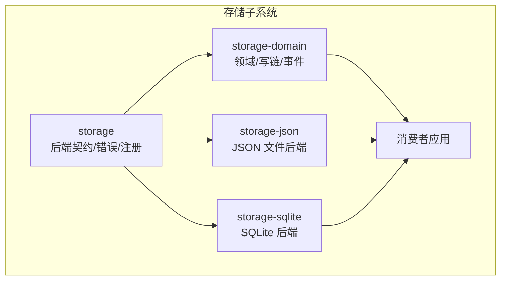
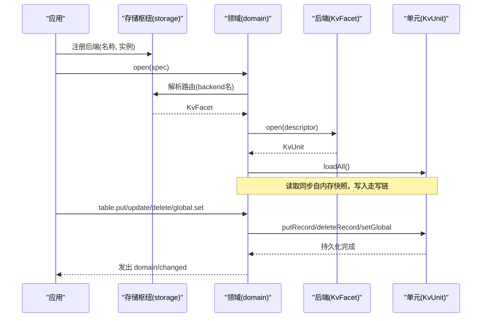
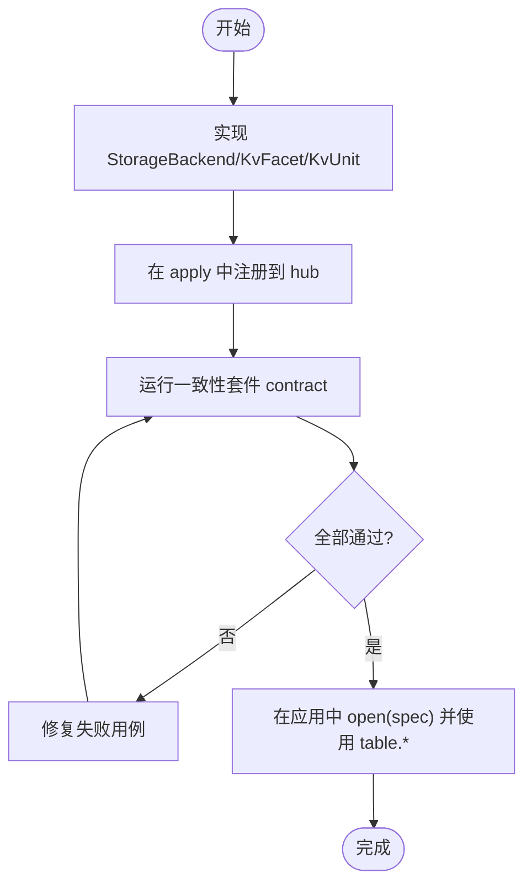
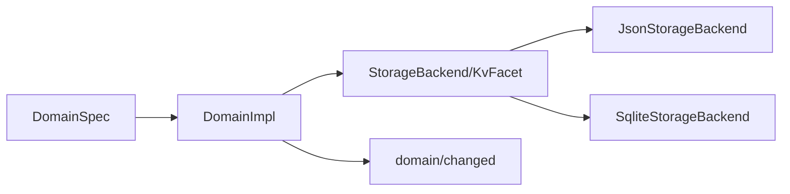

# 自定义存储后端开发

<cite>
**本文引用的文件**
- [packages/storage/storage/src/backend.ts](file://packages/storage/storage/src/backend.ts)
- [packages/storage/storage/src/error.ts](file://packages/storage/storage/src/error.ts)
- [packages/storage/storage/tests/contract.ts](file://packages/storage/storage/tests/contract.ts)
- [packages/storage/storage-json/src/index.ts](file://packages/storage/storage-json/src/index.ts)
- [packages/storage/storage-sqlite/src/index.ts](file://packages/storage/storage-sqlite/src/index.ts)
- [packages/storage/storage-domain/src/spec.ts](file://packages/storage/storage-domain/src/spec.ts)
- [packages/storage/storage-domain/src/domain.ts](file://packages/storage/storage-domain/src/domain.ts)
- [packages/storage/storage-domain/src/events.ts](file://packages/storage/storage-domain/src/events.ts)
- [docs/subsystems/storage.md](file://docs/subsystems/storage.md)
- [docs/subsystems/storage.zh.md](file://docs/subsystems/storage.zh.md)
</cite>

## 目录
1. [简介](#简介)
2. [项目结构](#项目结构)
3. [核心组件](#核心组件)
4. [架构总览](#架构总览)
5. [详细组件分析](#详细组件分析)
6. [依赖关系分析](#依赖关系分析)
7. [性能考虑](#性能考虑)
8. [故障排查指南](#故障排查指南)
9. [结论](#结论)
10. [附录](#附录)

## 简介
本指南面向希望为系统实现“自定义存储后端”的开发者。内容覆盖：
- 存储后端接口规范与必须实现的契约方法（get、set、delete、list 等语义如何映射到后端单元）
- 测试契约与兼容性验证机制
- 错误处理、异常类型与状态码规范
- 从接口实现到测试用例的完整开发示例路径
- 性能优化技巧与最佳实践
- 调试方法与问题诊断工具
- 发布与分发指导，帮助为特定需求创建定制化存储方案

## 项目结构
存储子系统由多包组成，职责清晰分离：
- storage：定义后端契约、错误类型、注册表；提供 hub 能力
- storage-domain：领域声明、打开的领域、变更事件、写链与内存快照
- storage-json：基于 JSON 文件的后端实现
- storage-sqlite：基于 SQLite 的后端实现
- 文档：子系统参考文档与中文说明

图表来源
- [packages/storage/storage/src/backend.ts:1-105](file://packages/storage/storage/src/backend.ts#L1-L105)
- [packages/storage/storage-domain/src/domain.ts:1-358](file://packages/storage/storage-domain/src/domain.ts#L1-L358)
- [packages/storage/storage-json/src/index.ts:1-115](file://packages/storage/storage-json/src/index.ts#L1-L115)
- [packages/storage/storage-sqlite/src/index.ts:1-169](file://packages/storage/storage-sqlite/src/index.ts#L1-L169)

章节来源
- [docs/subsystems/storage.md:1-230](file://docs/subsystems/storage.md#L1-L230)
- [docs/subsystems/storage.zh.md:1-230](file://docs/subsystems/storage.zh.md#L1-L230)

## 核心组件
- 后端契约 StorageBackend/KvFacet/KvUnit：定义介质生命周期、KV 操作组、单元级原子持久化
- 领域 DomainSpec/Domain：声明数据模型、版本、全局单例、表结构；提供 typed 表句柄与写链
- 变更事件 domain/changed：每次持久写入后发出，携带操作类型与值快照
- 错误体系 StorageError：统一错误码，便于消费方按 code 分支处理

章节来源
- [packages/storage/storage/src/backend.ts:1-105](file://packages/storage/storage/src/backend.ts#L1-L105)
- [packages/storage/storage/src/error.ts:1-36](file://packages/storage/storage/src/error.ts#L1-L36)
- [packages/storage/storage-domain/src/spec.ts:1-113](file://packages/storage/storage-domain/src/spec.ts#L1-L113)
- [packages/storage/storage-domain/src/domain.ts:1-358](file://packages/storage/storage-domain/src/domain.ts#L1-L358)
- [packages/storage/storage-domain/src/events.ts:1-230](file://packages/storage/storage-domain/src/events.ts#L1-L230)

## 架构总览
存储子系统采用“枢纽 + 后端 + 领域”的分层设计：
- 枢纽（storage）负责后端注册与发现，不做 IO
- 后端（json/sqlite/自定义）拥有介质并实现 KV 单元
- 领域（storage-domain）封装业务语义、校验、写链与事件

图表来源
- [packages/storage/storage/src/backend.ts:1-105](file://packages/storage/storage/src/backend.ts#L1-L105)
- [packages/storage/storage-domain/src/domain.ts:1-358](file://packages/storage/storage-domain/src/domain.ts#L1-L358)
- [packages/storage/storage-json/src/index.ts:1-115](file://packages/storage/storage-json/src/index.ts#L1-L115)
- [packages/storage/storage-sqlite/src/index.ts:1-169](file://packages/storage/storage-sqlite/src/index.ts#L1-L169)

## 详细组件分析

### 后端契约与必须实现的方法
- StorageBackend.close：释放介质，幂等；并发与重复调用在拆除完成后解决
- KvFacet.open：打开一个命名单元，返回 KvUnit；同一名称不可重复打开
- KvUnit 关键方法（对应 get/set/delete/list 语义）：
  - loadAll：读取当前快照（所有表记录与全局单例）
  - putRecord：插入或覆写一条记录（原子持久化）
  - deleteRecord：删除一条记录（幂等）
  - setGlobal：写入全局单例（仅在描述符允许时可用）
  - close：释放单元，幂等；关闭后任何操作拒绝 closed

注意：
- 键是任意字符串，不会进入文件系统路径
- 单元不对并发写入串行化，顺序由调用方保证（领域层每域一条写链）
- 版本不匹配抛出 version-mismatch；无法解析介质抛出 malformed-medium

章节来源
- [packages/storage/storage/src/backend.ts:1-105](file://packages/storage/storage/src/backend.ts#L1-L105)

### 领域声明与打开的领域
- DomainSpec：定义 name/version/global/tables；defineDomain 在模块加载时做严格校验
- Domain.table：获取已声明表的句柄；KvTable 暴露 get/entries/keys/size/put/delete/update
- Domain.global：若声明了 global，则提供 get/set；未声明时访问会报错
- 写链：所有写入排队执行，先持久化再更新内存，最后发出 domain/changed
- 关闭：close 拒绝新写入，排空队列，释放单元，然后释放名称供后续重新打开

章节来源
- [packages/storage/storage-domain/src/spec.ts:1-113](file://packages/storage/storage-domain/src/spec.ts#L1-L113)
- [packages/storage/storage-domain/src/domain.ts:1-358](file://packages/storage/storage-domain/src/domain.ts#L1-L358)

### 变更事件 domain/changed
- 每次持久写入后发出一次事件，严格遵循写链顺序
- 事件包含 domain/table/key/operation/value（put 带新快照；deleted 无值）
- 事件为通知，非事务参与者；监听器抛错会被捕获并记录警告

章节来源
- [packages/storage/storage-domain/src/events.ts:1-230](file://packages/storage/storage-domain/src/events.ts#L1-L230)
- [packages/storage/storage-domain/src/domain.ts:246-261](file://packages/storage/storage-domain/src/domain.ts#L246-L261)

### 错误处理与状态码
- StorageError：统一错误类，code 稳定可分派
- 常用 code：
  - backend-not-found：后端未注册
  - form-not-mounted：数据形式未挂载
  - duplicate-backend/duplicate-mount：重复注册/挂载
  - version-mismatch：介质版本与描述符不一致
  - malformed-medium：介质格式非法
  - closed：后端/单元/领域已关闭
- 消费方应依据 code 进行分支处理，message 用于诊断

章节来源
- [packages/storage/storage/src/error.ts:1-36](file://packages/storage/storage/src/error.ts#L1-L36)

### 一致性测试契约与兼容性验证
- runKvBackendContract：共享一致性套件，针对每个后端运行
- 覆盖场景：
  - 打开缺失单元为空并立即返回快照
  - 跨进程重启后的持久往返
  - 覆写与删除幂等
  - 版本不匹配拒绝且不影响原版本数据
  - 关闭后操作拒绝 closed，close 幂等

使用方式：在后端测试中调用该套件，传入后端工厂与 reopen 能力。

章节来源
- [packages/storage/storage/tests/contract.ts:1-103](file://packages/storage/storage/tests/contract.ts#L1-L103)

### 现有后端实现要点
- JSON 后端：
  - 每个单元一个人类可读 JSON 文件，原子整文件重写
  - 延迟物化：首次写入才创建文件
  - 通过 apply 注册到 hub，并在 effect 中管理生命周期
- SQLite 后端：
  - 单数据库文件承载多个单元，记录按行存储
  - 支持 journal_mode 配置（wal 默认）
  - 通过 apply 注册到 hub，并在 effect 中管理生命周期

章节来源
- [packages/storage/storage-json/src/index.ts:1-115](file://packages/storage/storage-json/src/index.ts#L1-L115)
- [packages/storage/storage-sqlite/src/index.ts:1-169](file://packages/storage/storage-sqlite/src/index.ts#L1-L169)

### 开发示例：从零实现自定义后端
步骤概览（以代码路径指引代替具体代码）：
1. 实现 StorageBackend 与 KvFacet.open
   - 参考：[packages/storage/storage/src/backend.ts:17-43](file://packages/storage/storage/src/backend.ts#L17-L43)
2. 实现 KvUnit 的 loadAll/putRecord/deleteRecord/setGlobal/close
   - 参考：[packages/storage/storage/src/backend.ts:57-104](file://packages/storage/storage/src/backend.ts#L57-L104)
3. 在插件 apply 中注册后端到 hub，并管理生命周期
   - 参考：[packages/storage/storage-json/src/index.ts:99-115](file://packages/storage/storage-json/src/index.ts#L99-L115)
   - 参考：[packages/storage/storage-sqlite/src/index.ts:152-169](file://packages/storage/storage-sqlite/src/index.ts#L152-L169)
4. 编写单元测试并接入一致性套件
   - 参考：[packages/storage/storage/tests/contract.ts:32-101](file://packages/storage/storage/tests/contract.ts#L32-L101)
5. 使用领域层打开领域并进行读写
   - 参考：[packages/storage/storage-domain/src/domain.ts:135-277](file://packages/storage/storage-domain/src/domain.ts#L135-L277)

图表来源
- [packages/storage/storage/src/backend.ts:1-105](file://packages/storage/storage/src/backend.ts#L1-L105)
- [packages/storage/storage-json/src/index.ts:99-115](file://packages/storage/storage-json/src/index.ts#L99-L115)
- [packages/storage/storage/tests/contract.ts:32-101](file://packages/storage/storage/tests/contract.ts#L32-L101)

## 依赖关系分析
- 领域层依赖后端契约，但不直接依赖具体后端实现
- 后端通过 hub 注册，领域通过路由选择后端
- 事件由领域层发出，与后端解耦

图表来源
- [packages/storage/storage-domain/src/spec.ts:1-113](file://packages/storage/storage-domain/src/spec.ts#L1-L113)
- [packages/storage/storage-domain/src/domain.ts:135-277](file://packages/storage/storage-domain/src/domain.ts#L135-L277)
- [packages/storage/storage-json/src/index.ts:37-86](file://packages/storage/storage-json/src/index.ts#L37-L86)
- [packages/storage/storage-sqlite/src/index.ts:55-150](file://packages/storage/storage-sqlite/src/index.ts#L55-L150)

章节来源
- [packages/storage/storage/src/backend.ts:1-105](file://packages/storage/storage/src/backend.ts#L1-L105)
- [packages/storage/storage-domain/src/domain.ts:1-358](file://packages/storage/storage-domain/src/domain.ts#L1-L358)

## 性能考虑
- 写链串行化：领域层对每个域维护单条写链，避免并发竞争，简化一致性与排序
- 原子持久化：后端需保证单次调用原子性，崩溃恢复后可观测到已 resolve 的写入
- 批量与合并：可在后端内部对高频小写进行批处理（如 WAL 模式、缓冲），但不得破坏单调用原子性
- 只读路径优化：loadAll 可缓存快照，减少 I/O；写路径优先落盘再更新内存
- 资源管理：close 应等待所有待处理写入完成，并幂等处理重复关闭
- 文件名/标识符安全：unit 名与表名需符合 UNIT_NAME_RE，避免注入与非法字符

章节来源
- [packages/storage/storage/src/backend.ts:1-105](file://packages/storage/storage/src/backend.ts#L1-L105)
- [packages/storage/storage-sqlite/src/index.ts:23-48](file://packages/storage/storage-sqlite/src/index.ts#L23-L48)

## 故障排查指南
- 常见错误码定位：
  - backend-not-found：检查是否已在 hub 注册后端
  - facet-unsupported：检查后端是否提供 kv 能力
  - version-mismatch：检查介质版本是否与描述符一致
  - malformed-medium：检查介质格式是否符合约定
  - closed：检查是否在 close 之后继续操作
- 日志与事件：
  - 订阅 domain/changed 观察写入落地顺序
  - 监听器抛错会被捕获并记录警告，不影响已持久写入
- 调试建议：
  - 使用 JSON 后端快速定位数据形态
  - 使用 SQLite 后端查看底层结构与索引
  - 通过一致性套件复现问题边界条件

章节来源
- [packages/storage/storage/src/error.ts:1-36](file://packages/storage/storage/src/error.ts#L1-L36)
- [packages/storage/storage-domain/src/domain.ts:246-261](file://packages/storage/storage-domain/src/domain.ts#L246-L261)
- [packages/storage/storage/tests/contract.ts:32-101](file://packages/storage/storage/tests/contract.ts#L32-L101)

## 结论
通过统一的存储后端契约、领域抽象与一致性测试套件，开发者可以高效地实现可插拔、可验证的自定义存储后端。遵循写链与原子持久化原则，结合错误码与事件机制，能够构建高可靠、易调试的存储解决方案。

## 附录

### API 速查（概念映射）
- get → KvUnit.loadAll 或 KvTable.get
- set → KvUnit.putRecord / Domain.table.put
- delete → KvUnit.deleteRecord / Domain.table.delete
- list → KvTable.entries / keys / size
- global → Domain.global.get/set

章节来源
- [packages/storage/storage/src/backend.ts:57-104](file://packages/storage/storage/src/backend.ts#L57-L104)
- [packages/storage/storage-domain/src/domain.ts:18-90](file://packages/storage/storage-domain/src/domain.ts#L18-L90)

### 发布与分发指导
- 将后端作为独立插件包发布，提供 apply 函数与配置 schema
- 在插件中注册到 hub，并通过 effect 管理生命周期
- 提供 README 说明配置项、限制与性能特性
- 附带一致性套件测试，确保与其他后端行为一致

章节来源
- [packages/storage/storage-json/src/index.ts:99-115](file://packages/storage/storage-json/src/index.ts#L99-L115)
- [packages/storage/storage-sqlite/src/index.ts:152-169](file://packages/storage/storage-sqlite/src/index.ts#L152-L169)