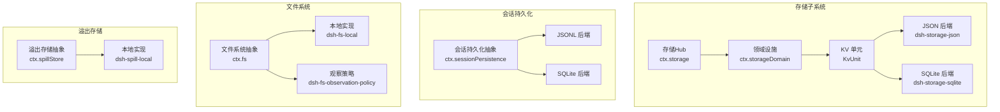
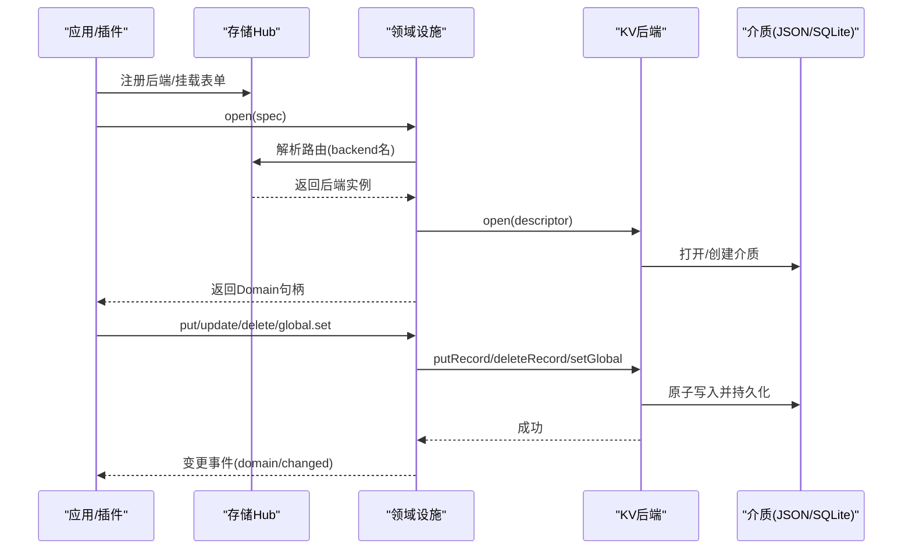
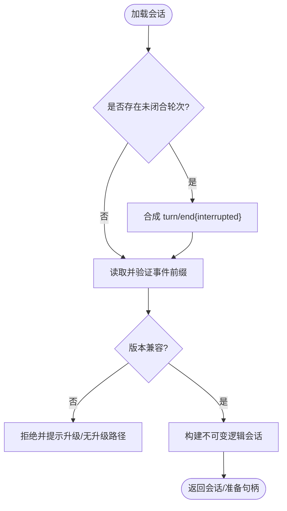
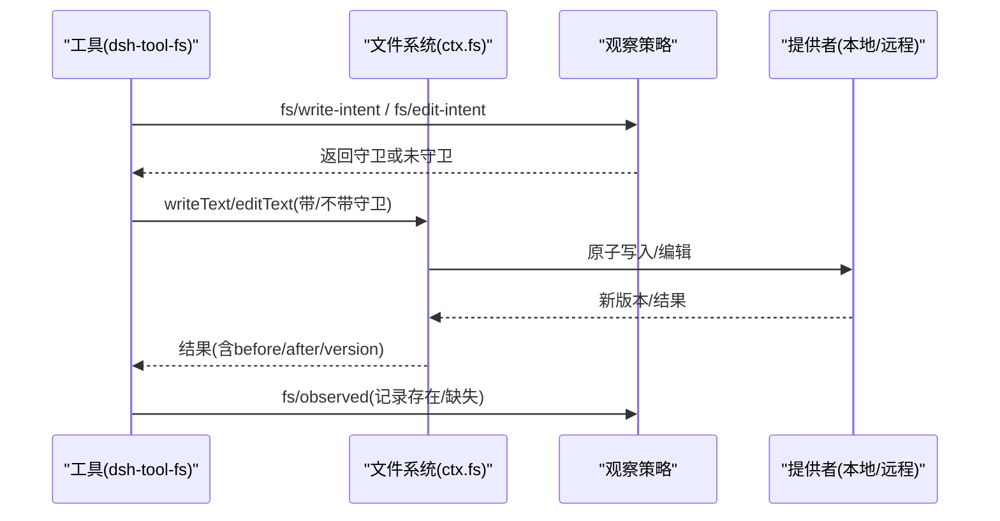
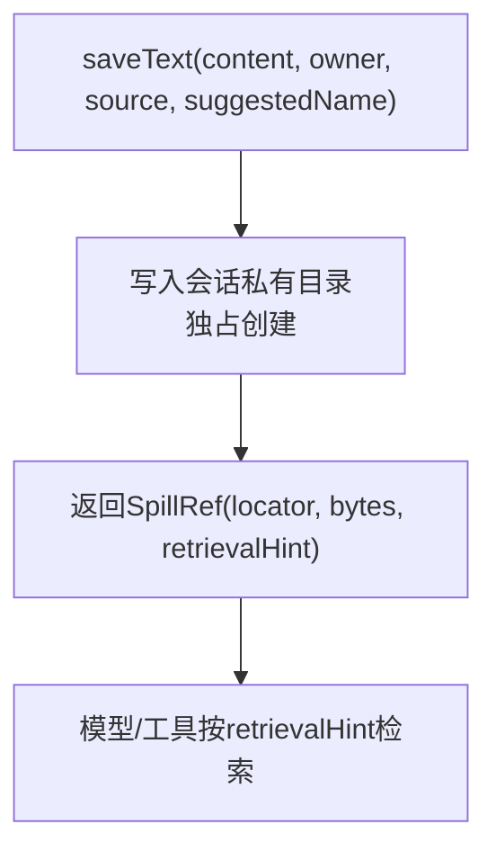
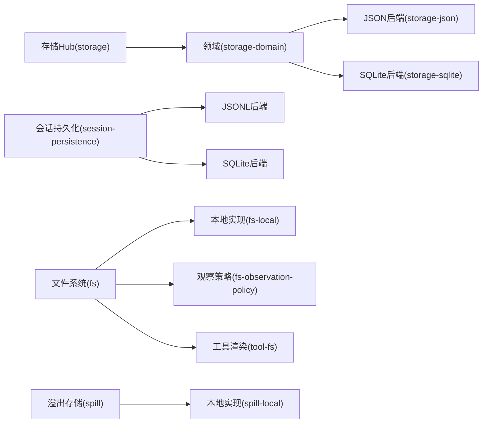

# 数据存储

<cite>
**本文引用的文件**
- [存储子系统文档](file://docs/subsystems/storage.md)
- [会话持久化文档](file://docs/subsystems/persistence.md)
- [溢出存储文档](file://docs/subsystems/spill.md)
- [文件系统文档](file://docs/subsystems/filesystem.md)
- [存储后端契约](file://packages/storage/storage/src/backend.ts)
- [JSON 存储后端说明](file://packages/storage/storage-json/README.md)
- [SQLite 存储后端说明](file://packages/storage/storage-sqlite/README.md)
- [JSON 存储后端实现入口](file://packages/storage/storage-json/src/index.ts)
- [SQLite 存储后端实现入口](file://packages/storage/storage-sqlite/src/index.ts)
- [领域规范定义](file://packages/storage/storage-domain/src/spec.ts)
</cite>

## 目录
1. [简介](#简介)
2. [项目结构](#项目结构)
3. [核心组件](#核心组件)
4. [架构总览](#架构总览)
5. [详细组件分析](#详细组件分析)
6. [依赖关系分析](#依赖关系分析)
7. [性能考量](#性能考量)
8. [故障排查指南](#故障排查指南)
9. [结论](#结论)
10. [附录](#附录)

## 简介
本文件面向 DeepSeek Harness 的数据存储系统，聚焦以下目标：
- 会话持久化机制：事件日志格式、存储后端选择、崩溃恢复与数据迁移策略。
- 文件系统集成：文件访问控制、观察机制与安全策略。
- 溢出存储与临时数据：大文本落盘、定位器与检索提示。
- 备份、恢复与清理：会话快照、原始工件读取、过期清理边界。
- 不同存储后端的配置示例与性能对比：JSON 与 SQLite 的适用场景与权衡。
- 数据完整性保证与错误恢复：版本拒绝、损坏检测、原子写入与一致性语义。

## 项目结构
DeepSeek Harness 将“非会话事件日志”的通用键值域数据与“会话事件日志”的持久化能力解耦为两个能力缝（capability seam）：
- 存储子系统（storage）：提供可插拔的 KV 域存储，包含 Hub、Domain 层与多个后端（json/sqlite）。
- 会话持久化（session-persistence）：对会话事件日志进行追加式持久化，支持 JSONL 与 SQLite 两种后端。
- 文件系统（fs）：可选的文件能力，提供读写编辑、观察策略与工具渲染。
- 溢出存储（spill）：将超大文本结果持久化为会话级工件，返回模型侧可消费的定位器与检索提示。



图表来源
- [存储子系统文档:1-230](file://docs/subsystems/storage.md#L1-L230)
- [会话持久化文档:1-386](file://docs/subsystems/persistence.md#L1-L386)
- [文件系统文档:1-496](file://docs/subsystems/filesystem.md#L1-L496)
- [溢出存储文档:1-118](file://docs/subsystems/spill.md#L1-L118)

章节来源
- [存储子系统文档:1-230](file://docs/subsystems/storage.md#L1-L230)
- [会话持久化文档:1-386](file://docs/subsystems/persistence.md#L1-L386)
- [文件系统文档:1-496](file://docs/subsystems/filesystem.md#L1-L496)
- [溢出存储文档:1-118](file://docs/subsystems/spill.md#L1-L118)

## 核心组件
- 存储 Hub（ctx.storage）：注册后端、挂载数据表单、路由到具体后端；不直接执行 IO。
- 领域设施（ctx.storageDomain）：打开声明的 Domain，按配置路由到后端，校验记录并维护内存快照与变更事件。
- KV 后端契约（StorageBackend/KvFacet/KvUnit）：统一抽象，要求每个调用在介质上原子且已持久化；关闭时排空待写并释放介质。
- 会话持久化（ctx.sessionPersistence）：会话事件日志的定位、创建、追加、准备、加载、检查、后缀读取、轻量列表与快照。
- 文件系统（ctx.fs）：解析目标、元信息、读/流/字节、列出目录、原子写/编辑，配合观察策略实现安全更新。
- 溢出存储（ctx.spillStore）：保存完整文本，返回定位器、字节数与检索提示；本地实现使用私有根目录与独占写入。

章节来源
- [存储后端契约:1-105](file://packages/storage/storage/src/backend.ts#L1-L105)
- [领域规范定义:1-113](file://packages/storage/storage-domain/src/spec.ts#L1-L113)
- [存储子系统文档:1-230](file://docs/subsystems/storage.md#L1-L230)
- [会话持久化文档:1-386](file://docs/subsystems/persistence.md#L1-L386)
- [文件系统文档:1-496](file://docs/subsystems/filesystem.md#L1-L496)
- [溢出存储文档:1-118](file://docs/subsystems/spill.md#L1-L118)

## 架构总览
存储子系统采用“Hub + Domain + Backend”的分层设计：
- Hub 负责后端注册与名称路由，Domain 负责领域语义、类型与校验，Backend 负责介质与持久化。
- 会话持久化独立于 Domain，专注事件日志的追加、恢复与轻量观测。
- 文件系统通过事件水闸（waterfall）与观察策略组合出安全策略，而不侵入提供者契约。
- 溢出存储以会话为命名空间，将大文本落盘并返回不可解析的定位器。



图表来源
- [存储子系统文档:1-230](file://docs/subsystems/storage.md#L1-L230)
- [存储后端契约:1-105](file://packages/storage/storage/src/backend.ts#L1-L105)
- [JSON 存储后端实现入口:63-114](file://packages/storage/storage-json/src/index.ts#L63-L114)
- [SQLite 存储后端实现入口:18-168](file://packages/storage/storage-sqlite/src/index.ts#L18-L168)

## 详细组件分析

### 存储子系统：Hub、Domain 与后端
- Hub（ctx.storage）：
  - register(name, backend) 注册后端，重复名称或未知查找抛出 StorageError。
  - mount/form 管理数据表单的挂载与解析，form-not-mounted 在未加载时抛出。
- Domain（ctx.storageDomain）：
  - open(spec) 严格顺序：拒绝重复打开、解析后端、要求 kv facet、打开单元、校验所有记录与全局。
  - 写操作串行化到单条链，先持久化再改内存并发出 domain/changed；失败不改变内存，避免不一致。
- 后端契约：
  - KvUnit 的 loadAll/putRecord/deleteRecord/setGlobal/close 均满足“单次调用原子且已持久化”。
  - 版本不匹配或无法解析的介质分别抛出 version-mismatch/malformed-medium。

```mermaid
classDiagram
class StorageBackend {
+kv? : KvFacet
+close() Promise<void>
}
class KvFacet {
+open(descriptor) Promise~KvUnit~
}
class KvUnit {
+loadAll() Promise~{tables, global}~
+putRecord(table,key,value) Promise<void>
+deleteRecord(table,key) Promise<void>
+setGlobal(value) Promise<void>
+close() Promise<void>
}
class JsonStorageBackend
class SqliteStorageBackend
StorageBackend <|.. JsonStorageBackend
StorageBackend <|.. SqliteStorageBackend
KvFacet ..> KvUnit : "open()"
```

图表来源
- [存储后端契约:1-105](file://packages/storage/storage/src/backend.ts#L1-L105)
- [JSON 存储后端实现入口:63-114](file://packages/storage/storage-json/src/index.ts#L63-L114)
- [SQLite 存储后端实现入口:18-168](file://packages/storage/storage-sqlite/src/index.ts#L18-L168)

章节来源
- [存储子系统文档:1-230](file://docs/subsystems/storage.md#L1-L230)
- [存储后端契约:1-105](file://packages/storage/storage/src/backend.ts#L1-L105)
- [领域规范定义:1-113](file://packages/storage/storage-domain/src/spec.ts#L1-L113)

### 会话持久化：事件日志、恢复与迁移
- 追加式日志：append 仅接受连续 seq 的事件批次，首个事件的 seq 必须等于存储的 next-seq。
- 崩溃恢复：冷启动发现未闭合 turn/start 会合成 turn/end{kind:'interrupted'}，不截断已提交事件。
- 版本拒绝：当 SessionHeader.version 与当前构建版本不一致时，拒绝加载并给出升级方向或无升级路径提示。
- 轻量快照：listSnapshots 返回 header 与 revision，用于快速比较是否变化。
- 原始工件读取：readRaw 返回后端物理编码的原文（如解压后的 JSONL），便于备份/导出。



图表来源
- [会话持久化文档:1-386](file://docs/subsystems/persistence.md#L1-L386)

章节来源
- [会话持久化文档:1-386](file://docs/subsystems/persistence.md#L1-L386)

### 文件系统：访问控制、观察机制与安全策略
- 目标身份与元信息：resolve/stat/lstat/listDir 提供稳定标识与元信息，不包含内容。
- 写/编辑守卫：writeText/editText 支持可选预期版本守卫 createIfAbsent/replaceIfVersion，防止竞态与陈旧覆盖。
- 观察策略：fs/* 事件水闸决定写/编辑意图，fs/observed 记录存在/不存在及版本，策略插件不直接做 IO。
- 错误分类：FS_* 错误码供上层分支处理权限、沙箱拒绝、版本陈旧等情形。



图表来源
- [文件系统文档:1-496](file://docs/subsystems/filesystem.md#L1-L496)

章节来源
- [文件系统文档:1-496](file://docs/subsystems/filesystem.md#L1-L496)

### 溢出存储：大文本落盘与检索
- saveText：保存完整文本，返回 SpillRef（locator、bytes、retrievalHint）。
- 本地实现：私有根目录（0700）、会话子目录、独占写入（0600），locator 为本地路径，retrievalHint 指导模型用 read/grep。
- 清理边界：保留策略由其他模块负责，溢出存储不定义每会话清理策略。



图表来源
- [溢出存储文档:1-118](file://docs/subsystems/spill.md#L1-L118)

章节来源
- [溢出存储文档:1-118](file://docs/subsystems/spill.md#L1-L118)

### 数据迁移策略
- 存储域：DomainSpec.version 与介质版本不一致时拒绝打开（version-mismatch），当前阶段不提供迁移。
- 会话日志：SessionHeader.version 与构建版本不一致时拒绝加载，给出升级方向或无升级路径提示。
- SQLite 存储：PRAGMA user_version 与当前 schema 版本不一致时拒绝打开。
- 建议：在发布前锁定版本，跨版本升级需通过产品流程替换介质或重建。

章节来源
- [存储子系统文档:1-230](file://docs/subsystems/storage.md#L1-L230)
- [会话持久化文档:1-386](file://docs/subsystems/persistence.md#L1-L386)
- [SQLite 存储后端说明:1-44](file://packages/storage/storage-sqlite/README.md#L1-L44)

### 备份、恢复与清理
- 备份：
  - 会话：readRaw 获取后端物理编码的原始工件（如 JSONL），适合归档与导出。
  - 存储域：JSON 后端每个 unit 对应一个可读 JSON 文件，可直接复制；SQLite 后端可拷贝数据库文件。
- 恢复：
  - 会话：prepare/load 支持从持久化源恢复，冷加载完成中断轮次的平衡。
  - 存储域：重新 open(spec) 即可加载最新状态；若版本不匹配则拒绝。
- 清理：
  - 溢出存储：由保留策略模块负责过期清理，溢出存储本身不定义清理策略。
  - 会话：后端 list/listSnapshots 可用于列举与基于 revision 的增量处理。

章节来源
- [会话持久化文档:1-386](file://docs/subsystems/persistence.md#L1-L386)
- [溢出存储文档:1-118](file://docs/subsystems/spill.md#L1-L118)
- [JSON 存储后端说明:1-39](file://packages/storage/storage-json/README.md#L1-L39)
- [SQLite 存储后端说明:1-44](file://packages/storage/storage-sqlite/README.md#L1-L44)

## 依赖关系分析
- 存储子系统依赖：
  - storage（Hub/契约）→ storage-domain（领域/事件）→ storage-json/sqlite（后端实现）。
- 会话持久化依赖：
  - session-persistence（抽象）→ session-persistence-jsonl/sqlite（后端实现）。
- 文件系统依赖：
  - fs（抽象）→ fs-local（本地实现）+ fs-observation-policy（策略）+ tool-fs（工具渲染）。
- 溢出存储依赖：
  - spill（抽象）→ spill-local（本地实现）+ spill-policy（策略消费）。



图表来源
- [存储子系统文档:1-230](file://docs/subsystems/storage.md#L1-L230)
- [会话持久化文档:1-386](file://docs/subsystems/persistence.md#L1-L386)
- [文件系统文档:1-496](file://docs/subsystems/filesystem.md#L1-L496)
- [溢出存储文档:1-118](file://docs/subsystems/spill.md#L1-L118)

章节来源
- [存储子系统文档:1-230](file://docs/subsystems/storage.md#L1-L230)
- [会话持久化文档:1-386](file://docs/subsystems/persistence.md#L1-L386)
- [文件系统文档:1-496](file://docs/subsystems/filesystem.md#L1-L496)
- [溢出存储文档:1-118](file://docs/subsystems/spill.md#L1-L118)

## 性能考量
- 存储域（KV）：
  - JSON 后端：每次写重发整个文件（temp-write + fsync + rename），适合人类可读与小规模数据。
  - SQLite 后端：单行一记录，适合高频更新；注意 DatabaseSync 同步阻塞事件循环，但粒度小。
- 会话持久化：
  - JSONL：追加式写入，压缩帧默认；适合大日志与离线回放。
  - SQLite：按 seq 后缀读取更高效，适合需要增量消费的场景。
- 文件系统：
  - 无超时：IO 操作不设置 timeoutMs，取消信号仅在 syscall 边界尽力中止。
  - 流式读取：streamText 支持大文件分块消费，避免一次性缓冲。
- 溢出存储：
  - 本地独占写入避免竞争；retrievalHint 让模型端按需检索，减少不必要读取。

[本节为一般性指导，不直接分析具体文件]

## 故障排查指南
- 版本不匹配：
  - 存储域：version-mismatch 表示介质版本与 spec 不一致，需升级或重建。
  - 会话日志：SessionHeader.version 不兼容时拒绝加载，查看升级方向或回退构建。
  - SQLite 存储：user_version 不匹配时拒绝打开。
- 介质损坏：
  - 存储域：malformed-medium 表示介质无法解析为该 unit 格式。
  - 会话日志：committed prefix 损坏会拒绝加载；torn tail 会被丢弃或合成关闭。
- 权限与 I/O：
  - 文件系统：FS_PERMISSION_DENIED、FS_IO_ERROR 指示权限或底层 I/O 失败。
  - 溢出存储：saveText 在真实存储失败时拒绝（权限、ENOSPC、后端不可用）。
- 竞态与陈旧：
  - 文件系统：FS_STALE_VERSION 表示版本不匹配；FS_NOT_OBSERVED/FS_NOT_FOUND 表示未见或未观察到。
  - 存储域：写链串行化，单个调用原子；并发排序由调用方负责。

章节来源
- [存储子系统文档:1-230](file://docs/subsystems/storage.md#L1-L230)
- [会话持久化文档:1-386](file://docs/subsystems/persistence.md#L1-L386)
- [文件系统文档:1-496](file://docs/subsystems/filesystem.md#L1-L496)
- [溢出存储文档:1-118](file://docs/subsystems/spill.md#L1-L118)

## 结论
DeepSeek Harness 的数据存储体系通过清晰的能力缝与分层设计，实现了：
- 可扩展的 KV 域存储（JSON/SQLite），兼顾可读性与高吞吐。
- 可靠的会话事件日志持久化（JSONL/SQLite），具备崩溃恢复与版本拒绝。
- 安全的文件系统访问（读写编辑守卫 + 观察策略），避免竞态与越权。
- 灵活的溢出存储（会话级工件），支持大文本落盘与模型侧检索。
- 明确的迁移与恢复策略（版本拒绝、原始工件读取、轻量快照）。

开发者可根据数据规模与访问模式选择合适的后端，并通过版本管理与备份策略保障数据完整性与可恢复性。

[本节为总结，不直接分析具体文件]

## 附录

### 存储后端配置示例
- JSON 后端（dsh-storage-json）
  - root：必需字符串，单位文件根目录，按需创建（0o700）。
  - 特点：每个 unit 一个可读 JSON 文件，原子替换；适合小规模与调试。
- SQLite 后端（dsh-storage-sqlite）
  - path：数据库文件路径或 ':memory:'。
  - journalMode：wal（默认）或 rollback-journal 模式（网络挂载场景）。
  - 特点：单库多表，高频更新友好；同步调用阻塞事件循环但粒度小。

章节来源
- [JSON 存储后端说明:1-39](file://packages/storage/storage-json/README.md#L1-L39)
- [SQLite 存储后端说明:1-44](file://packages/storage/storage-sqlite/README.md#L1-L44)

### 性能对比要点
- JSON 后端：
  - 优点：人类可读、调试友好、整文件原子替换。
  - 缺点：全量重写、无跨进程锁、不适合极高写入频率。
- SQLite 后端：
  - 优点：单行更新、适合高频写入、可按 seq 后缀读取。
  - 缺点：DatabaseSync 同步阻塞、无忙等待/重试、多进程保护有限。

章节来源
- [JSON 存储后端说明:1-39](file://packages/storage/storage-json/README.md#L1-L39)
- [SQLite 存储后端说明:1-44](file://packages/storage/storage-sqlite/README.md#L1-L44)