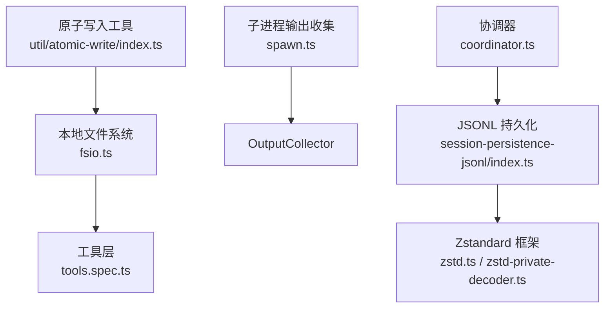
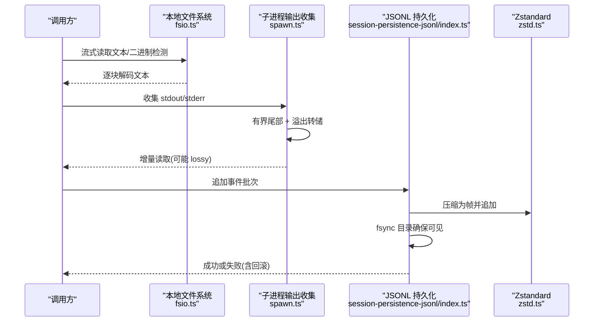
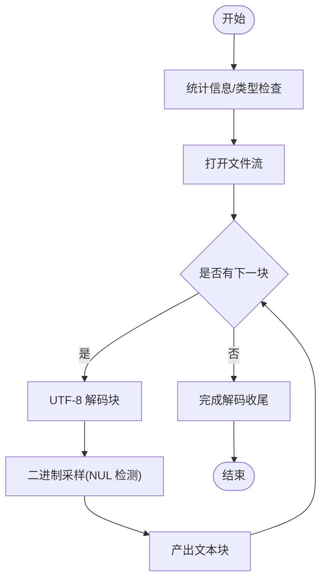
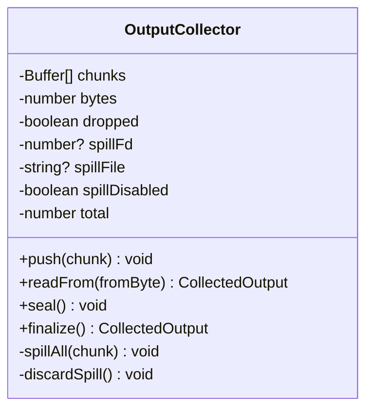
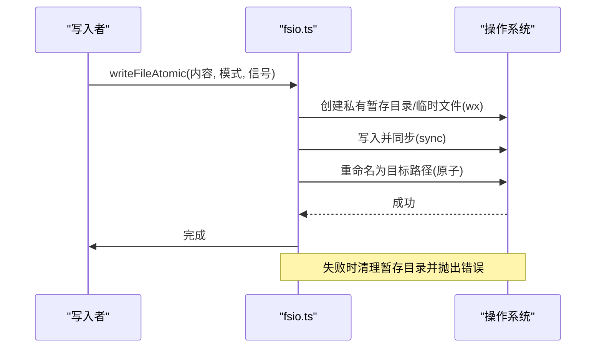
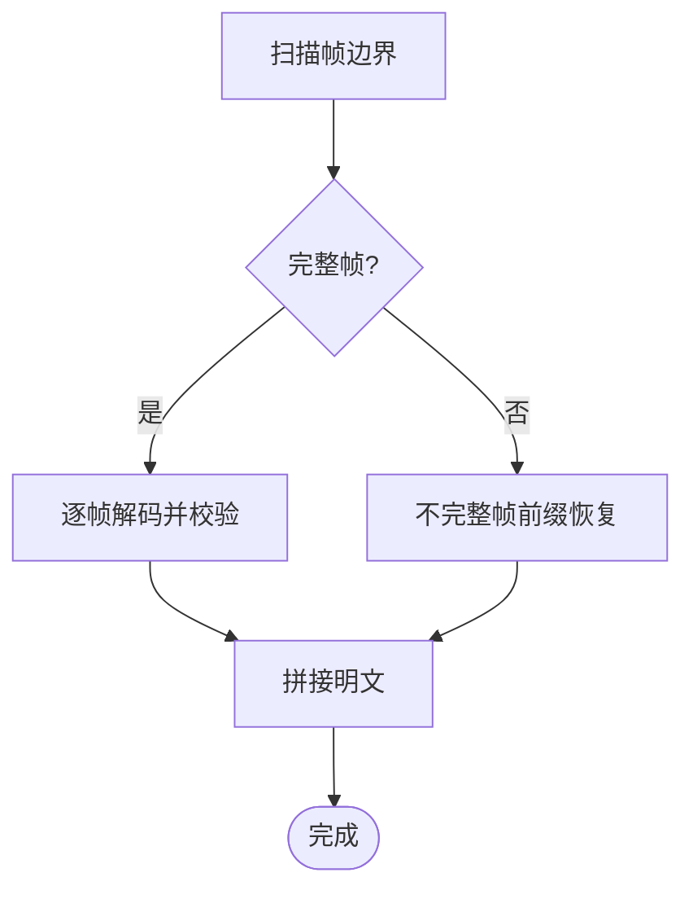
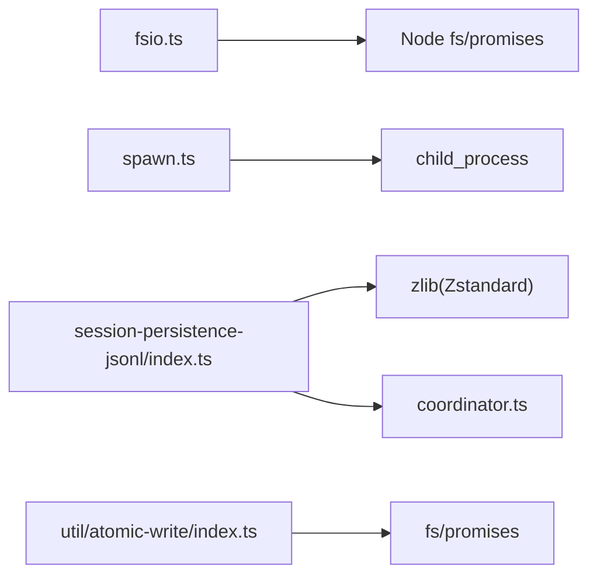

# 大文件处理

<cite>
**本文引用的文件**
- [fsio.ts](file://packages/fs/fs-local/src/fsio.ts)
- [spawn.ts](file://packages/subprocess/subprocess-local/src/spawn.ts)
- [zstd.ts](file://packages/session/session-persistence-jsonl/src/zstd.ts)
- [zstd-private-decoder.ts](file://packages/session/session-persistence-jsonl/src/zstd-private-decoder.ts)
- [index.ts（原子写入）](file://packages/util/atomic-write/src/index.ts)
- [session-persistence-jsonl/index.ts](file://packages/session/session-persistence-jsonl/src/index.ts)
- [jsonl.spec.ts](file://packages/session/session-persistence-jsonl/tests/jsonl.spec.ts)
- [filesystem.spec.ts](file://packages/fs/fs-local/tests/filesystem.spec.ts)
- [tools.spec.ts](file://packages/fs/tool-fs/tests/tools.spec.ts)
- [filesystem.spec.ts（e2b）](file://packages/e2b/fs-e2b/tests/filesystem.spec.ts)
- [coordinator.ts](file://packages/session/session-persistence/src/coordinator.ts)
</cite>

## 目录
1. [简介](#简介)
2. [项目结构](#项目结构)
3. [核心组件](#核心组件)
4. [架构总览](#架构总览)
5. [详细组件分析](#详细组件分析)
6. [依赖关系分析](#依赖关系分析)
7. [性能考量](#性能考量)
8. [故障排查指南](#故障排查指南)
9. [结论](#结论)
10. [附录](#附录)

## 简介
本文件面向 DeepSeek Harness 的大文件处理机制，围绕以下目标展开：流式读取策略（分块读取、内存管理与背压）、大文件写入优化（缓冲策略、异步写入与错误恢复）、文件压缩与解压缩（格式、级别与性能）、文件分割与合并（超大文件与分布式场景），以及配置选项与性能调优建议、常见问题与最佳实践。内容基于仓库中的本地文件系统实现、子进程输出收集、JSONL 持久化的 Zstandard 压缩与崩溃恢复、以及原子写入工具等源码进行系统化梳理。

## 项目结构
与大文件处理直接相关的代码主要分布在如下模块：
- 本地文件系统 I/O：提供文本/二进制检测、流式读取、原子写入、编辑差异基线读取等能力。
- 子进程输出收集：对 stdout/stderr 做有界内存尾部保留与溢出转储到临时文件，支持增量读取与最终化。
- JSONL 持久化：使用 Zstandard 帧容器进行事件批写入、追加与 fsync，并支持不完整帧的恢复。
- 原子写入工具：跨进程写锁与原子替换，保证读者无锁且一致性。
- 协调器：负责崩溃恢复与提交，将“损坏尾部”标记透明地传递给后端。

**图表来源**
- [fsio.ts:323-463](file://packages/fs/fs-local/src/fsio.ts#L323-L463)
- [spawn.ts:104-251](file://packages/subprocess/subprocess-local/src/spawn.ts#L104-L251)
- [zstd.ts:1-157](file://packages/session/session-persistence-jsonl/src/zstd.ts#L1-L157)
- [index.ts（原子写入）:1-119](file://packages/util/atomic-write/src/index.ts#L1-L119)
- [session-persistence-jsonl/index.ts:634-660](file://packages/session/session-persistence-jsonl/src/index.ts#L634-L660)
- [coordinator.ts:749-775](file://packages/session/session-persistence/src/coordinator.ts#L749-L775)

**章节来源**
- [fsio.ts:323-463](file://packages/fs/fs-local/src/fsio.ts#L323-L463)
- [spawn.ts:104-251](file://packages/subprocess/subprocess-local/src/spawn.ts#L104-L251)
- [zstd.ts:1-157](file://packages/session/session-persistence-jsonl/src/zstd.ts#L1-L157)
- [index.ts（原子写入）:1-119](file://packages/util/atomic-write/src/index.ts#L1-L119)
- [session-persistence-jsonl/index.ts:634-660](file://packages/session/session-persistence-jsonl/src/index.ts#L634-L660)
- [coordinator.ts:749-775](file://packages/session/session-persistence/src/coordinator.ts#L749-L775)

## 核心组件
- 本地文件系统 I/O（fsio.ts）
  - 文本/二进制判定：采样前若干字节检查 NUL 字节；流式解码 UTF-8，遇到非法序列抛出结构化错误。
  - 流式读取：按块读取并解码，不持有整文件，避免内存峰值。
  - 原子写入：私有暂存目录 + 独占创建 + 同步后重命名，Windows 特殊路径安全替换。
  - 编辑差异基线：以描述符级读限制读取上限，失败时回退为全量 diff。
- 子进程输出收集（spawn.ts）
  - 有界内存尾部：维护固定大小的尾部窗口，超出则丢弃头部。
  - 溢出转储：首次超限时打开临时日志文件，后续所有数据追加至该文件；支持最大 spill 容量。
  - 增量读取：按整体字节坐标返回增量片段，若偏移已滑出内存窗口则标记 lossy，可从 spill 文件恢复。
  - 最终化：关闭 spill 文件并返回尾部文本、是否截断及 spill 路径。
- JSONL 持久化与压缩（session-persistence-jsonl）
  - Zstandard 帧容器：每批事件压缩为独立可校验帧，支持扫描完整帧范围、不完整帧恢复。
  - 追加与 fsync：追加后 fsync 目录确保新条目可见；失败时回滚部分写入，保持序列号连续。
  - 多帧解码：优先使用 Node 私有流句柄的高效同步解码，否则回退到公共 API。
- 原子写入工具（util/atomic-write）
  - 原子替换：随机后缀临时文件 + 独占创建 + rename 提交，读者无锁。
  - 跨进程写锁：通过 .lock 文件串行化写操作，指数退避与超时保护。

**章节来源**
- [fsio.ts:323-463](file://packages/fs/fs-local/src/fsio.ts#L323-L463)
- [fsio.ts:518-615](file://packages/fs/fs-local/src/fsio.ts#L518-L615)
- [fsio.ts:695-746](file://packages/fs/fs-local/src/fsio.ts#L695-L746)
- [spawn.ts:104-251](file://packages/subprocess/subprocess-local/src/spawn.ts#L104-L251)
- [zstd.ts:1-157](file://packages/session/session-persistence-jsonl/src/zstd.ts#L1-L157)
- [zstd-private-decoder.ts:33-178](file://packages/session/session-persistence-jsonl/src/zstd-private-decoder.ts#L33-L178)
- [index.ts（原子写入）:1-119](file://packages/util/atomic-write/src/index.ts#L1-L119)

## 架构总览
下图展示大文件在读取、写入、压缩与持久化过程中的关键交互：

**图表来源**
- [fsio.ts:429-463](file://packages/fs/fs-local/src/fsio.ts#L429-L463)
- [spawn.ts:123-251](file://packages/subprocess/subprocess-local/src/spawn.ts#L123-L251)
- [session-persistence-jsonl/index.ts:634-660](file://packages/session/session-persistence-jsonl/src/index.ts#L634-L660)
- [zstd.ts:106-157](file://packages/session/session-persistence-jsonl/src/zstd.ts#L106-L157)

## 详细组件分析

### 流式读取策略（分块读取、内存管理、背压）
- 分块读取与 UTF-8 解码
  - 使用流式读取并按块解码，避免一次性加载整个文件；在流结束处完成解码收尾。
  - 二进制检测：采样前若干字节包含 NUL 即判定为非文本。
- 内存管理
  - 仅保留当前块与解码状态，不缓存历史块；对整文件读取也通过 end 参数和累计计数限制总大小。
- 背压与取消
  - 流式迭代中支持 AbortSignal，在 chunk 之间检查中止信号，统一转换为结构化错误。
  - 差异基线读取使用描述符级 read，单次读取长度受限，防止并发外部修改导致缓冲区膨胀。

**图表来源**
- [fsio.ts:429-463](file://packages/fs/fs-local/src/fsio.ts#L429-L463)
- [fsio.ts:396-427](file://packages/fs/fs-local/src/fsio.ts#L396-L427)
- [fsio.ts:695-746](file://packages/fs/fs-local/src/fsio.ts#L695-L746)

**章节来源**
- [fsio.ts:429-463](file://packages/fs/fs-local/src/fsio.ts#L429-L463)
- [fsio.ts:396-427](file://packages/fs/fs-local/src/fsio.ts#L396-L427)
- [fsio.ts:695-746](file://packages/fs/fs-local/src/fsio.ts#L695-L746)
- [tools.spec.ts:303-333](file://packages/fs/tool-fs/tests/tools.spec.ts#L303-L333)
- [filesystem.spec.ts:538-566](file://packages/fs/fs-local/tests/filesystem.spec.ts#L538-L566)

### 子进程输出收集（有界尾部、溢出转储、增量读取）
- 有界内存尾部：维护固定大小的 chunks 队列，超过阈值时丢弃头部或裁剪首块，确保内存占用恒定。
- 溢出转储：首次超限时创建临时日志文件，追加全部数据；支持最大 spill 容量，超过则丢弃 spill。
- 增量读取：按整体字节坐标返回增量片段；当偏移滑出内存窗口时标记 lossy，可通过 spillPath 恢复缺失部分。
- 最终化：关闭 spill 文件并返回尾部文本、是否截断及 spill 路径；close 失败会停止暴露 spill 路径但内存结果仍可用。

**图表来源**
- [spawn.ts:104-251](file://packages/subprocess/subprocess-local/src/spawn.ts#L104-L251)

**章节来源**
- [spawn.ts:123-251](file://packages/subprocess/subprocess-local/src/spawn.ts#L123-L251)
- [spawn.ts:155-197](file://packages/subprocess/subprocess-local/src/spawn.ts#L155-L197)
- [spawn.ts:199-251](file://packages/subprocess/subprocess-local/src/spawn.ts#L199-L251)

### 大文件写入优化（缓冲策略、异步写入、错误恢复）
- 缓冲策略
  - 原子写入采用私有暂存目录与独占创建的临时文件，写入完成后同步再重命名到目标路径，保证原子性。
  - Windows 平台使用安全复制 DACL 或 replaceFile 语义，确保权限与安全上下文正确迁移。
- 异步写入与取消
  - 写入过程支持 AbortSignal，在关键阶段检查中止信号并转换为结构化错误。
- 错误恢复
  - 写入失败时清理暂存目录；若重命名后清理失败也不影响已提交的写入。
  - 跨进程写锁通过 .lock 文件串行化写操作，指数退避与超时保护，避免竞态。

**图表来源**
- [fsio.ts:518-615](file://packages/fs/fs-local/src/fsio.ts#L518-L615)
- [index.ts（原子写入）:49-64](file://packages/util/atomic-write/src/index.ts#L49-L64)
- [index.ts（原子写入）:93-118](file://packages/util/atomic-write/src/index.ts#L93-L118)

**章节来源**
- [fsio.ts:518-615](file://packages/fs/fs-local/src/fsio.ts#L518-L615)
- [index.ts（原子写入）:49-64](file://packages/util/atomic-write/src/index.ts#L49-L64)
- [index.ts（原子写入）:93-118](file://packages/util/atomic-write/src/index.ts#L93-L118)

### 文件压缩与解压缩（格式、级别与性能）
- 格式与帧结构
  - 使用 Zstandard 帧容器，每批事件压缩为独立可校验帧；支持扫描完整帧范围与不完整帧恢复。
- 压缩级别
  - 默认开启校验位；通过选项控制 finishFlush 以支持不完整帧的前缀恢复。
- 性能考虑
  - 优先使用 Node 私有流句柄的高效同步解码，减少对象分配与拷贝；不可用时回退到公共 API。
  - 解码过程中限制输出长度，防止异常膨胀。

**图表来源**
- [zstd.ts:48-104](file://packages/session/session-persistence-jsonl/src/zstd.ts#L48-L104)
- [zstd.ts:106-157](file://packages/session/session-persistence-jsonl/src/zstd.ts#L106-L157)
- [zstd-private-decoder.ts:33-178](file://packages/session/session-persistence-jsonl/src/zstd-private-decoder.ts#L33-L178)

**章节来源**
- [zstd.ts:48-104](file://packages/session/session-persistence-jsonl/src/zstd.ts#L48-L104)
- [zstd.ts:106-157](file://packages/session/session-persistence-jsonl/src/zstd.ts#L106-L157)
- [zstd-private-decoder.ts:33-178](file://packages/session/session-persistence-jsonl/src/zstd-private-decoder.ts#L33-L178)

### 文件分割与合并（超大文件与分布式场景）
- 分割
  - 子进程输出收集天然具备“分段累积”的能力：内存尾部 + 溢出转储，形成逻辑上的分段存储。
  - JSONL 持久化以帧为单位组织数据，每个帧可视为一个可独立处理的单元。
- 合并
  - 通过扫描帧边界可将多个帧拼接为一个流，按顺序解码并校验，适合分布式环境下分片数据的合并与回放。
- 适用场景
  - 超大日志/会话记录的在线采集与离线分析；在分布式存储中可按帧粒度进行分片与并行处理。

**章节来源**
- [spawn.ts:123-251](file://packages/subprocess/subprocess-local/src/spawn.ts#L123-L251)
- [zstd.ts:48-104](file://packages/session/session-persistence-jsonl/src/zstd.ts#L48-L104)

### 配置选项与性能调优建议
- 读取侧
  - 使用流式接口而非整文件读取，避免内存峰值；对需要全量内容的场景设置 maxBytes 上限。
  - 差异基线读取使用描述符级读限制，防止并发外部修改导致的缓冲膨胀。
- 写入侧
  - 使用原子写入确保一致性与幂等；在高并发场景启用跨进程写锁，避免竞态。
- 压缩侧
  - 根据负载选择是否启用校验位；在不完整帧恢复场景中合理设置 finishFlush。
  - 优先利用私有流句柄解码以获得更好性能。
- 子进程输出
  - 调整内存尾部大小与 spill 容量，平衡诊断尾部完整性与磁盘占用。
  - 监控 truncated 标志与 spillPath，必要时从 spill 文件恢复缺失头部。

[本节为通用指导，无需特定文件引用]

## 依赖关系分析
- fsio.ts 依赖 Node 原生文件系统 API，并通过 FsError 提供结构化错误分类。
- spawn.ts 依赖 child_process 与 fs 同步 API 实现高效输出收集。
- session-persistence-jsonl 依赖 zlib 的 Zstandard 实现，并通过协调器与后端抽象解耦。
- util/atomic-write 提供零依赖原子写入与写锁，被上层写入流程复用。

**图表来源**
- [fsio.ts:8-15](file://packages/fs/fs-local/src/fsio.ts#L8-L15)
- [spawn.ts:10-27](file://packages/subprocess/subprocess-local/src/spawn.ts#L10-L27)
- [zstd.ts:8-13](file://packages/session/session-persistence-jsonl/src/zstd.ts#L8-L13)
- [index.ts（原子写入）:13-15](file://packages/util/atomic-write/src/index.ts#L13-L15)
- [coordinator.ts:749-775](file://packages/session/session-persistence/src/coordinator.ts#L749-L775)

**章节来源**
- [fsio.ts:8-15](file://packages/fs/fs-local/src/fsio.ts#L8-L15)
- [spawn.ts:10-27](file://packages/subprocess/subprocess-local/src/spawn.ts#L10-L27)
- [zstd.ts:8-13](file://packages/session/session-persistence-jsonl/src/zstd.ts#L8-L13)
- [index.ts（原子写入）:13-15](file://packages/util/atomic-write/src/index.ts#L13-L15)
- [coordinator.ts:749-775](file://packages/session/session-persistence/src/coordinator.ts#L749-L775)

## 性能考量
- 读取
  - 流式读取降低内存占用；二进制采样仅在开头有限字节内进行，开销可控。
  - 差异基线读取使用固定块大小与描述符级限制，避免大文件全量加载。
- 写入
  - 原子写入通过私有目录与独占创建减少竞争；重命名提交保证原子性。
  - 跨进程写锁使用指数退避与超时，避免长时间阻塞。
- 压缩
  - 多帧结构允许增量追加与恢复；私有流句柄解码提升吞吐。
  - 输出长度限制防止异常解压导致的内存爆炸。
- 子进程输出
  - 有界尾部确保诊断信息可用性；spill 文件提供头部恢复能力，同时受最大 spill 容量限制。

[本节为通用指导，无需特定文件引用]

## 故障排查指南
- 读取失败
  - 非文本/二进制：检查 NUL 字节采样与 UTF-8 解码错误；参考 FS_NOT_TEXT。
  - 中止：AbortError 会被转换为 FS_ABORTED，检查上游取消逻辑。
- 写入失败
  - 原子写入失败时清理暂存目录；若重命名后清理失败不影响已提交写入。
  - 跨进程写锁超时：检查是否存在长期持有的锁文件，必要时人工回收。
- 压缩/持久化
  - 不完整帧：使用不完整帧前缀恢复；若校验失败需定位损坏帧范围。
  - fsync 失败：回滚部分写入，保持序列号连续；参考测试用例中的模拟失败路径。
- 子进程输出
  - truncated 标志为真：说明内存尾部被截断，需从 spillPath 恢复缺失头部。
  - spill 文件不可用：close 失败会停止暴露 spillPath，但内存结果仍有效。

**章节来源**
- [filesystem.spec.ts:538-566](file://packages/fs/fs-local/tests/filesystem.spec.ts#L538-L566)
- [jsonl.spec.ts:641-658](file://packages/session/session-persistence-jsonl/tests/jsonl.spec.ts#L641-L658)
- [jsonl.spec.ts:681-713](file://packages/session/session-persistence-jsonl/tests/jsonl.spec.ts#L681-L713)
- [filesystem.spec.ts（e2b）:460-474](file://packages/e2b/fs-e2b/tests/filesystem.spec.ts#L460-L474)

## 结论
DeepSeek Harness 在大文件处理方面提供了稳健的流式读取、有界内存与溢出转储的输出收集、原子写入与跨进程写锁、以及基于 Zstandard 帧的持久化与崩溃恢复。这些机制共同确保了高吞吐、低内存占用与强一致性，适用于超大文件与分布式场景。通过合理的配置与调优，可在不同部署环境中取得良好的性能与可靠性。

[本节为总结，无需特定文件引用]

## 附录
- 常见错误码与含义
  - FS_NOT_TEXT：非文本/二进制文件。
  - FS_ABORTED：读取/写入被中止。
  - FS_TOO_LARGE：内容超过限制。
  - FS_NOT_REGULAR_FILE：目标不是普通文件。
  - FS_NOT_FOUND：路径不存在或父段不是目录。
  - FS_PERMISSION_DENIED：权限不足。
  - FS_IO_ERROR：I/O 错误。
  - FS_EDIT_NOT_FOUND：编辑查找未命中。
  - FS_AMBIGUOUS_EDIT：编辑匹配多次且不允许多替换。
- 最佳实践
  - 始终使用流式接口处理大文件。
  - 对关键写入使用原子写入与写锁。
  - 监控 truncated 与 spillPath，结合 spill 文件进行恢复。
  - 在压缩场景中关注帧边界与校验位，合理利用不完整帧恢复。

[本节为补充信息，无需特定文件引用]