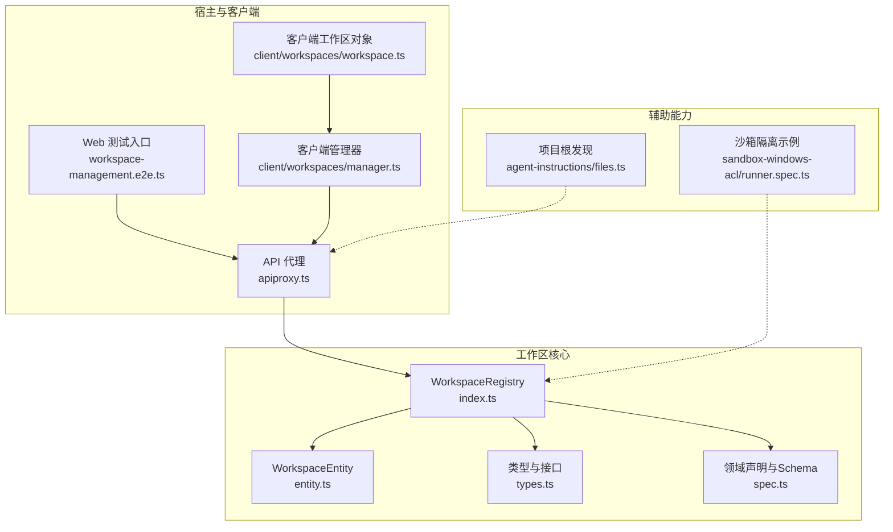
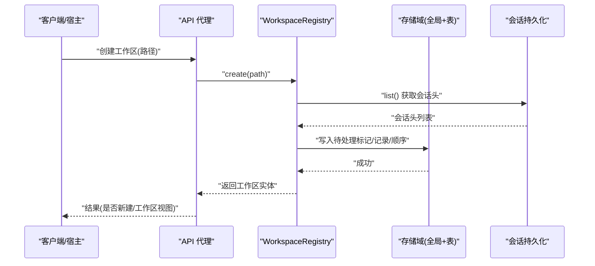
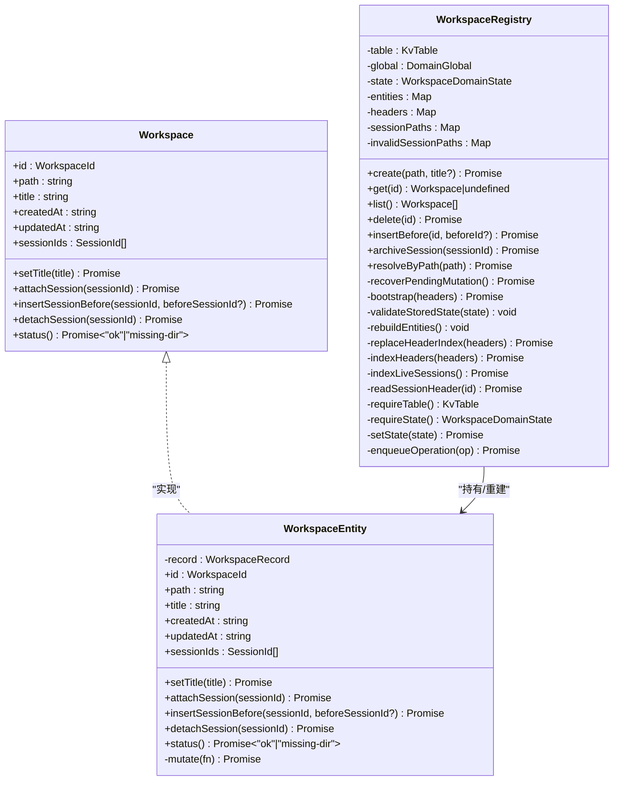
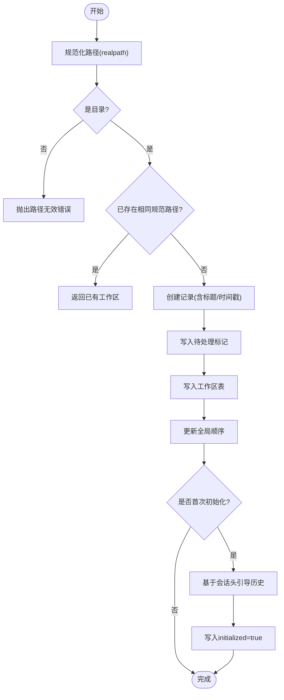
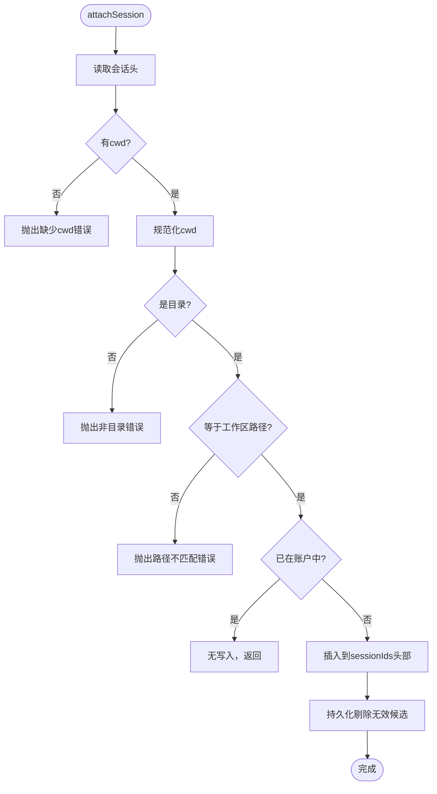
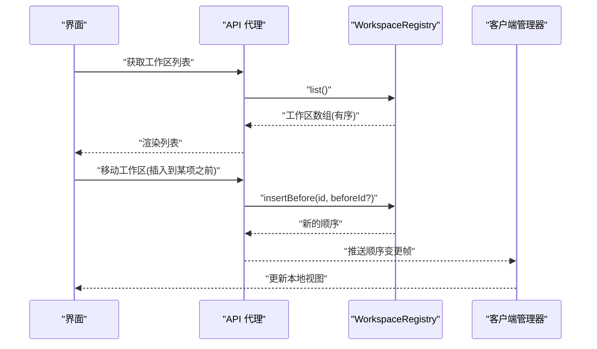
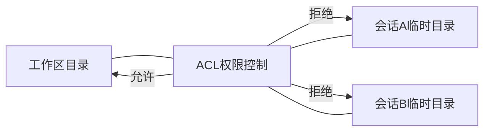
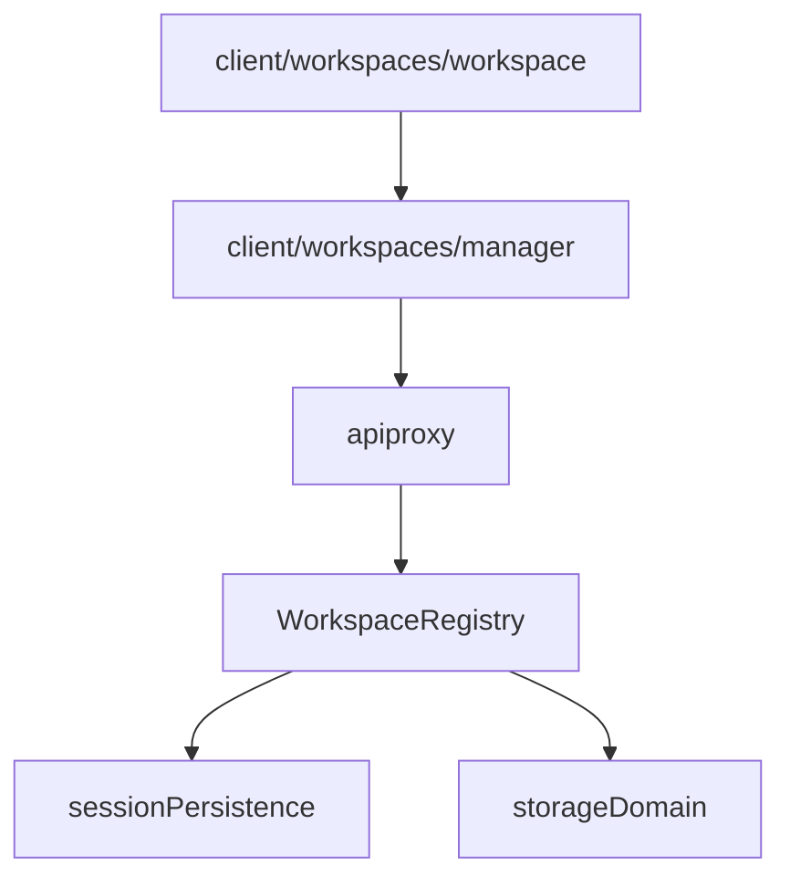

# 工作区管理

<cite>
**本文引用的文件**
- [packages/workspace/workspace/src/index.ts](file://packages/workspace/workspace/src/index.ts)
- [packages/workspace/workspace/src/entity.ts](file://packages/workspace/workspace/src/entity.ts)
- [packages/workspace/workspace/src/types.ts](file://packages/workspace/workspace/src/types.ts)
- [packages/workspace/workspace/src/spec.ts](file://packages/workspace/workspace/src/spec.ts)
- [docs/subsystems/workspace.md](file://docs/subsystems/workspace.md)
- [packages/host/apiproxy/src/api-proxy.ts](file://packages/host/apiproxy/src/api-proxy.ts)
- [apps/web/tests/workspace-management.e2e.ts](file://apps/web/tests/workspace-management.e2e.ts)
- [packages/client/runtime/src/client/workspaces/manager.ts](file://packages/client/runtime/src/client/workspaces/manager.ts)
- [packages/client/runtime/src/client/workspaces/workspace.ts](file://packages/client/runtime/src/client/workspaces/workspace.ts)
- [packages/context/agent-instructions/src/files.ts](file://packages/context/agent-instructions/src/files.ts)
- [packages/sandbox/sandbox-windows-acl/tests/runner.spec.ts](file://packages/sandbox/sandbox-windows-acl/tests/runner.spec.ts)
- [packages/workspace/workspace/tests/workspace.spec.ts](file://packages/workspace/workspace/tests/workspace.spec.ts)
</cite>

## 目录
1. [简介](#简介)
2. [项目结构](#项目结构)
3. [核心组件](#核心组件)
4. [架构总览](#架构总览)
5. [详细组件分析](#详细组件分析)
6. [依赖关系分析](#依赖关系分析)
7. [性能考量](#性能考量)
8. [故障排除指南](#故障排除指南)
9. [结论](#结论)
10. [附录](#附录)

## 简介
本文件系统性说明 DeepSeek Harness 的工作区（Workspace）管理系统，覆盖概念、生命周期、多工作区支持、配置与最佳实践，以及故障排除与性能优化建议。工作区是对用户当前工作目录的持久化记录：稳定的标识、规范化的路径、显示标题，以及与该目录关联的会话有序清单。系统通过领域存储域（storage domain）持久化，并在启动时基于会话头信息完成历史引导，确保一致性、可恢复性与可扩展性。

## 项目结构
工作区能力由 packages/workspace/workspace 提供，对外暴露 ctx.workspaceRegistry；其领域模型、实体与注册表分别位于 index.ts、entity.ts、types.ts、spec.ts。宿主侧通过 apiproxy 暴露 API 给 GUI 客户端；前端通过 client runtime 维护本地视图与状态同步；上下文发现机制（如 agent-instructions）用于项目根发现，与工作区注册解耦。

图表来源
- [packages/workspace/workspace/src/index.ts:92-140](file://packages/workspace/workspace/src/index.ts#L92-L140)
- [packages/workspace/workspace/src/entity.ts:69-222](file://packages/workspace/workspace/src/entity.ts#L69-L222)
- [packages/workspace/workspace/src/types.ts:1-105](file://packages/workspace/workspace/src/types.ts#L1-L105)
- [packages/workspace/workspace/src/spec.ts:1-76](file://packages/workspace/workspace/src/spec.ts#L1-L76)
- [packages/host/apiproxy/src/api-proxy.ts:2810-2825](file://packages/host/apiproxy/src/api-proxy.ts#L2810-L2825)
- [apps/web/tests/workspace-management.e2e.ts:60-76](file://apps/web/tests/workspace-management.e2e.ts#L60-L76)
- [packages/client/runtime/src/client/workspaces/manager.ts:34-58](file://packages/client/runtime/src/client/workspaces/manager.ts#L34-L58)
- [packages/client/runtime/src/client/workspaces/workspace.ts:61-91](file://packages/client/runtime/src/client/workspaces/workspace.ts#L61-L91)
- [packages/context/agent-instructions/src/files.ts:168-191](file://packages/context/agent-instructions/src/files.ts#L168-L191)
- [packages/sandbox/sandbox-windows-acl/tests/runner.spec.ts:205-237](file://packages/sandbox/sandbox-windows-acl/tests/runner.spec.ts#L205-L237)

章节来源
- [docs/subsystems/workspace.md:1-127](file://docs/subsystems/workspace.md#L1-L127)

## 核心组件
- WorkspaceRegistry（注册表）：负责工作区的创建、删除、排序、归档与会话归属校验；维护持久化全局状态与表；在启动时等待 sessionPersistence 并构建头部索引，完成一次性历史引导。
- WorkspaceEntity（实体）：封装单个工作区的读写操作，包括标题更新、会话附加/分离/重排、目录状态检查；所有写操作通过单一写入路径保证幂等与一致性。
- 领域模型（spec）：定义工作区记录结构与领域全局状态，包含初始化标记、工作区顺序、归档集合与待处理变更标记，保障中断恢复与版本演进。
- 类型与接口（types）：对外暴露 WorkspaceId 品牌与 Workspace 接口，隐藏实现细节。

章节来源
- [packages/workspace/workspace/src/index.ts:92-140](file://packages/workspace/workspace/src/index.ts#L92-L140)
- [packages/workspace/workspace/src/entity.ts:69-222](file://packages/workspace/workspace/src/entity.ts#L69-L222)
- [packages/workspace/workspace/src/spec.ts:1-76](file://packages/workspace/workspace/src/spec.ts#L1-L76)
- [packages/workspace/workspace/src/types.ts:1-105](file://packages/workspace/workspace/src/types.ts#L1-L105)

## 架构总览
工作区子系统以“注册表 + 实体 + 领域存储”为核心，宿主通过 API 代理暴露 CRUD，客户端维护本地视图与增量同步。启动流程严格依赖 sessionPersistence，避免将不可用对端误判为空历史；引导阶段仅读取会话头（id、cwd、createdAt），按目录分组并按最新会话时间排序，最终写入 initialized 标记。

图表来源
- [packages/host/apiproxy/src/api-proxy.ts:2810-2825](file://packages/host/apiproxy/src/api-proxy.ts#L2810-L2825)
- [packages/workspace/workspace/src/index.ts:118-140](file://packages/workspace/workspace/src/index.ts#L118-L140)
- [packages/workspace/workspace/src/index.ts:158-164](file://packages/workspace/workspace/src/index.ts#L158-L164)

## 详细组件分析

### 工作区实体与注册表类图

图表来源
- [packages/workspace/workspace/src/types.ts:1-105](file://packages/workspace/workspace/src/types.ts#L1-L105)
- [packages/workspace/workspace/src/entity.ts:69-222](file://packages/workspace/workspace/src/entity.ts#L69-L222)
- [packages/workspace/workspace/src/index.ts:92-663](file://packages/workspace/workspace/src/index.ts#L92-L663)

章节来源
- [packages/workspace/workspace/src/types.ts:1-105](file://packages/workspace/workspace/src/types.ts#L1-L105)
- [packages/workspace/workspace/src/entity.ts:69-222](file://packages/workspace/workspace/src/entity.ts#L69-L222)
- [packages/workspace/workspace/src/index.ts:92-663](file://packages/workspace/workspace/src/index.ts#L92-L663)

### 工作区创建与初始化流程
- 路径规范化：使用 realpath 解析真实路径，拒绝不存在或非目录。
- 重复创建：同一规范路径返回已有实体，不修改标题。
- 首次启动引导：若未初始化，则从会话持久化列出所有会话头，按目录分组并排序，生成或合并工作区记录，最后写入 initialized 标记。
- 待处理变更恢复：启动时检查 pendingMutation，完成中断的 create/delete 操作，保证一致。

图表来源
- [packages/workspace/workspace/src/index.ts:118-140](file://packages/workspace/workspace/src/index.ts#L118-L140)
- [packages/workspace/workspace/src/index.ts:158-164](file://packages/workspace/workspace/src/index.ts#L158-L164)
- [packages/workspace/workspace/src/index.ts:285-356](file://packages/workspace/workspace/src/index.ts#L285-L356)
- [packages/workspace/workspace/src/index.ts:426-508](file://packages/workspace/workspace/src/index.ts#L426-L508)

章节来源
- [packages/workspace/workspace/src/index.ts:118-140](file://packages/workspace/workspace/src/index.ts#L118-L140)
- [packages/workspace/workspace/src/index.ts:285-356](file://packages/workspace/workspace/src/index.ts#L285-L356)
- [packages/workspace/workspace/src/index.ts:426-508](file://packages/workspace/workspace/src/index.ts#L426-L508)

### 会话附加与成员资格校验
- 附加前校验：读取会话头，确认 cwd 存在且为目录，且规范化后等于工作区路径。
- 幂等追加：已在账户中的会话直接返回；新会话插入到头部。
- 过滤候选：每次写操作会持久化地剔除不再满足成员资格的会话（缺失头、cwd 无效或不匹配）。

图表来源
- [packages/workspace/workspace/src/entity.ts:109-149](file://packages/workspace/workspace/src/entity.ts#L109-L149)
- [packages/workspace/workspace/src/entity.ts:202-220](file://packages/workspace/workspace/src/entity.ts#L202-L220)

章节来源
- [packages/workspace/workspace/src/entity.ts:109-149](file://packages/workspace/workspace/src/entity.ts#L109-L149)
- [packages/workspace/workspace/src/entity.ts:202-220](file://packages/workspace/workspace/src/entity.ts#L202-L220)

### 多工作区支持与切换
- 工作区列表：list() 返回按持久化顺序排列的工作区实体，每个实体的 sessionIds 已按头部索引过滤。
- 顺序调整：insertBefore(id, beforeId?) 支持在工作区级别移动顺序，锚点可选（省略则追加）。
- 会话归档：archiveSession(sessionId) 将会话加入全局归档集，不影响工作区归属；取消归档需恢复位置。
- 客户端视图：客户端管理器维护完整快照与增量帧，处理归档集与本地重排序冲突。

图表来源
- [packages/workspace/workspace/src/index.ts:175-225](file://packages/workspace/workspace/src/index.ts#L175-L225)
- [packages/client/runtime/src/client/workspaces/manager.ts:34-58](file://packages/client/runtime/src/client/workspaces/manager.ts#L34-L58)

章节来源
- [packages/workspace/workspace/src/index.ts:175-225](file://packages/workspace/workspace/src/index.ts#L175-L225)
- [packages/client/runtime/src/client/workspaces/manager.ts:34-58](file://packages/client/runtime/src/client/workspaces/manager.ts#L34-L58)

### 资源共享与隔离机制
- 共享资源：工作区目录本身可被多个会话访问；会话归属由工作区账户与头部 cwd 共同决定。
- 隔离策略：沙箱通过 ACL 限制子进程对临时目录与兄弟会话的写入，同时允许对工作区目录的受控写入，确保跨会话协作安全。

图表来源
- [packages/sandbox/sandbox-windows-acl/tests/runner.spec.ts:205-237](file://packages/sandbox/sandbox-windows-acl/tests/runner.spec.ts#L205-L237)

章节来源
- [packages/sandbox/sandbox-windows-acl/tests/runner.spec.ts:205-237](file://packages/sandbox/sandbox-windows-acl/tests/runner.spec.ts#L205-L237)

### 配置选项与扩展点
- 根目录设置：工作区路径通过 realpath 规范化；GUI 通过目录选择器创建并打开新文件夹作为工作区。
- 排除规则：工作区子系统未内置通用排除规则；可通过宿主层或文件系统提供者进行裁剪。
- 自定义扩展点：
  - 目录选择器抽象 seam：允许宿主实现自定义目录选择能力。
  - 领域存储域：通过 defineDomain 扩展表与全局状态，支持版本迁移与向后兼容。
  - 客户端工作区对象：materialize/adopt 支持本地意图与远端视图同步。

章节来源
- [apps/web/tests/workspace-management.e2e.ts:60-76](file://apps/web/tests/workspace-management.e2e.ts#L60-L76)
- [docs/subsystems/workspace.md:136-150](file://docs/subsystems/workspace.md#L136-L150)
- [packages/workspace/workspace/src/spec.ts:61-76](file://packages/workspace/workspace/src/spec.ts#L61-L76)
- [packages/client/runtime/src/client/workspaces/workspace.ts:61-91](file://packages/client/runtime/src/client/workspaces/workspace.ts#L61-L91)

### 最佳实践
- 大型项目组织：
  - 使用稳定、规范化的工作区路径，避免符号链接导致的身份混淆。
  - 合理划分工作区边界，使每个工作区对应一个逻辑项目或功能域。
  - 利用会话归档减少主视图噪音，保留历史可追溯。
- 团队协作建议：
  - 统一工作区命名与展示标题策略，便于识别。
  - 通过 API 代理集中管理工作区变更，避免并发冲突。
  - 结合沙箱隔离，确保多会话并行执行时的安全性。

[本节为概念性指导，无需具体文件引用]

## 依赖关系分析
- 启动依赖：WorkspaceRegistry 依赖 storageDomain 与 sessionPersistence；缺少 sessionPersistence 时保持挂起，不会误判为空历史。
- 宿主集成：apiproxy 将工作区 CRUD 暴露为 RPC，捕获路径无效等业务错误并转换为结构化响应。
- 客户端同步：client/workspaces/manager 维护完整快照与增量帧，处理归档集与本地重排序冲突；workspace.ts 支持 materialize/adopt 模式。

图表来源
- [packages/workspace/workspace/src/index.ts:92-140](file://packages/workspace/workspace/src/index.ts#L92-L140)
- [packages/host/apiproxy/src/api-proxy.ts:2810-2825](file://packages/host/apiproxy/src/api-proxy.ts#L2810-L2825)
- [packages/client/runtime/src/client/workspaces/manager.ts:34-58](file://packages/client/runtime/src/client/workspaces/manager.ts#L34-L58)
- [packages/client/runtime/src/client/workspaces/workspace.ts:61-91](file://packages/client/runtime/src/client/workspaces/workspace.ts#L61-L91)

章节来源
- [packages/workspace/workspace/src/index.ts:92-140](file://packages/workspace/workspace/src/index.ts#L92-L140)
- [packages/host/apiproxy/src/api-proxy.ts:2810-2825](file://packages/host/apiproxy/src/api-proxy.ts#L2810-L2825)
- [packages/client/runtime/src/client/workspaces/manager.ts:34-58](file://packages/client/runtime/src/client/workspaces/manager.ts#L34-L58)
- [packages/client/runtime/src/client/workspaces/workspace.ts:61-91](file://packages/client/runtime/src/client/workspaces/workspace.ts#L61-L91)

## 性能考量
- 启动引导只读会话头：避免加载事件体，降低引导成本。
- 写入串行化：注册表通过 enqueueOperation 串行化写操作，减少竞争与不一致风险。
- 过滤候选持久化：每次写操作剔除无效候选，避免后续查询开销。
- 客户端增量同步：管理器使用完整快照与增量帧，减少全量刷新成本。

[本节为一般性讨论，无需具体文件引用]

## 故障排除指南
- 路径无效：创建工作区时路径不存在或非目录，API 返回 workspace-invalid-path。
- 会话头缺失或 cwd 无效：附加会话失败，提示缺少 cwd 或无法解析。
- 路径不匹配：会话 cwd 规范化后不等于工作区路径，拒绝附加。
- 顺序无效：移动工作区时源或锚点不在登记顺序中，抛出顺序无效错误。
- 未知会话归档：归档不存在的会话，抛出未知会话错误。
- 启动依赖缺失：缺少 sessionPersistence 时服务保持挂起，不会打开领域存储。

章节来源
- [packages/host/apiproxy/src/api-proxy.ts:2810-2825](file://packages/host/apiproxy/src/api-proxy.ts#L2810-L2825)
- [packages/workspace/workspace/src/entity.ts:109-149](file://packages/workspace/workspace/src/entity.ts#L109-L149)
- [packages/workspace/workspace/src/index.ts:244-268](file://packages/workspace/workspace/src/index.ts#L244-L268)
- [packages/workspace/workspace/src/index.ts:210-225](file://packages/workspace/workspace/src/index.ts#L210-L225)
- [packages/workspace/workspace/tests/workspace.spec.ts:186-200](file://packages/workspace/workspace/tests/workspace.spec.ts#L186-L200)

## 结论
DeepSeek Harness 的工作区管理系统以严格的领域模型与启动引导机制，提供了可靠的多工作区管理能力。通过注册表与实体分离、持久化全局状态与表、以及宿主与客户端的清晰分层，系统在一致性、可恢复性与扩展性方面表现良好。遵循最佳实践与故障排除建议，可在大型项目中有效组织代码与协作，同时保持高性能与稳定性。

[本节为总结性内容，无需具体文件引用]

## 附录
- 项目根发现：agent-instructions 提供 findProjectRoot，用于向上查找包含特定标记的目录，适用于项目根定位，与工作区注册解耦。
- 测试与验证：workspace.spec 覆盖生命周期、引导与失败场景；web e2e 验证 GUI 创建与采用流程。

章节来源
- [packages/context/agent-instructions/src/files.ts:168-191](file://packages/context/agent-instructions/src/files.ts#L168-L191)
- [packages/workspace/workspace/tests/workspace.spec.ts:186-200](file://packages/workspace/workspace/tests/workspace.spec.ts#L186-L200)
- [apps/web/tests/workspace-management.e2e.ts:60-76](file://apps/web/tests/workspace-management.e2e.ts#L60-L76)