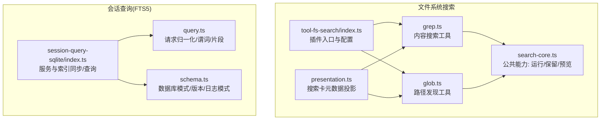
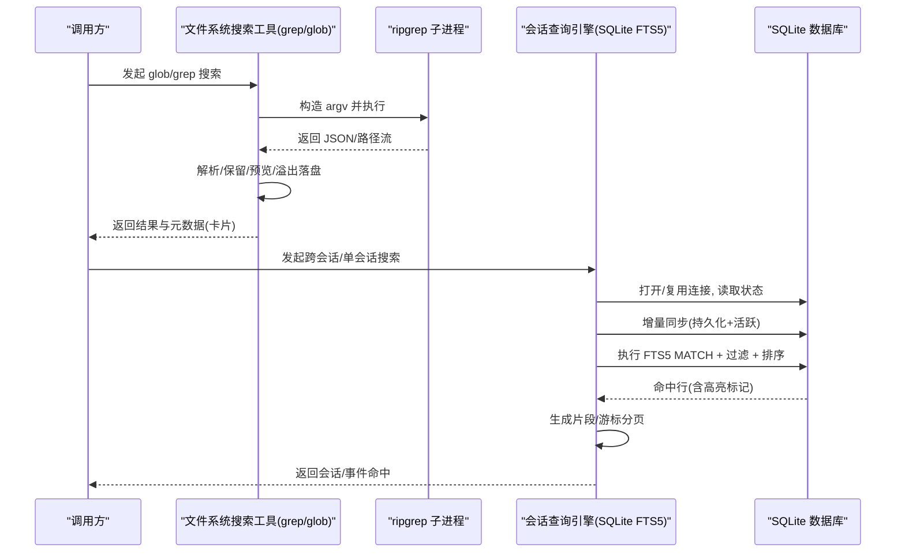
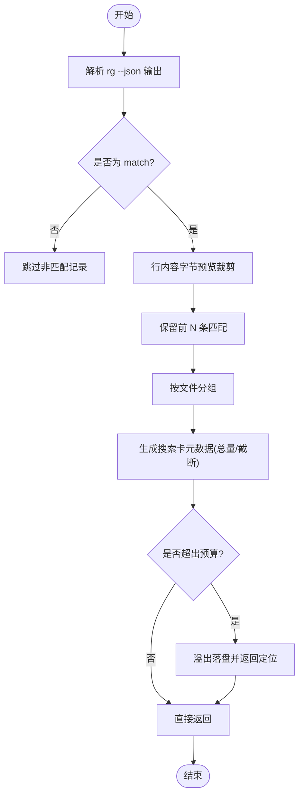
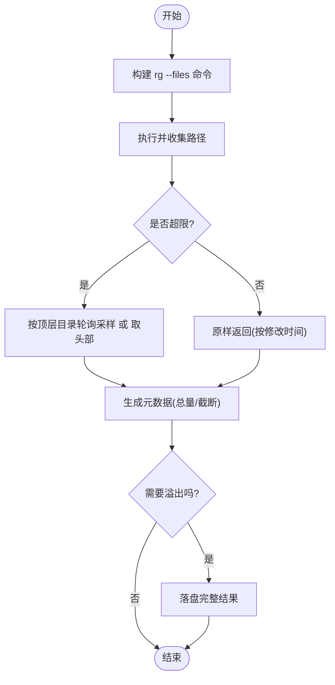
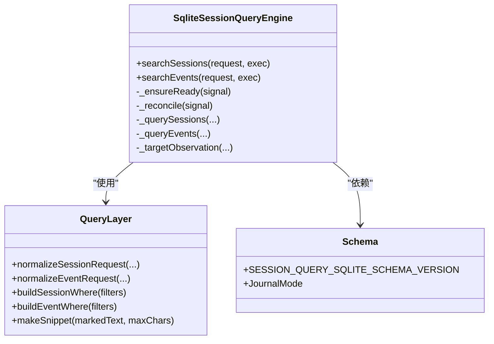
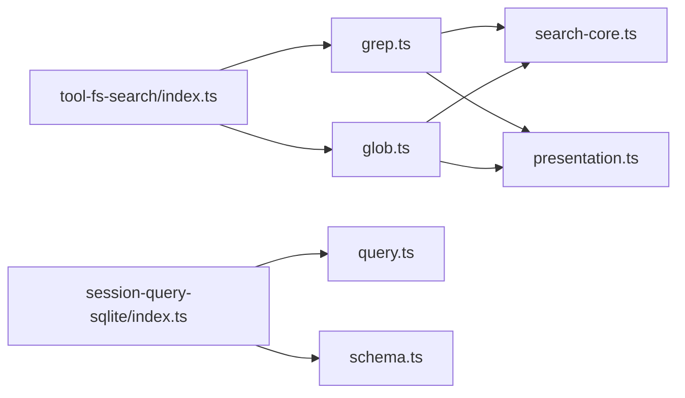

# 文件搜索与索引

<cite>
**本文引用的文件**
- [packages/fs/tool-fs-search/src/index.ts](file://packages/fs/tool-fs-search/src/index.ts)
- [packages/fs/tool-fs-search/src/grep.ts](file://packages/fs/tool-fs-search/src/grep.ts)
- [packages/fs/tool-fs-search/src/glob.ts](file://packages/fs/tool-fs-search/src/glob.ts)
- [packages/fs/tool-fs-search/src/search-core.ts](file://packages/fs/tool-fs-search/src/search-core.ts)
- [packages/fs/tool-fs-search/src/presentation.ts](file://packages/fs/tool-fs-search/src/presentation.ts)
- [packages/session-query/session-query-sqlite/src/index.ts](file://packages/session-query/session-query-sqlite/src/index.ts)
- [packages/session-query/session-query-sqlite/src/query.ts](file://packages/session-query/session-query-sqlite/src/query.ts)
- [packages/session-query/session-query-sqlite/src/schema.ts](file://packages/session-query/session-query-sqlite/src/schema.ts)
- [packages/client/connection/src/client/fixture.ts](file://packages/client/connection/src/client/fixture.ts)
- [packages/session/session-projection-cache/src/index.ts](file://packages/session/session-projection-cache/src/index.ts)
</cite>

## 目录
1. [简介](#简介)
2. [项目结构](#项目结构)
3. [核心组件](#核心组件)
4. [架构总览](#架构总览)
5. [详细组件分析](#详细组件分析)
6. [依赖关系分析](#依赖关系分析)
7. [性能考量](#性能考量)
8. [故障排除指南](#故障排除指南)
9. [结论](#结论)
10. [附录](#附录)

## 简介
本文件为 DeepSeek Harness 的“文件搜索与索引系统”技术文档，覆盖两大能力：
- 文件系统全文搜索：基于内置 ripgrep 的 glob（路径发现）与 grep（内容匹配），提供结果截断、元数据投影、溢出落盘等机制。
- 会话内容全文检索：基于 SQLite FTS5 的持久化与临时语料索引，支持跨会话与单会话查询、排序、片段生成与游标分页。

文档重点包括：搜索算法实现、索引构建策略、查询优化、元数据提取与增量更新、缓存与并发、内存管理、配置项、最佳实践、使用示例与故障排除。

## 项目结构
围绕搜索与索引的核心代码分布在两个子系统：
- 文件系统搜索工具套件：glob/grep 工具注册、参数校验、命令拼装、结果解析、保留策略、呈现元数据与溢出保存。
- 会话查询引擎（SQLite 后端）：FTS5 索引表、请求归一化、谓词编译、排序与片段生成、增量同步与游标分页。

图表来源
- [packages/fs/tool-fs-search/src/index.ts:1-161](file://packages/fs/tool-fs-search/src/index.ts#L1-L161)
- [packages/fs/tool-fs-search/src/grep.ts:1-366](file://packages/fs/tool-fs-search/src/grep.ts#L1-L366)
- [packages/fs/tool-fs-search/src/glob.ts:1-375](file://packages/fs/tool-fs-search/src/glob.ts#L1-L375)
- [packages/fs/tool-fs-search/src/search-core.ts:320-352](file://packages/fs/tool-fs-search/src/search-core.ts#L320-L352)
- [packages/fs/tool-fs-search/src/presentation.ts:70-172](file://packages/fs/tool-fs-search/src/presentation.ts#L70-L172)
- [packages/session-query/session-query-sqlite/src/index.ts:1-800](file://packages/session-query/session-query-sqlite/src/index.ts#L1-L800)
- [packages/session-query/session-query-sqlite/src/query.ts:1-478](file://packages/session-query/session-query-sqlite/src/query.ts#L1-L478)
- [packages/session-query/session-query-sqlite/src/schema.ts:1-38](file://packages/session-query/session-query-sqlite/src/schema.ts#L1-L38)

章节来源
- [packages/fs/tool-fs-search/src/index.ts:1-161](file://packages/fs/tool-fs-search/src/index.ts#L1-L161)
- [packages/session-query/session-query-sqlite/src/index.ts:1-800](file://packages/session-query/session-query-sqlite/src/index.ts#L1-L800)

## 核心组件
- 文件系统搜索工具套件
  - glob：按路径模式发现文件，按修改时间排序，支持 VCS 目录排除、结果采样或头部截取、溢出落盘。
  - grep：正则表达式搜索文件内容，输出行号与行内容，支持 include 过滤、结果保留与溢出落盘。
  - search-core：统一的子进程执行封装、超时/优雅退出、原始输出大小限制、行预览裁剪、匹配/路径保留策略。
  - presentation：将保留结果投影为搜索卡元数据（按文件分组、总量与截断标记），并限制序列化字节预算。
- 会话查询引擎（SQLite FTS5）
  - 索引层：持久化与临时两张 FTS5 表，统一分词器 unicode61，高亮标记防冲突，文本清洗去 NUL。
  - 查询层：请求归一化、过滤器编译为 SQL WHERE、外置谓词数量上限、绑定变量上限保护。
  - 排序与片段：按匹配区段数降序、文档长度升序、事件时间降序、序列号降序；片段基于实际高亮位置裁剪 Unicode 码点。
  - 增量同步：观察持久化快照与活跃会话，差异合并到索引，事务原子提交，全局/本地代际控制一致性。

章节来源
- [packages/fs/tool-fs-search/src/grep.ts:1-366](file://packages/fs/tool-fs-search/src/grep.ts#L1-L366)
- [packages/fs/tool-fs-search/src/glob.ts:1-375](file://packages/fs/tool-fs-search/src/glob.ts#L1-L375)
- [packages/fs/tool-fs-search/src/search-core.ts:320-352](file://packages/fs/tool-fs-search/src/search-core.ts#L320-L352)
- [packages/fs/tool-fs-search/src/presentation.ts:70-172](file://packages/fs/tool-fs-search/src/presentation.ts#L70-L172)
- [packages/session-query/session-query-sqlite/src/index.ts:1-800](file://packages/session-query/session-query-sqlite/src/index.ts#L1-L800)
- [packages/session-query/session-query-sqlite/src/query.ts:1-478](file://packages/session-query/session-query-sqlite/src/query.ts#L1-L478)
- [packages/session-query/session-query-sqlite/src/schema.ts:1-38](file://packages/session-query/session-query-sqlite/src/schema.ts#L1-L38)

## 架构总览
下图展示从用户调用到最终结果的端到端流程，涵盖文件系统搜索与会话查询两条路径。

图表来源
- [packages/fs/tool-fs-search/src/grep.ts:101-117](file://packages/fs/tool-fs-search/src/grep.ts#L101-L117)
- [packages/fs/tool-fs-search/src/glob.ts:78-108](file://packages/fs/tool-fs-search/src/glob.ts#L78-L108)
- [packages/session-query/session-query-sqlite/src/index.ts:348-369](file://packages/session-query/session-query-sqlite/src/index.ts#L348-L369)
- [packages/session-query/session-query-sqlite/src/index.ts:633-670](file://packages/session-query/session-query-sqlite/src/index.ts#L633-L670)

## 详细组件分析

### 文件系统搜索：grep（内容匹配）
- 参数校验：pattern 非空，path/include 合法性检查，include 仅允许单个正 glob。
- 命令拼装：固定 rg --json 模式，避免 shell 注入，目标路径置于 -- 之后。
- 结果解析：逐行解析 NDJSON，跳过 begin/end/context/summary，仅处理 match。
- 保留策略：统一 retainGrepMatches，对每行进行字节级预览裁剪，保留前 N 条匹配。
- 呈现与溢出：按文件分组输出；若超过内联预算，写入格式化结果文件并提供恢复定位。

图表来源
- [packages/fs/tool-fs-search/src/grep.ts:127-178](file://packages/fs/tool-fs-search/src/grep.ts#L127-L178)
- [packages/fs/tool-fs-search/src/search-core.ts:320-352](file://packages/fs/tool-fs-search/src/search-core.ts#L320-L352)
- [packages/fs/tool-fs-search/src/presentation.ts:119-138](file://packages/fs/tool-fs-search/src/presentation.ts#L119-L138)

章节来源
- [packages/fs/tool-fs-search/src/grep.ts:1-366](file://packages/fs/tool-fs-search/src/grep.ts#L1-L366)
- [packages/fs/tool-fs-search/src/search-core.ts:320-352](file://packages/fs/tool-fs-search/src/search-core.ts#L320-L352)
- [packages/fs/tool-fs-search/src/presentation.ts:119-138](file://packages/fs/tool-fs-search/src/presentation.ts#L119-L138)

### 文件系统搜索：glob（路径发现）
- 参数校验：pattern 非空，path 可选且非空白。
- 命令拼装：rg --files + glob 模式，按修改时间排序，忽略隐藏/VCS 目录。
- 结果采样：当结果超限时，可选择“按顶层目录轮询采样”或“取修改时间头部”。
- 呈现与溢出：生成搜索卡元数据（路径列表/总量/截断），超大结果落盘并提供恢复定位。

图表来源
- [packages/fs/tool-fs-search/src/glob.ts:78-108](file://packages/fs/tool-fs-search/src/glob.ts#L78-L108)
- [packages/fs/tool-fs-search/src/glob.ts:158-203](file://packages/fs/tool-fs-search/src/glob.ts#L158-L203)
- [packages/fs/tool-fs-search/src/glob.ts:243-259](file://packages/fs/tool-fs-search/src/glob.ts#L243-L259)

章节来源
- [packages/fs/tool-fs-search/src/glob.ts:1-375](file://packages/fs/tool-fs-search/src/glob.ts#L1-L375)

### 会话查询引擎（SQLite FTS5）
- 索引构建与增量更新
  - 持久化与临时两张 FTS5 表，统一使用 unicode61 分词器。
  - 观察持久化快照与活跃会话，计算差异后在事务中批量替换/删除，更新全局/本地代际。
  - 文本进入索引前进行清洗（去除 NUL、替换高亮占位符），避免冲突。
- 查询与排序
  - 请求归一化：查询去空白、拒绝 NUL、转义引号作为字面短语。
  - 谓词编译：会话/事件元数据过滤转换为 SQL WHERE，限制外置谓词数量与绑定变量数量。
  - 排序：按匹配区段数降序、文档长度升序、事件时间降序、序列号降序；跨会话额外按 session_id 升序。
  - 片段：基于 highlight() 的实际高亮位置，移除标记、规范化空白、按 Unicode 码点限制长度。
- 游标分页
  - 不透明游标绑定服务实例、范围、标准化请求指纹、偏移量与相关代际；语料变更使跨会话游标失效。

图表来源
- [packages/session-query/session-query-sqlite/src/index.ts:196-313](file://packages/session-query/session-query-sqlite/src/index.ts#L196-L313)
- [packages/session-query/session-query-sqlite/src/index.ts:633-670](file://packages/session-query/session-query-sqlite/src/index.ts#L633-L670)
- [packages/session-query/session-query-sqlite/src/query.ts:100-138](file://packages/session-query/session-query-sqlite/src/query.ts#L100-L138)
- [packages/session-query/session-query-sqlite/src/query.ts:145-216](file://packages/session-query/session-query-sqlite/src/query.ts#L145-L216)
- [packages/session-query/session-query-sqlite/src/query.ts:269-294](file://packages/session-query/session-query-sqlite/src/query.ts#L269-L294)
- [packages/session-query/session-query-sqlite/src/schema.ts:1-38](file://packages/session-query/session-query-sqlite/src/schema.ts#L1-L38)

章节来源
- [packages/session-query/session-query-sqlite/src/index.ts:1-800](file://packages/session-query/session-query-sqlite/src/index.ts#L1-L800)
- [packages/session-query/session-query-sqlite/src/query.ts:1-478](file://packages/session-query/session-query-sqlite/src/query.ts#L1-L478)
- [packages/session-query/session-query-sqlite/src/schema.ts:1-38](file://packages/session-query/session-query-sqlite/src/schema.ts#L1-L38)

### 浏览器侧近似分词（开发夹具）
- 提供浏览器环境下的 FTS5 unicode61 分词近似实现，用于开发与测试对齐 token 边界，确保短语匹配语义一致。

章节来源
- [packages/client/connection/src/client/fixture.ts:1245-1288](file://packages/client/connection/src/client/fixture.ts#L1245-L1288)

## 依赖关系分析
- 文件系统搜索
  - tool-fs-search/index.ts 聚合 glob/grep 工具注册与配置，依赖 search-core 的通用能力与 presentation 的元数据投影。
  - grep/glob 通过 subprocess 执行打包的 ripgrep，避免系统依赖与 shell 注入风险。
- 会话查询
  - index.ts 实现服务生命周期、索引同步与查询编排，依赖 query.ts 的请求/谓词/片段逻辑与 schema.ts 的模式常量。
  - 查询过程受限于 SQLite 可移植变量上限与 FTS5 外置谓词预算，防止不可用计划。

图表来源
- [packages/fs/tool-fs-search/src/index.ts:1-161](file://packages/fs/tool-fs-search/src/index.ts#L1-L161)
- [packages/session-query/session-query-sqlite/src/index.ts:1-800](file://packages/session-query/session-query-sqlite/src/index.ts#L1-L800)

章节来源
- [packages/fs/tool-fs-search/src/index.ts:1-161](file://packages/fs/tool-fs-search/src/index.ts#L1-L161)
- [packages/session-query/session-query-sqlite/src/index.ts:1-800](file://packages/session-query/session-query-sqlite/src/index.ts#L1-L800)

## 性能考量
- 文件系统搜索
  - 子进程执行：通过固定 argv 调用 ripgrep，无 shell 开销；支持超时与优雅终止。
  - 结果保留：统一 head 保留策略，减少内存占用；超大结果落盘，避免阻塞主流程。
  - 行预览：按字节裁剪，保持 UTF-8 边界，降低传输与渲染成本。
- 会话查询
  - 增量同步：仅在差异时写入，事务原子提交，避免全量重建。
  - 查询预算：限制外置谓词数量与绑定变量数量，保证 FTS5 计划可用。
  - 片段生成：基于实际高亮位置裁剪 Unicode 码点，控制响应体积。
  - 并发与缓存：会话投影缓存采用节流与强制落盘点（回合/会话结束/分离），失败软降级，避免频繁写放大。

章节来源
- [packages/fs/tool-fs-search/src/search-core.ts:320-352](file://packages/fs/tool-fs-search/src/search-core.ts#L320-L352)
- [packages/session-query/session-query-sqlite/src/query.ts:36-56](file://packages/session-query/session-query-sqlite/src/query.ts#L36-L56)
- [packages/session/session-projection-cache/src/index.ts:232-263](file://packages/session/session-projection-cache/src/index.ts#L232-L263)

## 故障排除指南
- 文件系统搜索
  - 原始输出过大：会触发 SEARCH_RAW_OUTPUT_OVERFLOW，建议缩小搜索范围或增加 rawOutputMaxBytes。
  - 结果被截断：提示完整结果已落盘，可通过返回的定位信息获取完整列表。
  - 包含非法 include：需为单个正 glob，不支持否定与逗号分隔列表。
- 会话查询
  - 搜索被禁用：openAt=never 时，searchSessions/searchEvents 抛出 SESSION_QUERY_SEARCH_DISABLED。
  - 索引打开失败：抛出 SESSION_QUERY_INDEX_FAILED，检查 path/journalMode 与权限。
  - 过滤器过多：超过 SQLITE_FTS5_OUTER_PREDICATE_LIMIT 或 SQLITE_PORTABLE_VARIABLE_LIMIT 将报错，需精简过滤条件。
  - 游标失效：语料变更会使跨会话游标失效，需重新发起查询。

章节来源
- [packages/fs/tool-fs-search/src/index.ts:97-117](file://packages/fs/tool-fs-search/src/index.ts#L97-L117)
- [packages/session-query/session-query-sqlite/src/index.ts:321-332](file://packages/session-query/session-query-sqlite/src/index.ts#L321-L332)
- [packages/session-query/session-query-sqlite/src/query.ts:36-56](file://packages/session-query/session-query-sqlite/src/query.ts#L36-L56)

## 结论
DeepSeek Harness 的文件搜索与索引系统以“轻量、可控、可扩展”为目标：
- 文件系统搜索通过 ripgrep 子进程与严格的保留/溢出策略，保障大规模目录与内容的快速检索。
- 会话查询基于 SQLite FTS5，提供稳定一致的排序、片段与分页，并通过增量同步与预算保护提升性能与鲁棒性。
- 结合投影缓存与节流落盘，系统在吞吐与持久化之间取得平衡。

## 附录

### 配置选项速查
- 文件系统搜索（tool-fs-search）
  - sampleOverCapGlobResults：超限时的 glob 采样策略开关。
  - globMaxResults：单次 glob 内联保留的最大路径数。
  - grepMaxMatches：单次 grep 内联保留的最大匹配数。
  - grepMaxLineBytes：匹配行预览最大字节数。
  - searchMetaMaxBytes：搜索卡元数据序列化字节预算。
  - rawOutputMaxBytes：rg 原始输出解析上限。
  - graceMs：子进程终止宽限期。
  - stderrMaxBytes：stderr 尾部保留上限。
  - timeoutMs：协作式工具调用超时预算。
- 会话查询（session-query-sqlite）
  - path：索引数据库路径（支持 :memory:）。
  - openAt：启动时机（startup/first-search/never）。
  - journalMode：WAL/DELETE/TRUNCATE/PERSIST。
  - defaultLimit/maxLimit：默认与最大页大小。
  - snippetChars：片段最大 Unicode 码点数。
  - persistedInspectConcurrency：持久化日志并发检查上限。

章节来源
- [packages/fs/tool-fs-search/src/index.ts:72-117](file://packages/fs/tool-fs-search/src/index.ts#L72-L117)
- [packages/session-query/session-query-sqlite/src/index.ts:88-125](file://packages/session-query/session-query-sqlite/src/index.ts#L88-L125)

### 使用示例（概念性）
- 使用 glob 查找 TypeScript 文件：
  - 调用 glob(pattern="**/*.ts", path="src")，根据配置决定是否采样或取头部。
- 使用 grep 搜索函数定义：
  - 调用 grep(pattern="function\\s+\\w+", include="*.ts")，查看匹配行与文件分组。
- 跨会话搜索：
  - 调用 searchSessions(query="错误处理", sessionFilters=[{kind:"cwd", values:["/workspace"]}], limit=20)。
- 单会话事件搜索：
  - 调用 searchEvents(sessionId="xxx", query="终端输出", filters=[{kind:"type", values:["terminal"]}])。

[本节为概念性说明，不直接引用具体源码]

### 最佳实践
- 大规模文件集
  - 优先使用 glob 限定范围，再对关键目录使用 grep；合理设置 grepMaxMatches 与 grepMaxLineBytes。
  - 开启 searchMetaMaxBytes 控制元数据体积，必要时利用溢出落盘获取完整结果。
- 搜索质量提升
  - 会话查询使用精确短语（系统会将查询作为字面短语），避免运算符注入；必要时拆分查询。
  - 合理使用 session/event 过滤器缩小范围，避免超出谓词/绑定预算。
- 性能调优
  - 调整 persistedInspectConcurrency 与 defaultLimit/maxLimit 平衡吞吐与延迟。
  - 使用 openAt=first-search 延迟加载索引，按需启用 FTS5。

[本节为通用指导，不直接引用具体源码]