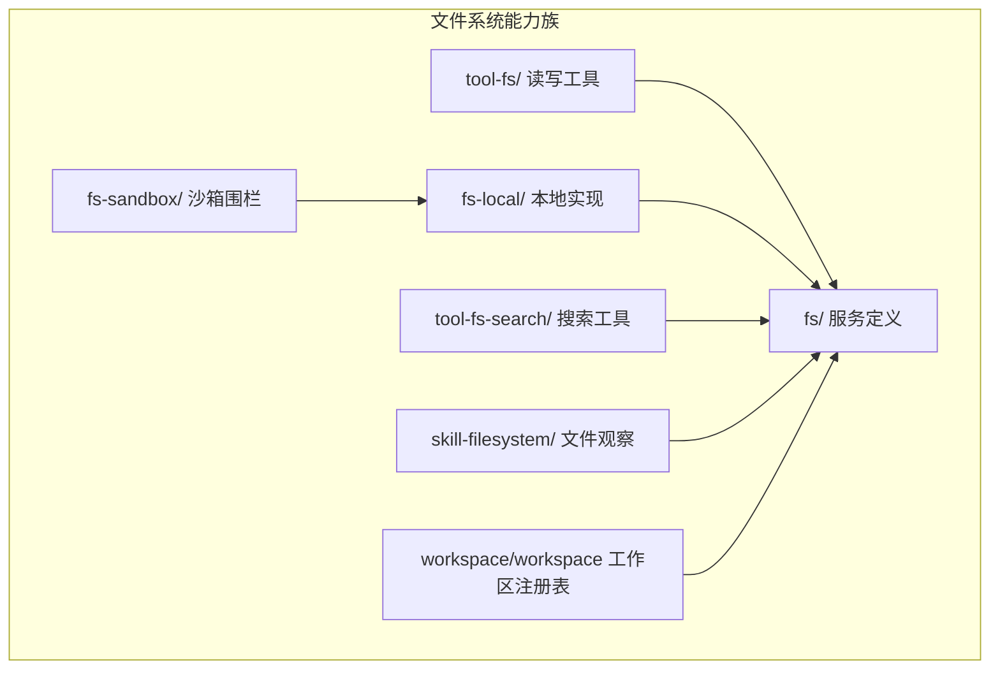
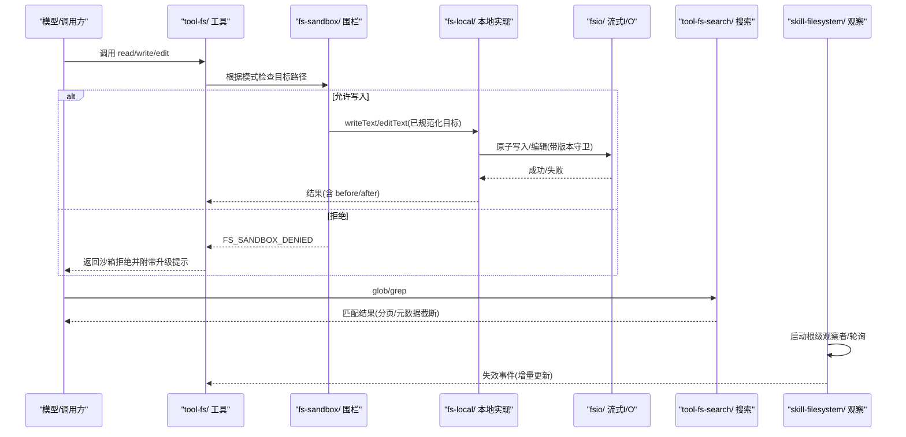
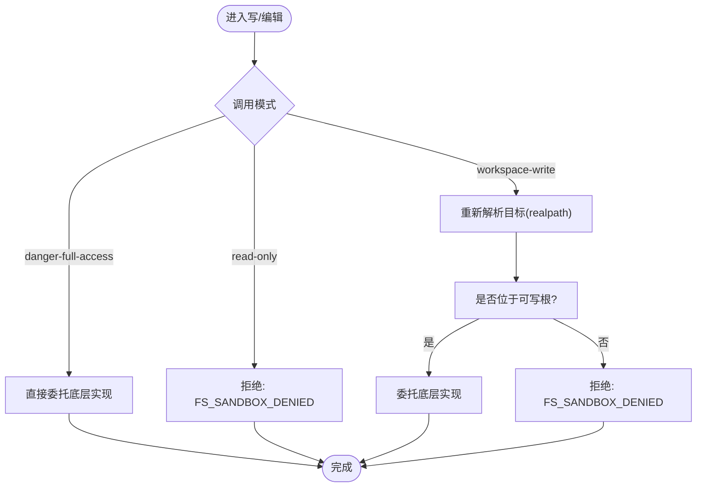
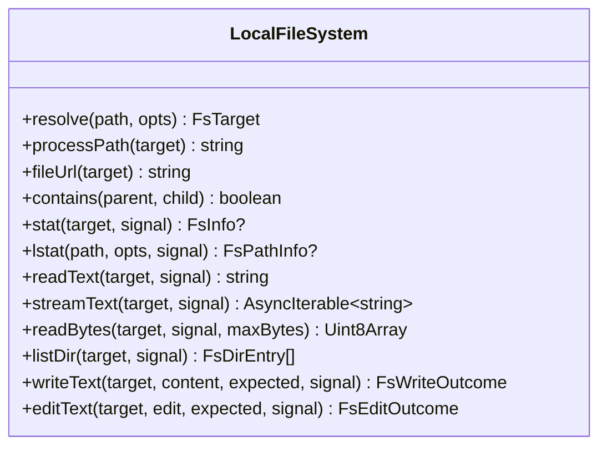
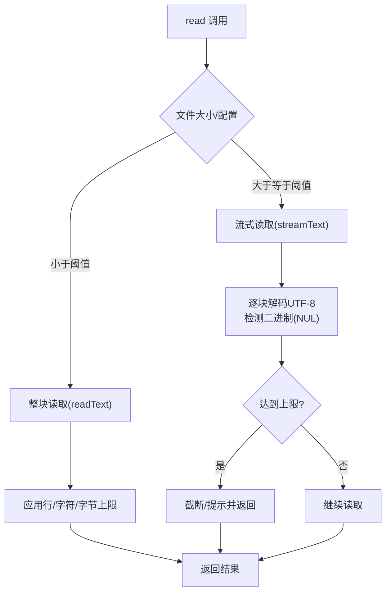
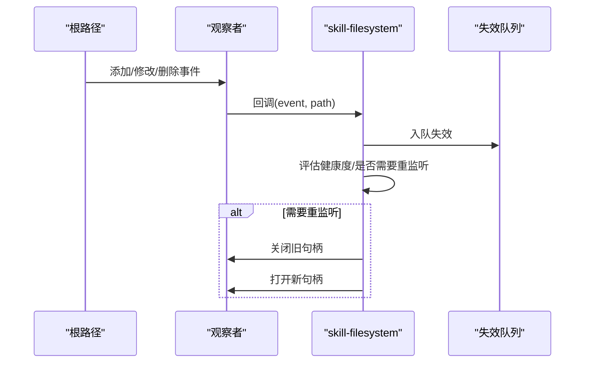
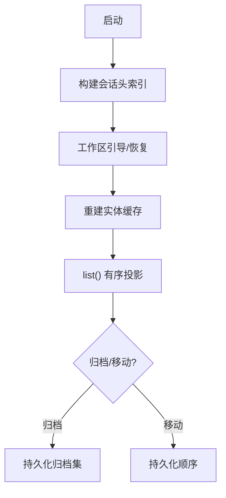
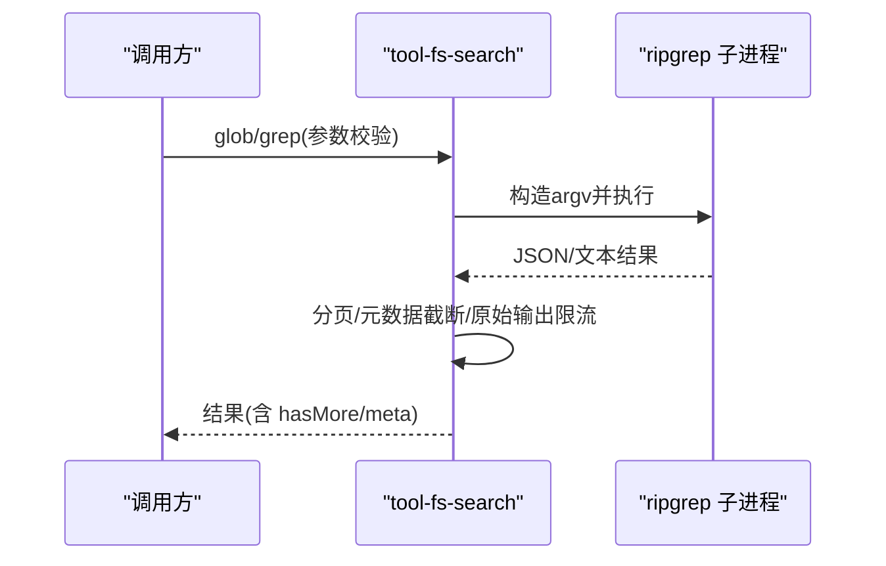
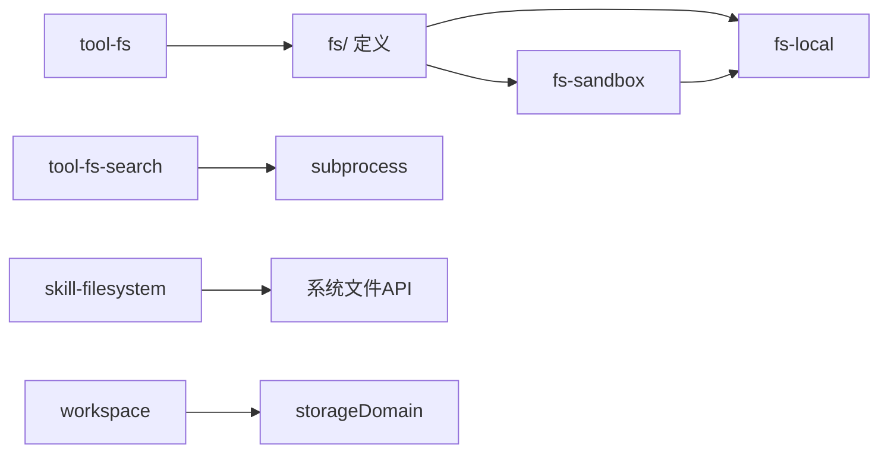

# 文件系统集成

<cite>
**本文引用的文件**
- [packages/fs/README.md](file://packages/fs/README.md)
- [packages/fs/fs/src/index.ts](file://packages/fs/fs/src/index.ts)
- [packages/fs/fs-local/src/index.ts](file://packages/fs/fs-local/src/index.ts)
- [packages/fs/fs-local/src/fsio.ts](file://packages/fs/fs-local/src/fsio.ts)
- [packages/fs/fs-sandbox/src/index.ts](file://packages/fs/fs-sandbox/src/index.ts)
- [packages/fs/fs-sandbox/src/containment.ts](file://packages/fs/fs-sandbox/src/containment.ts)
- [packages/fs/tool-fs/src/index.ts](file://packages/fs/tool-fs/src/index.ts)
- [packages/fs/tool-fs-search/src/index.ts](file://packages/fs/tool-fs-search/src/index.ts)
- [packages/fs/tool-fs-search/src/glob.ts](file://packages/fs/tool-fs-search/src/glob.ts)
- [packages/skill/skill-filesystem/src/index.ts](file://packages/skill/skill-filesystem/src/index.ts)
- [packages/util/home-paths/src/index.ts](file://packages/util/home-paths/src/index.ts)
- [packages/workspace/workspace/src/index.ts](file://packages/workspace/workspace/src/index.ts)
- [packages/fs/tool-fs/tests/tools.spec.ts](file://packages/fs/tool-fs/tests/tools.spec.ts)
- [packages/fs/fs-local/tests/fsio.spec.ts](file://packages/fs/fs-local/tests/fsio.spec.ts)
</cite>

## 目录
1. [简介](#简介)
2. [项目结构](#项目结构)
3. [核心组件](#核心组件)
4. [架构总览](#架构总览)
5. [详细组件分析](#详细组件分析)
6. [依赖关系分析](#依赖关系分析)
7. [性能考量](#性能考量)
8. [故障排查指南](#故障排查指南)
9. [结论](#结论)
10. [附录](#附录)

## 简介
本文件面向 DeepSeek Harness 的文件系统集成，聚焦以下目标：
- 文件访问控制机制：权限验证、路径白名单与安全策略实施
- 文件观察与监控：变更检测、增量更新、性能优化
- 工作区管理与项目组织：工作区实体、会话归属与持久化顺序
- 文件搜索、索引与缓存：基于 ripgrep 的发现工具与结果呈现
- 大文件处理与流式读取：边界限制、取消与内存占用控制
- 最佳实践与常见陷阱：安全与性能调优建议

## 项目结构
文件系统能力族由多个产品包协作构成，职责清晰、可替换性强：
- fs/：服务定义（进程路径规范化、文件 URI、包含关系、文本 I/O、原子写入原语），拥有 fs/* 政策事件
- fs-local/：本地文件系统实现（注册 ctx.fs）
- fs-sandbox/：沙箱执行策略的写/编辑围栏（读透传）
- tool-fs/：模型侧 read/write/edit/read_image 工具与执行器（窗口化读取、fs/* 事件派发）
- tool-fs-search/：glob/grep 发现工具（基于打包 ripgrep，非 ctx.fs 提供方法）
- skill-filesystem/：技能层文件观察与失效队列（Chokidar/polling、根级观察者生命周期管理）
- workspace/workspace：工作区注册表与持久化顺序、会话归属校验
- util/home-paths：跨平台 watch 路径规范化

图表来源
- [packages/fs/README.md:5-17](file://packages/fs/README.md#L5-L17)
- [packages/fs/fs/src/index.ts:178-199](file://packages/fs/fs/src/index.ts#L178-L199)
- [packages/fs/fs-local/src/index.ts:64-164](file://packages/fs/fs-local/src/index.ts#L64-L164)
- [packages/fs/fs-sandbox/src/index.ts:59-149](file://packages/fs/fs-sandbox/src/index.ts#L59-L149)
- [packages/fs/tool-fs/src/index.ts:21-79](file://packages/fs/tool-fs/src/index.ts#L21-L79)
- [packages/fs/tool-fs-search/src/index.ts:1-27](file://packages/fs/tool-fs-search/src/index.ts#L1-L27)
- [packages/skill/skill-filesystem/src/index.ts:363-577](file://packages/skill/skill-filesystem/src/index.ts#L363-L577)
- [packages/workspace/workspace/src/index.ts:92-140](file://packages/workspace/workspace/src/index.ts#L92-L140)

章节来源
- [packages/fs/README.md:5-17](file://packages/fs/README.md#L5-L17)

## 核心组件
- 服务定义（fs/）：统一 FsTarget/FsVersion 抽象、readText/streamText/readBytes/listDir/stat/lstat 等接口；明确无超时语义与取消传播
- 本地实现（fs-local/）：基于 realpath 的目标标识、原子写入、并发锁、版本守卫、行尾归一化差异基线
- 沙箱围栏（fs-sandbox/）：按调用模式（read-only / workspace-write / danger-full-access）拦截写/编辑，强制路径白名单（可写根）
- 工具层（tool-fs/）：read/write/edit/read_image 工具，窗口化读取、溢出提示、沙箱升级提示
- 搜索工具（tool-fs-search/）：glob/grep 通过子进程调用 ripgrep，结果分页与元数据截断、原始输出上限
- 观察服务（skill-filesystem/）：根级观察者生命周期、异常恢复、重监听调度、无效化队列
- 工作区（workspace/workspace）：持久化注册表、会话归属校验、有序列表与归档

章节来源
- [packages/fs/fs/src/index.ts:178-199](file://packages/fs/fs/src/index.ts#L178-L199)
- [packages/fs/fs-local/src/index.ts:64-266](file://packages/fs/fs-local/src/index.ts#L64-L266)
- [packages/fs/fs-sandbox/src/index.ts:59-149](file://packages/fs/fs-sandbox/src/index.ts#L59-L149)
- [packages/fs/tool-fs/src/index.ts:21-79](file://packages/fs/tool-fs/src/index.ts#L21-L79)
- [packages/fs/tool-fs-search/src/index.ts:69-161](file://packages/fs/tool-fs-search/src/index.ts#L69-L161)
- [packages/skill/skill-filesystem/src/index.ts:363-577](file://packages/skill/skill-filesystem/src/index.ts#L363-L577)
- [packages/workspace/workspace/src/index.ts:92-140](file://packages/workspace/workspace/src/index.ts#L92-L140)

## 架构总览
下图展示从模型工具到文件系统后端、观察与搜索的端到端流程。

图表来源
- [packages/fs/tool-fs/src/index.ts:53-79](file://packages/fs/tool-fs/src/index.ts#L53-L79)
- [packages/fs/fs-sandbox/src/index.ts:84-149](file://packages/fs/fs-sandbox/src/index.ts#L84-L149)
- [packages/fs/fs-local/src/index.ts:166-255](file://packages/fs/fs-local/src/index.ts#L166-L255)
- [packages/fs/fs-local/src/fsio.ts:413-450](file://packages/fs/fs-local/src/fsio.ts#L413-L450)
- [packages/fs/tool-fs-search/src/index.ts:119-161](file://packages/fs/tool-fs-search/src/index.ts#L119-L161)
- [packages/skill/skill-filesystem/src/index.ts:376-577](file://packages/skill/skill-filesystem/src/index.ts#L376-L577)

## 详细组件分析

### 文件访问控制与路径白名单（fs-sandbox + containment）
- 模式与策略
  - read-only：拒绝所有写/编辑
  - workspace-write：仅当目标规范化后位于“可写根”集合内才放行（与 bash 沙箱共享同一 writableRoots 派生）
  - danger-full-access：不围栏，直接委托底层实现
- 防 TOCTOU 措施
  - 在围栏内重新解析目标为最新 realpath，确保后续操作使用“新鲜”目标
  - 对祖先符号链接切换具备防御性
- 错误与提示
  - 拒绝时抛出结构化错误 FS_SANDBOX_DENIED，工具层映射为模型可见的沙箱标记与升级提示

图表来源
- [packages/fs/fs-sandbox/src/index.ts:84-149](file://packages/fs/fs-sandbox/src/index.ts#L84-L149)
- [packages/fs/fs-sandbox/src/containment.ts:19-44](file://packages/fs/fs-sandbox/src/containment.ts#L19-L44)

章节来源
- [packages/fs/fs-sandbox/src/index.ts:59-149](file://packages/fs/fs-sandbox/src/index.ts#L59-L149)
- [packages/fs/fs-sandbox/src/containment.ts:1-44](file://packages/fs/fs-sandbox/src/containment.ts#L1-L44)

### 本地文件系统实现与原子写入（fs-local）
- 目标与包含关系
  - 以 realpath 派生的 targetKey 作为稳定标识；contains 判断相对路径合法性
- 并发与一致性
  - 每 targetKey 串行锁，避免读→守卫→写交错
  - 写/编辑支持版本守卫（FS_STALE_VERSION）与 createIfAbsent 保护
- 差异基线与行尾
  - 写前捕获 diff 基线（受 diffBasisMaxBytes 限制），写入后 LF 归一化用于对比
- 流式与二进制防护
  - streamWholeText 逐块解码 UTF-8，采样检测 NUL 字节判定二进制

图表来源
- [packages/fs/fs-local/src/index.ts:64-266](file://packages/fs/fs-local/src/index.ts#L64-L266)

章节来源
- [packages/fs/fs-local/src/index.ts:64-266](file://packages/fs/fs-local/src/index.ts#L64-L266)
- [packages/fs/fs-local/src/fsio.ts:413-450](file://packages/fs/fs-local/src/fsio.ts#L413-L450)

### 大文件处理与流式读取（fs-local + tool-fs）
- 流式读取
  - streamWholeText 以流方式解码 UTF-8，避免整文件驻留内存
  - 二进制检测：采样片段中若出现 NUL 则拒绝
- 读取窗口与上限
  - tool-fs 的 read 工具支持行/字符/字节上限，超过阈值转为流式或截断提示
- 取消与中断
  - 支持 AbortSignal，在 chunk 边界可中止并返回 FS_ABORTED

图表来源
- [packages/fs/tool-fs/src/index.ts:24-79](file://packages/fs/tool-fs/src/index.ts#L24-L79)
- [packages/fs/fs-local/src/fsio.ts:413-450](file://packages/fs/fs-local/src/fsio.ts#L413-L450)
- [packages/fs/tool-fs/tests/tools.spec.ts:303-333](file://packages/fs/tool-fs/tests/tools.spec.ts#L303-L333)

章节来源
- [packages/fs/tool-fs/src/index.ts:24-79](file://packages/fs/tool-fs/src/index.ts#L24-L79)
- [packages/fs/fs-local/src/fsio.ts:413-450](file://packages/fs/fs-local/src/fsio.ts#L413-L450)
- [packages/fs/tool-fs/tests/tools.spec.ts:303-333](file://packages/fs/tool-fs/tests/tools.spec.ts#L303-L333)

### 文件观察与监控（skill-filesystem）
- 根级观察者
  - 针对根路径选择 chokidar 原生监听或父级轮询（ancestor watcher）
  - 支持 followSymlinks、atomic、awaitWriteFinish 稳定性阈值与 pollInterval
- 健康度与自愈
  - 监听错误/删除目录时标记 unhealthy，触发重试重监听
  - 维护 opening 状态，避免重复开启
- 失效队列
  - 收到相关事件后入队失效，驱动增量更新

图表来源
- [packages/skill/skill-filesystem/src/index.ts:376-577](file://packages/skill/skill-filesystem/src/index.ts#L376-L577)
- [packages/util/home-paths/src/index.ts:20-46](file://packages/util/home-paths/src/index.ts#L20-L46)

章节来源
- [packages/skill/skill-filesystem/src/index.ts:363-577](file://packages/skill/skill-filesystem/src/index.ts#L363-L577)
- [packages/util/home-paths/src/index.ts:20-46](file://packages/util/home-paths/src/index.ts#L20-L46)

### 工作区管理与项目结构（workspace/workspace）
- 持久化注册表
  - 工作区记录包含 path(title)、sessionIds、时间戳；创建时 prepend 到有序列表
- 会话归属校验
  - 启动时构建 header 索引，过滤 cwd 不一致的会话
- 有序与归档
  - 支持 insertBefore 调整显示顺序；archiveSession 持久化隐藏会话

图表来源
- [packages/workspace/workspace/src/index.ts:118-140](file://packages/workspace/workspace/src/index.ts#L118-L140)
- [packages/workspace/workspace/src/index.ts:426-508](file://packages/workspace/workspace/src/index.ts#L426-L508)
- [packages/workspace/workspace/src/index.ts:510-551](file://packages/workspace/workspace/src/index.ts#L510-L551)

章节来源
- [packages/workspace/workspace/src/index.ts:92-140](file://packages/workspace/workspace/src/index.ts#L92-L140)
- [packages/workspace/workspace/src/index.ts:426-508](file://packages/workspace/workspace/src/index.ts#L426-L508)
- [packages/workspace/workspace/src/index.ts:510-551](file://packages/workspace/workspace/src/index.ts#L510-L551)

### 文件搜索、索引与缓存（tool-fs-search）
- 搜索实现
  - 通过子进程调用打包 ripgrep，固定 argv 模板，不走 shell
- 结果控制
  - globMaxResults/grepMaxMatches 限制内联条目数，超出部分转存格式化结果
  - searchMetaMaxBytes 限制元数据大小，rawOutputMaxBytes 限制原始输出
- 结果可读性
  - 返回路径相对于 workdir；仅在 co-located 部署下可被 read 工具直接跟随读取

图表来源
- [packages/fs/tool-fs-search/src/index.ts:119-161](file://packages/fs/tool-fs-search/src/index.ts#L119-L161)
- [packages/fs/tool-fs-search/src/glob.ts:329-346](file://packages/fs/tool-fs-search/src/glob.ts#L329-L346)

章节来源
- [packages/fs/tool-fs-search/src/index.ts:1-27](file://packages/fs/tool-fs-search/src/index.ts#L1-L27)
- [packages/fs/tool-fs-search/src/index.ts:69-161](file://packages/fs/tool-fs-search/src/index.ts#L69-L161)
- [packages/fs/tool-fs-search/src/glob.ts:329-346](file://packages/fs/tool-fs-search/src/glob.ts#L329-L346)

## 依赖关系分析
- 松耦合与可替换
  - 工具层只依赖 fs/ 服务定义，可替换为本地、沙箱或远程实现
  - 搜索工具独立于 ctx.fs，通过 subprocess 运行 rg，避免在 fs 提供者上强绑定搜索语义
- 关键依赖链
  - tool-fs → fs 定义 → (fs-local | fs-sandbox → fs-local)
  - tool-fs-search → subprocess 执行 rg
  - skill-filesystem → 系统文件 API + Chokidar/polling
  - workspace → storageDomain/sessionPersistence

图表来源
- [packages/fs/README.md:5-17](file://packages/fs/README.md#L5-L17)
- [packages/fs/tool-fs-search/src/index.ts:1-27](file://packages/fs/tool-fs-search/src/index.ts#L1-L27)
- [packages/fs/fs-sandbox/src/index.ts:59-149](file://packages/fs/fs-sandbox/src/index.ts#L59-L149)
- [packages/workspace/workspace/src/index.ts:92-140](file://packages/workspace/workspace/src/index.ts#L92-L140)

章节来源
- [packages/fs/README.md:5-17](file://packages/fs/README.md#L5-L17)
- [packages/fs/tool-fs-search/src/index.ts:1-27](file://packages/fs/tool-fs-search/src/index.ts#L1-L27)
- [packages/fs/fs-sandbox/src/index.ts:59-149](file://packages/fs/fs-sandbox/src/index.ts#L59-L149)
- [packages/workspace/workspace/src/index.ts:92-140](file://packages/workspace/workspace/src/index.ts#L92-L140)

## 性能考量
- 无超时但支持取消
  - 文件 I/O 不设置超时，但通过 AbortSignal 在 syscall 边界尽力取消
- 流式与边界
  - 大文件优先流式读取；二进制检测采样避免误判；rawOutputMaxBytes 防止超大输出
- 观察优化
  - awaitWriteFinish 稳定性阈值减少抖动；ancestor watcher 降低深层树开销
- 差异基线限制
  - diffBasisMaxBytes 限制写前/写后对比内容大小，避免大文件差异导致内存峰值

[本节为通用指导，无需特定文件引用]

## 故障排查指南
- 沙箱拒绝
  - 现象：FS_SANDBOX_DENIED
  - 排查：确认调用模式与目标路径是否在可写根集合；必要时走升级流程
- 版本冲突
  - 现象：FS_STALE_VERSION
  - 排查：并发写/编辑导致版本不一致；重试前需重新读取
- 二进制文件
  - 现象：FS_NOT_TEXT
  - 排查：文件包含 NUL 字节；改用二进制读取或排除
- 观察器不稳定
  - 现象：watcher failed/unhealthy
  - 排查：检查路径规范、权限、磁盘；观察器将自动重试
- 搜索超时/溢出
  - 现象：SEARCH_* 错误
  - 排查：调整 graceMs/rawOutputMaxBytes/stderrMaxBytes；缩小搜索范围

章节来源
- [packages/fs/fs-sandbox/src/index.ts:126-149](file://packages/fs/fs-sandbox/src/index.ts#L126-L149)
- [packages/fs/fs-local/src/index.ts:178-239](file://packages/fs/fs-local/src/index.ts#L178-L239)
- [packages/fs/fs-local/src/fsio.ts:413-450](file://packages/fs/fs-local/src/fsio.ts#L413-L450)
- [packages/skill/skill-filesystem/src/index.ts:557-577](file://packages/skill/skill-filesystem/src/index.ts#L557-L577)
- [packages/fs/fs-local/tests/fsio.spec.ts:526-555](file://packages/fs/fs-local/tests/fsio.spec.ts#L526-L555)

## 结论
DeepSeek Harness 的文件系统集成通过“服务定义 + 可插拔后端 + 工具层 + 观察/搜索”的分层设计，实现了：
- 严格的路径白名单与模式化访问控制
- 高可靠的大文件流式 I/O 与原子写入
- 健壮的观察与自愈机制
- 高效的搜索与结果呈现
- 稳定的工作区管理与会话归属校验

遵循本文的最佳实践与调优建议，可在保证安全的前提下获得良好的性能与可维护性。

## 附录
- 最佳实践
  - 始终通过 tool-fs 的工具调用读写文件，避免绕过策略
  - 对大文件启用流式读取，合理设置 readStreamMinSize
  - 使用 workspace-write 模式并将目标置于可写根
  - 对搜索任务限制 rawOutputMaxBytes 与 meta 大小
  - 关注观察器健康度日志，必要时调整 polling 与稳定性阈值
- 常见陷阱
  - 忽略版本守卫导致的并发覆盖
  - 将二进制文件当作文本读取
  - 在符号链接频繁变化的环境中未重新规范化路径
  - 搜索范围过大导致资源耗尽

[本节为通用指导，无需特定文件引用]