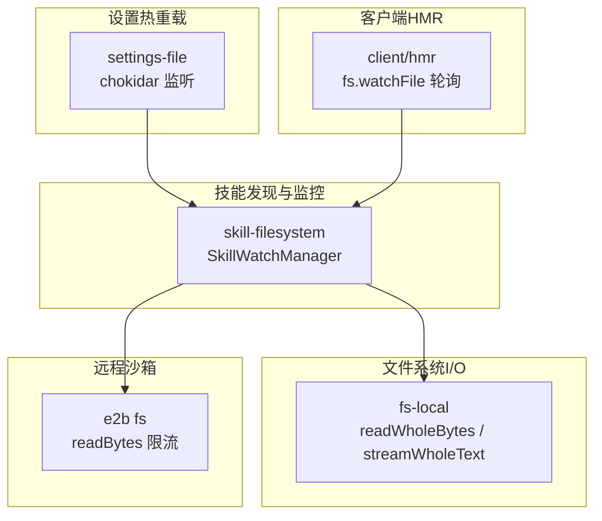
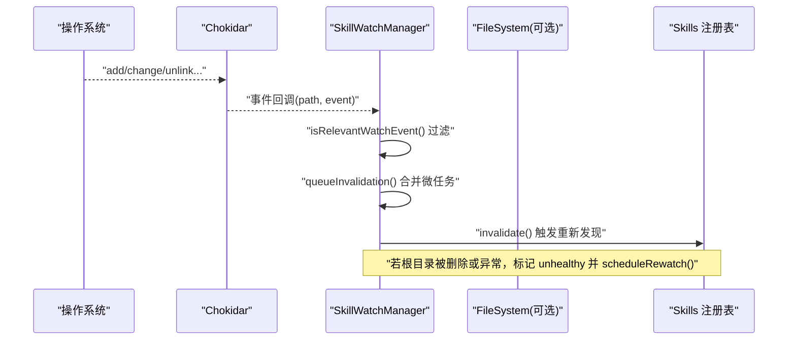
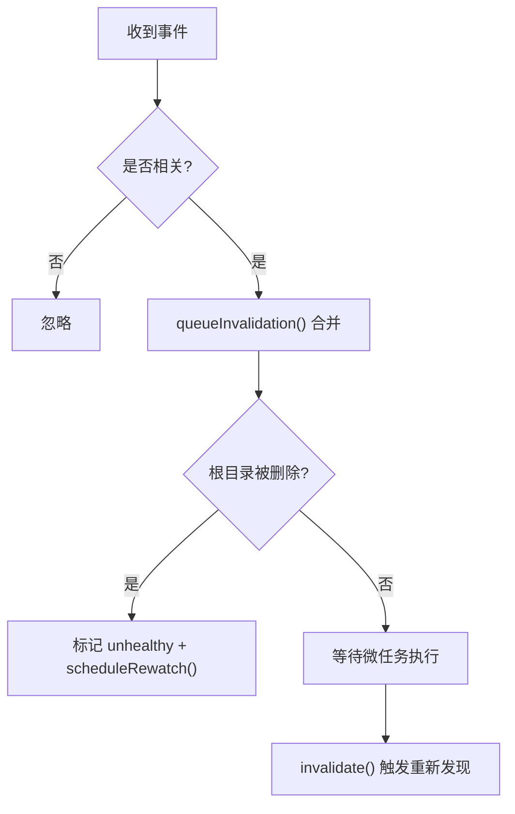
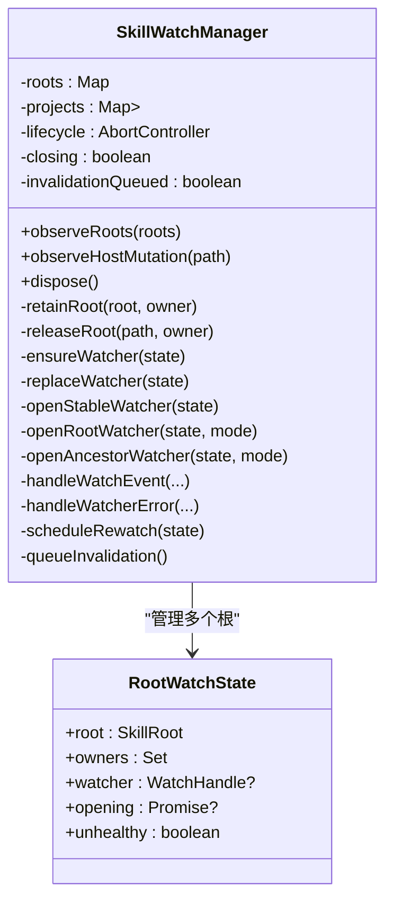
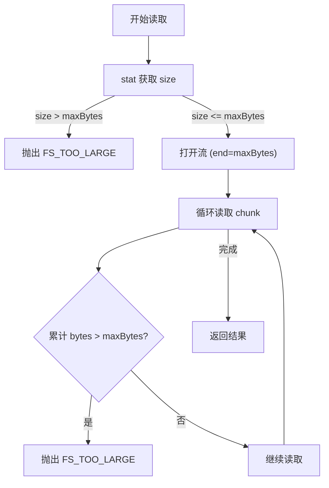
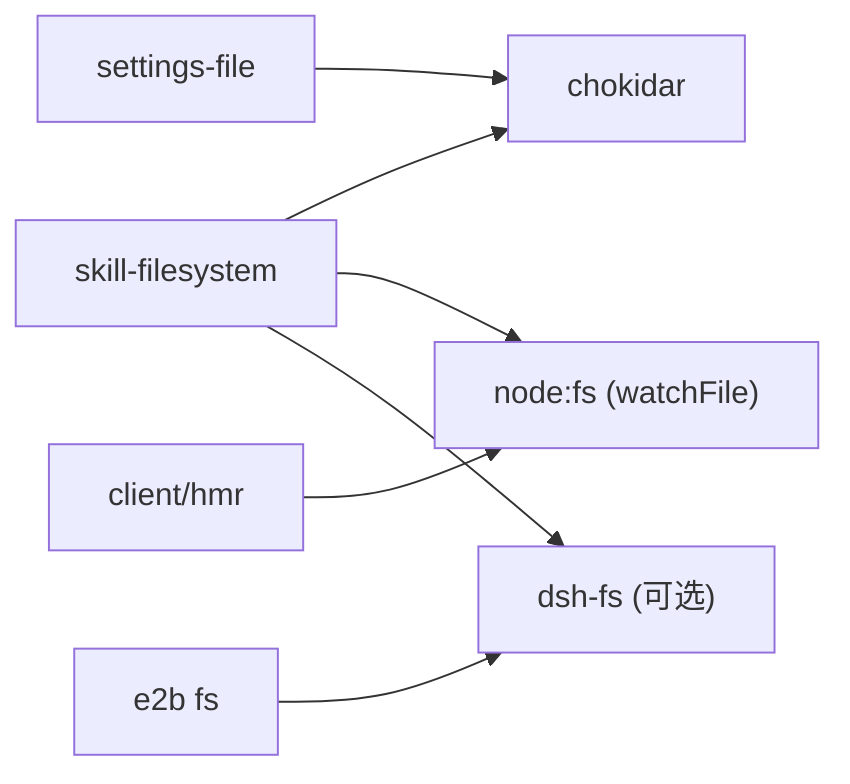

# 文件观察与监控

<cite>
**本文引用的文件**
- [packages/skill/skill-filesystem/src/index.ts](file://packages/skill/skill-filesystem/src/index.ts)
- [packages/fs/fs-local/src/fsio.ts](file://packages/fs/fs-local/src/fsio.ts)
- [packages/settings/settings-file/src/index.ts](file://packages/settings/settings-file/src/index.ts)
- [packages/client/hmr/src/index.ts](file://packages/client/hmr/src/index.ts)
- [packages/e2b/fs-e2b/src/index.ts](file://packages/e2b/fs-e2b/src/index.ts)
</cite>

## 目录
1. [简介](#简介)
2. [项目结构](#项目结构)
3. [核心组件](#核心组件)
4. [架构总览](#架构总览)
5. [详细组件分析](#详细组件分析)
6. [依赖关系分析](#依赖关系分析)
7. [性能考量](#性能考量)
8. [故障排查指南](#故障排查指南)
9. [结论](#结论)
10. [附录：配置选项速查](#附录配置选项速查)

## 简介
本文件面向 DeepSeek Harness 的“文件观察与监控”能力，系统性说明其文件系统事件监听、增量更新策略、性能优化技术、观察者模式实现、事件分发机制、内存管理、大文件监控（流式读取、部分文件监控、资源限制）、以及监控配置项与最佳实践。目标是帮助开发者高效使用并调优该子系统。

## 项目结构
围绕文件观察与监控的关键代码主要分布在以下模块：
- 技能发现与监控：packages/skill/skill-filesystem/src/index.ts
- 本地文件系统 I/O 与流式读取：packages/fs/fs-local/src/fsio.ts
- 设置文件热重载（基于 chokidar）：packages/settings/settings-file/src/index.ts
- 客户端 HMR 轮询与差异重哈希：packages/client/hmr/src/index.ts
- 远程沙箱环境下的字节读取与大小限制：packages/e2b/fs-e2b/src/index.ts

图表来源
- [packages/skill/skill-filesystem/src/index.ts:487-540](file://packages/skill/skill-filesystem/src/index.ts#L487-L540)
- [packages/fs/fs-local/src/fsio.ts:396-427](file://packages/fs/fs-local/src/fsio.ts#L396-L427)
- [packages/settings/settings-file/src/index.ts:238-250](file://packages/settings/settings-file/src/index.ts#L238-L250)
- [packages/client/hmr/src/index.ts:99-131](file://packages/client/hmr/src/index.ts#L99-L131)
- [packages/e2b/fs-e2b/src/index.ts:248-279](file://packages/e2b/fs-e2b/src/index.ts#L248-L279)

章节来源
- [packages/skill/skill-filesystem/src/index.ts:1-143](file://packages/skill/skill-filesystem/src/index.ts#L1-L143)

## 核心组件
- SkillWatchManager：负责按项目/共享根聚合 watcher，维护 watcher 生命周期、健康状态、自动重连与失效合并。
- Chokidar 根级监听：对技能根目录进行深度为 1 的事件监听，支持稳定性阈值与轮询间隔。
- Node fs.watchFile 祖先监听：当目标目录不存在或不可直接监听时，退化为对上级路径的轮询监听。
- 事件过滤与无效化队列：仅对 .md 与 SKILL.md 等关键变更触发批量无效化，避免频繁重建。
- 流式读取与大文件保护：通过 readWholeBytes/streamWholeText 限制最大字节数，防止内存溢出。
- 设置文件热重载：独立于技能监控的设置文件监听，提供 debounce 与原子写入。
- 客户端 HMR：基于 fs.watchFile 的轻量轮询，结合 stat 与 rehash 保证一致性。

章节来源
- [packages/skill/skill-filesystem/src/index.ts:283-337](file://packages/skill/skill-filesystem/src/index.ts#L283-L337)
- [packages/skill/skill-filesystem/src/index.ts:487-540](file://packages/skill/skill-filesystem/src/index.ts#L487-L540)
- [packages/skill/skill-filesystem/src/index.ts:579-588](file://packages/skill/skill-filesystem/src/index.ts#L579-L588)
- [packages/fs/fs-local/src/fsio.ts:396-427](file://packages/fs/fs-local/src/fsio.ts#L396-L427)
- [packages/settings/settings-file/src/index.ts:20-67](file://packages/settings/settings-file/src/index.ts#L20-L67)
- [packages/client/hmr/src/index.ts:99-131](file://packages/client/hmr/src/index.ts#L99-L131)

## 架构总览
下图展示了从文件系统事件到技能目录重新发现的完整流程，包括事件过滤、失效合并、watcher 健康检查与自动重连。

图表来源
- [packages/skill/skill-filesystem/src/index.ts:542-555](file://packages/skill/skill-filesystem/src/index.ts#L542-L555)
- [packages/skill/skill-filesystem/src/index.ts:579-588](file://packages/skill/skill-filesystem/src/index.ts#L579-L588)
- [packages/skill/skill-filesystem/src/index.ts:557-577](file://packages/skill/skill-filesystem/src/index.ts#L557-L577)

## 详细组件分析

### 文件系统事件监听与增量更新
- 根级监听：使用 chokidar.watch 对锚点目录进行持久监听，depth=1，ignoreInitial=true，atomic=true，并配置 awaitWriteFinish 稳定性阈值与轮询间隔。
- 祖先监听：当目标目录不存在或无法直接监听时，退化为 watchFile 轮询父路径，检测到变化后重新解析当前模式并尝试重建根监听。
- 事件过滤：仅关注 .md 文件和 SKILL.md 的增删改，忽略无关目录变动；同时跳过 .system 目录（当 skipSystem 为真）。
- 增量无效化：所有相关事件进入 queueMicrotask 合并，避免重复刷新；在重连成功后再次触发一次无效化以补齐缺失。

图表来源
- [packages/skill/skill-filesystem/src/index.ts:542-555](file://packages/skill/skill-filesystem/src/index.ts#L542-L555)
- [packages/skill/skill-filesystem/src/index.ts:579-588](file://packages/skill/skill-filesystem/src/index.ts#L579-L588)
- [packages/skill/skill-filesystem/src/index.ts:658-675](file://packages/skill/skill-filesystem/src/index.ts#L658-L675)

章节来源
- [packages/skill/skill-filesystem/src/index.ts:487-540](file://packages/skill/skill-filesystem/src/index.ts#L487-L540)
- [packages/skill/skill-filesystem/src/index.ts:452-485](file://packages/skill/skill-filesystem/src/index.ts#L452-L485)
- [packages/skill/skill-filesystem/src/index.ts:658-675](file://packages/skill/skill-filesystem/src/index.ts#L658-L675)

### 观察者模式与事件分发
- 观察者：SkillWatchManager 作为中心协调者，持有每个根的 RootWatchState，维护 owners 引用计数、watcher 句柄与健康状态。
- 事件分发：将底层事件统一转换为“相关事件”，并通过失效队列分发到上层 Skills 注册表，实现解耦。
- 生命周期：支持 abort 信号取消监听；dispose 时关闭所有 watcher，确保无泄漏。

图表来源
- [packages/skill/skill-filesystem/src/index.ts:283-337](file://packages/skill/skill-filesystem/src/index.ts#L283-L337)
- [packages/skill/skill-filesystem/src/index.ts:353-391](file://packages/skill/skill-filesystem/src/index.ts#L353-L391)
- [packages/skill/skill-filesystem/src/index.ts:405-450](file://packages/skill/skill-filesystem/src/index.ts#L405-L450)

章节来源
- [packages/skill/skill-filesystem/src/index.ts:283-337](file://packages/skill/skill-filesystem/src/index.ts#L283-L337)
- [packages/skill/skill-filesystem/src/index.ts:353-391](file://packages/skill/skill-filesystem/src/index.ts#L353-L391)

### 大文件监控与流式读取
- 预检与上限：readWholeBytes 先 stat 文件大小，超过 maxBytes 立即拒绝；读取时使用 createReadStream(end=maxBytes)，并在累积字节超过上限时抛出错误，防止增长中的文件导致无限缓冲。
- 文本流：streamWholeText 逐块解码 UTF-8，采样前若干字节检测二进制（含 NUL），跨块安全解码，不持整个文件于内存。
- 远程沙箱：e2b 的 readBytes 同样在统计阶段与流式阶段双重校验大小，超限抛错并取消读取。

图表来源
- [packages/fs/fs-local/src/fsio.ts:396-427](file://packages/fs/fs-local/src/fsio.ts#L396-L427)
- [packages/fs/fs-local/src/fsio.ts:437-463](file://packages/fs/fs-local/src/fsio.ts#L437-L463)
- [packages/e2b/fs-e2b/src/index.ts:248-279](file://packages/e2b/fs-e2b/src/index.ts#L248-L279)

章节来源
- [packages/fs/fs-local/src/fsio.ts:396-427](file://packages/fs/fs-local/src/fsio.ts#L396-L427)
- [packages/fs/fs-local/src/fsio.ts:437-463](file://packages/fs/fs-local/src/fsio.ts#L437-L463)
- [packages/e2b/fs-e2b/src/index.ts:248-279](file://packages/e2b/fs-e2b/src/index.ts#L248-L279)

### 内存管理与资源限制
- 项目级 watcher 数量限制：通过 watchMaxProjects 控制不同 projectRoot 的 watcher 集合，超出则驱逐最旧的项目，释放对应 watcher 并触发一次失效。
- 失效合并：使用 queueMicrotask 将多次事件合并为一次 invalidate，降低 CPU 与 I/O 压力。
- 流式读取上限：readWholeBytes/streamWholeText 通过 end 参数与累计字节限制，避免内存暴涨。
- 客户端 HMR 轮询：使用 fs.watchFile 轮询，stat 比对 mtime/size，仅在变化时 rehash，减少全量扫描。

章节来源
- [packages/skill/skill-filesystem/src/index.ts:297-330](file://packages/skill/skill-filesystem/src/index.ts#L297-L330)
- [packages/skill/skill-filesystem/src/index.ts:579-588](file://packages/skill/skill-filesystem/src/index.ts#L579-L588)
- [packages/fs/fs-local/src/fsio.ts:396-427](file://packages/fs/fs-local/src/fsio.ts#L396-L427)
- [packages/client/hmr/src/index.ts:99-131](file://packages/client/hmr/src/index.ts#L99-L131)

### 监控配置选项
- 技能监控（skill-filesystem）
  - watch：是否启用监控
  - watchUsePolling：是否使用轮询而非原生事件
  - watchStabilityThresholdMs：写操作稳定阈值（ms）
  - watchPollIntervalMs：轮询间隔（ms）
  - watchMaxProjects：最大监控项目数
  - watchFollowSymlinks：是否跟随符号链接
- 设置文件（settings-file）
  - path/dshHome：设置文件路径与 harness home
  - watch：是否监听设置文件变更
  - debounceMs：写操作去抖窗口（ms）

章节来源
- [packages/skill/skill-filesystem/src/index.ts:48-89](file://packages/skill/skill-filesystem/src/index.ts#L48-L89)
- [packages/skill/skill-filesystem/src/index.ts:608-623](file://packages/skill/skill-filesystem/src/index.ts#L608-L623)
- [packages/settings/settings-file/src/index.ts:20-67](file://packages/settings/settings-file/src/index.ts#L20-L67)

## 依赖关系分析
- skill-filesystem 依赖 chokidar 与 node:fs/watchFile 实现事件监听；依赖 dsh-fs 进行目录遍历与内容读取（可选）。
- fs-local 提供统一的读/写/流接口，屏蔽平台差异与错误分类。
- settings-file 独立使用 chokidar 监听设置文件，配合原子写入保持并发安全。
- client/hmr 使用 fs.watchFile 轮询，结合图结构同步 watch 集。
- e2b/fs 在远程环境中复用相同的字节限制与流式读取语义。

图表来源
- [packages/skill/skill-filesystem/src/index.ts:12-18](file://packages/skill/skill-filesystem/src/index.ts#L12-L18)
- [packages/settings/settings-file/src/index.ts:10-18](file://packages/settings/settings-file/src/index.ts#L10-L18)
- [packages/client/hmr/src/index.ts:99-131](file://packages/client/hmr/src/index.ts#L99-L131)
- [packages/e2b/fs-e2b/src/index.ts:248-279](file://packages/e2b/fs-e2b/src/index.ts#L248-L279)

章节来源
- [packages/skill/skill-filesystem/src/index.ts:12-18](file://packages/skill/skill-filesystem/src/index.ts#L12-L18)
- [packages/settings/settings-file/src/index.ts:10-18](file://packages/settings/settings-file/src/index.ts#L10-L18)

## 性能考量
- 事件合并：通过 queueMicrotask 合并多次变更，减少重复计算。
- 稳定性阈值：awaitWriteFinish.stabilityThreshold 与 pollInterval 平衡响应速度与系统负载。
- 深度限制：depth=1 仅监听一级子目录，避免深层树遍历开销。
- 项目上限：watchMaxProjects 限制活跃 watcher 数量，防止资源耗尽。
- 流式读取：end 参数与累计字节限制避免大文件占用过多内存。
- 轮询降级：usePolling 与 fs.watchFile 回退保障兼容性，但需权衡 CPU 使用率。

[本节为通用性能讨论，无需特定文件引用]

## 故障排查指南
- 监听失败与自愈：当 chokidar 报错或根目录被删除，标记 unhealthy 并 scheduleRewatch；若恢复则自动重建监听。
- 权限与路径错误：ENOTDIR/ENOENT 等路径不存在或非目录情况会被识别为“缺失”，不会中断整体流程。
- 大文件读取超限：readWholeBytes/streamWholeText 在 stat 或流式阶段检测到超限即抛错，建议调用方捕获并降级处理。
- 设置文件冲突：settings-file 使用原子写入与文件锁，避免并发写入导致的损坏；若出现 EEXIST/ENOENT，检查外部进程竞争。
- 客户端 HMR 不一致：若文件未更新，检查 fs.watchFile 轮询是否生效，确认 stat 对比逻辑与 rehash 触发条件。

章节来源
- [packages/skill/skill-filesystem/src/index.ts:557-577](file://packages/skill/skill-filesystem/src/index.ts#L557-L577)
- [packages/fs/fs-local/src/fsio.ts:396-427](file://packages/fs/fs-local/src/fsio.ts#L396-L427)
- [packages/settings/settings-file/src/index.ts:152-190](file://packages/settings/settings-file/src/index.ts#L152-L190)
- [packages/client/hmr/src/index.ts:99-131](file://packages/client/hmr/src/index.ts#L99-L131)

## 结论
DeepSeek Harness 的文件观察与监控系统通过分层设计实现了高可靠、低开销的变更检测与增量更新：以 chokidar 为主、fs.watchFile 为辅的双通道监听，结合事件过滤、失效合并、健康检查与自动重连，确保在复杂文件系统环境下保持稳定；通过流式读取与严格的大小限制，有效应对大文件场景；可配置的监控深度、轮询策略与项目上限，使系统在性能与实时性之间取得平衡。遵循本文的最佳实践与配置建议，可在生产环境中获得稳健高效的文件监控体验。

[本节为总结，无需特定文件引用]

## 附录：配置选项速查
- 技能监控（skill-filesystem）
  - watch：布尔，默认 true
  - watchUsePolling：布尔，默认 false
  - watchStabilityThresholdMs：正整数，默认 200
  - watchPollIntervalMs：正整数，默认 100
  - watchMaxProjects：正整数，默认 128
  - watchFollowSymlinks：布尔，默认 true
- 设置文件（settings-file）
  - path/dshHome：字符串
  - watch：布尔，默认 true
  - debounceMs：非负整数，默认 100

章节来源
- [packages/skill/skill-filesystem/src/index.ts:48-89](file://packages/skill/skill-filesystem/src/index.ts#L48-L89)
- [packages/skill/skill-filesystem/src/index.ts:608-623](file://packages/skill/skill-filesystem/src/index.ts#L608-L623)
- [packages/settings/settings-file/src/index.ts:20-67](file://packages/settings/settings-file/src/index.ts#L20-L67)