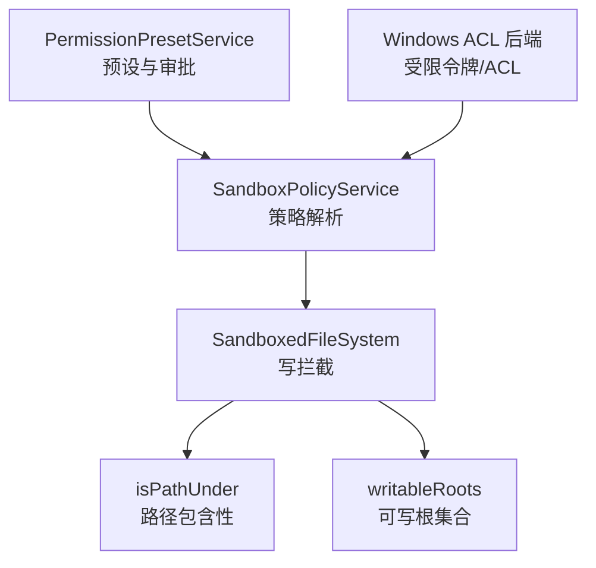
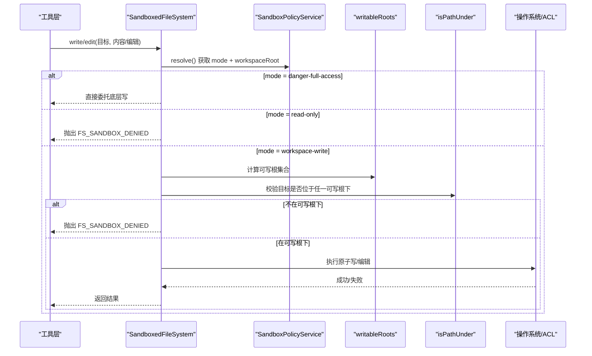
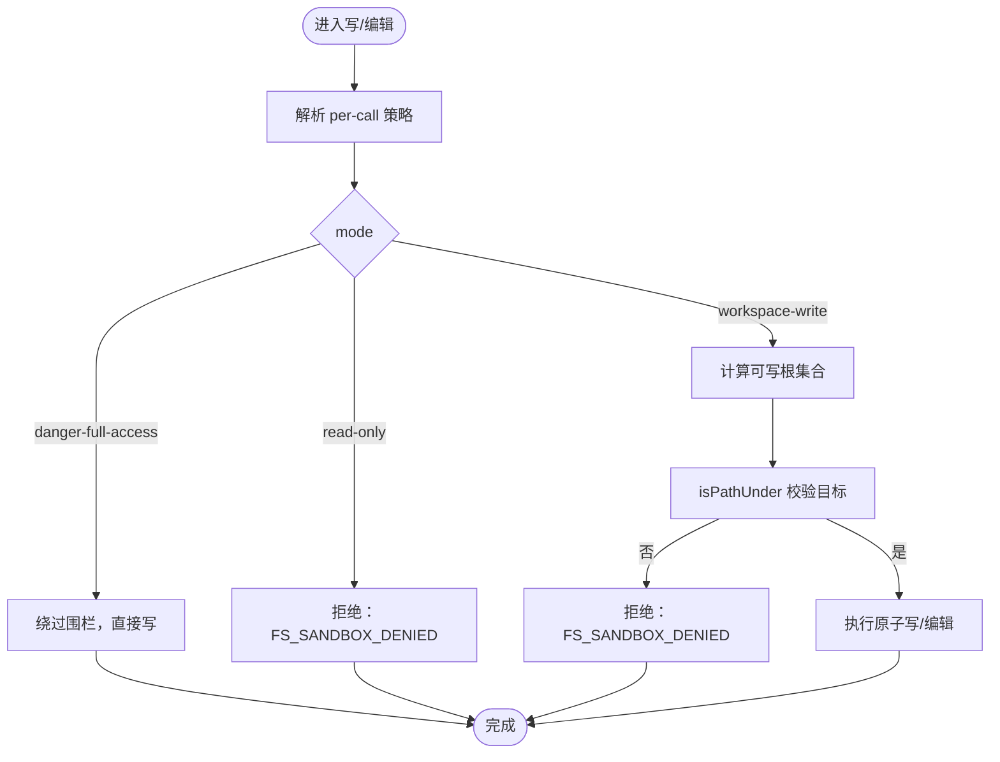
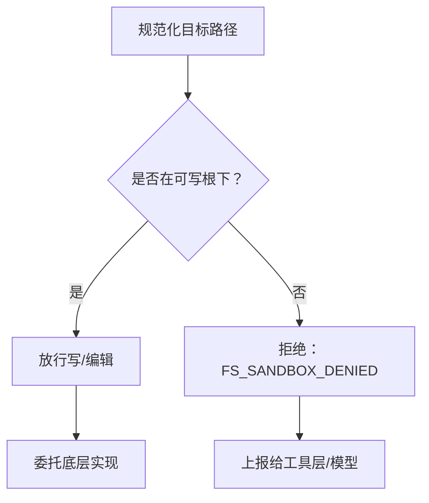
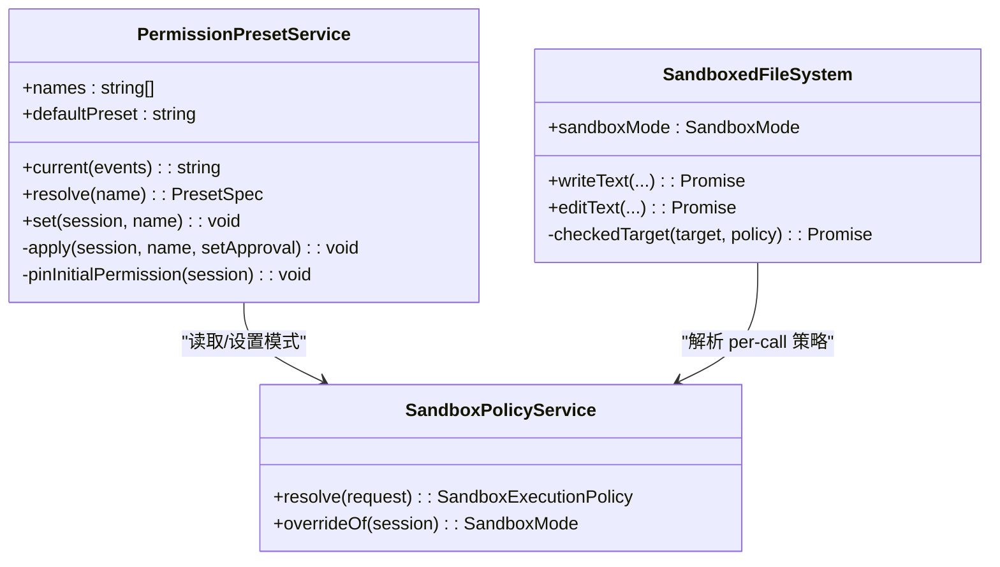
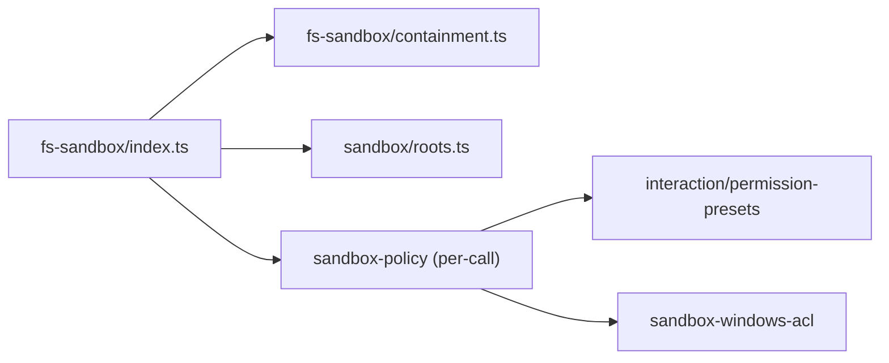

# 文件访问控制

<cite>
**本文引用的文件**
- [packages/fs/fs-sandbox/src/index.ts](file://packages/fs/fs-sandbox/src/index.ts)
- [packages/fs/fs-sandbox/src/containment.ts](file://packages/fs/fs-sandbox/src/containment.ts)
- [packages/sandbox/sandbox/src/roots.ts](file://packages/sandbox/sandbox/src/roots.ts)
- [packages/sandbox/sandbox-policy/README.md](file://packages/sandbox/sandbox-policy/README.md)
- [docs/subsystems/sandbox.md](file://docs/subsystems/sandbox.md)
- [packages/interaction/permission-presets/src/index.ts](file://packages/interaction/permission-presets/src/index.ts)
- [packages/client/ui-permission-presets/src/client/presentation.ts](file://packages/client/ui-permission-presets/src/client/presentation.ts)
- [packages/client/ui-permission-presets/src/client/index.ts](file://packages/client/ui-permission-presets/src/client/index.ts)
- [packages/sandbox/sandbox-windows-acl/src/acl.ts](file://packages/sandbox/sandbox-windows-acl/src/acl.ts)
- [packages/sandbox/sandbox-windows-acl/src/win32-abi.ts](file://packages/sandbox/sandbox-windows-acl/src/win32-abi.ts)
- [packages/sandbox/sandbox-windows-acl/README.md](file://packages/sandbox/sandbox-windows-acl/README.md)
- [packages/sandbox/sandbox/tests/roots.spec.ts](file://packages/sandbox/sandbox/tests/roots.spec.ts)
- [packages/fs/fs-sandbox/tests/fs-sandbox.spec.ts](file://packages/fs/fs-sandbox/tests/fs-sandbox.spec.ts)
</cite>

## 目录
1. [简介](#简介)
2. [项目结构](#项目结构)
3. [核心组件](#核心组件)
4. [架构总览](#架构总览)
5. [详细组件分析](#详细组件分析)
6. [依赖关系分析](#依赖关系分析)
7. [性能考量](#性能考量)
8. [故障排查指南](#故障排查指南)
9. [结论](#结论)
10. [附录：配置示例与最佳实践](#附录配置示例与最佳实践)

## 简介
本文件面向 DeepSeek Harness 的“文件访问控制”机制，系统性说明权限验证、路径白名单、沙箱策略实施以及跨进程安全边界。重点覆盖：
- 用户权限检查与角色基访问控制（通过预设与审批策略）
- 细粒度文件操作授权（读/写/编辑在每调用时校验）
- 路径白名单机制（允许/拒绝模式匹配、动态路径验证与安全边界）
- 沙箱环境下的文件访问限制、跨进程文件共享控制与审计日志记录
- 权限配置示例与最佳实践，帮助避免安全风险
- 常见权限问题的诊断与解决方案

## 项目结构
围绕文件访问控制的代码主要分布在以下模块：
- 文件系统沙箱实现：对写操作进行每调用策略拦截，读操作放行
- 路径包含性判定：基于规范路径与文件系统身份的安全判断
- 可写根推导：将“工作区+平台临时目录”作为允许写入的白名单
- 沙箱策略服务：集中管理默认模式、会话级覆盖与工作区根
- 权限预设与交互：将“沙箱模式 + 审批策略”打包为用户可见的预设
- Windows ACL 后端：以受限令牌和 ACL 实现跨进程写隔离

图表来源
- [packages/fs/fs-sandbox/src/index.ts:59-148](file://packages/fs/fs-sandbox/src/index.ts#L59-L148)
- [packages/fs/fs-sandbox/src/containment.ts:46-77](file://packages/fs/fs-sandbox/src/containment.ts#L46-L77)
- [packages/sandbox/sandbox/src/roots.ts:43-55](file://packages/sandbox/sandbox/src/roots.ts#L43-L55)
- [docs/subsystems/sandbox.md:41-94](file://docs/subsystems/sandbox.md#L41-L94)
- [packages/interaction/permission-presets/src/index.ts:159-227](file://packages/interaction/permission-presets/src/index.ts#L159-L227)
- [packages/sandbox/sandbox-windows-acl/src/acl.ts:46-58](file://packages/sandbox/sandbox-windows-acl/src/acl.ts#L46-L58)

章节来源
- [docs/subsystems/sandbox.md:1-219](file://docs/subsystems/sandbox.md#L1-L219)
- [packages/sandbox/sandbox-policy/README.md:1-14](file://packages/sandbox/sandbox-policy/README.md#L1-L14)

## 核心组件
- SandboxedFileSystem：继承本地文件系统，仅对写/编辑操作增加每调用策略围栏；读操作直接放行
- isPathUnder：对规范化目标路径执行“是否在可写根下”的判断，兼顾大小写与别名场景
- writableRoots：根据策略导出允许写入的根集合（read-only 为空；workspace-write 为工作区根+平台临时目录）
- SandboxPolicyService：提供 per-call 的策略解析（mode + workspaceRoot），并支持会话级覆盖
- PermissionPresetService：将“沙箱模式 + 审批策略”组合为用户预设，持久化选择并驱动运行时行为
- Windows ACL 后端：通过受限令牌与 ACL 授予/撤销，实现跨进程的写隔离

章节来源
- [packages/fs/fs-sandbox/src/index.ts:1-152](file://packages/fs/fs-sandbox/src/index.ts#L1-L152)
- [packages/fs/fs-sandbox/src/containment.ts:1-77](file://packages/fs/fs-sandbox/src/containment.ts#L1-L77)
- [packages/sandbox/sandbox/src/roots.ts:1-55](file://packages/sandbox/sandbox/src/roots.ts#L1-L55)
- [packages/interaction/permission-presets/src/index.ts:1-434](file://packages/interaction/permission-presets/src/index.ts#L1-L434)
- [packages/sandbox/sandbox-windows-acl/src/acl.ts:46-58](file://packages/sandbox/sandbox-windows-acl/src/acl.ts#L46-L58)

## 架构总览
下图展示了从工具调用到最终文件操作的完整流程，包括策略解析、路径白名单校验与平台后端执行。

图表来源
- [packages/fs/fs-sandbox/src/index.ts:84-148](file://packages/fs/fs-sandbox/src/index.ts#L84-L148)
- [packages/sandbox/sandbox/src/roots.ts:43-55](file://packages/sandbox/sandbox/src/roots.ts#L43-L55)
- [packages/fs/fs-sandbox/src/containment.ts:46-77](file://packages/fs/fs-sandbox/src/containment.ts#L46-L77)
- [docs/subsystems/sandbox.md:41-94](file://docs/subsystems/sandbox.md#L41-L94)

## 详细组件分析

### 权限验证系统：用户权限检查、角色基访问控制与细粒度授权
- 用户权限检查
  - 通过“权限预设”将“沙箱模式 + 审批策略”绑定为用户选项，并在会话中持久化选择
  - 预设服务在会话创建时填充缺失的权限事实，确保每个会话都有明确的 mode 与 approval 策略
- 角色基访问控制
  - 预设表中的条目即“角色”，每个条目声明了 sandbox 与 approval 的组合
  - 当当前会话的有效值不匹配任何预设时，显示为“自定义”，提示管理员调整预设或显式设置默认
- 细粒度文件操作授权
  - 读操作：始终放行（由沙箱语义保证）
  - 写/编辑：每调用时依据策略进行围栏检查，拒绝则抛出结构化错误 FS_SANDBOX_DENIED
  - 升级重试：工具层可在被拒绝后发起一次更宽模式的单次重试，需附带理由并经审批

图表来源
- [packages/fs/fs-sandbox/src/index.ts:84-148](file://packages/fs/fs-sandbox/src/index.ts#L84-L148)
- [packages/sandbox/sandbox/src/roots.ts:43-55](file://packages/sandbox/sandbox/src/roots.ts#L43-L55)
- [packages/fs/fs-sandbox/src/containment.ts:46-77](file://packages/fs/fs-sandbox/src/containment.ts#L46-L77)

章节来源
- [packages/interaction/permission-presets/src/index.ts:159-227](file://packages/interaction/permission-presets/src/index.ts#L159-L227)
- [packages/interaction/permission-presets/src/index.ts:375-430](file://packages/interaction/permission-presets/src/index.ts#L375-L430)
- [packages/client/ui-permission-presets/src/client/presentation.ts:1-22](file://packages/client/ui-permission-presets/src/client/presentation.ts#L1-L22)
- [packages/client/ui-permission-presets/src/client/index.ts:55-76](file://packages/client/ui-permission-presets/src/client/index.ts#L55-L76)

### 路径白名单机制：允许/拒绝模式匹配、动态路径验证与安全边界
- 允许模式
  - read-only：不允许任何写
  - workspace-write：允许写入“工作区根 + 平台临时目录”
  - danger-full-access：无限制
- 拒绝模式
  - 任何不在可写根下的写/编辑尝试均被拒绝
- 动态路径验证
  - 每次写前重新解析目标路径，捕获并发符号链接替换等竞态
  - 使用文件系统身份（设备号+inode）比对，处理大小写与别名（如 Windows 8.3）
- 安全边界
  - 围栏在受信任代码中运行，针对不受信路径做严格检查
  - 平台后端（如 Windows ACL）进一步限制跨进程写能力

图表来源
- [packages/fs/fs-sandbox/src/containment.ts:46-77](file://packages/fs/fs-sandbox/src/containment.ts#L46-L77)
- [packages/sandbox/sandbox/src/roots.ts:43-55](file://packages/sandbox/sandbox/src/roots.ts#L43-L55)
- [packages/fs/fs-sandbox/src/index.ts:126-148](file://packages/fs/fs-sandbox/src/index.ts#L126-L148)

章节来源
- [packages/sandbox/sandbox/tests/roots.spec.ts:25-39](file://packages/sandbox/sandbox/tests/roots.spec.ts#L25-L39)
- [packages/fs/fs-sandbox/tests/fs-sandbox.spec.ts:169-195](file://packages/fs/fs-sandbox/tests/fs-sandbox.spec.ts#L169-L195)

### 安全策略实施：沙箱环境限制、跨进程文件共享控制与审计日志
- 沙箱环境限制
  - 进程级沙箱：通过 bwrap/Landlock、Seatbelt 或 Windows ACL 受限令牌实现
  - 执行完整性报告：full/partial，指示后端是否能完全保障承诺的文件效果
- 跨进程文件共享控制
  - Windows ACL：为工作区派生 SID，授予最小必要写权限；清理尽力而为，残留 ACE 失效且不可传播
  - 锁定文件：按保护路径生成唯一锁文件，避免并发冲突
- 审计日志记录
  - 预设切换事件：记录用户选择的预设名称
  - 模式与审批策略变更：通过会话事件持久化，便于回放与审计

图表来源
- [packages/interaction/permission-presets/src/index.ts:159-227](file://packages/interaction/permission-presets/src/index.ts#L159-L227)
- [packages/fs/fs-sandbox/src/index.ts:59-148](file://packages/fs/fs-sandbox/src/index.ts#L59-L148)
- [docs/subsystems/sandbox.md:41-94](file://docs/subsystems/sandbox.md#L41-L94)

章节来源
- [packages/sandbox/sandbox-windows-acl/src/acl.ts:46-58](file://packages/sandbox/sandbox-windows-acl/src/acl.ts#L46-L58)
- [packages/sandbox/sandbox-windows-acl/src/win32-abi.ts:45-71](file://packages/sandbox/sandbox-windows-acl/src/win32-abi.ts#L45-L71)
- [packages/sandbox/sandbox-windows-acl/README.md:93-104](file://packages/sandbox/sandbox-windows-acl/README.md#L93-L104)
- [packages/interaction/permission-presets/src/index.ts:44-52](file://packages/interaction/permission-presets/src/index.ts#L44-L52)

## 依赖关系分析
- SandboxedFileSystem 依赖：
  - LocalFileSystem（继承其读写/编辑实现）
  - @deepseek-ai/dsh-fs（错误类型与目标/版本抽象）
  - @deepseek-ai/dsh-sandbox（writableRoots、SandboxExecutionPolicy）
  - containment.ts（isPathUnder）
- 策略与服务：
  - SandboxPolicyService 提供 per-call 策略解析
  - PermissionPresetService 管理预设与审批策略，影响运行时行为
- 平台后端：
  - Windows ACL 后端通过受限令牌与 ACL 实现跨进程写隔离，配合锁文件与最小权限原则

图表来源
- [packages/fs/fs-sandbox/src/index.ts:33-42](file://packages/fs/fs-sandbox/src/index.ts#L33-L42)
- [packages/sandbox/sandbox/src/roots.ts:1-55](file://packages/sandbox/sandbox/src/roots.ts#L1-L55)
- [packages/interaction/permission-presets/src/index.ts:13-28](file://packages/interaction/permission-presets/src/index.ts#L13-L28)
- [packages/sandbox/sandbox-windows-acl/src/acl.ts:46-58](file://packages/sandbox/sandbox-windows-acl/src/acl.ts#L46-L58)

章节来源
- [packages/fs/fs-sandbox/src/index.ts:1-152](file://packages/fs/fs-sandbox/src/index.ts#L1-L152)
- [packages/sandbox/sandbox/src/roots.ts:1-55](file://packages/sandbox/sandbox/src/roots.ts#L1-L55)
- [packages/interaction/permission-presets/src/index.ts:1-434](file://packages/interaction/permission-presets/src/index.ts#L1-L434)

## 性能考量
- 路径包含性检查
  - 优先使用快速词法比较；仅在必要时回溯文件系统身份比对，减少开销
- 可写根推导
  - 对 /tmp 与 os.tmpdir() 进行去重与规范化，避免重复检查
- Windows ACL 授权
  - 首次受限写入可能触发全树传播，耗时较大；后续精确 ACE 常驻时跳过授权
  - 清理尽力而为，失败聚合为 AggregateError，退出后残留无效

章节来源
- [packages/fs/fs-sandbox/src/containment.ts:19-44](file://packages/fs/fs-sandbox/src/containment.ts#L19-L44)
- [packages/sandbox/sandbox/src/roots.ts:43-55](file://packages/sandbox/sandbox/src/roots.ts#L43-L55)
- [packages/sandbox/sandbox-windows-acl/README.md:93-104](file://packages/sandbox/sandbox-windows-acl/README.md#L93-L104)

## 故障排查指南
- 常见错误与原因
  - FS_SANDBOX_DENIED：目标不在可写根下或处于 read-only 模式
  - 平台后端部分限制：partial 表示后端无法完全保障所有文件效果
- 定位步骤
  - 确认当前会话的预设与有效模式（permissions 投影）
  - 检查 per-call 策略解析结果（mode + workspaceRoot）
  - 验证目标路径规范化后的真实位置（符号链接、大小写、别名）
  - 查看平台后端日志与错误签名（不同后端 denial signatures 不同）
- 解决建议
  - 切换到 workspace-write 预设并审批所需范围
  - 将目标文件移动到工作区或平台临时目录
  - 在 Windows 上确保工作区拥有正确的 ACL 与 SID 授予

章节来源
- [packages/fs/fs-sandbox/src/index.ts:126-148](file://packages/fs/fs-sandbox/src/index.ts#L126-L148)
- [docs/subsystems/sandbox.md:9-39](file://docs/subsystems/sandbox.md#L9-L39)
- [packages/sandbox/sandbox-windows-acl/README.md:93-104](file://packages/sandbox/sandbox-windows-acl/README.md#L93-L104)

## 结论
DeepSeek Harness 的文件访问控制通过“策略解析 + 路径白名单 + 平台后端”三层机制，实现了细粒度、可审计、可扩展的权限体系。开发者应：
- 明确预设与审批策略，避免滥用危险模式
- 将敏感数据置于工作区内，利用白名单约束写范围
- 关注平台后端的限制与性能特征，合理设计工作区结构与临时目录
- 借助审计日志与错误码快速定位权限问题

## 附录：配置示例与最佳实践
- 配置要点
  - 部署默认模式：建议 read-only 或 workspace-write，避免默认危险模式
  - 工作区根：确保为绝对路径，规范化后作为写边界
  - 临时目录：使用平台提供的 temp 区域，避免越界写
- 最佳实践
  - 最小权限：仅授予必要的写范围，优先 workspace-write
  - 审批流程：对需要更广权限的操作启用审批，保留审计轨迹
  - 路径安全：避免将工作区设置为根目录（除非确有必要），防止意外扩大授权面
  - 平台差异：关注 partial 限制与 Windows ACL 特性，必要时调整策略

章节来源
- [packages/sandbox/sandbox-policy/README.md:1-14](file://packages/sandbox/sandbox-policy/README.md#L1-L14)
- [packages/interaction/permission-presets/src/index.ts:139-178](file://packages/interaction/permission-presets/src/index.ts#L139-L178)
- [docs/subsystems/sandbox.md:41-94](file://docs/subsystems/sandbox.md#L41-L94)