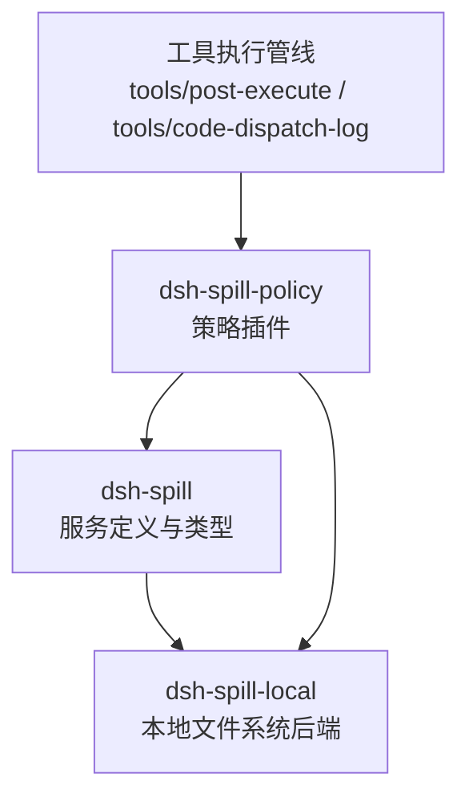
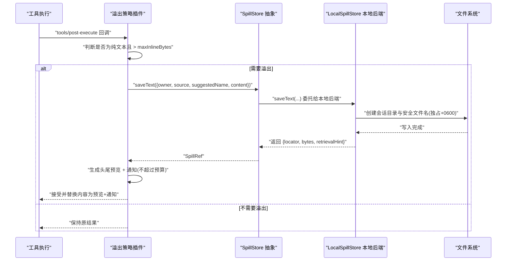
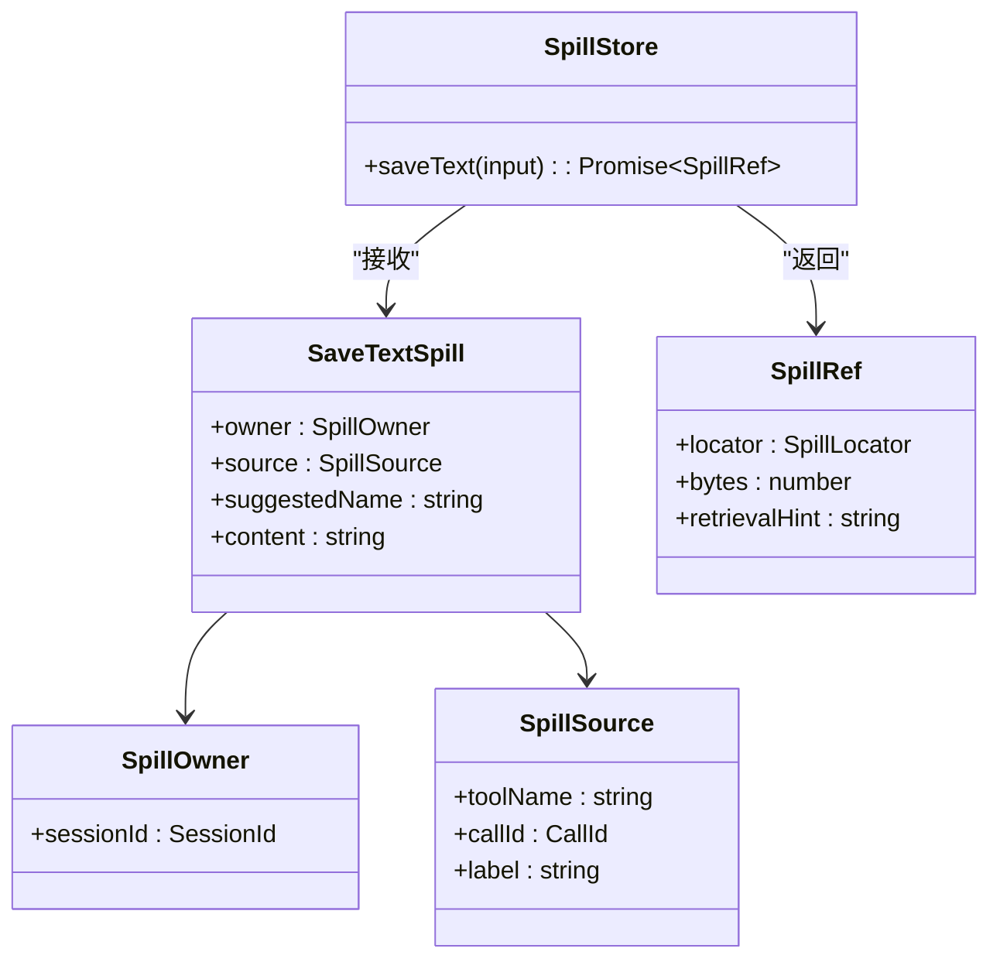
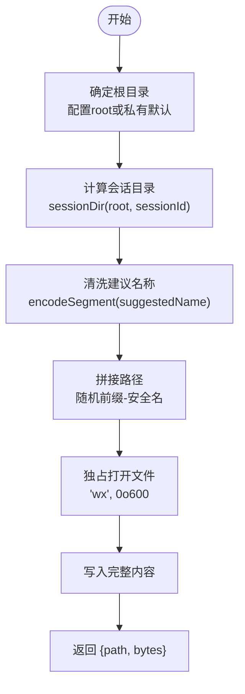
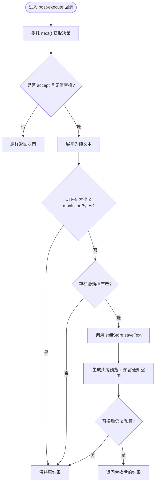
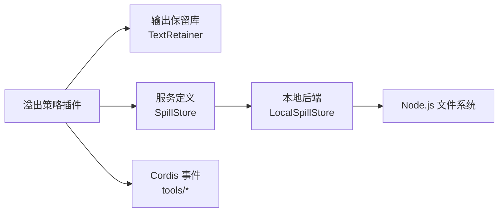

# 溢出存储

<cite>
**本文引用的文件**
- [spill.md](file://docs/subsystems/spill.md)
- [index.ts（服务定义）](file://packages/spill/spill/src/index.ts)
- [types.ts（类型定义）](file://packages/spill/spill/src/types.ts)
- [store.ts（本地文件系统实现核心）](file://packages/spill/spill-local/src/store.ts)
- [index.ts（本地后端插件）](file://packages/spill/spill-local/src/index.ts)
- [index.ts（溢出策略插件）](file://packages/spill/spill-policy/src/index.ts)
- [types.ts（策略类型）](file://packages/spill/spill-policy/src/types.ts)
- [service.spec.ts（服务契约测试）](file://packages/spill/spill/tests/service.spec.ts)
- [spill-local.spec.ts（本地后端测试）](file://packages/spill/spill-local/tests/spill-local.spec.ts)
- [storage.md（存储子系统文档）](file://docs/subsystems/storage.md)
</cite>

## 目录
1. [简介](#简介)
2. [项目结构](#项目结构)
3. [核心组件](#核心组件)
4. [架构总览](#架构总览)
5. [详细组件分析](#详细组件分析)
6. [依赖关系分析](#依赖关系分析)
7. [性能考量](#性能考量)
8. [故障恢复与错误处理](#故障恢复与错误处理)
9. [配置与调优指南](#配置与调优指南)
10. [结论](#结论)

## 简介
溢出存储是 DeepSeek Harness 中用于缓解内存压力、避免将超大文本结果直接放入模型上下文的能力接缝。其设计目标包括：
- 大数据对象临时存储：当工具返回的纯文本结果超过阈值时，将完整内容持久化到会话级隔离的存储位置，并返回一个不透明的“定位器”和检索提示。
- 内存压力缓解：通过仅保留头部/尾部预览与简短通知，控制面向模型的上下文大小。
- 批量数据处理：在日志/回放等场景中对子调用结果进行有界裁剪，同时保留完整数据于溢出文件中，供后续读取或搜索。

本系统由三部分构成：
- 服务定义：抽象接口 SpillStore.saveText，约定“保存全文 + 返回定位器 + 字节数 + 检索提示”。
- 服务提供者：默认基于宿主文件系统的本地后端，提供会话级隔离、安全命名、独占写入等保障。
- 消费者：溢出策略插件，在工具执行后对纯文本结果进行阈值判断、溢出保存与结果替换。

## 项目结构
溢出存储相关代码分布在三个包中：
- dsh-spill：服务定义与类型（抽象类、请求/响应结构）。
- dsh-spill-local：本地文件系统实现（私有根目录、会话子目录、安全文件名、独占写入）。
- dsh-spill-policy：策略插件（监听工具执行事件，决定是否溢出、如何替换结果）。

图表来源
- [index.ts（服务定义）:1-59](file://packages/spill/spill/src/index.ts#L1-L59)
- [index.ts（本地后端插件）:1-66](file://packages/spill/spill-local/src/index.ts#L1-L66)
- [index.ts（策略插件）:1-233](file://packages/spill/spill-policy/src/index.ts#L1-L233)

章节来源
- [spill.md:1-118](file://docs/subsystems/spill.md#L1-L118)

## 核心组件
- SpillStore（抽象服务）：暴露 saveText(input) → Promise<SpillRef>，负责持久化完整内容并返回不透明定位器、精确字节数与检索提示。
- LocalSpillStore（本地后端）：将内容写入会话级隔离目录，生成不可预测且安全的文件名，使用独占模式与所有者权限确保安全性。
- 溢出策略（spill-policy）：在工具执行完成后，若结果为纯文本且超出 maxInlineBytes，则保存全文并替换为“头尾预览 + 通知”，通知中包含定位器与检索提示；同时对持久化日志中的子调用结果做相同裁剪。

关键数据结构：
- SaveTextSpill：包含 owner（会话）、source（工具名、调用ID、标签）、suggestedName（建议名称，会被后端清洗）、content（待保存的完整文本）。
- SpillRef：包含 locator（不透明定位器）、bytes（UTF-8 字节数）、retrievalHint（检索提示）。
- SpillLocator：品牌化的字符串标识，本地后端可渲染为路径，远程/数据库后端可渲染为 URI/键/令牌。

章节来源
- [types.ts:1-74](file://packages/spill/spill/src/types.ts#L1-L74)
- [index.ts（服务定义）:29-59](file://packages/spill/spill/src/index.ts#L29-L59)
- [index.ts（本地后端插件）:21-66](file://packages/spill/spill-local/src/index.ts#L21-L66)
- [index.ts（策略插件）:59-108](file://packages/spill/spill-policy/src/index.ts#L59-L108)

## 架构总览
溢出存储采用“能力接缝”模式：策略插件作为消费者，服务定义作为抽象接口，本地后端作为具体实现。策略插件通过 Cordis 事件钩子介入工具执行生命周期，在不破坏原有成功语义的前提下，对结果进行有界展示与溢出持久化。

图表来源
- [index.ts（策略插件）:190-231](file://packages/spill/spill-policy/src/index.ts#L190-L231)
- [index.ts（本地后端插件）:50-62](file://packages/spill/spill-local/src/index.ts#L50-L62)
- [store.ts:96-121](file://packages/spill/spill-local/src/store.ts#L96-L121)

## 详细组件分析

### 服务定义与类型（dsh-spill）
- 抽象类 SpillStore 继承自 Cordis Service，注册为 ctx.spillStore，每个上下文仅允许一个实现。
- 类型定义明确请求与响应结构，强调定位器对消费者是不透明的，不应被解析；后端需提供合适的检索提示。

图表来源
- [index.ts（服务定义）:29-59](file://packages/spill/spill/src/index.ts#L29-L59)
- [types.ts:13-74](file://packages/spill/spill/src/types.ts#L13-L74)

章节来源
- [index.ts（服务定义）:1-59](file://packages/spill/spill/src/index.ts#L1-L59)
- [types.ts:1-74](file://packages/spill/spill/src/types.ts#L1-L74)
- [service.spec.ts:1-61](file://packages/spill/spill/tests/service.spec.ts#L1-L61)

### 本地文件系统后端（dsh-spill-local）
- 私有根目录：默认使用操作系统临时目录下的私有目录（0700），防止其他用户读取或预植符号链接。
- 会话级目录：按 sessionId 的哈希创建稳定目录，便于分组管理。
- 安全文件名：对 suggestedName 进行注入式编码，确保单段、可逆、无穿越风险；文件名前缀随机十六进制，避免碰撞与预测。
- 独占写入：使用 open(path, 'wx', 0o600)，拒绝已有路径（含符号链接），保证写入安全。

图表来源
- [store.ts:17-30](file://packages/spill/spill-local/src/store.ts#L17-L30)
- [store.ts:48-63](file://packages/spill/spill-local/src/store.ts#L48-L63)
- [store.ts:73-76](file://packages/spill/spill-local/src/store.ts#L73-L76)
- [store.ts:107-121](file://packages/spill/spill-local/src/store.ts#L107-L121)

章节来源
- [store.ts:1-121](file://packages/spill/spill-local/src/store.ts#L1-L121)
- [index.ts（本地后端插件）:1-66](file://packages/spill/spill-local/src/index.ts#L1-L66)
- [spill-local.spec.ts:1-146](file://packages/spill/spill-local/tests/spill-local.spec.ts#L1-L146)

### 溢出策略插件（dsh-spill-policy）
- 触发点：
  - tools/post-execute：对最终结果进行有界替换（跳过 read、嵌套调用、值替换等）。
  - tools/code-dispatch-log：对持久化日志中的子调用结果副本进行同样裁剪，避免日志膨胀。
- 行为要点：
  - 仅对纯文本结果生效；任何非文本块的结果保持不变。
  - 若 UTF-8 大小 ≤ maxInlineBytes，保持不变。
  - 否则保存全文，并替换为“头尾预览 + 通知”，通知中包含定位器与检索提示；整体替换内容严格不超过预算。
  - 最佳努力：若无会话拥有者、未加载后端或保存失败，保持内联结果，绝不将成功调用转为错误。

图表来源
- [index.ts（策略插件）:110-188](file://packages/spill/spill-policy/src/index.ts#L110-L188)
- [index.ts（策略插件）:190-231](file://packages/spill/spill-policy/src/index.ts#L190-L231)

章节来源
- [index.ts（策略插件）:1-233](file://packages/spill/spill-policy/src/index.ts#L1-L233)
- [types.ts（策略类型）:1-27](file://packages/spill/spill-policy/src/types.ts#L1-L27)

## 依赖关系分析
- 策略插件依赖：
  - Cordis 上下文与事件机制（ctx.on('tools/post-execute')、ctx.on('tools/code-dispatch-log')）。
  - 输出保留库（TextRetainer）用于生成头尾预览。
  - 溢出存储服务（ctx.spillStore）用于持久化。
- 本地后端依赖：
  - Node.js 文件系统 API（mkdir、open、writeFile）。
  - 加密模块（randomBytes、createHash）用于安全命名与会话目录。
- 服务定义与类型：
  - 品牌化 ID（Branded）用于定位器类型安全。
  - 会话与调用 ID 类型来自 session 与 llm 包。

图表来源
- [index.ts（策略插件）:46-55](file://packages/spill/spill-policy/src/index.ts#L46-L55)
- [index.ts（本地后端插件）:11-16](file://packages/spill/spill-local/src/index.ts#L11-L16)
- [store.ts:11-15](file://packages/spill/spill-local/src/store.ts#L11-L15)

章节来源
- [index.ts（策略插件）:46-55](file://packages/spill/spill-policy/src/index.ts#L46-L55)
- [index.ts（本地后端插件）:11-16](file://packages/spill/spill-local/src/index.ts#L11-L16)
- [store.ts:11-15](file://packages/spill/spill-local/src/store.ts#L11-L15)

## 性能考量
- 内存占用控制：策略插件通过 head/tail 预览与通知，确保面向模型的结果不超过 maxInlineBytes，避免上下文爆炸。
- I/O 开销：本地后端使用一次性写入与独占打开，减少并发竞争与路径遍历风险；会话级目录隔离降低锁竞争。
- 日志裁剪：对持久化日志中的子调用结果也进行裁剪，避免日志体积过大影响回放与 UI 渲染。
- 可扩展性：服务定义解耦了存储介质，未来可替换为远程或数据库后端而不影响策略逻辑。

[本节为通用指导，无需特定文件引用]

## 故障恢复与错误处理
- 保存失败降级：策略插件捕获 saveText 异常，记录警告并回退到内联结果，确保工具调用成功语义不被破坏。
- 权限/空间不足：本地后端在 mkdir/open/write 失败时抛出异常，策略层将其视为最佳努力失败，不影响主流程。
- 无会话/无后端：若缺少会话拥有者或未加载后端，策略直接保持内联结果并记录警告。
- 安全边界：文件名清洗与独占写入防止路径穿越与符号链接攻击；私有根目录限制访问范围。

章节来源
- [index.ts（策略插件）:154-161](file://packages/spill/spill-policy/src/index.ts#L154-L161)
- [index.ts（策略插件）:138-146](file://packages/spill/spill-policy/src/index.ts#L138-L146)
- [store.ts:107-121](file://packages/spill/spill-local/src/store.ts#L107-L121)
- [spill-local.spec.ts:138-146](file://packages/spill/spill-local/tests/spill-local.spec.ts#L138-L146)

## 配置与调优指南
- 策略配置（maxInlineBytes）：
  - 设置为非负整数，表示面向模型结果的 UTF-8 字节上限。
  - 省略该配置时，策略插件不注册任何监听器，成为真正的 no-op。
  - 配置校验在加载时进行，避免运行时因非法配置导致工具调用失败。
- 本地后端配置（root）：
  - 可选 root 指定溢出文件根目录；未设置时使用 OS 临时目录下的私有目录（0700）。
  - 相对路径会被解析为绝对路径，便于调试与清理。
- 调优建议：
  - 根据模型上下文窗口与典型工具输出规模调整 maxInlineBytes，平衡预览可读性与上下文占用。
  - 在高并发环境下，确保 root 所在磁盘具备足够 IOPS 与剩余空间，避免 ENOSPC。
  - 定期清理会话目录（由上层生命周期或运维脚本负责），避免长期积累占用磁盘。

章节来源
- [index.ts（策略插件）:59-77](file://packages/spill/spill-policy/src/index.ts#L59-L77)
- [index.ts（策略插件）:110-119](file://packages/spill/spill-policy/src/index.ts#L110-L119)
- [index.ts（本地后端插件）:21-48](file://packages/spill/spill-local/src/index.ts#L21-L48)

## 结论
溢出存储通过清晰的能力接缝设计，将“何时溢出”“如何展示”“如何持久化”解耦，既保障了工具调用的成功语义，又有效控制了内存与上下文占用。本地后端提供了安全、隔离、高效的文件存储实现；策略插件确保了结果的可控呈现与日志裁剪。开发者可通过合理配置 maxInlineBytes 与 root，结合会话生命周期管理，获得稳定且高性能的溢出存储体验。

[本节为总结性内容，无需特定文件引用]