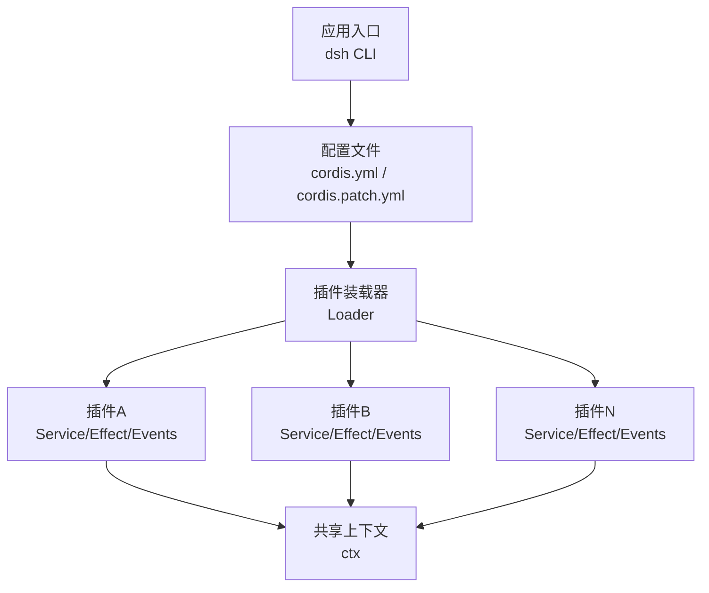
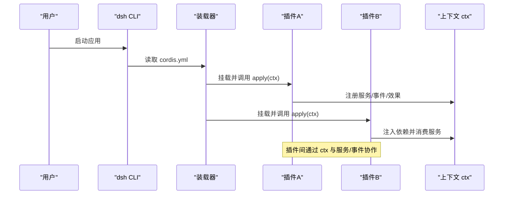
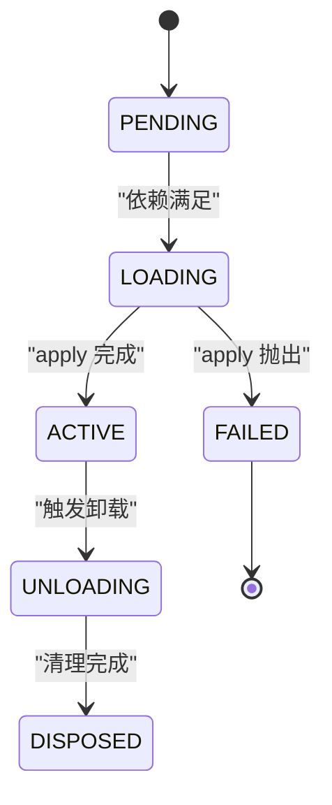
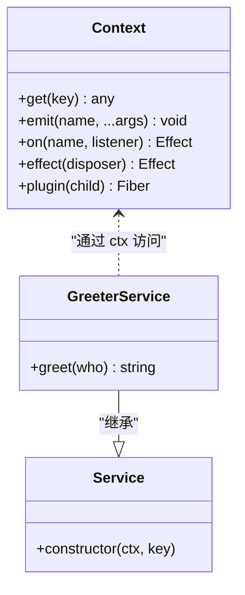
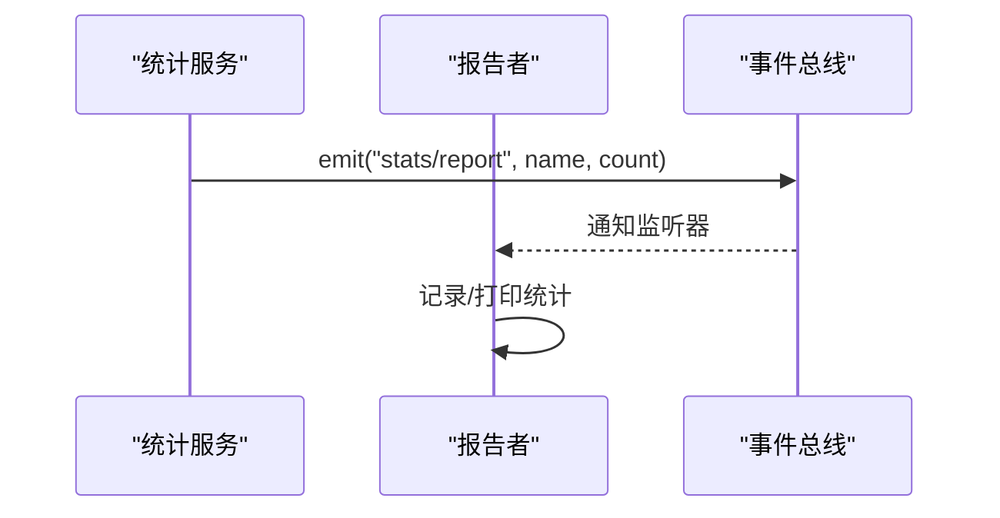
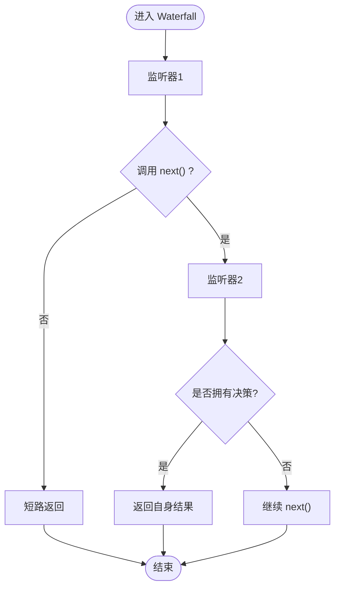
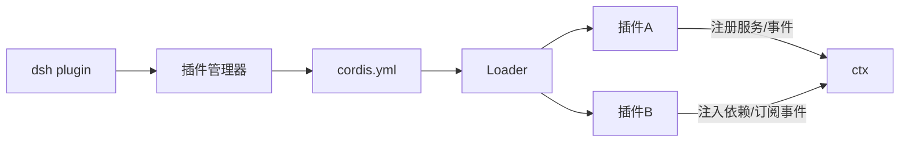

# Cordis 插件框架

<cite>
**本文引用的文件**
- [Cordis 入门](file://docs/cordis-primer.md)
- [架构总览](file://docs/architecture.md)
- [教程：第一个插件](file://docs/cordis-tutorial/01-first-plugin.md)
- [教程：生命周期与效果](file://docs/cordis-tutorial/02-lifecycle-and-effects.md)
- [教程：服务](file://docs/cordis-tutorial/03-services.md)
- [教程：事件](file://docs/cordis-tutorial/04-events.md)
- [CLI 插件管理](file://apps/cli/src/plugin.ts)
</cite>

## 目录
1. [简介](#简介)
2. [项目结构](#项目结构)
3. [核心组件](#核心组件)
4. [架构总览](#架构总览)
5. [详细组件分析](#详细组件分析)
6. [依赖关系分析](#依赖关系分析)
7. [性能考量](#性能考量)
8. [故障排查指南](#故障排查指南)
9. [结论](#结论)
10. [附录](#附录)

## 简介
本文件面向希望基于 Cordis 构建或扩展 DeepSeek Harness 的开发者，系统阐述“一切皆插件”的设计思想与实现机制。内容覆盖插件生命周期（加载、初始化、运行、卸载）、服务注册与发现（通过 ctx 上下文）、事件系统（定义、发布、订阅与分发模式）、可逆效果（reversible effects）的概念与实践、插件间依赖管理与版本兼容性处理，以及插件开发的最佳实践与常见模式。文中所有技术细节均来源于仓库中的文档与源码片段，并辅以图示帮助理解。

## 项目结构
Cordis 是 DeepSeek Harness 内部的插件框架，产品能力以插件形式贡献到共享上下文中；模型适配器、工具注册表、会话日志、Agent 循环等均为插件，均可通过配置替换。运行时的 dsh 由有序层组成的插件树在启动时装配，包含 profile 与 bundle 的组合与补丁机制。

图表来源
- [架构总览:9-27](file://docs/architecture.md#L9-L27)
- [教程：第一个插件:23-51](file://docs/cordis-tutorial/01-first-plugin.md#L23-L51)

章节来源
- [架构总览:9-27](file://docs/architecture.md#L9-L27)
- [教程：第一个插件:23-51](file://docs/cordis-tutorial/01-first-plugin.md#L23-L51)

## 核心组件
- 插件（Plugin）：函数、对象或类三种形态，统一通过 apply(ctx) 暴露行为。
- 上下文（Context）：服务的容器，提供键式访问（如 ctx.tools、ctx.llm、ctx.agents）。
- 服务（Service）：声明稳定键的能力提供者，消费者通过 inject 声明依赖。
- 事件（Events）：类型化事件，支持 emit、parallel、serial、bail、waterfall 等分发模式。
- 效果（Effects）：可逆注册，随插件卸载自动回滚（定时器、监听器、工具注册等）。
- Fiber：每个插件实例的生命周期句柄，状态机驱动加载与卸载。

章节来源
- [Cordis 入门:7-13](file://docs/cordis-primer.md#L7-L13)
- [教程：生命周期与效果:67-94](file://docs/cordis-tutorial/02-lifecycle-and-effects.md#L67-L94)
- [教程：服务:5-94](file://docs/cordis-tutorial/03-services.md#L5-L94)
- [教程：事件:7-92](file://docs/cordis-tutorial/04-events.md#L7-L92)

## 架构总览
Cordis 将“一切皆插件”贯彻到底：任何能力都通过插件贡献到共享上下文，并通过事件进行解耦通信。Profile 与 Bundle 构成分层装配机制，允许按序叠加与补丁替换，从而在不侵入核心代码的前提下定制运行时行为。

图表来源
- [教程：第一个插件:45-51](file://docs/cordis-tutorial/01-first-plugin.md#L45-L51)
- [教程：服务:44-78](file://docs/cordis-tutorial/03-services.md#L44-L78)
- [教程：事件:7-92](file://docs/cordis-tutorial/04-events.md#L7-L92)

章节来源
- [架构总览:9-27](file://docs/architecture.md#L9-L27)
- [教程：第一个插件:45-51](file://docs/cordis-tutorial/01-first-plugin.md#L45-L51)

## 详细组件分析

### 插件生命周期与 Fiber 状态机
- 生命周期阶段：PENDING → LOADING → ACTIVE → UNLOADING → DISPOSED，异常路径进入 FAILED。
- 资源管理：通过 ctx.effect() 包装外部资源，返回清理函数；卸载时按逆序并发执行异步清理。
- 子插件：ctx.plugin(child) 返回 fiber，可显式 dispose；父插件卸载会递归卸载子插件。

图表来源
- [教程：生命周期与效果:67-94](file://docs/cordis-tutorial/02-lifecycle-and-effects.md#L67-L94)

章节来源
- [教程：生命周期与效果:6-94](file://docs/cordis-tutorial/02-lifecycle-and-effects.md#L6-L94)

### 服务注册与发现（ctx 上下文）
- 提供服务：继承 Service 并在构造函数中注册键名；通过 TypeScript 声明合并为 Context 添加类型。
- 消费服务：使用 inject 声明强依赖，保证 apply 内可用；也可用 ctx.get('key') 获取可选依赖。
- 动态替换：当提供者卸载或被热替换，依赖它的插件也会卸载并重新加载，避免悬空引用。

图表来源
- [教程：服务:7-94](file://docs/cordis-tutorial/03-services.md#L7-L94)

章节来源
- [教程：服务:7-94](file://docs/cordis-tutorial/03-services.md#L7-L94)

### 事件系统：定义、发布与订阅
- 事件定义：通过接口合并 Events 声明事件名与监听器签名，确保类型安全。
- 发布模式：
  - emit：同步广播，不收集返回值。
  - parallel：并行等待所有监听器。
  - serial：顺序执行，首个非空结果短路。
  - bail：同步版 serial。
  - waterfall：中间件风格，支持 next() 委派与短路。
- 订阅：ctx.on(event, listener) 本身是可逆效果，插件卸载自动移除监听器。

图表来源
- [教程：事件:7-78](file://docs/cordis-tutorial/04-events.md#L7-L78)

章节来源
- [教程：事件:7-92](file://docs/cordis-tutorial/04-events.md#L7-L92)

### Waterfall 中间件与拦截
- 语义：监听器接收参数与 next()，可转换下游结果或不调用 next() 进行短路（否决）。
- 规则：仅观察或标注的监听器必须调用 next()；否则下游默认行为被吞掉。
- 典型用途：agent/request、approval/request 等决策点，允许策略插件接管或增强。

图表来源
- [教程：事件:94-140](file://docs/cordis-tutorial/04-events.md#L94-L140)
- [Cordis 入门:28-35](file://docs/cordis-primer.md#L28-L35)

章节来源
- [教程：事件:94-140](file://docs/cordis-tutorial/04-events.md#L94-L140)
- [Cordis 入门:28-35](file://docs/cordis-primer.md#L28-L35)

### 可逆效果（Reversible Effects）
- 概念：所有通过 Cordis API 的注册都是效果，随插件卸载自动回滚。
- 适用场景：定时器、连接、文件系统监听、工具注册、事件监听器等。
- 注意事项：多个异步清理器并发执行；若需严格顺序，应在同一 disposer 内串行 await。

章节来源
- [教程：生命周期与效果:6-94](file://docs/cordis-tutorial/02-lifecycle-and-effects.md#L6-L94)
- [Cordis 入门:13-13](file://docs/cordis-primer.md#L13-L13)

### 插件依赖管理与版本兼容
- 依赖声明：inject 列出强依赖，未满足则保持 PENDING，直到依赖就绪。
- 动态重连：提供者卸载/热替换导致依赖方卸载并重建，避免悬空引用。
- 组合与补丁：Profile/Bundles 按序叠加，patch 可替换行或插入新行；依赖解析到声明 dsh.bundle 的包即加入层栈。
- 版本兼容：更新后若某依赖新增 dsh.bundle 声明，将在下一次 reconcile 自动激活；无声明则视为普通库。

章节来源
- [教程：服务:74-78](file://docs/cordis-tutorial/03-services.md#L74-L78)
- [架构总览:15-27](file://docs/architecture.md#L15-L27)
- [CLI 插件管理:30-91](file://apps/cli/src/plugin.ts#L30-L91)

### 插件开发与集成最佳实践
- 优先使用事件进行拦截与策略，直接能力调用优先走服务方法。
- 每个注册都应具备清理逻辑（effect 或返回 disposer），复杂清理在同一 effect 内串行。
- 通过声明合并为 Context 与 Events 添加类型，提升可维护性。
- 使用 ctx.waterfall 时遵循“观察者必须调用 next()”的规则。
- 通过 Profile/Bundles 与 patch 组织能力，避免硬编码核心。

章节来源
- [Cordis 入门:40-44](file://docs/cordis-primer.md#L40-L44)
- [教程：生命周期与效果:84-94](file://docs/cordis-tutorial/02-lifecycle-and-effects.md#L84-L94)
- [教程：事件:94-140](file://docs/cordis-tutorial/04-events.md#L94-L140)

## 依赖关系分析
- 插件之间通过 ctx 的服务键与事件名耦合，降低直接导入带来的紧耦合。
- Loader 负责解析 cordis.yml 条目并挂载插件，按依赖关系决定启动时机。
- CLI 插件管理负责 profile 初始化、pnpm 转发与 bundles 层列表的 reconcile。

图表来源
- [教程：第一个插件:23-51](file://docs/cordis-tutorial/01-first-plugin.md#L23-L51)
- [CLI 插件管理:120-157](file://apps/cli/src/plugin.ts#L120-L157)

章节来源
- [教程：第一个插件:23-51](file://docs/cordis-tutorial/01-first-plugin.md#L23-L51)
- [CLI 插件管理:120-157](file://apps/cli/src/plugin.ts#L120-L157)

## 性能考量
- 事件分发选择：
  - emit 适合轻量广播，不阻塞。
  - parallel 适合独立副作用的并行执行。
  - serial/bail 适合决策型流水线，尽早短路。
  - waterfall 适合需要中间件能力的拦截链。
- 清理器并发：多个异步清理器并发执行，如需顺序请合并至单一 disposer。
- 依赖就绪：PENDING 状态不会持有事件循环，避免无意义的阻塞。

[本节为通用指导，不直接分析具体文件]

## 故障排查指南
- 插件无输出：检查是否为 PENDING（缺少依赖）或模块解析失败（拼写错误）。
- 热重载/卸载：确认所有注册均为 effect，确保清理器正确释放资源。
- CLI 插件安装失败：查看 pnpm 工作区 allowBuilds 白名单与 git 依赖 prepare 脚本限制。
- 依赖变更未生效：确认依赖是否声明 dsh.bundle；必要时重新 reconcile。

章节来源
- [教程：第一个插件:79-92](file://docs/cordis-tutorial/01-first-plugin.md#L79-L92)
- [教程：生命周期与效果:67-94](file://docs/cordis-tutorial/02-lifecycle-and-effects.md#L67-L94)
- [CLI 插件管理:142-157](file://apps/cli/src/plugin.ts#L142-L157)

## 结论
Cordis 通过“一切皆插件”的理念，将服务、事件、效果与生命周期统一管理于共享上下文与 Fiber 状态机中，配合 Profile/Bundles 的分层装配与补丁机制，实现了高度可插拔、可替换、可观测的产品架构。遵循本文的实践与规范，可以高效地开发、集成与维护插件，同时保证系统的稳定性与可演进性。

[本节为总结性内容，不直接分析具体文件]

## 附录
- 快速上手：参考教程系列从“第一个插件”到“事件”逐步掌握 Cordis 的核心用法。
- 架构参考：阅读架构总览了解 dsh 的组成与扩展点映射。
- 命令行工具：使用 dsh plugin 管理 profile 与 bundles，自动化层列表 reconcile。

章节来源
- [教程：第一个插件:23-51](file://docs/cordis-tutorial/01-first-plugin.md#L23-L51)
- [教程：事件:7-92](file://docs/cordis-tutorial/04-events.md#L7-L92)
- [架构总览:15-27](file://docs/architecture.md#L15-L27)
- [CLI 插件管理:120-157](file://apps/cli/src/plugin.ts#L120-L157)