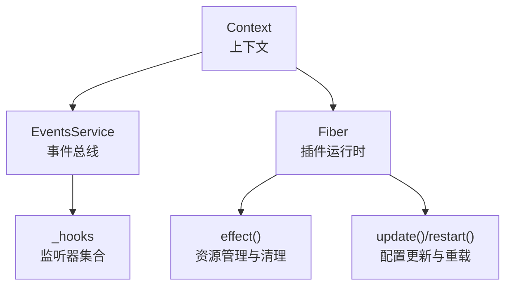
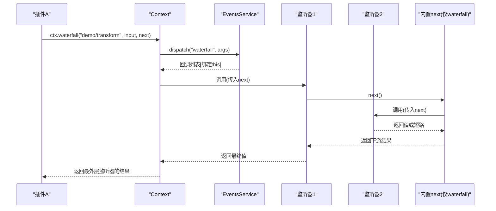
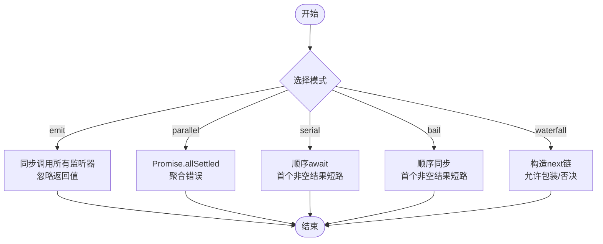
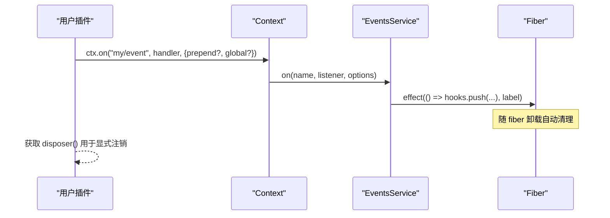
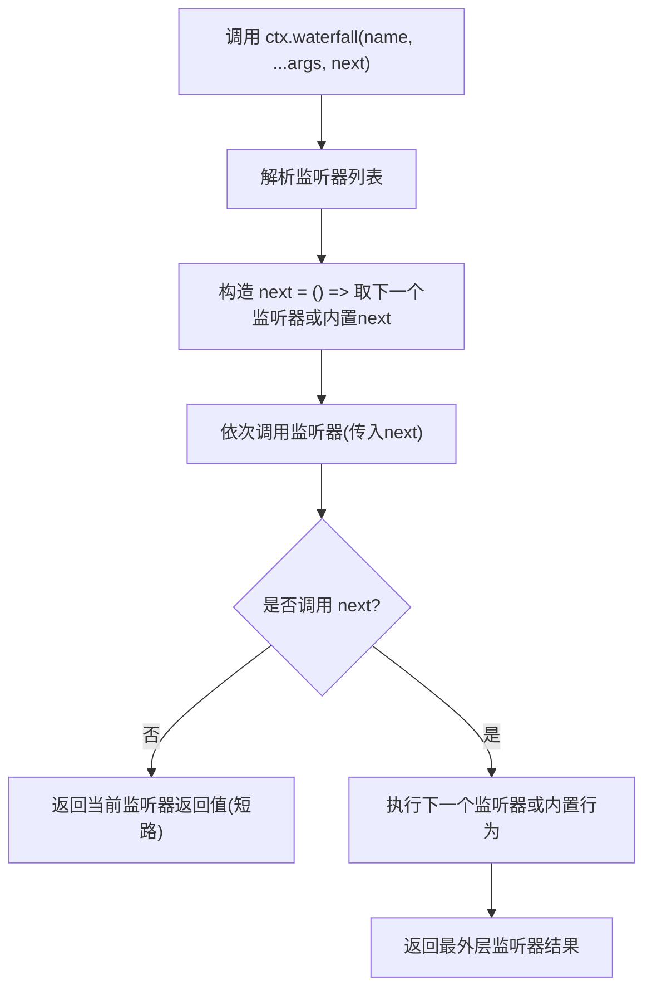
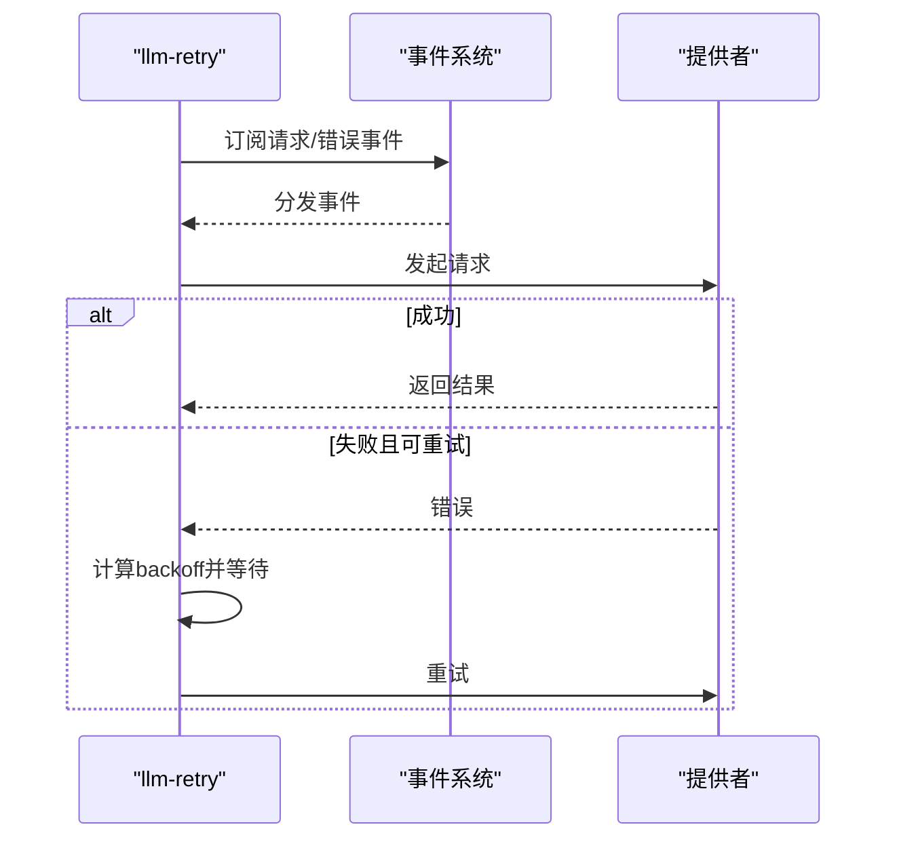
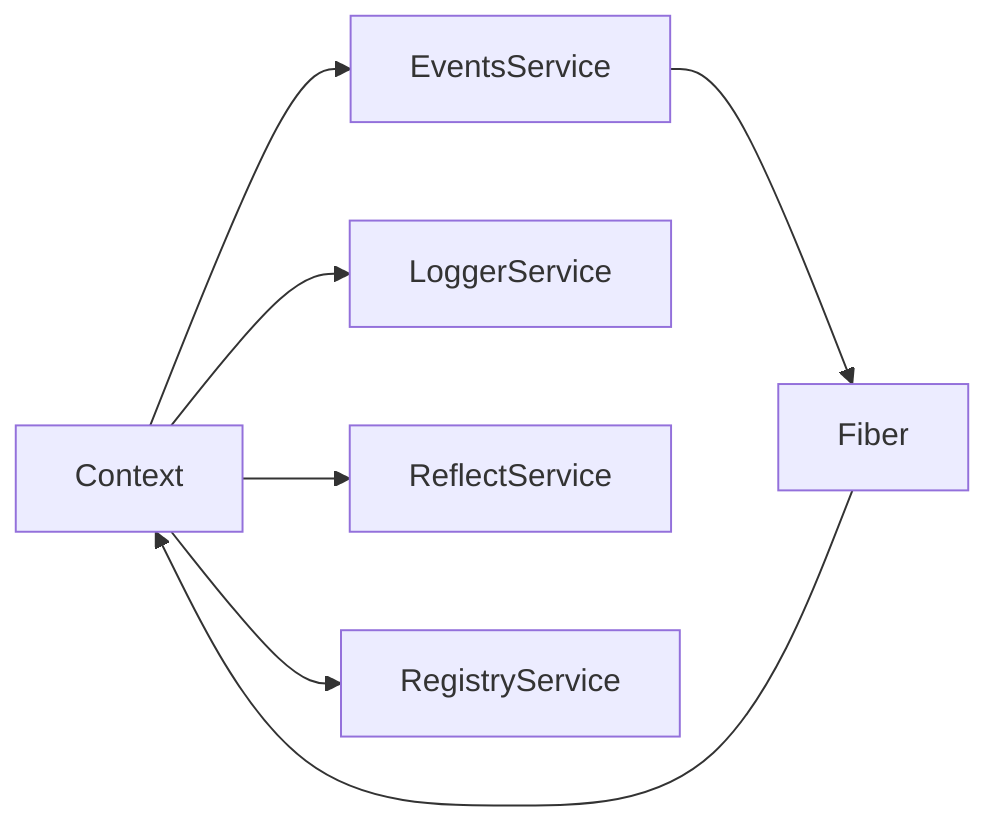

# 事件系统

<cite>
**本文引用的文件**
- [events.ts](file://vendor/cordis/src/events.ts)
- [context.ts](file://vendor/cordis/src/context.ts)
- [fiber.ts](file://vendor/cordis/src/fiber.ts)
- [events.md](file://docs/cordis-api/events.md)
- [events.zh.md](file://docs/cordis-api/events.zh.md)
- [04-events.md](file://docs/cordis-tutorial/04-events.md)
- [event-producer-consumer.md](file://docs/event-producer-consumer.md)
- [dispatch.ts](file://packages/core/agent/src/dispatch.ts)
</cite>

## 目录
1. [简介](#简介)
2. [项目结构](#项目结构)
3. [核心组件](#核心组件)
4. [架构总览](#架构总览)
5. [详细组件分析](#详细组件分析)
6. [依赖关系分析](#依赖关系分析)
7. [性能考虑](#性能考虑)
8. [故障排查指南](#故障排查指南)
9. [结论](#结论)
10. [附录](#附录)

## 简介
本文件系统性阐述 Cordis 事件系统的设计与实现，覆盖类型化事件、TypeScript 声明合并、五种分发模式（emit、parallel、serial、bail、waterfall）、发布订阅机制（注册与注销）、水流水文中间件模式、优先级控制与短路机制、错误处理与重试策略，以及设计原则与性能考量。文档同时提供代码级图示与示例路径，帮助读者快速理解并正确使用事件系统。

## 项目结构
Cordis 事件系统的核心位于 vendor/cordis/src 下，围绕 Context、Fiber、EventsService 构建：
- Context：上下文对象，混入事件 API（ctx.emit/parallel/serial/bail/waterfall/on/once），并提供服务隔离、拦截等能力。
- Fiber：插件运行时的生命周期容器，负责 effect 管理、配置更新、状态转换与清理。
- EventsService：事件总线，维护监听器列表、分发逻辑、过滤与选项（prepend/global）。

**图表来源**
- [context.ts:70-84](file://vendor/cordis/src/context.ts#L70-L84)
- [events.ts:131-156](file://vendor/cordis/src/events.ts#L131-L156)
- [fiber.ts:222-333](file://vendor/cordis/src/fiber.ts#L222-L333)

**章节来源**
- [context.ts:70-84](file://vendor/cordis/src/context.ts#L70-L84)
- [events.ts:131-156](file://vendor/cordis/src/events.ts#L131-L156)
- [fiber.ts:222-333](file://vendor/cordis/src/fiber.ts#L222-L333)

## 核心组件
- 事件总线 EventsService：提供 parallel/emit/serial/bail/waterfall 五种分发方式；维护 _hooks 映射；支持 prepend/global 选项；通过 internal/listener 与 internal/update 等内部事件扩展行为。
- 上下文 Context：注入 events、logger、reflect、registry；通过 Proxy 暴露 get/provide 等服务访问；支持 isolate/intercept 创建子上下文。
- 插件运行时 Fiber：管理 effect、配置校验与更新、状态机（PENDING/LOADING/ACTIVE/FAILED/UNLOADING/DISPOSED）；在 unload 时按逆序执行清理。

**章节来源**
- [events.ts:131-319](file://vendor/cordis/src/events.ts#L131-L319)
- [context.ts:42-147](file://vendor/cordis/src/context.ts#L42-L147)
- [fiber.ts:147-174](file://vendor/cordis/src/fiber.ts#L147-L174)
- [fiber.ts:184-333](file://vendor/cordis/src/fiber.ts#L184-L333)

## 架构总览
事件系统以 Context 为入口，EventsService 为核心调度器，Fiber 作为生命周期与 effect 载体。事件分发前会进行上下文过滤（Context.filter），并根据模式选择不同执行策略。Waterfall 模式将最后一个参数视为 next 续接，形成可插拔的中间件链。

**图表来源**
- [events.ts:234-243](file://vendor/cordis/src/events.ts#L234-L243)
- [events.ts:165-175](file://vendor/cordis/src/events.ts#L165-L175)

**章节来源**
- [events.ts:165-175](file://vendor/cordis/src/events.ts#L165-L175)
- [events.ts:234-243](file://vendor/cordis/src/events.ts#L234-L243)

## 详细组件分析

### 类型化事件与 TypeScript 声明合并
- 通过 declare module './context.ts' 将事件方法（parallel/emit/serial/bail/waterfall/on/once）混入 Context 接口，使 ctx.* 具备强类型推断。
- 通过 declare module '@deepseek-ai/cordis' 中的 interface Events 声明事件名与监听器签名，确保 emit/on 的类型安全。
- 教程中展示了如何在插件内声明事件并通过 import type {} 引入以触发声明合并，获得完整的类型提示。

**章节来源**
- [events.ts:34-109](file://vendor/cordis/src/events.ts#L34-L109)
- [04-events.md:11-44](file://docs/cordis-tutorial/04-events.md#L11-L44)
- [events.zh.md:127-173](file://docs/cordis-api/events.zh.md#L127-L173)

### 五种分发模式与使用场景
- emit：同步广播，忽略返回值与 Promise，适合“通知型”事件。
- parallel：并发执行所有监听器，统一等待完成；若存在拒绝则聚合抛出 AggregateError。
- serial：顺序等待监听器，遇到第一个“提前终止值”（非 null/false/undefined）即停止。
- bail：serial 的同步版本，立即短路。
- waterfall：最后一个参数为 next 续接，监听器可包装下游结果或不调用 next 进行否决（veto）。

**图表来源**
- [events.ts:183-243](file://vendor/cordis/src/events.ts#L183-L243)
- [events.md:8-123](file://docs/cordis-api/events.md#L8-L123)

**章节来源**
- [events.ts:183-243](file://vendor/cordis/src/events.ts#L183-L243)
- [events.md:8-123](file://docs/cordis-api/events.md#L8-L123)
- [events.zh.md:10-125](file://docs/cordis-api/events.zh.md#L10-L125)

### 发布与订阅机制（注册与注销）
- 注册：ctx.on(name, listener, options?) 将监听器注册到当前 fiber 的 effect 中，支持 prepend（插入头部）与 global（绕过上下文过滤）。
- 一次性：ctx.once 在首次调用后自动注销。
- 注销：on/once 返回 disposer，可在需要时显式移除；当 fiber 卸载时，所有 effect 按逆序清理，无需手动维护 removeListener。
- 过滤器：dispatch 时会读取 thisArg[Context.filter] 决定是否放行该监听器；global: true 可无视过滤。

**图表来源**
- [events.ts:288-318](file://vendor/cordis/src/events.ts#L288-L318)
- [fiber.ts:415-561](file://vendor/cordis/src/fiber.ts#L415-L561)

**章节来源**
- [events.ts:288-318](file://vendor/cordis/src/events.ts#L288-L318)
- [fiber.ts:415-561](file://vendor/cordis/src/fiber.ts#L415-L561)

### 水流水文（waterfall）中间件模式
- 每个监听器接收原参数与一个 next 续接函数；调用 next 表示继续下游，不调用则表示否决（veto）。
- 典型用途：请求拦截、结果转换、策略决策（如审批、工具执行前后钩子）。
- 注意事项：只观察或标注的监听器必须调用 next，否则会静默吞掉默认行为。

**图表来源**
- [events.ts:234-243](file://vendor/cordis/src/events.ts#L234-L243)
- [04-events.md:94-140](file://docs/cordis-tutorial/04-events.md#L94-L140)

**章节来源**
- [events.ts:234-243](file://vendor/cordis/src/events.ts#L234-L243)
- [04-events.md:94-140](file://docs/cordis-tutorial/04-events.md#L94-L140)

### 优先级控制与短路机制
- 优先级：通过 EventOptions.prepend 控制监听器插入位置（头部优先）。
- 短路：
  - serial/bail：遇到 isBailed(result)（非 null/false/undefined）即停止后续监听器。
  - waterfall：监听器不调用 next 即否决后续链。
- 上下文过滤：Context.filter 可在分发时决定哪些监听器被调用；global: true 可绕过过滤。

**章节来源**
- [events.ts:112-117](file://vendor/cordis/src/events.ts#L112-L117)
- [events.ts:13-15](file://vendor/cordis/src/events.ts#L13-L15)
- [events.ts:165-175](file://vendor/cordis/src/events.ts#L165-L175)
- [events.ts:204-222](file://vendor/cordis/src/events.ts#L204-L222)

### 错误处理与重试策略
- 并行错误聚合：parallel 使用 Promise.allSettled 收集拒绝原因，并在有错误时抛出 AggregateError。
- 代理层容错：Agent 的事件封装对 emit 的异常进行捕获并记录日志，避免单个监听器失败影响整体。
- 重试策略：llm-retry 包基于事件与 AbortController 实现可取消的重试，结合 backoff 策略（初始延迟、最大延迟、抖动比例）与可重试错误码。

**图表来源**
- [events.ts:183-187](file://vendor/cordis/src/events.ts#L183-L187)
- [dispatch.ts:117-149](file://packages/core/agent/src/dispatch.ts#L117-L149)
- [retry-policy.ts:105-156](file://packages/llm/llm/src/retry-policy.ts#L105-L156)

**章节来源**
- [events.ts:183-187](file://vendor/cordis/src/events.ts#L183-L187)
- [dispatch.ts:117-149](file://packages/core/agent/src/dispatch.ts#L117-L149)
- [retry-policy.ts:105-156](file://packages/llm/llm/src/retry-policy.ts#L105-L156)

### 代码示例与使用模式
- 声明与监听：在插件中通过 declare module 扩展 Events，使用 ctx.emit 发出事件，其他插件通过 ctx.on 订阅。
- 瀑布式转换：定义 demo/transform 事件，监听器可转换下游结果或根据条件短路。
- 参考示例路径：
  - 教程示例：stats/report 事件的声明与监听、waterfall 演示。
  - API 文档：各分发模式的类型签名与说明。

**章节来源**
- [04-events.md:11-44](file://docs/cordis-tutorial/04-events.md#L11-L44)
- [04-events.md:98-127](file://docs/cordis-tutorial/04-events.md#L98-L127)
- [events.zh.md:10-125](file://docs/cordis-api/events.zh.md#L10-L125)

## 依赖关系分析
- Context 依赖 EventsService、LoggerService、ReflectService、RegistryService，并在构造函数中初始化这些服务。
- EventsService 依赖 Context、Fiber、utils（DisposableList/symbols）以实现监听器存储与 effect 绑定。
- Fiber 通过 context.waterfall('internal/config') 与 context.waterfall('internal/update') 参与配置与更新流程。

**图表来源**
- [context.ts:70-84](file://vendor/cordis/src/context.ts#L70-L84)
- [events.ts:131-156](file://vendor/cordis/src/events.ts#L131-L156)
- [fiber.ts:641-644](file://vendor/cordis/src/fiber.ts#L641-L644)

**章节来源**
- [context.ts:70-84](file://vendor/cordis/src/context.ts#L70-L84)
- [events.ts:131-156](file://vendor/cordis/src/events.ts#L131-L156)
- [fiber.ts:641-644](file://vendor/cordis/src/fiber.ts#L641-L644)

## 性能考虑
- 并发 vs 串行：parallel 适合无副作用或副作用独立的监听器；serial/bail 适合需要顺序控制或短路决策的场景。
- 过滤开销：大量监听器时，Context.filter 会在每次分发时评估，建议合理组织监听器与使用 global 标记减少不必要过滤。
- 错误聚合：parallel 的错误聚合可能带来额外开销，仅在必要时使用。
- Waterfall 链深度：过深的 waterfall 链会增加调用栈与内存占用，应控制链长度与复杂度。
- Effect 清理：Fiber 卸载时按逆序清理，避免长时间异步清理阻塞卸载过程。

[本节为通用指导，不直接分析具体文件]

## 故障排查指南
- 监听器未触发：检查事件名称、上下文过滤（Context.filter）与 global 选项；确认监听器已注册在当前 fiber 的 effect 中。
- 短路不符合预期：确认使用的是 serial/bail 或 waterfall 的正确语义；检查返回值是否为“提前终止值”。
- 并行错误：查看 AggregateError 的原因数组，定位失败的监听器。
- 配置更新失败：检查 internal/config 与 internal/update 的 waterfall 链是否被 veto 或抛出异常。
- 插件卸载问题：确认 effect 正确返回 disposer，避免内存泄漏。

**章节来源**
- [events.ts:165-175](file://vendor/cordis/src/events.ts#L165-L175)
- [events.ts:183-187](file://vendor/cordis/src/events.ts#L183-L187)
- [fiber.ts:736-753](file://vendor/cordis/src/fiber.ts#L736-L753)

## 结论
Cordis 事件系统通过类型化事件与声明合并提供强类型保障，配合五种分发模式满足从通知到决策的多样化交互需求。Waterfall 模式提供了灵活的中间件能力，结合优先级与短路机制可实现精细的控制流。借助 Fiber 的 effect 管理，监听器的生命周期与资源清理得到自动化保障。在生产环境中，应根据场景选择合适的分发模式，并注意过滤、错误聚合与链深度对性能的影响。

[本节为总结性内容，不直接分析具体文件]

## 附录
- 事件矩阵：生产者和消费者关系见事件矩阵文档，便于理解各子系统间的事件耦合。
- 教程与 API 文档：提供完整的使用示例与类型签名，便于快速上手。

**章节来源**
- [event-producer-consumer.md:8-66](file://docs/event-producer-consumer.md#L8-L66)
- [events.md:8-123](file://docs/cordis-api/events.md#L8-L123)
- [events.zh.md:10-125](file://docs/cordis-api/events.zh.md#L10-L125)