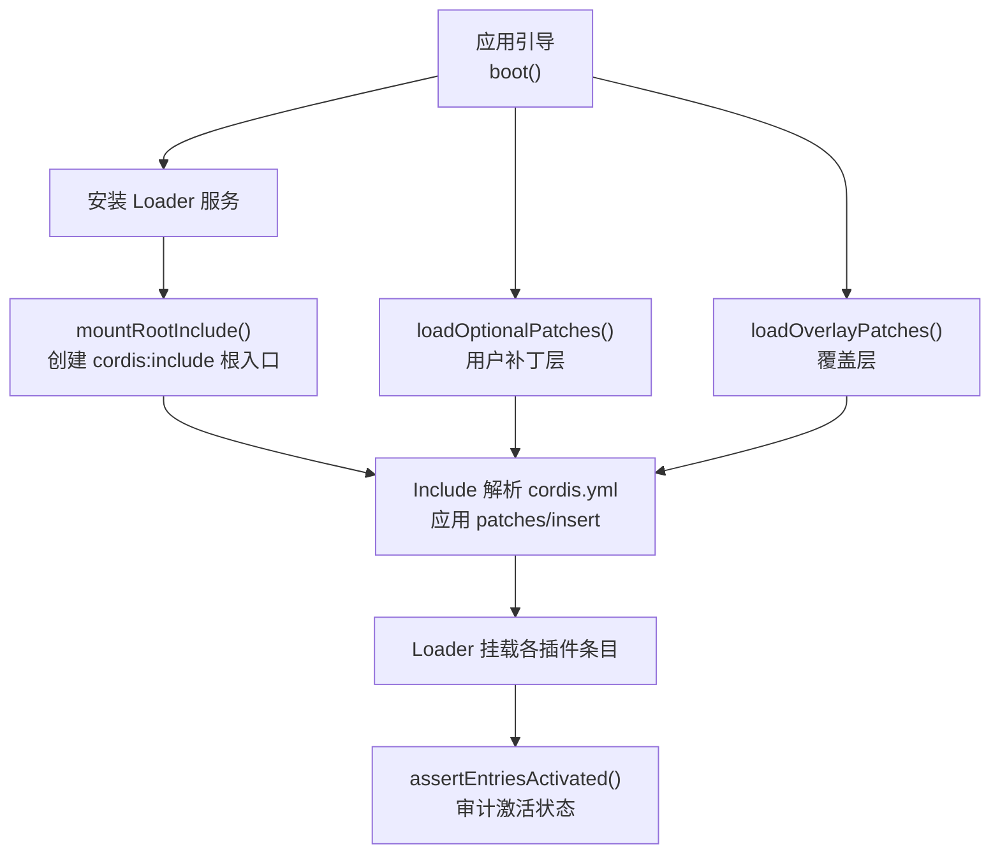
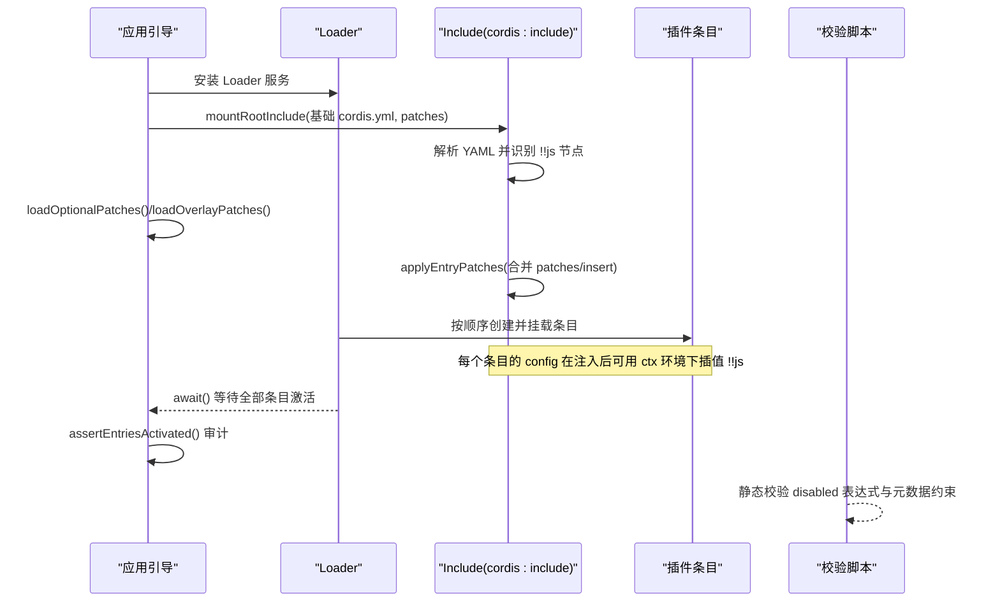
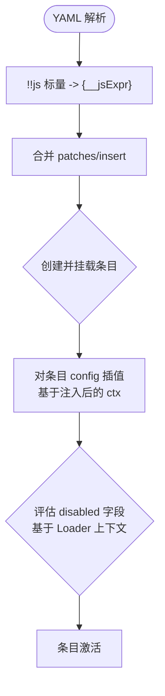
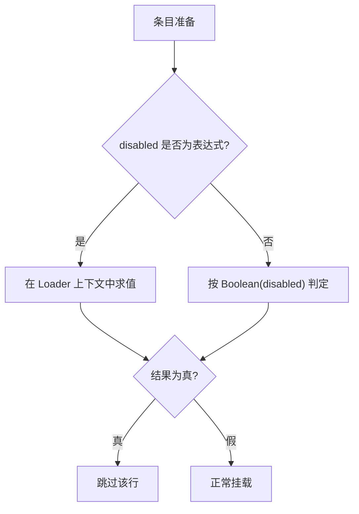
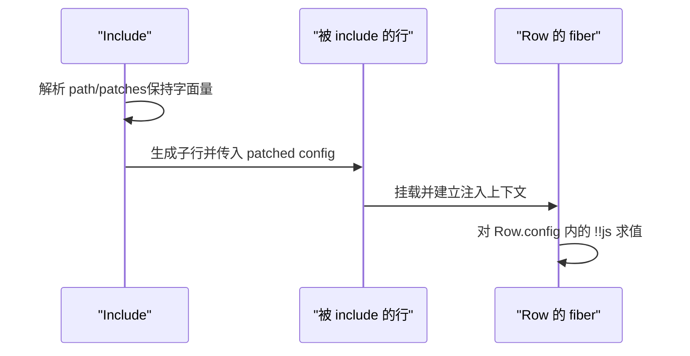
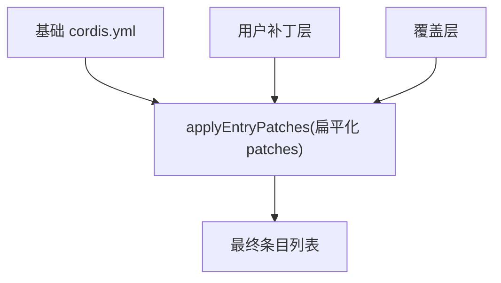
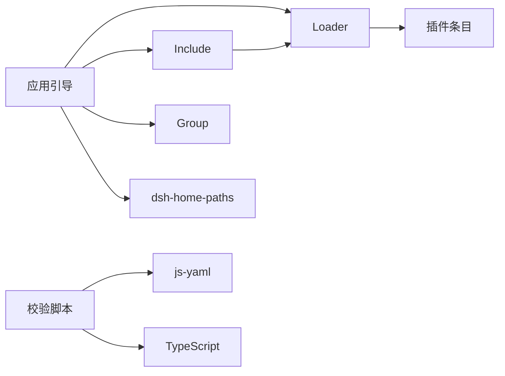

# 加载器配置

<cite>
**本文引用的文件**
- [packages/boot/app-boot/src/index.ts](file://packages/boot/app-boot/src/index.ts)
- [scripts/verify-cordis-config.ts](file://scripts/verify-cordis-config.ts)
- [packages/boot/app-boot/tests/user-patches.spec.ts](file://packages/boot/app-boot/tests/user-patches.spec.ts)
- [apps/cli/tests/windows-shell.spec.ts](file://apps/cli/tests/windows-shell.spec.ts)
- [packages/boot/app-boot/tests/config-dump.spec.ts](file://packages/boot/app-boot/tests/config-dump.spec.ts)
</cite>

## 目录
1. [简介](#简介)
2. [项目结构](#项目结构)
3. [核心组件](#核心组件)
4. [架构总览](#架构总览)
5. [详细组件分析](#详细组件分析)
6. [依赖关系分析](#依赖关系分析)
7. [性能考量](#性能考量)
8. [故障排查指南](#故障排查指南)
9. [结论](#结论)
10. [附录：配置示例与最佳实践](#附录：配置示例与最佳实践)

## 简介
本文件面向 Cordis 加载器配置，聚焦 @deepseek-ai/cordis-plugin-include 包在应用启动流程中的作用，系统解释 !!js 表达式的解析与执行、插件配置的插值与环境变量替换、disabled 字段的条件判断、嵌套行表达式的保留机制、加载器上下文隔离与作用域、覆盖配置（overlays）的使用方式与优先级规则，并给出配置验证与错误诊断的最佳实践。

## 项目结构
- 应用引导层负责：
  - 安装 Loader 服务
  - 挂载根 Include 入口（cordis:include），将基础 cordis.yml 作为被包含的树
  - 加载可选用户补丁层（~/.dsh/cordis.patch.yml）与覆盖层（bundle patch 或命令行 overlay）
  - 暴露 dshHomePath 到 Loader 的 !!js 表达式作用域
  - 对未激活或未加载的条目进行审计与报错
- 校验脚本提供静态检查：
  - 识别 !!js 节点
  - 校验 disabled 表达式语法
  - 校验元数据字段中不允许出现 !!js
  - 校验插件依赖与解析路径

**图表来源**
- [packages/boot/app-boot/src/index.ts:757-785](file://packages/boot/app-boot/src/index.ts#L757-L785)
- [packages/boot/app-boot/src/index.ts:486-529](file://packages/boot/app-boot/src/index.ts#L486-L529)
- [packages/boot/app-boot/src/index.ts:278-338](file://packages/boot/app-boot/src/index.ts#L278-L338)
- [packages/boot/app-boot/src/index.ts:651-725](file://packages/boot/app-boot/src/index.ts#L651-L725)

**章节来源**
- [packages/boot/app-boot/src/index.ts:757-800](file://packages/boot/app-boot/src/index.ts#L757-L800)
- [packages/boot/app-boot/src/index.ts:486-529](file://packages/boot/app-boot/src/index.ts#L486-L529)
- [packages/boot/app-boot/src/index.ts:278-338](file://packages/boot/app-boot/src/index.ts#L278-L338)
- [packages/boot/app-boot/src/index.ts:651-725](file://packages/boot/app-boot/src/index.ts#L651-L725)

## 核心组件
- Include（cordis:include）
  - 负责解析基础 cordis.yml 为 Loader 条目列表
  - 支持 patches（id 目标覆盖）、insert（插入子行）
  - 使用 YAML 扩展类型 !!js 将标量转为表达式节点 { __jsExpr }
  - 在条目挂载时对其 config 进行插值（基于该条目的注入后上下文）
- 应用引导（app-boot）
  - 提供 boot()、mountRootInclude()、loadOptionalPatches()、loadOverlayPatches()
  - 向 Loader 上下文注入 dshHomePath，供 !!js 表达式访问
  - 通过 HMR 监听用户补丁层变更并事务性重放
- 校验脚本（verify-cordis-config）
  - 定义 !!js YAML 类型，收集所有配置中的表达式位置
  - 校验 disabled 表达式可解析
  - 校验元数据字段（id/name/group/inject/intercept/isolate）不得包含 !!js

**章节来源**
- [packages/boot/app-boot/src/index.ts:202-207](file://packages/boot/app-boot/src/index.ts#L202-L207)
- [packages/boot/app-boot/src/index.ts:278-338](file://packages/boot/app-boot/src/index.ts#L278-L338)
- [scripts/verify-cordis-config.ts:59-67](file://scripts/verify-cordis-config.ts#L59-L67)
- [scripts/verify-cordis-config.ts:416-453](file://scripts/verify-cordis-config.ts#L416-L453)

## 架构总览
下图展示了从应用启动到 Include 解析、补丁合并、条目挂载与激活的完整流程，以及 !!js 表达式在各阶段的作用点。

**图表来源**
- [packages/boot/app-boot/src/index.ts:757-785](file://packages/boot/app-boot/src/index.ts#L757-L785)
- [packages/boot/app-boot/src/index.ts:486-529](file://packages/boot/app-boot/src/index.ts#L486-L529)
- [packages/boot/app-boot/src/index.ts:278-338](file://packages/boot/app-boot/src/index.ts#L278-L338)
- [packages/boot/app-boot/src/index.ts:651-725](file://packages/boot/app-boot/src/index.ts#L651-L725)
- [scripts/verify-cordis-config.ts:416-453](file://scripts/verify-cordis-config.ts#L416-L453)

## 详细组件分析

### Include 与 !!js 表达式解析和执行
- 解析阶段
  - YAML 扩展类型 !!js 将字符串标量转换为 { __jsExpr: string } 节点
  - 校验脚本同样使用该类型以统一识别表达式位置
- 执行阶段
  - Include 在条目挂载前，针对每个条目的 config 进行插值
  - 插值上下文为该条目的注入后上下文（已具备该插件声明的 inject 服务）
  - disabled 字段在每个挂载决策点评估，基于 Loader 上下文
- 环境变量
  - 应用引导将 dshHomePath 注入 Loader 上下文，供 !!js 表达式读取
  - 用户补丁层与覆盖层共享同一 YAML 方言，允许在表达式中引用 process.env

**图表来源**
- [packages/boot/app-boot/src/index.ts:202-207](file://packages/boot/app-boot/src/index.ts#L202-L207)
- [packages/boot/app-boot/src/index.ts:757-785](file://packages/boot/app-boot/src/index.ts#L757-L785)
- [scripts/verify-cordis-config.ts:59-67](file://scripts/verify-cordis-config.ts#L59-L67)

**章节来源**
- [packages/boot/app-boot/src/index.ts:202-207](file://packages/boot/app-boot/src/index.ts#L202-L207)
- [packages/boot/app-boot/src/index.ts:757-785](file://packages/boot/app-boot/src/index.ts#L757-L785)
- [scripts/verify-cordis-config.ts:59-67](file://scripts/verify-cordis-config.ts#L59-L67)

### 插件配置的插值语法与环境变量替换
- 插值范围
  - 仅对每个条目的 config 进行插值；其他元数据字段保持静态
- 作用域
  - 插值时使用该条目的注入后上下文（ctx），可通过 ctx.get(...) 获取服务
  - 应用引导注入 dshHomePath，可在表达式中使用
- 环境变量
  - 表达式可直接访问 process.env（由 Node 运行时提供）
  - 用户补丁层与覆盖层也遵循相同 YAML 方言，表达式可引用环境变量

**章节来源**
- [packages/boot/app-boot/src/index.ts:24-29](file://packages/boot/app-boot/src/index.ts#L24-L29)
- [packages/boot/app-boot/src/index.ts:757-785](file://packages/boot/app-boot/src/index.ts#L757-L785)
- [scripts/verify-cordis-config.ts:416-453](file://scripts/verify-cordis-config.ts#L416-L453)

### disabled 字段的条件判断逻辑
- disabled 是唯一的“可插值”元数据字段
- 评估时机
  - 每次决定是否挂载某一行时都会评估 disabled
  - 基于 Loader 上下文（而非插件内部 ctx）
- 校验
  - 校验脚本会尝试编译 disabled 表达式，若语法错误则提前报错
  - 非表达式值的 disabled 仍按布尔语义处理，其内部嵌套的 !!js 不会被求值

**图表来源**
- [scripts/verify-cordis-config.ts:416-453](file://scripts/verify-cordis-config.ts#L416-L453)
- [scripts/verify-cordis-config.ts:455-472](file://scripts/verify-cordis-config.ts#L455-L472)

**章节来源**
- [scripts/verify-cordis-config.ts:416-453](file://scripts/verify-cordis-config.ts#L416-L453)
- [scripts/verify-cordis-config.ts:455-472](file://scripts/verify-cordis-config.ts#L455-L472)

### 嵌套行表达式的保留和处理机制
- Include 自身是一个“树载体”：其 own config（path、patches）保持字面量
- 被 include 的目标行的 config 内的 !!js 表达式属于该行的 fiber 作用域
- 测试用例表明：当 Include 的 patches 修改了某个子行的 config 时，该子行 config 内的 !!js 会在该子行的 fiber 内求值，而不是在 Include 的 fiber 内求值

**图表来源**
- [packages/boot/app-boot/tests/user-patches.spec.ts:112-143](file://packages/boot/app-boot/tests/user-patches.spec.ts#L112-L143)

**章节来源**
- [packages/boot/app-boot/tests/user-patches.spec.ts:112-143](file://packages/boot/app-boot/tests/user-patches.spec.ts#L112-L143)

### 加载器的上下文隔离和变量作用域
- 每个插件条目拥有独立的 fiber 与上下文
- 插值发生在该条目的注入后上下文，因此可以安全访问该插件声明的服务
- disabled 的评估基于 Loader 上下文，避免与插件私有状态耦合
- 应用引导注入 dshHomePath，使表达式能访问 Harness 家路径解析能力

**章节来源**
- [packages/boot/app-boot/src/index.ts:24-29](file://packages/boot/app-boot/src/index.ts#L24-L29)
- [packages/boot/app-boot/src/index.ts:757-785](file://packages/boot/app-boot/src/index.ts#L757-L785)

### 覆盖配置（overlays）的使用方式与优先级规则
- 覆盖层来源
  - 用户补丁层：~/.dsh/cordis.patch.yml（可选，不存在即无影响）
  - 覆盖层：bundle 的 cordis.patch.yml 或命令行 --patch 指定文件（必需，缺失即报错）
- 合并策略
  - 所有覆盖层被扁平化为一个 patches 列表，按应用顺序依次合并
  - 使用 applyEntryPatches 进行单次合并，保证 id 索引与可见性一致
- 优先级
  - 越靠后的层优先级越高，可覆盖前面层的配置或禁用某行
  - 对未匹配行的 patch 会记录警告，不影响整体加载

**图表来源**
- [packages/boot/app-boot/src/index.ts:278-338](file://packages/boot/app-boot/src/index.ts#L278-L338)
- [packages/boot/app-boot/src/index.ts:348-442](file://packages/boot/app-boot/src/index.ts#L348-L442)

**章节来源**
- [packages/boot/app-boot/src/index.ts:278-338](file://packages/boot/app-boot/src/index.ts#L278-L338)
- [packages/boot/app-boot/src/index.ts:348-442](file://packages/boot/app-boot/src/index.ts#L348-L442)

## 依赖关系分析
- 应用引导依赖
  - Loader：负责条目生命周期管理
  - Include：解析 cordis.yml 与 patches
  - Group：用于 isolate 分组（内置注册）
  - dsh-home-paths：提供 dshHomePath
- 校验脚本依赖
  - js-yaml：扩展 !!js 类型并解析配置
  - TypeScript：用于 tsconfig 路径解析校验
- 运行时行为
  - 表达式在 Loader 上下文中求值，可访问 process.env 与注入服务
  - 用户补丁层通过 HMR 监听并事务性重放

**图表来源**
- [packages/boot/app-boot/src/index.ts:757-785](file://packages/boot/app-boot/src/index.ts#L757-L785)
- [scripts/verify-cordis-config.ts:13-17](file://scripts/verify-cordis-config.ts#L13-L17)

**章节来源**
- [packages/boot/app-boot/src/index.ts:757-785](file://packages/boot/app-boot/src/index.ts#L757-L785)
- [scripts/verify-cordis-config.ts:13-17](file://scripts/verify-cordis-config.ts#L13-L17)

## 性能考量
- 表达式求值仅在必要时进行：
  - disabled 在每次挂载决策时评估
  - config 插值在条目挂载前进行一次
- 覆盖层合并采用单次 applyEntryPatches，减少多次遍历开销
- 用户补丁层通过 HMR 事务性更新，避免全量重建

[本节为通用指导，不直接分析具体文件]

## 故障排查指南
- 常见错误定位
  - 未加载的插件：assertEntriesLoaded 会列出无法解析的 name
  - 未激活的条目：assertEntriesActivated 会报告 pending/failed 原因
  - disabled 表达式语法错误：校验脚本在构建期即可发现
  - 元数据字段误用 !!js：校验脚本会指出不允许的位置
- 调试建议
  - 使用 renderConfigDump 输出带来源注释的最终配置，确认覆盖层生效
  - 检查用户补丁层是否被 HMR 正确监听并重放
  - 在表达式中优先使用 ctx.get(...) 访问服务，避免隐式全局依赖

**章节来源**
- [packages/boot/app-boot/src/index.ts:651-725](file://packages/boot/app-boot/src/index.ts#L651-L725)
- [scripts/verify-cordis-config.ts:416-453](file://scripts/verify-cordis-config.ts#L416-L453)
- [packages/boot/app-boot/src/index.ts:348-442](file://packages/boot/app-boot/src/index.ts#L348-L442)

## 结论
Cordis 加载器配置通过 Include 将 YAML 配置转化为 Loader 条目，并在挂载时对 config 进行上下文插值，同时以 disabled 字段实现动态启用控制。覆盖层以 patches 形式按序合并，确保可预测的优先级。校验脚本在构建期捕获表达式语法与元数据约束问题，提升配置健壮性。结合 HMR 的用户补丁层，可实现热重载与灵活定制。

[本节为总结性内容，不直接分析具体文件]

## 附录：配置示例与最佳实践

- 场景一：根据平台启用/禁用某行
  - 使用 disabled: !!js process.platform === 'win32' 等表达式
  - 校验脚本会验证表达式语法，避免运行时报错
  - 参考：[windows-shell 测试中对 disabled 的处理:24-30](file://apps/cli/tests/windows-shell.spec.ts#L24-L30)

- 场景二：在插件 config 中读取注入服务
  - 在 include 的 patches 中为目标行设置 config，其中的 !!js 将在该行的 fiber 内求值
  - 参考：[Include 的嵌套行表达式保留测试:112-143](file://packages/boot/app-boot/tests/user-patches.spec.ts#L112-L143)

- 场景三：覆盖层优先级
  - 多个覆盖层按顺序合并，后者覆盖前者
  - 使用 renderConfigDump 查看最终组合结果及来源注释
  - 参考：[配置转储测试中的层顺序与 !!js 原样输出:38-79](file://packages/boot/app-boot/tests/config-dump.spec.ts#L38-L79)

- 最佳实践
  - 仅在 config 与 disabled 中使用 !!js；其他元数据字段保持静态
  - 表达式尽量使用 ctx.get(...) 访问服务，避免隐式依赖
  - 将环境相关配置放入 .env 并通过 process.env 读取
  - 使用覆盖层进行环境差异化配置，避免修改基础配置
  - 在 CI 中运行校验脚本，尽早发现表达式与依赖问题

**章节来源**
- [apps/cli/tests/windows-shell.spec.ts:24-30](file://apps/cli/tests/windows-shell.spec.ts#L24-L30)
- [packages/boot/app-boot/tests/user-patches.spec.ts:112-143](file://packages/boot/app-boot/tests/user-patches.spec.ts#L112-L143)
- [packages/boot/app-boot/tests/config-dump.spec.ts:38-79](file://packages/boot/app-boot/tests/config-dump.spec.ts#L38-L79)
- [scripts/verify-cordis-config.ts:416-453](file://scripts/verify-cordis-config.ts#L416-L453)