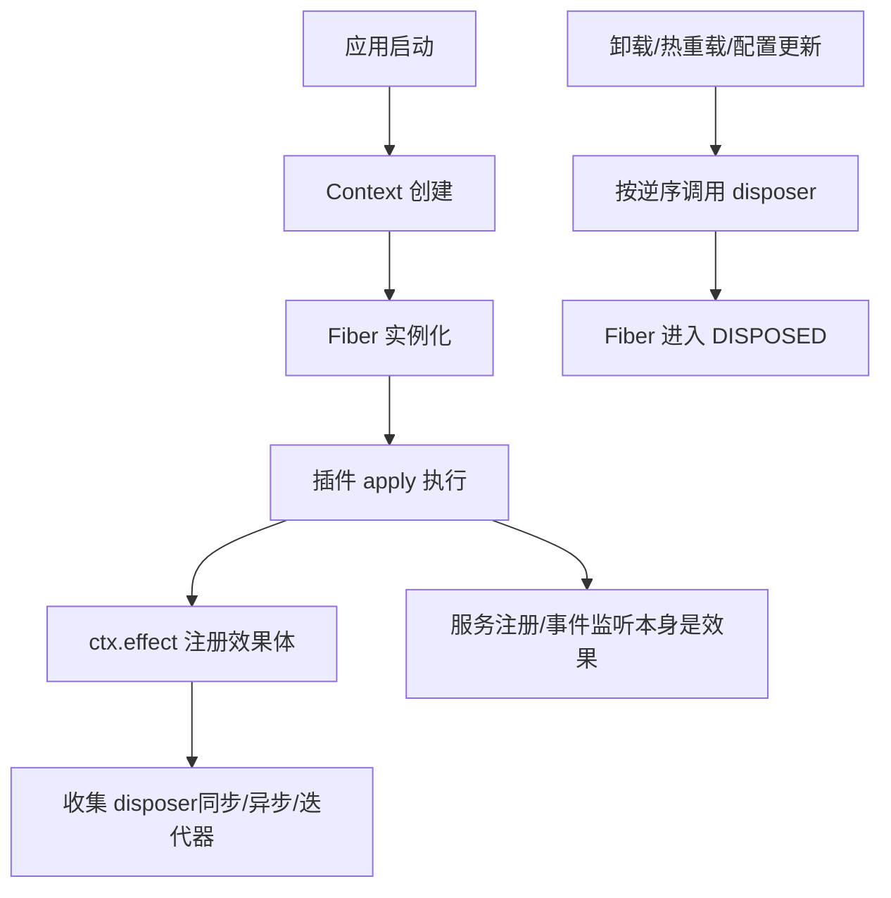
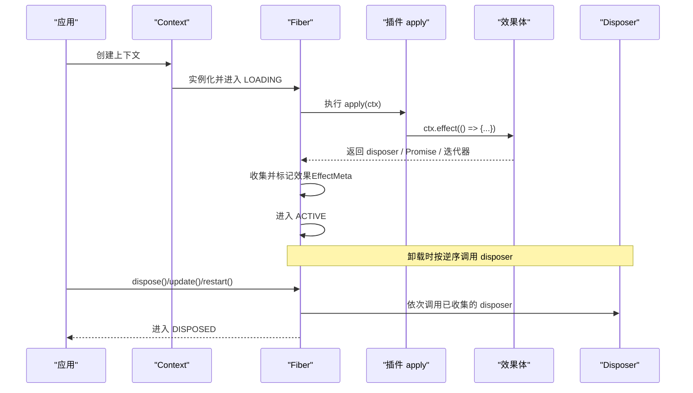
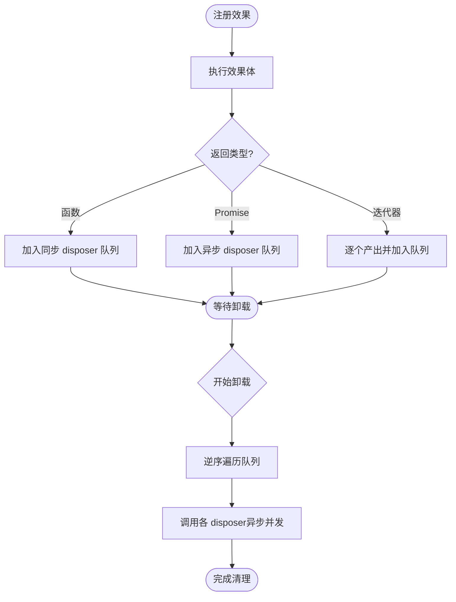
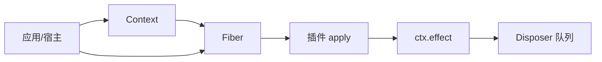

# 可逆效果管理

<cite>
**本文引用的文件**
- [上下文文档](file://docs/cordis-api/context.md)
- [Fiber 文档](file://docs/cordis-api/fiber.md)
- [生命周期与效果教程](file://docs/cordis-tutorial/02-lifecycle-and-effects.md)
- [CLI 构建测试（含 effect 用法）](file://apps/cli/tests/built-bin.e2e.ts)
- [Web 脚手架（含 effect 注册适配器示例）](file://apps/web/tests/scaffold.ts)
- [调度后测试（多个 effect 并发卸载场景）](file://apps/web/tests/schedule-after.e2e.ts)
- [子代理诊断（effect 清理句柄示例）](file://examples/headless-agent/tests/fixtures/subagent-diagnostic-agent.ts)
- [工作区上下文恢复（effect 清理句柄示例）](file://examples/headless-agent/tests/fixtures/workspace-context-resume-agent.ts)
- [API 网关客户端（effect 订阅清理）](file://packages/api/gateway/src/client/index.ts)
- [HMR 客户端（卸载时排空 effect）](file://packages/client/hmr/src/client/index.ts)
- [Slots 注入（effect 组合与迭代器效果）](file://packages/client/runtime/src/client/slots.ts)
</cite>

## 目录
1. [简介](#简介)
2. [项目结构](#项目结构)
3. [核心组件](#核心组件)
4. [架构总览](#架构总览)
5. [详细组件分析](#详细组件分析)
6. [依赖关系分析](#依赖关系分析)
7. [性能考量](#性能考量)
8. [故障排查指南](#故障排查指南)
9. [结论](#结论)
10. [附录：最佳实践与常见问题](#附录：最佳实践与常见问题)

## 简介
本文件系统性阐述 Cordis 的“可逆效果”管理机制，解释其设计动机、概念边界与使用方式。Cordis 将插件的生命周期与资源清理抽象为“效果”，通过 ctx.effect() 将任意外部资源（定时器、连接、监听器等）纳入统一的注册、执行与撤销流程，确保在热重载、配置更新或显式卸载时能够按确定顺序安全回收。

为什么需要可逆的效果管理？
- 避免资源泄漏：未管理的副作用会在插件卸载后继续运行，导致内存泄漏或错误状态。
- 保证一致性：效果在加载时生效、卸载时按逆序撤销，形成稳定的生命周期契约。
- 支持组合与嵌套：效果可以嵌套注册，便于分层封装复杂行为（如提示词片段、工具模式、适配器等）。
- 便于调试与观测：每个效果可带标签，形成可诊断的树形结构，帮助定位问题。

## 项目结构
围绕可逆效果的核心能力由以下文档与实现共同构成：
- 上下文 API：提供 effect、provide、mixin 等能力入口，以及服务隔离与拦截机制。
- Fiber 运行时：承载插件实例、状态机、效果收集与撤销、配置更新与重启。
- 教程与示例：展示 effect 的基本用法、并发卸载、嵌套组合等常见场景。

图示来源
- [Fiber 文档:8-37](file://docs/cordis-api/fiber.md#L8-L37)
- [上下文文档:235-365](file://docs/cordis-api/context.md#L235-L365)
- [生命周期与效果教程:62-95](file://docs/cordis-tutorial/02-lifecycle-and-effects.md#L62-L95)

章节来源
- [上下文文档:1-165](file://docs/cordis-api/context.md#L1-L165)
- [Fiber 文档:1-120](file://docs/cordis-api/fiber.md#L1-L120)
- [生命周期与效果教程:1-99](file://docs/cordis-tutorial/02-lifecycle-and-effects.md#L1-L99)

## 核心组件
- Context（上下文）：作为所有服务的入口，提供 effect、provide、mixin、extend/isolate/intercept 等能力。效果通过当前 fiber 注册，随 fiber 生命周期自动管理。
- Fiber（纤维）：插件实例的运行容器，维护状态机（PENDING→LOADING→ACTIVE→UNLOADING→DISPOSED），收集并调度效果及其 disposer。
- Effect（效果）：可被框架识别的资源生命周期单元，支持同步返回、Promise 返回、或生成器迭代返回多个 disposer。
- EffectMeta（效果元数据）：用于诊断的树形结构，记录效果标签与嵌套关系。

章节来源
- [上下文文档:166-365](file://docs/cordis-api/context.md#L166-L365)
- [Fiber 文档:276-329](file://docs/cordis-api/fiber.md#L276-L329)

## 架构总览
下图展示了从插件加载到效果注册、再到卸载撤销的完整流程，以及与上下文、Fiber 的关系。

图示来源
- [Fiber 文档:8-37](file://docs/cordis-api/fiber.md#L8-L37)
- [生命周期与效果教程:62-95](file://docs/cordis-tutorial/02-lifecycle-and-effects.md#L62-L95)

## 详细组件分析

### ctx.effect() 方法与返回值处理
- 作用：在当前 fiber 上注册一个“清理感知”的效果。execute 立即执行；它返回的 disposer（或 Promise 的 disposer、或迭代器产生的多个 disposer）会被收集并在卸载时按逆序调用。
- 返回值：返回一个可等待的 disposer，可用于提前触发该效果的撤销；重复调用为幂等。
- 错误约定：若 fiber 已失效则抛出 INACTIVE_EFFECT；若 execute 返回形状非法则抛出类型错误。
- 标签：可为效果指定 label，便于 getEffects() 诊断输出。

章节来源
- [Fiber 文档:8-37](file://docs/cordis-api/fiber.md#L8-L37)
- [Fiber 文档:164-193](file://docs/cordis-api/fiber.md#L164-L193)
- [Fiber 文档:276-329](file://docs/cordis-api/fiber.md#L276-L329)

### 效果的注册、执行与撤销机制
- 注册时机：插件 apply 中通过 ctx.effect() 注册；许多内置 API（如事件监听、服务提供、工具注册）本身就是效果，无需手动包装。
- 执行时机：execute 在注册时立即执行；disposer 在卸载时按逆序执行。
- 撤销顺序：多个异步 disposer 并发执行；如需严格串行，请在同一 disposer 内 await 完成。
- 组合与嵌套：效果体内可再次调用 ctx.effect()，形成嵌套树；getEffects() 可输出带标签的 EffectMeta 树。

图示来源
- [Fiber 文档:276-329](file://docs/cordis-api/fiber.md#L276-L329)
- [生命周期与效果教程:84-95](file://docs/cordis-tutorial/02-lifecycle-and-effects.md#L84-L95)

### 效果的生命周期管理与清理顺序
- 状态机：PENDING → LOADING → ACTIVE → UNLOADING → DISPOSED（失败分支 FAILED）。
- 清理顺序：disposer 按注册逆序执行；异步 disposer 并发执行。
- 钩子与重启：update/restart 会先运行 internal/update 水线，再重新加载；dispose 会递归卸载子插件并等待所有清理完成。

章节来源
- [Fiber 文档:50-120](file://docs/cordis-api/fiber.md#L50-L120)
- [Fiber 文档:212-274](file://docs/cordis-api/fiber.md#L212-L274)
- [生命周期与效果教程:68-95](file://docs/cordis-tutorial/02-lifecycle-and-effects.md#L68-L95)

### 内置效果类型与常见用法
- 事件监听：ctx.on(...) 本身是效果，卸载时自动移除监听器。
- 服务提供：ctx.provide(...) 是效果，卸载时注销并提供唤醒依赖。
- 工具/命令注册：各注册表返回的 disposer 会自动挂接到调用插件，卸载时自动撤销。
- 自定义资源：对框架不直接管理的资源（定时器、连接、观察者等），用 ctx.effect() 包裹并返回 disposer。

章节来源
- [生命周期与效果教程:84-95](file://docs/cordis-tutorial/02-lifecycle-and-effects.md#L84-L95)
- [上下文文档:286-365](file://docs/cordis-api/context.md#L286-L365)

### 效果的组合与嵌套使用模式
- 嵌套注册：在效果体内再次调用 ctx.effect()，形成 EffectMeta 树，便于诊断。
- 组合策略：将相关资源放在同一效果中，保证有序清理；跨层共享能力可通过 provide/mixin 暴露。
- 迭代器效果：通过生成器 yield 多个 disposer，适合批量注册/撤销。

章节来源
- [Fiber 文档:276-329](file://docs/cordis-api/fiber.md#L276-L329)
- [Slots 注入:132-177](file://packages/client/runtime/src/client/slots.ts#L132-L177)

### 代码级示例与路径指引
- 基础心跳定时器：在插件中用 ctx.effect() 注册 setInterval，并在 disposer 中 clearInterval。
  - 参考路径：[生命周期与效果教程:18-42](file://docs/cordis-tutorial/02-lifecycle-and-effects.md#L18-L42)
- 多 effect 并发卸载：多个 effect 同时注册，卸载时并发执行异步清理。
  - 参考路径：[调度后测试:217-225](file://apps/web/tests/schedule-after.e2e.ts#L217-L225)
- 适配器注册：在 effect 中注册 LLM 适配器，卸载时自动清理。
  - 参考路径：[Web 脚手架:564](file://apps/web/tests/scaffold.ts#L564)
- 句柄清理：在 effect 中持有句柄并在 disposer 中调用 dispose。
  - 参考路径：[子代理诊断:25](file://examples/headless-agent/tests/fixtures/subagent-diagnostic-agent.ts#L25)
  - 参考路径：[工作区上下文恢复:24](file://examples/headless-agent/tests/fixtures/workspace-context-resume-agent.ts#L24)
- 订阅清理：在 effect 中建立订阅，卸载时清空订阅集合。
  - 参考路径：[API 网关客户端:97-118](file://packages/api/gateway/src/client/index.ts#L97-L118)
- HMR 卸载排空：卸载阶段确保 effect 的 slots/订阅全部完成。
  - 参考路径：[HMR 客户端:125](file://packages/client/hmr/src/client/index.ts#L125)

章节来源
- [生命周期与效果教程:18-42](file://docs/cordis-tutorial/02-lifecycle-and-effects.md#L18-L42)
- [调度后测试:217-225](file://apps/web/tests/schedule-after.e2e.ts#L217-L225)
- [Web 脚手架:564](file://apps/web/tests/scaffold.ts#L564)
- [子代理诊断:25](file://examples/headless-agent/tests/fixtures/subagent-diagnostic-agent.ts#L25)
- [工作区上下文恢复:24](file://examples/headless-agent/tests/fixtures/workspace-context-resume-agent.ts#L24)
- [API 网关客户端:97-118](file://packages/api/gateway/src/client/index.ts#L97-L118)
- [HMR 客户端:125](file://packages/client/hmr/src/client/index.ts#L125)

## 依赖关系分析
- Context 与 Fiber：Context 提供 effect 等 API，实际注册与调度委托给当前 Fiber。
- 插件与应用：插件通过 apply(ctx) 注册效果；应用通过 fiber.dispose/update/restart 驱动生命周期。
- 外部资源：通过 effect 统一接入，避免游离于生命周期之外。

图示来源
- [上下文文档:235-365](file://docs/cordis-api/context.md#L235-L365)
- [Fiber 文档:50-120](file://docs/cordis-api/fiber.md#L50-L120)

章节来源
- [上下文文档:235-365](file://docs/cordis-api/context.md#L235-L365)
- [Fiber 文档:50-120](file://docs/cordis-api/fiber.md#L50-L120)

## 性能考量
- 并发清理：多个异步 disposer 并发执行，减少整体卸载时间；但需避免竞态条件。
- 单 disposer 串行：对必须串行的清理步骤，放入同一 disposer 内 await，避免顺序错乱。
- 最小化副作用：尽量将副作用集中在 effect 中，避免全局或隐式副作用。
- 诊断开销：大量带标签的效果会增加 getEffects() 的元数据成本，按需标注关键节点。

## 故障排查指南
- INACTIVE_EFFECT：尝试在已销毁的 fiber 上注册 effect。检查是否在 dispose 之后仍调用 effect。
- 资源泄漏：确认所有外部资源均在 ctx.effect 中申请，并在 disposer 中释放。
- 清理顺序问题：若存在先后依赖，将相关清理逻辑合并到同一 disposer 中串行执行。
- HMR/热重载：确保 effect 中的订阅/监听在卸载时被正确清理，避免残留回调。
- 诊断定位：使用 getEffects() 查看 EffectMeta 树，结合 effect 标签快速定位问题来源。

章节来源
- [Fiber 文档:331-355](file://docs/cordis-api/fiber.md#L331-L355)
- [生命周期与效果教程:84-95](file://docs/cordis-tutorial/02-lifecycle-and-effects.md#L84-L95)
- [HMR 客户端:125](file://packages/client/hmr/src/client/index.ts#L125)

## 结论
Cordis 的可逆效果管理以 Fiber 为核心，将插件生命周期与资源清理标准化，使复杂系统具备可预测的加载/卸载语义。通过 ctx.effect() 将任意副作用纳入统一管理，配合 EffectMeta 的诊断能力，开发者可以构建高内聚、低耦合、易维护的插件生态。遵循“注册即生效、卸载即撤销”的原则，能显著降低资源泄漏与状态不一致的风险。

## 附录：最佳实践与常见问题
- 最佳实践
  - 始终将外部资源申请与释放成对放入 ctx.effect()。
  - 为关键效果设置清晰的 label，便于诊断。
  - 将强依赖顺序的清理逻辑合并到同一 disposer 中串行执行。
  - 优先使用框架提供的“已经是效果”的 API（事件、服务、工具注册等）。
  - 在 effect 内部可嵌套注册更多 effect，形成层次化的 EffectMeta 树。
- 常见问题
  - 在已销毁 fiber 上注册 effect：应检查调用时机，避免在 dispose 之后注册。
  - 异步清理竞态：避免多个 disposer 同时修改共享状态，必要时加锁或串行化。
  - HMR 后状态异常：确保 effect 中的订阅/监听在卸载时完全清理。
  - 过度嵌套：过深的效果嵌套会影响可读性与调试，建议合理拆分模块。