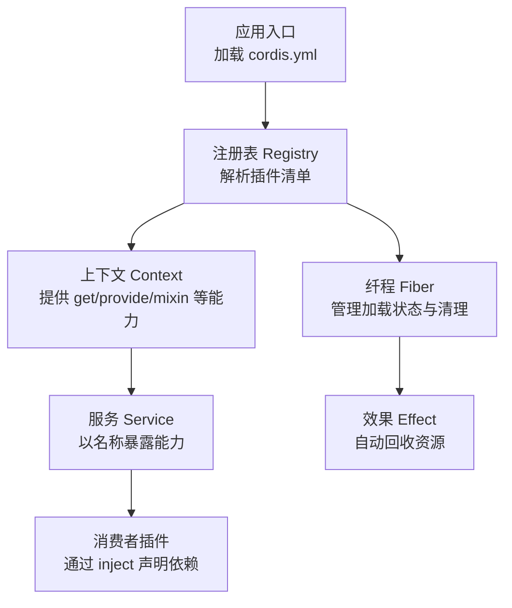
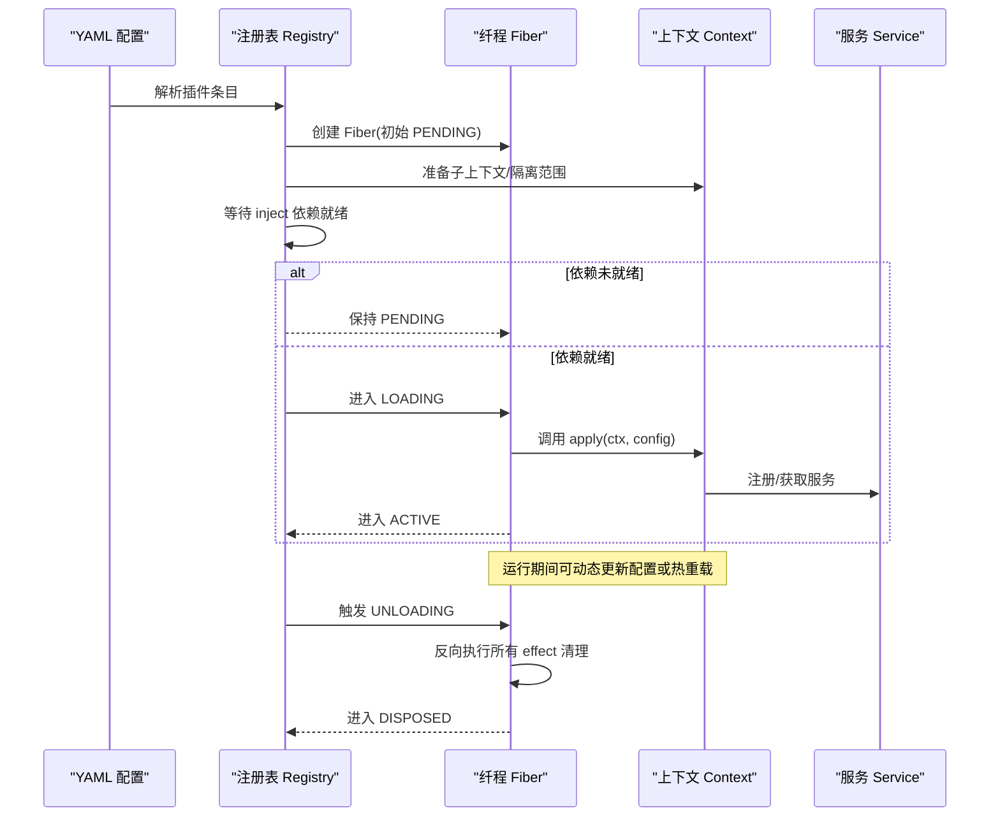
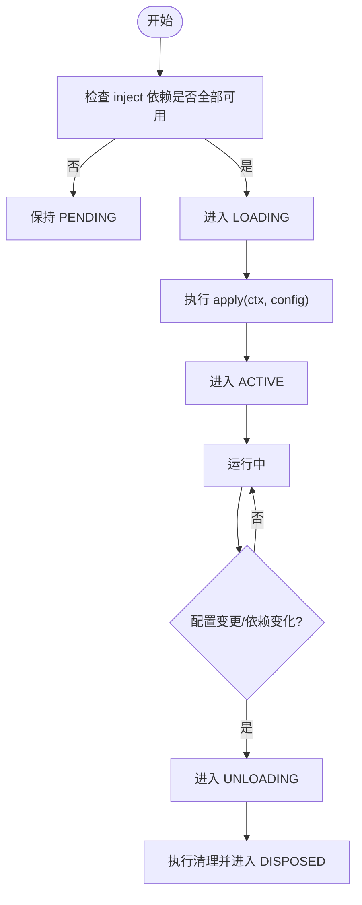

# 插件生命周期管理

<cite>
**本文引用的文件**
- [服务接口文档](file://docs/cordis-api/service.md)
- [上下文文档](file://docs/cordis-api/context.md)
- [注册表与注入文档](file://docs/cordis-api/registry.md)
- [纤程与效果文档](file://docs/cordis-api/fiber.md)
- [教程：生命周期与效果](file://docs/cordis-tutorial/02-lifecycle-and-effects.md)
- [教程：服务](file://docs/cordis-tutorial/03-services.md)
- [示例配置：ACP 代理](file://examples/acp-agent/cordis.yml)
- [示例配置：无头代理](file://examples/headless-agent/cordis.yml)
</cite>

## 目录
1. [简介](#简介)
2. [项目结构](#项目结构)
3. [核心组件](#核心组件)
4. [架构总览](#架构总览)
5. [详细组件分析](#详细组件分析)
6. [依赖关系分析](#依赖关系分析)
7. [性能考虑](#性能考虑)
8. [故障排查指南](#故障排查指南)
9. [结论](#结论)
10. [附录](#附录)

## 简介
本文件系统性阐述 Cordis 插件从加载到卸载的完整生命周期，覆盖初始化、依赖注入、服务注册与清理。重点说明 Service 接口的实现方式（函数式服务与类式服务）、inject 字段如何声明依赖并影响加载顺序、apply(ctx) 的执行时机与上下文使用、错误处理与异常恢复机制，并提供最佳实践与常见陷阱规避建议。

## 项目结构
Cordis 的插件体系由“上下文 Context”、“注册表 Registry”、“纤程 Fiber”和“服务 Service”构成。插件通过三种形态接入：函数插件、类插件、对象插件；统一通过 ctx.plugin 或 ctx.inject 启动，并由 Fiber 管理其生命周期状态与资源清理。



图表来源
- [注册表与注入文档:1-153](file://docs/cordis-api/registry.md#L1-L153)
- [上下文文档:1-365](file://docs/cordis-api/context.md#L1-L365)
- [纤程与效果文档:1-376](file://docs/cordis-api/fiber.md#L1-L376)
- [服务接口文档:1-103](file://docs/cordis-api/service.md#L1-L103)

章节来源
- [注册表与注入文档:1-153](file://docs/cordis-api/registry.md#L1-L153)
- [上下文文档:1-365](file://docs/cordis-api/context.md#L1-L365)
- [纤程与效果文档:1-376](file://docs/cordis-api/fiber.md#L1-L376)
- [服务接口文档:1-103](file://docs/cordis-api/service.md#L1-L103)

## 核心组件
- 上下文 Context：插件运行时的根容器，提供事件总线、日志、反射层、插件注册表等能力，支持扩展、隔离与拦截配置。
- 注册表 Registry：负责加载插件、解析依赖、执行 apply/inject，返回 Fiber 以跟踪生命周期。
- 纤程 Fiber：单个插件实例的运行期载体，维护状态机、已验证配置、已注册效果与清理流程。
- 服务 Service：以名称注册的共享能力，可通过类式或服务工厂形式提供，供其他插件消费。

章节来源
- [上下文文档:1-365](file://docs/cordis-api/context.md#L1-L365)
- [注册表与注入文档:1-153](file://docs/cordis-api/registry.md#L1-L153)
- [纤程与效果文档:1-376](file://docs/cordis-api/fiber.md#L1-L376)
- [服务接口文档:1-103](file://docs/cordis-api/service.md#L1-L103)

## 架构总览
下图展示插件从 YAML 配置到加载、依赖就绪、服务可用、运行中、再到卸载清理的端到端流程。



图表来源
- [注册表与注入文档:1-153](file://docs/cordis-api/registry.md#L1-L153)
- [纤程与效果文档:1-376](file://docs/cordis-api/fiber.md#L1-L376)
- [上下文文档:1-365](file://docs/cordis-api/context.md#L1-L365)
- [服务接口文档:1-103](file://docs/cordis-api/service.md#L1-L103)

## 详细组件分析

### 插件形态与入口
- 函数插件：直接导出函数作为插件体，无需 apply；名称用于诊断。
- 类插件：继承 Service 或通过构造函数接收 (ctx, config)，构造时即完成服务注册。
- 对象插件：导出 { apply(ctx, config) }，必须提供 apply。

章节来源
- [注册表与注入文档:58-121](file://docs/cordis-api/registry.md#L58-L121)
- [服务接口文档:1-103](file://docs/cordis-api/service.md#L1-L103)

### 依赖注入与加载顺序
- inject 字段声明插件所需服务，支持数组或对象映射（后者可附带拦截配置）。
- 当依赖未满足时，插件处于 PENDING；一旦全部可用，立即进入 LOADING→ACTIVE。
- 依赖是运行时追踪的：若提供者被卸载或替换，依赖方也会随之卸载并重新加载，避免悬挂引用。

章节来源
- [注册表与注入文档:123-153](file://docs/cordis-api/registry.md#L123-L153)
- [教程：服务:44-79](file://docs/cordis-tutorial/03-services.md#L44-L79)

### 服务注册与访问
- 类式服务：继承 Service，在构造函数中调用 super(ctx, name) 完成注册；该注册本身是一个 effect，随插件卸载而移除。
- 函数式服务：通过 ctx.provide(name, value) 注册，返回值是可调用清理器；也可通过 mixin 将服务方法挂载到 ctx 上。
- 可选依赖：使用 ctx.get('name') 安全读取，不存在时为 undefined。

章节来源
- [服务接口文档:1-103](file://docs/cordis-api/service.md#L1-L103)
- [上下文文档:237-365](file://docs/cordis-api/context.md#L237-L365)
- [教程：服务:7-43](file://docs/cordis-tutorial/03-services.md#L7-L43)

### apply(ctx) 的执行时机与上下文使用
- apply 在依赖就绪后、进入 ACTIVE 前执行；在此阶段可注册服务、监听事件、启动定时器等。
- 所有通过 Cordis API 的注册（如 ctx.on、ctx.plugin、ctx.provide）都是 effect，会在卸载时自动撤销。
- 外部资源需包裹在 ctx.effect() 中，返回清理器以确保可靠释放。

章节来源
- [纤程与效果文档:8-37](file://docs/cordis-api/fiber.md#L8-L37)
- [教程：生命周期与效果:5-95](file://docs/cordis-tutorial/02-lifecycle-and-effects.md#L5-L95)

### 生命周期状态机与清理
- 状态流转：PENDING → LOADING → ACTIVE → UNLOADING → DISPOSED；失败路径为 FAILED。
- 清理：UNLOADING 阶段按注册逆序执行所有 effect 清理器；异步清理器并发执行，如需顺序请合并到一个清理器内 await。
- fiber.dispose() 会递归卸载子插件并等待所有清理完成。

章节来源
- [纤程与效果文档:58-275](file://docs/cordis-api/fiber.md#L58-L275)
- [教程：生命周期与效果:68-95](file://docs/cordis-tutorial/02-lifecycle-and-effects.md#L68-L95)

### 错误处理与异常恢复
- 配置校验失败抛出 ValidationError；插件启动抛错进入 FAILED。
- 对已销毁的 Fiber 注册 effect 会抛出 INACTIVE_EFFECT。
- 推荐模式：在 apply 中使用 try/catch 包装关键步骤，并通过 ctx.logger 记录；对外部副作用用 ctx.effect 包裹，确保异常不会阻止清理。

章节来源
- [纤程与效果文档:331-376](file://docs/cordis-api/fiber.md#L331-L376)

### 代码级流程图：依赖就绪判定与加载


图表来源
- [注册表与注入文档:1-153](file://docs/cordis-api/registry.md#L1-L153)
- [纤程与效果文档:58-275](file://docs/cordis-api/fiber.md#L58-L275)

### 类式服务 vs 函数式服务
- 类式服务：适合需要状态或多方法的复杂能力；通过继承 Service 并在构造函数中注册，天然具备类型提示与可组合性。
- 函数式服务：轻量、无状态场景更简洁；通过 ctx.provide 直接暴露值或函数。
- 两者均可通过 ctx.get 或 ctx.name 访问；类式服务可作为插件自身被 ctx.plugin 装载。

章节来源
- [服务接口文档:1-103](file://docs/cordis-api/service.md#L1-L103)
- [教程：服务:7-43](file://docs/cordis-tutorial/03-services.md#L7-L43)

### 实际示例参考
- 函数插件与 effect 的使用：参见教程中的心跳示例，展示如何在 apply 中挂载子插件与定时器，并在卸载时清理。
- 服务提供与消费：教程展示了如何通过 Service 子类提供 greeter 服务，以及 consumer 通过 inject 声明依赖并消费。
- 真实配置：示例配置展示了多插件组合，包括 LLM、沙箱、工具、工作流等，体现依赖与配置的解耦。

章节来源
- [教程：生命周期与效果:11-67](file://docs/cordis-tutorial/02-lifecycle-and-effects.md#L11-L67)
- [教程：服务:9-79](file://docs/cordis-tutorial/03-services.md#L9-L79)
- [示例配置：ACP 代理:1-193](file://examples/acp-agent/cordis.yml#L1-L193)
- [示例配置：无头代理:1-166](file://examples/headless-agent/cordis.yml#L1-L166)

## 依赖关系分析
- 插件之间通过服务名进行松耦合通信，不直接导入提供方模块。
- inject 决定加载时序：只有当所有依赖服务存在时，插件才会从 PENDING 转为 LOADING。
- 依赖变化驱动重载：提供者卸载或替换会导致依赖方卸载并重新加载，保证一致性。

```mermaid
graph LR
A["提供者插件 A"] --> |提供 'svc'| C["消费者插件 B"]
C --> |inject: ['svc']| C
subgraph "运行时"
C --> |ctx.get / ctx.svc| A
end
```

图表来源
- [注册表与注入文档:123-153](file://docs/cordis-api/registry.md#L123-L153)
- [上下文文档:237-365](file://docs/cordis-api/context.md#L237-L365)

章节来源
- [注册表与注入文档:123-153](file://docs/cordis-api/registry.md#L123-L153)
- [上下文文档:237-365](file://docs/cordis-api/context.md#L237-L365)

## 性能考虑
- 避免在 apply 中进行重型同步阻塞操作，尽量异步化并使用 ctx.effect 管理生命周期。
- 谨慎使用全局单例；优先通过服务注入，便于测试与隔离。
- 大量 effect 清理时注意顺序与并发：如需严格顺序，合并到单一清理器内 await。
- 合理使用 ctx.isolate 与 ctx.intercept 控制作用域与配置覆盖，减少不必要的重加载。

[本节为通用指导，不直接分析具体文件]

## 故障排查指南
- 插件无输出或“静默退出”：检查是否处于 PENDING 且缺少依赖；确认依赖提供者已加载。
- 启动报错：查看配置校验错误（ValidationError）与插件启动异常；定位到具体插件条目。
- 资源泄漏：确认外部资源均通过 ctx.effect 注册并返回清理器；必要时在清理器中打印日志。
- 热重载问题：确保清理器幂等且可重复执行；避免在清理器中访问已失效的全局状态。

章节来源
- [纤程与效果文档:331-376](file://docs/cordis-api/fiber.md#L331-L376)
- [教程：生命周期与效果:68-95](file://docs/cordis-tutorial/02-lifecycle-and-effects.md#L68-L95)

## 结论
Cordis 通过 Context、Registry、Fiber、Service 的组合，提供了声明式、可组合、可观测的插件生命周期管理。借助 inject 声明依赖、effect 管理资源、Service 暴露能力，开发者可以构建高内聚、低耦合的可插拔系统。遵循本文的最佳实践，可有效避免常见陷阱，提升系统的稳定性与可维护性。

[本节为总结性内容，不直接分析具体文件]

## 附录

### 最佳实践清单
- 始终通过 inject 声明硬依赖，使用 ctx.get 处理可选依赖。
- 所有外部资源（连接、定时器、文件句柄等）必须在 ctx.effect 中申请并返回清理器。
- 在 apply 中只做必要初始化，耗时任务异步化。
- 为服务命名加前缀或命名空间，避免冲突。
- 使用 ctx.isolate 与 ctx.intercept 精确控制作用域与配置覆盖。
- 对关键路径添加日志与错误捕获，利用 fiber.state 与 getEffects 进行诊断。

[本节为通用指导，不直接分析具体文件]

### 常见陷阱与规避
- 在已销毁的 Fiber 上注册 effect：会抛出 INACTIVE_EFFECT；应在 active 阶段注册。
- 忽略依赖变化：提供者卸载会导致依赖方悬挂；依赖变化会触发重加载，确保清理逻辑正确。
- 清理器顺序误判：多个异步清理器并发执行；如需顺序，合并到单一清理器内 await。
- 滥用全局状态：应通过服务注入，便于测试与隔离。

章节来源
- [纤程与效果文档:331-376](file://docs/cordis-api/fiber.md#L331-L376)
- [教程：生命周期与效果:68-95](file://docs/cordis-tutorial/02-lifecycle-and-effects.md#L68-L95)