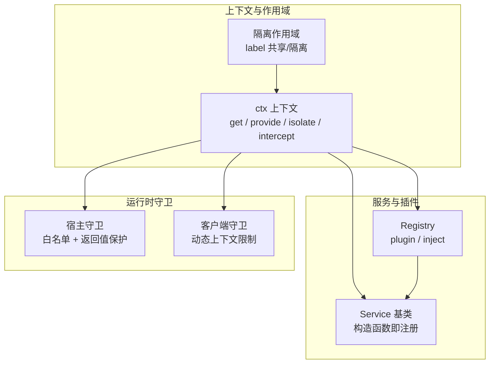
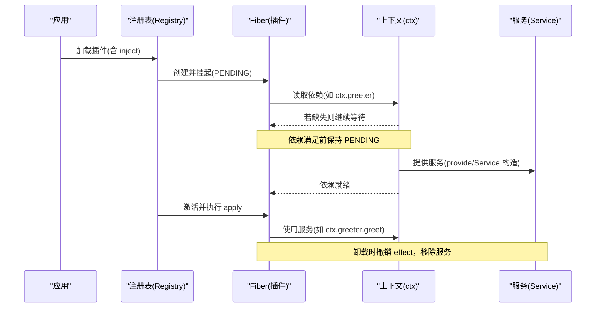
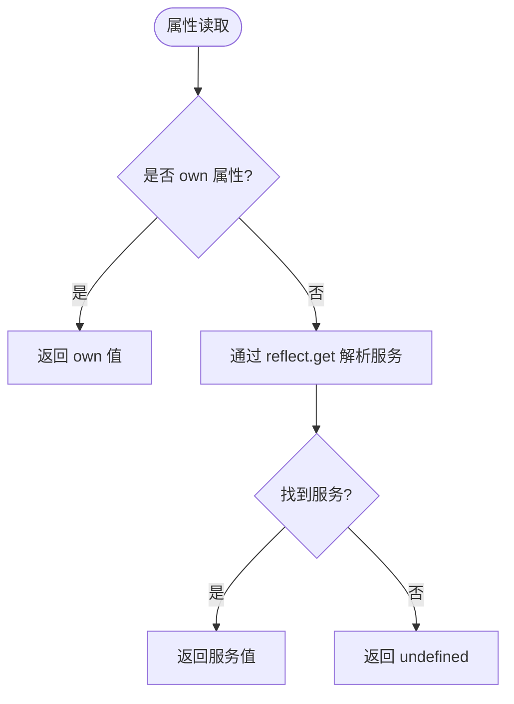
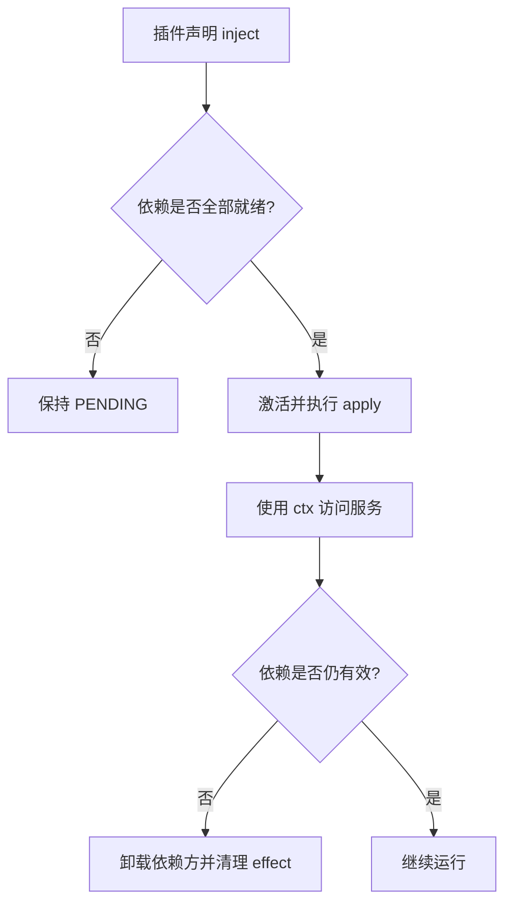
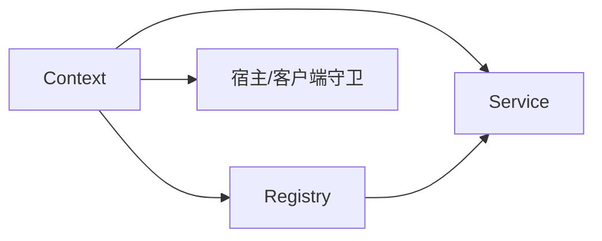

# 服务注册与发现

<cite>
**本文引用的文件**
- [context.md](file://docs/cordis-api/context.md)
- [service.md](file://docs/cordis-api/service.md)
- [registry.md](file://docs/cordis-api/registry.md)
- [03-services.zh.md](file://docs/cordis-tutorial/03-services.zh.md)
- [lifecycle.ts](file://packages/extensions/cordis-host-runner/src/lifecycle.ts)
- [guard.ts](file://packages/extensions/cordis-host-runner/src/guard.ts)
- [client guard.ts](file://packages/extensions/cordis-client-runner/src/client/guard.ts)
- [global-service.js](file://packages/preset/agent-presets/tests/fixtures/plugins/global-service.js)
- [inspect.ts](file://packages/extensions/tool-cordis/src/inspect.ts)
</cite>

## 目录
1. [简介](#简介)
2. [项目结构](#项目结构)
3. [核心组件](#核心组件)
4. [架构总览](#架构总览)
5. [详细组件分析](#详细组件分析)
6. [依赖关系分析](#依赖关系分析)
7. [性能考量](#性能考量)
8. [故障排查指南](#故障排查指南)
9. [结论](#结论)
10. [附录](#附录)

## 简介
本文件系统性阐述 Cordis 的服务注册与发现机制，围绕 ctx 上下文作为“服务仓库”的设计理念展开，解释服务键（key）的命名规范、冲突处理、静态与动态声明方式、依赖解析算法与循环依赖处理、版本管理与向后兼容策略、服务提供者模式实现，并给出可操作的实践建议与性能优化要点。文档中的概念与流程均基于仓库中 Cordis API 文档与宿主/客户端运行时的守卫与生命周期实现进行归纳。

## 项目结构
Cordis 的服务体系由以下关键部分构成：
- 上下文（Context）：作为代理式服务仓库，提供 get/provide/accessor/mixin/isolate/intercept 等能力，支持作用域隔离与拦截配置。
- 服务基类（Service）：以插件形式加载时自动将实例注册到 ctx 指定名称下，随 fiber 生命周期管理。
- 插件注册表（Registry）：负责插件加载、依赖注入（inject）、fiber 生命周期与卸载重入。
- 宿主/客户端守卫：在沙箱或受限环境中对注入服务的访问进行白名单校验与返回值保护，防止泄露运行时上下文。
- 示例与教程：展示如何声明、提供、消费服务，以及可选依赖与命名约定。

图表来源
- [context.md:14-96](file://docs/cordis-api/context.md#L14-L96)
- [service.md:1-23](file://docs/cordis-api/service.md#L1-L23)
- [registry.md:8-56](file://docs/cordis-api/registry.md#L8-L56)
- [guard.ts:657-711](file://packages/extensions/cordis-host-runner/src/guard.ts#L657-L711)
- [client guard.ts:180-204](file://packages/extensions/cordis-client-runner/src/client/guard.ts#L180-L204)

章节来源
- [context.md:14-96](file://docs/cordis-api/context.md#L14-L96)
- [service.md:1-23](file://docs/cordis-api/service.md#L1-L23)
- [registry.md:8-56](file://docs/cordis-api/registry.md#L8-L56)

## 核心组件
- 上下文（ctx）
  - 代理式属性读取：通过服务解析器获取已提供的服务；未提供则返回 undefined（严格模式下仅返回当前活跃 fiber 提供的实现）。
  - 作用域隔离：isolate(name, label) 为特定服务创建独立作用域，相同 label 可合并作用域。
  - 拦截配置：intercept(name, config) 为子上下文叠加该服务的拦截配置，供后续插件消费。
  - 反射层：reflect 暴露 get/set/provide/accessor/mixin 等底层能力。
- 服务（Service）
  - 子类构造时调用 super(ctx, name) 立即注册，随所属 fiber 自动移除。
  - 提供静态符号键用于扩展行为（如 init/check/config/invoke/extend/tracker/resolveConfig）。
- 插件注册表（Registry）
  - plugin(plugin, ...args) 加载函数/类/对象形态插件，返回 Fiber。
  - inject(deps, callback) 声明依赖，待依赖就绪后执行回调，并在依赖变化时卸载并重载。
  - Plugin 元数据：name、Config、inject、provide、intercept 等。

章节来源
- [context.md:14-96](file://docs/cordis-api/context.md#L14-L96)
- [context.md:237-365](file://docs/cordis-api/context.md#L237-L365)
- [service.md:1-103](file://docs/cordis-api/service.md#L1-L103)
- [registry.md:8-56](file://docs/cordis-api/registry.md#L8-L56)
- [registry.md:58-153](file://docs/cordis-api/registry.md#L58-L153)

## 架构总览
下图展示了从插件声明依赖到服务可用、再到消费方执行的完整时序，包括 PENDING 等待、激活、卸载与重入。

图表来源
- [registry.md:8-56](file://docs/cordis-api/registry.md#L8-L56)
- [context.md:237-314](file://docs/cordis-api/context.md#L237-L314)
- [service.md:1-23](file://docs/cordis-api/service.md#L1-L23)
- [03-services.zh.md:44-78](file://docs/cordis-tutorial/03-services.zh.md#L44-L78)

## 详细组件分析

### 上下文作为服务仓库的设计与工作原理
- 代理式访问：正常属性读取走服务解析器，确保只暴露当前作用域内可用的服务。
- 作用域隔离：isolate 允许在同一应用中为同一服务名提供不同实现，并通过 label 合并作用域。
- 拦截配置：intercept 为子上下文叠加服务级配置，便于按场景覆盖默认行为。
- 反射能力：get/set/provide/accessor/mixin 提供细粒度控制，accessor 支持计算属性，mixin 将服务方法直接挂载到 ctx。

图表来源
- [context.md:237-365](file://docs/cordis-api/context.md#L237-L365)

章节来源
- [context.md:14-96](file://docs/cordis-api/context.md#L14-L96)
- [context.md:237-365](file://docs/cordis-api/context.md#L237-L365)

### 服务键（key）命名规范与冲突处理
- 命名空间：每个应用内服务名处于扁平命名空间，建议使用有辨识度的前缀或命名空间以避免冲突。
- 冲突检测：重复提供同名服务会抛出异常；访问器（accessor）与已有提供项冲突也会报错。
- 作用域隔离：通过 isolate(label) 可在子作用域内提供同名服务而不影响父作用域。
- 安全边界：在宿主/客户端守卫中，仅允许访问插件声明的 inject 服务，避免越权访问。

章节来源
- [03-services.zh.md:92-95](file://docs/cordis-tutorial/03-services.zh.md#L92-L95)
- [context.md:286-333](file://docs/cordis-api/context.md#L286-L333)
- [guard.ts:657-711](file://packages/extensions/cordis-host-runner/src/guard.ts#L657-L711)
- [client guard.ts:180-204](file://packages/extensions/cordis-client-runner/src/client/guard.ts#L180-L204)

### 服务声明方式：静态与动态
- 静态声明（类 Service）
  - 继承 Service，在构造函数中调用 super(ctx, name) 完成注册。
  - 通过 ctx.plugin(ServiceClass) 像普通插件一样挂载。
- 动态注册（ctx.provide）
  - 在任意 fiber 中通过 ctx.provide(name, value) 动态提供实现。
  - 返回 disposer，卸载时自动取消注册并唤醒依赖方。
- 示例参考
  - 教程中演示了类 Service 的提供与消费。
  - 测试用例展示了在 effect 中动态提供全局服务。

章节来源
- [03-services.zh.md:7-42](file://docs/cordis-tutorial/03-services.zh.md#L7-L42)
- [context.md:286-314](file://docs/cordis-api/context.md#L286-L314)
- [global-service.js:1-5](file://packages/preset/agent-presets/tests/fixtures/plugins/global-service.js#L1-L5)

### 依赖解析算法与循环依赖处理
- 依赖声明：插件通过 inject 声明所需服务，支持数组或对象形式（带拦截配置）。
- 等待机制：当依赖缺失时，插件保持 PENDING；一旦所有依赖就绪，激活并执行 apply。
- 运行时跟踪：依赖变化（提供方卸载/热替换）会导致依赖方卸载并重新加载，保证引用一致性。
- 循环依赖：由于依赖在加载后才被追踪，且 PENDING 不阻塞事件循环，系统通过延迟激活与卸载重入规避死锁；具体实现细节位于宿主生命周期模块。

图表来源
- [registry.md:8-56](file://docs/cordis-api/registry.md#L8-L56)
- [lifecycle.ts:47-57](file://packages/extensions/cordis-host-runner/src/lifecycle.ts#L47-L57)
- [03-services.zh.md:74-78](file://docs/cordis-tutorial/03-services.zh.md#L74-L78)

章节来源
- [registry.md:123-153](file://docs/cordis-api/registry.md#L123-L153)
- [lifecycle.ts:47-57](file://packages/extensions/cordis-host-runner/src/lifecycle.ts#L47-L57)
- [03-services.zh.md:74-78](file://docs/cordis-tutorial/03-services.zh.md#L74-L78)

### 服务版本管理与向后兼容性
- 版本标识：服务本身无内置版本号字段，通常通过命名空间或前缀区分版本（例如 mylib/v1、mylib/v2）。
- 向后兼容：通过拦截配置（intercept）与隔离作用域（isolate）为旧消费者提供兼容实现，逐步迁移到新实现。
- 渐进替换：先提供新实现于隔离作用域，再逐步切换消费者至新版本，最后移除旧实现。
- 工具辅助：可通过 inspect 工具列出当前运行的服务与签名，辅助验证兼容性与变更影响。

章节来源
- [context.md:68-96](file://docs/cordis-api/context.md#L68-L96)
- [inspect.ts:53-80](file://packages/extensions/tool-cordis/src/inspect.ts#L53-L80)

### 服务提供者模式的实现
- 基类模式：继承 Service，构造函数即注册，适合稳定、长期存在的核心服务。
- 工厂模式：在 effect 中动态 provide 临时或条件性服务，适合按需创建与销毁。
- 组合模式：通过 mixin 将服务方法直接挂载到 ctx，简化调用路径。
- 守卫模式：宿主/客户端守卫对注入服务进行白名单校验与返回值保护，确保安全边界。

章节来源
- [service.md:1-23](file://docs/cordis-api/service.md#L1-L23)
- [context.md:286-365](file://docs/cordis-api/context.md#L286-L365)
- [guard.ts:657-711](file://packages/extensions/cordis-host-runner/src/guard.ts#L657-L711)
- [client guard.ts:180-204](file://packages/extensions/cordis-client-runner/src/client/guard.ts#L180-L204)

### 代码示例（以路径引用代替具体代码）
- 定义服务（类 Service）
  - 参考：[教程-提供服务:7-42](file://docs/cordis-tutorial/03-services.zh.md#L7-L42)
- 注册服务（动态 provide）
  - 参考：[上下文-provide:286-314](file://docs/cordis-api/context.md#L286-L314)
  - 参考：[测试-全局服务:1-5](file://packages/preset/agent-presets/tests/fixtures/plugins/global-service.js#L1-L5)
- 消费服务（inject）
  - 参考：[教程-使用 inject 消费服务:44-78](file://docs/cordis-tutorial/03-services.zh.md#L44-L78)
- 可选依赖（ctx.get）
  - 参考：[教程-可选依赖:80-90](file://docs/cordis-tutorial/03-services.zh.md#L80-L90)

## 依赖关系分析
- 耦合与内聚
  - Context 与 Registry 紧密协作：Registry 管理插件生命周期，Context 提供依赖解析与作用域隔离。
  - Service 与 Context：Service 通过 Context 注册自身，生命周期由 Context 的 fiber 管理。
  - 守卫与 Context：宿主/客户端守卫对注入服务访问进行约束，增强安全性。
- 外部依赖
  - 宿主/客户端运行时通过守卫限制动态上下文访问，确保沙箱安全。
- 潜在循环
  - 通过延迟激活与卸载重入规避循环依赖导致的死锁；具体逻辑在宿主生命周期模块。

图表来源
- [context.md:14-96](file://docs/cordis-api/context.md#L14-L96)
- [registry.md:8-56](file://docs/cordis-api/registry.md#L8-L56)
- [guard.ts:657-711](file://packages/extensions/cordis-host-runner/src/guard.ts#L657-L711)
- [client guard.ts:180-204](file://packages/extensions/cordis-client-runner/src/client/guard.ts#L180-L204)

章节来源
- [registry.md:8-56](file://docs/cordis-api/registry.md#L8-L56)
- [context.md:14-96](file://docs/cordis-api/context.md#L14-L96)
- [guard.ts:657-711](file://packages/extensions/cordis-host-runner/src/guard.ts#L657-L711)

## 性能考量
- 延迟激活：PENDING 状态不阻塞事件循环，减少启动开销。
- 作用域隔离：isolate 避免不必要的服务复制，仅在需要时创建隔离作用域。
- 拦截配置：intercept 以浅合并方式叠加配置，避免深层拷贝成本。
- 动态提供：effect 管理的 provide/dispose 确保资源及时释放，避免内存泄漏。
- 守卫开销：宿主/客户端守卫对注入服务进行白名单与返回值检查，应在高频路径中谨慎使用或缓存结果。

## 故障排查指南
- 依赖缺失导致插件不启动
  - 现象：插件保持 PENDING，无输出。
  - 排查：检查 inject 声明与服务提供位置；使用 inspect 工具查看当前运行服务。
- 服务冲突
  - 现象：重复提供同名服务抛出异常。
  - 排查：确认作用域隔离（isolate）与命名空间前缀；避免跨作用域覆盖。
- 动态上下文访问受限
  - 现象：在受限环境中访问未声明服务被拒绝。
  - 排查：确保在 inject 中声明所需服务；避免直接访问框架内部上下文。
- 返回值泄露
  - 现象：服务返回 Context 被守卫拒绝。
  - 排查：确保服务返回数据而非上下文；通过自身插件 ctx 操作。

章节来源
- [03-services.zh.md:74-78](file://docs/cordis-tutorial/03-services.zh.md#L74-L78)
- [inspect.ts:53-80](file://packages/extensions/tool-cordis/src/inspect.ts#L53-L80)
- [guard.ts:657-711](file://packages/extensions/cordis-host-runner/src/guard.ts#L657-L711)
- [client guard.ts:180-204](file://packages/extensions/cordis-client-runner/src/client/guard.ts#L180-L204)

## 结论
Cordis 通过 ctx 上下文作为统一的服务仓库，结合 Service 基类与 Registry 插件机制，实现了灵活、安全、可观测的服务注册与发现。其设计强调作用域隔离、拦截配置与延迟激活，既能支撑复杂依赖关系，又能保障沙箱安全与运行时稳定性。通过合理的命名规范、版本管理与渐进替换策略，可在大型应用中实现高内聚、低耦合的服务生态。

## 附录
- 最佳实践
  - 使用有辨识度的服务名前缀，避免命名冲突。
  - 优先使用 inject 声明硬性依赖，可选依赖通过 ctx.get 探测。
  - 利用 isolate 与 intercept 实现版本过渡与场景化配置。
  - 在 effect 中动态 provide 临时服务，确保资源及时释放。
  - 借助 inspect 工具验证服务状态与签名变更。
- 性能优化建议
  - 避免在高频路径中进行昂贵的拦截配置合并。
  - 合理使用作用域隔离，减少不必要的作用域创建。
  - 在服务初始化时缓存计算结果，注意与 effect 的生命周期对齐。