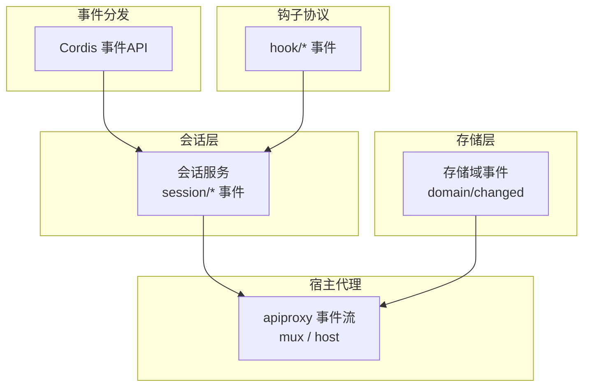
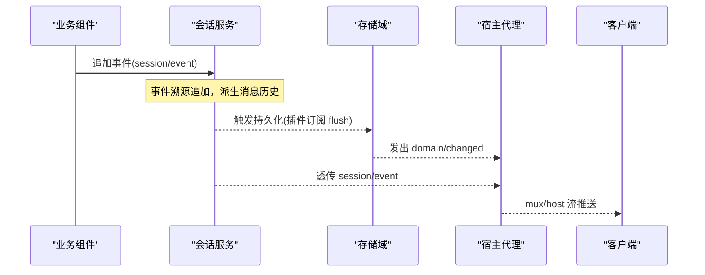
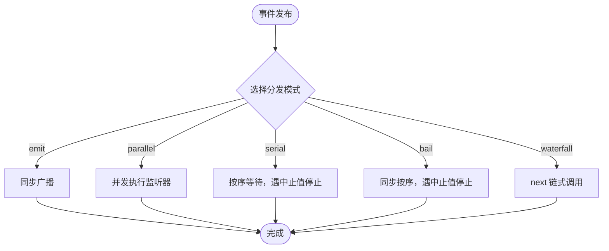
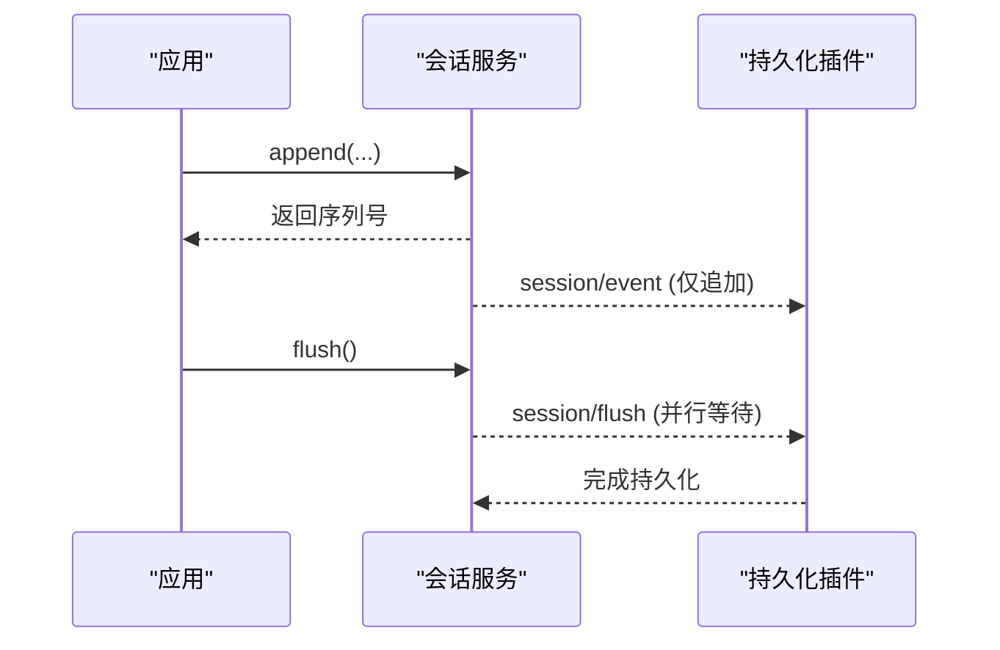
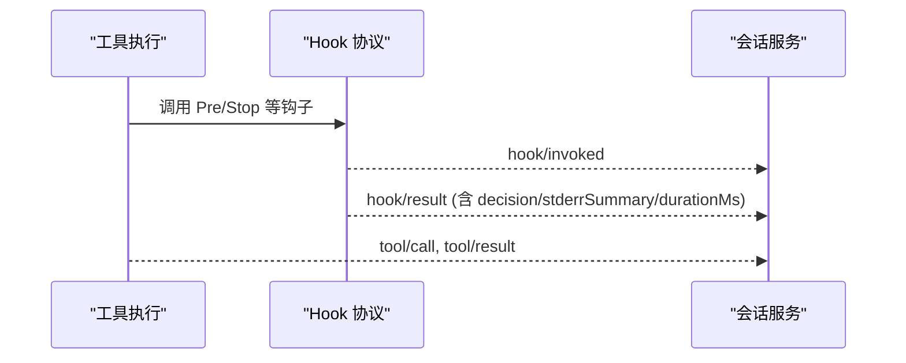
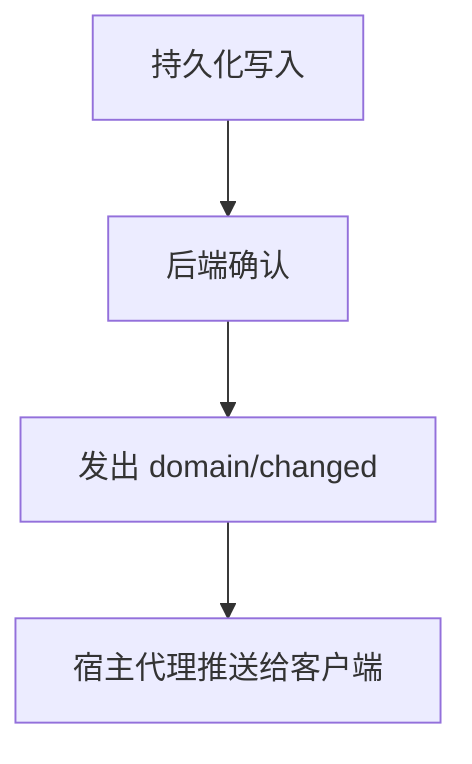
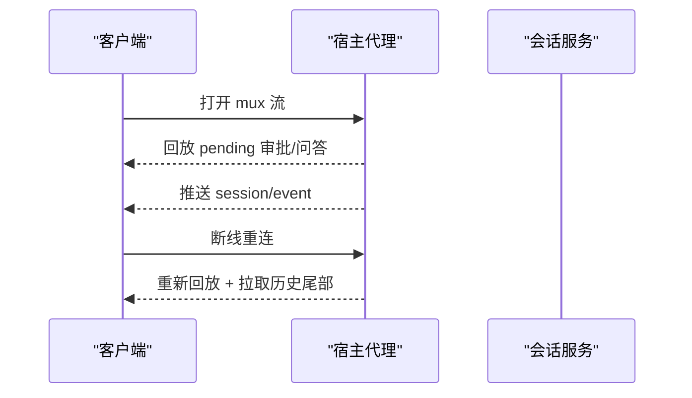
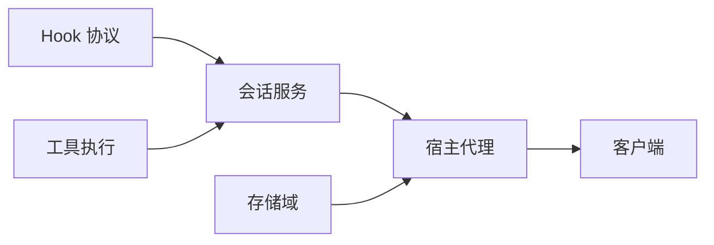

# 事件系统

<cite>
**本文引用的文件**
- [packages/core/session/src/index.ts](file://packages/core/session/src/index.ts)
- [packages/storage/storage-domain/src/events.ts](file://packages/storage/storage-domain/src/events.ts)
- [packages/host/apiproxy/src/api/events.ts](file://packages/host/apiproxy/src/api/events.ts)
- [packages/hooks/hook-protocol/src/events.ts](file://packages/hooks/hook-protocol/src/events.ts)
- [docs/cordis-api/events.md](file://docs/cordis-api/events.md)
- [docs/event-producer-consumer.md](file://docs/event-producer-consumer.md)
</cite>

## 目录
1. [简介](#简介)
2. [项目结构](#项目结构)
3. [核心组件](#核心组件)
4. [架构总览](#架构总览)
5. [详细组件分析](#详细组件分析)
6. [依赖关系分析](#依赖关系分析)
7. [性能考量](#性能考量)
8. [故障排查指南](#故障排查指南)
9. [结论](#结论)
10. [附录](#附录)

## 简介
本文件系统性阐述 DeepSeek Harness 的事件系统，覆盖事件的定义、发布与订阅机制；会话事件、工具事件、系统事件的使用场景与处理方式；优先级控制与过滤机制；组件间解耦通信模式；以及事件的持久化存储与回放机制。文档同时提供事件流图与数据流向分析，并总结事件驱动架构的设计模式与最佳实践。

## 项目结构
DeepSeek Harness 的事件体系由以下关键部分构成：
- 事件分发 API（Cordis）：提供并发/串行/瀑布/同步等分发模式，以及监听器注册与一次性监听能力。
- 会话服务：以事件溯源方式维护会话日志，并通过事件对外暴露会话生命周期与追加事件。
- 存储域事件：在持久化写入成功后发出领域变更事件，作为跨进程变更推送的源头。
- 宿主代理事件：通过 mux 与 host 两个逻辑流，将会话事件、审批/问答、后台任务、投影等推送到客户端。
- Hook 协议事件：记录钩子调用的“已调用/结果”对，用于审计与可观测性。

图表来源
- [docs/cordis-api/events.md:8-123](file://docs/cordis-api/events.md#L8-L123)
- [packages/core/session/src/index.ts:37-86](file://packages/core/session/src/index.ts#L37-L86)
- [packages/storage/storage-domain/src/events.ts:36-47](file://packages/storage/storage-domain/src/events.ts#L36-L47)
- [packages/host/apiproxy/src/api/events.ts:46-155](file://packages/host/apiproxy/src/api/events.ts#L46-L155)
- [packages/hooks/hook-protocol/src/events.ts:70-104](file://packages/hooks/hook-protocol/src/events.ts#L70-L104)

章节来源
- [docs/cordis-api/events.md:8-123](file://docs/cordis-api/events.md#L8-L123)
- [packages/core/session/src/index.ts:37-86](file://packages/core/session/src/index.ts#L37-L86)
- [packages/storage/storage-domain/src/events.ts:36-47](file://packages/storage/storage-domain/src/events.ts#L36-L47)
- [packages/host/apiproxy/src/api/events.ts:46-155](file://packages/host/apiproxy/src/api/events.ts#L46-L155)
- [packages/hooks/hook-protocol/src/events.ts:70-104](file://packages/hooks/hook-protocol/src/events.ts#L70-L104)

## 核心组件
- Cordis 事件分发 API
  - 提供 ctx.parallel、ctx.emit、ctx.serial、ctx.bail、ctx.waterfall 五种分发模式，以及 ctx.on、ctx.once 注册监听器。
  - 支持 EventOptions（prepend、global）控制监听器顺序与上下文过滤。
- 会话服务
  - 声明 session/created、session/disposed、session/event、session/flush 等事件，采用 emit/parallel 模式。
  - 事件溯源：append-only 日志，派生 LLM 消息历史；持久化插件订阅 session/event 并在 session/flush 时落盘。
- 存储域事件
  - 在每次持久化写入成功后发出 domain/changed，携带新快照与操作类型（put/deleted），保证跨进程一致性。
- 宿主代理事件
  - mux 流：透传 session/event、审批/问答、队列、作业、投影等；host 流：会话增删、运行状态、工作区变更、远程事件转发等。
- Hook 协议事件
  - hook/invoked 与 hook/result 成对记录钩子调用与结果，包含 stderr 摘要与耗时，用于审计与诊断。

章节来源
- [docs/cordis-api/events.md:8-123](file://docs/cordis-api/events.md#L8-L123)
- [packages/core/session/src/index.ts:37-86](file://packages/core/session/src/index.ts#L37-L86)
- [packages/storage/storage-domain/src/events.ts:36-47](file://packages/storage/storage-domain/src/events.ts#L36-L47)
- [packages/host/apiproxy/src/api/events.ts:46-155](file://packages/host/apiproxy/src/api/events.ts#L46-L155)
- [packages/hooks/hook-protocol/src/events.ts:70-104](file://packages/hooks/hook-protocol/src/events.ts#L70-L104)

## 架构总览
下图展示从业务侧到宿主侧的事件流转路径：会话服务产生事件，存储域在持久化后发出变更事件，宿主代理聚合并推送到客户端；Hook 事件与工具执行链路共同形成完整的可观测闭环。

图表来源
- [packages/core/session/src/index.ts:37-86](file://packages/core/session/src/index.ts#L37-L86)
- [packages/storage/storage-domain/src/events.ts:36-47](file://packages/storage/storage-domain/src/events.ts#L36-L47)
- [packages/host/apiproxy/src/api/events.ts:46-155](file://packages/host/apiproxy/src/api/events.ts#L46-L155)

## 详细组件分析

### 事件分发与订阅（Cordis）
- 分发模式
  - emit：同步广播，忽略返回值。
  - parallel：并发执行所有监听器，全部完成后返回。
  - serial：按序等待，直到某个监听器返回“中止值”。
  - bail：同步按序调用，遇到第一个“中止值”即停止。
  - waterfall：最后一个参数为 next 回调，监听器可选择调用 next 继续链式处理或拦截。
- 订阅选项
  - prepend：将监听器插入到已有监听器之前。
  - global：绕过上下文过滤器检查，全局接收事件。
- 一次性监听
  - once：首次触发后自动移除监听器。

图表来源
- [docs/cordis-api/events.md:8-123](file://docs/cordis-api/events.md#L8-L123)

章节来源
- [docs/cordis-api/events.md:8-123](file://docs/cordis-api/events.md#L8-L123)

### 会话事件（Session Events）
- 事件类型
  - session/created：会话创建公告，支持作用域过滤。
  - session/disposed：会话销毁公告。
  - session/event：追加事件后的“仅追加”日志流，监听器在提交前拿到快照但回调在提交后执行。
  - session/flush：并行等待持久化检查点。
- 使用场景
  - 持久化插件订阅 session/event 进行增量落盘，并在 session/flush 时确保落盘完成。
  - 其他组件基于 session/event 做实时推导（如标题生成、压缩策略、遥测记录）。

图表来源
- [packages/core/session/src/index.ts:37-86](file://packages/core/session/src/index.ts#L37-L86)

章节来源
- [packages/core/session/src/index.ts:37-86](file://packages/core/session/src/index.ts#L37-L86)

### 工具事件（Tool Events）与 Hook 事件
- 工具执行链路
  - 工具执行前后通过 waterfall 事件（如 tools/pre-execute、tools/post-execute）扩展行为（超时、重试、检查点等）。
  - 工具调用与结果通过 session/event 中的 tool/call 与 tool/result 事件表达。
- Hook 事件
  - hook/invoked：记录钩子调用点、处理器 ID、匹配规则等。
  - hook/result：记录决策、退出码、stderr 摘要与耗时，用于审计与诊断。

图表来源
- [packages/hooks/hook-protocol/src/events.ts:70-104](file://packages/hooks/hook-protocol/src/events.ts#L70-L104)
- [docs/event-producer-consumer.md:55-59](file://docs/event-producer-consumer.md#L55-L59)

章节来源
- [packages/hooks/hook-protocol/src/events.ts:70-104](file://packages/hooks/hook-protocol/src/events.ts#L70-L104)
- [docs/event-producer-consumer.md:55-59](file://docs/event-producer-consumer.md#L55-L59)

### 系统事件（System Events）
- 存储域变更
  - domain/changed：在持久化写入成功后发出，携带 domain/table/key 与操作类型（put/deleted），保证跨进程一致性与最终可见性。
- 宿主级事件
  - host 流推送会话增删、运行状态、工作区变更、归档会话变更等，供客户端维持权威视图。

图表来源
- [packages/storage/storage-domain/src/events.ts:36-47](file://packages/storage/storage-domain/src/events.ts#L36-L47)
- [packages/host/apiproxy/src/api/events.ts:110-155](file://packages/host/apiproxy/src/api/events.ts#L110-L155)

章节来源
- [packages/storage/storage-domain/src/events.ts:36-47](file://packages/storage/storage-domain/src/events.ts#L36-L47)
- [packages/host/apiproxy/src/api/events.ts:110-155](file://packages/host/apiproxy/src/api/events.ts#L110-L155)

### 事件优先级与过滤
- 优先级控制
  - 通过 EventOptions.prepend 将监听器插入到前面，实现更高优先级的处理。
  - 不同分发模式影响执行顺序与短路行为（serial/bail 可在首个“中止值”处提前结束）。
- 上下文过滤
  - 会话事件支持作用域过滤，agent-scoped 监听器仅接收通过该 agent 上下文进入的会话事件。
  - 通过 EventOptions.global 可绕过过滤，强制全局接收。

章节来源
- [docs/cordis-api/events.md:173-187](file://docs/cordis-api/events.md#L173-L187)
- [packages/core/session/src/index.ts:42-86](file://packages/core/session/src/index.ts#L42-L86)

### 组件间解耦通信模式
- 发布-订阅：业务组件不直接耦合具体实现，通过事件名与载荷约定进行通信。
- 链式处理：waterfall 模式允许监听器包装后续处理，实现横切关注点（如权限、检查点、重试）的灵活组合。
- 单向数据流：会话事件仅追加，下游消费方基于事件重建状态，避免反向修改带来的副作用。

章节来源
- [docs/cordis-api/events.md:97-123](file://docs/cordis-api/events.md#L97-L123)
- [packages/core/session/src/index.ts:37-86](file://packages/core/session/src/index.ts#L37-L86)

### 持久化存储与回放
- 持久化
  - 会话服务采用事件溯源：所有变更以事件形式追加，持久化插件订阅 session/event 并负责落盘。
  - 存储域在写入成功后发出 domain/changed，确保跨进程可见性。
- 回放
  - 宿主代理的 mux 流在打开时会回放每个会话尚未处理的审批/问答请求帧，并提供 lastSeq 以便客户端断线重连后恢复。
  - 客户端基于历史尾部与投影块重建视图，保证多端一致性。

图表来源
- [packages/host/apiproxy/src/api/events.ts:46-108](file://packages/host/apiproxy/src/api/events.ts#L46-L108)
- [packages/core/session/src/index.ts:37-86](file://packages/core/session/src/index.ts#L37-L86)

章节来源
- [packages/host/apiproxy/src/api/events.ts:46-108](file://packages/host/apiproxy/src/api/events.ts#L46-L108)
- [packages/core/session/src/index.ts:37-86](file://packages/core/session/src/index.ts#L37-L86)

## 依赖关系分析
- 生产者-消费者矩阵显示各包之间的广泛事件依赖关系，体现事件驱动的松耦合特性。
- 典型依赖：
  - 会话服务是大量组件的事件源（如 goal、compaction、hooks、telemetry 等）。
  - 存储域变更被 apiproxy 与 workspace 等消费，用于跨进程同步。
  - 宿主代理集中汇聚并转发各类事件至客户端。

图表来源
- [docs/event-producer-consumer.md:8-66](file://docs/event-producer-consumer.md#L8-L66)
- [packages/core/session/src/index.ts:37-86](file://packages/core/session/src/index.ts#L37-L86)
- [packages/storage/storage-domain/src/events.ts:36-47](file://packages/storage/storage-domain/src/events.ts#L36-L47)
- [packages/host/apiproxy/src/api/events.ts:46-155](file://packages/host/apiproxy/src/api/events.ts#L46-L155)

章节来源
- [docs/event-producer-consumer.md:8-66](file://docs/event-producer-consumer.md#L8-L66)

## 性能考量
- 分发模式选择
  - 高吞吐场景优先使用 parallel 并发执行监听器，减少整体延迟。
  - 需要严格顺序或短路控制的场景使用 serial/bail。
  - 横切逻辑（如权限、检查点）适合 waterfall 链式组合。
- 事件体积与频率
  - 会话事件仅追加，建议合理拆分事件粒度，避免单条事件过大。
  - 存储域变更仅在持久化成功后发出，降低无效推送。
- 回放与重连
  - 利用 lastSeq 与历史尾部回放，减少全量拉取开销。
  - 客户端维护投影缓存，提升渲染性能。

[本节为通用指导，无需特定文件引用]

## 故障排查指南
- 事件未到达
  - 检查监听器是否通过 on/once 正确注册，是否设置了 prepend/global。
  - 确认事件分发模式是否符合预期（如 waterfall 需调用 next）。
- 持久化不一致
  - 确认持久化插件订阅了 session/event，并在 session/flush 中完成落盘。
  - 观察 domain/changed 是否发出，验证后端确认流程。
- 回放异常
  - 检查 mux 流的 lastSeq 与历史尾部回放是否正确衔接。
  - 确认审批/问答请求帧的 rpcId 复用与客户端状态收敛。

章节来源
- [packages/core/session/src/index.ts:37-86](file://packages/core/session/src/index.ts#L37-L86)
- [packages/storage/storage-domain/src/events.ts:36-47](file://packages/storage/storage-domain/src/events.ts#L36-L47)
- [packages/host/apiproxy/src/api/events.ts:46-108](file://packages/host/apiproxy/src/api/events.ts#L46-L108)

## 结论
DeepSeek Harness 的事件系统以 Cordis 分发 API 为核心，结合会话事件溯源、存储域变更与宿主代理推送，构建了高内聚、低耦合的组件通信机制。通过多种分发模式与优先级控制，满足复杂业务场景下的顺序、短路与横切需求；借助事件回放与投影，实现跨进程一致性与客户端高效渲染。遵循事件驱动的最佳实践，可有效提升系统的可扩展性与可维护性。

[本节为总结性内容，无需特定文件引用]

## 附录
- 事件模式速查
  - emit：同步广播
  - parallel：并发执行
  - serial：按序等待，遇中止值停止
  - bail：同步按序，遇中止值停止
  - waterfall：next 链式调用
- 常用事件
  - 会话：session/created、session/disposed、session/event、session/flush
  - 存储：domain/changed
  - 宿主：mux/host 流中的 session/event、approval/question、jobs、workspace 等
  - Hook：hook/invoked、hook/result

[本节为补充信息，无需特定文件引用]