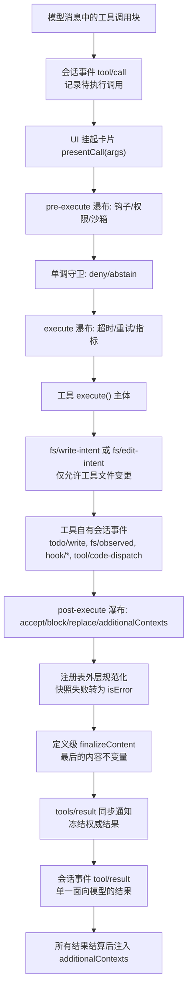
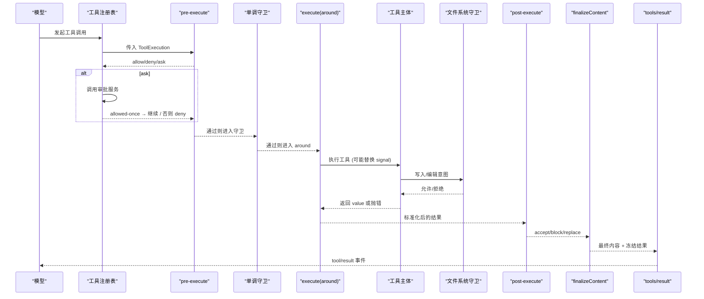
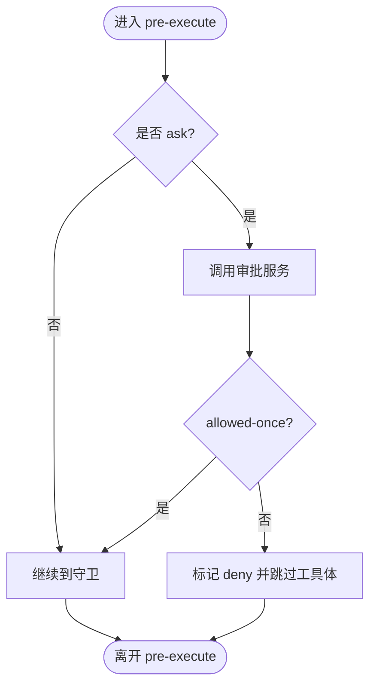
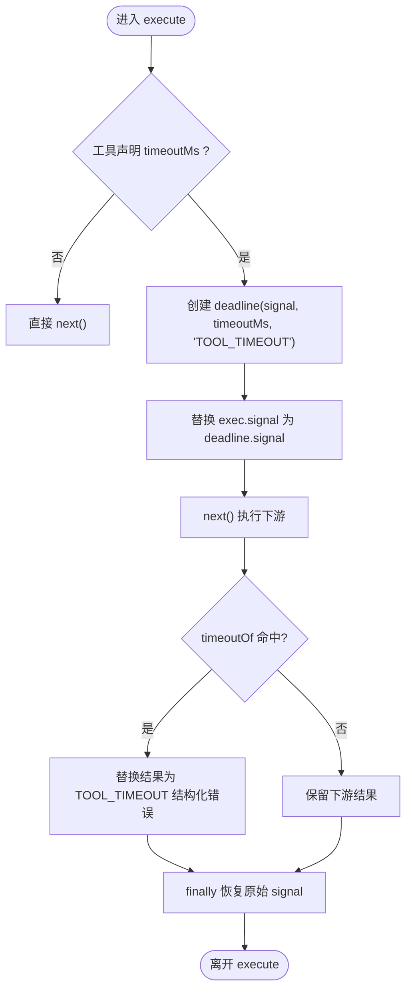
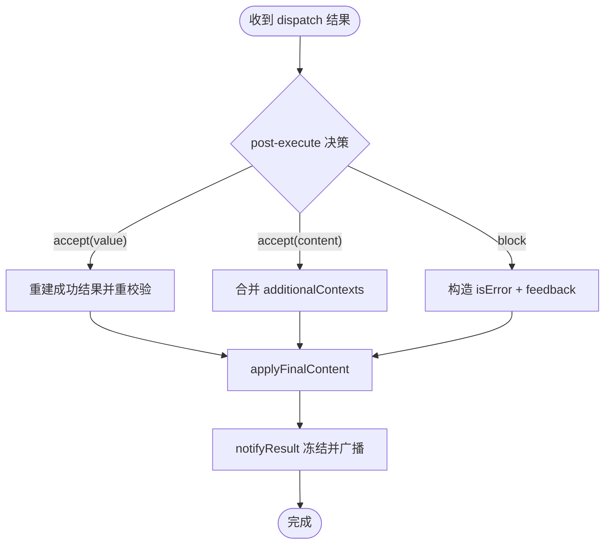
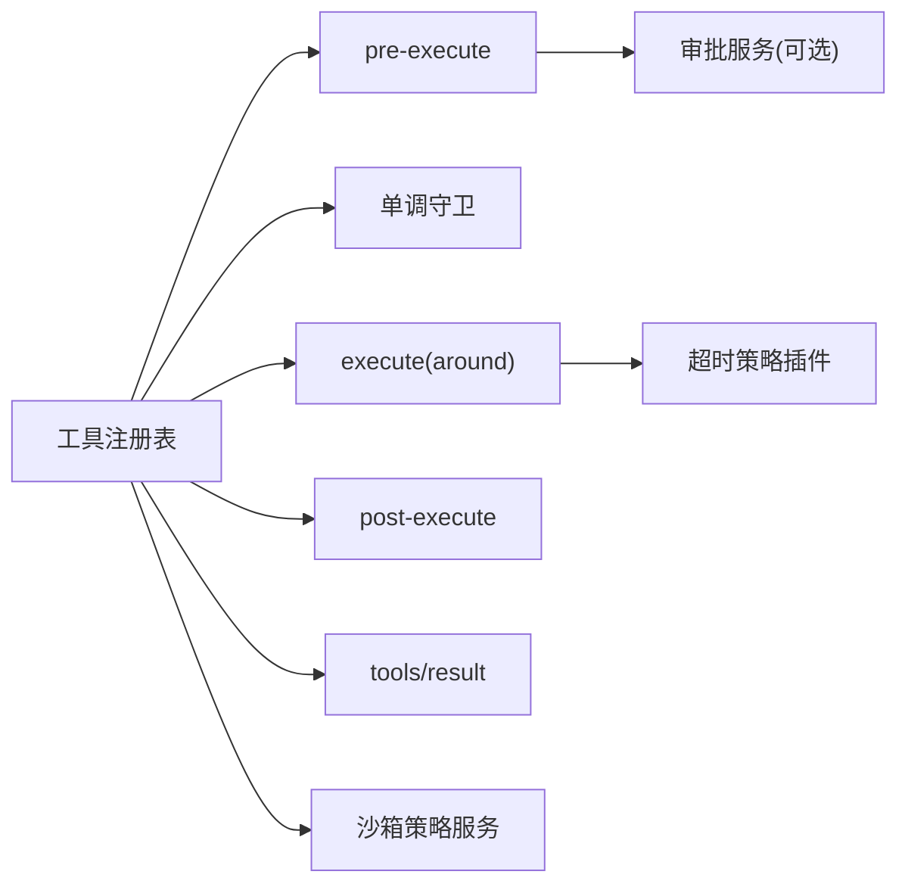

# 工具执行管道

<cite>
**本文引用的文件**
- [packages/core/tools/src/index.ts](file://packages/core/tools/src/index.ts)
- [packages/guard/timeout-policy/src/index.ts](file://packages/guard/timeout-policy/src/index.ts)
- [docs/subsystems/tools.md](file://docs/subsystems/tools.md)
- [docs/tool-execution-pipeline.md](file://docs/tool-execution-pipeline.md)
- [docs/subsystems/sandbox.md](file://docs/subsystems/sandbox.md)
- [docs/subsystems/approval.md](file://docs/subsystems/approval.md)
- [docs/subsystems/permission-presets.md](file://docs/subsystems/permission-presets.md)
- [packages/core/tools/tests/invariant.spec.ts](file://packages/core/tools/tests/invariant.spec.ts)
- [packages/core/tools/tests/code-mode.spec.ts](file://packages/core/tools/tests/code-mode.spec.ts)
- [packages/core/tools/tests/tools.spec.ts](file://packages/core/tools/tests/tools.spec.ts)
- [packages/fs/tool-fs/tests/tools.spec.ts](file://packages/fs/tool-fs/tests/tools.spec.ts)
</cite>

## 目录
1. [简介](#简介)
2. [项目结构](#项目结构)
3. [核心组件](#核心组件)
4. [架构总览](#架构总览)
5. [详细组件分析](#详细组件分析)
6. [依赖关系分析](#依赖关系分析)
7. [性能考量](#性能考量)
8. [故障排查指南](#故障排查指南)
9. [结论](#结论)
10. [附录](#附录)

## 简介
本文件系统化说明 DeepSeek Harness 中“工具执行管道”的完整生命周期：从模型生成工具调用到最终结果返回的全过程。重点覆盖 pre-execute、execute、post-execute 三阶段处理逻辑，权限检查与审批、沙箱隔离、文件系统守卫等安全机制；描述工具结果的规范化与最终输出格式；解释超时控制、重试机制与错误恢复策略；提供工具执行流程图与关键节点调试方法；并给出自定义工具开发与集成的最佳实践。

## 项目结构
- 工具注册与执行管线位于 core/tools 包，提供 ToolDefinition、ToolExecutionResult 以及 tools/pre-execute、tools/execute、tools/post-execute、tools/result 等事件。
- 超时策略以插件形式挂载在 tools/execute 上，通过 exec.signal 协作式中断。
- 沙箱子系统提供进程级文件访问限制（read-only/workspace-write/danger-full-access），并通过策略服务解析每调用的边界。
- 用户审批子系统为 pre-execute 阶段的 ask 决策提供可插拔答案器链，支持 ask/never 策略。
- 权限预设将沙箱模式与审批策略打包为可选能力，便于 UI 选择。

图表来源
- [docs/tool-execution-pipeline.md:8-60](file://docs/tool-execution-pipeline.md#L8-L60)
- [packages/core/tools/src/index.ts:152-197](file://packages/core/tools/src/index.ts#L152-L197)

章节来源
- [docs/tool-execution-pipeline.md:1-63](file://docs/tool-execution-pipeline.md#L1-L63)
- [packages/core/tools/src/index.ts:152-197](file://packages/core/tools/src/index.ts#L152-L197)

## 核心组件
- 工具定义与注册：ToolDefinition 包含参数 schema、输出 schema、execute、可选 finalizeContent、timeoutMs、isConcurrencySafe、presentCall/presentResult。注册表负责白名单投影到模型可见的 ToolSchema，不泄露执行回调。
- 执行输入与上下文：ToolExecutionInput 经注册表物化为 ToolExecution，分配 token、rootCallId 并冻结参数；ToolRunContext 暴露 deferContext/concludeTurn。
- 水线与决策：
  - tools/pre-execute：allow/deny/ask，缺失审批通道时 ask 降级为 deny。
  - 单调守卫：不可逆地拒绝，保护身份。
  - tools/execute：around 包装，可替换 exec.signal（必须恢复）。
  - tools/post-execute：accept/block/replace content/value，附加 additionalContexts。
  - finalizeContent：定义级内容终态修正，只改 content。
  - tools/result：冻结的最终结果观察点。
- 结果类型：ToolExecutionSuccess/ToolExecutionFailure 统一为 ToolExecutionResult；value 仅在成功时存在且被冻结；content 由 output.render 生成并可被 post-execute/finalizeContent 调整。

章节来源
- [docs/subsystems/tools.md:9-96](file://docs/subsystems/tools.md#L9-L96)
- [docs/subsystems/tools.md:170-404](file://docs/subsystems/tools.md#L170-L404)
- [packages/core/tools/src/index.ts:152-197](file://packages/core/tools/src/index.ts#L152-L197)

## 架构总览
下图展示一次工具调用从进入管线到最终结果的全链路交互，包括审批、守卫、超时、沙箱、文件系统守卫、结果规范化与最终通知。

图表来源
- [packages/core/tools/src/index.ts:152-197](file://packages/core/tools/src/index.ts#L152-L197)
- [docs/subsystems/approval.md:51-88](file://docs/subsystems/approval.md#L51-L88)
- [docs/subsystems/sandbox.md:9-39](file://docs/subsystems/sandbox.md#L9-L39)

## 详细组件分析

### pre-execute 阶段：权限与审批
- 功能：允许、拒绝或请求审批。若未配置审批服务或无 agent，则 ask 降级为 deny。
- 行为：异步监听需响应 exec.signal；注册表在 settle 后重新检查取消。
- 与审批集成：通过 ctx.approval.request 获取 one-shot 决策，allowed-once 放行，其他均拒绝。
- 与权限预设：可将沙箱模式与审批策略打包为预设，切换时写回各自 setter。

图表来源
- [packages/core/tools/src/index.ts:152-153](file://packages/core/tools/src/index.ts#L152-L153)
- [docs/subsystems/approval.md:31-47](file://docs/subsystems/approval.md#L31-L47)
- [docs/subsystems/permission-presets.md:9-44](file://docs/subsystems/permission-presets.md#L9-L44)

章节来源
- [docs/subsystems/tools.md:376-404](file://docs/subsystems/tools.md#L376-L404)
- [docs/subsystems/approval.md:51-88](file://docs/subsystems/approval.md#L51-L88)
- [docs/subsystems/permission-presets.md:46-68](file://docs/subsystems/permission-presets.md#L46-L68)

### 单调守卫：不可逆拒绝
- 作用：在 pre-execute 之后、execute 之前运行，只能拒绝或保持原状，不能“撤销”之前的拒绝。
- 特点：身份保护，顺序无关紧要；任何匹配守卫均可返回拒绝原因。

章节来源
- [docs/subsystems/tools.md:313-325](file://docs/subsystems/tools.md#L313-L325)

### execute 阶段：超时、重试与指标
- 超时控制：timeout-policy 插件读取工具声明的 timeoutMs，使用 deadline(exec.signal, timeoutMs, 'TOOL_TIMEOUT') 协作式中断；若自身定时器先触发，则将结果替换为结构化 TOOL_TIMEOUT 错误。
- 信号替换：wrapper 临时替换 exec.signal 并在 finally 恢复，确保 post-execute 看到原始 caller 信号。
- 重试机制：重试通常发生在更上层（如 llm-retry），不在工具管道内默认启用；工具本身可通过 around 自行实现重试。
- 指标/埋点：可在 execute 瀑布中统计耗时、吞吐等。

图表来源
- [packages/guard/timeout-policy/src/index.ts:1-81](file://packages/guard/timeout-policy/src/index.ts#L1-L81)
- [packages/guard/timeout-policy/README.md:18-58](file://packages/guard/timeout-policy/README.md#L18-L58)

章节来源
- [packages/guard/timeout-policy/src/index.ts:1-81](file://packages/guard/timeout-policy/src/index.ts#L1-L81)
- [packages/guard/timeout-policy/README.md:18-58](file://packages/guard/timeout-policy/README.md#L18-L58)

### 文件系统守卫：write-intent/edit-intent
- 约束：工具对文件的写入/编辑必须通过 fs/write-intent 或 fs/edit-intent 进行，受限于沙箱模式与根目录。
- 行为：读前检查位于 fs/* 事件层；工具体只能在允许的范围内变更工作区与后端定义的临时区域。
- 沙箱模式：read-only/workspace-write/danger-full-access；workspace-write 下允许写工作区与后端 temp。

章节来源
- [docs/tool-execution-pipeline.md:19-22](file://docs/tool-execution-pipeline.md#L19-L22)
- [docs/subsystems/sandbox.md:9-39](file://docs/subsystems/sandbox.md#L9-L39)
- [packages/fs/tool-fs/tests/tools.spec.ts:84-99](file://packages/fs/tool-fs/tests/tools.spec.ts#L84-L99)

### post-execute 阶段：结果规范化与最终输出
- 决策：accept（保留或替换 content/value）、block（转为 isError 并携带反馈）、附加 additionalContexts。
- 规范化：注册表对外层快照/渲染/呈现元数据异常进行捕获，转为 JSON-safe isError；finalizeContent 仅能修改 content。
- 最终输出：冻结执行对象与结果，触发 tools/result 观察者；随后记录会话事件 tool/result，作为单一面向模型的结果。

图表来源
- [packages/core/tools/src/index.ts:1609-1676](file://packages/core/tools/src/index.ts#L1609-L1676)
- [docs/subsystems/tools.md:376-404](file://docs/subsystems/tools.md#L376-L404)

章节来源
- [packages/core/tools/src/index.ts:1609-1676](file://packages/core/tools/src/index.ts#L1609-L1676)
- [docs/subsystems/tools.md:376-404](file://docs/subsystems/tools.md#L376-L404)

### Code Mode 子调度与日志
- Code Mode 通过 run_code 传输将程序内的子调用纳入同一管道；子调用携带父 token，记录 tool/code-dispatch，返回拒绝为绑定拒绝，且不注入 additionalContexts 以保持调用/结果相邻性。
- tools/code-dispatch-log 允许在持久化日志副本中替换内容（例如溢出预览），不影响程序收到的 value 与模型可见结果。

章节来源
- [docs/tool-execution-pipeline.md:60-62](file://docs/tool-execution-pipeline.md#L60-L62)
- [packages/core/tools/src/index.ts:177-189](file://packages/core/tools/src/index.ts#L177-L189)

### 错误恢复与取消
- 取消传播：execute 阶段 wrapper 替换 signal 但会恢复；post-execute 中若发生取消，成功结果会被替换为 ABORTED 或 ABORTED_BEFORE_DISPATCH。
- 超时：timeout-policy 将超时映射为 TOOL_TIMEOUT；若工具忽略信号，不会硬杀，需工具协作。
- 测试保障：重复/乱序阶段会被拒绝；pre-execute 抛出则跳过 post-execute 但仍产出错误结果。

章节来源
- [packages/core/tools/tests/invariant.spec.ts:48-70](file://packages/core/tools/tests/invariant.spec.ts#L48-L70)
- [packages/core/tools/tests/code-mode.spec.ts:970-999](file://packages/core/tools/tests/code-mode.spec.ts#L970-L999)
- [packages/core/tools/tests/tools.spec.ts:1448-1472](file://packages/core/tools/tests/tools.spec.ts#L1448-L1472)

## 依赖关系分析
- 工具注册表依赖：
  - 审批服务（可选）：用于 ask 决策。
  - 沙箱策略服务：解析 per-call 的文件访问边界。
  - 超时策略插件：通过 tools/execute 注入。
  - 代码运行时：Code Mode 下的 run_code 工具与 SDK 片段。
- 事件流：
  - tools/pre-execute → 单调守卫 → tools/execute → tools/post-execute → finalizeContent → tools/result。
  - 持久化日志：tool/call、tool/result、approval/asked+decided、tool/code-dispatch（Code Mode）。

图表来源
- [packages/core/tools/src/index.ts:152-197](file://packages/core/tools/src/index.ts#L152-L197)
- [packages/guard/timeout-policy/src/index.ts:1-81](file://packages/guard/timeout-policy/src/index.ts#L1-L81)
- [docs/subsystems/sandbox.md:9-39](file://docs/subsystems/sandbox.md#L9-L39)
- [docs/subsystems/approval.md:51-88](file://docs/subsystems/approval.md#L51-L88)

章节来源
- [packages/core/tools/src/index.ts:152-197](file://packages/core/tools/src/index.ts#L152-L197)

## 性能考量
- 并行执行：工具可声明 isConcurrencySafe 以加入并行组；未知/无效分类退化为独占。
- 快照与冻结：value 在成功路径被快照、校验并冻结，避免后续突变；content 与 presentationMeta 在最终阶段计算，减少重复开销。
- 超时协作：timeoutMs 仅协作式中断，避免抢占式 kill 带来的资源浪费；工具应尽快响应 exec.signal。
- 日志裁剪：Code Mode 的 code-dispatch-log 可对超大结果做预览裁剪，降低持久化与 UI 压力。

[本节为通用指导，无需特定文件引用]

## 故障排查指南
- 常见错误定位
  - 超时：检查工具是否声明 timeoutMs 且正确响应 exec.signal；查看结果 error.code 是否为 TOOL_TIMEOUT。
  - 审批拒绝：确认审批服务可用、agent 存在；检查 approval/request 答案器链是否返回 allowed-once。
  - 沙箱拒绝：核对当前沙箱模式与 workspaceRoot；区分 runner failure 与 confinement denial。
  - 文件系统守卫：确认 write/edit 走 fs/intent 通道；检查目标路径在工作区或后端 temp 内。
  - post-execute 失败：若 listener 抛错，将被捕获为 isError；additionalContexts 在 block 时仅保留显式提供的部分。
- 调试建议
  - 在 pre/execute/post 各阶段添加轻量日志，关注 exec.name、callId、signal 状态。
  - 使用 tools/result 观察者打印冻结后的最终结果，确保与持久化一致。
  - 针对 Code Mode，订阅 tools/code-dispatch-log 查看子调用的持久化副本内容。

章节来源
- [packages/guard/timeout-policy/src/index.ts:1-81](file://packages/guard/timeout-policy/src/index.ts#L1-L81)
- [docs/subsystems/approval.md:51-88](file://docs/subsystems/approval.md#L51-L88)
- [docs/subsystems/sandbox.md:96-157](file://docs/subsystems/sandbox.md#L96-L157)
- [packages/core/tools/src/index.ts:1609-1676](file://packages/core/tools/src/index.ts#L1609-L1676)

## 结论
DeepSeek Harness 的工具执行管道以可扩展的水线为核心，将权限、审批、沙箱、超时、结果规范化与最终输出解耦为可组合的阶段。通过严格的冻结与规范化保证结果一致性，借助协作式超时与单调守卫提升安全性与可控性。开发者可基于该管道快速构建可靠、可观测、可审计的工具生态。

[本节为总结性内容，无需特定文件引用]

## 附录

### 自定义工具开发与集成最佳实践
- 明确参数与输出 schema：使用 defineTool 与 ValueSchemaSpec 保证类型推断与运行时校验一致。
- 实现健壮的执行函数：
  - 始终观察并转发 exec.signal，确保可被取消/超时。
  - 仅通过 fs/intent 进行文件变更，遵循沙箱模式与工作区边界。
  - 如需并发，谨慎声明 isConcurrencySafe，并确保共享状态线程安全。
- 设计友好的 UI 呈现：
  - 提供 presentCall/presentResult 以生成中性视图词汇（终端、diff、搜索、读取、网页等）。
  - 使用 finalizeContent 做最终内容裁剪或脱敏，但不改变 value 与 meta。
- 利用管道扩展点：
  - pre-execute：实现权限/审批/沙箱前置检查。
  - execute：实现超时、重试、指标收集。
  - post-execute：实现内容替换、阻断与附加上下文。
- 可观测性与回放：
  - 通过 tools/result 观察者记录冻结结果；在 Code Mode 下使用 tools/code-dispatch-log 定制持久化副本。
  - 结合审批与沙箱事件，确保回放可重现策略与边界。

章节来源
- [docs/subsystems/tools.md:9-96](file://docs/subsystems/tools.md#L9-L96)
- [docs/subsystems/tools.md:170-404](file://docs/subsystems/tools.md#L170-L404)
- [packages/core/tools/src/index.ts:152-197](file://packages/core/tools/src/index.ts#L152-L197)