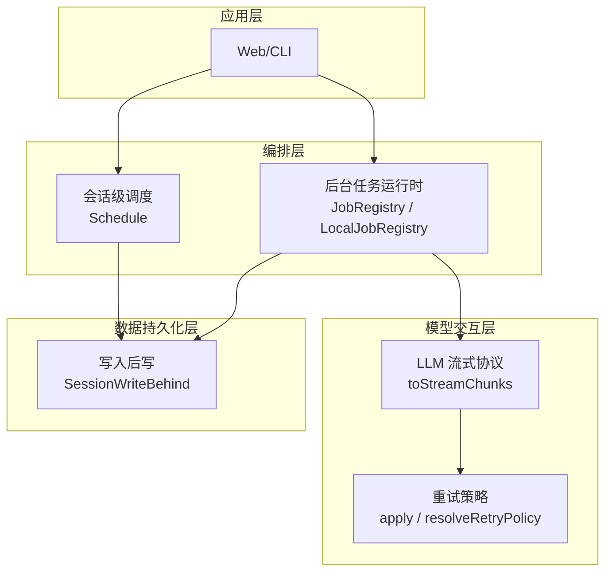
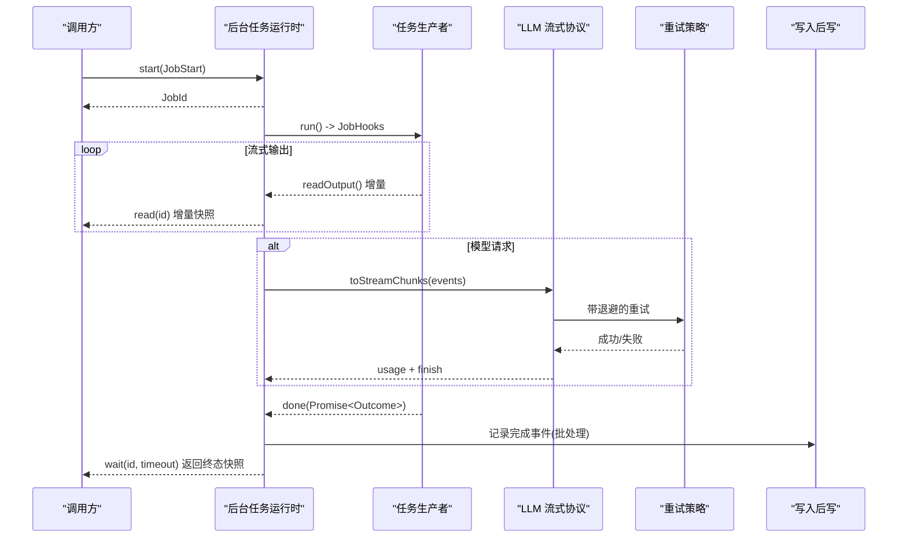
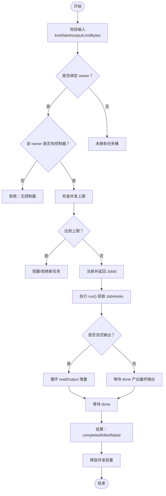
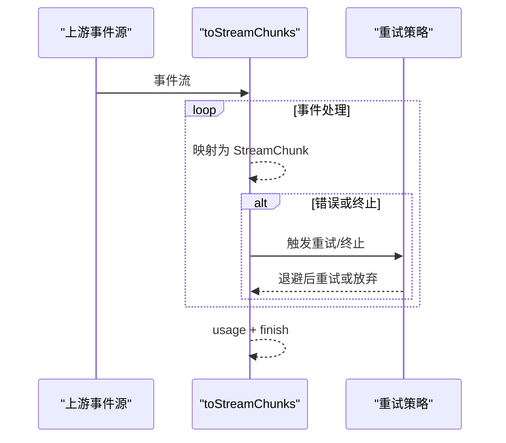
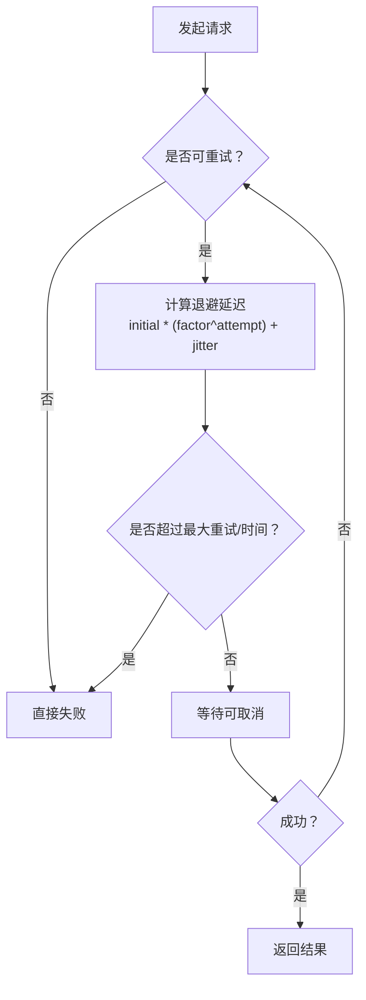
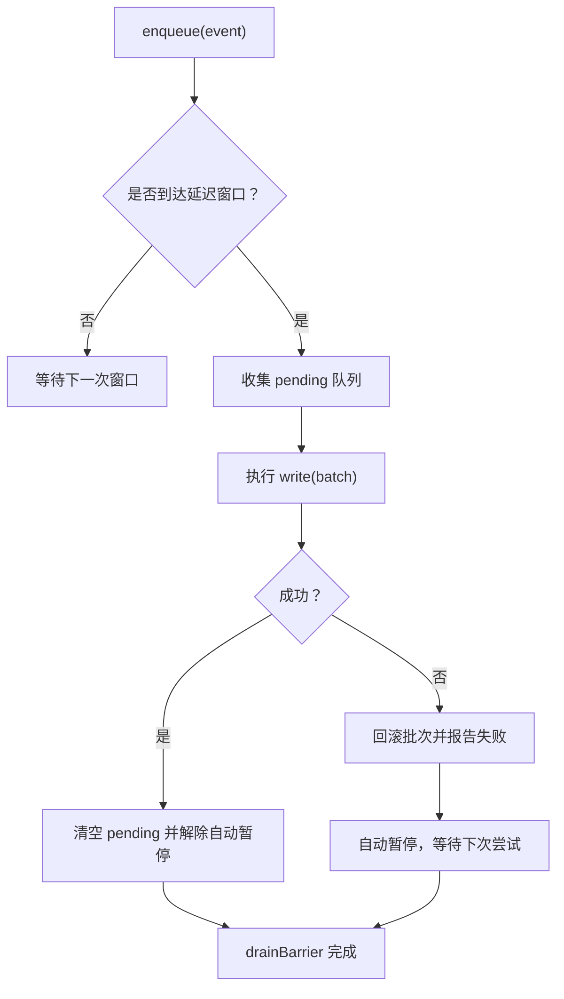
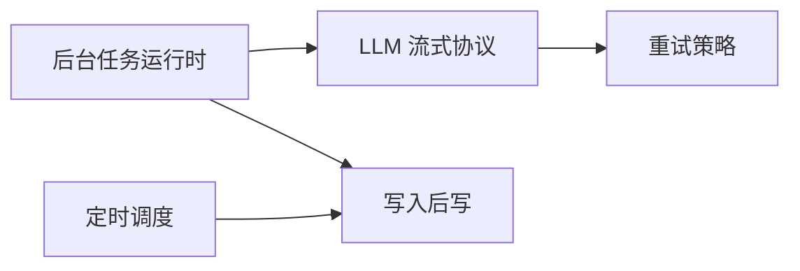

# 异步处理模式

<cite>
**本文引用的文件**
- [jobs.md](file://docs/subsystems/jobs.md)
- [jobs.spec.ts](file://packages/jobs/jobs-local/tests/jobs.spec.ts)
- [jobs.ts](file://packages/host/apiproxy/src/api/jobs.ts)
- [stream.ts](file://packages/llm/llm-pi-ai/src/stream.ts)
- [retry-policy.ts](file://packages/llm/llm/src/retry-policy.ts)
- [index.ts](file://packages/llm/llm-retry/src/index.ts)
- [write-behind.ts](file://packages/session/session-persistence/src/write-behind.ts)
- [schedule.md](file://docs/subsystems/schedule.md)
</cite>

## 目录
1. [简介](#简介)
2. [项目结构](#项目结构)
3. [核心组件](#核心组件)
4. [架构总览](#架构总览)
5. [详细组件分析](#详细组件分析)
6. [依赖关系分析](#依赖关系分析)
7. [性能考量](#性能考量)
8. [故障排查指南](#故障排查指南)
9. [结论](#结论)
10. [附录：常见异步场景与最佳实践](#附录常见异步场景与最佳实践)

## 简介
本文件聚焦 DeepSeek Harness 的异步处理模式，围绕 Promise、async/await、流式处理、并发控制、任务调度、资源管理、错误处理（含重试与超时）、长时任务监控与进度跟踪、背压与内存优化等主题进行系统化说明。内容基于仓库中的后台任务子系统、LLM 流式协议、重试策略与会话持久化写入后写机制等实现，提供可操作的流程图与优化建议。

## 项目结构
DeepSeek Harness 将“一切皆插件”，通过 Cordis 组合能力组织各子系统。与异步处理密切相关的子系统包括：
- 后台任务运行时（Jobs）：负责长时任务的注册、生命周期、并发限制、读取与等待、取消与清理。
- LLM 流式协议（Stream）：将上游事件流转换为统一的 StreamChunk 流，支持工具调用、推理文本、用量统计与终止原因。
- 重试策略（Retry Policy）：为模型请求提供退避、抖动、最大重试次数与可重试错误码配置。
- 会话持久化写入后写（Write-Behind）：对事件落盘进行批处理、节流与失败回滚，避免阻塞主流程。
- 定时调度（Schedule）：在会话内维护可恢复的提醒与固定频率任务，保证幂等与有序投递。

图表来源
- [jobs.md:155-285](file://docs/subsystems/jobs.md#L155-L285)
- [stream.ts:124-209](file://packages/llm/llm-pi-ai/src/stream.ts#L124-L209)
- [index.ts:99-109](file://packages/llm/llm-retry/src/index.ts#L99-L109)
- [write-behind.ts:117-159](file://packages/session/session-persistence/src/write-behind.ts#L117-L159)
- [schedule.md:154-186](file://docs/subsystems/schedule.md#L154-L186)

章节来源
- [jobs.md:155-285](file://docs/subsystems/jobs.md#L155-L285)
- [schedule.md:154-186](file://docs/subsystems/schedule.md#L154-L186)

## 核心组件
- 后台任务运行时（Jobs）
  - 生产者契约：JobStart.run 返回 JobHooks，包含 cancel、done、可选 readOutput。
  - 消费者视图：JobSnapshot、JobRead；read 区分流式增量与最终输出。
  - 服务行为：start/list/get/read/kill/wait/onJobDone/onJobsChanged/attachController；按 owner 隔离访问；本地实现提供 per-owner 并发上限与未拥有任务共享桶。
- LLM 流式协议（Stream）
  - toStreamChunks 将上游事件映射为统一块类型（text/reasoning/tool-call），并在结束或错误时产出 usage 与 finish。
  - 错误分类：AUTH、RATE_LIMIT、INVALID_REQUEST、SERVER、TIMEOUT、TRANSPORT 等。
- 重试策略（Retry）
  - 可配置的初始延迟、最大延迟、抖动比例；支持正常模式与无界恢复模式；监听器作用域内追踪活跃操作。
- 写入后写（Write-Behind）
  - 批量写入、超时窗口、失败回滚、自动暂停与屏障协调，确保主流程不被 IO 阻塞。
- 定时调度（Schedule）
  - 会话内可恢复的 after/at/every 规则；过期合并批次；严格版本化的变更日志与回放。

章节来源
- [jobs.md:24-157](file://docs/subsystems/jobs.md#L24-L157)
- [stream.ts:124-209](file://packages/llm/llm-pi-ai/src/stream.ts#L124-L209)
- [index.ts:99-109](file://packages/llm/llm-retry/src/index.ts#L99-L109)
- [write-behind.ts:117-159](file://packages/session/session-persistence/src/write-behind.ts#L117-L159)
- [schedule.md:7-103](file://docs/subsystems/schedule.md#L7-L103)

## 架构总览
下图展示了从任务启动到完成的全链路异步流程，涵盖并发控制、流式输出、重试与持久化。

图表来源
- [jobs.md:155-285](file://docs/subsystems/jobs.md#L155-L285)
- [stream.ts:124-209](file://packages/llm/llm-pi-ai/src/stream.ts#L124-L209)
- [index.ts:99-109](file://packages/llm/llm-retry/src/index.ts#L99-L109)
- [write-behind.ts:117-159](file://packages/session/session-persistence/src/write-behind.ts#L117-L159)

## 详细组件分析

### 后台任务运行时（Jobs）
- 并发控制
  - 每个 owner 有独立的并发上限（默认 10），running 与 stopping 状态均计入占用；达到上限时拒绝新的 start。
  - 未拥有任务共享一个桶，受全局限制保护。
  - 任务终结（completed/killed/failed）释放容量，后续任务可继续入队。
- 任务调度与生命周期
  - start 先做预检（校验 kind/label/outputLimitBytes、owner 控制器存在性），再分配 ID 并注册。
  - kill 向生产者发送 cancel(reason)，并将任务置为 stopping；若已终结则返回 already-finished。
  - wait 支持超时与 AbortSignal；超时或中止仅影响等待者，不改变任务状态。
- 资源管理与隔离
  - owner 隔离：读/写/等待/列表按 session id 授权；不同 session 不可越权访问。
  - 清理：当 owner 被销毁时，会取消其所有活动任务并等待结算；teardown 标记 reported 以避免重复通知。
- 进度跟踪与监控
  - read 对流式任务返回自上次读取以来的增量；最终输出型任务在完成后返回最终结果且幂等。
  - onJobDone/onJobsChanged 提供完成与可见集合变更的通知，支持 HMR 安全卸载。

图表来源
- [jobs.spec.ts:162-236](file://packages/jobs/jobs-local/tests/jobs.spec.ts#L162-L236)
- [jobs.md:155-285](file://docs/subsystems/jobs.md#L155-L285)

章节来源
- [jobs.spec.ts:162-236](file://packages/jobs/jobs-local/tests/jobs.spec.ts#L162-L236)
- [jobs.md:155-285](file://docs/subsystems/jobs.md#L155-L285)

### LLM 流式协议（Stream）
- 流式转换
  - toStreamChunks 将上游事件映射为 block-start/text-delta/block-end 等统一片段，并在结束时产出 usage 与 finish。
  - 工具调用参数以原始 JSON 字符串形式保留，便于下游消费。
- 错误分类与终止
  - 根据消息文本识别 AUTH、RATE_LIMIT、INVALID_REQUEST、SERVER、TIMEOUT、TRANSPORT 等错误类别。
  - 上下文溢出或空响应会被映射为特定错误码，便于上层重试或降级。
- 与重试协作
  - 上层重试策略可对网络/限流类错误进行退避重试；传输中断通常归类为 TRANSPORT，适合快速重试或切换连接。

图表来源
- [stream.ts:124-209](file://packages/llm/llm-pi-ai/src/stream.ts#L124-L209)
- [index.ts:99-109](file://packages/llm/llm-retry/src/index.ts#L99-L109)

章节来源
- [stream.ts:124-209](file://packages/llm/llm-pi-ai/src/stream.ts#L124-L209)

### 重试策略（Retry Policy）
- 配置项
  - initialDelayMs、maxDelayMs、jitterRatio；支持 normal 与 unbounded 两种模式。
  - 可配置 retryableCodes 与 maxRetries，用于细粒度控制哪些错误可重试及最多重试次数。
- 执行语义
  - 使用 AbortSignal 支持可取消的延迟等待；活跃操作集合用于生命周期管理。
  - 在插件上下文中安装，监听器与作用域绑定，避免泄漏。

图表来源
- [retry-policy.ts:123-156](file://packages/llm/llm/src/retry-policy.ts#L123-L156)
- [index.ts:78-109](file://packages/llm/llm-retry/src/index.ts#L78-L109)

章节来源
- [retry-policy.ts:123-156](file://packages/llm/llm/src/retry-policy.ts#L123-L156)
- [index.ts:78-109](file://packages/llm/llm-retry/src/index.ts#L78-L109)

### 写入后写（Write-Behind）
- 批处理与节流
  - 将多次写入聚合为批次，按最大延迟窗口提交；空闲时自动 flush。
- 失败回滚与暂停
  - 写入失败会将批次重新入队，并进入自动暂停，防止雪崩。
- 屏障协调
  - drainBarrier 协调重叠写入，确保 barrier 在所有待处理工作完成后才解决，避免后续 enqueue 被旧 barrier 卡住。

图表来源
- [write-behind.ts:117-159](file://packages/session/session-persistence/src/write-behind.ts#L117-L159)

章节来源
- [write-behind.ts:117-159](file://packages/session/session-persistence/src/write-behind.ts#L117-L159)

### 定时调度（Schedule）
- 规则类型
  - after：相对延时的一次性提醒。
  - at：绝对时间的提醒。
  - every：固定间隔的循环提醒（最小间隔约束）。
- 过期与合并
  - 冷启动或繁忙期间，overdue 的 every 记录只贡献最新一次目标，避免堆积。
  - 同一决策时间点，多个 overdue 记录合并为一个 follow-up 批次。
- 持久化与回放
  - 使用 schedule/change 事件作为唯一权威变更；fork 时从 seedLength 开始折叠，保持历史但不继承活跃提醒。

章节来源
- [schedule.md:7-103](file://docs/subsystems/schedule.md#L7-L103)
- [schedule.md:154-186](file://docs/subsystems/schedule.md#L154-L186)

## 依赖关系分析
- Jobs 依赖 LLM 流式协议进行模型输出的流式消费，并通过重试策略提升鲁棒性。
- Schedule 与 Write-Behind 协作，确保提醒投递与持久化的一致性。
- 所有组件通过 Cordis 插件机制装配，生命周期由框架管理，避免手动资源泄漏。

图表来源
- [jobs.md:155-285](file://docs/subsystems/jobs.md#L155-L285)
- [stream.ts:124-209](file://packages/llm/llm-pi-ai/src/stream.ts#L124-L209)
- [index.ts:99-109](file://packages/llm/llm-retry/src/index.ts#L99-L109)
- [write-behind.ts:117-159](file://packages/session/session-persistence/src/write-behind.ts#L117-L159)
- [schedule.md:154-186](file://docs/subsystems/schedule.md#L154-L186)

## 性能考量
- 并发上限与背压
  - 通过 per-owner 并发上限与未拥有任务共享桶，避免单租户拥塞全局；达到上限时拒绝新任务，形成天然背压。
- 流式输出与内存
  - 流式任务使用增量读取，避免一次性加载大输出；最终输出型任务在完成后幂等返回，减少重复消费。
- 批处理与节流
  - 写入后写将频繁落盘聚合为批次，降低 IO 压力；失败时回滚并重试，避免雪崩。
- 重试与退避
  - 合理设置 initialDelayMs、maxDelayMs、jitterRatio，避免风暴式重试；对 RATE_LIMIT/SERVER 等错误优先退避。
- 超时与取消
  - wait 支持超时与 AbortSignal，及时释放等待者资源；kill 传递 reason 给生产者，尽快回收资源。

[本节为通用指导，无需具体文件引用]

## 故障排查指南
- 任务无法启动
  - 检查是否缺少控制器（no job controller serves this agent）；确认 owner 是否正确注册。
  - 校验 kind/label/outputLimitBytes 合法性；per-owner 并发上限是否已满。
- 任务卡住或无进展
  - 检查 readOutput 是否持续返回增量；确认 done 是否最终 settle。
  - 查看 onJobDone/onJobsChanged 是否被正确注册与卸载。
- 模型请求失败
  - 根据错误码分类（AUTH/RATE_LIMIT/INVALID_REQUEST/SERVER/TIMEOUT/TRANSPORT）调整重试策略与网络配置。
  - 对于 TRANSPORT，考虑快速重试或切换连接；对于 RATE_LIMIT，增大退避。
- 持久化异常
  - 关注 Write-Behind 的自动暂停与回滚；检查 reportBackgroundFailure 回调是否上报了失败。
- 调度未触发
  - 确认 scheduledAt 是否有效；cold start 后是否重建定时器；overdue 合并是否符合预期。

章节来源
- [jobs.spec.ts:118-181](file://packages/jobs/jobs-local/tests/jobs.spec.ts#L118-L181)
- [jobs.spec.ts:393-446](file://packages/jobs/jobs-local/tests/jobs.spec.ts#L393-L446)
- [stream.ts:39-62](file://packages/llm/llm-pi-ai/src/stream.ts#L39-L62)
- [write-behind.ts:117-159](file://packages/session/session-persistence/src/write-behind.ts#L117-L159)
- [schedule.md:154-186](file://docs/subsystems/schedule.md#L154-L186)

## 结论
DeepSeek Harness 通过后台任务运行时、LLM 流式协议、重试策略与写入后写机制，构建了稳健的异步处理体系。其关键特性包括：
- 明确的 producer/consumer 契约与所有权隔离，保障多租户安全与资源可控。
- 流式输出与批处理结合，兼顾实时性与吞吐。
- 可配置的重试与退避，提升对外部依赖的鲁棒性。
- 会话级调度与持久化回放，保证提醒与状态的可靠性。
在实际使用中，应结合业务负载调优并发上限、重试参数与批处理窗口，并充分利用 wait/kill/AbortSignal 进行超时与取消控制。

[本节为总结性内容，无需具体文件引用]

## 附录：常见异步场景与最佳实践
- 长时任务监控与进度跟踪
  - 使用 read 获取流式增量，onJobsChanged 感知可见集合变化，onJobDone 接收终态。
  - 使用 wait(timeout) 配合超时控制，避免无限等待。
- 并发控制与任务调度
  - 为每个 owner 设置合理的 maxConcurrentJobsPerOwner；对热点任务拆分或排队。
  - 使用 attachController 限定控制器作用域，避免跨 owner 越权。
- 错误处理与重试策略
  - 针对 RATE_LIMIT/SERVER 启用退避重试；对 AUTH/INVALID_REQUEST 直接失败并提示用户。
  - 对 TRANSPORT 错误采用快速重试或切换连接。
- 背压与内存优化
  - 流式任务优先使用 readOutput 增量；避免一次性加载大对象。
  - 使用 Write-Behind 批处理落盘，减少 IO 抖动。
- 超时与取消
  - 为外部调用设置合理超时；使用 AbortSignal 及时释放等待者。
  - 使用 kill(reason) 通知生产者尽早停止，避免资源泄露。

章节来源
- [jobs.md:155-285](file://docs/subsystems/jobs.md#L155-L285)
- [jobs.spec.ts:162-236](file://packages/jobs/jobs-local/tests/jobs.spec.ts#L162-L236)
- [stream.ts:124-209](file://packages/llm/llm-pi-ai/src/stream.ts#L124-L209)
- [retry-policy.ts:123-156](file://packages/llm/llm/src/retry-policy.ts#L123-L156)
- [write-behind.ts:117-159](file://packages/session/session-persistence/src/write-behind.ts#L117-L159)
- [schedule.md:154-186](file://docs/subsystems/schedule.md#L154-L186)