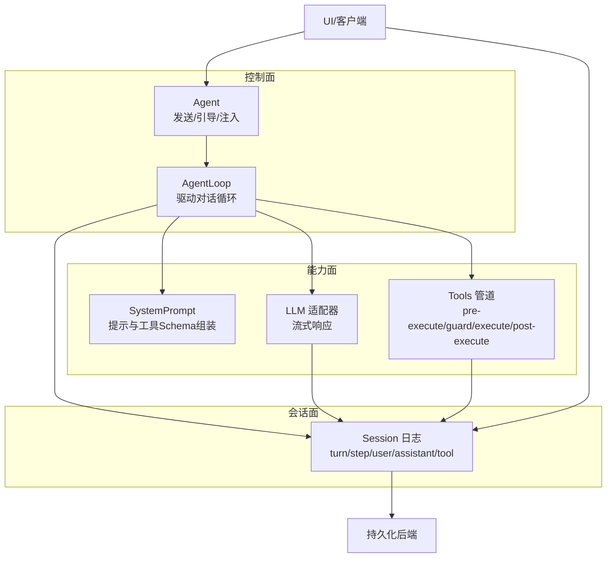
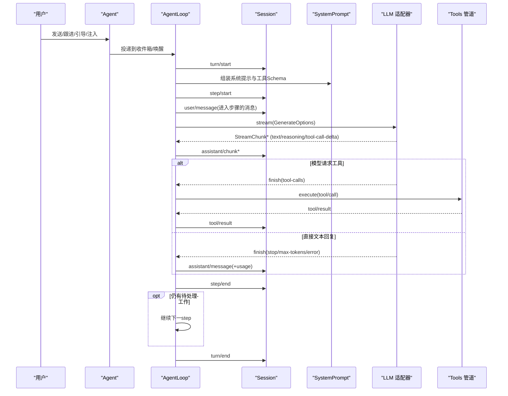
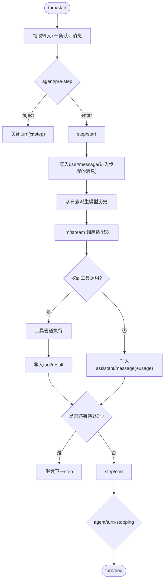
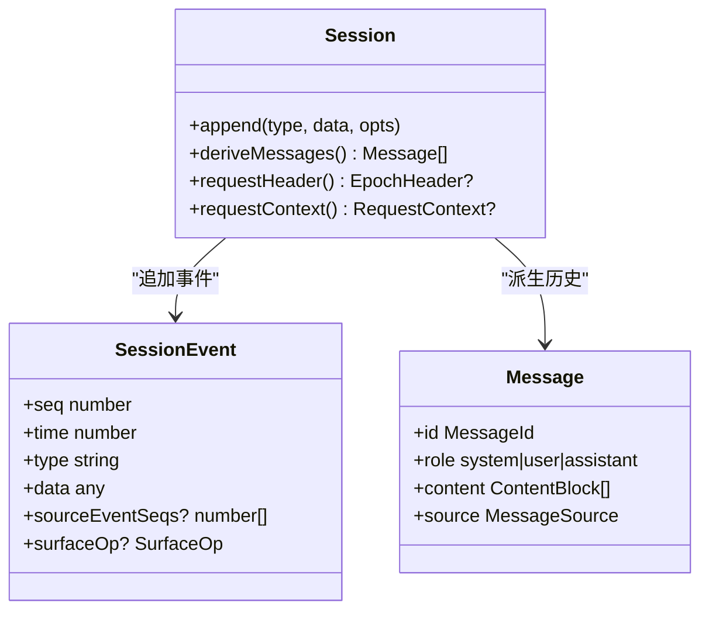
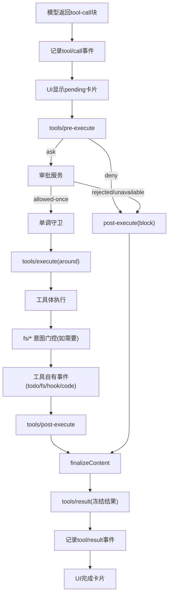
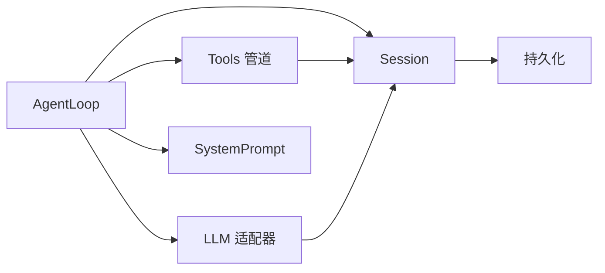

# 数据流与控制流

<cite>
**本文引用的文件**
- [architecture.md](file://docs/architecture.md)
- [session.md](file://docs/subsystems/session.md)
- [core.md](file://docs/subsystems/core.md)
- [tools.md](file://docs/subsystems/tools.md)
- [llm-streaming.md](file://docs/subsystems/llm-streaming.md)
- [tool-execution-pipeline.md](file://docs/tool-execution-pipeline.md)
- [agent-loop/src/index.ts](file://packages/core/agent-loop/src/index.ts)
</cite>

## 目录
1. [简介](#简介)
2. [项目结构](#项目结构)
3. [核心组件](#核心组件)
4. [架构总览](#架构总览)
5. [详细组件分析](#详细组件分析)
6. [依赖关系分析](#依赖关系分析)
7. [性能考虑](#性能考虑)
8. [故障排查指南](#故障排查指南)
9. [结论](#结论)
10. [附录](#附录)

## 简介
本文件聚焦 DeepSeek Harness 的数据流与控制流，完整描述从用户输入到模型响应的流转过程，解释 turn（轮次）与 step（步骤）在对话循环中的作用，说明消息在不同组件间的传递与转换机制，阐述工具调用的执行流程与结果回传、事件传播与处理模式、异步操作与错误恢复策略，并给出关键路径的流程图示与性能优化建议。

## 项目结构
DeepSeek Harness 以插件化架构组织：会话日志、系统提示组装、工具注册与执行、Agent 接口与默认驱动、LLM 适配器等均由独立包贡献，并通过 Cordis 组合装配。核心控制流由 AgentLoop 驱动，围绕 Session 事件日志进行可重放的历史构建；工具调用通过工具管道进行权限、沙箱、超时、重试与结果规范化；LLM 适配器提供流式响应，最终汇聚为助手消息并落盘。

图表来源
- [architecture.md:63-90](file://docs/architecture.md#L63-L90)
- [core.md:7-20](file://docs/subsystems/core.md#L7-L20)
- [session.md:1-10](file://docs/subsystems/session.md#L1-L10)

章节来源
- [architecture.md:63-90](file://docs/architecture.md#L63-L90)
- [core.md:7-20](file://docs/subsystems/core.md#L7-L20)

## 核心组件
- 会话日志（Session）：追加型事件日志，是模型可见历史的唯一事实源；turn/step 边界、user/assistant/tool 消息、请求头快照等均以事件形式记录，支持派生历史、回放与持久化。
- 系统提示（SystemPrompt）：拼装系统提示与工具 Schema，参与每步请求构建。
- 工具管道（Tools）：提供 pre-execute、monotonic guards、execute、post-execute、finalizeContent、result 等阶段，实现权限、沙箱、超时、重试、结果规范化与 UI 呈现。
- LLM 适配器（LLM Streaming）：统一的消息与流协议，适配器输出 StreamChunk，经 BlockAssembler 组装为 ContentBlock 与 Message。
- Agent 与 AgentLoop：Agent 暴露 send/followup/steer/inject 等入口；AgentLoop 负责 turn/step 生命周期、请求构建、工具调度与事件落盘。

章节来源
- [session.md:1-10](file://docs/subsystems/session.md#L1-L10)
- [core.md:7-20](file://docs/subsystems/core.md#L7-L20)
- [tools.md:9-12](file://docs/subsystems/tools.md#L9-L12)
- [llm-streaming.md:11-35](file://docs/subsystems/llm-streaming.md#L11-L35)
- [core.md:22-55](file://docs/subsystems/core.md#L22-L55)

## 架构总览
下图展示一次典型“用户输入→模型响应”的关键路径：用户消息进入 Agent，驱动开启 turn，进入 step，组装请求并调用 LLM 流式响应；若模型返回工具调用，则进入工具管道执行，结果回写会话日志，再回到下一步或结束 turn。

图表来源
- [architecture.md:63-90](file://docs/architecture.md#L63-L90)
- [session.md:28-124](file://docs/subsystems/session.md#L28-L124)
- [llm-streaming.md:154-182](file://docs/subsystems/llm-streaming.md#L154-L182)
- [tools.md:170-173](file://docs/subsystems/tools.md#L170-L173)

## 详细组件分析

### 对话循环：turn 与 step
- turn：一次完整的“驱动周期”，包含零个或多个 step。turn 打开于领取输入之前，关闭于无待办工作时。
- step：一次模型请求及其触发的所有工具调用。每个 step 内会记录 step/start、user/message、assistant/chunk*、assistant/message 或 tool/call* → tool/result*、step/end。
- 决策点：
  - agent/pre-step：决定是否 reject 或 enter 该批次消息；reject 或空批将关闭 turn 且不产生 step。
  - agent/request：冻结/准备请求配置，随后进入 llm/stream。
  - agent/turn-stopping：当 turn 无更多工作时触发，用于最终 steering 收集与收尾。

图表来源
- [architecture.md:63-90](file://docs/architecture.md#L63-L90)
- [session.md:28-124](file://docs/subsystems/session.md#L28-L124)

章节来源
- [architecture.md:63-90](file://docs/architecture.md#L63-L90)
- [session.md:28-124](file://docs/subsystems/session.md#L28-L124)
- [core.md:211-235](file://docs/subsystems/core.md#L211-L235)

### 消息与事件：会话日志与派生历史
- 事件类型：turn/start、turn/end、step/start、step/end、user/message、assistant/chunk、assistant/message、tool/call、tool/result、request/header、request/context、todo/write、session/end-seed 等。
- 派生规则：
  - user/message → 用户消息（保留 content）。
  - assistant/message → 助手消息（携带 provider/model，跳过空内容但保留 usage）。
  - tool/result → 用户角色中的 tool-result 块。
  - 注入上下文（非 user source）→ 按时间顺序插入用户角色消息。
- 表面投影：surfaceOp 控制 append/replace，sourceEventSeqs 追踪来源 seq，保证可重放一致性。

图表来源
- [session.md:194-357](file://docs/subsystems/session.md#L194-L357)
- [session.md:521-531](file://docs/subsystems/session.md#L521-L531)

章节来源
- [session.md:194-357](file://docs/subsystems/session.md#L194-L357)
- [session.md:521-531](file://docs/subsystems/session.md#L521-L531)

### 工具调用执行流程与结果回传
- 入口：模型返回 tool-call 块后，Session 记录 tool/call，UI 显示 pending 卡片。
- 预执行水落线（tools/pre-execute）：允许/拒绝/询问（审批），失败或拒绝走 post-execute 的 block 路径。
- 单调守卫（guards）：不可被后续监听器撤销的终态限制。
- 执行包装（tools/execute）：超时、重试、指标等 around-dispatch。
- 后处理（tools/post-execute）：接受/替换内容或值、附加 additionalContexts、block 为错误结果。
- 定义级 finalizeContent：最后一次内容不变量保障。
- 结果通知（tools/result）：冻结的最终结果，随后写入 tool/result 事件，UI 完成卡片，必要时注入 additionalContexts 到下一请求。

图表来源
- [tool-execution-pipeline.md:8-60](file://docs/tool-execution-pipeline.md#L8-L60)
- [tools.md:170-173](file://docs/subsystems/tools.md#L170-L173)
- [tools.md:376-404](file://docs/subsystems/tools.md#L376-L404)

章节来源
- [tool-execution-pipeline.md:8-60](file://docs/tool-execution-pipeline.md#L8-L60)
- [tools.md:170-173](file://docs/subsystems/tools.md#L170-L173)
- [tools.md:376-404](file://docs/subsystems/tools.md#L376-L404)

### 事件传播与处理
- 会话事件：持久化且可重放，作为模型可见历史的唯一来源。
- Agent 事件：agent/created、agent/disposed、agent/status、agent/inbox/*、agent/pre-step、agent/request、agent/request-error、agent/turn-stopping 等，用于观察/拦截运行中工作。
- 能力事件：tools/*、fs/*、telemetry/* 等，扩展点挂载策略与适配器，不耦合主循环。
- 水落线与串行：waterfall 需调用 next() 委派；turn-stopping 为串行无 next()。

章节来源
- [architecture.md:53-61](file://docs/architecture.md#L53-L61)
- [core.md:211-235](file://docs/subsystems/core.md#L211-L235)
- [tools.md:576-720](file://docs/subsystems/tools.md#L576-L720)

### 异步操作与错误恢复
- 适配器契约：
  - usage 必须在 finish 之前；工具参数保持原始 JSON 字符串端到端。
  - 两种错误路径：抛出异常或在 finish 中携带 error/aborted 与 LlmFailure。
  - 每次适配器调用是一次提供者尝试；库层禁用重试，Agent 级恢复通过开启新的 durable numbered turn。
  - 上下文溢出统一为 CONTEXT_WINDOW_EXCEEDED；空完成视为可重试错误。
- 重试策略：ResolvedRetryPolicy 由注册时捕获，per-call 使用；agent/request-error 可串行决定 retry。
- 取消与中止：AbortSignal 贯穿工具与 LLM 调用；工具管道对已启动成功结果可能替换为 ABORTED。

章节来源
- [llm-streaming.md:184-217](file://docs/subsystems/llm-streaming.md#L184-L217)
- [llm-streaming.md:218-224](file://docs/subsystems/llm-streaming.md#L218-L224)
- [llm-streaming.md:502-518](file://docs/subsystems/llm-streaming.md#L502-L518)
- [tools.md:556-570](file://docs/subsystems/tools.md#L556-L570)
- [core.md:211-235](file://docs/subsystems/core.md#L211-L235)

### 性能优化与瓶颈分析
- 并行工具调用：AgentLoop 根据 isConcurrencySafe 分类形成 exclusive/parallel 组，支持滚动池与并发上限配置。
- 流式响应：LLM 适配器以 StreamChunk 增量推送，BlockAssembler 增量组装，避免大对象阻塞。
- 日志与派生缓存：Session 派生历史按 surface 节点缓存，replace 时重建；请求头折叠增量维护。
- I/O 分离：append 热路径不阻塞 I/O，持久化插件异步缓冲；flush 作为显式检查点。
- 超时与重试：工具 with timeoutMs、LLM 流空闲超时与重试策略，降低长尾与抖动。

章节来源
- [tools.md:243-253](file://docs/subsystems/tools.md#L243-L253)
- [llm-streaming.md:266-308](file://docs/subsystems/llm-streaming.md#L266-L308)
- [session.md:477-491](file://docs/subsystems/session.md#L477-L491)
- [session.md:601-605](file://docs/subsystems/session.md#L601-L605)

## 依赖关系分析
- AgentLoop 依赖 sessions、llm、tools、systemPrompt，协调 turn/step 生命周期。
- Session 是核心状态载体，被 loop、persistence、UI 消费。
- Tools 管道依赖注册的工具定义与策略（权限、沙箱、超时、重试）。
- LLM 适配器通过统一接口接入，不影响上层事件与日志。

图表来源
- [core.md:7-20](file://docs/subsystems/core.md#L7-L20)
- [architecture.md:39-52](file://docs/architecture.md#L39-L52)

章节来源
- [core.md:7-20](file://docs/subsystems/core.md#L7-L20)
- [architecture.md:39-52](file://docs/architecture.md#L39-L52)

## 性能考虑
- 减少不必要的派生重建：尽量复用 surface 节点，避免频繁 replace。
- 合理设置 maxTokens 与 reasoning effort：平衡质量与延迟。
- 工具并行度：依据 isConcurrencySafe 启用并行，注意共享状态安全。
- 流式渲染：前端增量渲染 assistant/chunk，提升首屏体验。
- 持久化批处理：利用 session/flush 聚合落盘，降低 I/O 频率。

[本节为通用指导，无需特定文件引用]

## 故障排查指南
- 模型错误：查看 agent/error 与 turn/end reason（error/aborted/max-tokens/interrupted），结合 LlmFailure.code 定位。
- 工具失败：检查 tools/result 与 tool/result 事件，确认 post-execute 是否 block 或替换了内容。
- 上下文溢出：识别 CONTEXT_WINDOW_EXCEEDED，调整 prompt 或工具 schema。
- 空响应重试：EMPTY_RESPONSE 被视为可重试，检查重试策略与网络状况。
- 取消与中断：确认 AbortSignal 传播至工具与 LLM 调用，确保资源释放。

章节来源
- [llm-streaming.md:184-217](file://docs/subsystems/llm-streaming.md#L184-L217)
- [tools.md:556-570](file://docs/subsystems/tools.md#L556-L570)
- [session.md:540-576](file://docs/subsystems/session.md#L540-L576)

## 结论
DeepSeek Harness 通过事件溯源的会话日志、可扩展的工具管道与统一的 LLM 适配器，实现了高内聚、低耦合的对话驱动架构。turn/step 明确划分了控制粒度，工具管道提供了强大的策略与执行保障，LLM 流式协议保证了实时性与可重放性。借助事件与水印机制，系统具备良好的可观测性、可调试性与可演进性。

[本节为总结，无需特定文件引用]

## 附录
- 术语对照：turn=轮次，step=步骤，message=消息，chunk=流片段，tool call=工具调用，tool result=工具结果。
- 参考文档：
  - 架构与事件：architecture.md
  - 会话与事件：session.md
  - 核心与驱动：core.md
  - 工具管道：tools.md
  - LLM 流式协议：llm-streaming.md
  - 工具执行图：tool-execution-pipeline.md

[本节为索引，无需特定文件引用]