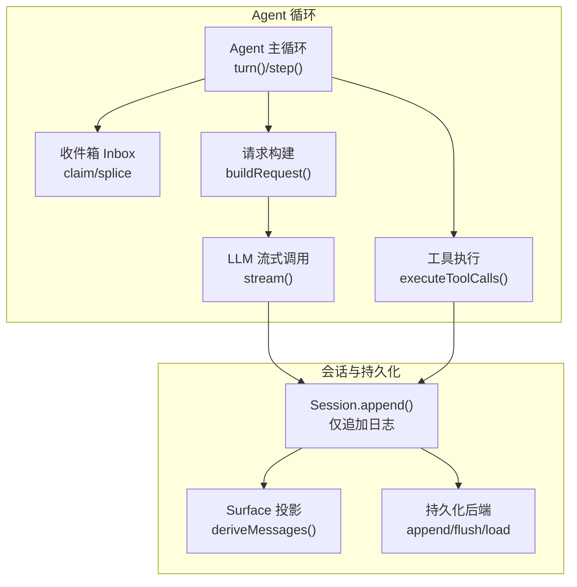
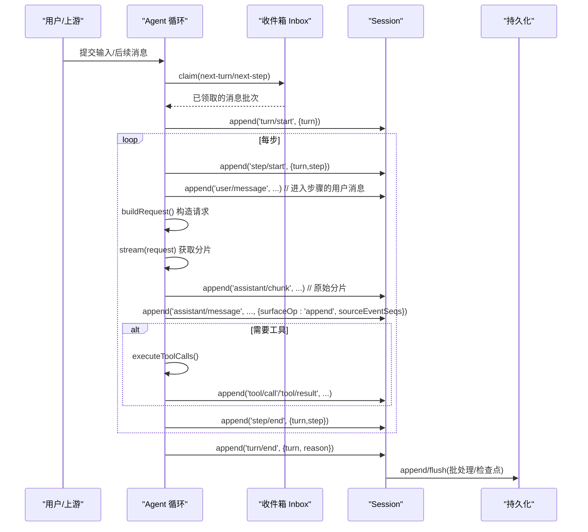
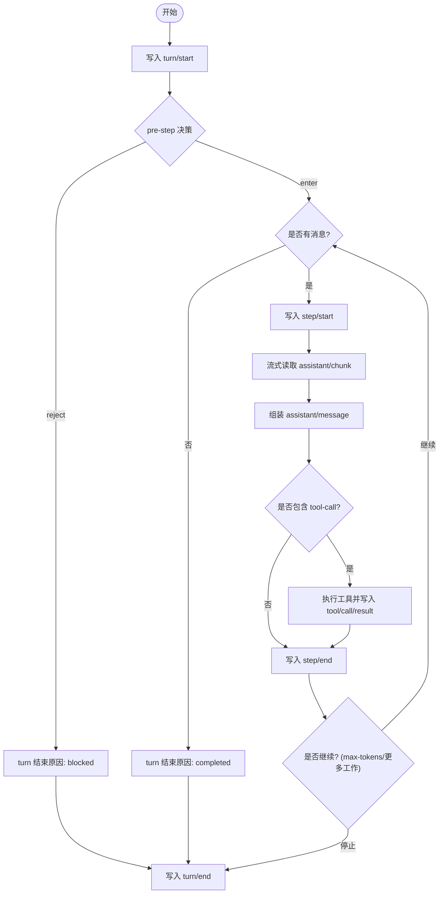
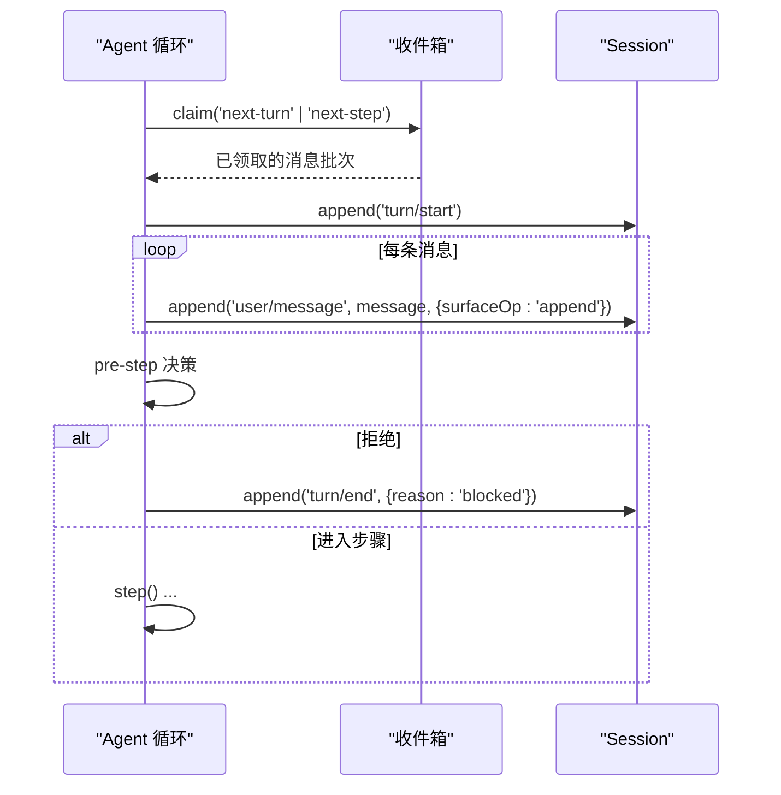
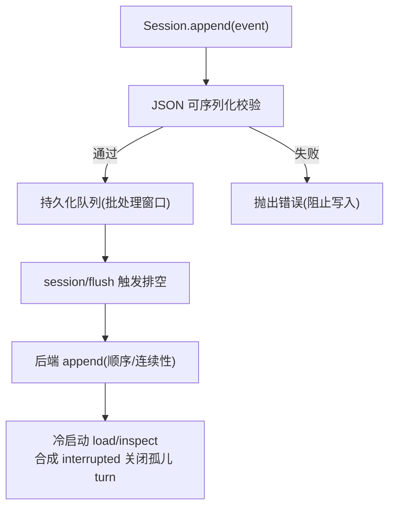
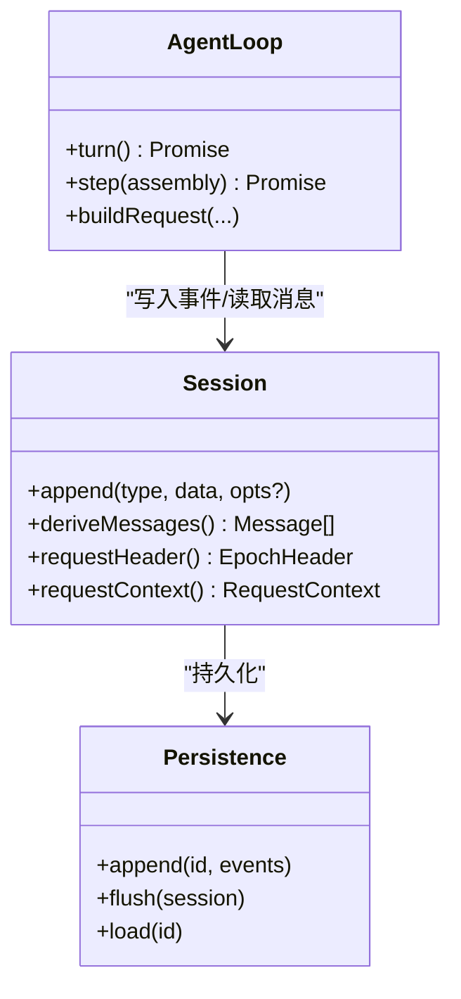
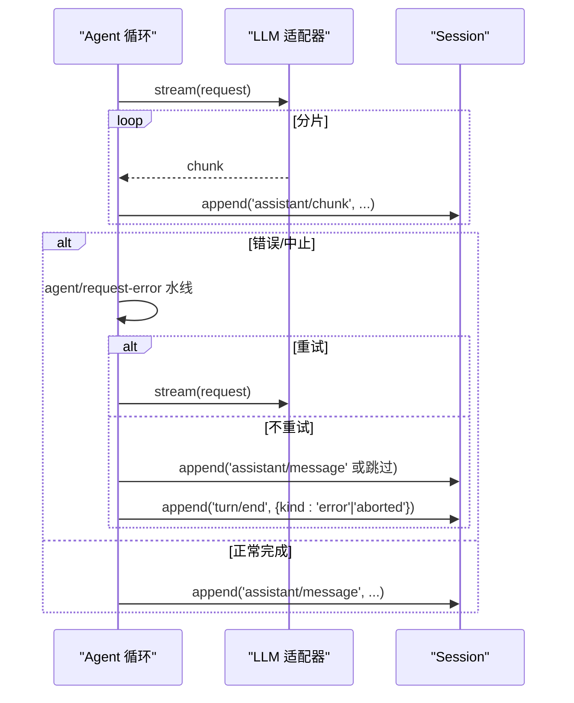
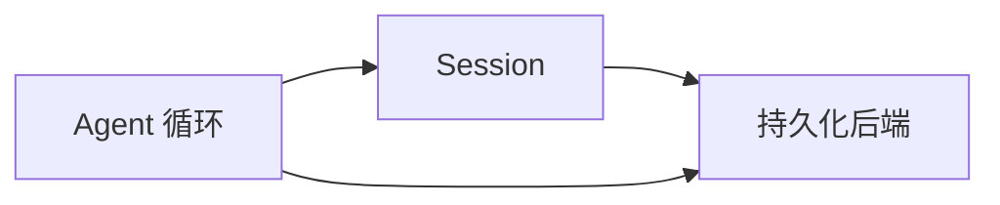

# 消息流转机制

<cite>
**本文引用的文件**
- [packages/core/agent-loop/src/agent.ts](file://packages/core/agent-loop/src/agent.ts)
- [docs/subsystems/session.md](file://docs/subsystems/session.md)
- [docs/subsystems/persistence.md](file://docs/subsystems/persistence.md)
- [.agents/notes/implemented/simplification/2026-07-24-agent-loop-observable-state-machine.zh.md](file://.agents/notes/implemented/simplification/2026-07-24-agent-loop-observable-state-machine.zh.md)
- [.agents/notes/implemented/architecture/2026-07-31-claimed-pre-step-inbox-lifecycle.md](file://.agents/notes/implemented/architecture/2026-07-31-claimed-pre-step-inbox-lifecycle.md)
</cite>

## 目录
1. [简介](#简介)
2. [项目结构](#项目结构)
3. [核心组件](#核心组件)
4. [架构总览](#架构总览)
5. [详细组件分析](#详细组件分析)
6. [依赖关系分析](#依赖关系分析)
7. [性能考量](#性能考量)
8. [故障排查指南](#故障排查指南)
9. [结论](#结论)
10. [附录](#附录)

## 简介
本文件聚焦 DeepSeek Harness 的消息流转机制，解释用户输入如何转换为会话事件，以及消息在 Agent 循环中的处理流程。重点说明 turn（轮次）与 step（步骤）的概念与作用、消息的序列化/存储/恢复、跨组件传递模式与转换规则、异步消息处理与错误传播，并给出关键路径的数据流向图与实际代码示例位置。

## 项目结构
围绕消息流转的核心由三部分构成：
- 会话事件模型与持久化：SessionEvent 仅追加日志、Surface 投影、持久化后端与崩溃恢复。
- Agent 循环：turn/step 生命周期、收件箱领取、请求构建与流式响应、工具调用与结果回写。
- 可观测状态机：对外暴露 agent/inbox 与 pre-step/request 等扩展点，驱动 UI 与外部系统。

**图表来源**
- [packages/core/agent-loop/src/agent.ts:245-439](file://packages/core/agent-loop/src/agent.ts#L245-L439)
- [docs/subsystems/session.md:1-125](file://docs/subsystems/session.md#L1-L125)
- [docs/subsystems/persistence.md:9-20](file://docs/subsystems/persistence.md#L9-L20)

**章节来源**
- [packages/core/agent-loop/src/agent.ts:245-439](file://packages/core/agent-loop/src/agent.ts#L245-L439)
- [docs/subsystems/session.md:1-125](file://docs/subsystems/session.md#L1-L125)
- [docs/subsystems/persistence.md:9-20](file://docs/subsystems/persistence.md#L9-L20)

## 核心组件
- Session 与 SessionEvent：以仅追加日志为唯一真源，所有 LLM 消息历史从日志派生；Surface 类型限定哪些事件进入有序表面（user/message、assistant/message、tool/result）。
- Agent 循环：turn 封装一次“模型循环执行”，step 封装一次“模型调用 + 其请求的工具执行”。
- 持久化：通过 flush 检查点、批处理窗口、崩溃恢复（合成 interrupted 关闭孤儿 turn），保证日志连续且可回放。
- 可观测状态机：pre-step/request/request-error/turn-stopping 等扩展点，统一 inbox 变更事件（inserted/claimed/discarded/spliced）。

**章节来源**
- [docs/subsystems/session.md:1-125](file://docs/subsystems/session.md#L1-L125)
- [docs/subsystems/session.md:194-357](file://docs/subsystems/session.md#L194-L357)
- [docs/subsystems/persistence.md:9-20](file://docs/subsystems/persistence.md#L9-L20)
- [.agents/notes/implemented/simplification/2026-07-24-agent-loop-observable-state-machine.zh.md:15-24](file://.agents/notes/implemented/simplification/2026-07-24-agent-loop-observable-state-machine.zh.md#L15-L24)

## 架构总览
下图展示从用户输入到会话事件、再到持久化的完整链路，以及 turn/step 的边界。

**图表来源**
- [packages/core/agent-loop/src/agent.ts:245-439](file://packages/core/agent-loop/src/agent.ts#L245-L439)
- [docs/subsystems/session.md:27-125](file://docs/subsystems/session.md#L27-L125)
- [docs/subsystems/persistence.md:9-20](file://docs/subsystems/persistence.md#L9-L20)

## 详细组件分析

### 轮次与步骤：turn 与 step 的生命周期
- turn：一次“模型循环执行”的边界。循环先写入 turn/start，再进入 pre-step 决策；若拒绝或首轮无消息则直接 completed/blocked。
- step：一次“模型调用 + 其请求的工具执行”。每个 step 写入 step/start/step/end，并在其中记录 user/message、assistant/chunk、assistant/message、tool/call、tool/result。
- 结束原因：completed、aborted、blocked、error、max-tokens、interrupted（仅崩溃恢复合成）。

**图表来源**
- [packages/core/agent-loop/src/agent.ts:245-439](file://packages/core/agent-loop/src/agent.ts#L245-L439)
- [docs/subsystems/session.md:540-577](file://docs/subsystems/session.md#L540-L577)

**章节来源**
- [packages/core/agent-loop/src/agent.ts:245-439](file://packages/core/agent-loop/src/agent.ts#L245-L439)
- [docs/subsystems/session.md:540-577](file://docs/subsystems/session.md#L540-L577)

### 收件箱与 pre-step：输入领取与注入
- 在每次拟议步骤前，Inbox.claim(target) 原子删除整批 next-step 消息，并在轮次边界额外领取一条 next-turn 提示词。
- 纯删除 splice 后，循环对每条消息发出 agent/inbox/claimed，随后交由 pre-step 决定 reject 或 enter。
- 空闲注入保持待处理，直到 follow-up/steering 唤醒驱动器。

**图表来源**
- [.agents/notes/implemented/architecture/2026-07-31-claimed-pre-step-inbox-lifecycle.md:1-15](file://.agents/notes/implemented/architecture/2026-07-31-claimed-pre-step-inbox-lifecycle.md#L1-L15)
- [packages/core/agent-loop/src/agent.ts:245-293](file://packages/core/agent-loop/src/agent.ts#L245-L293)

**章节来源**
- [.agents/notes/implemented/architecture/2026-07-31-claimed-pre-step-inbox-lifecycle.md:1-15](file://.agents/notes/implemented/architecture/2026-07-31-claimed-pre-step-inbox-lifecycle.md#L1-L15)
- [packages/core/agent-loop/src/agent.ts:245-293](file://packages/core/agent-loop/src/agent.ts#L245-L293)

### 消息序列化、存储与恢复
- 序列化：所有 event.data 必须 JSON 可序列化；Session.append 在入口处校验，确保日志无损。
- 存储：持久化插件订阅 session/event，使用固定批处理窗口与 flush 检查点；session/flush 作为顺序与错误观察的检查点。
- 恢复：冷加载时若发现未闭合的 turn/start，会合成 turn/end{kind:'interrupted'} 配平执行；load 返回平衡后的逻辑视图，prepare 保留未发布 Session 直至发布或回滚。

**图表来源**
- [docs/subsystems/session.md:601-605](file://docs/subsystems/session.md#L601-L605)
- [docs/subsystems/persistence.md:9-20](file://docs/subsystems/persistence.md#L9-L20)

**章节来源**
- [docs/subsystems/session.md:601-605](file://docs/subsystems/session.md#L601-L605)
- [docs/subsystems/persistence.md:9-20](file://docs/subsystems/persistence.md#L9-L20)

### 消息在不同组件间的传递模式与转换规则
- 入站：用户输入经 Inbox 领取后，转为 user/message 事件进入 Surface。
- 出站：LLM 流式分片 assistant/chunk 被记录，最终组装为 assistant/message 并关联 sourceEventSeqs。
- 工具：模型请求工具 → tool/call → 执行 → tool/result（携带可选 meta/error）。
- 派生历史：deriveMessages() 按 Surface 节点顺序生成 Message[]，跳过 chunk 与空内容 assistant/message。

**图表来源**
- [packages/core/agent-loop/src/agent.ts:332-439](file://packages/core/agent-loop/src/agent.ts#L332-L439)
- [docs/subsystems/session.md:359-518](file://docs/subsystems/session.md#L359-L518)
- [docs/subsystems/persistence.md:231-237](file://docs/subsystems/persistence.md#L231-L237)

**章节来源**
- [packages/core/agent-loop/src/agent.ts:332-439](file://packages/core/agent-loop/src/agent.ts#L332-L439)
- [docs/subsystems/session.md:359-518](file://docs/subsystems/session.md#L359-L518)
- [docs/subsystems/persistence.md:231-237](file://docs/subsystems/persistence.md#L231-L237)

### 异步消息处理与错误传播
- 异步：stream 迭代中持续写入 assistant/chunk；工具执行可能插入新的 next-step 上下文。
- 错误：请求错误通过 agent/request-error 水线决定重试或抛出；异常会被结构化（LlmError 或 UNKNOWN），并最终写入 turn/end{kind:'error'}。
- 取消：AbortSignal 贯穿 turn/step，中止时写入 turn/end{kind:'aborted'}。

**图表来源**
- [packages/core/agent-loop/src/agent.ts:332-439](file://packages/core/agent-loop/src/agent.ts#L332-L439)

**章节来源**
- [packages/core/agent-loop/src/agent.ts:332-439](file://packages/core/agent-loop/src/agent.ts#L332-L439)

## 依赖关系分析
- Agent 循环依赖 Session 进行事件追加与消息派生，依赖持久化服务进行落盘与恢复。
- Session 提供 Surface 投影与请求头/路由上下文，供循环构建请求与 UI 消费。
- 持久化后端实现抽象接口，支持 JSONL/SQLite 两种形式，并通过 flush 检查点协调顺序。

**图表来源**
- [packages/core/agent-loop/src/agent.ts:245-439](file://packages/core/agent-loop/src/agent.ts#L245-L439)
- [docs/subsystems/persistence.md:231-237](file://docs/subsystems/persistence.md#L231-L237)

**章节来源**
- [packages/core/agent-loop/src/agent.ts:245-439](file://packages/core/agent-loop/src/agent.ts#L245-L439)
- [docs/subsystems/persistence.md:231-237](file://docs/subsystems/persistence.md#L231-L237)

## 性能考量
- 批处理与检查点：持久化采用固定批处理窗口与显式 flush 检查点，避免阻塞热路径。
- 缓存派生历史：deriveMessages() 对 Surface 节点缓存投影，重写时重建，降低重复计算。
- 最小化 I/O：Session.append 同步通知，持久化插件异步缓冲，I/O 不阻塞事件生产。

[本节为通用指导，无需特定文件引用]

## 故障排查指南
- 轮次未闭合：冷加载检测到 open turn/start 会合成 interrupted 关闭；检查持久化日志尾部是否完整。
- 请求错误：查看 agent/request-error 水线决策与 LlmError 事实；确认是否配置了重试策略。
- 取消与中断：确认 AbortSignal 是否正确传播至 turn/step；检查 turn/end 的 reason。
- 数据一致性：验证 surfaceOp 与 sourceEventSeqs 的一致性；确保 assistant/message 的 sourceEventSeqs 覆盖对应 chunk。

**章节来源**
- [docs/subsystems/persistence.md:9-20](file://docs/subsystems/persistence.md#L9-L20)
- [packages/core/agent-loop/src/agent.ts:332-439](file://packages/core/agent-loop/src/agent.ts#L332-L439)
- [docs/subsystems/session.md:540-577](file://docs/subsystems/session.md#L540-L577)

## 结论
DeepSeek Harness 通过“仅追加事件日志 + Surface 投影 + 明确 turn/step 边界”的设计，将用户输入可靠地转化为可回放、可恢复的会话历史。Agent 循环在 pre-step 阶段集中管理输入领取与决策，在 step 内完成流式输出与工具执行，并通过持久化后端保证一致性与容错。该机制既满足高吞吐的实时交互，又为离线回放与调试提供了坚实基础。

[本节为总结性内容，无需特定文件引用]

## 附录
- 实际代码示例位置（不含具体代码内容）：
  - turn/step 生命周期与事件写入：[packages/core/agent-loop/src/agent.ts:245-439](file://packages/core/agent-loop/src/agent.ts#L245-L439)
  - 会话事件类型与 Surface 定义：[docs/subsystems/session.md:27-125](file://docs/subsystems/session.md#L27-L125)
  - 派生历史与 Surface 投影：[docs/subsystems/session.md:359-518](file://docs/subsystems/session.md#L359-L518)
  - 持久化批处理与崩溃恢复：[docs/subsystems/persistence.md:9-20](file://docs/subsystems/persistence.md#L9-L20)
  - 收件箱领取与 pre-step 决策：[.agents/notes/implemented/architecture/2026-07-31-claimed-pre-step-inbox-lifecycle.md:1-15](file://.agents/notes/implemented/architecture/2026-07-31-claimed-pre-step-inbox-lifecycle.md#L1-L15)
  - 可观测状态机扩展点：[.agents/notes/implemented/simplification/2026-07-24-agent-loop-observable-state-machine.zh.md:15-24](file://.agents/notes/implemented/simplification/2026-07-24-agent-loop-observable-state-machine.zh.md#L15-L24)