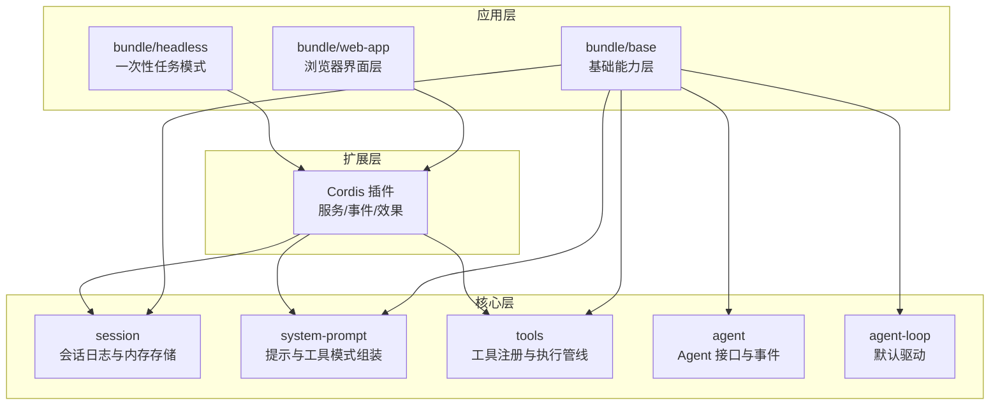
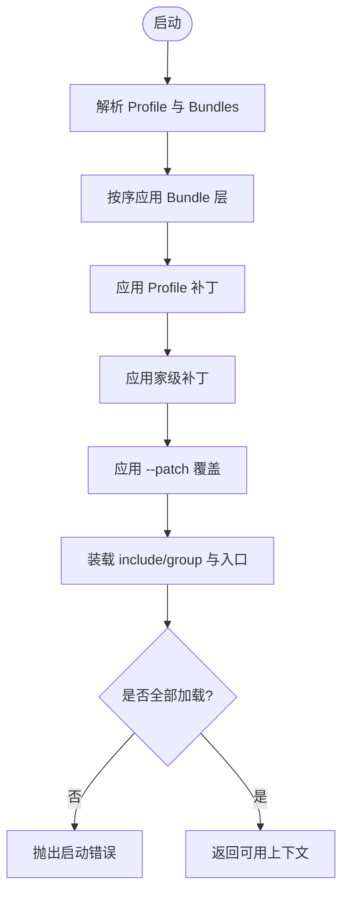
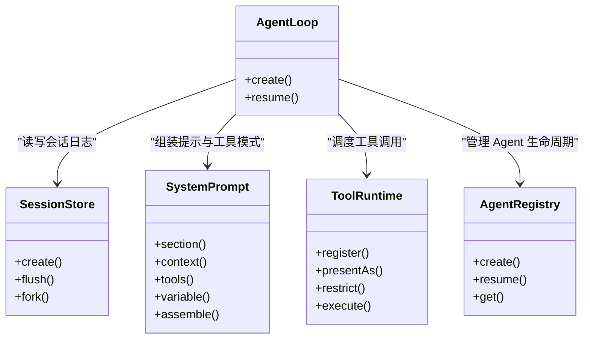
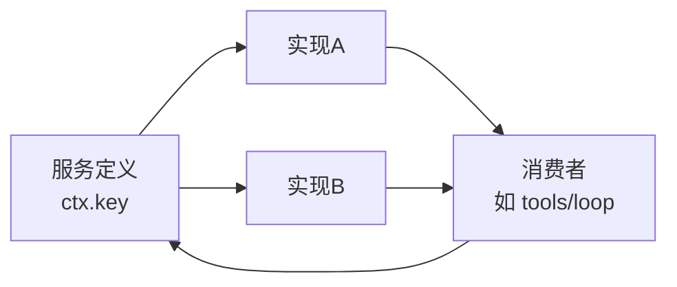
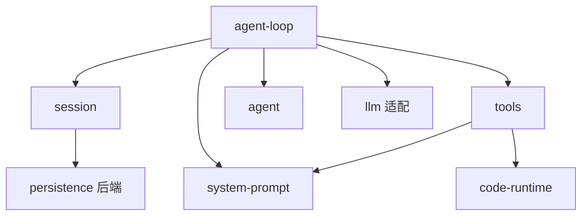

# 整体架构概览

<cite>
**本文引用的文件**
- [packages/core/README.md](file://packages/core/README.md)
- [packages/bundle/README.md](file://packages/bundle/README.md)
- [packages/boot/app-boot/README.md](file://packages/boot/app-boot/README.md)
- [docs/architecture.md](file://docs/architecture.md)
- [docs/capability-seams.md](file://docs/capability-seams.md)
- [docs/subsystems/core.md](file://docs/subsystems/core.md)
- [docs/subsystems/session.md](file://docs/subsystems/session.md)
- [packages/core/system-prompt/README.md](file://packages/core/system-prompt/README.md)
- [packages/core/tools/README.md](file://packages/core/tools/README.md)
</cite>

## 目录
1. [引言](#引言)
2. [项目结构](#项目结构)
3. [核心组件](#核心组件)
4. [架构总览](#架构总览)
5. [详细组件分析](#详细组件分析)
6. [依赖关系分析](#依赖关系分析)
7. [性能考量](#性能考量)
8. [故障排查指南](#故障排查指南)
9. [结论](#结论)
10. [附录](#附录)

## 引言
本概览面向希望理解 DeepSeek Harness（DSH）分层设计、插件树装配与能力接缝的读者。文档从“核心层—应用层—扩展层”的职责划分出发，解释 profile 与 bundle 的层次结构、启动时配置加载与插件组装流程，并聚焦 session、system-prompt、tools、agent 等关键组件的作用与协作方式。文末提供架构图与流程图，帮助快速建立全局心智模型。

## 项目结构
- 分层职责
  - 核心层：提供不可省略的控制骨架，包括会话日志、系统提示组装、工具注册与执行管线、Agent 接口与默认驱动。这些是产品级稳定表面，插件与消费者围绕其扩展。
  - 应用层：以 bundle 形式打包一组 patch 与运行时胶水，组合出 web、headless 等可运行形态；通过 profile 声明 bundles 顺序与用户补丁。
  - 扩展层：通过 Cordis 插件机制挂载服务、事件与效果，所有能力以“能力接缝”暴露，便于替换与组合。
- 启动装配
  - 使用 boot 工具创建根上下文、安装 Loader、挂载 include/group、解析 profile 与 bundles、应用 patch 层、断言条目已加载并激活，最终返回可用上下文。
  - 支持 HMR 热重载用户补丁，保证开发体验与生产一致性。



图表来源
- [packages/core/README.md:7-15](file://packages/core/README.md#L7-L15)
- [packages/bundle/README.md:7-13](file://packages/bundle/README.md#L7-L13)
- [packages/boot/app-boot/README.md:7-23](file://packages/boot/app-boot/README.md#L7-L23)

章节来源
- [packages/core/README.md:1-22](file://packages/core/README.md#L1-L22)
- [packages/bundle/README.md:1-14](file://packages/bundle/README.md#L1-L14)
- [packages/boot/app-boot/README.md:1-61](file://packages/boot/app-boot/README.md#L1-L61)

## 核心组件
- 会话（session）
  - 以追加式事件日志为唯一事实源，消息历史由日志派生；支持持久化后端、回放、分叉与查询。
- 系统提示（system-prompt）
  - 聚合提示片段、工具模式与变量，按顺序组装每次请求的系统提示与工具模式集合。
- 工具（tools）
  - 注册工具定义、执行管线（预执行→守卫→执行→后处理→结果观察）、呈现模式（原生/代码/混合），以及并行调度与取消契约。
- Agent 与循环（agent / agent-loop）
  - 定义 Agent 句柄、生命周期、入站队列与拦截点；默认驱动实现 turn/step 循环，串联 session、system-prompt、llm 与 tools。

章节来源
- [docs/subsystems/core.md:7-18](file://docs/subsystems/core.md#L7-L18)
- [docs/subsystems/session.md:1-12](file://docs/subsystems/session.md#L1-L12)
- [packages/core/system-prompt/README.md:1-25](file://packages/core/system-prompt/README.md#L1-L25)
- [packages/core/tools/README.md:1-28](file://packages/core/tools/README.md#L1-L28)

## 架构总览
- 分层与装配
  - 每个运行实例是一棵按序装配的插件树：profile 列出 bundles，bundles 提供 patch 列表与可选运行时胶水；patch 按“profile 内 bundles → profile 补丁 → 家级补丁 → --patch 覆盖”的顺序叠加。
- 能力接缝（capability seams）
  - 每个能力包含“服务定义、服务提供者、消费者”三要素；通过 ctx.* 键暴露，允许在组合时替换实现而不改动调用方。
- 事件与数据流
  - 会话事件为持久事实；agent/* 与 tools/* 等为实时扩展点；turn/step 边界由 session 记录，确保可重放与 UI 保真。

```mermaid
sequenceDiagram
participant Boot as "引导程序"
participant Profile as "Profile/Bundles"
participant Patch as "Patch 层"
participant Cordis as "Cordis 上下文"
participant Core as "核心服务"
participant Loop as "Agent 循环"
Boot->>Cordis : 创建根上下文
Boot->>Profile : 解析 dsh.profile.bundles
Profile-->>Boot : 有序 bundles 列表
Boot->>Patch : 应用 profile 补丁/家级补丁/覆盖
Patch-->>Cordis : 注册/替换条目
Boot->>Cordis : 装载 include/group 与入口
Cordis-->>Core : 挂载核心服务
Core-->>Loop : 暴露 ctx.sessions/ctx.systemPrompt/ctx.tools/ctx.agents
Loop->>Core : 读取提示与工具模式
Loop->>Core : 驱动 turn/step 循环
```

图表来源
- [packages/boot/app-boot/README.md:18-23](file://packages/boot/app-boot/README.md#L18-L23)
- [docs/architecture.md:15-27](file://docs/architecture.md#L15-L27)
- [docs/subsystems/core.md:7-18](file://docs/subsystems/core.md#L7-L18)

章节来源
- [docs/architecture.md:15-27](file://docs/architecture.md#L15-L27)
- [packages/boot/app-boot/README.md:18-23](file://packages/boot/app-boot/README.md#L18-L23)

## 详细组件分析

### 插件树（plugin tree）与 profile/bundle
- 概念
  - 插件树：由 Cordis 管理的 Fiber/Fiber 树，每个插件贡献服务、事件与效果，卸载时自动回滚。
  - Profile：命名组合，位于 Harness 家目录，声明 bundles 列表与用户 cordis.patch.yml。
  - Bundle：分发格式，包含 patch 列表与可选运行时胶水；通过 package.json 的 dsh.bundle 指向补丁文件。
- 工作原理
  - 启动时按序加载 bundles，再依次应用 profile 补丁、家级补丁与命令行覆盖；每条 patch 可按 id 替换或插入新行。
  - 支持 HMR 监听用户补丁变更，事务性重组完整补丁列表。



图表来源
- [packages/boot/app-boot/README.md:18-23](file://packages/boot/app-boot/README.md#L18-L23)
- [docs/architecture.md:15-27](file://docs/architecture.md#L15-L27)

章节来源
- [packages/bundle/README.md:1-14](file://packages/bundle/README.md#L1-L14)
- [packages/boot/app-boot/README.md:36-46](file://packages/boot/app-boot/README.md#L36-L46)
- [docs/architecture.md:15-27](file://docs/architecture.md#L15-L27)

### 启动时的配置加载与插件组装
- 关键步骤
  - 解析配置路径与环境变量；安装失败处理器；挂载 include/group 内置；装载入口并断言已加载/激活；返回根上下文。
  - 支持快照模式、离线渲染配置转储、用户补丁热重载。
- 输出与保障
  - 断言未解析的启用条目会作为启动失败报告；Loader 拒绝导入与生命周期失败会被捕获并附带栈信息。

章节来源
- [packages/boot/app-boot/README.md:7-23](file://packages/boot/app-boot/README.md#L7-L23)
- [packages/boot/app-boot/README.md:26-35](file://packages/boot/app-boot/README.md#L26-L35)

### 核心包作用与相互关系
- session
  - 维护追加式 SessionEvent 日志与内存存储；消息历史由日志派生；支持持久化、回放、分叉与查询。
- system-prompt
  - 收集提示片段、工具模式与变量，按顺序组装每次请求的系统提示与工具模式集合；支持 complete 片段与动态上下文。
- tools
  - 注册工具定义与执行管线；支持原生函数调用与 Code Mode；提供守卫、前后置钩子与结果观察；统一呈现与并行调度。
- agent / agent-loop
  - 定义 Agent 句柄、入站队列、状态与拦截点；默认驱动实现 turn/step 循环，串联 session、system-prompt、llm 与 tools。



图表来源
- [docs/subsystems/core.md:7-18](file://docs/subsystems/core.md#L7-L18)
- [docs/subsystems/session.md:1-12](file://docs/subsystems/session.md#L1-L12)
- [packages/core/system-prompt/README.md:16-25](file://packages/core/system-prompt/README.md#L16-L25)
- [packages/core/tools/README.md:7-28](file://packages/core/tools/README.md#L7-L28)

章节来源
- [docs/subsystems/core.md:7-18](file://docs/subsystems/core.md#L7-L18)
- [docs/subsystems/session.md:1-12](file://docs/subsystems/session.md#L1-L12)
- [packages/core/system-prompt/README.md:16-25](file://packages/core/system-prompt/README.md#L16-L25)
- [packages/core/tools/README.md:7-28](file://packages/core/tools/README.md#L7-L28)

### 能力接缝（capability seams）的设计理念与实现
- 设计理念
  - 将可替换能力抽象为“服务定义 + 服务提供者 + 消费者”，通过 ctx.* 键暴露；一次 provider 替换即可改变整个产品行为。
- 实现方式
  - 服务定义由核心或能力包声明；实现包注册到同一 ctx key；消费者仅依赖接口，不感知具体实现。
  - 示例：LLM 适配器、文件系统、沙箱、子代理、设置、凭据、终端、工作流引擎等均以 seam 形式存在。



图表来源
- [docs/capability-seams.md:98-103](file://docs/capability-seams.md#L98-L103)
- [docs/capability-seams.md:412-469](file://docs/capability-seams.md#L412-L469)

章节来源
- [docs/capability-seams.md:98-103](file://docs/capability-seams.md#L98-L103)
- [docs/capability-seams.md:412-469](file://docs/capability-seams.md#L412-L469)

### 轮次流程（turn/step）与数据流向
- 流程要点
  - turn 开启后，先 claim 输入并组装提示与工具模式；进入 step 后发起模型请求，流式接收响应；根据工具调用执行工具管线；每步结束后回到 claim 或关闭 turn。
  - 所有模型可见事实均写入 session 日志，确保可重放与 UI 保真。
- 数据流向
  - user/message → assistant/chunk → assistant/message → tool/call → tool/result；request/header/context 记录请求头与路由上下文。

```mermaid
sequenceDiagram
participant Loop as "Agent 循环"
participant SP as "System Prompt"
participant LLM as "LLM 适配"
participant Tools as "工具管线"
participant Sess as "Session 日志"
Loop->>Sess : turn/start
Loop->>SP : 组装提示与工具模式
Loop->>LLM : 发送请求
LLM-->>Loop : assistant/chunk*
Loop->>Sess : assistant/message
alt 需要工具
Loop->>Tools : 调用工具
Tools-->>Loop : tool/result
Loop->>Sess : tool/result
end
Loop->>Sess : step/end
Loop->>Sess : turn/end
```

图表来源
- [docs/architecture.md:63-90](file://docs/architecture.md#L63-L90)
- [docs/subsystems/session.md:152-193](file://docs/subsystems/session.md#L152-L193)

章节来源
- [docs/architecture.md:63-90](file://docs/architecture.md#L63-L90)
- [docs/subsystems/session.md:152-193](file://docs/subsystems/session.md#L152-L193)

## 依赖关系分析
- 核心依赖
  - agent-loop 依赖 session、system-prompt、tools、llm 与 agent；tools 自动注入 system-prompt 的工具模式；session 提供持久化与回放能力。
- 扩展依赖
  - 各能力包通过 ctx.* 键注册实现；消费者仅依赖接口，形成松耦合。
- 外部集成
  - 通过 shell、subprocess、fs、sandbox、web、lsp 等 seam 接入宿主能力；通过 settings/credentials 管理配置与密钥。



图表来源
- [docs/subsystems/core.md:7-18](file://docs/subsystems/core.md#L7-L18)
- [packages/core/tools/README.md:29-35](file://packages/core/tools/README.md#L29-L35)

章节来源
- [docs/subsystems/core.md:7-18](file://docs/subsystems/core.md#L7-L18)
- [packages/core/tools/README.md:29-35](file://packages/core/tools/README.md#L29-L35)

## 性能考量
- 会话日志与派生
  - 消息历史由日志派生且缓存，避免重复计算；替换操作（compaction）会重建派生视图。
- 工具执行
  - 支持并行调度与独占调用；Code Mode 通过绑定池复用并发策略；结果大小受 spill 策略控制。
- 提示与模式
  - 工具模式与提示片段按序组装，可通过 restrict/toolOrder 减少冗余；KV 缓存友好。
- 启动与热重载
  - 并行装载条目，HMR 监听补丁变更，事务性重组，避免长时间阻塞。

[本节为通用指导，无需特定文件引用]

## 故障排查指南
- 启动失败
  - 检查 Loader 拒绝的导入与生命周期失败；确认所有启用的条目均已加载并激活；查看断言报告的未解析插件名称。
- 会话与回放
  - 验证事件类型与 surfaceOp 是否正确；检查 request/header 与 route context 是否一致；确认持久化后端能无损恢复事件。
- 工具执行
  - 检查 pre-execute 守卫与 post-execute 结果替换；确认 Code Mode SDK 与语言渲染器匹配；关注超时与取消信号。
- 能力接缝
  - 确认服务定义与实现已正确注册到同一 ctx key；消费者仅依赖接口，避免硬编码实现。

章节来源
- [packages/boot/app-boot/README.md:26-35](file://packages/boot/app-boot/README.md#L26-L35)
- [docs/subsystems/session.md:601-605](file://docs/subsystems/session.md#L601-L605)
- [packages/core/tools/README.md:33-39](file://packages/core/tools/README.md#L33-L39)

## 结论
DeepSeek Harness 通过“核心层—应用层—扩展层”的分层设计与 Cordis 插件树，实现了高度可组合、可替换的能力体系。profile 与 bundle 提供了明确的装配边界，能力接缝确保了实现的可插拔性。session、system-prompt、tools、agent 等核心组件协同工作，形成稳定的控制骨架与丰富的扩展点。借助事件驱动的会话日志与清晰的 turn/step 流程，系统在可重放性、可观测性与可扩展性之间取得平衡。

[本节为总结性内容，无需特定文件引用]

## 附录
- 术语
  - 插件树：由 Cordis 管理的 Fiber 树，承载服务、事件与效果。
  - Profile：命名组合，声明 bundles 与用户补丁。
  - Bundle：分发格式，包含 patch 列表与可选运行时胶水。
  - 能力接缝：服务定义 + 提供者 + 消费者的可替换能力单元。
- 参考
  - 子系统文档与能力图索引可在 docs 目录下查阅。

[本节为补充说明，无需特定文件引用]