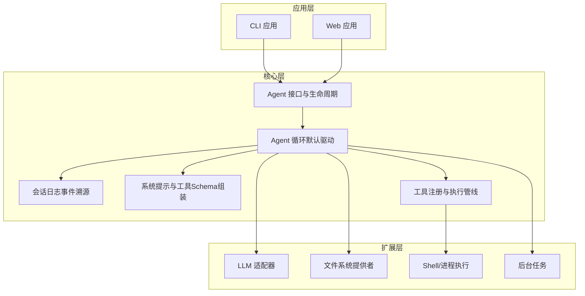
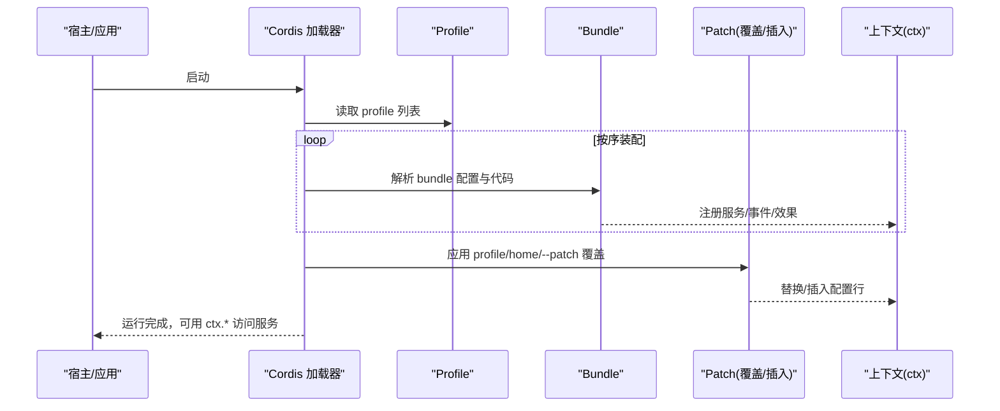
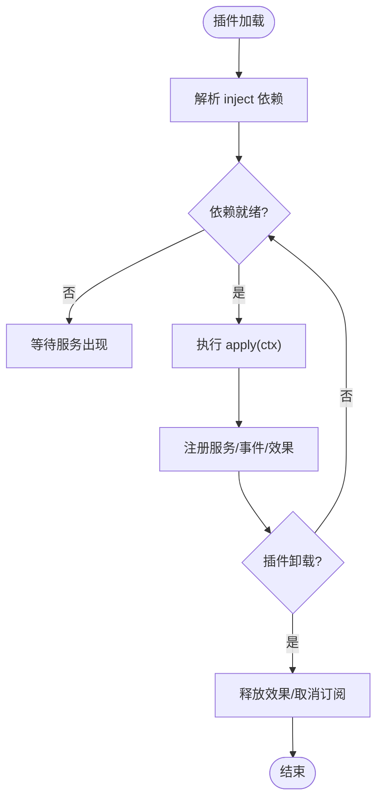
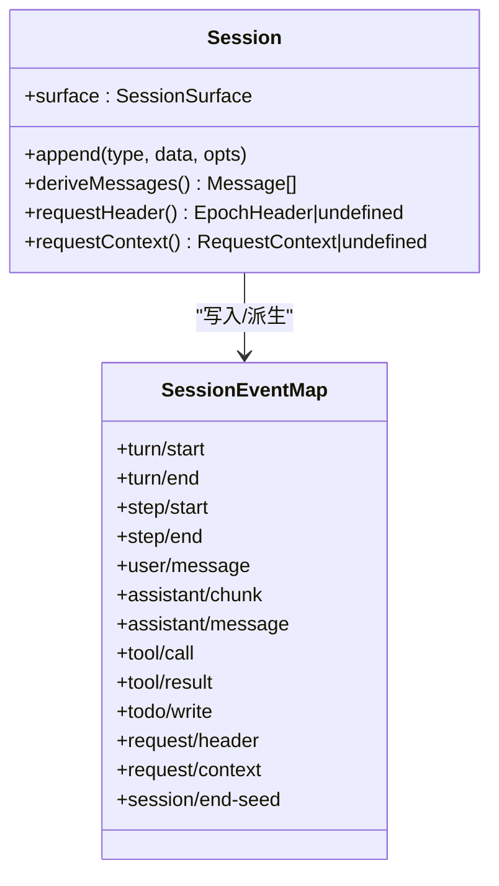
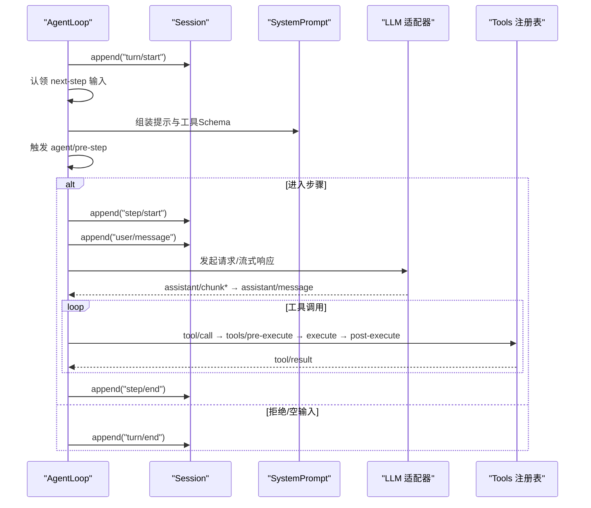
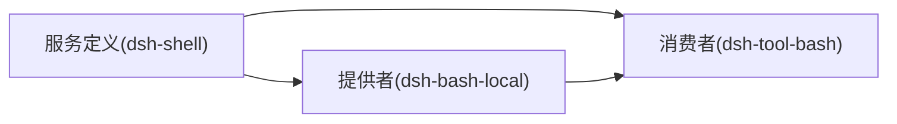
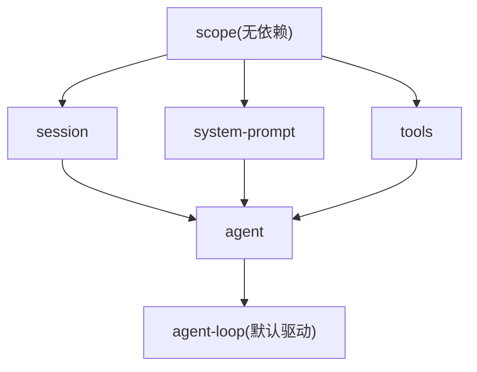

# 架构设计

<cite>
**本文引用的文件**
- [docs/architecture.md](file://docs/architecture.md)
- [docs/cordis-primer.md](file://docs/cordis-primer.md)
- [docs/subsystems/core.md](file://docs/subsystems/core.md)
- [docs/subsystems/session.md](file://docs/subsystems/session.md)
- [packages/core/README.md](file://packages/core/README.md)
- [packages/extensions/tool-cordis/src/prompt.ts](file://packages/extensions/tool-cordis/src/prompt.ts)
- [packages/extensions/cordis-host-runner/src/guard.ts](file://packages/extensions/cordis-host-runner/src/guard.ts)
- [packages/extensions/cordis-client-runner/src/client/guard.ts](file://packages/extensions/cordis-client-runner/src/client/guard.ts)
- [docs/user/develop/practice/index.md](file://docs/user/develop/practice/index.md)
</cite>

## 目录
1. [简介](#简介)
2. [项目结构](#项目结构)
3. [核心组件](#核心组件)
4. [架构总览](#架构总览)
5. [详细组件分析](#详细组件分析)
6. [依赖关系分析](#依赖关系分析)
7. [性能与可扩展性](#性能与可扩展性)
8. [故障排查指南](#故障排查指南)
9. [结论](#结论)

## 简介
本架构设计文档面向 DeepSeek Harness（简称 dsh）的整体系统设计与 Cordis 插件框架。dsh 以“一切皆插件”为核心理念，将模型适配器、工具注册表、会话日志、Agent 循环等全部实现为可替换的插件；通过分层装配（Profile/Bundles）、服务发现与依赖注入、事件驱动与能力接缝（Capability Seams），形成高内聚、低耦合、可组合的系统。本文重点阐述：
- 分层设计与组件交互模式
- Cordis 插件框架的核心概念与工作机理
- “一切皆插件”的实现方式
- 模块化结构（核心包、应用层、扩展层）的职责划分
- 数据流与控制流的传递机制
- 关键设计模式（事件驱动、服务发现、依赖注入、能力接缝）
- 架构图与组件关系图

## 项目结构
dsh 采用多包仓库组织，按职责划分为核心包、应用层与扩展层：
- 核心包（packages/core 及其子包）：提供 Agent 接口、会话日志、系统提示组装、工具注册与执行管线、默认驱动等“产品级稳定面”。
- 应用层（apps/cli、apps/web）：基于核心能力构建 CLI 与 Web 前端应用，负责启动、装配 Profile/Bundles、暴露用户入口。
- 扩展层（packages/extensions、各 capability 包）：通过服务定义、提供者与消费者三角色分离，提供可插拔的能力（如 shell、fs、llm、tools、jobs 等）。

图表来源
- [docs/architecture.md:9-27](file://docs/architecture.md#L9-L27)
- [docs/subsystems/core.md:7-20](file://docs/subsystems/core.md#L7-L20)

章节来源
- [docs/architecture.md:9-27](file://docs/architecture.md#L9-L27)
- [packages/core/README.md:1-22](file://packages/core/README.md#L1-L22)

## 核心组件
- 会话日志（Session）：追加型事件日志，作为唯一事实源；消息历史由日志派生，支持回放、持久化、压缩与投影。
- Agent 与循环：Agent 是对外统一句柄；默认循环驱动从输入队列中认领消息，组装提示与工具 Schema，调用 LLM，调度工具执行，并将所有模型可见的事实写回日志。
- 工具注册与执行：工具以 Schema + 执行函数形式注册，进入受保护的执行管线，产出结果并落盘。
- 系统提示与工具 Schema 组装：插件注册提示片段与工具 Schema，参与每次请求前缀的构建。
- 能力接缝（Seam）：以“服务定义—提供者—消费者”三角色解耦能力，便于独立演进与替换。

章节来源
- [docs/subsystems/core.md:7-20](file://docs/subsystems/core.md#L7-L20)
- [docs/subsystems/session.md:1-12](file://docs/subsystems/session.md#L1-L12)

## 架构总览
dsh 的运行时是一个由有序层级组成的插件树。启动时，Profile 声明要堆叠的 Bundles，每个 Bundle 贡献配置行与挂载代码；随后依次应用 Profile 自身的 patch、用户 home 层的 patch、以及命令行叠加层。任何一行均可被上层覆盖或插入新行，从而实现“无特权核心”的可插拔体系。

图表来源
- [docs/architecture.md:15-27](file://docs/architecture.md#L15-L27)

章节来源
- [docs/architecture.md:15-27](file://docs/architecture.md#L15-L27)

## 详细组件分析

### Cordis 插件框架与“一切皆插件”
- 插件即 Service：插件对象实现 Service，可通过 inject 声明依赖，apply(ctx) 中注册服务、监听事件、安装效果。
- 上下文即服务仓库：服务通过稳定的 ctx.<key> 暴露（如 ctx.tools、ctx.llm、ctx.sessions），插件之间不直接导入具体实现，而是通过键查找。
- 类型化事件：事件通过 TypeScript 声明合并扩展，分发模式包括 emit、waterfall、parallel、serial，用于观察、包装、并行广播或串行处理。
- 可逆效果：注册行为通过 effect/on 安装，卸载时可预测地撤销，保证热重载与清理安全。
- 一切皆插件：模型适配器、工具注册表、会话日志、Agent 循环本身都是插件，可从配置层替换。

图表来源
- [docs/cordis-primer.md:7-13](file://docs/cordis-primer.md#L7-L13)
- [docs/cordis-primer.md:15-34](file://docs/cordis-primer.md#L15-L34)

章节来源
- [docs/cordis-primer.md:7-34](file://docs/cordis-primer.md#L7-L34)
- [packages/extensions/tool-cordis/src/prompt.ts:54-82](file://packages/extensions/tool-cordis/src/prompt.ts#L54-L82)

### 会话日志与消息历史
- Session 是追加型事件日志，包含 turn/step/user/assistant/tool 等事件；模型可见的消息历史由日志派生，而非单独存储。
- 表面类型（SurfaceEventType）决定哪些事件会进入模型可见序列；替换操作可覆盖历史片段，支持压缩与回放一致性。
- 持久化与恢复：后端订阅 session/event，在 flush 或 dispose 时落盘；崩溃恢复可合成中断原因并闭合开放边界。

图表来源
- [docs/subsystems/session.md:27-125](file://docs/subsystems/session.md#L27-L125)
- [docs/subsystems/session.md:194-313](file://docs/subsystems/session.md#L194-L313)
- [docs/subsystems/session.md:359-519](file://docs/subsystems/session.md#L359-L519)

章节来源
- [docs/subsystems/session.md:1-12](file://docs/subsystems/session.md#L1-L12)
- [docs/subsystems/session.md:27-125](file://docs/subsystems/session.md#L27-L125)
- [docs/subsystems/session.md:194-313](file://docs/subsystems/session.md#L194-L313)
- [docs/subsystems/session.md:359-519](file://docs/subsystems/session.md#L359-L519)

### Agent 循环与 Turn/Step 流程
- Turn：一次或多步模型请求与工具调用的集合；Step：一次模型请求及其中调用的工具。
- 控制流：turn/start → 认领输入 → 组装提示与工具 Schema → agent/pre-step → step/start → 模型流式响应 → tool/call* → tools/* 管线 → step/end → 下一轮或关闭 turn。
- 事件分类：turn/step/user/assistant/tool 为持久会话事件；agent/request、llm/stream、tools/* 等为实时扩展点，部分为瀑布（waterfall）需调用 next() 委派。

图表来源
- [docs/architecture.md:63-89](file://docs/architecture.md#L63-L89)
- [docs/subsystems/core.md:7-19](file://docs/subsystems/core.md#L7-L19)

章节来源
- [docs/architecture.md:63-89](file://docs/architecture.md#L63-L89)
- [docs/subsystems/core.md:7-19](file://docs/subsystems/core.md#L7-L19)

### 能力接缝与三角色模式
- 服务定义：声明接口与类型（如 shell、fs、llm）。
- 服务提供者：实现具体能力（本地 Bash、远程沙箱、不同 LLM 提供商）。
- 消费者：使用接口的功能模块（如工具、UI、调度器）。
- 优势：提供者与消费者可独立演进与替换，新增后端不影响模型侧契约。

图表来源
- [docs/user/develop/practice/index.md:7-27](file://docs/user/develop/practice/index.md#L7-L27)

章节来源
- [docs/user/develop/practice/index.md:7-27](file://docs/user/develop/practice/index.md#L7-L27)

### 安全与沙箱上下文
- 动态插件上下文受限：仅暴露白名单方法（on、provide、timer 等），禁止直接访问框架内部（registry、fiber、plugin 等）。
- 服务访问需显式声明 inject，未声明的服务属性访问会被拒绝并给出修复建议。
- 客户端与服务端均具备守卫上下文，确保动态加载的代码在最小权限下运行。

章节来源
- [packages/extensions/cordis-host-runner/src/guard.ts:713-738](file://packages/extensions/cordis-host-runner/src/guard.ts#L713-L738)
- [packages/extensions/cordis-client-runner/src/client/guard.ts:180-204](file://packages/extensions/cordis-client-runner/src/client/guard.ts#L180-L204)
- [packages/extensions/tool-cordis/src/prompt.ts:54-82](file://packages/extensions/tool-cordis/src/prompt.ts#L54-L82)

## 依赖关系分析
- 核心包依赖关系：scope 为无依赖库，供 session/system-prompt/tools 等消费；agent-loop 实现默认驱动，但外部插件仅依赖 agent 接口以保持可替换性。
- 扩展依赖原则：扩展插件依赖服务定义，而非具体提供者；UI、Hook、Tool 插件通过 ctx 访问能力，避免硬耦合。
- 模块图生成与维护：依赖图由脚本生成并在 CI 中校验，确保变更一致性与可追溯性。

图表来源
- [docs/subsystems/core.md:7-20](file://docs/subsystems/core.md#L7-L20)
- [packages/README.md:61-67](file://packages/README.md#L61-L67)

章节来源
- [docs/subsystems/core.md:7-20](file://docs/subsystems/core.md#L7-L20)
- [packages/README.md:61-67](file://packages/README.md#L61-L67)

## 性能与可扩展性
- 事件溯源与派生缓存：会话日志追加写入，消息历史派生结果缓存，替换操作触发增量重建，降低重复计算成本。
- 流式响应：LLM 流式分片记录于日志，既保真又利于 UI 渲染与回放。
- 可插拔能力：通过能力接缝与 Profile/Bundles 装配，可按需启用/替换能力，减少冷启动与内存占用。
- 安全沙箱：限制动态代码能力面，降低恶意或错误代码对核心的影响。

[本节为通用指导，无需特定文件引用]

## 故障排查指南
- 事件与状态：
  - 关注 agent/status、agent/error、turn/end 的原因（completed、aborted、error、max-tokens、interrupted），定位失败阶段。
  - 检查 session/event 是否完整且连续，确认持久化是否成功。
- 工具执行：
  - 若工具调用失败，查看 tool/call 与 tool/result 配对，确认参数与执行环境。
- 注入与沙箱：
  - 动态插件访问未声明服务将被拒绝；请按需添加 inject 声明或使用 ctx.get 进行可选获取。
  - 避免在模块作用域创建全局副作用，应在 apply 中使用 ctx.effect 管理生命周期。

章节来源
- [docs/subsystems/session.md:540-576](file://docs/subsystems/session.md#L540-L576)
- [packages/extensions/tool-cordis/src/prompt.ts:54-82](file://packages/extensions/tool-cordis/src/prompt.ts#L54-L82)

## 结论
DeepSeek Harness 通过 Cordis 插件框架实现了“一切皆插件”的架构：以会话日志为单一事实源，以 Agent 循环为控制中枢，以能力接缝解耦模型、工具与执行环境，借助 Profile/Bundles 的分层装配与 Patch 机制，达成高度可组合、可替换、可扩展的系统。事件驱动、服务发现与依赖注入贯穿始终，配合严格的安全沙箱与类型约束，使系统在保持灵活性的同时具备健壮性与可维护性。