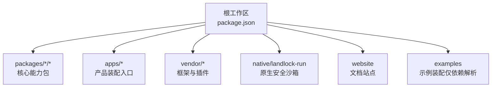
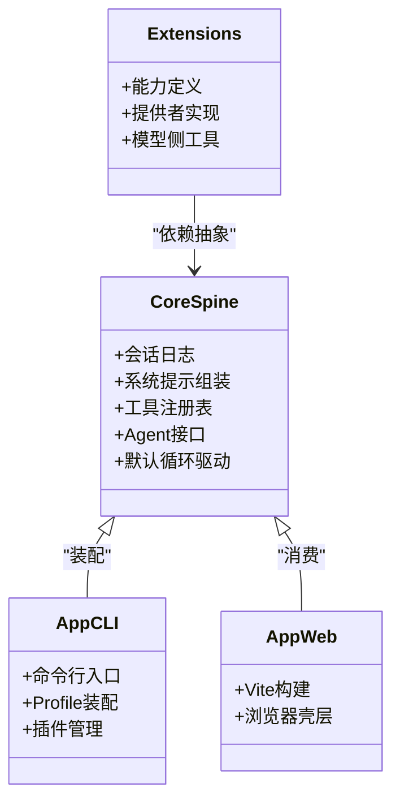
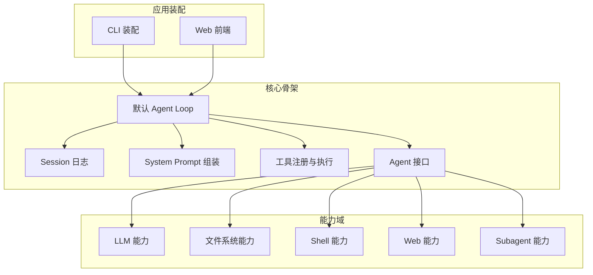
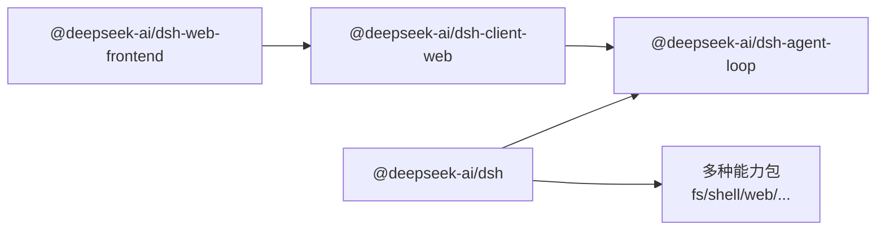
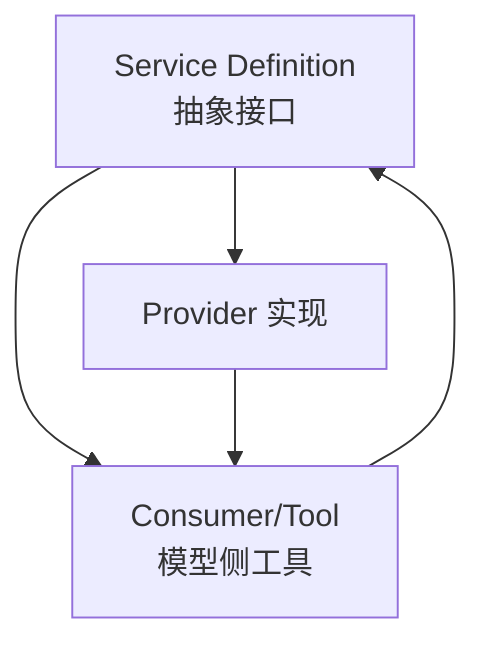
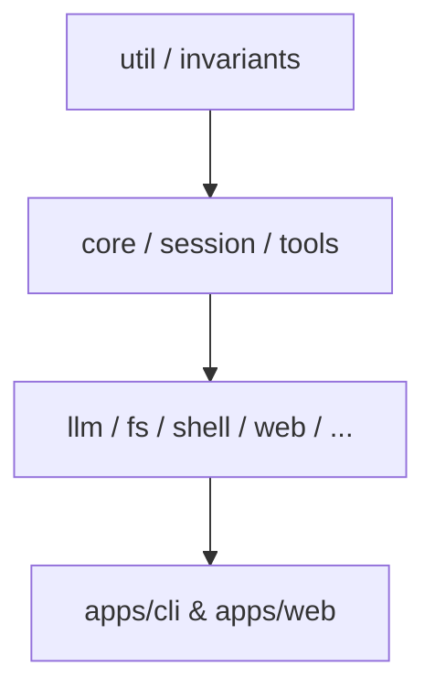
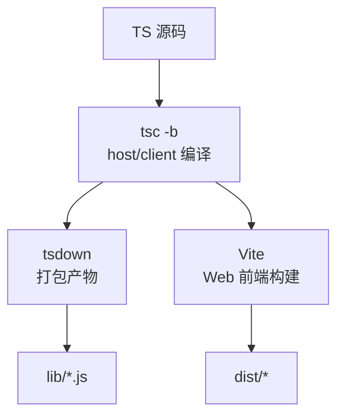
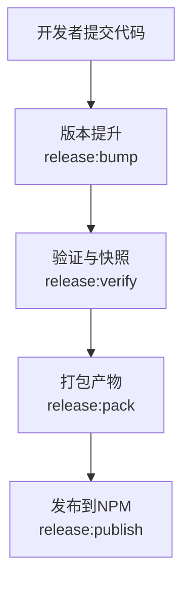
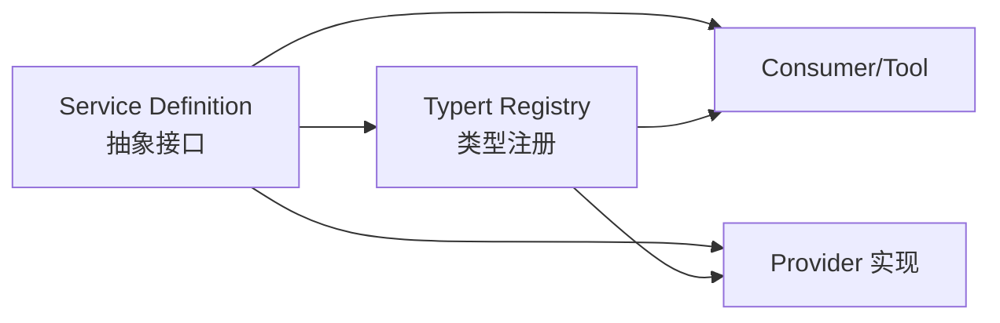
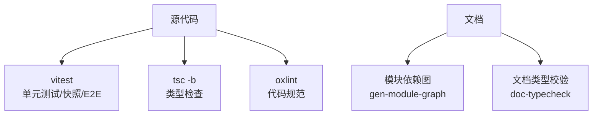

# 模块结构设计

<cite>
**本文引用的文件**
- [package.json](file://package.json)
- [pnpm-workspace.yaml](file://pnpm-workspace.yaml)
- [tsconfig.base.json](file://tsconfig.base.json)
- [packages/README.md](file://packages/README.md)
- [docs/module-graph.md](file://docs/module-graph.md)
- [scripts/gen-module-graph.ts](file://scripts/gen-module-graph.ts)
- [apps/cli/package.json](file://apps/cli/package.json)
- [apps/web/package.json](file://apps/web/package.json)
- [packages/core/README.md](file://packages/core/README.md)
- [docs/subsystems/core.md](file://docs/subsystems/core.md)
</cite>

## 目录
1. [简介](#简介)
2. [项目结构](#项目结构)
3. [核心组件](#核心组件)
4. [架构总览](#架构总览)
5. [详细组件分析](#详细组件分析)
6. [依赖关系与模块化原则](#依赖关系与模块化原则)
7. [TypeScript 配置与构建流程](#typescript-配置与构建流程)
8. [版本管理与发布策略](#版本管理与发布策略)
9. [包间接口设计与契约管理](#包间接口设计与契约管理)
10. [开发工具与调试支持](#开发工具与调试支持)
11. [结论](#结论)

## 简介
本文件系统性阐述 DeepSeek Harness 的模块结构设计，覆盖工作区组织、包分层职责（核心包、应用包、扩展包）、依赖图与模块化原则、统一的 TypeScript 配置与构建流程、版本管理与发布策略、包间接口与契约管理，以及开发与调试支持。文档同时提供可复用的模块关系图，帮助读者快速理解各包之间的依赖方向与边界。

## 项目结构
仓库采用 pnpm workspace 多包管理，根 package.json 声明了 workspaces 范围，将 vendor、packages、native、apps、website 等纳入统一工作区；pnpm-workspace.yaml 进一步细化成员、依赖覆盖与构建脚本白名单，确保安装与构建的可控性。顶层 scripts 提供大量工程化脚本（类型检查、lint、测试、文档生成、发布等），并通过 tsx 执行。



**图表来源**
- [package.json:11-18](file://package.json#L11-L18)
- [pnpm-workspace.yaml:1-22](file://pnpm-workspace.yaml#L1-L22)

**章节来源**
- [package.json:1-18](file://package.json#L1-L18)
- [pnpm-workspace.yaml:1-22](file://pnpm-workspace.yaml#L1-L22)

## 核心组件
- 核心包（core packages）：位于 packages/core，提供会话日志、系统提示组装、工具注册表、Agent 接口与默认循环驱动，是产品稳定 API 的骨架。
- 应用包（app packages）：位于 apps，包括 CLI（dsh）与 Web 前端，负责装配具体能力、启动宿主与浏览器界面。
- 扩展包（extension packages）：位于 packages/extensions 及各类 capability 子组（如 llm、fs、shell、web 等），通过 Service Definition 暴露能力，消费者依赖抽象而非具体实现，保证可替换性。



**图表来源**
- [packages/core/README.md:1-22](file://packages/core/README.md#L1-L22)
- [apps/cli/package.json:22-84](file://apps/cli/package.json#L22-L84)
- [apps/web/package.json:28-49](file://apps/web/package.json#L28-L49)

**章节来源**
- [packages/core/README.md:1-22](file://packages/core/README.md#L1-L22)
- [apps/cli/package.json:1-102](file://apps/cli/package.json#L1-L102)
- [apps/web/package.json:1-52](file://apps/web/package.json#L1-L52)

## 架构总览
Harness 以“能力分离”为核心：每个能力域（llm、fs、shell、web、subagent、session 等）拆分为 Service Definition、Provider 实现与 Consumer/Tool 三层，通过 ctx 键与服务注册机制组合。CLI 与 Web 作为装配层，选择并挂载所需能力。模块依赖由 peerDependencies 驱动，并由脚本自动生成可视化依赖图。



**图表来源**
- [docs/subsystems/core.md:1-20](file://docs/subsystems/core.md#L1-L20)
- [docs/module-graph.md:1-120](file://docs/module-graph.md#L1-L120)

## 详细组件分析

### 核心子系统（Core Subsystem）
- 职责：事件溯源的 Session 日志、系统提示拼装、工具注册与执行管线、Agent 公共接口与默认循环驱动。
- 关键要点：
  - session 为唯一事实源，所有模型可见事实追加到日志。
  - system-prompt 按段组装，结合工具 schema。
  - tools 提供作用域化的工具注册与执行保护。
  - agent 暴露 send/followup/steer/inject/cancel 等统一入口，loop 实现默认驱动。
  - scope 提供无环的共享作用域原语。

```mermaid
sequenceDiagram
participant U as "调用方"
participant CLI as "CLI/Web"
participant AG as "Agent(接口)"
participant LOOP as "默认循环"
participant SESS as "Session 日志"
participant PROMPT as "System Prompt"
participant TOOLS as "工具注册表"
participant LLM as "LLM 能力"
U->>CLI : 发送消息/指令
CLI->>AG : followup/send/steer
AG->>LOOP : 入队/唤醒
LOOP->>SESS : 打开 turn 并读取历史
LOOP->>PROMPT : 拼装请求前缀
LOOP->>LLM : 发起模型请求
LLM-->>LOOP : 流式响应
LOOP->>TOOLS : 调度工具调用
TOOLS-->>LOOP : 工具结果
LOOP->>SESS : 追加模型可见事实
LOOP-->>AG : 状态推进/完成
AG-->>CLI : 事件/状态更新
```

**图表来源**
- [docs/subsystems/core.md:1-20](file://docs/subsystems/core.md#L1-L20)
- [docs/subsystems/core.md:22-55](file://docs/subsystems/core.md#L22-L55)

**章节来源**
- [docs/subsystems/core.md:1-200](file://docs/subsystems/core.md#L1-L200)
- [packages/core/README.md:1-22](file://packages/core/README.md#L1-L22)

### 应用装配（CLI 与 Web）
- CLI（@deepseek-ai/dsh）：profile 启动、插件管理、浏览器 UI 别名；通过 workspace:^ 引用大量 dsh-* 能力包进行装配。
- Web（@deepseek-ai/dsh-web-frontend）：基于 Vite 构建，消费 dsh-client-web 壳层，产出 dist 供 CLI 服务。



**图表来源**
- [apps/cli/package.json:22-84](file://apps/cli/package.json#L22-L84)
- [apps/web/package.json:28-49](file://apps/web/package.json#L28-L49)

**章节来源**
- [apps/cli/package.json:1-102](file://apps/cli/package.json#L1-L102)
- [apps/web/package.json:1-52](file://apps/web/package.json#L1-L52)

### 能力域与扩展点
- 每个能力域包含：Service Definition（抽象）、Provider（具体实现）、Consumer/Tool（模型侧工具）。
- 扩展插件依赖 Service Definition，不直接依赖具体 Provider，从而保持可替换性与演进独立性。
- 典型能力域：llm、fs、shell、terminal、web、subagent、jobs、workflow、session、storage、settings、credentials、interaction、host/client 等。



**图表来源**
- [packages/README.md:63-69](file://packages/README.md#L63-L69)

**章节来源**
- [packages/README.md:1-70](file://packages/README.md#L1-L70)

## 依赖关系与模块化原则
- 依赖信号：peerDependencies 被视为运行时依赖的权威来源，脚本据此生成模块依赖图。
- 分组与命名：packages/<group>/<pkg>，npm 包名统一为 @deepseek-ai/dsh-<pkg>。
- 依赖方向：低层 util/invariants 被广泛依赖；核心骨架处于中间层；上层能力与 UI 依赖核心与能力抽象；应用装配在最外层。
- 生成与维护：docs/module-graph.md 由脚本自动生成，CI 中校验新鲜度。



**图表来源**
- [docs/module-graph.md:1-120](file://docs/module-graph.md#L1-L120)
- [scripts/gen-module-graph.ts:1-120](file://scripts/gen-module-graph.ts#L1-L120)

**章节来源**
- [docs/module-graph.md:1-800](file://docs/module-graph.md#L1-L800)
- [scripts/gen-module-graph.ts:1-120](file://scripts/gen-module-graph.ts#L1-L120)

## TypeScript 配置与构建流程
- 基础配置：tsconfig.base.json 集中定义 target、moduleResolution、declaration、strict 等，并通过 paths 映射本地包与 vendor，避免在每个包重复配置。
- 构建目标：根脚本通过 tsc -b 编译 host/client 两套产物，再使用 tsdown 生成最终库；Web 端使用 Vite 构建。
- 路径与别名：paths 将 @deepseek-ai/dsh-* 指向对应源码目录，便于 IDE 与类型检查；vendor 包通过路径重定向到本地源码。
- 构建面：通过环境变量 DSH_BUILD_FACE 区分 host/client 构建面，确保客户端不包含 Node 环境符号。



**图表来源**
- [tsconfig.base.json:1-280](file://tsconfig.base.json#L1-L280)
- [package.json:19-24](file://package.json#L19-L24)

**章节来源**
- [tsconfig.base.json:1-280](file://tsconfig.base.json#L1-L280)
- [package.json:19-24](file://package.json#L19-L24)

## 版本管理与发布策略
- 工作区版本：根 package.json 维护根版本与工作区成员版本；apps/cli 与 apps/web 各自维护版本与发布配置。
- 发布脚本：根脚本提供 release:dsh、release:vendor、release:verify、release:pack、release:publish 等命令，配合 scripts/release 下的脚本完成版本提升、打包与发布。
- 一致性约束：pnpm-workspace.yaml 中的 overrides、allowBuilds、patchedDependencies 控制依赖与构建行为，确保跨平台一致。
- 发布产物：CLI 输出 lib/bin.js 作为可执行入口；Web 输出 dist 静态资源。



**图表来源**
- [package.json:129-135](file://package.json#L129-L135)
- [apps/cli/package.json:4-19](file://apps/cli/package.json#L4-L19)
- [apps/web/package.json:4-20](file://apps/web/package.json#L4-L20)

**章节来源**
- [package.json:129-135](file://package.json#L129-L135)
- [apps/cli/package.json:1-102](file://apps/cli/package.json#L1-L102)
- [apps/web/package.json:1-52](file://apps/web/package.json#L1-L52)

## 包间接口设计与契约管理
- 抽象优先：扩展插件依赖 Service Definition，不依赖具体 Provider；UI、Hook、Tool 插件使用 dsh-agent 抽象。
- 类型契约：通过 Typert 协议与 registry 在运行时加载类型图，确保跨进程/跨包的类型一致性。
- 作用域与键：ctx 键（如 ctx.sessions、ctx.systemPrompt、ctx.tools、ctx.agents）明确能力归属与访问方式。
- 不变量与校验：invariants 包提供跨包不变量检查，保障契约不被破坏。



**图表来源**
- [tsconfig.base.json:40-150](file://tsconfig.base.json#L40-L150)
- [packages/README.md:63-69](file://packages/README.md#L63-L69)

**章节来源**
- [tsconfig.base.json:1-280](file://tsconfig.base.json#L1-L280)
- [packages/README.md:63-69](file://packages/README.md#L63-L69)

## 开发工具与调试支持
- 测试：vitest 统一测试框架，支持单元、快照、Web 性能与压力测试；根脚本提供 test、test:e2e、test:snapshot、test:web 等。
- 类型与Lint：tsc -b 类型检查，oxlint 代码规范检查；脚本提供 typecheck、lint、lint:fix 等。
- 文档与图谱：gen-module-graph 生成模块依赖图；doc-typecheck 校验文档类型引用；verify-* 系列脚本保障仓库一致性。
- 调试：dev:web 启动 Web 开发服务器；mock:llm 提供 LLM Mock Server；示例装配便于端到端验证。



**图表来源**
- [package.json:34-128](file://package.json#L34-L128)
- [scripts/gen-module-graph.ts:1-120](file://scripts/gen-module-graph.ts#L1-L120)

**章节来源**
- [package.json:34-128](file://package.json#L34-L128)
- [scripts/gen-module-graph.ts:1-120](file://scripts/gen-module-graph.ts#L1-L120)

## 结论
DeepSeek Harness 通过清晰的分层与能力解耦，实现了高内聚、低耦合的模块化架构。核心包提供稳定的产品骨架，应用包负责装配与运行，扩展包通过抽象接口实现能力扩展。统一的 TypeScript 配置与构建流程保障了跨环境一致性，严格的依赖与契约管理确保了系统的可演进性与可维护性。借助完善的开发工具链与自动化脚本，团队可以高效地迭代与发布。