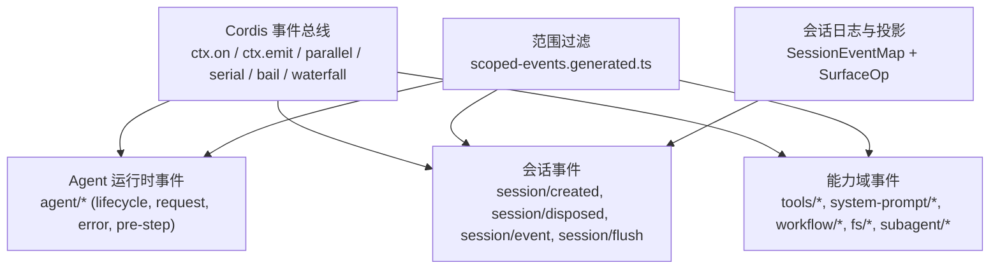
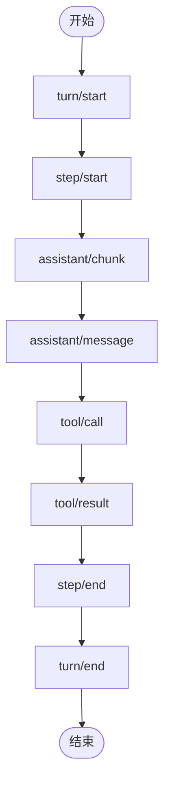
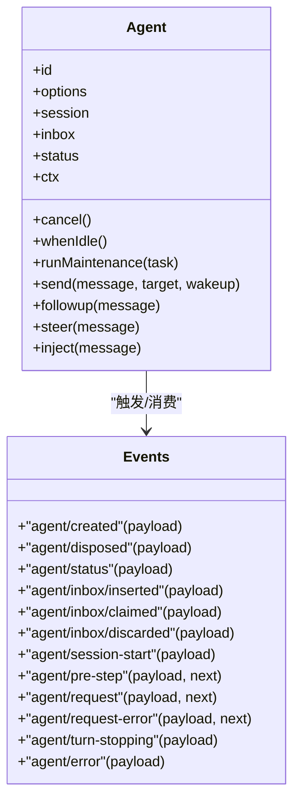
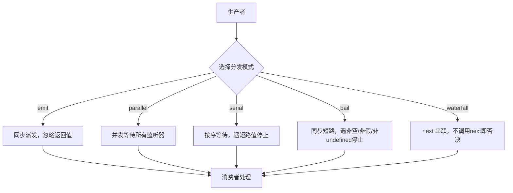
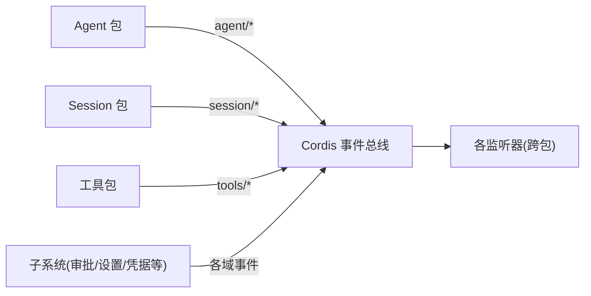

# 事件驱动模式

<cite>
**本文引用的文件**
- [packages/core/agent/src/runtime-types.ts](file://packages/core/agent/src/runtime-types.ts)
- [packages/core/session/src/types.ts](file://packages/core/session/src/types.ts)
- [packages/core/scope/src/scoped-events.generated.ts](file://packages/core/scope/src/scoped-events.generated.ts)
- [docs/cordis-api/events.md](file://docs/cordis-api/events.md)
- [docs/event-producer-consumer.md](file://docs/event-producer-consumer.md)
- [packages/subagent/subagent/src/lifecycle.ts](file://packages/subagent/subagent/src/lifecycle.ts)
- [packages/core/agent/tests/agent.spec.ts](file://packages/core/agent/tests/agent.spec.ts)
- [packages/goal/goal-round-driver/tests/goal-round-driver.spec.ts](file://packages/goal/goal-round-driver/tests/goal-round-driver.spec.ts)
- [packages/extensions/tool-cordis/src/api-catalog.ts](file://packages/extensions/tool-cordis/src/api-catalog.ts)
- [packages/session-query/session-query/src/tracing.ts](file://packages/session-query/session-query/src/tracing.ts)
</cite>

## 目录
1. [简介](#简介)
2. [项目结构](#项目结构)
3. [核心组件](#核心组件)
4. [架构总览](#架构总览)
5. [详细组件分析](#详细组件分析)
6. [依赖关系分析](#依赖关系分析)
7. [性能考量](#性能考量)
8. [故障排查指南](#故障排查指南)
9. [结论](#结论)
10. [附录](#附录)

## 简介
本文件系统性阐述 DeepSeek Harness 中的事件驱动模式，聚焦“生产者-消费者”机制在系统中的核心作用。围绕会话事件、Agent 事件与能力（工具/系统提示等）事件三类主题，说明事件类型体系、生命周期管理、监听器注册与执行顺序，并提供自定义事件创建与现有事件处理的实践指引，以及调试与监控的最佳实践。

## 项目结构
Harness 的事件体系由三层构成：
- 总线与分发：基于 Cordis 的 ctx.on/ctx.emit/ctx.parallel/ctx.serial/ctx.bail/ctx.waterfall，提供同步、并行、短路、水闸等多种分发模式。
- 领域事件：SessionEventMap（会话日志）、Agent 运行时事件（Agent 生命周期、请求、错误、步骤控制）、能力域事件（工具调用、系统提示组装、工作流等）。
- 范围与持久化：Scoped 事件路由将事件限定到 Agent 或 Session 范围；Session 事件具备可持久化的不可变日志与“表面节点”投影，支持回放与压缩。



图表来源
- [docs/cordis-api/events.md:8-123](file://docs/cordis-api/events.md#L8-L123)
- [packages/core/scope/src/scoped-events.generated.ts:10-37](file://packages/core/scope/src/scoped-events.generated.ts#L10-L37)
- [packages/core/session/src/types.ts:236-437](file://packages/core/session/src/types.ts#L236-L437)

章节来源
- [docs/cordis-api/events.md:8-123](file://docs/cordis-api/events.md#L8-L123)
- [packages/core/scope/src/scoped-events.generated.ts:10-37](file://packages/core/scope/src/scoped-events.generated.ts#L10-L37)
- [packages/core/session/src/types.ts:236-437](file://packages/core/session/src/types.ts#L236-L437)

## 核心组件
- 事件总线与分发模式
  - emit：同步派发，忽略返回值，适合纯通知。
  - parallel：并发等待所有监听器完成。
  - serial：按序等待，遇到第一个“提前终止值”即停止。
  - bail：同步短路，遇到第一个非空/非假/非 undefined 返回值即停止。
  - waterfall：以 next 回调串联监听器，允许拦截与改写后续行为。
- 会话事件（SessionEventMap）
  - 不可变追加日志，包含 turn/step、用户消息、助手消息、工具调用与结果、请求头快照等。
  - 表面节点（SurfaceEventType）用于构建可见对话面，支持 append 与 replace 操作。
  - 已知事件集（KNOWN_SESSION_EVENT_TYPES）保障回放兼容性。
- Agent 事件
  - 生命周期：agent/created、agent/disposed、agent/status。
  - 运行期：agent/inbox/*、agent/session-start、agent/pre-step、agent/request、agent/request-error、agent/turn-stopping、agent/error。
  - 支持 Scoped 范围过滤，仅目标 Agent 的监听器接收。
- 能力域事件
  - 工具链：tools/pre-execute、tools/execute、tools/post-execute、tools/result、tools/code-dispatch-log。
  - 系统提示：system-prompt/assemble、system-prompt/change。
  - 子代理：subagent/start、subagent/end、subagent/provider-added/removed。
  - 文件系统：fs/write-intent、fs/edit-intent、fs/observed。
  - 工作流：workflow/start、workflow/phase、workflow/log、workflow/end、workflow/agent-start、workflow/agent-end。

章节来源
- [docs/cordis-api/events.md:8-123](file://docs/cordis-api/events.md#L8-L123)
- [packages/core/session/src/types.ts:236-437](file://packages/core/session/src/types.ts#L236-L437)
- [packages/core/agent/src/runtime-types.ts:146-291](file://packages/core/agent/src/runtime-types.ts#L146-L291)
- [docs/event-producer-consumer.md:10-66](file://docs/event-producer-consumer.md#L10-L66)

## 架构总览
下图展示一次“模型请求”从 Agent 循环到 LLM 适配器，再到工具执行与结果回写的端到端事件流。

```mermaid
sequenceDiagram
participant Loop as "AgentLoop"
participant Agent as "Agent"
participant Bus as "Cordis 事件总线"
participant LLM as "LLM 适配器"
participant Tools as "工具执行管线"
participant Session as "Session(日志)"
Loop->>Bus : 触发 agent/pre-step(waterfall)
Note over Loop,Bus : 多个能力插件可改写进入步骤的消息集合
Loop->>Bus : 触发 agent/request(waterfall)
Note over Loop,Bus : 可替换最终请求配置
Loop->>LLM : 发起模型调用
LLM-->>Loop : 返回流式片段/结果
Loop->>Session : 写入 assistant/chunk / assistant/message
Loop->>Tools : tools/pre-execute -> tools/execute -> tools/post-execute
Tools-->>Loop : tool/result
Loop->>Session : 写入 tool/call / tool/result
Loop->>Bus : 触发 agent/turn-stopping(serial)
Note over Loop,Bus : 决定本轮是否结束
```

图表来源
- [packages/core/agent/src/runtime-types.ts:219-278](file://packages/core/agent/src/runtime-types.ts#L219-L278)
- [packages/core/session/src/types.ts:236-333](file://packages/core/session/src/types.ts#L236-L333)
- [docs/event-producer-consumer.md:18-61](file://docs/event-producer-consumer.md#L18-L61)

## 详细组件分析

### 会话事件（SessionEventMap）
- 设计要点
  - 不可变追加日志，seq/time 单调递增，确保回放一致性。
  - SurfaceEventType（user/message、assistant/message、tool/result）可携带 surfaceOp（append/replace），用于构建可见对话面。
  - KNOWN_SESSION_EVENT_TYPES 限制回放时能识别的事件集，未知但标记 ignorable 的事件可安全跳过。
- 典型流程
  - turn/start → step/start → assistant/chunk → assistant/message → tool/call → tool/result → step/end → turn/end。
  - 压缩（compaction）通过 replace 操作替换历史片段，保持序列连续性与溯源（sourceEventSeqs）。



图表来源
- [packages/core/session/src/types.ts:236-333](file://packages/core/session/src/types.ts#L236-L333)
- [packages/core/session/src/types.ts:335-437](file://packages/core/session/src/types.ts#L335-L437)

章节来源
- [packages/core/session/src/types.ts:236-437](file://packages/core/session/src/types.ts#L236-L437)

### Agent 事件（生命周期与扩展点）
- 生命周期
  - agent/created：Agent 与 Session 已就绪，首个可注入启动点的通知。
  - agent/disposed：Agent 离开注册表，驱动已静默，作用域正在展开。
  - agent/status：idle/running 状态切换。
- 运行期扩展点
  - agent/pre-step：waterfall，可拒绝或替换进入步骤的消息。
  - agent/request：waterfall，可替换请求配置。
  - agent/request-error：waterfall，可返回重试动作或委托默认处理。
  - agent/turn-stopping：serial，决定是否结束本轮。
  - agent/inbox/*：消息入队、认领、丢弃。
  - agent/error：错误上报。
- 范围过滤
  - 通过 scoped-events.generated.ts 解析事件负载中的 Agent 引用，实现按 Agent 隔离的监听。



图表来源
- [packages/core/agent/src/runtime-types.ts:64-144](file://packages/core/agent/src/runtime-types.ts#L64-L144)
- [packages/core/agent/src/runtime-types.ts:146-291](file://packages/core/agent/src/runtime-types.ts#L146-L291)
- [packages/core/scope/src/scoped-events.generated.ts:10-37](file://packages/core/scope/src/scoped-events.generated.ts#L10-L37)

章节来源
- [packages/core/agent/src/runtime-types.ts:146-291](file://packages/core/agent/src/runtime-types.ts#L146-L291)
- [packages/core/scope/src/scoped-events.generated.ts:10-37](file://packages/core/scope/src/scoped-events.generated.ts#L10-L37)

### 能力事件（工具、系统提示、工作流、子代理、文件系统）
- 工具执行管线
  - tools/pre-execute → tools/execute → tools/post-execute → tools/result，均为 waterfall，便于策略拦截、记录与后置处理。
- 系统提示
  - system-prompt/assemble：waterfall，组合系统提示；system-prompt/change：变更通知。
- 工作流
  - workflow/start/phase/log/end 及 agent-start/agent-end，编排多 Agent 协作。
- 子代理
  - subagent/start/end 与 provider 增删事件，封装内部生命周期。
- 文件系统
  - fs/write-intent/edit-intent 为意图拦截（waterfall），fs/observed 为观察结果（emit）。

章节来源
- [docs/event-producer-consumer.md:34-61](file://docs/event-producer-consumer.md#L34-L61)

### 事件生命周期管理（产生→消费）
- 产生
  - 业务模块在关键边界触发事件（如 AgentLoop、Session、工具执行、子代理生命周期）。
- 分发
  - 根据事件语义选择分发模式：通知用 emit，需要幂等聚合用 parallel，需要短路决策用 serial/bail，需要改写/拦截用 waterfall。
- 消费
  - 监听器通过 ctx.on/ctx.once 注册，支持 prepend/global 选项；Scoped 事件按 Agent/Session 路由。
- 收尾
  - 对异步监听器使用 Promise 收敛（parallel）或短路（serial/bail）；waterfall 中不调用 next 即否决后续。



图表来源
- [docs/cordis-api/events.md:8-123](file://docs/cordis-api/events.md#L8-L123)

章节来源
- [docs/cordis-api/events.md:8-123](file://docs/cordis-api/events.md#L8-L123)

### 事件类型系统与范围路由
- 会话事件类型
  - SessionEventMap 定义全部可追加事件；SurfaceEventType 限定可出现在“表面”的事件；KNOWN_SESSION_EVENT_TYPES 约束回放兼容。
- Agent 事件类型
  - 在 @deepseek-ai/dsh-agent 模块声明，覆盖生命周期、运行期扩展点与错误通知。
- 范围路由
  - scoped-events.generated.ts 为每个受范围过滤的事件提供解析函数，从事件负载中提取 Agent/Scope 标识，实现精准投递。

章节来源
- [packages/core/session/src/types.ts:236-437](file://packages/core/session/src/types.ts#L236-L437)
- [packages/core/agent/src/runtime-types.ts:146-291](file://packages/core/agent/src/runtime-types.ts#L146-L291)
- [packages/core/scope/src/scoped-events.generated.ts:10-37](file://packages/core/scope/src/scoped-events.generated.ts#L10-L37)

### 监听器注册机制与执行顺序
- 注册
  - ctx.on(name, listener, options?)：支持 prepend（前置）与 global（绕过范围过滤）。
  - ctx.once(name, listener, options?)：首次调用后自动注销。
- 执行顺序
  - emit：无序且不同步等待。
  - parallel：并发执行，统一等待。
  - serial：按注册顺序依次等待，遇短路值停止。
  - bail：同步短路。
  - waterfall：按注册顺序包裹 next，不调用 next 即拦截。
- 范围过滤
  - 对于带 Agent/Scope 的事件，仅匹配到的监听器被调用。

章节来源
- [docs/cordis-api/events.md:125-207](file://docs/cordis-api/events.md#L125-L207)
- [packages/core/scope/src/scoped-events.generated.ts:10-37](file://packages/core/scope/src/scoped-events.generated.ts#L10-L37)

### 代码示例（路径引用）
- 创建自定义事件并监听
  - 在所属包中合并 Events 接口声明事件签名，并在关键路径使用 ctx.emit/ctx.parallel/ctx.serial/ctx.bail/ctx.waterfall 派发。
  - 参考：[packages/core/agent/src/runtime-types.ts:146-291](file://packages/core/agent/src/runtime-types.ts#L146-L291)
- 处理现有事件
  - 在插件初始化阶段使用 ctx.on('agent/created', ...) 订阅 Agent 生命周期。
  - 参考：[packages/core/agent/tests/agent.spec.ts:221-232](file://packages/core/agent/tests/agent.spec.ts#L221-L232)
- 工具执行前后钩子
  - 订阅 tools/pre-execute/tools/post-execute 进行审计或策略调整。
  - 参考：[docs/event-producer-consumer.md:56-61](file://docs/event-producer-consumer.md#L56-L61)
- 子代理生命周期
  - 订阅 subagent/start/end 进行资源管理与观测。
  - 参考：[packages/subagent/subagent/src/lifecycle.ts:91-123](file://packages/subagent/subagent/src/lifecycle.ts#L91-L123)

章节来源
- [packages/core/agent/src/runtime-types.ts:146-291](file://packages/core/agent/src/runtime-types.ts#L146-L291)
- [packages/core/agent/tests/agent.spec.ts:221-232](file://packages/core/agent/tests/agent.spec.ts#L221-L232)
- [docs/event-producer-consumer.md:56-61](file://docs/event-producer-consumer.md#L56-L61)
- [packages/subagent/subagent/src/lifecycle.ts:91-123](file://packages/subagent/subagent/src/lifecycle.ts#L91-L123)

## 依赖关系分析
- 松耦合
  - 生产者与消费者通过事件名称与载荷解耦，跨包通信不直接依赖对方实现。
- 范围隔离
  - Scoped 路由确保事件仅在相关 Agent/Session 内传播，降低噪声与副作用。
- 可观测性
  - 大量事件暴露了系统关键路径（工具执行、会话流转、Agent 状态），便于遥测与诊断。



图表来源
- [docs/event-producer-consumer.md:10-66](file://docs/event-producer-consumer.md#L10-L66)

章节来源
- [docs/event-producer-consumer.md:10-66](file://docs/event-producer-consumer.md#L10-L66)

## 性能考量
- 选择合适的分发模式
  - 高频通知优先 emit；需要聚合结果用 parallel；需要短路决策用 serial/bail；需要改写流程用 waterfall。
- 避免阻塞
  - 长耗时监听器应尽快返回并使用后台任务；waterfall 中谨慎调用 next，避免形成串行瓶颈。
- 范围过滤减少开销
  - 利用 Scoped 事件路由，只向必要监听器派发，降低无关处理成本。
- 会话日志体积
  - 合理使用 compaction（replace）与 log-only 事件，控制日志规模与回放成本。

## 故障排查指南
- 监听器异常隔离
  - 子代理生命周期发射器对监听器抛错进行捕获与告警，避免影响其他监听器与清理流程。
  - 参考：[packages/subagent/subagent/src/lifecycle.ts:91-123](file://packages/subagent/subagent/src/lifecycle.ts#L91-L123)
- 创建失败的回滚与配对
  - 若 agent/created 监听器抛出，会触发 agent/disposed 配对清理，保证注册表一致。
  - 参考：[packages/core/agent/tests/agent.spec.ts:221-232](file://packages/core/agent/tests/agent.spec.ts#L221-L232)
- 孤儿会话事件处理
  - 无精确拥有 Agent 的会话事件会被忽略，已销毁 Agent 的状态会被回收。
  - 参考：[packages/goal/goal-round-driver/tests/goal-round-driver.spec.ts:1031-1047](file://packages/goal/goal-round-driver/tests/goal-round-driver.spec.ts#L1031-L1047)
- 事件追踪与可视化
  - 使用 session-query 的事件追踪能力，查看事件在当前表面、被替代链与源事件链中的位置。
  - 参考：[packages/session-query/session-query/src/tracing.ts:175-218](file://packages/session-query/session-query/src/tracing.ts#L175-L218)

章节来源
- [packages/subagent/subagent/src/lifecycle.ts:91-123](file://packages/subagent/subagent/src/lifecycle.ts#L91-L123)
- [packages/core/agent/tests/agent.spec.ts:221-232](file://packages/core/agent/tests/agent.spec.ts#L221-L232)
- [packages/goal/goal-round-driver/tests/goal-round-driver.spec.ts:1031-1047](file://packages/goal/goal-round-driver/tests/goal-round-driver.spec.ts#L1031-L1047)
- [packages/session-query/session-query/src/tracing.ts:175-218](file://packages/session-query/session-query/src/tracing.ts#L175-L218)

## 结论
DeepSeek Harness 的事件驱动模式以 Cordis 事件总线为核心，结合 Session 不可变日志与 Agent 运行时事件，构建了高内聚、低耦合、可扩展的系统骨架。通过多种分发模式与范围路由，既能满足高性能通知需求，又能支撑复杂流程编排与强一致性要求。借助完善的追踪与测试用例，开发者可以可靠地扩展与调试事件链路。

## 附录
- 事件矩阵与完整清单
  - 参见事件生产方与消费方矩阵，了解各事件的声明位置、派发方式与监听者。
  - 参考：[docs/event-producer-consumer.md:10-66](file://docs/event-producer-consumer.md#L10-L66)
- API 目录
  - 事件与上下文 API 的完整条目可在工具扩展包的 API 目录中查阅。
  - 参考：[packages/extensions/tool-cordis/src/api-catalog.ts:2158-2178](file://packages/extensions/tool-cordis/src/api-catalog.ts#L2158-L2178)