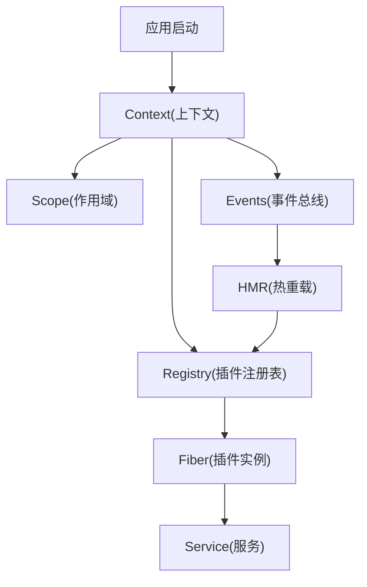
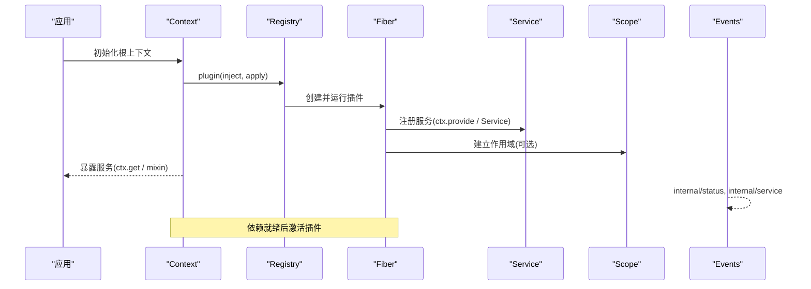
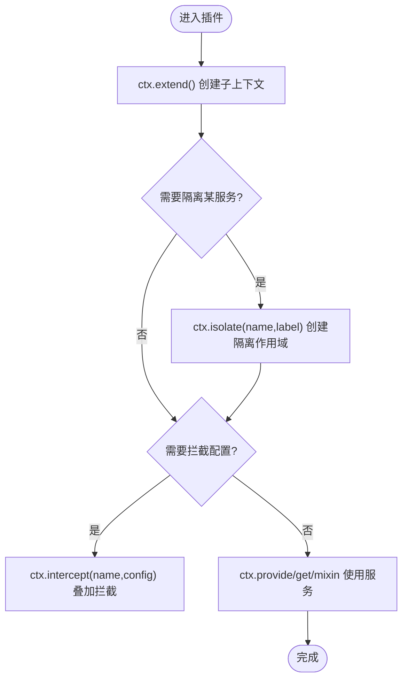
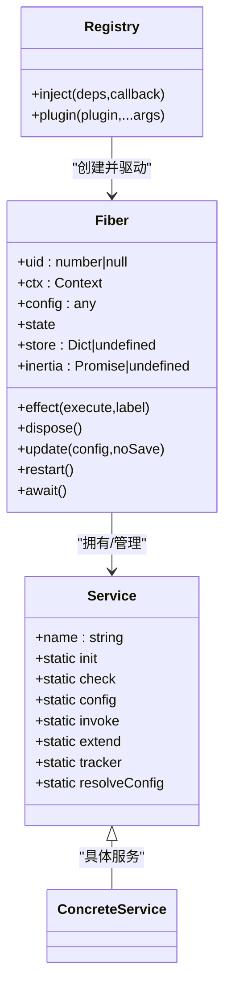
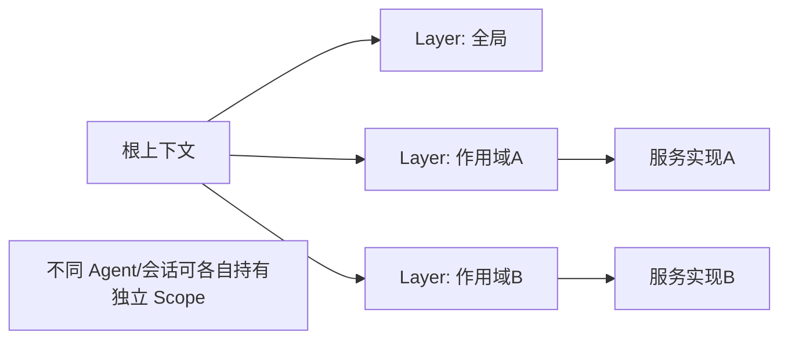
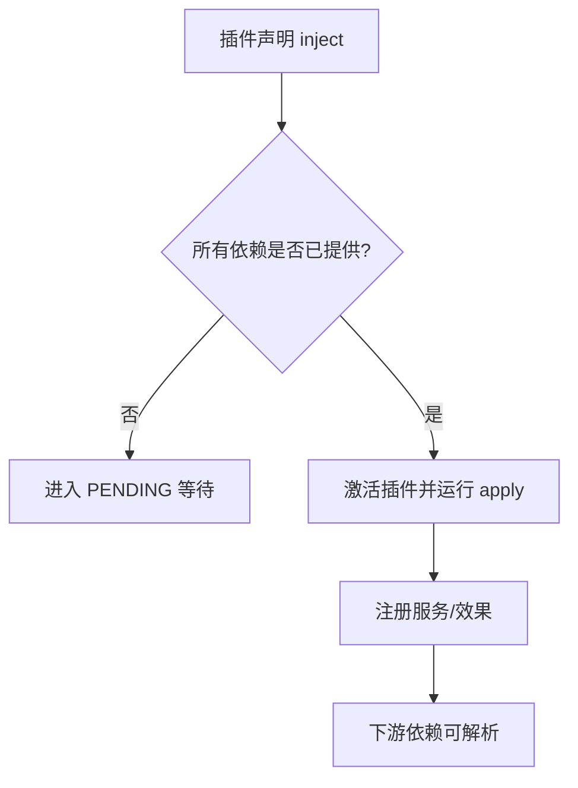
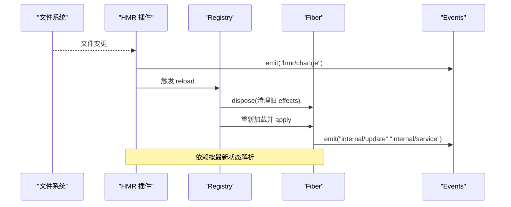
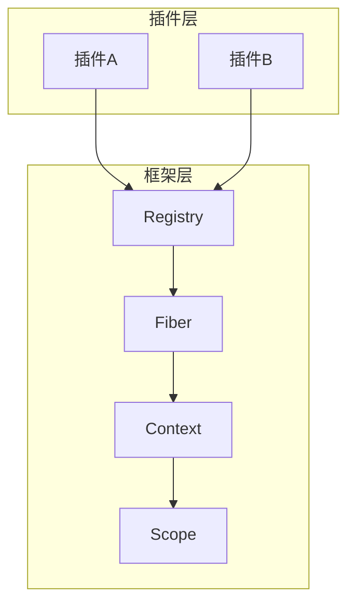

# 依赖注入模式

<cite>
**本文引用的文件**
- [context.md](file://docs/cordis-api/context.md)
- [service.md](file://docs/cordis-api/service.md)
- [registry.md](file://docs/cordis-api/registry.md)
- [fiber.md](file://docs/cordis-api/fiber.md)
- [scope.md](file://docs/subsystems/scope.md)
- [06-composition-and-hmr.md](file://docs/cordis-tutorial/06-composition-and-hmr.md)
- [inherited.md](file://docs/cordis-api/inherited.md)
</cite>

## 目录
1. [简介](#简介)
2. [项目结构](#项目结构)
3. [核心组件](#核心组件)
4. [架构总览](#架构总览)
5. [详细组件分析](#详细组件分析)
6. [依赖关系分析](#依赖关系分析)
7. [性能考量](#性能考量)
8. [故障排查指南](#故障排查指南)
9. [结论](#结论)
10. [附录](#附录)

## 简介
本文件系统性阐述 DeepSeek Harness 中基于 Cordis 的依赖注入（DI）模式，覆盖服务注册与发现、上下文（ctx）层级与作用域隔离、服务提供者（Service Provider）生命周期、依赖解析顺序与循环依赖处理策略，以及热重载（HMR）时的依赖重加载机制。文档面向不同技术背景的读者，提供从概念到代码级映射的分层说明与可视化图示。

## 项目结构
Cordis 在 DeepSeek Harness 中以“插件化 + 上下文 + 作用域”的方式组织：
- 上下文（Context）是 DI 的核心入口，提供 get/provide/accessor/mixin/isolate/extend/intercept 等能力。
- 服务（Service）以插件形式挂载到 ctx，并通过 fiber 管理生命周期。
- 注册表（Registry）负责插件加载、依赖声明与执行。
- 作用域（Scope）为跨 Agent/会话的可见性与生命周期边界提供抽象。
- HMR 通过事件与 fiber 重启实现热重载。

图表来源
- [context.md:1-165](file://docs/cordis-api/context.md#L1-L165)
- [registry.md:1-153](file://docs/cordis-api/registry.md#L1-L153)
- [fiber.md:1-120](file://docs/cordis-api/fiber.md#L1-L120)
- [scope.md:1-60](file://docs/subsystems/scope.md#L1-L60)
- [inherited.md:23-39](file://docs/cordis-api/inherited.md#L23-L39)

章节来源
- [context.md:1-165](file://docs/cordis-api/context.md#L1-L165)
- [registry.md:1-153](file://docs/cordis-api/registry.md#L1-L153)
- [fiber.md:1-120](file://docs/cordis-api/fiber.md#L1-L120)
- [scope.md:1-60](file://docs/subsystems/scope.md#L1-L60)
- [inherited.md:23-39](file://docs/cordis-api/inherited.md#L23-L39)

## 核心组件
- 上下文（Context）
  - 作为代理对象，属性读取走服务解析器；extend/isolate/intercept 创建子上下文而不修改父上下文。
  - 提供 get/set/provide/accessor/mixin 等存储与元数据能力。
- 服务（Service）
  - 基类用于在 ctx 上暴露具名 API；构造时立即注册，随所属 fiber 自动移除。
  - 支持 init/check/config/invoke/extend/tracker/resolveConfig 等扩展点。
- 注册表（Registry）
  - 提供 inject/plugin 等 API，支持函数/类/对象三种插件形态。
  - 维护插件运行时记录（fibers、callback、Config）。
- Fiber
  - 一个插件实例的生命周期载体，跟踪依赖状态、配置、effects 与清理。
  - 提供 effect/dispose/update/restart/await 等方法。
- 作用域（Scope）
  - 提供身份键、承载者与分层注册语义，使同一注册在不同 Agent/会话间具有可见性与生命周期边界。

章节来源
- [context.md:1-165](file://docs/cordis-api/context.md#L1-L165)
- [service.md:1-103](file://docs/cordis-api/service.md#L1-L103)
- [registry.md:1-153](file://docs/cordis-api/registry.md#L1-L153)
- [fiber.md:1-120](file://docs/cordis-api/fiber.md#L1-L120)
- [scope.md:1-60](file://docs/subsystems/scope.md#L1-L60)

## 架构总览
下图展示 Cordis 在 DeepSeek Harness 中的整体架构：应用通过 Context 启动，Registry 加载插件并创建 Fiber；Fiber 内注册 Service；Scope 提供跨 Agent/会话的可见性隔离；Events 贯穿生命周期与 HMR 流程。

图表来源
- [registry.md:1-153](file://docs/cordis-api/registry.md#L1-L153)
- [fiber.md:1-120](file://docs/cordis-api/fiber.md#L1-L120)
- [context.md:1-165](file://docs/cordis-api/context.md#L1-L165)
- [scope.md:1-60](file://docs/subsystems/scope.md#L1-L60)
- [inherited.md:23-39](file://docs/cordis-api/inherited.md#L23-L39)

## 详细组件分析

### 上下文（ctx）与作用域层级
- ctx.extend(meta)：创建携带额外元数据的子上下文，原型继承父上下文，不修改父。
- ctx.isolate(name, label?)：为指定服务名创建独立作用域的子上下文，便于不同 Agent/会话隔离实现。
- ctx.intercept(name, config)：为后续加载的插件叠加该服务的拦截配置。
- ctx.root/baseUrl/events/logger/reflect/registry：根上下文引用、基础 URL、事件总线、日志、反射层、插件注册表。
- 存储与混合：get/set/provide/accessor/mixin 提供服务读写、计算属性与快捷方法混入。

图表来源
- [context.md:14-96](file://docs/cordis-api/context.md#L14-L96)
- [context.md:237-365](file://docs/cordis-api/context.md#L237-L365)

章节来源
- [context.md:14-96](file://docs/cordis-api/context.md#L14-L96)
- [context.md:237-365](file://docs/cordis-api/context.md#L237-L365)

### 服务提供者（Service Provider）与生命周期
- 服务基类：子类通过 super(ctx, name) 立即注册，随 fiber 卸载自动移除。
- 静态扩展点：init/check/config/invoke/extend/tracker/resolveConfig。
- Fiber 生命周期：effect 注册清理回调；dispose 卸载；update 重新验证配置并重启；restart 直接重启；await 等待稳定。
- 插件形态：函数/类/对象三种入口，统一由 Registry 管理。

图表来源
- [service.md:1-103](file://docs/cordis-api/service.md#L1-L103)
- [fiber.md:50-275](file://docs/cordis-api/fiber.md#L50-L275)
- [registry.md:1-153](file://docs/cordis-api/registry.md#L1-L153)

章节来源
- [service.md:1-103](file://docs/cordis-api/service.md#L1-L103)
- [fiber.md:50-275](file://docs/cordis-api/fiber.md#L50-L275)
- [registry.md:1-153](file://docs/cordis-api/registry.md#L1-L153)

### 作用域（Scope）与 Agent 隔离
- ScopeKey：不透明标识，用于路由与过滤。
- Scoped<T>：编译期品牌，表示按作用域路由的事件接收者。
- Scope：配对注册上下文与两种销毁路径（rawDispose 精确 disposer；dispose 公共幂等边界）。
- ScopedLayers：聚合全局层与精确作用域层，支持按需创建与回收。

图表来源
- [scope.md:1-60](file://docs/subsystems/scope.md#L1-L60)

章节来源
- [scope.md:1-60](file://docs/subsystems/scope.md#L1-L60)

### 依赖注入与解析顺序
- 依赖声明：Inject 支持数组或对象（名称→拦截配置），供插件与装饰器使用。
- 解析时机：插件仅在所需服务可用时加载；未满足则处于 PENDING。
- 访问控制：ctx.get(name, strict?) 默认严格模式仅返回当前活跃 fiber 提供的实现。
- 诊断：可通过遍历 registry.values() 检查 fiber.state 定位缺失依赖。

图表来源
- [registry.md:123-153](file://docs/cordis-api/registry.md#L123-L153)
- [context.md:237-259](file://docs/cordis-api/context.md#L237-L259)
- [06-composition-and-hmr.md:61-110](file://docs/cordis-tutorial/06-composition-and-hmr.md#L61-L110)

章节来源
- [registry.md:123-153](file://docs/cordis-api/registry.md#L123-L153)
- [context.md:237-259](file://docs/cordis-api/context.md#L237-L259)
- [06-composition-and-hmr.md:61-110](file://docs/cordis-tutorial/06-composition-and-hmr.md#L61-L110)

### 循环依赖处理
- 设计原则：Cordis 通过“延迟激活 + 作用域隔离”避免强耦合；当依赖不可用时插件保持 PENDING，直到提供者出现。
- 实践建议：
  - 将易形成环的服务拆分为更细粒度的接口，或将共享逻辑下沉为无副作用的基础服务。
  - 使用 isolate/intercept 将冲突实现隔离到不同作用域。
  - 借助事件（internal/service、internal/get、internal/set）观察绑定与访问，定位潜在环路。
- 注意：仓库文档未给出显式的“检测并抛出循环依赖”的实现细节；应优先通过架构拆分规避。

章节来源
- [inherited.md:23-39](file://docs/cordis-api/inherited.md#L23-L39)
- [registry.md:123-153](file://docs/cordis-api/registry.md#L123-L153)
- [context.md:237-259](file://docs/cordis-api/context.md#L237-L259)

### 热重载（HMR）与依赖重加载
- HMR 原理：监听源文件变化 → 触发 hmr/change → 通过 loader/hmr 事件触发插件卸载与重新加载 → fiber.update/restart 重建依赖图。
- 关键事件：hmr/change、hmr/reload、internal/update、internal/service、internal/get、internal/set。
- 行为特征：旧 fiber 的所有 effects 按逆序清理；新代码加载后重新 apply，依赖按最新状态解析。

图表来源
- [06-composition-and-hmr.md:23-60](file://docs/cordis-tutorial/06-composition-and-hmr.md#L23-L60)
- [inherited.md:23-39](file://docs/cordis-api/inherited.md#L23-L39)
- [fiber.md:230-275](file://docs/cordis-api/fiber.md#L230-L275)

章节来源
- [06-composition-and-hmr.md:23-60](file://docs/cordis-tutorial/06-composition-and-hmr.md#L23-L60)
- [inherited.md:23-39](file://docs/cordis-api/inherited.md#L23-L39)
- [fiber.md:230-275](file://docs/cordis-api/fiber.md#L230-L275)

## 依赖关系分析
- 松耦合：插件通过 inject 声明依赖，Registry 保证依赖就绪后再激活。
- 可见性：ctx.isolate 可为同名服务提供多份实现，按作用域路由。
- 生命周期：Fiber 统一管理 effects 与清理；HMR 通过 update/restart 安全替换。
- 可观测性：Events 提供内部钩子，便于调试与诊断。

图表来源
- [registry.md:1-153](file://docs/cordis-api/registry.md#L1-L153)
- [fiber.md:1-120](file://docs/cordis-api/fiber.md#L1-L120)
- [context.md:1-165](file://docs/cordis-api/context.md#L1-L165)
- [scope.md:1-60](file://docs/subsystems/scope.md#L1-L60)

章节来源
- [registry.md:1-153](file://docs/cordis-api/registry.md#L1-L153)
- [fiber.md:1-120](file://docs/cordis-api/fiber.md#L1-L120)
- [context.md:1-165](file://docs/cordis-api/context.md#L1-L165)
- [scope.md:1-60](file://docs/subsystems/scope.md#L1-L60)

## 性能考量
- 延迟加载：依赖未就绪时保持 PENDING，减少无效初始化开销。
- 作用域复用：相同 label 的 isolate 调用可合并作用域，降低重复实例化成本。
- 热重载最小化：HMR 仅对变更的插件进行卸载/重载，配合 fiber.update 的更新瀑布流，避免全量重启。
- 事件风暴防护：合理使用 ctx.intercept 与事件过滤器，避免在高频路径中产生过多副作用。

[本节为通用指导，无需特定文件来源]

## 故障排查指南
- 插件永不加载（PENDING）：检查 inject 声明的服务是否被提供；可通过遍历 registry.values() 查看 fiber.state。
- 服务未生效：确认是否在正确的作用域（isolate label）下提供与获取；必要时使用 ctx.intercept 叠加配置。
- 热重载异常：关注 hmr/change、hmr/reload、internal/update 事件；确保 effects 正确释放资源。
- 循环依赖迹象：若多个插件互相等待，考虑拆分接口或引入事件解耦。

章节来源
- [06-composition-and-hmr.md:61-110](file://docs/cordis-tutorial/06-composition-and-hmr.md#L61-L110)
- [inherited.md:23-39](file://docs/cordis-api/inherited.md#L23-L39)
- [registry.md:123-153](file://docs/cordis-api/registry.md#L123-L153)

## 结论
DeepSeek Harness 基于 Cordis 的依赖注入以“上下文 + 插件 + 作用域”为核心，提供了清晰的职责边界与强大的可扩展性。通过 isolate/intercept 实现作用域隔离，通过 fiber 管理生命周期，通过 events 支撑 HMR 与可观测性。遵循延迟加载与最小化重启的原则，可在复杂系统中保持高内聚、低耦合与良好的可维护性。

[本节为总结性内容，无需特定文件来源]

## 附录

### 快速上手：注册与获取服务（示例路径）
- 注册服务
  - 在服务构造函数中调用基类注册，或在插件中通过 ctx.provide 注册。
  - 参考路径：[service.md:1-103](file://docs/cordis-api/service.md#L1-L103)、[context.md:286-313](file://docs/cordis-api/context.md#L286-L313)
- 获取服务
  - 使用 ctx.get(name, strict?) 获取当前作用域下的服务实现。
  - 参考路径：[context.md:237-259](file://docs/cordis-api/context.md#L237-L259)
- 声明依赖
  - 在插件中使用 inject 声明所需服务，未满足时进入 PENDING。
  - 参考路径：[registry.md:123-153](file://docs/cordis-api/registry.md#L123-L153)
- 作用域隔离
  - 使用 ctx.isolate(name, label?) 为不同 Agent/会话提供独立实现。
  - 参考路径：[context.md:39-66](file://docs/cordis-api/context.md#L39-L66)

章节来源
- [service.md:1-103](file://docs/cordis-api/service.md#L1-L103)
- [context.md:237-313](file://docs/cordis-api/context.md#L237-L313)
- [registry.md:123-153](file://docs/cordis-api/registry.md#L123-L153)